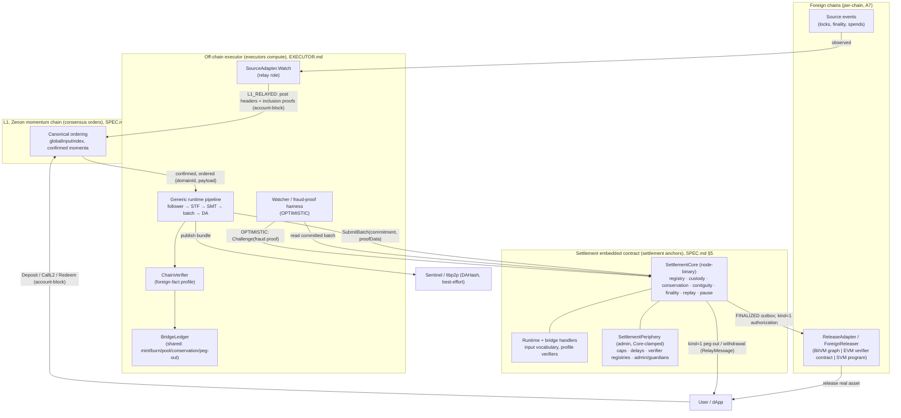
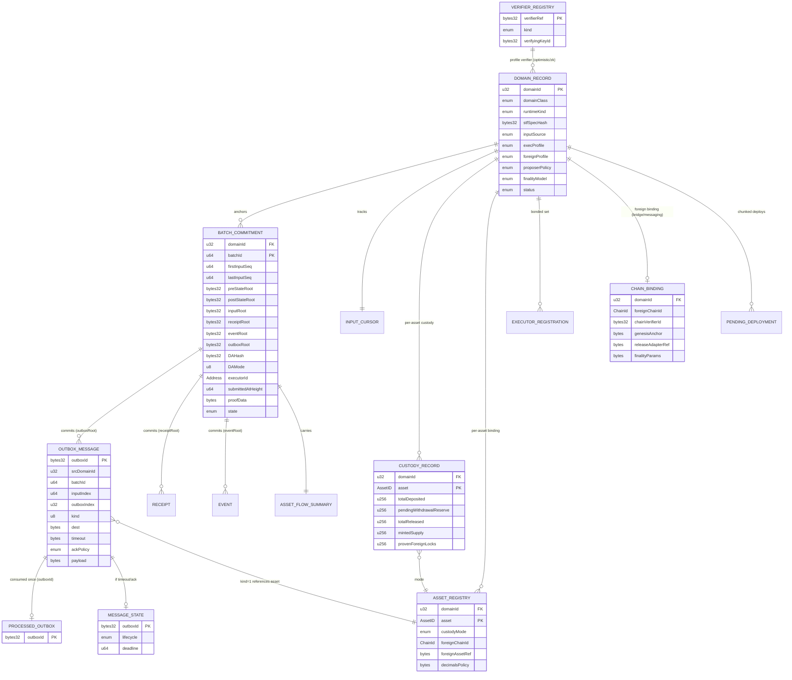
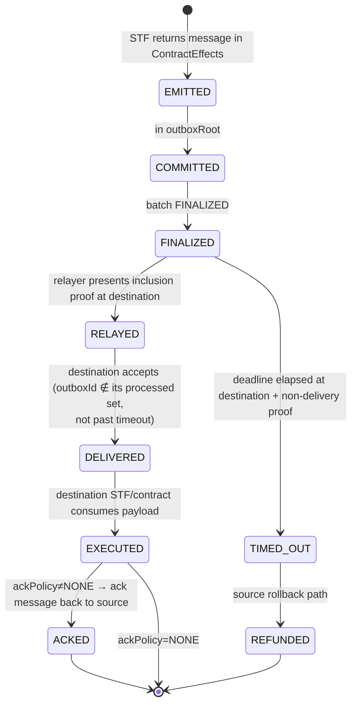

# Generalized Bridge Framework: Normative Specification

**Document status:** Normative specification for a generalized, multi-chain Bridge Framework. RFC 2119 / RFC 8174 language throughout.
**Version:** 0.2.0 (post-audit revision)
**Changelog:**
- **0.2.0** Audit pass: resolved 5 contradictions with `SPEC.md`, 6 overclaims, and Phase-boundary gaps. Added A12 (DomainRecord schema extension), A13 (ATTESTATION-quorum proofData), A14 (outbox encoding extension). Resolved `MINTED` `AssetID` encoding (representation tokens are ZTS on L1; A6 adds issuance-authority gate, not a new encoding). Narrowed wire-compatibility claim to batch commitments only; outbox/DomainRecord/AssetFlowSummary require versioned extensions. Introduced OPEN DESIGN (OD-1 through OD-4) as a category distinct from OPEN PARAMETER for items requiring mechanism design, not just value choices. Scoped `MINTED` as a significant Settlement upgrade. Marked `VerifierRegistry` dispatch interface, `EXTERNAL_OBSERVED` completeness predicate, and timeout proof-of-non-delivery as OPEN DESIGN. Defined `ForeignClaim` and related types as OPEN TYPE per chain. Clarified `VerifyConsensusProof` replaces the three-method sequence for `ZK_CONSENSUS`.
- **0.1.0** Initial draft.
**Relationship to the Project Zenon off-chain-execution corpus (controlling authority, in priority order):**

- `SPEC.md` v1.3.0: Phase 1 off-chain WASM execution, bonded attestation, on-chain conservation. The normative contract for every consensus-visible byte; **governs on any conflict**.
- `ARCHITECTURE.md`: Phase 1 design companion (informative).
- `EXECUTOR.md` v0.2.0: executor binary architecture (relay / executor / watcher roles, plugin seam).
- `BRIDGE-FRAMEWORK-RESEARCH.md`: the shared `BridgeLedger` / `ChainVerifier` / `ForeignReleaser` model (research, non-normative).
- `GENERALIZING-TO-OTHER-CHAINS.md`: the smart-contract-chain integration playbook (research, non-normative).

External bridge systems (IBC, Hyperlane, LayerZero V2, Wormhole, Chainlink CCIP, Axelar, Polkadot XCM, zkBridge and related academic work) are cited **as secondary design references only** and are never controlling. Where the primary corpus and an external system differ, the primary corpus governs the generalized core; the external system is treated as a design reference and labelled as such (Appendix C).

This document is **forward-looking**. It generalizes the Bridge Framework beyond the Phase 1 single-runtime, single-executor, `L1_NATIVE`-only shape. It introduces capabilities (multiple domains, relayed and observed input sources, multi-executor sets, the optimistic and validity execution profiles, foreign light-client and zk-consensus verification, cross-chain messaging with timeouts and acknowledgements, and minted bridge assets) that are **reserved, deferred, or out of scope in Phase 1**. Each such capability is tagged with the assumption it depends on (Assumptions Register, below) and the phase that activates it. **No statement in this document relaxes any Phase 1 on-chain rule that is currently active under `SPEC.md`.**

---

## 0. Conventions, tags, and the Assumptions Register

### 0.1 Requirement keywords

The key words MUST, MUST NOT, REQUIRED, SHALL, SHALL NOT, SHOULD, SHOULD NOT, RECOMMENDED, MAY, and OPTIONAL are to be interpreted as described in RFC 2119 and RFC 8174 when, and only when, they appear in all capitals.

### 0.2 Content-class tags

Every requirement, parameter, and forward hook is classified into exactly one of four content classes, sharply distinguished per the brief:

- **Normative.** A binding invariant expressed with RFC 2119 keywords. An implementation is non-conformant if it violates a Normative statement.
- **Implementation guidance.** Non-binding engineering advice. An implementation MAY diverge if it preserves all Normative invariants.
- **Deployment parameter.** A value fixed per deployment, bounded by Normative hard bounds. Recorded but not fixed here.
- **Deferred.** A capability or decision explicitly assigned to a later phase or to a future versioned upgrade.

In addition:

- **OPEN PARAMETER.** A value or decision this document deliberately does not fix. An integrator MUST choose it before deployment; choosing it is a precondition of conformance for the affected component. Open parameters are collected in §22. Where an open parameter is owned by the party standing up a domain, it is assigned to **Domain Settlement implementers**.

`>`-blockquotes are *Informative* unless they contain an explicit Normative statement.

### 0.3 Source-grounding tags

- **[CORE]**: a requirement imposed by `SPEC.md`; reproduced here for the generalized framing. The on-chain protocol governs.
- **[FRAMEWORK]**: a requirement this document adds for the generalized Bridge Framework. It MUST NOT contradict any `SPEC.md` rule; where it would, the `SPEC.md` rule wins and the [FRAMEWORK] rule is void for that case.

### 0.4 The governing invariant

The whole framework is organized around one separation, inherited verbatim from `SPEC.md` and `ARCHITECTURE.md`:

> **Consensus orders. Executors compute. Settlement anchors.**

Every mechanism in this document is assigned to exactly one of these three concerns. L1 (the Zenon momentum chain) owns the canonical ordering and finality of inputs. The off-chain executor owns computation. The Settlement embedded contract owns escrow, custody accounting, and commitment recording. **No layer does another layer's job.** This is the property that makes the proof ladders of §6 additive rather than a rewrite.

A second inherited invariant, from `EXECUTOR.md`:

> **The runtime is generic. The domain is a plugin. State is always replayable from L1-anchored data.**

### 0.5 Assumptions Register

This document assumes the following. Each assumption is **false or reserved in Phase 1** unless marked active. A capability that depends on an assumption is non-deployable until that assumption holds.

| # | Assumption | Status in Phase 1 | Depends-on note |
|---|---|---|---|
| **A1** | `RegisterDomain` is open to more than the single WASM domain. | Administrator decision; closed by default (`SPEC.md` §3, §6). | Multiple bridge instances. |
| **A2** | `L1_RELAYED` and `EXTERNAL_OBSERVED` input sources are activatable. | Reserved; Core MUST reject them under the Phase-1 profile (`SPEC.md` §6.1). | Every external bridge. |
| **A3** | A multi-member executor set under `RANDOM_BACKUP` (or stronger) is active. | Reserved; Phase 1 is `SINGLE`, size 1 (`SPEC.md` §6.2, §22). | Liveness beyond one executor. |
| **A4** | A fraud-proof referee that re-runs `Apply` and a dispute/slash game exist on-chain. | Deferred to Phase 2 (`SPEC.md` §1, §30). | `OPTIMISTIC` execution profile. |
| **A5** | A validity-proof verifier registry exists on-chain, and `proofData` is honoured. | Deferred to Phase 3; `proofData` MUST be empty in Phase 1 (`SPEC.md` §19, §24). | `ZK_VALIDITY` execution profile. |
| **A6** | Bridge-token issuance authority exists: Settlement MAY mint and burn a non-ZTS-backed representation asset gated on finalized batches. | Not in Phase 1 (`SPEC.md` §18.1: L1-backed assets only; `GENERALIZING-TO-OTHER-CHAINS.md` §3 step 7). | `MINTED` custody mode (remote-backed assets). |
| **A7** | Per-chain foreign-side contracts (the `ForeignReleaser`) are deployable, auditable, and upgrade-governed on each target chain. | Out of scope of the Zenon-side spec (`BRIDGE-FRAMEWORK-RESEARCH.md` §3.2). | Peg-out on every chain. |
| **A8** | A ZK-friendly SMT hash migration MAY be required to make the state tree efficiently provable. | Deferred to Phase 3 as a one-time versioned migration (`SPEC.md` §13.2). | `ZK_VALIDITY`, `ZK_CONSENSUS`. |
| **A9** | The Zenon L1 momentum chain provides canonical input ordering and input finality as given. | Active (`SPEC.md` §3, §4). | Everything. |
| **A10** | Zenon L1 has no on-chain `k`-of-`n` multisig primitive; Settlement Periphery is governed by a single administrator with guardian recovery and Core hard bounds. | Active (`SPEC.md` §23). | Governance model. |
| **A11** | The canonical SMT path-native API (`RootOfLeaves` / `ProveByPath` / `VerifyProofByPath` / `VerifyAbsenceByPath`) is available to the executor (landed in `common/trie` or shipped as a local driver). | PREREQUISITE, not yet in the branch (`EXECUTOR.md` §18 P-8). | Executor state store, watcher, referee. |
| **A12** | The Settlement `DomainRecord` schema includes the generalized fields (`domainClass`, `execProfile`, `foreignProfile`, `profileConfig`, `chainBinding`, `finalityModel`), activated via a spork-gated node release. These are Settlement Core additions (semantics-defining, folded into `stfSpecHash`); they are constrained to their Phase 1 default values until the spork activates. | Not in Phase 1; requires a spork-gated `znnd` release. | Every bridge/messaging domain; A1 depends on this. |
| **A13** | A `protocol_version` bump enables non-empty `proofData` for quorum-attestation payloads under the `ATTESTATION` execution profile. | Not in Phase 1; `proofData` MUST be empty in Phase 1 (`SPEC.md` §19, §24). Phase 3 reserves `proofData` for validity proofs; this assumption gates an intermediate use before Phase 3. | `ATTESTATION`-quorum sub-variant. |
| **A14** | An `outbox_version` bump introduces the extended outbox encoding with `Destination` (tagged union), `Timeout`, and `ackPolicy` fields. | Not in Phase 1; Phase 1 outbox encoding is `SPEC.md` §27.4 exactly. | Cross-chain messaging (§7.1, §7.6), foreign-chain peg-out destinations. |

---

## 1. Abstract and scope

### 1.1 Abstract

This document specifies a generalized Bridge Framework: a chain-neutral set of abstractions, data structures, state machines, and invariants for moving **messages** and **assets** between the Zenon settlement layer and arbitrary external chains, EVM and non-EVM, under multiple, independently selectable security profiles.

The framework reuses the Zenon-side ledger logic once and exposes a small number of per-chain seams. Concretely, the mint and burn accounting, the collateral/pool bookkeeping, the conservation invariant, the peg-out authorization object, replay protection, and the fraud and slash state machines are **shared** across every bridged chain; the foreign-chain light client, the foreign-side release mechanism, the representation-asset identity, and the real liquidity are **per-chain** (`BRIDGE-FRAMEWORK-RESEARCH.md` §1). The shared logic is a library that domain plugins invoke inside their state-transition function; it is not a second settlement layer.

The framework preserves, without exception, the Phase 1 separation of concerns ("Consensus orders. Executors compute. Settlement anchors."), domain isolation with per-domain custody accounting, deterministic replay from canonical inputs plus committed bundles, the separation of runtime semantics from custody and settlement semantics, and a pluggable proof profile. It does not assume any specific target chain, latency budget, or security budget; every such choice is an OPEN PARAMETER or a Deployment parameter.

### 1.2 In scope

1. A generalized **domain model** in which each bridge or messaging channel is one domain, isolated from every other domain's custody.
2. **Two orthogonal verification ladders**: an *execution* ladder (`ATTESTATION` → `OPTIMISTIC` → `ZK_VALIDITY`) that secures the correctness of a batch's state transition, and a *foreign-fact* ladder (`COMMITTEE` → `LIGHT_CLIENT` → `ZK_CONSENSUS`) that secures the truth of an external-chain event. Each ladder is per-domain, pluggable, and additive (§6).
3. A chain-neutral **shared `BridgeLedger`** state machine for mint/burn/pool/conservation/peg-out, plus the **two per-chain seams** `ChainVerifier` (read: foreign → Zenon) and `ReleaseAdapter` (write: Zenon → foreign) (§7).
4. Canonical **identifiers, wire formats, data model, and state machines** for domains, batches, messages, proofs, assets, and release operations (§8, §9, §10).
5. **Cross-chain messaging** with replay protection, timeouts, acknowledgements, and refunds, generalizing the Phase 1 asynchronous outbox (§7.1, §10.4).
6. **Asset movement** under both custodial-escrow (Phase 1 native ZTS) and remote-backed-mint (representation-asset) custody modes, with the conservation invariants for each (§7.2, §13).
7. A **fee and payment model** spanning source-chain inclusion, off-chain execution, and destination-chain delivery (§7.8).
8. **Failure handling, recovery, testing, verification, deployment, and migration** strategies (§15 through §20).

### 1.3 Out of scope

- The internal consensus mechanics of Zenon L1 or of any foreign chain. Both are consumed as given (`SPEC.md` §2.1).
- The cryptographic construction of any specific zero-knowledge proving system. The framework fixes the *extension points* a proof system plugs into, never the curve, field, or circuit (§6.4, OPEN PARAMETER).
- Synchronous cross-domain or cross-chain calls. All cross-domain interaction is asynchronous (outbox → finalize → relay → inbox), per `SPEC.md` §17.1.
- The implementation of the foreign-side `ReleaseAdapter` contracts. The framework defines the *authorization object* they consume and the invariants they MUST satisfy, never their code (`BRIDGE-FRAMEWORK-RESEARCH.md` §3.2; A7).
- Foreign-chain custody key management (for example BTC threshold signing). This is a key-custody problem outside the executor binary's scope (`EXECUTOR.md` §12).
- Liquidity provisioning, market-making, and fast-exit LP economics. These are a UX layer, not a trust dependency (`GENERALIZING-TO-OTHER-CHAINS.md` §3 step 9).

### 1.4 Relationship between the framework and a single bridge

Class versus instance (`BRIDGE-FRAMEWORK-RESEARCH.md` §1):

```
BridgeFramework                ← the shared template (this document)
  ├─ EXECUTION  domain         ← Phase 1 WASM contracts (SPEC.md), the base case
  ├─ MESSAGING  domain         ← pure cross-chain message passing, no custody
  ├─ BtcBridge  domain         ← own zBTC, BitVM/covenant ReleaseAdapter, SPV ChainVerifier
  ├─ EthBridge  domain         ← own zETH/zERC-20, contract ReleaseAdapter, PoS LIGHT_CLIENT
  └─ SolBridge  domain         ← own zSOL/zSPL, program ReleaseAdapter, ZK_CONSENSUS ChainVerifier
```

Same shared code, separate state, separate liquidity, separate foreign contracts. Domain isolation (`SPEC.md` §6) guarantees a fault in one instance can never reach another instance's custody.

---

## 2. Trust model and threat model

### 2.1 The load-bearing honesty statement

> **A bridge domain is exactly as trustless as the weaker of its execution profile and its foreign-fact profile, and no more. This MUST be communicated to users and integrators without qualification or obfuscation.** [CORE], generalizing `SPEC.md` §1 and §26.

There is no single global trust assumption for the framework. Each domain carries its own profile pair and therefore its own trust model (`BRIDGE-FRAMEWORK-RESEARCH.md` §7). The three permanent safety rails of the corpus are restated here as Normative invariants and mapped to the three independent trust dimensions:

- **Rail 1: STF-verifiable does not mean Settlement-verified.** Under execution profile `ATTESTATION`, Settlement records `preStateRoot`/`postStateRoot` but **MUST NOT** verify them; their correctness rests on the bonded executor set, not on the chain. Settlement verifies execution only under `ZK_VALIDITY` (a validity proof) or, conditionally and only when challenged, under `OPTIMISTIC` (a fraud proof). [CORE] (`SPEC.md` §1, §5, §26.)
- **Rail 2: EXTERNAL_OBSERVED commits what was observed, not what was true.** A commitment binds the inputs the executor consumed; whether those inputs reflect a true foreign event depends on the *foreign-fact profile*. Under `COMMITTEE` the truth rests on a relayer/attester quorum; under `LIGHT_CLIENT` it is verified against foreign consensus inside the STF; under `ZK_CONSENSUS` it is succinctly proven. [FRAMEWORK], generalizing `SPEC.md` §6.1.
- **Rail 3: Commitment is not availability.** `DAHash` commits a bundle; it does **not** guarantee the bundle is retrievable. Data-availability enforcement is a separate, later mechanism. An unavailable bundle reduces the affected batch to reliance on executor honesty regardless of any proof profile. [CORE] (`SPEC.md` §20.)

### 2.2 What is guaranteed on-chain, independently of executor honesty

Generalizing `SPEC.md` §1, the following hold for every domain in every profile, enforced by Settlement Core:

1. **Aggregate custody solvency per (domain, asset).** Settlement MUST NOT authorize outflow exceeding the domain's accounted inflow for that asset. The exact predicate depends on the custody mode (§7.2, §13): for `ESCROW`, `totalReleased + pendingWithdrawalReserve ≤ totalDeposited`; for `MINTED`, mint backing and burn authorization bounds (§13.7).
2. **Domain isolation.** All custody, commitment, deposit, withdrawal, and replay accounting MUST be keyed by `domainId` (and by `(domainId, asset)` for asset accounting). A faulty or dishonest domain can never pay out beyond its own inflow, and one domain's executor can never reach another domain's custody.
3. **Canonical input order fixed by L1.** For `L1_NATIVE` and `L1_RELAYED` domains, the executor cannot reorder, skip, or privately insert inputs; omission produces a non-contiguous batch rejected on-chain.
4. **Batch chaining, contiguity, withdrawal delay, per-batch caps, and public commitment visibility** during the finality window.
5. **At-most-once message processing** via the `processedOutbox` replay set.

### 2.3 What is NOT guaranteed, by profile

| Property | `ATTESTATION` exec | `OPTIMISTIC` exec | `ZK_VALIDITY` exec |
|---|---|---|---|
| Per-account / per-message correctness verified on-chain | No (executor honesty) | Only if a watcher challenges in time (1-of-N honest + DA) | Yes (proof) |
| On-chain verification of `postStateRoot` | No | On challenge | Yes |
| Slashing for incorrect execution | No | Yes, on successful fraud proof | N/A (invalid proof cannot finalize) |

| Property | `COMMITTEE` foreign | `LIGHT_CLIENT` foreign | `ZK_CONSENSUS` foreign |
|---|---|---|---|
| Foreign event truth established by | Attester quorum honesty | Foreign consensus + verifier correctness | Succinct proof + verifier correctness |
| Tolerable adversary | < quorum threshold colluding | < foreign-chain safety threshold | < foreign-chain safety threshold |

### 2.4 Adversary model

The framework defends against an adversary that MAY: (a) control the executor (propose arbitrary roots) up to the limit of the active execution profile; (b) control any relayer (relaying is permissionless and trustless: a relayer can only withhold, never forge, since the STF re-validates every datum, `EXECUTOR.md` §12); (c) reorganize a foreign chain up to its stated finality bound; (d) withhold a DA bundle; (e) submit malformed or replayed inputs, proofs, and messages; (f) attempt to manipulate fee quotes; (g) compromise a single foreign-side verifier contract; and (h) attempt cross-domain custody reachability. The adversary MAY NOT: break the hash function (SHA3-256), forge L1 momentum finality, exceed a foreign chain's stated safety threshold, or compromise the Settlement Core node-binary logic (changeable only by a sanctioned release, `SPEC.md` §5.2). The administrator is **partially trusted**: bounded by time-locks, guardian recovery, and Core hard bounds (§18; `SPEC.md` §23), and explicitly enumerated as a defended-against compromise target (§13.10).

### 2.5 Trust-minimization direction

The two ladders are strict strengthenings. Migrating a domain along either ladder removes trust without changing the Zenon-side ledger, the commitment format, or the custody accounting (§6.6, §20.4). The economic case for the shared framework is precisely that the strengthening is written once and inherited by every instance.

---

## 3. Goals, non-goals, and open parameters

### 3.1 Goals

- **G1.** Reuse the Zenon-side bridge ledger across all chains; make adding a chain cost a `ChainVerifier`, a `SourceAdapter`, a `ReleaseAdapter`, and an asset wiring, never a new settlement layer (`BRIDGE-FRAMEWORK-RESEARCH.md` §9).
- **G2.** Support EVM and non-EVM targets without collapsing either into the other. The framework MUST NOT assume EVM semantics, EVM account models, or a single proof system.
- **G3.** Make the security profile a per-domain, pluggable choice with explicit, enumerated extension points, and a clean additive migration path.
- **G4.** Preserve deterministic replay: any party MUST be able to reconstruct a domain's state from L1-anchored data alone, with no live foreign-chain access (`EXECUTOR.md` §10).
- **G5.** Keep L1 cost bounded and constant per batch: L1 stores roots and bounded metadata only (`SPEC.md` §3).
- **G6.** Make every failure mode explicit, fail-closed, and recoverable from a finalized anchor (`EXECUTOR.md` §14, §15).

### 3.2 Non-goals

- **NG1.** Trustless execution in the attestation profile. That profile is bonded attestation, full stop (Rail 1).
- **NG2.** Synchronous cross-domain or cross-chain calls (`SPEC.md` §17.1).
- **NG3.** A protocol-level per-account balance ledger. Per-account balances are contract/STF state; Settlement bounds only the aggregate (`SPEC.md` §18.1a).
- **NG4.** A universal proof object that every foreign verifier consumes unchanged. The framework permits per-releaser proof encodings (§6.4, OPEN PARAMETER; `BRIDGE-FRAMEWORK-RESEARCH.md` §8 Q2).
- **NG5.** Fixing latency or security budgets. These are deployment choices.
- **NG6.** Liquidity, fronting, and LP economics as a trust dependency.

### 3.3 Open parameters (collected in full in §22)

The framework deliberately does not fix, among others: the foreign-chain confirmation/finality predicate per chain; the attester set size and threshold per `COMMITTEE` domain; the challenge-window duration per `OPTIMISTIC` domain; the proving system, curve, and verifying-key management per zk domain; the representation-asset decimals-normalization policy; the timeout and acknowledgement windows per messaging channel; the fee-quote denomination and refresh policy; and the foreign verifier-contract upgrade governance. Each is marked OPEN PARAMETER at its point of use and assigned an owner.

---

## 4. Definitions and terminology

A consolidated glossary is Appendix A. The terms that carry Normative weight are defined here.

- **Domain.** The unit Settlement anchors: a tuple `{runtime, STF spec, input source, execution profile, foreign-fact profile, bonded executor set, state-root lineage, optional foreign-chain binding}`. Each bridge or messaging channel is one domain. Identified by `domainId : u32`. (`SPEC.md` §6.)
- **Settlement.** The runtime-agnostic Zenon embedded contract that holds escrow, maintains the domain registry, and records batch commitments. Split into **SettlementCore** (node-binary, spork-gated) and **SettlementPeriphery** (administrator-tunable storage, Core-clamped). (`SPEC.md` §5.)
- **Executor.** The bonded off-chain binary that consumes the canonical input stream for its domain, runs the STF, and submits batch commitments. (`SPEC.md` §22; `EXECUTOR.md` §4.)
- **Watcher.** The same binary in compare mode: reproduces the proposer's roots and surfaces divergence; under `OPTIMISTIC`, emits a fraud proof. (`EXECUTOR.md` §11.)
- **Relayer (relay role).** A permissionless, trustless pump that posts external-source data to L1 as Settlement account-blocks (`L1_RELAYED` / `EXTERNAL_OBSERVED`), and that carries finalized outbox messages to their destination. A relayer can only withhold; it can never forge, because the STF and Settlement re-validate everything (`EXECUTOR.md` §12).
- **STF (state-transition function).** The pure, deterministic function `Apply(state, input) → effects` a domain plugin implements. No clock, RNG, network, or environment (`SPEC.md` §7.3; `EXECUTOR.md` §7).
- **`BridgeLedger`.** The shared, chain-neutral state machine (mint/burn/pool/conservation/peg-out/replay/fraud) that a bridge domain's `Apply` delegates to. A library, not a layer (`BRIDGE-FRAMEWORK-RESEARCH.md` §4).
- **`ChainVerifier`.** The per-chain read seam: verifies foreign headers/finality and foreign-event inclusion inside `Apply`. Implements the foreign-fact profile (§7.3).
- **`SourceAdapter`.** The per-chain relay seam: watches a foreign chain and decides what to post to L1 (`EXECUTOR.md` §7 `Source`).
- **`ReleaseAdapter` (a.k.a. `ForeignReleaser`).** The per-chain write seam, living **on the foreign chain**: consumes a finalized Zenon peg-out authorization and releases real assets (`BRIDGE-FRAMEWORK-RESEARCH.md` §3.2).
- **Execution profile.** How a batch's STF correctness is secured: `ATTESTATION` | `OPTIMISTIC` | `ZK_VALIDITY`. The Phase 1→2→3 ladder, lifted to a per-domain dimension (§6.3).
- **Foreign-fact profile.** How a foreign-chain event's truth is established: `NONE` | `COMMITTEE` | `LIGHT_CLIENT` | `ZK_CONSENSUS` (§6.4).
- **Input source.** Where a domain's inputs originate and from where canonical order, DA, and censorship-resistance derive: `L1_NATIVE` | `L1_RELAYED` | `EXTERNAL_OBSERVED` (`SPEC.md` §6.1).
- **Custody mode.** How an asset is represented on Zenon: `ESCROW` (real ZTS in Settlement custody) | `MINTED` (a representation asset backed by attested foreign collateral) (§7.2).
- **Peg-in.** Asset movement foreign → Zenon: prove a foreign lock, then credit or mint on Zenon.
- **Peg-out.** Asset movement Zenon → foreign: burn or debit on Zenon, then authorize a foreign release via a `kind=1` outbox object.
- **Outbox message.** The asynchronous effect object a contract or the runtime emits, committed in `outboxRoot`, relayed after finality. `kind=0` is L2/cross-domain delivery; `kind=1` is an L1/foreign withdrawal authorization (`SPEC.md` §17.2, §27.4).
- **Batch.** A contiguous slice of a domain's canonical input subsequence, `≤ MaxBatchInputs`, summarized by one batch commitment (`SPEC.md` §4.6, §19).
- **Finality (of a batch).** The point at which withdrawals/releases MAY be authorized: elapsed withdrawal delay (`ATTESTATION`), elapsed challenge window with no successful challenge (`OPTIMISTIC`), or verified validity proof (`ZK_VALIDITY`) (§10.2).
- **Conservation invariant.** The per-(domain, asset) custody-solvency predicate Settlement enforces after every mutating operation (§13.7).

---

## 5. System model

### 5.1 Layers and actors

The framework spans three trust layers and one off-chain delivery substrate, exactly as Phase 1, extended with foreign chains and their adapters.

1. **L1: Zenon momentum chain (consensus orders).** Provides total canonical ordering of all inputs and input finality; anchors Settlement storage (including all batch-commitment roots) through `ChangesHash` with no momentum-format change. The sole source of truth for canonical input order and input finality. MUST NOT execute any STF. (`SPEC.md` §3, §4; `ARCHITECTURE.md` §3.)
2. **Settlement embedded contract (settlement anchors).** Domain-agnostic Core plus per-runtime handlers. Holds escrow, maintains the domain registry, records commitments, enforces custody and conservation, replay protection, finality, and pause. (`SPEC.md` §5.)
3. **Off-chain executor (executors compute).** One generic runtime hosting per-domain plugins, runnable as relay, executor, or watcher. Produces `ExecutionResult`s, DA bundles, `DAHash`, and batch commitments. (`EXECUTOR.md` §1.)
4. **Foreign chains and their adapters.** Each bridged chain runs a `ReleaseAdapter` (consumes Zenon peg-out authorizations) and is read by a `ChainVerifier` inside the executor's STF. The executor's relay role posts foreign data to L1 via a `SourceAdapter`.
5. **DA substrate (best-effort).** Sentinel/libp2p nodes serve bundles by `DAHash`; not consensus-critical in the base profile (`SPEC.md` §20).

### 5.2 Generalized architecture (Mermaid flowchart)



### 5.3 The single most important structural correction

> **The withdrawal/peg-out trigger on Zenon is shared, not per-chain.** Getting an asset out is always "burn or debit on Zenon → Settlement commits a `kind=1` outbox authorization → after finality, a relayer carries it to the destination." There is **no** per-chain withdrawal contract *on Zenon*. The per-chain contract is the **consumer** of that authorization and lives **on the foreign chain** (`BRIDGE-FRAMEWORK-RESEARCH.md` §2). This is what lets a single set of Settlement rules serve BTC, ETH, SOL, and Zenon-native withdrawals identically.

### 5.4 Determinism and replay boundary

[CORE] L2 state MUST be a pure function of L1-anchored data (canonical inputs + commitments + DA bundles). The executor MUST NOT read a live foreign source to *reconstruct* state; foreign reads exist only to *propose* (relay role) and to *watch*. A genesis syncer replays consumed, committed inputs through `Apply` to byte-identical state with no foreign-network access (`EXECUTOR.md` §10). For `L1_RELAYED` domains this is automatic: the relayed headers and proofs are ordinary L1 inputs. For `EXTERNAL_OBSERVED` domains the consumed observations MUST be committed (`inputRoot`) and published (`DAHash`), and state MUST be reconstructible from them alone (`SPEC.md` §6.1, §20).

### 5.5 Compatibility-profile space

A domain occupies a point in a five-dimensional configuration space:

```
(inputSource, execProfile, foreignProfile, custodyMode*, proposerPolicy)
   L1_NATIVE       ATTESTATION    NONE          ESCROW         SINGLE
   L1_RELAYED      OPTIMISTIC     COMMITTEE     MINTED         RANDOM_BACKUP
   EXTERNAL_OBSERVED  ZK_VALIDITY  LIGHT_CLIENT                STAKE_WEIGHTED
                                  ZK_CONSENSUS
   (* custodyMode is per-(domain, asset), not per-domain)
```

Phase 1 occupies exactly one point: `(L1_NATIVE, ATTESTATION, NONE, ESCROW, SINGLE)`. Not every combination is meaningful (for example `EXTERNAL_OBSERVED` + `LIGHT_CLIENT` is coherent only if the light client itself is the observation predicate; §6.5 constrains the legal combinations). The dimensions are otherwise independent, and that independence is the generalization.

---

## 6. Domain model and compatibility profiles

### 6.1 The generalized `DomainRecord`

[FRAMEWORK] Settlement storage MUST hold one `DomainRecord` per `domainId`, generalizing `SPEC.md` §6. Fields added beyond the Phase 1 record are marked **(new)**; all Phase 1 fields retain their Phase 1 meaning and constraints.

> **Settlement Core change (A12).** The **(new)** fields below (`domainClass`, `execProfile`, `foreignProfile`, `profileConfig`, `chainBinding`, `finalityModel`) are Settlement Core additions: they are semantics-defining and folded into `stfSpecHash` (§20.2), so they require a spork-gated `znnd` release to activate. Until A12 lands, these fields are constrained to their Phase 1 default values (`domainClass = EXECUTION`, `execProfile = ATTESTATION`, `foreignProfile = NONE`, `chainBinding = null`, `finalityModel = DELAY`) and MUST be rejected if set to any other value. A1 (opening domain registration) depends on A12.

```
DomainRecord {
    domainId        : u32                  // assigned at RegisterDomain
    domainClass     : EXECUTION | BRIDGE | MESSAGING        // (new) informative classification
    runtimeKind     : RuntimeKind          // WASM | ... ; the STF host. Phase 1 = WASM
    stfSpecHash     : bytes32              // pins runtimeKind, VM version, genesis, input-envelope +
                                          //   commitment format, AND the profile bindings below
    inputSource     : L1_NATIVE | L1_RELAYED | EXTERNAL_OBSERVED            // SPEC.md §6.1
    execProfile     : ATTESTATION | OPTIMISTIC | ZK_VALIDITY                // (new) secures the batch STF
    foreignProfile  : NONE | COMMITTEE | LIGHT_CLIENT | ZK_CONSENSUS        // (new) secures foreign facts
    profileConfig   : ProfileConfig        // (new) tagged union, §6.3/§6.4
    chainBinding    : ChainBinding | null  // (new) non-null iff domainClass ∈ {BRIDGE, MESSAGING}
    executors       : ExecutorSet          // bonded set; size 1 in Phase 1
    minExecutors    : u16                  // 1 in Phase 1; below this the domain cannot finalize
    proposerPolicy  : SINGLE | RANDOM_BACKUP | STAKE_WEIGHTED               // SPEC.md §6.2
    valueCaps       : ValueCaps            // per-window per-asset outbox caps; sizes the bond
    finalityModel   : DELAY | CHALLENGE_WINDOW | PROOF_VERIFIED             // (new) derived from execProfile
    status          : ACTIVE | PAUSED
}
```

```
ChainBinding {
    foreignChainId    : ChainId            // canonical foreign-chain identifier (§8.2)
    chainVerifierId   : bytes32            // pins the ChainVerifier implementation (foreign-fact verification)
    genesisAnchor     : Bytes              // light-client checkpoint: header / sync-committee root / bank hash
    releaseAdapterRef : Bytes              // foreign-side ReleaseAdapter identifier (addr / script / graph id)
    finalityParams    : Bytes              // OPEN PARAMETER per chain: confirmation depth / finality predicate
}
```

**Normative:**
- `domainClass`, `inputSource`, `execProfile`, `foreignProfile`, and the identity portion of `chainBinding` (`foreignChainId`, `chainVerifierId`, `genesisAnchor`) are **semantics-defining** and MUST be folded into `stfSpecHash`. Changing any of them is a runtime-semantics change and MUST be performed as a `stfSpecHash` bump under `MinRuntimeUpgradeDelay ≥ WithdrawalDelay` (`SPEC.md` §6, §23). [CORE]
- `chainBinding` MUST be `null` for `EXECUTION` domains and non-null for `BRIDGE` and `MESSAGING` domains. [FRAMEWORK]
- `finalityModel` MUST equal the value mandated by `execProfile` (§10.2): `ATTESTATION → DELAY`, `OPTIMISTIC → CHALLENGE_WINDOW`, `ZK_VALIDITY → PROOF_VERIFIED`. Core MUST reject a `RegisterDomain` whose `finalityModel` disagrees with `execProfile`. [FRAMEWORK]
- **Phase 1 profile (active):** Core MUST accept only `domainClass = EXECUTION`, `inputSource = L1_NATIVE`, `execProfile = ATTESTATION`, `foreignProfile = NONE`, `chainBinding = null`, `executors` size 1, `proposerPolicy = SINGLE`. Every other value is reserved and MUST be rejected while the Phase-1 profile is in force (`SPEC.md` §6.1, §6.2; A1–A5). [CORE]

### 6.2 Input-source classes

[CORE] Every domain MUST declare `inputSource`. The value is binding on how the canonical input stream is established and on the DA and censorship guarantees offered; it MUST be surfaced as part of the domain's trust profile (`SPEC.md` §6.1).

| `inputSource` | Inputs originate as | Canonical order | Data availability | Censorship-resistance |
|---|---|---|---|---|
| `L1_NATIVE` | Settlement account-blocks | L1 momentum order | Inherited from L1 | Native force-inclusion |
| `L1_RELAYED` | External data posted to Settlement as account-blocks | L1 momentum order of the relaying blocks | Inherited from L1 | Permissionless relay + force-inclusion |
| `EXTERNAL_OBSERVED` | Observations read directly by the executor | External order under a domain-pinned finality predicate, committed by the executor | The external system + the published bundle (not L1-guaranteed) | Domain completeness predicate, fraud-enforced |

**Normative:**
- The input-source taxonomy is a three-property classification: **(order source, DA source, censorship mechanism)**. Each class fixes all three. Any future input-source class MUST specify all three properties explicitly; adding one is a `stfSpecHash`-level change. [FRAMEWORK] This document does not define a fourth class; doing so is OPEN PARAMETER.
- For `L1_RELAYED`, the domain STF MUST establish input validity and canonicity (foreign-chain linkage, proof-of-work or finality, confirmation depth) inside `Apply` and MUST reject any relayed datum that does not extend the domain's canonical view; relaying MUST be permissionless. [CORE]
- For `EXTERNAL_OBSERVED`, the domain MUST pin a deterministic finality/confirmation predicate in `stfSpecHash`; consumed observations MUST be committed (`inputRoot`) and published (`DAHash`); and L2 state MUST be reconstructible from the committed inputs and bundle alone. The weaker, non-L1 DA guarantee MUST be disclosed (Rail 3). The "fraud-enforced" completeness in the table above depends on A4 (the fraud-proof referee); without it, completeness is enforced only by watcher comparison without on-chain recourse. The completeness predicate itself (how to define "all canonical external items" for a given source) is an **OPEN DESIGN** question, not just an OPEN PARAMETER; it is source-specific and MUST be defined per domain. [CORE]
- For all classes the executor MUST NOT reorder, skip, or privately insert inputs; for external sources this is a **completeness** requirement enforced by per-domain input-sequence contiguity (`SPEC.md` §4.6, §4.7). [CORE]

> *Informative.* `L1_RELAYED` makes a foreign bridge a strict special case of an internal domain: relayed headers + inclusion proofs receive a `globalInputIndex`, inherit L1 DA, and are secured by the §4/§19 machinery; the only new logic is the `ChainVerifier` inside the STF. `EXTERNAL_OBSERVED` exists only for sources too data-heavy to relay (for example full Solana vote data), trading L1-anchored DA for executor-attested, fraud-checked input selection (`SPEC.md` §6.1).

### 6.3 The execution profile ladder (secures the batch STF)

[FRAMEWORK] `execProfile` determines how Settlement treats `preStateRoot`/`postStateRoot`, what `SubmitBatch` verifies, the finality model, and the content of the reserved `proofData` field (`SPEC.md` §19). This is the Phase 1→2→3 ladder of `SPEC.md` §2.2 lifted to a per-domain dimension.

```
ProfileConfig (execProfile arm) :=
  ATTESTATION  { attesterThreshold : AttesterPolicy }     // single-bonded (Phase 1) or quorum (A13)
  OPTIMISTIC   { challengeWindow : u64 (heights),         // ≥ WithdrawalDelay floor
                 fraudVerifierRef : bytes32 }             // referee registry entry (A4)
  ZK_VALIDITY  { validityVerifierRef : bytes32,           // verifier registry entry (A5)
                 verifyingKeyId : bytes32,
                 publicInputSchema : bytes32 }
```

| `execProfile` | `SubmitBatch` verifies | `proofData` carries | Finality | On-chain correctness | Penalty |
|---|---|---|---|---|---|
| `ATTESTATION` | Proposer entitlement, contiguity, size, `assetFlowSummary`, chaining; **NOT execution** | Empty (single-bonded, Phase 1) or the quorum attestation under `AttesterPolicy` (requires A13: `protocol_version` bump) | `DELAY` (withdrawal delay) | None (Rail 1) | Process-fault only in Phase 1; bond at risk via fraud proof once `OPTIMISTIC` is enabled |
| `OPTIMISTIC` | As above, plus opens a challenge window | Empty at submit; fraud proof supplied later via `Challenge` | `CHALLENGE_WINDOW` | On challenge: referee re-runs `Apply` for the single disputed input (`SPEC.md` §4.6, §13.5.1) | Bond slashed on successful fraud proof (A4) |
| `ZK_VALIDITY` | As `ATTESTATION`, plus verifies the validity proof against `verifyingKeyId` before acceptance | The SNARK over the batch transition (and optionally foreign consensus) | `PROOF_VERIFIED` (MAY be immediate) | Full (the proof) | An invalid proof cannot finalize |

**Normative:**
- Under `ATTESTATION`, Settlement MUST NOT verify execution correctness (Rail 1). Under `ZK_VALIDITY`, Settlement MUST verify the validity proof before a batch enters its finalized state and MUST reject a batch whose proof does not verify against the registered `verifyingKeyId`. Under `OPTIMISTIC`, Settlement MUST verify a submitted fraud proof by the referee procedure and, on success, MUST reject the challenged batch and slash the proposer's bond. [FRAMEWORK / CORE]
- A single batch transition MUST satisfy `postStateRoot = F(preStateRoot, input_data, code_hash)` in every profile; the profile changes only *who checks it and when*, never the function (`SPEC.md` §17.1 invariant). [CORE]
- The fraud-proof referee MUST re-run the identical canonical applier (`SPEC.md` §13.5.1), including the deposit-settlement step (`SPEC.md` §18.5 forward hook), so that "the executor ran the wrong code/version" is ordinary state divergence, not a special Settlement failure mode (`SPEC.md` §5.4). [CORE]
- `proofData` MUST be the zero-length encoding under `ATTESTATION`-single-bonded and under `OPTIMISTIC` at submit time; Core MUST reject a non-empty `proofData` outside the profiles and phases that define its contents (`SPEC.md` §19, §24). The `ATTESTATION`-quorum sub-variant, which places a quorum attestation in `proofData`, requires a `protocol_version` bump (A13) and MUST NOT be activated while Phase 1 `proofData` rules are in force. [CORE]

### 6.4 The foreign-fact profile ladder (secures external-chain truth)

[FRAMEWORK] For `BRIDGE` and `MESSAGING` domains, `foreignProfile` determines how the `ChainVerifier` establishes that a foreign event happened and is final. This ladder is **orthogonal** to the execution ladder: it secures the *truth of a foreign fact consumed as input*, not the *correctness of the batch's computation*.

```
ProfileConfig (foreignProfile arm) :=
  NONE         { }                                        // non-bridge EXECUTION domains
  COMMITTEE    { attesterSet : Set<ForeignAttesterId>,    // relayer/oracle quorum
                 threshold : u16 }
  LIGHT_CLIENT { clientKind : LightClientKind,            // PoW | sync-committee | tower-bft | ...
                 finalityRule : bytes32 }                 // OPEN PARAMETER per chain
  ZK_CONSENSUS { consensusVerifierRef : bytes32,          // succinct proof-of-consensus verifier
                 verifyingKeyId : bytes32 }
```

| `foreignProfile` | Foreign truth established by | Implemented in `ChainVerifier` as | Tolerable adversary |
|---|---|---|---|
| `COMMITTEE` | A quorum of foreign attesters signs the foreign event | Threshold-signature check over a relayed attestation | `< threshold` colluding attesters |
| `LIGHT_CLIENT` | Foreign consensus + inclusion verified from relayed headers/proofs | `VerifyHeaderChain` + `VerifyInclusion` + `VerifyFinality` | `< foreign safety threshold` |
| `ZK_CONSENSUS` | A succinct proof of foreign consensus + inclusion | `VerifyConsensusProof` (the fourth primitive, §7.3) | `< foreign safety threshold` + proof soundness |

**Normative:**
- `foreignProfile = NONE` iff `domainClass = EXECUTION`. [FRAMEWORK]
- Under `LIGHT_CLIENT` and `ZK_CONSENSUS`, the `ChainVerifier` MUST reject any relayed datum that does not extend the verified light-client view; a dishonest relayer MUST be unable to advance the foreign view to a state the foreign chain did not reach (Rail 2). [FRAMEWORK]
- The `finalityRule` (`LIGHT_CLIENT`) and the confirmation/finality predicate in `chainBinding.finalityParams` are OPEN PARAMETER per chain and MUST be chosen so that no Zenon-side release ever finalizes over a re-organizable foreign event (§13.5, §14). [FRAMEWORK]

> The two ladders compose. A Bitcoin bridge today is most naturally `(execProfile = OPTIMISTIC, foreignProfile = LIGHT_CLIENT)`: the foreign fact (a BTC lock) is SPV-verified in the STF, while the batch computation is fraud-proven. An Ethereum bridge is `(OPTIMISTIC | ZK_VALIDITY, LIGHT_CLIENT)`. A high-assurance future configuration is `(ZK_VALIDITY, ZK_CONSENSUS)`: both the computation and the foreign consensus are succinctly proven. The framework does not mandate any pairing; it only constrains the legal combinations (§6.5).

### 6.5 Legal combinations and constraints

[FRAMEWORK] Core MUST reject a `RegisterDomain` violating any of:

1. `chainBinding = null` ⟺ `domainClass = EXECUTION` ⟺ `foreignProfile = NONE`.
2. `MESSAGING` domains MUST have `custodyMode` undefined for all assets (no custody) and MUST NOT emit `kind=1` withdrawal authorizations; they emit only `kind=0` cross-domain/cross-chain messages.
3. `inputSource = EXTERNAL_OBSERVED` MUST be paired with `foreignProfile ∈ {LIGHT_CLIENT, ZK_CONSENSUS}` **or** an explicitly disclosed `COMMITTEE` predicate; an `EXTERNAL_OBSERVED` domain whose observation predicate reduces to "the executor says so" with no foreign-fact profile MUST NOT be activated, because it would violate Rail 2 with no compensating verification.
4. `execProfile = ZK_VALIDITY` requires A5 (validity-verifier registry) and MAY require A8 (ZK-friendly SMT hash); Core MUST reject it until both prerequisites are registered.
5. `execProfile = OPTIMISTIC` requires A4 (fraud-proof referee + dispute game); Core MUST reject it until the referee registry entry exists.

### 6.6 Migration path along both ladders (additive)

[FRAMEWORK] Migration along either ladder is a `stfSpecHash` bump under `MinRuntimeUpgradeDelay ≥ WithdrawalDelay`, changing **no** commitment format and **no** custody accounting:

```
exec:    ATTESTATION ─▶ OPTIMISTIC ─▶ ZK_VALIDITY        (SPEC.md Phase 1 ─▶ 2 ─▶ 3)
foreign: COMMITTEE   ─▶ LIGHT_CLIENT ─▶ ZK_CONSENSUS      (relayer quorum ─▶ verified ─▶ proven)
```

- Each step is a **strict strengthening**: the post-migration domain accepts a superset of the security guarantees and a subset of the trust assumptions of the pre-migration domain. [FRAMEWORK]
- The commitment carries `proofData` (empty → fraud-proof references → validity proof) and `executorId` (single → set member) so that no on-chain footprint changes except added Periphery verifier registries (`SPEC.md` §6.2, §19; `ARCHITECTURE.md` §8). [CORE]
- The withdrawal delay MAY shrink along the execution ladder: it is a full delay under `ATTESTATION`, a challenge window under `OPTIMISTIC`, and proof-generation latency (optionally zero) under `ZK_VALIDITY` (`SPEC.md` §21). [CORE]
- A migration MUST NOT alter any finalized root, receipt, or conservation counter, and the replacement's first batch `preStateRoot` MUST equal the last accepted `postStateRoot` for the domain (`SPEC.md` §6.2, §22). [CORE]

---

## 7. Required abstractions

This section defines the framework's abstractions and their typed interfaces. The interfaces are written in Go-flavoured pseudocode for precision; an implementation MAY use any language that preserves the type contracts and the Normative behaviour. Each interface is also referenced from §12.

The plugin seam is unchanged from `EXECUTOR.md` §7: a domain contributes a pure STF, input decoding, a genesis state, and (for external sources) a relay source adapter, and **nothing else**. The Bridge Framework is a **library those plugins share** (`BRIDGE-FRAMEWORK-RESEARCH.md` §5), exactly as `common/trie` is a library both L1 and the executor share. Adding a chain does not change the executor's plugin surface.

### 7.1 Messaging

[FRAMEWORK] The framework generalizes the Phase 1 asynchronous outbox (`SPEC.md` §17) into a cross-domain/cross-chain messaging primitive. All messaging is asynchronous; there are no synchronous cross-domain calls (`SPEC.md` §17.1).

```
Message := {
    srcDomainId   : u32
    srcContractId : bytes32        // bytes32(0) for runtime-emitted messages
    batchId       : u64
    inputIndex    : u64
    outboxIndex   : u32
    kind          : u8             // 0 = cross-domain/cross-chain delivery, 1 = asset withdrawal/peg-out
    dest          : Destination    // §7.1.1
    timeout       : Timeout|null   // §7.5; null = fire-and-forget (Phase 1 semantics)
    ackPolicy     : NONE|ON_DELIVERY|ON_EXECUTION   // §7.6
    payload       : Bytes          // ≤ MaxOutboxPayloadSize; empty for kind=1 (SPEC.md §27.4)
}
```

```
Destination :=
  LOCAL_DOMAIN { domainId : u32 }                          // another Zenon domain's inbox
  FOREIGN_CHAIN { chainId : ChainId ; releaseAdapterRef : Bytes ; recipient : Bytes ; asset : AssetID|null ; amount : u256|0 }
```

**Normative:**
- Every message MUST carry the globally unique `messageId = outboxId = SHA3-256(srcDomainId || batchId || inputIndex || outboxIndex)` (`SPEC.md` §17.3, §27.4). `messageId` is the replay key and the idempotency key for delivery. [CORE]
- A `kind = 1` message MUST have empty `payload` and MUST carry an asset withdrawal/peg-out `Destination` (`SPEC.md` §27.4). A `kind = 0` message MAY carry an arbitrary `payload` to a `LOCAL_DOMAIN` or `FOREIGN_CHAIN` destination. [CORE/FRAMEWORK]
- A `MESSAGING` domain MUST emit only `kind = 0`. [FRAMEWORK]
- Inter-batch total ordering of messages is **Deferred** to Phase 2; in the base profile, replay protection and at-most-once delivery are the only ordering guarantees (`SPEC.md` §17.3). [CORE]

#### 7.1.1 Message lifecycle (summary; state machine in §10.4)

`EMITTED` (in `ContractEffects`) → `COMMITTED` (in `outboxRoot`) → `FINALIZED` (batch finalized) → `RELAYED` (relayer presents proof at destination) → `DELIVERED` / `EXECUTED` (destination consumes) → optionally `ACKED`; or `TIMED_OUT` → `REFUNDED` if undelivered by `timeout`.

### 7.2 Asset representation

[FRAMEWORK] An asset is represented under one of two **custody modes**, recorded per `(domainId, asset)` in an **asset registry** (§8.1). The conservation invariants for each are in §13.7.

| Custody mode | Real asset lives | Zenon-side representation | Peg-in | Peg-out | Requires |
|---|---|---|---|---|---|
| `ESCROW` | Zenon L1 (ZTS) in Settlement custody | the ZTS asset itself | `Deposit` / payable `CallL2` increases `totalDeposited` | `kind=1` outbox releases from custody | Phase 1 native (`SPEC.md` §18) |
| `MINTED` | a **foreign** chain (locked) | a ZTS representation token (zBTC/zETH/zSOL) issued on L1 and placed under Settlement custody; A6 gates mint/burn on finalized bridge batches | proven+finalized foreign lock authorizes a mint | burn authorizes a foreign release via `kind=1` | A6 (issuance authority; significant Settlement upgrade, see below) |

**Normative:**
- Every `AssetID` in both custody modes MUST satisfy the `SPEC.md` §18.1 encoding: the canonical 32-byte encoding of a 10-byte ZTS identifier, bytes `[0:22]` zero, bytes `[22:32]` the ZTS identifier. Settlement MUST reject any `AssetID` with a non-zero byte in `[0:22]`, regardless of custody mode. [CORE]
- A `MINTED` representation token (zBTC, zETH, zSOL) MUST therefore be a ZTS token issued on L1 and placed under Settlement custody. What A6 adds is not a new asset encoding but an **issuance-authority gate**: the right for Settlement to mint and burn this ZTS, gated on finalized bridge-domain batches. From Settlement's perspective, the representation ZTS satisfies the same `AssetID` encoding as any `ESCROW` asset; the difference is in how inflow and outflow are authorized (§13.7). [FRAMEWORK, A6]
- The asset registry MUST bind each `MINTED` `AssetID` to a `(domainId, foreignChainId, foreignAssetRef, decimalsPolicy)` tuple; the binding MUST be injective so there is exactly one representation `AssetID` per real foreign asset per domain. The decimals-normalization policy is OPEN PARAMETER (`GENERALIZING-TO-OTHER-CHAINS.md` §7 Q3). [FRAMEWORK]
- Per-account balances of any asset MUST be contract/STF state; Settlement MUST NOT maintain a per-account balance ledger in any custody mode (`SPEC.md` §18.1a). Value moves between accounts only by STF logic writing its own `StateDiff`. [CORE]
- `MINTED` mint and burn MUST be gated by Settlement issuance authority on a **finalized** batch only; a mint MUST NOT exceed proven, finalized, replay-checked foreign locks, and a foreign release MUST be authorized only against a finalized burn (§13.7). [FRAMEWORK, A6]
- The "lock-and-release versus burn-and-mint" distinction of bridge literature is **directional**: a single domain MAY use lock-and-release in one direction and burn-and-mint in the other. Worked examples B.2 and B.3 show both against the same invariants.

> **Scoping note (MINTED as a Settlement upgrade).** `MINTED` is not a feature flag. It requires: (a) L1 issuance of the representation ZTS; (b) new Settlement storage counters (`mintedSupply`, `provenForeignLocks`, `authorizedForeignRelease`, `burnedSupply`, §13.7); (c) a new `AssetFlowSummary` reconciliation path for mint/burn flows (the Phase 1 `depositCredit`/`withdrawalDebit` reconciliation of `SPEC.md` §18.4 verifies against L1 deposit events, which do not exist for foreign-lock-backed mints; the MINTED reconciliation mechanism is an **OPEN DESIGN** question, not just an OPEN PARAMETER); (d) issuance-authority governance (who may register a MINTED asset binding). A6 therefore names a significant Settlement upgrade, not a single toggle, and is phased accordingly (D-7).

### 7.3 Consensus, finality, and the `ChainVerifier`

[FRAMEWORK] The per-chain read seam. It is the only chain-specific *verification* code, and it implements the foreign-fact profile (§6.4). It is pure and deterministic, witnessed through `StateAccess`, with **no** network access inside `Apply` (`EXECUTOR.md` §10).

```go
// Per-chain foreign-fact verification (read seam, foreign → Zenon).
type ChainVerifier interface {
    // Advance/reorg the light-client header or finality state from relayed data.
    // MUST reject any datum that does not extend the canonical verified view.
    VerifyHeaderChain(headers []byte, state HeaderState) (HeaderState, error)

    // Prove a specific foreign event (lock / spend / log) is included under a verified header.
    VerifyInclusion(evidence []byte, at HeaderState) (ForeignEvent, error)

    // Decide whether a verified event is final enough to act on (chain-specific predicate).
    VerifyFinality(ref ForeignRef, at HeaderState) (bool, error)

    // Foreign-fact profile ZK_CONSENSUS only: verify a succinct proof of foreign
    // consensus + inclusion in one step, replacing the three-method sequence above.
    // For ZK_CONSENSUS domains, VerifyHeaderChain/VerifyInclusion/VerifyFinality
    // SHOULD return ErrUnsupported; for COMMITTEE and LIGHT_CLIENT domains,
    // VerifyConsensusProof MUST return ErrUnsupported.
    VerifyConsensusProof(proof []byte, claim ForeignClaim) (ForeignEvent, error)
}

// Types consumed by ChainVerifier (per-chain; framework-level contracts only).
// HeaderState: the verified light-client state (chain-specific: sync-committee root,
//   PoW tip + difficulty, Tower-BFT bank hash, etc.). OPEN TYPE per chain.
// ForeignEvent: a proven foreign occurrence (lock, spend, log). Contains at minimum:
//   Outpoint (the replay key), ZenonRecipient, Amount, and a Ref for finality checks.
// ForeignRef: a reference to a ForeignEvent's position in the foreign chain (block hash +
//   tx index, slot + log index, etc.), sufficient for VerifyFinality. OPEN TYPE per chain.
// ForeignClaim: the statement a ZK_CONSENSUS proof proves (chain id + block range +
//   event claim). OPEN TYPE per chain and per proving system.
```

**Normative:**
- The four primitives are the complete extension surface for foreign-fact verification. `VerifyConsensusProof` is the fourth primitive added to the research's three (`BRIDGE-FRAMEWORK-RESEARCH.md` §8 Q1) to make `ChainVerifier` expressive for ZK-light-client chains; a `COMMITTEE` or `LIGHT_CLIENT` domain MUST leave it unsupported. [FRAMEWORK]
- A `ChainVerifier` MUST be a pure function of its arguments and the witnessed `StateAccess`; it MUST NOT read a clock, RNG, network, or environment. The relayed `headers`/`evidence` are decoded inputs, never live reads. [CORE]
- Per-chain instantiations (`BRIDGE-FRAMEWORK-RESEARCH.md` §3.1; `GENERALIZING-TO-OTHER-CHAINS.md` §3 step 1):
  - **BTC:** PoW header chain + difficulty + Merkle inclusion + `K` confirmations.
  - **ETH:** sync-committee (or ZK-of-consensus) tracking + Casper FFG finality + Merkle-Patricia receipt/state proof.
  - **SOL:** leader schedule / Tower-BFT vote tracking (or ZK-of-bank) + slot/bank-hash inclusion.

### 7.4 Relayers, validators, executors, watchers

[CORE] Roles are unchanged from `EXECUTOR.md` §4; the framework only generalizes which domains need which role.

| Role | Does | Bonded? | Runs the STF? | Needed for |
|---|---|---|---|---|
| **Relay** | Watches a foreign source (`SourceAdapter`) and posts its data to L1; also carries finalized outbox messages to destinations | No (permissionless) | No | `L1_RELAYED` / `EXTERNAL_OBSERVED` domains; all peg-out delivery |
| **Executor** | Consumes the input sequence, runs the STF, builds and submits batches | Yes (entitled proposer) | Yes | Every domain |
| **Watcher** | Reproduces the proposer's roots, compares, surfaces divergence; under `OPTIMISTIC` emits a fraud proof | Optional bond | Yes | Every domain; required for `OPTIMISTIC` security |

```go
// Per-chain relay seam (external domains only). EXECUTOR.md §7 Source.
type SourceAdapter interface {
    // What to relay to L1 (e.g. BTC headers + inclusion proofs). Permissionless, trustless:
    // the STF re-validates everything, so a dishonest relayer can only withhold.
    Watch(ctx Context) (<-chan RelayPayload, error)
}
```

**Normative:**
- Relaying MUST be permissionless and trustless: the STF (`Apply`/`ChainVerifier`) MUST re-validate every relayed datum and reject anything non-canonical, so withholding is the only available misbehaviour and is defeated by open relay (force-inclusion/completeness, `SPEC.md` §4.2, §6.1; `EXECUTOR.md` §12). [CORE]
- A non-proposing executor-set member SHOULD operate as a watcher; under `OPTIMISTIC`, at least one honest watcher with bundle access is the security assumption (§13.3; `SPEC.md` §6.2). [CORE]
- A single process MAY host multiple domains and MAY run different roles per domain; state and key material MUST be isolated per domain in-process (`EXECUTOR.md` §4). [FRAMEWORK]

### 7.5 Proofs and the `ReleaseAdapter`

[FRAMEWORK] The per-chain write seam, living **on the foreign chain** (A7). The framework defines the authorization object it consumes and the invariants it MUST satisfy; it does **not** implement the adapter.

```go
// Foreign-side consumer of a finalized Zenon peg-out authorization (off-Zenon, per chain).
// Specified as the contract the foreign deployment MUST satisfy, not as executable Zenon code.
type ReleaseAdapter interface {
    // Verify a finalized Zenon peg-out authorization (the kind=1 outbox object + its proof
    // under the domain's execProfile) and release the real foreign asset exactly once.
    Release(authorization PegOutAuthorization, proof ZenonProof) (ReleaseReceipt, error)
}

PegOutAuthorization := {
    domainId   : u32
    outboxId   : bytes32          // = messageId; the foreign-side replay key
    asset      : AssetID
    amount     : u256
    recipient  : Bytes            // foreign-chain address/script
    burnRef    : bytes32          // binds to the finalized burn (receipt/outbox commitment)
}
```

**Normative (obligations on any conformant `ReleaseAdapter` deployment, A7):**
- It MUST release at most once per `outboxId` (foreign-side replay protection mirroring `processedOutbox`); a second `Release` with the same `outboxId` MUST be rejected (`SPEC.md` §17.3; §13.6). [FRAMEWORK]
- It MUST verify the Zenon-side finality and correctness appropriate to the domain's `execProfile`: a finalized-batch inclusion proof of the `kind=1` object under `ATTESTATION`/`OPTIMISTIC` (trust per profile), or a validity proof under `ZK_VALIDITY`. The exact proof object (`ZenonProof`) is per-releaser and is OPEN PARAMETER (`BRIDGE-FRAMEWORK-RESEARCH.md` §8 Q2; `GENERALIZING-TO-OTHER-CHAINS.md` §7 Q1). [FRAMEWORK]
- It MUST release exactly `amount` of `asset` to `recipient` and MUST NOT release on a mismatched or unfinalized authorization. [FRAMEWORK]
- The Zenon side MUST NOT depend on the `ReleaseAdapter`'s liveness for safety: Settlement only emits the authorization; a withheld or buggy releaser delays but cannot over-release, because the authorization is one-per-`outboxId` and conservation-bounded on Zenon (§13.7). [FRAMEWORK]

> Per-chain releaser instantiations (`BRIDGE-FRAMEWORK-RESEARCH.md` §3.2, §6): BTC Tier 1 = BitVM transaction graph + bonded operators (optimistic, 1-of-N); BTC Tier 2 = covenant script verifying the proof in-script (needs a soft fork); ETH/SOL = a verifier contract/program that checks a Zenon burn proof and releases locked collateral directly (lock-and-release, no operator fronting).

### 7.6 Timeouts and acknowledgements

[FRAMEWORK] A generalization beyond Phase 1, which has fire-and-forget outbox with replay protection only. Timeouts and acks are modelled on IBC's `recvPacket` / `acknowledgePacket` / `timeoutPacket` (Appendix C.1, secondary) but expressed against the framework's commitment/finality machinery.

```
Timeout :=
  DEST_HEIGHT { chainId : ChainId ; height : u64 }     // foreign block height deadline
  DEST_TIME   { chainId : ChainId ; unixSecs : u64 }   // foreign timestamp deadline
  SRC_HEIGHT  { height : u64 }                          // Zenon momentum-height deadline (for LOCAL_DOMAIN)
```

**Normative:**
- A message MAY carry a `timeout`. If present, the destination MUST refuse delivery once the timeout has elapsed at the destination, and the source domain MUST become eligible for a **refund/rollback** path on proof that the message was not delivered by the deadline (§10.4, §15.5). A message with `timeout = null` is fire-and-forget (Phase 1 semantics). [FRAMEWORK]
- The proof that enables the timeout path MUST be a destination-side **proof of non-delivery by the deadline**: for a `FOREIGN_CHAIN` destination, a `ChainVerifier`-verified non-inclusion of the `outboxId` in the `ReleaseAdapter`'s processed set at or after `height`/`unixSecs`; for a `LOCAL_DOMAIN` destination, a finalized-batch non-inclusion of delivery past `SRC_HEIGHT`. The timeout path MUST be mutually exclusive with delivery: Settlement and the `ReleaseAdapter` MUST NOT both honour a delivery and a timeout for the same `outboxId` (the `outboxId` is consumed by whichever lands first). [FRAMEWORK]
- An `ackPolicy` MAY request an acknowledgement: `ON_DELIVERY` (the destination emits an ack outbox message back to the source on accept) or `ON_EXECUTION` (the ack carries the execution result/status). The ack is itself a `kind=0` message from the destination domain/chain, replay-protected by its own `outboxId`, and delivered by the same relay path. `NONE` requests no ack. Acks are OPTIONAL; a domain that does not implement acks MUST set `ackPolicy = NONE`. [FRAMEWORK]
- Timeout windows and ack windows are OPEN PARAMETER per messaging channel and MUST be chosen so that a timeout cannot fire on a message still deliverable under the destination's finality (the three windows of source finality, destination finality, and timeout MUST be ordered so no refund races a valid delivery; §13.5, §14; `GENERALIZING-TO-OTHER-CHAINS.md` §7 Q4). [FRAMEWORK]

### 7.7 Validators / executors / watchers (set and proposer policy)

[CORE] Unchanged from `SPEC.md` §6.2 and §22; restated for the generalized set.

```
ExecutorSet := List<ExecutorMember>             // size 1 in Phase 1
ExecutorMember := { executorId : Address ; bond : Amount ; bondAsset : AssetID }
```

**Normative:**
- Each member MUST post a bond sized to at least the **Core-ceiling** value of `MaxBatchWithdrawal` for the domain, not the current Periphery value (`SPEC.md` §22). The bond MUST be slashable on a successful fraud proof (`OPTIMISTIC`, A4). [CORE]
- `proposerPolicy` selects the entitled proposer (`SINGLE` / `RANDOM_BACKUP` / `STAKE_WEIGHTED`); selection inputs MUST be reconstructible by any party from L1 state and `executors` with no executor discretion. State lineage MUST stay linear: at most one batch per cursor position (`SPEC.md` §6.2, §19). [CORE]
- The bond denomination across instances is OPEN PARAMETER: each operator-backed instance needs a bond in an asset uncorrelated with the bridged asset; whether a shared bond pool may serve multiple instances or they must be isolated for clean slashing is unresolved (`BRIDGE-FRAMEWORK-RESEARCH.md` §8 Q4). [OPEN PARAMETER]

### 7.8 Fees, gas, and payment

[FRAMEWORK] Cross-chain payment spans three cost centres, generalizing the Phase 1 two-ledger model (L1 plasma + L2 gas, `SPEC.md` §10).

```go
FeeQuote := {
    domainId       : u32
    srcFee         : Amount      // L1 inclusion cost: plasma (fused) or PoW (SPEC.md §10, ARCHITECTURE.md §3)
    execFee        : Amount      // off-chain execution: L2 gas at metering_version (SPEC.md §10.2)
    destFee        : Amount      // destination delivery: foreign gas the relayer fronts
    feeAsset       : AssetID     // OPEN PARAMETER: denomination
    quotedAtHeight : u64
    expiryHeight   : u64         // quote validity window
}
```

**Normative:**
- A `FeeQuote` is **advisory**. The protocol MUST enforce only that (a) the L1 input is plasma/PoW-funded for inclusion (else it never enters the canonical stream, `SPEC.md` §4.1), (b) execution that exhausts `execFee`/gas fails with `OUT_OF_GAS` and full rollback (`SPEC.md` §10.5), and (c) a relayer that fronts `destFee` is reimbursable from prepaid fees held in domain state. A wrong or stale quote MUST NOT be able to over-release value or corrupt state; it can only cause a delivery to be unprofitable, retried, or refunded (§15.5). [FRAMEWORK]
- Fee-quote manipulation MUST be defended structurally (§13.14): because the quote is advisory and never gates correctness, a manipulated quote degrades only liveness/UX, never custody safety. Prepaid destination fees MUST be conservation-accounted like any other asset. [FRAMEWORK]
- The relayer reimbursement mechanism, the prepaid-fee escrow contract, and a fast-exit LP layer (for latency) are OPEN PARAMETER and are a UX layer, not a trust dependency (`GENERALIZING-TO-OTHER-CHAINS.md` §3 step 9). [OPEN PARAMETER]

### 7.9 Governance and upgrades

[CORE] Generalized from `SPEC.md` §23. Two governance surfaces exist, and the framework keeps them separate.

- **Zenon-side governance (Settlement Periphery).** A single Settlement administrator, time-locked (`AdministratorDelay` ≥ `2 × MomentumsPerEpoch`; `SoftDelay` ≥ `MomentumsPerEpoch`), with guardian recovery and Core hard bounds the administrator cannot exceed. Runtime/profile upgrades are `stfSpecHash` bumps under `MinRuntimeUpgradeDelay ≥ WithdrawalDelay`. Migrates to a governance/multisig address once one exists (A10). [CORE]
- **Foreign-side governance (the `ReleaseAdapter` trust root).** The foreign verifier contract is the trust root on the foreign side. Its upgrade/audit governance is OPEN PARAMETER and MUST be specified per chain so that upgrading it does not reintroduce a custodian (`GENERALIZING-TO-OTHER-CHAINS.md` §7 Q5; A7). [OPEN PARAMETER]

The full governance invariants and the governance-key-compromise defense are in §18 and §13.10.

### 7.10 The shared `BridgeLedger` (the reused state machine)

[FRAMEWORK] The chain-neutral state machine every bridge instance runs **inside its plugin's `Apply`** (`BRIDGE-FRAMEWORK-RESEARCH.md` §4). Only the injected `ChainVerifier` and the `asset` change between chains; everything else is shared.

```go
type BridgeLedger struct {
    verifier   ChainVerifier   // injected per chain (foreign-fact profile)
    asset      AssetID         // the representation/escrow asset minted/burned (per chain)
    custody    CustodyMode     // ESCROW | MINTED
}

func (b *BridgeLedger) Apply(state StateAccess, in Input) (Effects, error) {
    switch in.Kind {

    case HeaderInput:                       // advance the foreign light client
        hs, err := b.verifier.VerifyHeaderChain(in.Headers, readHeaderState(state))
        return writeHeaderState(hs), err

    case DepositInput:                      // PEG-IN: prove a foreign lock, then mint/credit
        ev, err := b.verifier.VerifyInclusion(in.Evidence, readHeaderState(state))
        require(ok(b.verifier.VerifyFinality(ev.Ref, readHeaderState(state))))
        require(!alreadyCredited(state, ev.Outpoint))      // replay protection (idempotency key)
        creditPool(state, ev.Amount)
        return mintEffect(b.asset, ev.ZenonRecipient, ev.Amount)   // MINTED: supply↑ ; ESCROW: credit

    case RedeemInput:                       // PEG-OUT: burn/debit, then authorize release
        require(burnable(state, in.From, in.Amount))
        debit(state, in.From, in.Amount)                   // contract owns the per-account ledger
        return outboxAuthorization(kind=1, b.asset, in.Amount, in.ForeignDest)   // kind=1 object

    case SettleInput:                       // operator reimbursement / lock-release confirmation
        ev, err := b.verifier.VerifyInclusion(in.Evidence, readHeaderState(state))
        require(matchesFinalizedBurn(state, ev))
        markReimbursed(state, ev.BurnId)
        return releasePoolSlice(state, ev)

    case FraudInput:                        // unauthorized foreign spend of pool collateral
        ev, err := b.verifier.VerifyInclusion(in.Evidence, readHeaderState(state))
        require(spendsPoolUtxo(state, ev) && !authorized(state, ev))
        return slashEffect(state, ev.Operator)
    }
}
```

**Normative:**
- The `BridgeLedger` is a library invoked from `Apply`; it MUST NOT bypass the runtime's witnessing `StateAccess`, MUST NOT compute state roots, and MUST NOT contact Settlement directly (`EXECUTOR.md` §7). [FRAMEWORK]
- Peg-out MUST be expressed as a `kind=1` outbox authorization (`SPEC.md` §17, §27.4); there is no per-chain withdrawal contract on Zenon (§5.3). [CORE]
- Replay protection inside the `BridgeLedger` MUST key peg-in credits by the foreign outpoint/event identifier (`ev.Outpoint`), and peg-out releases by `outboxId` on the foreign side; both are idempotency keys (§13.1, §13.6). [FRAMEWORK]

#### 7.11 How the abstractions map onto the executor plugin

Each bridge instance is still the four-method `EXECUTOR.md` §7 plugin; the framework is what those methods delegate to (`BRIDGE-FRAMEWORK-RESEARCH.md` §5):

| Plugin method (`EXECUTOR.md` §7) | Delegates to |
|---|---|
| `Genesis()` | the chain's light-client anchor (`chainBinding.genesisAnchor`) + empty `BridgeLedger` state |
| `DecodeInput()` | structural decode of relayed payloads into `Input` variants (`Header`/`Deposit`/`Redeem`/`Settle`/`Fraud`) |
| `Apply()` | `BridgeLedger.Apply` with the chain's `ChainVerifier` injected |
| `Source.Watch()` | the relay role: watch the foreign chain (`SourceAdapter`), emit headers/proofs/spends |

So the framework does not change the executor's plugin surface at all. New chain = new `ChainVerifier` + `SourceAdapter` + `ReleaseAdapter` + asset wiring; the `BridgeLedger`, the runtime, and Settlement are untouched.

---

## 8. Canonical data model

### 8.1 Entities and the asset registry

Settlement storage MUST hold the following entities, all keyed by `domainId` where domain-scoped, generalizing `SPEC.md` §5.4. New entities beyond Phase 1 are marked **(new)**.

- **`DomainRecord`** per `domainId` (§6.1).
- **`BatchCommitment`** per `(domainId, batchId)`: roots, indices, `DAHash`, `DAMode`, `executorId`, `submittedAtHeight`, `assetFlowSummary`, `proofData`, batch state (§9.2; `SPEC.md` §19).
- **`InputCursor`** per `domainId`: last input-sequence number consumed by an accepted batch (`SPEC.md` §4.5).
- **`CustodyRecord`** per `(domainId, asset)`: the conservation counters, specialized by custody mode (§13.7).
- **`AssetRegistry`** **(new)** per `(domainId, asset)`: `custodyMode`, and for `MINTED` the `(foreignChainId, foreignAssetRef, decimalsPolicy)` binding (§7.2).
- **`ProcessedOutbox`** set: `outboxId`s already relayed, for replay protection (`SPEC.md` §17.3).
- **`PendingDeployment`** per `(domainId, code_hash)`: chunked-deployment records (`SPEC.md` §11).
- **`ExecutorRegistration`** per `(domainId, executorId)`: bond and status (`SPEC.md` §22).
- **`VerifierRegistry`** **(new)** Periphery: `OPTIMISTIC` fraud-referee entries (A4) and `ZK_VALIDITY`/`ZK_CONSENSUS` verifying-key entries (A5); reserved in Phase 1 (`SPEC.md` §5.2). **OPEN DESIGN:** the registry entry format, the on-chain verification dispatch interface (how Core invokes a registered verifier against `proofData`), and the verifying-key update governance are not yet specified; A4 and A5 name their existence, not their interface. This is separate from the proving system choice (OPEN PARAMETER O-5).
- **`MessageState`** **(new)** per `outboxId` (for messages carrying `timeout`/`ackPolicy`): lifecycle state (§10.4). Fire-and-forget messages need only the `ProcessedOutbox` membership.
- **`Periphery`** config: caps, delays, admin/guardians, pause authority (`SPEC.md` §23).

### 8.2 Canonical identifiers

[FRAMEWORK] All identifiers are SHA3-256 derived or fixed-width unsigned, big-endian, with exactly one valid encoding (`SPEC.md` §14.1, §27).

| Entity | Canonical identifier | Definition |
|---|---|---|
| **Domain** | `domainId : u32` | Assigned at `RegisterDomain` (`SPEC.md` §6). |
| **Foreign chain** | `chainId : ChainId` | `ChainId := chainNamespace : u16 ‖ chainReference : bytes30`. Namespace enumerates EVM / SVM / BTC / Cosmos / ...; reference is the chain's native id (EIP-155 id, genesis hash, etc.). OPEN PARAMETER: the namespace registry. |
| **Batch** | `(domainId, batchId)`, `batchId : u64` | Per-domain monotonic; identifies a `BatchCommitment` (`SPEC.md` §19). |
| **Input** | `globalInputIndex : u64` (L1-sourced) / domain ordinal (`EXTERNAL_OBSERVED`) | Canonical input order (`SPEC.md` §4.5). `inputHash = SHA3-256(canonical input encoding)` (`SPEC.md` §27.5). |
| **Message** | `messageId = outboxId = SHA3-256(domainId ‖ batchId ‖ inputIndex ‖ outboxIndex)` | The replay and delivery idempotency key (`SPEC.md` §17.3, §27.4). |
| **Proof** | `proofId = SHA3-256(execProfile ‖ verifyingKeyId ‖ publicInputsHash)` (zk) / `SHA3-256(challengeTarget ‖ preRoot ‖ postRoot)` (fraud) | **(new)** Identifies a verification artifact; the statement schema is OPEN PARAMETER per proving system. |
| **Asset** | `AssetID : bytes32` | Canonical ZTS encoding per `SPEC.md` §18.1 for both `ESCROW` and `MINTED` (§7.2). |
| **Release op** | `releaseId = outboxId` (one release per `outboxId`) | **(new)** The peg-out/withdrawal release is identified by its `outboxId`; foreign-side replay keys on it (§7.5, §13.6). |

### 8.3 ER diagram (Mermaid)



---

## 9. Canonical wire formats

[CORE] All wire formats are the custom canonical binary format of `SPEC.md` §14.1 and §27: integers fixed-width big-endian unsigned; hashes/IDs/asset-ids fixed 32-byte; L1 `Address` 20 bytes; fields in exact order; `Bytes = u32 length prefix + raw`; lists = `u32 count + elements` (sorted where required); exactly one valid encoding. JSON, protobuf, and SSZ MUST NOT be used. The framework reuses every Phase 1 encoding unchanged and adds bridge/profile fields as canonical extensions.

### 9.1 Reused Phase 1 encodings (normative, unchanged)

- **`OutboxMessage`** (`SPEC.md` §27.4): `source_contract:bytes32 ; input_index:u64 ; outbox_index:u32 ; kind:u8 ; (kind==0: target_contract:bytes32) | (kind==1: recipient_l1:Address(20) ; asset_id:AssetID ; amount:u256) ; payload:Bytes`. For `kind==1`, `payload` MUST be empty. `outboxId = SHA3-256(domainId ‖ batchId(u64) ‖ input_index(u64) ‖ outbox_index(u32))`.
- **Canonical input encoding / `inputRoot` leaf** (`SPEC.md` §27.5): `input_kind:u8 ‖ source_account_block_hash:bytes32 ‖ <kind-specific tail>`, defined for all six input kinds.
- **`AssetFlowSummary`** (`SPEC.md` §27.6): `List<AssetFlowEntry>`, `AssetFlowEntry := asset_id:AssetID ; deposit_credit:u256 ; withdrawal_debit:u256`, sorted by `asset_id` ascending, no duplicates.
- **`Receipt`** (`SPEC.md` §27.7), **`ExecutionResult`/`ContractEffects`** (`SPEC.md` §27.1a), **`StateDiff`** with the `EMPTY` sentinel `0xFFFFFFFF` distinct from present-empty `0x00000000` (`SPEC.md` §27.2), **batch commitment** (`SPEC.md` §19).

### 9.2 Batch commitment, generalized (normative)

The Phase 1 batch commitment (`SPEC.md` §19) is reused **byte-for-byte**, with the reserved `proofData` field now carrying profile-specific content. The field order is unchanged; version fields encode first; an unrecognized `protocol_version` MUST be rejected before any other field is interpreted (`SPEC.md` §24).

```
BatchCommitment := protocol_version:u16 ; <other version fields §20> ;
    domainId:u32 ; batchId:u64 ; firstInputSeq:u64 ; lastInputSeq:u64 ;
    preStateRoot:bytes32 ; postStateRoot:bytes32 ;
    inputRoot:bytes32 ; receiptRoot:bytes32 ; eventRoot:bytes32 ; outboxRoot:bytes32 ;
    DAHash:bytes32 ; DAMode:u8 ; executorId:Address(20) ; submittedAtHeight:u64 ;
    assetFlowSummary:AssetFlowSummary (§27.6) ; proofData:Bytes
```

**Normative `proofData` semantics by `execProfile`:**
- `ATTESTATION`-single-bonded and `OPTIMISTIC` at submit: `proofData` MUST be the zero-length encoding (`u32` length `0x00000000`); Core MUST reject a non-empty `proofData` and MUST reject trailing bytes (`SPEC.md` §19, §24). [CORE]
- `ATTESTATION`-quorum: `proofData` MUST be the canonical encoding of the quorum attestation defined by `AttesterPolicy` (an aggregated/threshold signature over the rest of the commitment), verified by Core before acceptance. Requires A13 (`protocol_version` bump enabling non-empty `proofData` for attestation payloads); MUST NOT coexist with Phase 1 `proofData` rules. **(new)** [FRAMEWORK, A13]
- `ZK_VALIDITY`: `proofData` MUST be the canonical encoding of the validity proof and its public-input binding, verified by Core against the registered `verifyingKeyId` before the batch finalizes. The on-chain verification dispatch interface (how Core invokes the registered verifier) is **OPEN DESIGN** (see §8.1 `VerifierRegistry`). The `publicInputSchema : bytes32` is a hash of the statement schema, not the schema itself; the schema MUST be registered alongside the verifying key. **(new)** [FRAMEWORK, A5, OPEN DESIGN for dispatch interface]
- The commitment MUST fit `MaxOnChainCommitmentSize = MaxDataLength` (16 KiB) in all profiles; a proof too large to fit MUST be carried by reference (a `proofId` plus an off-chain proof in the bundle) with Core verifying against the reference. OPEN PARAMETER: the reference-vs-inline threshold per proving system. [FRAMEWORK]

### 9.3 New wire formats (normative)

- **`PegOutAuthorization`** (§7.5) is the foreign-facing projection of a `kind=1` `OutboxMessage`; its canonical encoding is `domainId:u32 ‖ outboxId:bytes32 ‖ asset:AssetID ‖ amount:u256 ‖ recipient:Bytes ‖ burnRef:bytes32`. The `recipient` and the accompanying `ZenonProof` encodings are per-chain and OPEN PARAMETER (§7.5).
- **`Timeout`** and **`ackPolicy`** (§7.6) extend `kind=0` message metadata; their canonical encodings are `Timeout := tag:u8 ‖ (DEST_HEIGHT: chainId:ChainId ‖ height:u64 | DEST_TIME: chainId:ChainId ‖ unixSecs:u64 | SRC_HEIGHT: height:u64)` and `ackPolicy:u8`. These fields, together with the `Destination` tagged union replacing Phase 1's fixed `target_contract:bytes32`, constitute a new outbox encoding that requires an `outbox_version` bump (A14); they MUST NOT appear under the Phase 1 `outbox_version`. **(new)** [FRAMEWORK, A14]
- **`ProfileConfig`** (§6.3/§6.4) is stored in `DomainRecord`, not in any committed batch; its canonical encoding is a tagged union over `execProfile` and `foreignProfile` arms. It is folded into `stfSpecHash`. Requires the DomainRecord schema extension (A12). **(new)** [FRAMEWORK, A12]

> **Wire-compatibility scope (corrected).** The **batch commitment** encoding is wire-forward-compatible: every Phase 1 commitment is a legal generalized commitment with `proofData` empty, and a Phase 1 verifier rejects only the new non-empty `proofData` it does not recognize, exactly as the unknown-version rule already requires (`SPEC.md` §24). However, the **outbox encoding** (`Destination`/`Timeout`/`ackPolicy`), the **`DomainRecord` schema** (new fields), and the **`AssetFlowSummary`** (if extended for `MINTED`) are **not** wire-compatible with their Phase 1 forms; each requires a versioned extension (`outbox_version`, `protocol_version`, or a new version field). A Phase 1 domain and a generalized domain cannot coexist under the same version field values. [FRAMEWORK]

---

## 10. State machine definitions

### 10.1 Batching and contiguity (normative, unchanged from `SPEC.md` §4.6)

- A batch MUST be a contiguous slice of its domain's canonical input subsequence, beginning at the successor of the domain's stored `InputCursor`, with `≥ 1` and `≤ MaxBatchInputs` inputs. [CORE]
- Contiguity is **per-domain over the domain's subsequence, not over the raw `globalInputIndex`**. Settlement MUST verify, per domain at acceptance, that `firstInputSeq` is the successor of the stored cursor with no gap, overlap, replay, non-canonical order, or count exceeding `MaxBatchInputs`. [CORE]
- Momentum splitting across batches is permitted; there is no atomic-per-momentum requirement (`SPEC.md` §4.6). [CORE]

### 10.2 Batch lifecycle (all execution profiles)

[FRAMEWORK] The batch lifecycle generalizes `SPEC.md` §21 across the three execution profiles. The states and transitions:

```mermaid
stateDiagram-v2
    [*] --> SUBMITTED : SubmitBatch accepted<br/>(entitlement, contiguity, size,<br/>assetFlowSummary, chaining;<br/>+ ZK: validity proof verified)

    SUBMITTED --> FINALIZED_DELAY : execProfile=ATTESTATION<br/>withdrawal delay elapsed
    SUBMITTED --> CHALLENGE_OPEN : execProfile=OPTIMISTIC<br/>challenge window opens
    SUBMITTED --> FINALIZED_PROOF : execProfile=ZK_VALIDITY<br/>(proof verified at submit;<br/>finality MAY be immediate)

    CHALLENGE_OPEN --> CHALLENGED : Challenge(fraud proof) submitted
    CHALLENGE_OPEN --> FINALIZED_DELAY : window elapsed, no challenge
    CHALLENGED --> REJECTED : referee re-runs Apply,<br/>divergence proven → slash bond
    CHALLENGED --> CHALLENGE_OPEN : challenge fails (proof invalid)

    REJECTED --> [*] : batch and its successors rolled back<br/>to last good cursor
    FINALIZED_DELAY --> [*] : withdrawals releasable
    FINALIZED_PROOF --> [*] : withdrawals releasable

    SUBMITTED --> HALT_CORRUPT : Core invariant violated<br/>(MUST NOT occur; halt)
```



**Normative:**
- No withdrawal/peg-out release MAY occur from a non-finalized batch in any profile (`SPEC.md` §21). [CORE]
- `ATTESTATION`: `SUBMITTED → FINALIZED` after the withdrawal delay in momentum heights from `submittedAtHeight` (not wall-clock). [CORE]
- `OPTIMISTIC`: `SUBMITTED → CHALLENGE_OPEN`; a watcher MAY `Challenge` within the window; on a successful fraud proof the batch and every later batch on that cursor lineage MUST be `REJECTED` and the proposer slashed; absent a successful challenge by window close, the batch finalizes. The challenge window MUST be ≥ the `WithdrawalDelay` floor. [FRAMEWORK, A4]
- `ZK_VALIDITY`: the validity proof is verified at `SubmitBatch`; finality MAY be immediate or after a short proof-availability margin (Deployment parameter). An unverifiable proof MUST cause rejection at submit (the batch never enters `SUBMITTED`). [FRAMEWORK, A5]
- A challenge or rejection MUST NOT alter any *already-finalized* batch; rejection rolls back only `SUBMITTED`/`CHALLENGE_OPEN` batches at or after the proven-divergent cursor. [FRAMEWORK]

### 10.3 Peg-out / withdrawal lifecycle

[FRAMEWORK] Generalizes `SPEC.md` §18.2 and §17.3 to cover both `ESCROW` withdrawal and `MINTED` peg-out, and both `LOCAL_DOMAIN` and `FOREIGN_CHAIN` destinations.

```mermaid
stateDiagram-v2
    [*] --> DEBITED : STF debits/burns the account<br/>(contract owns the per-account ledger;<br/>MINTED: supply↓)
    DEBITED --> AUTHORIZED : kind=1 OutboxMessage committed<br/>in outboxRoot (PegOutAuthorization)
    AUTHORIZED --> FINALIZED : enclosing batch FINALIZED (§10.2)
    FINALIZED --> RELAYED : RelayMessage(proof) accepted<br/>outboxId ∉ processedOutbox;<br/>domainId/batchId match proof
    RELAYED --> RESERVED : pendingWithdrawalReserve↑<br/>release-eligible at finalizationHeight+WithdrawalDelay
    RESERVED --> RELEASED : after delay: ESCROW → descendant send;<br/>MINTED → ReleaseAdapter releases foreign asset;<br/>conservation re-checked; totalReleased↑

    FINALIZED --> TIMED_OUT : timeout elapsed at destination<br/>+ non-delivery proof (§7.6)
    TIMED_OUT --> REFUNDED : source re-credits/re-mints;<br/>outboxId consumed by timeout path
    RELEASED --> [*]
    REFUNDED --> [*]
```

**Normative:**
- `RelayMessage` MUST be permissionless, MUST supply an inclusion proof against a `FINALIZED` batch's committed `outboxRoot`, MUST verify `FINALIZED` status, and MUST verify that the supplied `domainId`/`batchId` match the batch whose `outboxRoot` verifies the proof (`SPEC.md` §17.3). [CORE]
- The `outboxId` MUST be recorded in `ProcessedOutbox` on processing; a second relay of the same `outboxId` MUST be rejected. A release is **one-per-`RelayMessage`** (`SPEC.md` §27.9). [CORE]
- Release MUST re-check the conservation invariant (§13.7) and MUST be bounded by `MaxBatchWithdrawal` per (domain, asset) at the batch level (`SPEC.md` §18.3, §27.9). [CORE]
- For `FOREIGN_CHAIN` destinations (`MINTED`), the on-Zenon steps end at `RESERVED`/`RELEASED` of the authorization; the actual foreign release is performed by the `ReleaseAdapter`, which MUST honour the one-release-per-`outboxId` rule on the foreign side (§7.5). The Zenon side MUST NOT depend on the adapter's liveness for safety. [FRAMEWORK]
- The `TIMED_OUT → REFUNDED` path MUST be mutually exclusive with `RELAYED → RELEASED` for the same `outboxId`: whichever consumes the `outboxId` first wins; the other MUST be rejected (§7.6). [FRAMEWORK]

### 10.4 Message lifecycle (kind=0, with timeout/ack)

[FRAMEWORK] For `kind = 0` cross-domain/cross-chain messages carrying `timeout`/`ackPolicy`:



**Normative:**
- Delivery MUST be idempotent on `outboxId` at the destination (the destination maintains its own processed set). A duplicate delivery MUST be a rejected no-op, never a double-execution (§13.7). [FRAMEWORK]
- An ack is itself a `kind=0` message from the destination, replay-protected by its own `outboxId`, finalized and relayed by the same machinery. Ack delivery failure MUST NOT roll back an already-`EXECUTED` message; acks are best-effort confirmations, and a missing ack is handled by source-side retry or timeout policy, not by reverting the destination (§13.12). [FRAMEWORK]
- The `EXECUTED`-without-ack terminal state is legal (`ackPolicy = NONE`), reproducing Phase 1 fire-and-forget semantics. [FRAMEWORK]

### 10.5 Replay protection semantics (normative, consolidated)

| Replay surface | Idempotency key | Enforced by | Source |
|---|---|---|---|
| L1 input replay | `source_account_block_hash` + `chain_id` binding (`inputHash`) | L1 account-block uniqueness | `SPEC.md` §27.5, §26 |
| Outbox/message relay | `outboxId = SHA3-256(domainId ‖ batchId ‖ inputIndex ‖ outboxIndex)` | `ProcessedOutbox` set (at-most-once) | `SPEC.md` §17.3 |
| Foreign release (peg-out) | `releaseId = outboxId` | `ReleaseAdapter` processed set (foreign side) | §7.5 |
| Peg-in credit/mint | foreign `outpoint`/event id (`ev.Outpoint`) | `BridgeLedger` `alreadyCredited` check (STF state) | §7.10 |
| Cross-domain delivery | `outboxId` | destination domain's processed set | §10.4 |
| Batch replay | per-domain `InputCursor` (no gap/overlap/replay) | Settlement contiguity check | `SPEC.md` §4.6 |

**Normative:** Each surface MUST be protected by its key independently; a single key MUST NOT be assumed to cover two surfaces (for example, on-Zenon `ProcessedOutbox` does not protect the foreign side, which MUST keep its own per-`outboxId` set). [FRAMEWORK]

### 10.6 Timeout and acknowledgement semantics (normative, consolidated)

- A `timeout` deadline MUST be evaluated **at the destination** under the destination's finality, never at the source's wall-clock. The refund path is gated on a destination-side non-delivery proof verified by the source's `ChainVerifier` (for foreign destinations) or by a finalized-batch non-inclusion (for local destinations) (§7.6). [FRAMEWORK]
- The three windows (source-batch finality, destination finality, and the timeout deadline) MUST satisfy `sourceFinality + destinationFinality ≤ timeoutDeadline` (in a common time/height reference, OPEN PARAMETER per channel) so a refund can never race a still-valid delivery (§13.5, §14). [FRAMEWORK]
- Acknowledgements MUST NOT be a precondition of delivery correctness; they are confirmations layered on top, and their absence MUST degrade only liveness/UX (§13.12). [FRAMEWORK]

---

## 11. Executor architecture

[CORE] The executor is the `EXECUTOR.md` binary unchanged: one generic runtime hosting per-domain plugins, in relay / executor / watcher roles. The framework adds no new pipeline stage; a bridge domain is a plugin whose `Apply` delegates to the `BridgeLedger` and whose `Source` is the chain's `SourceAdapter` (§7.11).

### 11.1 Pipeline (per domain)

The executor-role pipeline is the five stages of `ARCHITECTURE.md` §2.2 / `EXECUTOR.md` §5:

1. **Ledger follower**: follows the `znnd` confirmation frontier, reads confirmed momenta at or below `frontier − confirmationDepth`, filters content to `domainId`, reconstructs the domain's input subsequence in canonical order, maintains the per-domain cursor. MUST track each domain's last-consumed `globalInputIndex` independently and MUST NOT require raw global-index contiguity (`SPEC.md` §4.6; `EXECUTOR.md` §5.1). [CORE]
2. **STF / runtime**: feeds decoded inputs to the plugin's `Apply` one at a time through a witnessing `StateAccess`; for a bridge domain this runs the `BridgeLedger` with the injected `ChainVerifier`. Pure; no clock/RNG/network/environment (`SPEC.md` §7.3; `EXECUTOR.md` §5.2). [CORE]
3. **State (SMT)**: the executor's leaf set over the shared path-native trie API (`RootOfLeaves` / `ProveByPath` / `VerifyProofByPath` / `VerifyAbsenceByPath`); MUST NOT call any key-hashing entry point or fold empty→delete (`SPEC.md` §13.1, §13.5.1; A11). [CORE]
4. **Batch builder**: slices the canonical subsequence into contiguous batches `≤ MaxBatchInputs`; assembles `inputRoot`/`receiptRoot`/`eventRoot`/`outboxRoot`, the `AssetFlowSummary`, and `proofData` per `execProfile`; MUST verify the `DAHash` round-trip before submitting (`SPEC.md` §19, §20; `EXECUTOR.md` §5.4). [CORE]
5. **DA publisher**: publishes the canonical bundle content-addressed by `DAHash` over Sentinel/libp2p, best-effort (`SPEC.md` §20; `EXECUTOR.md` §5.6). [CORE]

The watcher role runs stages 1–4 identically and compares against the committed batch instead of submitting; under `OPTIMISTIC` it emits a fraud proof (`EXECUTOR.md` §11). The relay role runs no STF: it is the `SourceAdapter` pump posting foreign data to L1, and it carries finalized outbox messages to destinations (`EXECUTOR.md` §12). [CORE]

### 11.2 Executor idempotency requirements (normative)

[CORE] Replay determinism is the executor's core idempotency contract (`EXECUTOR.md` §10, §19):
- Identical canonical inputs MUST produce identical `postStateRoot`s, `ExecutionResult`s, and `DAHash`es across independent compliant implementations. [CORE]
- Re-running the pipeline from a checkpoint or from genesis MUST yield byte-identical state; the local store is a **cache** of deterministically derivable state, never the source of truth (`EXECUTOR.md` §5.3, §14). [CORE]
- `SubmitBatch` MUST be idempotent against the on-chain cursor: re-submitting an already-accepted batch (same cursor position) MUST be rejected by Settlement contiguity, not double-applied (§10.5; `SPEC.md` §4.6). [CORE]
- For `EXTERNAL_OBSERVED` domains, idempotency additionally requires that the committed `inputRoot` + bundle fully determine the consumed observations, so a replayer reaches identical state with no foreign access (`SPEC.md` §6.1). [CORE]

### 11.3 Recovery anchor rules (normative)

[CORE] On startup the executor reconciles local state against the most recent *finalized* on-chain root before resuming (`EXECUTOR.md` §14):
- **Recovery anchor** = the most recent `FINALIZED` batch's `postStateRoot` + `lastInputSeq`, read from Settlement storage via an L1 state proof; genesis (empty SMT, sequence `−1`) if none. [CORE]
- **Forward replay** from the anchor advances by walking the domain's own subsequence (the next `globalInputIndex` belonging to this domain), never by incrementing the global index by 1. [CORE]
- **Anchor-ahead-of-local** MUST distinguish *local absent* (re-derive forward) from *root mismatch at a height local produced* (HALT). These MUST NOT be collapsed. [CORE]
- **Intermediate-finalized mismatch** anywhere between anchor and frontier MUST HALT. [CORE]
- **Reorg deeper than `confirmationDepth`** MUST HALT as an L1 fault; the executor MUST NOT have submitted any batch whose inputs lie below an unconfirmed reorg point. `confirmationDepth` is OPEN PARAMETER (`EXECUTOR.md` §14, §19 Q-1). [CORE / OPEN PARAMETER]
- **Missing pre-finalization bundle** at recovery → `AWAIT_DA` with bounded retry, then HALT; a lost local bundle for an un-finalized batch is a consistency fault (`EXECUTOR.md` §14). [CORE]

### 11.4 Halt-on-corruption conditions (normative)

[CORE] Fail-closed: any internal consistency fault MUST halt the binary rather than submit (`EXECUTOR.md` §2, §15). The MUST-halt set:

| Condition | Source |
|---|---|
| Trie root mismatch (incremental ≠ full recompute) | `SPEC.md` §13.5; `EXECUTOR.md` §15 |
| `DAHash` round-trip mismatch | `EXECUTOR.md` §5.4, §15 |
| Recovery-anchor root mismatch | `EXECUTOR.md` §14, §15 |
| Intermediate-finalized root mismatch | `EXECUTOR.md` §14, §15 |
| DA bundle missing at recovery (after `AWAIT_DA`) | `EXECUTOR.md` §14, §15 |
| Reorg deeper than `confirmationDepth` | `EXECUTOR.md` §14, §15 |
| Snapshot substitution detected | `EXECUTOR.md` §19 |
| Duplicate executor instance (lease lost) | `EXECUTOR.md` §13, §15 |

Transient faults (disk, OOM, network) MAY auto-restart with bounded backoff; consistency faults MUST stay HALTED until operator action (`EXECUTOR.md` §14). [CORE]

---

## 12. Executor API surface

The complete set of typed interfaces a developer implements or consumes. The plugin-implemented interfaces are `DomainPlugin` (§12.1), `ChainVerifier` (§7.3), `SourceAdapter` (§7.4), and the foreign-side `ReleaseAdapter` (§7.5). The runtime-provided interfaces the plugin consumes are `SettlementClient` (§12.2), `StateAccess`, and `Effects`. The fee model is `FeeQuote` (§7.8).

### 12.1 `DomainPlugin` (the only code written to add a domain)

[CORE] Identical to `EXECUTOR.md` §7. A domain contributes a pure STF, input decoding, a genesis state, and (for external sources) a relay source adapter. It never sees Settlement, never computes a root, never builds a witness, never opens a socket inside `Apply`.

```go
// The execution contract every domain implements (EXECUTOR.md §7).
type DomainPlugin interface {
    Genesis() StateInit                                  // initial state (empty for WASM; light-client anchor for a bridge)
    DecodeInput(payload []byte) (Input, error)           // opaque L1 payload → typed, structurally-valid input
    Apply(state StateAccess, in Input) (Effects, error)  // pure STF; runtime supplies the witnessing accessor
}

// Optional: only L1_RELAYED / EXTERNAL_OBSERVED domains implement this (the relay role).
type Source interface {
    Watch(ctx Context) (<-chan RelayPayload, error)
}
```

Ownership boundary (`EXECUTOR.md` §7), normative:

| Concern | Owner |
|---|---|
| STF (`Apply`), input decode, input-canonicity predicate, genesis, SMT key layout, `ChainVerifier` choice | **Plugin** |
| Foreign source watching (`Source`/`SourceAdapter`), external domains only | **Plugin** |
| Ordering, input-sequence cursor, witness capture, roots, batching, commitment/bundle, Settlement comms, proposer scheduling, fraud-proof harness, profile verification | **Runtime / Settlement** |

[CORE] The plugin's key layout MUST be a pure derivation to a 32-byte SMT path (`SHA3-256(contract_id ‖ local_key)` for WASM); the runtime consumes already-derived paths and MUST NOT key-hash (`SPEC.md` §13.3; `EXECUTOR.md` §7). [CORE]

### 12.2 `SettlementClient` (runtime → Settlement)

[FRAMEWORK] The runtime's view of Settlement. Builds and sends `SubmitBatch` / `RelayMessage` / `Challenge`, reads Settlement state via L1 state proofs, and (for `RANDOM_BACKUP`) computes the proposer schedule (`EXECUTOR.md` §5.5). It is the only component that talks to L1; the plugin never does.

```go
type SettlementClient interface {
    // Read paths (L1 state proofs; EXECUTOR.md §5.5).
    GetDomainRecord(domainId uint32, atHeight uint64) (DomainRecord, Proof, error)
    GetBatch(domainId uint32, batchId uint64, atHeight uint64) (BatchCommitment, Proof, error)
    GetInputCursor(domainId uint32, atHeight uint64) (uint64, Proof, error)
    GetCustody(domainId uint32, asset AssetID, atHeight uint64) (CustodyRecord, Proof, error)
    GetStateRoot(atHeight uint64) (Hash, error)             // recovery anchor

    // Write paths (account-blocks to Settlement).
    SubmitBatch(commitment BatchCommitment) (TxHash, error) // entitled proposer only
    RelayMessage(msg OutboxMessage, inclusion Proof) (TxHash, error) // permissionless
    Challenge(domainId uint32, target ChallengeTarget, fraudProof []byte) (TxHash, error) // OPTIMISTIC, A4

    // Proposer schedule (RANDOM_BACKUP / STAKE_WEIGHTED; SINGLE returns the sole member).
    EntitledProposer(domainId uint32, cursorPos uint64) (Address, error)
}
```

**Normative:**
- `SubmitBatch` MUST be callable only by the entitled proposer for the batch's `firstInputSeq` cursor position; Settlement re-checks entitlement on-chain (`SPEC.md` §6.2, §19). [CORE]
- `RelayMessage` MUST be permissionless and idempotent on `outboxId` (§10.3). [CORE]
- `Challenge` MUST exist only for `OPTIMISTIC` domains and MUST carry a fraud proof the on-chain referee can verify by re-running `Apply` for the single disputed input (§6.3; A4). [FRAMEWORK]
- All read paths MUST be backed by L1 state proofs so the executor trusts L1 state, not an RPC's word (`EXECUTOR.md` §5.5). [CORE]

### 12.3 Runtime-provided types (consumed, not implemented)

[CORE] `StateAccess` (`Read`/`Len`, backed by the SMT, witnessing every access including absences); `Effects` (`StateDiff`, `Events`, `OutboxMessages`, `ReturnData`, and domain value flows the runtime folds into `AssetFlowSummary`; mirrors `ContractEffects`, `SPEC.md` §14.2). The plugin returns `Effects`; the runtime inserts `preStateRoot`/`postStateRoot` and assembles the canonical `ExecutionResult` (`SPEC.md` §14.2; `EXECUTOR.md` §7). [CORE]

---

## 13. Security properties

Each subsection states a threat, the Normative defense, and the residual risk or OPEN PARAMETER. The defenses compose with the profile-dependent trust model of §2; none of them upgrades a profile's trust assumption (a defense bounds *additional* failure modes, it does not make `ATTESTATION` trustless).

### 13.1 Replay

**Threat.** An input, message, peg-in, peg-out, or batch is processed more than once.
**Defense (normative).** Every replay surface has its own idempotency key, enforced independently (§10.5): `inputHash` + `chain_id` for L1 inputs; `outboxId` + `ProcessedOutbox` for message relay; the foreign `outpoint`/event id for peg-in mint/credit; `releaseId = outboxId` for foreign release; the per-domain `InputCursor` for batches. A second presentation of any key MUST be rejected as a no-op. [CORE/FRAMEWORK]
**Residual.** None on Zenon for the keyed surfaces. The foreign side MUST maintain its own per-`outboxId` set (the on-Zenon `ProcessedOutbox` does not extend to the foreign chain); a `ReleaseAdapter` that omits this is non-conformant (§7.5; A7).

### 13.2 Equivocation

**Threat.** An executor identity submits two conflicting batches at the same cursor position, or two copies of the same identity run concurrently.
**Defense (normative).** State lineage is linear: Settlement accepts at most one batch per cursor position; a non-entitled or non-canonical submission MUST be rejected (`SPEC.md` §6.2, §19). The binary MUST hold a single-active-instance lease; a non-holder MUST exit before the execution loop (`EXECUTOR.md` §13). Double-submission and equivocation are process faults provable from Settlement storage alone, and are the only Phase-1-honest faults (`SPEC.md` §22). [CORE]
**Residual.** Equivocation across *distinct* set members under `RANDOM_BACKUP` is prevented by the objective proposer-entitlement rule; under `ATTESTATION`-quorum, a quorum that signs two conflicting commitments is a quorum-trust failure (Rail 1), bounded by slashing once `OPTIMISTIC` is enabled (A4).

### 13.3 Withheld data / DA failure (and watcher liveness)

**Threat.** The executor commits `DAHash` but withholds the bundle, so watchers cannot reproduce execution or build fraud proofs.
**Defense (normative).** For `L1_NATIVE`/`L1_RELAYED`, input data is on-chain (account-blocks), so input DA is inherited from L1 and cannot be withheld; only the *witness/result* bundle is off-chain (Rail 3). `DAMode` is recorded and Core MUST verify it is in the Periphery-approved set (`SPEC.md` §20). Under `OPTIMISTIC`, security additionally assumes **at least one honest watcher with bundle access** within the challenge window; the challenge window MUST be long enough for bundle retrieval and proof construction (Deployment parameter). [CORE]
**Residual.** An unavailable bundle reduces the affected batch to executor-honesty regardless of profile (Rail 3). On-chain DA enforcement is **Deferred** to Phase 2 (`SPEC.md` §20). `EXTERNAL_OBSERVED` has weaker, non-L1 DA that MUST be disclosed. DA-bundle retention floor relative to the challenge window is OPEN PARAMETER (`EXECUTOR.md` §19 Q-4).

### 13.4 Invalid or mismatched proofs

**Threat.** A submitted validity proof, fraud proof, attestation, foreign-inclusion proof, or `RelayMessage` inclusion proof is invalid or bound to the wrong statement.
**Defense (normative).** Each proof MUST be verified against its registered verification context before it has effect: `RelayMessage` inclusion against the `FINALIZED` batch's `outboxRoot`, with `domainId`/`batchId` matched to the proof (`SPEC.md` §17.3); a `ZK_VALIDITY` proof against the registered `verifyingKeyId` with a bound `publicInputSchema` (A5); a fraud proof by the referee re-running the canonical applier (`SPEC.md` §13.5.1; A4); a foreign-inclusion proof by the `ChainVerifier` against a verified header (§7.3). A proof that verifies against a mismatched statement (wrong domain, wrong batch, wrong key, wrong public inputs) MUST be rejected. [CORE/FRAMEWORK]
**Residual.** Proof-system soundness is assumed (adversary model §2.4). Proof-object portability across heterogeneous foreign verifiers (one SNARK statement consumed by an EVM contract and an SVM program) is **not** assumed; per-releaser encodings are permitted and OPEN PARAMETER (`BRIDGE-FRAMEWORK-RESEARCH.md` §8 Q2; `GENERALIZING-TO-OTHER-CHAINS.md` §7 Q1).

### 13.5 Finality misclassification and source-chain reorgs

**Threat.** A foreign event treated as final is reorganized; or a batch is built on un-confirmed L1 momenta; or a release finalizes over a re-organizable foreign event.
**Defense (normative).** On the L1 side, the executor MUST consume inputs only from momenta at or below `frontier − confirmationDepth`, and MUST HALT on a reorg deeper than `confirmationDepth` (`SPEC.md` §4.3; `EXECUTOR.md` §14). On the foreign side, the `ChainVerifier.VerifyFinality` predicate and `chainBinding.finalityParams` MUST be chosen so that no Zenon-side release authorization is emitted against a foreign event that can still reorganize under the foreign chain's stated finality; the three windows (source finality, destination finality, timeout) MUST be ordered so a refund cannot race a valid delivery (§10.6). [CORE/FRAMEWORK]
**Residual.** `confirmationDepth` (L1) and the per-chain foreign finality predicate are OPEN PARAMETER; choosing them too shallow reintroduces reorg risk, too deep harms latency (`EXECUTOR.md` §19 Q-1; `GENERALIZING-TO-OTHER-CHAINS.md` §7 Q4). Finality on probabilistic chains (BTC) is a confirmation-count choice; on accountable chains (ETH FFG) it is a slot/epoch rule; on Solana it is a vote/bank rule. The framework fixes the *predicate slot*, never the value.

### 13.6 Duplicate delivery

**Threat.** The same finalized message or peg-out is delivered/released twice (for example by two relayers racing).
**Defense (normative).** Delivery is idempotent on `outboxId`: the on-Zenon `ProcessedOutbox` (for local destinations and the Zenon-side release accounting) and the foreign-side per-`outboxId` set (for foreign releases) each admit a given `outboxId` once; a release is one-per-`RelayMessage` (`SPEC.md` §27.9). Relayers racing the same `outboxId` produce one success and rejected duplicates, never a double-release (§10.3, §10.4). [CORE/FRAMEWORK]
**Residual.** None on a conformant deployment. A `ReleaseAdapter` lacking foreign-side replay protection is non-conformant (§7.5).

### 13.7 Settlement conservation invariants (the formal core)

[FRAMEWORK] For every `(domainId, asset)`, after every state-modifying Settlement operation, the custody-mode-specific predicate MUST hold, and Core MUST revert any operation that would violate it. This generalizes `SPEC.md` §18.3.

**Custody mode `ESCROW` (Phase 1 native, `SPEC.md` §18.3):**
```
totalReleased[d][a] + pendingWithdrawalReserve[d][a]  ≤  totalDeposited[d][a]
```
- `totalDeposited` increases unconditionally and finally on the embedded receive of a `Deposit` / payable `CallL2` (the L1 transfer has settled). `pendingWithdrawalReserve` increases on `RelayMessage` of a finalized withdrawal; `totalReleased` increases on release after the delay, decreasing `pendingWithdrawalReserve` (`SPEC.md` §18.2). [CORE]

**Custody mode `MINTED` (representation asset, A6):** two coupled invariants.
```
(peg-in backing)     mintedSupply[d][a]            ≤  provenForeignLocks[d][a]
(peg-out authority)  authorizedForeignRelease[d][a] ≤  burnedSupply[d][a]
```
- `provenForeignLocks` increases only on a **finalized**, replay-checked, `ChainVerifier`-verified foreign lock (peg-in); `mintedSupply` increases by the minted amount, never exceeding `provenForeignLocks`. `burnedSupply` increases on a finalized burn (peg-out); `authorizedForeignRelease` increases on the `kind=1` authorization, never exceeding `burnedSupply`. A foreign release consumes exactly one `outboxId` (§13.6). [FRAMEWORK, A6]
- Mint and burn MUST be gated on finalized batches only; a mint against an unfinalized peg-in or a release against an unfinalized burn MUST be rejected (§10.2). [FRAMEWORK]

> **Predicate vs verification (MINTED).** The two `MINTED` predicates above are well-defined safety properties: any implementation that maintains them cannot over-mint or over-release. However, the on-chain mechanism by which Core *verifies* them (the `AssetFlowSummary` reconciliation path for mint/burn flows) is an OPEN DESIGN question (OD-1; §7.2 scoping note). The `ESCROW` reconciliation path (`SPEC.md` §18.4, verifying deposit credits against L1 deposit events) does not apply to `MINTED` because foreign-lock-backed mints have no L1 deposit event. Deploying `MINTED` requires solving OD-1 first.

**Common to both modes (normative):**
- The per-batch cap `MaxBatchWithdrawal` MUST be enforced per `(domain, asset)` so the maximum loss from a single fraudulent batch is bond-coverable (`SPEC.md` §18.3, §22). [CORE]
- Runtime-emitted deposit refunds (`SPEC.md` §18.5) are excluded from the `MaxBatchWithdrawal` aggregate but remain conservation-bounded (`SPEC.md` §27.9). [CORE]
- `AssetFlowSummary` deposit credits MUST reconcile against recorded L1 deposit events on `SubmitBatch` (`SPEC.md` §18.4). For `MINTED`, the analogous reconciliation (mint credits against finalized peg-ins, burn debits against finalized peg-outs) requires a different verification path because there are no L1 deposit events for foreign-lock-backed mints. The `MINTED` `AssetFlowSummary` reconciliation mechanism is an **OPEN DESIGN** question (see §7.2 scoping note; D-7); the conservation *predicates* above are well-defined, but the on-chain *verification* that enforces them against committed batches is not yet specified. [FRAMEWORK, OPEN DESIGN]
- Aggregate over-withdrawal/over-mint MUST be impossible and MUST NOT depend on executor honesty; per-account/per-message correctness relies on executor honesty until the execution profile removes it (Rail 1). [CORE]

### 13.8 Gas underfunding

**Threat.** An input or destination delivery runs out of gas mid-execution, leaving partial state.
**Defense (normative).** L2 execution that exhausts gas MUST fail `OUT_OF_GAS` with **full rollback**; no `StateDiff`/`Events`/`OutboxMessages` are applied (`SPEC.md` §10.5, §14.3). The L1 input must be plasma/PoW-funded merely to *enter* the stream; under-funding there means the input never becomes canonical, not a partial apply (`SPEC.md` §4.1). Destination-side gas is fronted by the relayer against a prepaid fee; an under-funded delivery fails atomically at the destination and is retried or refunded, never half-applied (§7.8, §15.5). [CORE/FRAMEWORK]
**Residual.** A persistently under-priced destination causes liveness delay (retries), never a custody fault (the fee is advisory, §7.8).

### 13.9 Partial execution failure

**Threat.** A multi-effect input partially succeeds (some state written, some messages emitted) then fails.
**Defense (normative).** Execution is all-or-nothing per input: on any failure (`REVERT`, `OUT_OF_GAS`, `RUNTIME_FAULT`, `VALIDATION_FAILED`, `RESULT_TOO_LARGE`) state is left unchanged and contract-emitted effects are discarded (`SPEC.md` §13.5, §14.3). The **only** exception is the runtime-emitted deposit refund, which is appended independently so a failed deposit still returns funds (`SPEC.md` §18.5, §27.4). A failed input still produces exactly one receipt with `status ≠ SUCCESS` (`SPEC.md` §15). [CORE]
**Residual.** A contract that *explicitly* claims a deposit then mishandles it is a bridge-specific contract bug (§13.15), not a partial-execution failure of the runtime.

### 13.10 Governance key compromise

**Threat.** The single Settlement administrator key (or the foreign verifier-contract upgrade key) is compromised.
**Defense (normative, Zenon side).** The administrator controls Periphery only; Core is node-binary and unreachable (`SPEC.md` §5.2). Every administrator action is time-locked (`AdministratorDelay ≥ 2 × MomentumsPerEpoch`; `SoftDelay ≥ MomentumsPerEpoch`), giving users an exit window before any change takes effect; guardians can install a new administrator under the delay; and Core hard bounds (challenge-window/withdrawal-delay min/max, `MaxBatchWithdrawal` floor/ceiling, `MinRuntimeUpgradeDelay ≥ WithdrawalDelay`) cannot be exceeded **even by a compromised administrator** (`SPEC.md` §23). The administrator MUST NOT alter finalized roots, canonical order, the withdrawal delay below bounds, bonded funds absent a fraud proof, or any Core constant. The one custody-touching administrator action (the domain escape hatch) is itself time-locked, guardian-co-signed, and event-emitting (`SPEC.md` §23). [CORE]
**Defense (normative, foreign side).** The `ReleaseAdapter` upgrade governance is the foreign-side trust root and MUST be specified per chain (time-lock + audit, ideally immutable or proof-gated) so a compromise cannot reintroduce a custodian (A7). [OPEN PARAMETER]
**Residual.** A compromised administrator can still, within the time-lock and bounds, degrade liveness (pause submission) and, via the escape hatch, force withdrawals against the last finalized root; users' defense is the exit window. Migration to a governance/multisig address is the structural fix (A10).

### 13.11 Verifier / adapter version skew

**Threat.** The executor, the watcher, the on-chain referee/verifier, and the foreign `ReleaseAdapter` disagree on the STF, the proof format, or the SMT semantics.
**Defense (normative).** `stfSpecHash` pins runtimeKind, VM version, genesis, input-envelope and commitment formats, **and** the profile bindings; a snapshot tagged with a mismatched `stfSpecHash` MUST NOT load without replay (`EXECUTOR.md` §16). All version fields (`protocol_version`, `metering_version`, `serialization_version`, `statediff_version`, `executionresult_version`, `receipt_version`, `outbox_version`, `damode_version`) are explicit and **unknown-version-rejects** (`SPEC.md` §24). A runtime/profile change is a `stfSpecHash` bump under `MinRuntimeUpgradeDelay`, so all parties migrate on the same boundary with a user-exit window (§6.6). [CORE]
**Residual.** Foreign `ReleaseAdapter` version skew is governed off-Zenon (A7); the Zenon side defends by binding the authorization to the domain's current `stfSpecHash`-pinned format and rejecting mismatches, but cannot force a foreign upgrade. OPEN PARAMETER: cross-chain version-negotiation for the `ZenonProof` object.

### 13.12 Message ordering bugs (and ack degradation)

**Threat.** Cross-domain/cross-chain messages are delivered out of intended order, or an ack is lost.
**Defense (normative).** In the base profile, messaging guarantees **at-most-once** delivery via `outboxId`, not total order; inter-batch total ordering is **Deferred** to Phase 2 (`SPEC.md` §17.3). A channel needing ordering MUST encode sequence numbers in its `payload` and enforce ordering in the destination STF; the framework MUST NOT silently assume ordering it does not provide. Acks are confirmations only: a lost ack MUST NOT revert an already-`EXECUTED` message; source-side retry/timeout policy handles it (§10.4). [CORE/FRAMEWORK]
**Residual.** Application-level ordering is the application's responsibility until Phase 2 inter-batch ordering lands. Choosing the ack/timeout windows is OPEN PARAMETER (§10.6).

### 13.13 Cross-domain isolation failure

**Threat.** A fault in one domain reaches another domain's custody.
**Defense (normative).** All custody, conservation, commitment, deposit, withdrawal, and replay accounting MUST be keyed by `domainId` (and `(domainId, asset)`); an executor is bonded per `domainId` and supports exactly one domain; cross-domain interaction is asynchronous (outbox → finalize → relay into the other domain's inbox), with no synchronous cross-domain calls (`SPEC.md` §6, §17.1, §18). In-process multi-domain hosting MUST isolate state and key material per domain (`EXECUTOR.md` §4). [CORE]
**Residual.** None at the protocol level: a faulty ETH bridge cannot drain the BTC pool because conservation is per `(domain, asset)` and the authorization for one domain cannot verify against another's `outboxRoot` (`BRIDGE-FRAMEWORK-RESEARCH.md` §1, §7). Cross-instance accounting for a unified dashboard needs care but is read-only (`BRIDGE-FRAMEWORK-RESEARCH.md` §8 Q3).

### 13.14 Fee quote manipulation

**Threat.** An adversary manipulates a `FeeQuote` to overcharge, undercharge, or stall.
**Defense (normative).** A `FeeQuote` is advisory and never gates correctness (§7.8): inclusion is gated by L1 plasma/PoW, execution by gas with full-rollback on exhaustion, and release by conservation and replay protection. A manipulated quote can only make a delivery unprofitable (retried) or cause a refund; it MUST NOT over-release value or corrupt state. Prepaid destination fees MUST be conservation-accounted like any other asset. [FRAMEWORK]
**Residual.** Liveness/UX degradation only. The reimbursement mechanism and quote-refresh policy are OPEN PARAMETER.

### 13.15 Bridge-specific contract bugs

**Threat.** A bug in a domain's STF (the `BridgeLedger` instance), in a foreign `ReleaseAdapter`, or in a user contract that has *claimed* a deposit.
**Defense (normative).** The on-chain conservation invariant bounds aggregate loss regardless of STF bugs: a buggy STF can misattribute balances within a domain but cannot pay out beyond that domain's accounted inflow (Rail 1; §13.7). Under `OPTIMISTIC`, an STF bug that produces a divergent root is fraud-provable and slashable (A4); under `ZK_VALIDITY`, an invalid transition cannot finalize. The deposit model prevents silent stranding: anything a contract does not explicitly claim is auto-refunded (`SPEC.md` §18.5). [CORE/FRAMEWORK]
**Residual.** A contract that explicitly claims and then mishandles funds is equivalent to any contract bug over money it accepted, which no settlement-layer rule can prevent (`SPEC.md` §18.5). A foreign `ReleaseAdapter` bug is bounded by that adapter's own design and governance (A7); the framework's defense is that the Zenon side over-releases nothing and the adapter is per-domain isolated. Foreign verifier-contract audit/upgrade governance is OPEN PARAMETER (§13.10, §13.11).

### 13.16 Consolidated MUST-fail conditions

[CORE/FRAMEWORK] An implementation MUST fail (reject the operation, or HALT where indicated) on each of:
- Non-contiguous, overlapping, replayed, mis-ordered, or oversized batch (reject; `SPEC.md` §4.6).
- `preStateRoot ≠ previous accepted postStateRoot` for the domain (reject; `SPEC.md` §19).
- Unrecognized `protocol_version` or any version field (reject; `SPEC.md` §24).
- Non-empty `proofData` outside the profile/phase that defines it (Phase 1: empty always; post-A13: quorum attestation under `ATTESTATION`-quorum only; post-A5: validity proof under `ZK_VALIDITY` only); an invalid `ZK_VALIDITY` proof; a failed quorum attestation (reject; §9.2).
- `RelayMessage` with a mismatched `domainId`/`batchId`, an unfinalized batch, or an `outboxId ∈ ProcessedOutbox` (reject; `SPEC.md` §17.3).
- Any operation violating the §13.7 conservation predicate (revert; `SPEC.md` §18.3).
- `AssetID` with a non-zero byte in `[0:22]` or non-canonical alignment (reject; `SPEC.md` §18.1).
- A `RegisterDomain` selecting a reserved `inputSource`/profile under the active phase profile, or an illegal profile combination (reject; §6.5).
- A runtime-upgrade delay below `WithdrawalDelay`, or any Periphery value outside Core hard bounds (reject; `SPEC.md` §23).
- Any internal consistency fault in the executor (HALT; §11.4).

---

## 14. Liveness properties

[FRAMEWORK] Safety (no over-release, no double-spend) never depends on liveness; this section states what the framework guarantees about *progress*, separately and weaker.

### 14.1 Liveness guarantees and their conditions

| Property | Holds when | Source |
|---|---|---|
| **Input inclusion** | At least one honest relayer exists (relaying is permissionless), and the input is plasma/PoW-funded | `SPEC.md` §4.2; `EXECUTOR.md` §12 |
| **Batch progress** | The entitled proposer is live, or `proposerPolicy ≠ SINGLE` provides a backup that becomes entitled | `SPEC.md` §6.2; A3 |
| **Withdrawal/peg-out delivery** | At least one honest relayer carries the finalized `kind=1` authorization; the `ReleaseAdapter` is live | §10.3; A7 |
| **Challenge liveness** (`OPTIMISTIC`) | At least one honest watcher with bundle access acts within the window | §13.3; A4 |
| **Foreign-view advance** | At least one honest relayer posts foreign headers/proofs | §7.4; §13.5 |

**Normative:**
- Under `proposerPolicy = SINGLE` (Phase 1), batch progress depends on the single executor; its outage stalls the domain but **cannot** cause loss, and recovery resumes from the last finalized anchor (§11.3). Liveness beyond one executor requires A3 (`SPEC.md` §22, §30). [CORE]
- No liveness mechanism MAY shorten a finality window, bypass a conservation check, or release against an unfinalized batch to "make progress". Progress that would violate §2.2 or §13.7 MUST NOT be taken. [FRAMEWORK]
- Censorship-resistance is a liveness property delivered by permissionless relay plus force-inclusion; it MUST NOT be weakened by a profile choice (`SPEC.md` §4.2). [CORE]

### 14.2 The finality-window ordering constraint (liveness vs safety)

[FRAMEWORK] The single most delicate liveness/safety interaction is the timeout/refund race (§10.6). The constraint `sourceFinality + destinationFinality ≤ timeoutDeadline` MUST hold so that the refund path (a liveness affordance) can never fire on a message that is still validly deliverable (a safety violation). Choosing these windows is OPEN PARAMETER per channel; the constraint on their *ordering* is Normative. [FRAMEWORK]

---

## 15. Failure handling and recovery

[CORE] Fail-closed is the governing principle: when the system cannot prove it is correct, it MUST stop, not guess (`EXECUTOR.md` §2, §15).

### 15.1 Failure taxonomy

| Class | Examples | Disposition |
|---|---|---|
| **Per-input execution failure** | `REVERT`, `OUT_OF_GAS`, `RUNTIME_FAULT`, `VALIDATION_FAILED`, `RESULT_TOO_LARGE` | Roll back the input; emit a non-success receipt; continue the batch (§13.9; `SPEC.md` §14.3) |
| **Transient operational fault** | disk, OOM, RPC/network blip | Auto-restart with bounded backoff (`EXECUTOR.md` §14) |
| **Consistency fault** | root mismatch, DA round-trip mismatch, anchor mismatch, deep reorg, snapshot substitution, lease loss | HALT until operator action (§11.4) |
| **Foreign-side failure** | `ReleaseAdapter` down/buggy, foreign reorg | Zenon side safe (one-per-`outboxId`, conservation-bounded); delivery delayed/retried/refunded (§13.5, §13.6) |
| **Governance fault** | administrator key compromise | Time-lock + guardians + Core bounds; user exit window (§13.10) |

### 15.2 Retry semantics (normative)

- **Input inclusion retry:** permissionless; any relayer MAY repost; L1 account-block uniqueness dedups (§13.1). [CORE]
- **Batch submission retry:** an accepted batch re-submitted at the same cursor MUST be rejected by contiguity, not double-applied; a rejected submission MAY be corrected and resubmitted while the cursor is unchanged (§11.2). [CORE]
- **Message/peg-out delivery retry:** permissionless and idempotent on `outboxId`; racing relayers yield one success and rejected duplicates (§13.6). [CORE/FRAMEWORK]
- **Foreign-view retry:** a withheld header is defeated by open relay; any relayer MAY post it (§7.4). [CORE]
- **DA retry:** at recovery, a missing pre-finalization bundle enters `AWAIT_DA` with bounded retry, then HALT (§11.3). [CORE]

Retries MUST be safe by construction (idempotent on the relevant key), never "try again and hope"; a retry that is not idempotent on a key MUST NOT exist (§10.5). [FRAMEWORK]

### 15.3 Recovery from anchors (normative)

Recovery is the §11.3 procedure: reconcile against the most recent finalized root, forward-replay the domain subsequence, distinguish local-absent from root-mismatch (HALT on mismatch), and never resume past an unresolved consistency fault. State is always a deterministic function of L1-anchored data, so recovery is replay, not reconstruction from a backup (`EXECUTOR.md` §10, §14). [CORE]

### 15.4 Halt and resume (normative)

A HALTED binary MUST surface the specific invariant violated and MUST require operator action; it MUST NOT auto-resume a consistency fault (§11.4). Operator runbooks (snapshot vs replay-from-genesis, divergence triage) are implementation guidance (`EXECUTOR.md` §17), but the halt itself is Normative.

### 15.5 Refund and rollback (normative)

[FRAMEWORK] Two refund paths exist, both conservation-preserving:
- **Deposit refund (peg-in side, intra-domain).** A deposit a contract does not explicitly claim is auto-refunded by the runtime as an independent outbox effect, even if the triggering input failed (`SPEC.md` §18.5, §27.4). [CORE]
- **Timeout refund (messaging/peg-out side, cross-chain).** On a destination-side non-delivery proof past the timeout, the source re-credits (`ESCROW`) or re-mints (`MINTED`) the value, consuming the `outboxId` via the timeout path so delivery and refund are mutually exclusive (§10.3, §10.4, §7.6). The re-credit/re-mint MUST re-satisfy §13.7. [FRAMEWORK]

A rollback MUST NOT alter a finalized root or another `(domain, asset)`'s counters; it only returns the specific debited/burned value to its origin under the same invariant that authorized the attempt. [FRAMEWORK]

---

## 16. Testing and simulation

[FRAMEWORK] The framework inherits the Phase 1 conformance philosophy: behaviour is pinned by vectors and differential replay, not by prose alone (`SPEC.md` §13.7, §28; `EXECUTOR.md` §16).

### 16.1 Required conformance vectors

A conformant implementation MUST pass:
- **SMT conformance suite** over the path-native API: `RootOfLeaves`/`ProveByPath`/`VerifyProofByPath`/`VerifyAbsenceByPath`, the empty-vs-absent distinction (`EMPTY` sentinel `0xFFFFFFFF` vs present-empty `0x00000000`), and the canonical applier ordering (`SPEC.md` §13.5.1, §13.6; A11). [CORE]
- **Execution conformance vectors:** `(preStateRoot, input, code_hash) → (postStateRoot, ExecutionResult, receipt)` triples, including every failure mode and the deposit-refund hook (`SPEC.md` §28; §13.9). [CORE]
- **Gas/metering vectors** at the pinned `metering_version` (`SPEC.md` §10.2). [CORE]
- **Wire-format vectors** for every canonical encoding, including the generalized `proofData` arms and the new `PegOutAuthorization`/`Timeout` encodings (§9). [FRAMEWORK]
- **Conservation vectors** for both custody modes (§13.7), including over-withdraw/over-mint rejection and `MaxBatchWithdrawal` enforcement. [FRAMEWORK]
- **Profile vectors:** `ATTESTATION`/`OPTIMISTIC`/`ZK_VALIDITY` finality transitions (§10.2) and `COMMITTEE`/`LIGHT_CLIENT`/`ZK_CONSENSUS` foreign-fact acceptance/rejection (§6.4). [FRAMEWORK]

### 16.2 Differential and replay testing

- **Differential execution:** independent implementations MUST agree byte-for-byte on roots and results for shared vectors (`SPEC.md` §13.7). [CORE]
- **Replay determinism:** replay from genesis and from snapshots MUST reach byte-identical state; a snapshot tagged with a mismatched `stfSpecHash` MUST trigger replay, not load (`EXECUTOR.md` §16). [CORE]
- **Watcher divergence:** a watcher fed the same inputs MUST reproduce the proposer's roots or surface divergence; under `OPTIMISTIC` it MUST be able to construct a verifying fraud proof for an injected divergence (§13.3; A4). [FRAMEWORK]

### 16.3 Adversarial simulation (recommended)

[Implementation guidance] Simulate, per domain: foreign reorgs up to and beyond `confirmationDepth`; DA withholding across the challenge window; relayer censorship and racing duplicates; fee-quote manipulation; timeout/refund races at the window boundary (§14.2); and governance-key-compromise drills against the time-lock. These are recommended harnesses, not Normative vectors, but the **window-ordering** and **conservation** properties they probe are Normative.

### 16.4 Bridge-specific test matrix

[Implementation guidance] For each bridged chain, test the `ChainVerifier` against real foreign headers (including reorg and finality edge cases), the `ReleaseAdapter` against duplicate `outboxId` and mismatched-authorization inputs, and the round trip (peg-in → mint → burn → peg-out → release) against the conservation invariants. The matrix is per chain because the `ChainVerifier`/`ReleaseAdapter` are the only per-chain code (§7.11).

---

## 17. Formal verification strategy

[FRAMEWORK] Targets for machine-checked or proof-carrying assurance, in priority order. This is a strategy, not a delivered artifact; items are Deferred unless a Phase activates them.

### 17.1 Highest-value invariants to formalize

1. **Conservation (§13.7), both modes.** The aggregate-solvency predicates are the load-bearing safety property and the natural first target for a machine-checked proof that no Settlement operation sequence violates them. [FRAMEWORK]
2. **Replay/idempotency (§10.5).** Each surface's key uniquely gates its effect; formalize that no two distinct effects share a key and no key admits two effects. [FRAMEWORK]
3. **Finality-window ordering (§14.2).** The `sourceFinality + destinationFinality ≤ timeoutDeadline` constraint and the delivery/refund mutual exclusion (§7.6) are a small, high-value temporal property. [FRAMEWORK]
4. **Linearity of state lineage (§13.2).** At most one accepted batch per cursor; no equivocation finalizes. [CORE]
5. **Profile soundness hooks.** Under `ZK_VALIDITY`, the verified statement MUST entail `postStateRoot = F(preStateRoot, inputs, code_hash)`; under `OPTIMISTIC`, the referee procedure MUST be sound and complete for single-input divergence (`SPEC.md` §13.5.1). [FRAMEWORK]

### 17.2 Approach

[Implementation guidance]
- **Executable spec + differential testing** is the Phase 1 baseline and MUST remain the conformance backstop regardless of later proofs (`SPEC.md` §28). [CORE]
- **State-machine model checking** (TLA+-style) of the batch, peg-out, and message lifecycles (§10) for the safety and window-ordering properties, with the conservation predicate as an invariant. [Guidance]
- **Proof-carrying execution** under `ZK_VALIDITY`: the validity proof *is* the per-batch formal artifact; the framework's job is to pin the statement schema (`publicInputSchema`) so the proof means what Settlement assumes (§9.2; A5). [FRAMEWORK]
- **Foreign-fact verification** (`ChainVerifier`) is verified against the foreign chain's own finality spec; `LIGHT_CLIENT` correctness reduces to the foreign consensus rule, `ZK_CONSENSUS` to the proof system's soundness (§6.4). [Guidance]

### 17.3 Scope limits

[FRAMEWORK] Formal verification here covers the **Zenon-side** framework and its invariants. Foreign `ReleaseAdapter` correctness is a separate, per-chain verification effort under that chain's tooling (A7); the framework's contribution is to bound what an unverified adapter can do (over-release nothing, isolated per domain; §13.15). The proving system's internal soundness is assumed, not proved here (§2.4).

---

## 18. Deployment and upgrade strategy

[CORE] Generalized from `SPEC.md` §23 and §11. Two trust surfaces (Zenon Periphery, foreign adapter) are governed separately and never merged.

### 18.1 Governance invariants (Zenon side, normative)

- **Core is unreachable by governance.** SettlementCore is node-binary logic, changeable only by a sanctioned node release; the administrator cannot alter it (`SPEC.md` §5.2). [CORE]
- **Everything administrator-tuned is Periphery and Core-clamped.** Caps, delays, verifier registries, and admin/guardian sets live in Periphery; each has a Core hard bound the administrator cannot exceed: `challengeWindow`/`WithdrawalDelay` within `[min,max]`, `MaxBatchWithdrawal` within `[floor,ceiling]`, `MinRuntimeUpgradeDelay ≥ WithdrawalDelay`, `AdministratorDelay ≥ 2 × MomentumsPerEpoch`, `SoftDelay ≥ MomentumsPerEpoch` (`SPEC.md` §23, §25). [CORE]
- **Time-locks on every change.** Hard-parameter changes wait `AdministratorDelay`; soft changes wait `SoftDelay`; runtime/profile changes wait `MinRuntimeUpgradeDelay ≥ WithdrawalDelay`, guaranteeing a user-exit window before any semantics change (§13.10). [CORE]
- **Guardian recovery.** Guardians can replace a compromised administrator under the delay, but cannot themselves exceed Core bounds (`SPEC.md` §23). [CORE]
- **Migration to multisig.** The single-administrator model is an explicit consequence of Zenon L1 lacking an on-chain `k`-of-`n` multisig (A10); the administrator SHOULD be a governance/multisig address once one exists (`SPEC.md` §23). [CORE]

### 18.2 Upgrade procedures (normative)

- **Runtime/profile upgrade** (including ladder migrations, §6.6) is a `stfSpecHash` bump under `MinRuntimeUpgradeDelay`; the replacement's first batch `preStateRoot` MUST equal the last accepted `postStateRoot`; no finalized root/receipt/counter changes (`SPEC.md` §6.2, §22; §6.6). [CORE]
- **Contract code deployment/upgrade** within a domain uses chunked deployment with a pre-registered `code_hash` and atomic activation; a partially uploaded code MUST NOT execute (`SPEC.md` §11). [CORE]
- **Verifier registry updates** (Periphery): adding an `OPTIMISTIC` referee (A4) or a `ZK_VALIDITY`/`ZK_CONSENSUS` verifying key (A5) is a Periphery change under the delay; it MUST NOT retroactively invalidate a finalized batch. [FRAMEWORK]
- **Profile activation** (`RegisterDomain` or migration enabling a reserved profile) MUST satisfy §6.5 prerequisites (A4/A5/A6/A8) and is rejected otherwise. [FRAMEWORK]

### 18.3 Foreign-side deployment (normative obligations, A7)

The foreign `ReleaseAdapter` and `ChainVerifier`-anchor (light-client checkpoint) MUST be deployed and audited per chain; the adapter's upgrade governance MUST be specified so it cannot become a custodian (time-locked, audited, ideally immutable or proof-gated) (§13.10, §13.11). The `genesisAnchor` MUST be the agreed light-client checkpoint folded into `stfSpecHash` (§6.1). This is OPEN PARAMETER per chain and is owned by Domain Settlement implementers.

### 18.4 Phased rollout (informative)

A new bridge domain follows the corpus's phase ladders independently of other domains: stand up as `(ATTESTATION, COMMITTEE or LIGHT_CLIENT)` with conservative caps and a long withdrawal delay; widen caps and shorten delay as the `ChainVerifier`/`ReleaseAdapter` earn confidence; migrate along the execution ladder to `OPTIMISTIC` (A4) then `ZK_VALIDITY` (A5), and along the foreign-fact ladder to `ZK_CONSENSUS`, each as a `stfSpecHash` bump (§6.6). Per-domain phasing means a mature BTC bridge and a new SOL bridge coexist at different rungs.

---

## 19. Performance and cost tradeoffs

[FRAMEWORK] The framework fixes *where* costs land, never their magnitudes (those are per-chain and per-deployment, OPEN PARAMETER).

### 19.1 Cost centres

| Cost | Where | Scaling | Lever |
|---|---|---|---|
| L1 anchoring | Settlement storage per batch | **Constant** per batch (roots + bounded metadata ≤ 16 KiB) | `MaxBatchInputs` amortizes more inputs per anchor (`SPEC.md` §3, §25) |
| Off-chain execution | Executor | Linear in input count/complexity at `metering_version` | Batch size; runtime efficiency (`SPEC.md` §10.2) |
| DA bundle | Sentinel/libp2p | Linear in witness/result size | `DAMode`; bundle retention window (`SPEC.md` §20) |
| Foreign verification (peg-in) | STF (`ChainVerifier`) | Per foreign-fact profile: `LIGHT_CLIENT` linear in headers; `ZK_CONSENSUS` constant-ish verify | Profile choice; checkpoint cadence (§6.4) |
| Foreign release (peg-out) | `ReleaseAdapter` on foreign chain | Foreign gas to verify a Zenon proof | Proof system; Tier-1 optimistic vs Tier-2 in-script (§7.5) |
| Proof generation | Prover (`ZK_VALIDITY`/`ZK_CONSENSUS`) | Heavy off-chain; light on-chain verify | Proving system; SMT hash (A8) |

### 19.2 The central tradeoff: trust vs latency vs cost

[FRAMEWORK] Moving up either ladder trades proving/verification cost and latency for reduced trust (§2.5):
- `ATTESTATION → OPTIMISTIC` adds a challenge-window **latency** (withdrawal waits the window) for fraud-provable safety; cheap on-chain, needs watcher liveness + DA. [FRAMEWORK]
- `OPTIMISTIC → ZK_VALIDITY` removes the challenge window (finality MAY be immediate) at the cost of **prover** expense and possibly an SMT hash migration (A8). [FRAMEWORK]
- `COMMITTEE → LIGHT_CLIENT` adds **header-tracking** cost for cryptographic foreign truth; `LIGHT_CLIENT → ZK_CONSENSUS` trades **prover** cost for cheap on-chain consensus verification. [FRAMEWORK]
- The light-client data cost on data-heavy chains (Solana vote data) is precisely why `EXTERNAL_OBSERVED` exists as a DA-tradeoff escape hatch (§6.2; `GENERALIZING-TO-OTHER-CHAINS.md` §7 Q2). [FRAMEWORK]

### 19.3 OPEN PARAMETERS (performance)

`MaxBatchInputs` tuning, `confirmationDepth` per chain, DA retention window vs challenge window, checkpoint cadence per light client, proof-batching granularity, and the inline-vs-reference `proofData` threshold are all OPEN PARAMETER, owned by Domain Settlement implementers (§22).

---

## 20. Versioning and migration rules

[CORE] Generalized from `SPEC.md` §24 and §6.2.

### 20.1 Explicit versioning (normative)

Every consensus-visible structure carries an explicit version and is **unknown-version-rejects**: `protocol_version`, `metering_version`, `serialization_version`, `statediff_version`, `executionresult_version`, `receipt_version`, `outbox_version`, `damode_version`. An unrecognized value MUST cause rejection before any other field is interpreted (`SPEC.md` §24). The generalized `proofData` arms and the new `PegOutAuthorization`/`Timeout` encodings are governed by `protocol_version`/`outbox_version`. [CORE]

### 20.2 `stfSpecHash` as the semantic pin (normative)

`stfSpecHash` pins runtimeKind, VM version, genesis, the input envelope, the commitment format, **and** the profile bindings (`domainClass`, `inputSource`, `execProfile`, `foreignProfile`, and the identity portion of `chainBinding`). Any change to these is a `stfSpecHash` bump; a snapshot tagged with a mismatched hash MUST NOT load without replay (§6.1, §13.11; `EXECUTOR.md` §16). [CORE/FRAMEWORK]

### 20.3 Domain runtime migration (normative)

Replacing a domain's runtime/profile preserves the ledger: same custody counters, same commitment lineage; the replacement's first `preStateRoot` MUST equal the last accepted `postStateRoot`; no finalized artifact changes (`SPEC.md` §6.2, §22). [CORE]

### 20.4 Ladder migration rules (normative)

Both ladders migrate additively (§6.6): each step is a strict strengthening, changes no commitment format and no custody accounting, MAY shrink the withdrawal delay along the execution ladder, and MUST keep the first post-migration `preStateRoot` equal to the last pre-migration `postStateRoot`. Adding Periphery verifier registries is the only new on-chain footprint. [FRAMEWORK]

### 20.5 Wire-compatibility rule (normative)

The **batch commitment** encoding is wire-forward-compatible: every Phase 1 commitment is a legal generalized commitment (empty `proofData`, `EXECUTION` class), and a Phase 1 verifier rejects only the new constructs it does not recognize, exactly as the unknown-version rule already mandates (`SPEC.md` §24). The **outbox encoding** (`Destination`/`Timeout`/`ackPolicy`; A14), the **`DomainRecord` schema** (A12), and any `MINTED`-mode `AssetFlowSummary` extension require versioned upgrades and are **not** backward-compatible at the wire level; a domain using them MUST operate under the bumped version fields. [FRAMEWORK]

---

## 21. Acceptance criteria

[FRAMEWORK] This specification is **complete enough to implement** when an engineer can build each component below from this document plus the cited primary corpus, **without inventing protocol behaviour**. Each criterion names the component and the sections that fully determine it.

A conformant realization MUST allow independent implementation of:

1. **Proposer / executor**: from §11 (pipeline, idempotency, recovery, halt), §12.1 (`DomainPlugin`), §12.2 (`SettlementClient`), §10.1 (batching/contiguity), §9 (wire formats). An engineer MUST be able to build the follower, STF host, SMT stage, batch builder, and DA publisher with no undefined behaviour. ✔ if every pipeline stage and every submit/relay/challenge call is specified; OPEN PARAMETERS (`confirmationDepth`, batch tuning) are explicitly listed, not missing.
2. **Watcher / fraud-proof harness**: from §11.1 (watcher role), §13.3 (watcher liveness), §6.3 (`OPTIMISTIC` referee), §16.2 (divergence testing). ✔ if the watcher can reproduce roots and, under `OPTIMISTIC`, construct a verifying single-input fraud proof.
3. **Relayer**: from §7.4 (`SourceAdapter`), §10.3/§10.4 (relay of finalized messages), §13.6 (idempotent on `outboxId`). ✔ if "what to post to L1" and "how to deliver a finalized message" are fully specified and permissionless.
4. **Settlement contract (Core + handlers)**: from §6 (`DomainRecord`, profiles, legal combinations), §8 (data model), §9 (commitment + `proofData`), §10 (lifecycles), §13.7 (conservation), §13.16 (MUST-fail set), §18 (governance bounds). ✔ if every accept/reject/revert/halt condition is enumerated and every stored entity is typed.
5. **Chain adapter (read) (`ChainVerifier`)**: from §7.3 (interface + four primitives), §6.4 (foreign-fact profiles), §13.5 (finality/reorg). ✔ if the four primitives and the per-profile obligations are specified; the per-chain finality predicate is a named OPEN PARAMETER, not a gap.
6. **Release adapter (write) (`ReleaseAdapter`)**: from §7.5 (interface + `PegOutAuthorization` + obligations), §13.6 (one-release-per-`outboxId`), §10.3 (lifecycle). ✔ if the authorization object and the foreign-side obligations are fully specified; the `ZenonProof` encoding is a named OPEN PARAMETER owned by Domain Settlement implementers.
7. **Asset/messaging layer**: from §7.1 (`Message`/`Destination`), §7.2 (custody modes), §7.6 (timeouts/acks), §10.4 (message lifecycle), §13.7 (conservation, both modes). ✔ if peg-in/peg-out/message/timeout/ack are each a defined state machine with replay keys. **Qualification:** the timeout mechanism's safety invariants (mutual exclusion, window ordering, refund conservation) are fully specified; the proof-of-non-delivery path (how a source verifies that a foreign destination did not process a message by the deadline) is specified as an invariant and an extension point, not as a wire protocol, and requires per-chain design work before deployment (OPEN DESIGN, distinct from the window parameters which are OPEN PARAMETER).
8. **Fee layer**: from §7.8 (`FeeQuote`), §13.8/§13.14 (underfunding, manipulation). ✔ if the three cost centres and the advisory-quote rule are specified and no fee path gates correctness.

**Negative acceptance (normative):** the document is **not** acceptable if any of the following is left to implementer guess: a conservation predicate; a replay key; a MUST-fail condition; a finality-transition rule; the `proofData` semantics per profile; the legal-combination constraints; or the governance hard bounds. Each of these is specified above; an integrator-chosen value is acceptable **only** where explicitly tagged OPEN PARAMETER with an assigned owner (§22).

---

## 22. Open issues and deferred items

[FRAMEWORK] Every deliberately unfixed decision, collected. **OPEN PARAMETER** items MUST be chosen before deploying the affected component; **Deferred** items are assigned to a later phase. OPEN PARAMETERS owned by the party standing up a domain are assigned to **Domain Settlement implementers**.

### 22.1 Open parameters (must be chosen per deployment)

| # | Parameter | Owner | Reference |
|---|---|---|---|
| O-1 | `confirmationDepth` (L1 reorg safety) | Domain Settlement implementers | §11.3, §13.5; `EXECUTOR.md` §19 Q-1 |
| O-2 | Per-chain foreign finality predicate (`finalityParams`, `finalityRule`) | Domain Settlement implementers | §6.1, §13.5 |
| O-3 | `MaxBatchInputs`, caps, withdrawal/challenge-window values (within Core bounds) | Administrator (Periphery) | §18.1, §19.3 |
| O-4 | `COMMITTEE` attester set + threshold | Domain Settlement implementers | §6.4 |
| O-5 | `ZK_VALIDITY`/`ZK_CONSENSUS` proving system, curve, `verifyingKeyId`, `publicInputSchema` | Domain Settlement implementers | §6.3, §6.4, §9.2 |
| O-6 | `ZenonProof` object encoding per `ReleaseAdapter` (proof portability) | Domain Settlement implementers | §7.5, §13.4; `BRIDGE-FRAMEWORK-RESEARCH.md` §8 Q2 |
| O-7 | Representation-asset decimals-normalization policy | Domain Settlement implementers | §7.2; `GENERALIZING-TO-OTHER-CHAINS.md` §7 Q3 |
| O-8 | Timeout/ack windows per channel (subject to the §14.2 ordering constraint) | Domain Settlement implementers | §7.6, §10.6 |
| O-9 | Fee denomination, reimbursement mechanism, prepaid-fee escrow, fast-exit LP layer | Domain Settlement implementers | §7.8 |
| O-10 | Bond denomination; shared-vs-isolated bond pool across instances | Domain Settlement implementers | §7.7; `BRIDGE-FRAMEWORK-RESEARCH.md` §8 Q4 |
| O-11 | Foreign `ReleaseAdapter`/verifier-contract upgrade governance | Domain Settlement implementers | §13.10, §13.11; `GENERALIZING-TO-OTHER-CHAINS.md` §7 Q5 |
| O-12 | DA retention window relative to challenge window; `DAMode` set | Administrator (Periphery) | §13.3; `EXECUTOR.md` §19 Q-4 |
| O-13 | `ChainId` namespace registry | Framework governance | §8.2 |
| O-14 | Inline-vs-reference `proofData` size threshold per proving system | Domain Settlement implementers | §9.2 |
| O-15 | Cross-instance (read-only) accounting/dashboard model | Framework integrators | §13.13; `BRIDGE-FRAMEWORK-RESEARCH.md` §8 Q3 |

**OPEN DESIGN items** (not just parameter choices; require design work before a value can be chosen):

| # | Design question | Depends on | Reference |
|---|---|---|---|
| OD-1 | `MINTED` `AssetFlowSummary` reconciliation mechanism (Core cannot verify foreign-lock-backed mints against L1 deposit events; the verification path is undefined) | A6, D-7 | §7.2 scoping note, §13.7 |
| OD-2 | `EXTERNAL_OBSERVED` completeness predicate (how to define "all canonical external items" for a given source and how to fraud-prove an omission) | A2, A4 | §6.2 |
| OD-3 | On-chain verifier dispatch interface (`VerifierRegistry` entry format, Core verification call, verifying-key update governance) | A4 or A5 | §8.1 |
| OD-4 | Timeout proof-of-non-delivery path (how a source verifies that a foreign destination did not process a message by the deadline) | A2, A14 | §7.6, §10.4, §21 criterion 7 |

**Deployment dependency note.** Some OPEN PARAMETERs cannot be chosen until their prerequisite Assumptions and OPEN DESIGNs are resolved. Key chains: O-8 (timeout windows) requires A2 + A14 + OD-4. O-5 (proving system) requires A5 + OD-3. O-7 (decimals policy) requires A6 + OD-1. An OPEN PARAMETER whose prerequisite chain is unresolved is real but not yet actionable.

### 22.2 Deferred items (assigned to a later phase)

| # | Item | Phase | Reference |
|---|---|---|---|
| D-1 | `OPTIMISTIC` execution profile: on-chain fraud referee + dispute/slash game | Phase 2 (A4) | §6.3; `SPEC.md` §30 |
| D-2 | `ZK_VALIDITY` execution profile: validity-verifier registry + honoured `proofData` | Phase 3 (A5) | §6.3; `SPEC.md` §19, §30 |
| D-3 | ZK-friendly SMT hash migration (one-time, versioned) | Phase 3 (A8) | §9.2; `SPEC.md` §13.2 |
| D-4 | On-chain data-availability enforcement | Phase 2 | §13.3; `SPEC.md` §20 |
| D-5 | Inter-batch total message ordering | Phase 2 | §13.12; `SPEC.md` §17.3 |
| D-6 | Multi-member executor sets / `RANDOM_BACKUP` / `STAKE_WEIGHTED` liveness | Post-Phase-1 (A3) | §7.7; `SPEC.md` §22, §30 |
| D-7 | `MINTED` custody mode / bridge-token issuance authority | When A6 lands | §7.2, §13.7 |
| D-8 | `L1_RELAYED` / `EXTERNAL_OBSERVED` input-source activation | When A2 lands | §6.2; `SPEC.md` §6.1 |
| D-9 | Migration of the Settlement administrator to a governance/multisig address | When A10 resolves | §18.1; `SPEC.md` §23 |
| D-10 | A fourth input-source class (if ever needed) | Future versioned change | §6.2 |
| D-11 | Settlement `DomainRecord` schema extension (new fields, Core change, spork-gated) | When A12 lands | §6.1 |
| D-12 | `ATTESTATION`-quorum sub-variant (`proofData` quorum attestation via `protocol_version` bump) | When A13 lands | §6.3, §9.2 |
| D-13 | Extended outbox encoding (`Destination`/`Timeout`/`ackPolicy` via `outbox_version` bump) | When A14 lands | §7.1, §7.6, §9.3 |

### 22.3 Research questions and open designs carried forward (non-normative)

From the research corpus, not yet design-resolved and explicitly surfaced: proof portability across heterogeneous foreign verifiers (O-6); cross-instance accounting (O-15); bond denomination and pooling (O-10); light-client data cost on data-heavy chains (the `EXTERNAL_OBSERVED` tradeoff, §19.2); and verifier-contract upgrade governance without reintroducing a custodian (O-11). These are the open questions of `BRIDGE-FRAMEWORK-RESEARCH.md` §8 and `GENERALIZING-TO-OTHER-CHAINS.md` §7, carried into this specification as named, owned items rather than left implicit.

Additionally, the audit of this document surfaced four **OPEN DESIGN** items (OD-1 through OD-4) that are not parameter choices but design problems requiring their own specification work before deployment. They are listed in §22.1 above and are distinguished from OPEN PARAMETERs because they cannot be resolved by choosing a value; they require a mechanism design.

---

## Appendix A: Glossary

| Term | Meaning |
|---|---|
| **`ackPolicy`** | Whether/when a message requests an acknowledgement back to its source: `NONE` / `ON_DELIVERY` / `ON_EXECUTION` (§7.6). |
| **`AssetID`** | 32-byte canonical ZTS encoding per `SPEC.md` §18.1, bytes `[0:22]` zero, bytes `[22:32]` the ZTS identifier. Applies to both `ESCROW` and `MINTED` assets; a `MINTED` representation token is a ZTS issued on L1 (§7.2). |
| **`AssetFlowSummary`** | Per-batch, per-asset deposit-credit/withdrawal-debit summary reconciled on submit (`SPEC.md` §27.6). |
| **Batch** | A contiguous slice of a domain's canonical input subsequence (`≤ MaxBatchInputs`) summarized by one commitment (§10.1). |
| **`BridgeLedger`** | The shared, chain-neutral mint/burn/pool/conservation/peg-out state machine run inside a bridge plugin's `Apply` (§7.10). |
| **`ChainBinding`** | The foreign-chain binding in a `DomainRecord` (chain id, verifier id, genesis anchor, release adapter ref, finality params) (§6.1). |
| **`ChainId`** | Canonical foreign-chain identifier: `namespace:u16 ‖ reference:bytes30` (§8.2). |
| **`ChainVerifier`** | Per-chain read seam verifying foreign headers/finality/inclusion inside the STF; implements the foreign-fact profile (§7.3). |
| **Challenge window** | The `OPTIMISTIC` interval during which a watcher may submit a fraud proof (§10.2). |
| **Conservation invariant** | The per-`(domain, asset)` custody-solvency predicate Settlement enforces after every mutation (§13.7). |
| **`confirmationDepth`** | How far below the L1 frontier the executor consumes inputs; reorg-safety parameter (OPEN PARAMETER, §11.3). |
| **Custody mode** | `ESCROW` (real ZTS in custody) or `MINTED` (ZTS representation token backed by attested foreign collateral; significant Settlement upgrade, A6) (§7.2). |
| **`DAHash` / `DAMode`** | The content-address of a batch's data bundle and its availability mode (best-effort in the base profile) (`SPEC.md` §20). |
| **Domain** | The unit Settlement anchors: runtime + STF + input source + profiles + executor set + lineage + optional foreign binding (§4). |
| **`DomainPlugin`** | The four-method plugin (`Genesis`/`DecodeInput`/`Apply`, optional `Source`) that is the only code written to add a domain (§12.1). |
| **`domainClass`** | `EXECUTION` / `BRIDGE` / `MESSAGING` (§6.1). |
| **Execution profile** | How a batch's STF correctness is secured: `ATTESTATION` / `OPTIMISTIC` / `ZK_VALIDITY` (§6.3). |
| **`EXTERNAL_OBSERVED`** | Input source where the executor reads observations directly, committing them; weaker, non-L1 DA (§6.2). |
| **Foreign-fact profile** | How a foreign event's truth is established: `NONE` / `COMMITTEE` / `LIGHT_CLIENT` / `ZK_CONSENSUS` (§6.4). |
| **`FeeQuote`** | Advisory quote spanning source inclusion, off-chain execution, and destination delivery (§7.8). |
| **Finality (batch)** | The point releases may be authorized: delay elapsed / challenge window clear / validity proof verified (§10.2). |
| **Input source** | `L1_NATIVE` / `L1_RELAYED` / `EXTERNAL_OBSERVED`: where inputs originate and from where order/DA/censorship derive (§6.2). |
| **`kind` (outbox)** | `0` = cross-domain/cross-chain delivery; `1` = asset withdrawal/peg-out authorization (`SPEC.md` §17.2). |
| **`L1_NATIVE` / `L1_RELAYED`** | Inputs as Settlement account-blocks (native) or external data posted as account-blocks (relayed), both L1-ordered (§6.2). |
| **`messageId` / `outboxId`** | `SHA3-256(domainId ‖ batchId ‖ inputIndex ‖ outboxIndex)`; the replay and delivery idempotency key (§8.2). |
| **`MaxBatchInputs` / `MaxBatchWithdrawal`** | Per-batch input-count cap (64) and per-`(domain,asset)` withdrawal cap sizing the bond (`SPEC.md` §25, §22). |
| **Peg-in / peg-out** | Asset movement foreign→Zenon (lock then credit/mint) / Zenon→foreign (burn/debit then authorize release) (§4). |
| **`PegOutAuthorization`** | The foreign-facing projection of a `kind=1` outbox object a `ReleaseAdapter` consumes (§7.5). |
| **`proofData`** | The (Phase 1-empty) commitment field that, generalized, carries the quorum attestation (A13) or validity proof (A5) per profile (§9.2). |
| **`proposerPolicy`** | `SINGLE` / `RANDOM_BACKUP` / `STAKE_WEIGHTED`: objective entitled-proposer selection (§7.7). |
| **Recovery anchor** | The most recent finalized `postStateRoot` + `lastInputSeq` an executor reconciles against at startup (§11.3). |
| **Relayer** | Permissionless, trustless role posting foreign data to L1 and carrying finalized messages; can only withhold, never forge (§7.4). |
| **`ReleaseAdapter`** | Per-chain write seam on the foreign chain consuming a finalized Zenon peg-out authorization (§7.5). |
| **Settlement (Core / Periphery)** | The node-binary, spork-gated core vs the administrator-tunable, Core-clamped periphery (§4; `SPEC.md` §5). |
| **`SettlementClient`** | The runtime's interface to Settlement (submit/relay/challenge + L1-state-proof reads) (§12.2). |
| **`SourceAdapter`** | Per-chain relay seam deciding what foreign data to post to L1 (§7.4). |
| **STF** | The pure, deterministic state-transition function `Apply` a plugin implements (§4). |
| **`stfSpecHash`** | The hash pinning runtime, VM version, genesis, wire formats, and profile bindings; the semantic version pin (§20.2). |
| **Three safety rails** | "STF-verifiable ≠ Settlement-verified" (Rail 1), "EXTERNAL_OBSERVED commits what was observed, not what was true" (Rail 2), "Commitment is not availability" (Rail 3) (§2.1). |
| **`Timeout`** | A message's destination-evaluated deadline enabling a refund path on non-delivery (§7.6). |
| **Watcher** | The executor binary in compare mode; reproduces roots, surfaces divergence, emits fraud proofs under `OPTIMISTIC` (§7.4). |

---

## Appendix B: Worked examples

Each example is an end-to-end trace against the mechanisms above. Notation: `d` = domainId, `a` = asset. State counters are those of §13.7.

### B.1 Pure message delivery (`MESSAGING`, no custody)

Domain `d_msg` = `(MESSAGING, L1_NATIVE, ATTESTATION, LIGHT_CLIENT)`, `chainBinding` to chain `C`. A contract emits `Message{kind=0, dest=FOREIGN_CHAIN(C, recipient, asset=null, amount=0), payload=P, timeout=DEST_HEIGHT(C,H), ackPolicy=ON_EXECUTION}`.

1. `Apply` returns the message in `ContractEffects`; runtime commits it in `outboxRoot` with `outboxId = SHA3-256(d_msg ‖ batchId ‖ inputIndex ‖ outboxIndex)` (§7.1). State: `EMITTED → COMMITTED`.
2. Batch finalizes under `ATTESTATION` after the withdrawal delay (§10.2). State: `FINALIZED`.
3. A permissionless relayer presents the inclusion proof at `C`'s message endpoint; the destination checks `outboxId ∉ its processed set` and current height `< H` (§10.4). State: `RELAYED → DELIVERED → EXECUTED`.
4. `ackPolicy=ON_EXECUTION` ⇒ the destination emits a `kind=0` ack message (its own `outboxId`) carried back by the same path (§7.6). State: `ACKED`.
- No custody counters move (no asset). If height reached `H` before delivery, the source takes `TIMED_OUT → REFUNDED` instead, with nothing to refund but the message marked consumed via the timeout path (§10.6).

### B.2 Lock-and-release: ETH → Zenon peg-in and back (`ESCROW`-style pool)

Domain `d_eth` = `(BRIDGE, L1_RELAYED, OPTIMISTIC, LIGHT_CLIENT)`, asset `zETH`, lock-and-release against a contract-managed pool. **Peg-in:**

1. A user locks `1 ETH` in the `ReleaseAdapter`'s lock contract on Ethereum. A relayer posts the ETH header + Merkle receipt proof to L1 as a `L1_RELAYED` input (§6.2).
2. `BridgeLedger.Apply` (DepositInput): `ChainVerifier.VerifyHeaderChain` advances the sync-committee view; `VerifyInclusion` proves the lock; `VerifyFinality` confirms FFG finality; `!alreadyCredited(outpoint)` passes; `provenForeignLocks[d_eth][zETH] += 1 ETH`; mint/credit `1 zETH` to the recipient (§7.10).
3. Conservation check (§13.7, `MINTED` peg-in arm): `mintedSupply ≤ provenForeignLocks` holds. Batch finalizes under `OPTIMISTIC` (challenge window clear).

**Peg-out (release):**

4. The user calls Redeem for `1 zETH`. `Apply` burns it (`burnedSupply += 1 ETH`), emits `kind=1` `PegOutAuthorization{outboxId, asset=zETH, amount=1 ETH, recipient=ethAddr, burnRef}` (§7.10). `authorizedForeignRelease ≤ burnedSupply` holds.
5. After finalization, a relayer carries the authorization to the Ethereum `ReleaseAdapter`, which verifies the Zenon finalized-batch proof, checks `outboxId ∉ foreign processed set`, releases `1 ETH` from the lock contract, and records `outboxId` (§7.5, §13.6). One release per `outboxId`.

### B.3 Burn-and-mint: BTC → Zenon and back (`MINTED` zBTC)

Domain `d_btc` = `(BRIDGE, L1_RELAYED, OPTIMISTIC, LIGHT_CLIENT)`, asset `zBTC`, BitVM-style Tier-1 releaser. **Peg-in (mint):**

1. User sends `0.5 BTC` to the bridge's BTC custody output. A relayer posts BTC headers (PoW chain) + Merkle inclusion to L1 (§6.2).
2. `Apply`: `VerifyHeaderChain` checks PoW + difficulty; `VerifyInclusion` proves the deposit; `VerifyFinality` requires `K` confirmations (`finalityParams`, OPEN PARAMETER); `provenForeignLocks += 0.5 BTC`; **mint** `0.5 zBTC` (§7.10). `mintedSupply ≤ provenForeignLocks` holds.

**Peg-out (burn):**

3. User redeems `0.5 zBTC`. `Apply` **burns** it (`burnedSupply += 0.5 BTC`) and emits the `kind=1` authorization (§7.10).
4. After finalization, a bonded BitVM operator fronts the `0.5 BTC` to the user on Bitcoin, then claims reimbursement from the custody pool by presenting the Zenon proof into the BitVM graph; an unauthorized pool spend is a `FraudInput` that slashes the operator (§7.5, §7.10 FraudInput arm). The challenge/fraud path is the `OPTIMISTIC` releaser tier (`BRIDGE-FRAMEWORK-RESEARCH.md` §6).

### B.4 Failed delivery with retry and manual execution

Same `d_eth` as B.2. A peg-out authorization is finalized, but the first relayer's destination transaction reverts (foreign gas spike; the relayer under-fronted `destFee`).

1. The destination delivery fails atomically: no `ETH` released, `outboxId` **not** recorded on the foreign side (§13.8). State stays `FINALIZED` (deliverable).
2. The fee quote was advisory; the stale quote degraded only liveness (§13.14). Any relayer (or the user, manually) MAY retry by re-presenting the same finalized proof; idempotency on `outboxId` guarantees at most one eventual release (§13.6, §15.2).
3. Retry succeeds: `ReleaseAdapter` releases `1 ETH`, records `outboxId`. A duplicate retry afterward is a rejected no-op. No double-release; no custody fault throughout.

### B.5 Timeout path with refund / rollback

Same `d_eth`, peg-out with `timeout=DEST_HEIGHT(C,H)`. The destination is censored past height `H`.

1. Authorization finalizes; no relayer delivers before `H` (§10.3).
2. A relayer (or the user) submits a destination-side **non-delivery proof**: `ChainVerifier`-verified non-inclusion of `outboxId` in the `ReleaseAdapter`'s processed set at height `≥ H` (§7.6). State: `FINALIZED → TIMED_OUT`.
3. The source consumes `outboxId` via the timeout path and **re-mints** `1 zETH` to the user (`MINTED` re-credit), re-satisfying §13.7 (§15.5). State: `REFUNDED`.
4. Because `outboxId` is now consumed by the timeout path, a late delivery attempt at the destination MUST be rejected: delivery and refund are mutually exclusive (§7.6). The window ordering `sourceFinality + destFinality ≤ H` guaranteed no valid delivery was in flight (§14.2).

### B.6 Multi-DVN / committee profile

Domain `d_cmte` = `(BRIDGE, L1_RELAYED, ATTESTATION, COMMITTEE{attesterSet, threshold=t})`. Foreign truth is established by a quorum, analogous to a LayerZero multi-DVN or Axelar verifier set (Appendix C, secondary).

1. A foreign event is attested by `≥ t` of the foreign attester set; the relayer posts the aggregated attestation as the input evidence (§6.4).
2. `ChainVerifier` (COMMITTEE arm) verifies the threshold signature over the event; `VerifyConsensusProof` is unsupported here (§7.3). Peg-in proceeds as B.2 step 2, but foreign truth rests on `< t` colluding (Rail 2).
3. The domain may later migrate `COMMITTEE → LIGHT_CLIENT` as a `stfSpecHash` bump, removing the quorum trust with no change to the ledger (§6.6). Trust today = weaker of (`ATTESTATION` execution, `COMMITTEE` foreign) (§2.1).

### B.7 Light-client profile

Domain `d_lc` = `(BRIDGE, L1_RELAYED, OPTIMISTIC, LIGHT_CLIENT)` (the B.2/B.3 configuration), foreign truth verified cryptographically.

1. The `ChainVerifier` tracks the foreign consensus (sync-committee for ETH, PoW for BTC, Tower-BFT for SOL) entirely from relayed headers, inside the STF, with no live foreign read (§7.3, §5.4).
2. A dishonest relayer cannot advance the verified view to a state the foreign chain did not reach; it can only withhold, defeated by open relay (Rail 2, §13.5).
3. Peg-in/out proceed as B.2/B.3; foreign truth now tolerates `< foreign safety threshold` rather than a quorum. This is the recommended default rung for a production bridge.

### B.8 ZK-validity profile

Domain `d_zk` = `(BRIDGE, L1_RELAYED, ZK_VALIDITY, LIGHT_CLIENT)` (requires A5, optionally A8).

1. The proposer generates a validity proof that `postStateRoot = F(preStateRoot, inputs, code_hash)` over the batch and encodes it in `proofData` with its public-input binding (§9.2).
2. At `SubmitBatch`, Settlement verifies the proof against the registered `verifyingKeyId`; an invalid proof never enters `SUBMITTED` (§10.2, §13.4). Finality MAY be immediate: no challenge window (§10.2).
3. Withdrawals/peg-outs may finalize without the `OPTIMISTIC` delay; on-chain execution correctness is now full (Rail 1 satisfied by proof) (§2.3). The ledger, commitment format, and custody counters are unchanged from B.2 (§6.6, §20.4).

### B.9 EVM source → non-EVM destination

A message/asset originates on Ethereum (EVM) and is delivered/released on Solana (SVM). Two domains compose: `d_eth` (peg-in side, `ChainVerifier` for ETH) credits a representation asset on Zenon; a Zenon contract then emits a `kind=1`/`kind=0` to `dest=FOREIGN_CHAIN(SOL, solReleaseAdapter, recipient, …)`.

1. ETH lock → `L1_RELAYED` input → `ChainVerifier(ETH)` verifies (FFG finality) → mint on Zenon (§7.10).
2. Zenon contract routes to Solana: emits a `kind=1` `PegOutAuthorization` (asset = the SOL-side representation or a swapped asset) toward the Solana `ReleaseAdapter` (§7.1 `Destination`).
3. After finalization, a relayer carries the authorization to the **Solana** `ReleaseAdapter` (an SVM program), which verifies the Zenon finalized-batch proof in its own encoding (`ZenonProof` is per-releaser, OPEN PARAMETER O-6) and releases on Solana, recording `outboxId` (§7.5).
- No EVM assumption leaks into the SVM side: each side has its own `ChainVerifier`/`ReleaseAdapter`; the shared Zenon ledger is the only common code (§7.11, G2).

### B.10 Non-EVM source → EVM destination

The reverse: BTC source → Ethereum destination.

1. BTC lock → `L1_RELAYED` input → `ChainVerifier(BTC)` verifies PoW + `K` confirmations → mint `zBTC` on Zenon (B.3 step 2).
2. A Zenon contract emits a `kind=1` toward the **Ethereum** `ReleaseAdapter` (an EVM verifier contract) for an `zBTC`-on-ETH representation (or a swapped output).
3. After finalization, the Ethereum `ReleaseAdapter` verifies the Zenon proof (EVM-native encoding) and releases, recording `outboxId` (§7.5, §13.6).
- The BTC side (probabilistic finality, PoW light client) and the ETH side (FFG finality, contract verifier) use entirely different `ChainVerifier`/`ReleaseAdapter` instances; neither is collapsed into the other (G2). Conservation is enforced per `(domain, asset)` throughout (§13.7), so the round trip cannot over-release.

---

## Appendix C: Comparative mappings (SECONDARY design references)

> **Status: SECONDARY and non-controlling.** The systems below are mature designs cited to locate this framework in the design space and to borrow vocabulary where it clarifies. **None of them governs any requirement in this document; the Project Zenon primary corpus governs (§0.3).** Where a system's choice differs from the framework's, the difference is noted, not resolved in the external system's favour. Mappings are into the framework's two-ladder model: the **execution ladder** (`ATTESTATION`/`OPTIMISTIC`/`ZK_VALIDITY`, securing batch computation) and the **foreign-fact ladder** (`COMMITTEE`/`LIGHT_CLIENT`/`ZK_CONSENSUS`, securing external truth).

### C.1 IBC (Inter-Blockchain Communication)

IBC verifies the counterparty chain with an on-chain **light client** and moves packets by proving commitment inclusion under a verified header, with explicit `recvPacket` / `acknowledgePacket` / `timeoutPacket` semantics and ordered/unordered channels. Mapping: IBC sits at **foreign-fact `LIGHT_CLIENT`** with no separate execution ladder (each chain executes its own STF natively). The framework's timeout/ack model (§7.6, §10.4) is most directly modelled on IBC's packet lifecycle, re-expressed against batch finality and `outboxId` replay rather than IBC's channel/sequence model. **Difference:** IBC assumes both endpoints run light clients of each other; the framework keeps execution off-chain under its own execution ladder and verifies the foreign side inside the STF, so only the foreign→Zenon direction needs a `ChainVerifier` and the Zenon→foreign direction needs a `ReleaseAdapter` (asymmetric seams, §5.3).

### C.2 Hyperlane

Hyperlane is permissionless interchain messaging with a modular **Interchain Security Module (ISM)** the application chooses (multisig, optimistic, or others), plus relayers and watchers. Mapping: the ISM is a per-application security-profile selector, closely analogous to the framework's per-domain profile pair; a Hyperlane multisig ISM ≈ **foreign-fact `COMMITTEE`**, an optimistic ISM ≈ an **`OPTIMISTIC`-style** challenge layer. The framework's relayer/watcher roles (§7.4) match Hyperlane's. **Difference:** the framework separates the *execution* ladder (computation correctness) from the *foreign-fact* ladder (external truth) as two orthogonal dimensions (§6.3/§6.4), whereas the ISM bundles "is this message valid" into one configurable module; and the framework adds a conservation-bounded custody layer (§13.7) that pure-messaging Hyperlane does not center.

### C.3 LayerZero V2

LayerZero V2 decomposes verification into configurable **DVNs (Decentralized Verifier Networks)** plus an executor, with the application choosing its DVN set and thresholds (X-of-Y-of-N). Mapping: a multi-DVN configuration is a **foreign-fact `COMMITTEE`** with an explicit threshold (worked example B.6); the LayerZero executor maps to the framework's relayer-delivery role (§7.4). **Difference:** the framework's foreign-fact ladder treats a committee as the *weakest* rung and provides a documented additive migration to `LIGHT_CLIENT`/`ZK_CONSENSUS` (§6.6); and again the orthogonal execution ladder secures the *computation*, a concern outside LayerZero's messaging-verification scope. The framework's "trust = weaker of the two ladders" honesty rule (§2.1) is intentionally sharper than a configurable-trust framing.

### C.4 Wormhole

Wormhole's baseline security is a **guardian set** that observes and signs cross-chain messages (VAAs), i.e. an attestation/committee model, with later additions exploring on-chain light-client and zk verification paths. Mapping: classic Wormhole guardians ≈ **foreign-fact `COMMITTEE`**; its zk-light-client direction ≈ movement toward **`LIGHT_CLIENT`/`ZK_CONSENSUS`**. **Difference:** the framework never treats a committee as the terminal security model; the committee is rung 1 of a ladder whose top is cryptographic foreign verification, and the framework's custody safety is conservation-bounded on the Zenon side independent of the foreign-fact rung (§13.7), so a foreign-fact compromise cannot over-release beyond accounted inflow.

### C.5 Chainlink CCIP

CCIP layers a separate **Risk Management Network** atop its committee-based message verification, adding an independent anomaly-detection/secondary-attestation layer. Mapping: CCIP's primary committee ≈ **foreign-fact `COMMITTEE`**; the Risk Management Network is an independent watcher/circuit-breaker layer analogous in spirit to the framework's watcher role (§7.4) plus the Settlement pause authority and Core hard bounds (§18.1). **Difference:** the framework's "circuit breaker" is structural and on-chain (conservation invariants, `MaxBatchWithdrawal` caps, time-locked governance, halt-on-corruption) rather than a separate attesting network; safety does not depend on a second committee being honest.

### C.6 Axelar

Axelar is a proof-of-stake **validator-set** network that runs light-client-style verification of connected chains and routes general message passing, with validators staking and subject to slashing. Mapping: Axelar's validator set ≈ a **`COMMITTEE`** that performs **`LIGHT_CLIENT`-style** verification, with bonding/slashing analogous to the framework's executor bond and fraud-slash (§7.7, §6.3 `OPTIMISTIC`). **Difference:** Axelar is itself a consensus zone in the path; the framework keeps Zenon L1 as the single ordering/finality source and runs verification *inside the STF* of an off-chain executor bonded to Settlement, rather than introducing an intermediary chain (§5.1). The framework's execution-correctness guarantee comes from its own execution ladder, not from the verifier network's consensus.

### C.7 Polkadot XCM / XCMP

XCM is a **message format** and XCMP the transport; security derives from **shared validator security** within a relay chain (parachains trust the shared validator set and the relay chain's finality), not from per-pair bridges. Mapping: XCM's format/transport split maps to the framework's `Message`/`Destination` (§7.1) plus relay delivery (§7.4); shared-security trust ≈ a strong, homogeneous **`LIGHT_CLIENT`-equivalent** guaranteed by the shared relay chain. **Difference:** the framework is explicitly *heterogeneous* and trust-minimizing across chains it does not control (BTC, ETH, SOL), so it cannot assume shared security and instead pins a per-chain `ChainVerifier` and a per-chain finality predicate (O-2); it borrows XCM's clean format/transport separation but not its shared-security assumption.

### C.8 zkBridge

zkBridge verifies the source chain's consensus with a **succinct (zk) proof** consumed by an on-chain verifier on the destination, achieving cryptographic cross-chain verification without a trusted committee. Mapping: zkBridge is the canonical **foreign-fact `ZK_CONSENSUS`** instantiation (the `VerifyConsensusProof` primitive, §7.3) and, where it also proves state transitions, informs the **`ZK_VALIDITY`** execution rung (§6.3). **Difference:** the framework treats zk verification as the *top* of each ladder reached by additive migration from cheaper rungs (§6.6), not as the only mode; it keeps the proving system, curve, and statement schema as OPEN PARAMETERs (O-5) and pins only the *extension points* a proof plugs into, so a specific zkBridge construction is one valid realization of the `ZK_CONSENSUS` slot rather than a baked-in dependency.

### C.9 Summary mapping

| System | Foreign-fact rung (mapped) | Execution ladder analogue | What the framework borrows | Where it differs |
|---|---|---|---|---|
| IBC | `LIGHT_CLIENT` | native per-chain | timeout/ack packet lifecycle | asymmetric off-chain execution + seams |
| Hyperlane | `COMMITTEE` (modular ISM) | optional optimistic ISM | relayer/watcher roles, modular profiles | two orthogonal ladders + custody conservation |
| LayerZero V2 | `COMMITTEE` (DVNs) | out of scope | threshold committee, executor delivery | additive migration to cryptographic rungs |
| Wormhole | `COMMITTEE` (guardians) | out of scope | attestation model as rung 1 | conservation-bounded custody, ladder top = zk |
| CCIP | `COMMITTEE` + risk net | out of scope | independent watcher/circuit-breaker idea | structural on-chain breakers, no second committee |
| Axelar | `COMMITTEE`+`LIGHT_CLIENT` | bonded/slashed | bond + slashing, light-client verification | no intermediary chain; single L1 ordering source |
| Polkadot XCM | shared-security `LIGHT_CLIENT` | shared validators | format/transport separation | heterogeneous, per-chain verifier, no shared security |
| zkBridge | `ZK_CONSENSUS` | informs `ZK_VALIDITY` | the succinct-proof rung itself | proof system kept as an extension point, not baked in |

> The throughline: every external system occupies one or two points the framework expresses as **rungs on two orthogonal ladders**, and the framework's contribution is not a new verification primitive but the **separation** of execution-correctness from foreign-truth, the **shared conservation-bounded custody** beneath both, and a **documented additive migration** from the cheapest rungs (bonded attestation + committee) to the strongest (validity proof + zk-consensus), written once and inherited by every bridged chain (§2.5, §6.6, G1).

---

## Document end

This specification generalizes the Project Zenon Phase-1 off-chain-execution corpus into a multi-chain Bridge Framework while preserving every active Phase-1 on-chain rule. It is normative where tagged with RFC 2119 keywords, informative in its blockquotes and rationale, and explicit about every value it declines to fix (§22). The controlling authority remains `SPEC.md` v1.3.0; on any conflict, the on-chain protocol governs and the corresponding [FRAMEWORK] statement is void for that case (§0.3).

**Governing invariant, restated:** Consensus orders. Executors compute. Settlement anchors. The two ladders strengthen *how* we trust each of those three, and never blur *which layer does which job*.
