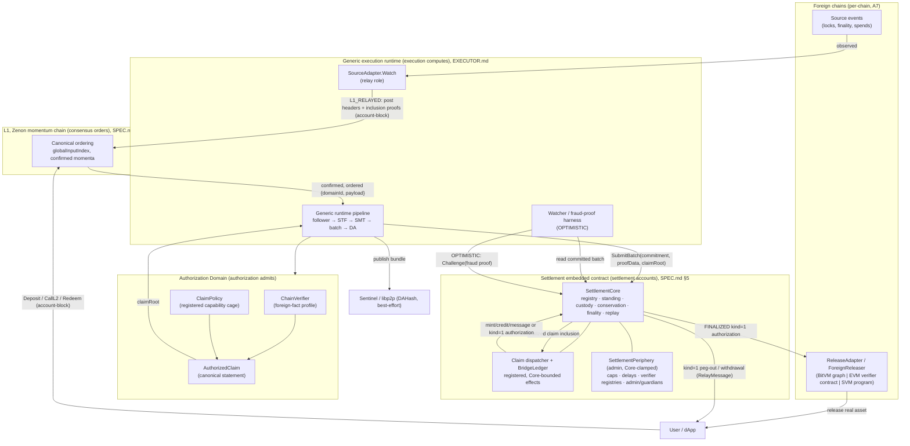
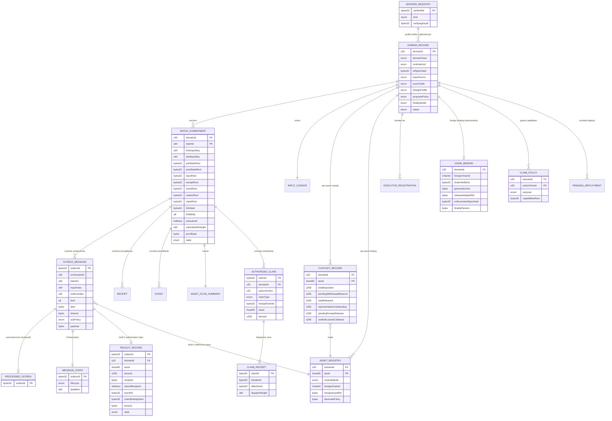
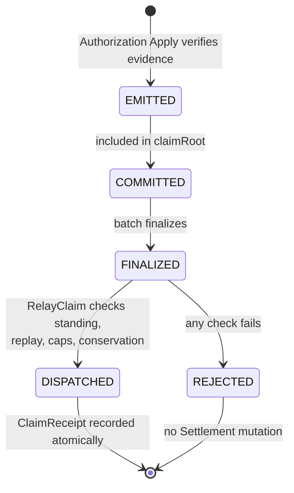
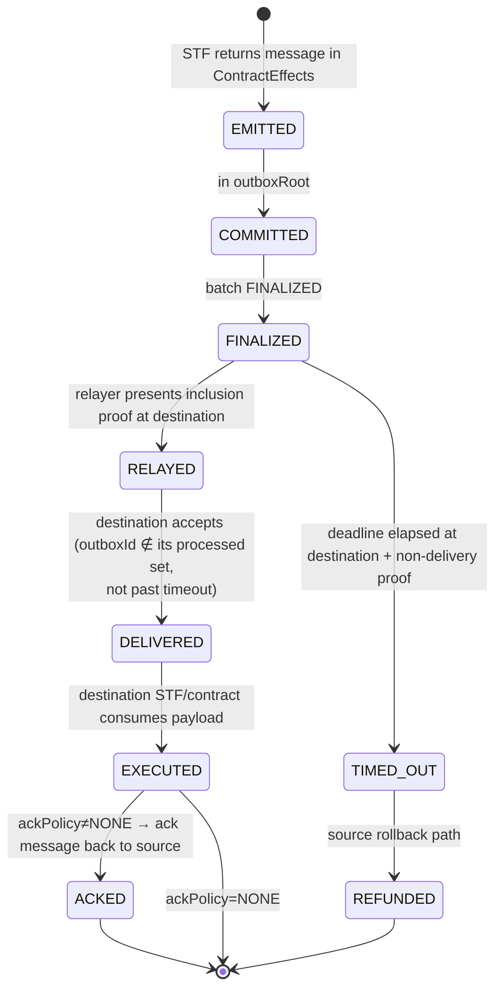

# Project Zenon Interoperability Manual

**Document status:** Highly theoretical compiled normative-design and research manual; forward-looking and not activation-ready  
**Manual version:** 0.2.2  
**Compilation date:** 2026-07-15  
**Normative framework baseline:** Generalized Authorization and Bridge Framework v0.3.2  
**Settlement extension baseline:** MINTED Settlement Extension v0.1.1  
**Upstream Project Zeno snapshot:** [`TminusZ/zenon-developer-commons` commit `3d5612d`](https://github.com/TminusZ/zenon-developer-commons/tree/3d5612dbdc41e56d46fb89e54405427dea3d8198/Project%20Zeno)  
**Purpose:** Present the complete current Bridge Framework research set in one navigable artifact so a human or LLM can evaluate its authority, invariants, mechanisms, chain specializations, and adjacent research in one pass.

This manual compiles the current Bridge Framework document set. It does not activate any mechanism, replace deployed protocol rules, or convert non-normative research into protocol law.

**Revision note:** Version 0.2.2 adds a prominent research and engineering disclaimer and updates Part VII, Appendix E, and Appendix F so the normative enforcement template and repository controls require the same permanent-failure and wind-down evidence as the deployment overlay. Version 0.2.1 added the Bitcoin-first rationale, anti-bypass rule, and permanent-failure boundary.

> **Research and engineering disclaimer**
>
> This manual is a highly theoretical research architecture and requirements corpus. It does not demonstrate that the complete design can be implemented securely, economically, or at acceptable performance, cost, complexity, or schedule. Its length, formal language, internal consistency, and use of normative requirements are not evidence of implementation progress, production safety, custody solvency, recoverability, available liquidity, or user-ready software.
>
> Building even a capped pilot would be a large multidisciplinary engineering program with uncertain feasibility. It would require new or substantially integrated Zenon consensus and Settlement code, verifier and proof infrastructure, chain-specific custody and release systems, cryptographic and protocol research, reproducible builds, audits and formal analysis, adversarial testing, monitoring and incident response, funded operators and challengers, governance procedures, legal and custody analysis, and independently committed liquidity. Some mechanisms may prove unsafe, economically impractical, or impossible under real chain constraints.
>
> This document must not be used to solicit deposits, advertise an available bridge, imply guaranteed redemption, or represent any binding as activation-ready. Every unresolved assumption, open design, missing implementation, failed test, unreviewed dependency, or absent operational artifact remains a blocker within its stated scope. Failure to implement the hardest path is not permission to weaken the governing invariant or silently activate an easier chain.

This manual is specification evidence only. It is not implementation, deployment, audit, or user-safety evidence.

The canonical generalized governing invariant is:

> **Consensus orders. Execution computes. Authorization admits. Settlement accounts.**

The external boundary addendum is:

> **Destination chains enforce through the adapter and Interop Enforcement Specification pinned by the active `ChainBinding`.**

<a id="contents"></a>

## Clickable contents

### Manual controls

- [Reading contract](#reading-contract)
- [Authority and conflict order](#authority-order)
- [Filename aliases and supersession](#aliases)
- [Upstream provenance](#upstream-provenance)
- [One-pass evaluation protocol](#evaluation-protocol)
- [Document map](#document-map)
- [Implementation readiness ledger](#readiness-ledger)
- [End-to-end security scope](#end-to-end-security)
- [Liveness activation gate](#liveness-gate)
- [Permanent failure and wind-down](#permanent-failure)
- [Adversarial deployment review](#adversarial-stage-review)
- [Deployment stages](#delivery-track)
- [Liquidity operating model](#liquidity-model)
- [Stage 1: Bitcoin](#bitcoin-program)
- [Stage 2: Ethereum](#ethereum-program)
- [Stage 3: Solana](#solana-program)
- [Scale and exit gates](#scale-gates)
- [Hostile-review disposition](#review-disposition)

### Normative core and specializations

1. [Part I: Interoperability Design Principles](#part-i-principles)
2. [Part II: Generalized Authorization and Bridge Framework v0.3.2](#part-ii-framework)
3. [Part III: MINTED Settlement Extension v0.1.1](#part-iii-minted)
4. [Part IV: Bitcoin Authorization Domain](#part-iv-bitcoin)
5. [Part V: Ethereum Asset Authorization Domain](#part-v-ethereum)
6. [Part VI: Solana Asset Authorization Domain](#part-vi-solana)
7. [Part VII: Interop Enforcement Specification Template](#part-vii-enforcement)

### Clickable appendices

- [Appendix A: Execution Provider Framework](#appendix-a-execution-provider)
- [Appendix B: Intent and Orderflow Framework](#appendix-b-intent)
- [Appendix C: Economic Security Framework](#appendix-c-economic-security)
- [Appendix D: Service Domain Framework](#appendix-d-service-domain)
- [Appendix E: Document Dependencies and Version Control](#appendix-e-dependencies)
- [Appendix F: Repository Map and Publication Profiles](#appendix-f-repository-map)
- [Appendix G: Source Manifest, Integrity Hashes, and Exclusions](#appendix-g-source-manifest)

---

<a id="reading-contract"></a>

## Reading contract

The wrapper sections before Part I and the navigation lines between embedded documents organize the corpus. They do not rewrite the embedded source documents.

The readiness, security-scope, liveness, permanent-failure, deployment, liquidity, and review-disposition sections are informative status overlays. They clarify what the embedded corpus does and does not establish; they do not create protocol requirements or alter the authority order.

Each embedded source body is reproduced verbatim from the source named in Appendix G. The wrapper resolves file-location ambiguity and supersession only. If a wrapper summary conflicts with embedded normative text, apply the authority order below.

This manual's scope is the Bridge Framework research set. The upstream `SPEC.md`, `ARCHITECTURE.md`, and `EXECUTOR.md` corpus is not embedded. Their public source and pinned snapshot are identified below. Where Part II identifies an upstream rule as controlling, a complete protocol-conformance review must still use the exact upstream version named there. This limitation is preferable to silently compressing or paraphrasing consensus-visible rules.

[Back to contents](#contents)

<a id="authority-order"></a>

## Authority and conflict order

Apply this order whenever two passages appear inconsistent:

| Priority | Authority | Scope |
|---:|---|---|
| 1 | Deployed Zenon consensus rules and the active `SPEC.md` | Consensus-visible behavior and currently active protocol constraints. Not embedded in this manual. |
| 2 | [Part II](#part-ii-framework), Generalized Authorization and Bridge Framework v0.3.2 | Authorization Domains, claim standing, bridge accounting boundaries, profiles, replay, conservation, and generalized security requirements. |
| 3 | [Part III](#part-iii-minted), MINTED Settlement Extension v0.1.1 | Settlement issuance, burn, custody counters, handlers, binding context, and MINTED migration within its stated scope. |
| 4 | [Parts IV-VI](#part-iv-bitcoin), chain specializations | Chain-specific evidence, verifier state, claim normalization, asset bindings, and deployment requirements. A specialization cannot relax Parts II or III. |
| 5 | A deployment's hash-pinned Interop Enforcement Specification | Destination custody and enforcement for exactly one `ChainBinding`. Part VII is only a template and does not satisfy this requirement. |
| 6 | Part I and Appendices A-F | Research principles, architecture, economics, and repository controls. They explain and constrain claims of conformance but do not create active protocol behavior. |

Normative words inside a non-normative research appendix constrain that research model only. They do not outrank Parts II or III.

[Back to contents](#contents)

<a id="aliases"></a>

## Filename aliases and supersession

The corpus was revised under more than one filename. Within this manual:

| Reference found in an embedded document | Controlling manual target |
|---|---|
| `01-BRIDGE-FRAMEWORK-SPEC.md` v0.3.2 | [Part II](#part-ii-framework), embedded from `GENERALIZED-AUTHORIZATION-BRIDGE-FRAMEWORK.md` v0.3.2 |
| `BRIDGE-FRAMEWORK-SPEC.md` v0.3.2 | [Part II](#part-ii-framework) |
| `extensions/MINTED-SETTLEMENT-EXTENSION-SPEC.md` | [Part III](#part-iii-minted), v0.1.1 |
| `MINTED-SETTLEMENT-EXTENSION-SPECIFICATION.md` | [Part III](#part-iii-minted), v0.1.1 |

The companion bundle's MINTED v0.1.0 draft, Bridge Framework v0.2.0 drafts, and predecessor BTC/ETH/SOL studies are superseded and intentionally excluded. They may be retained in an archive, but they are not peers of the versions embedded here.

An embedded historical note or path does not reactivate a superseded version.

[Back to contents](#contents)

<a id="upstream-provenance"></a>

## Upstream provenance

The public Project Zeno specification source is [`TminusZ/zenon-developer-commons/Project Zeno`](https://github.com/TminusZ/zenon-developer-commons/tree/main/Project%20Zeno). This manual was compiled against commit [`3d5612dbdc41e56d46fb89e54405427dea3d8198`](https://github.com/TminusZ/zenon-developer-commons/tree/3d5612dbdc41e56d46fb89e54405427dea3d8198/Project%20Zeno).

| Upstream artifact | Pinned source | Status used by this manual |
|---|---|---|
| `SPEC.md` | [`Project Zeno/spec/SPEC.md`](https://github.com/TminusZ/zenon-developer-commons/blob/3d5612dbdc41e56d46fb89e54405427dea3d8198/Project%20Zeno/spec/SPEC.md) | v1.3.0; controlling for consensus-visible behavior |
| `EXECUTOR.md` | [`Project Zeno/spec/EXECUTOR.md`](https://github.com/TminusZ/zenon-developer-commons/blob/3d5612dbdc41e56d46fb89e54405427dea3d8198/Project%20Zeno/spec/EXECUTOR.md) | v0.2.0; normative for the executor binary within its scope |
| `ARCHITECTURE.md` | [`Project Zeno/spec/ARCHITECTURE.md`](https://github.com/TminusZ/zenon-developer-commons/blob/3d5612dbdc41e56d46fb89e54405427dea3d8198/Project%20Zeno/spec/ARCHITECTURE.md) | Informative companion; `SPEC.md` governs on conflict |
| Bridge Framework v0.3.2 | [`Project Zeno/Research/Interoperability/GENERALIZED-AUTHORIZATION-BRIDGE-FRAMEWORK.md`](https://github.com/TminusZ/zenon-developer-commons/blob/3d5612dbdc41e56d46fb89e54405427dea3d8198/Project%20Zeno/Research/Interoperability/GENERALIZED-AUTHORIZATION-BRIDGE-FRAMEWORK.md) | Byte-identical to Part II; SHA-256 `7a58ac3b4592a0de07c3268d27f4e53e0e714d402cd5db9b0f748f30b38fbfa5` |

The upstream repository describes itself as a public research and specification commons, not a complete implementation repository or the final source of every implementation detail. Its location establishes specification provenance; it does not add implementation evidence to the readiness ledger.

[Back to contents](#contents)

<a id="evaluation-protocol"></a>

## One-pass evaluation protocol

An LLM or reviewer evaluating this manual should proceed as follows:

1. Read the authority order and aliases before interpreting repeated terms.
2. Read the implementation-readiness ledger, adversarial deployment review, and stage map before inferring project status or delivery order from the length or completeness of the specifications.
3. Extract the canonical invariant and responsibility boundaries from Part II.
4. Evaluate Part III as the sole included MINTED accounting mechanism. Treat OD-1 as resolved at the design level by Part III, not as implemented or activated.
5. Evaluate each chain specialization against Parts II and III; do not let one chain's proof or enforcement assumptions leak into another.
6. Treat Part VII as a completeness template, not as a deployed adapter specification.
7. Use Appendices A-D to evaluate fulfillment, orderflow, economic, and service-domain consequences without granting those layers protocol authority.
8. Distinguish `OPEN DESIGN`, `OPEN PARAMETER`, assumptions, and active requirements exactly as Part II defines them.
9. Scope the "weaker of the execution profile and foreign-fact profile" rule to claim admission. Evaluate end-to-end outcomes using the dependency surfaces listed below.
10. Keep backing, canonical redemption capacity, fee reserves, provider inventory, and market depth separate. None may be inferred from another.
11. Treat Bitcoin, Ethereum, and Solana as serial economic activation stages, not as Project Zeno protocol phases and not as a claim that later-chain engineering must wait. Evaluate Bitcoin-first as the risk-first rationale stated below, not as an unstated market-demand claim.
12. Distinguish routine `DRAINING` migration from permanent impairment of a live binding. The former is specified at the design level; the latter remains a chain-specific deployment and loss-allocation obligation.
13. Report specification evidence and implementation evidence separately. The public Project Zeno repository is a specification commons, not implementation proof. Do not infer mainnet readiness, live custody, implemented proof systems, or available liquidity from architectural completeness.
14. Report contradictions by naming both manual parts and the lower-ranked passage that must yield.
15. Report missing upstream validation separately because `SPEC.md`, `ARCHITECTURE.md`, and `EXECUTOR.md` are outside this compilation scope.

[Back to contents](#contents)

<a id="document-map"></a>

## Document map

| Manual section | Version | Class | Primary question |
|---|---:|---|---|
| Part I | 0.2.0 | Research constitution | How must interoperability responsibilities and claims be separated? |
| Part II | 0.3.2 | Normative framework | How are external facts admitted and effects safely dispatched? |
| Part III | 0.1.1 | Normative Settlement extension | How can remotely backed representation supply change without an external issuer key? |
| Part IV | 0.3.1-draft | Chain specialization | What Bitcoin evidence and adapter obligations fit the framework? |
| Part V | 0.3.1 | Chain specialization | What Ethereum evidence and lockbox obligations fit the framework? |
| Part VI | 0.3.0 | Chain specialization | What committee-attested Solana evidence and program obligations fit the framework? |
| Part VII | Template rev. 2026-07-15 | Normative template | What must every destination adapter specification disclose, exercise, and pin, including permanent failure and wind-down? |
| Appendix A | 0.2.0 | Non-normative research | Who turns finalized authorization into delivered outcomes? |
| Appendix B | 0.2.0 | Non-normative research | How do users express desired outcomes and select providers? |
| Appendix C | 0.2.0 | Non-normative research | Who bears each risk and what assurance addresses it? |
| Appendix D | 0.2.0 | Non-normative research | How do specialized service domains stay within protocol boundaries? |
| Appendices E-F | Current control documents | Repository control | Which versions govern, and how should the set be published? |

[Back to contents](#contents)

<a id="readiness-ledger"></a>

## Implementation readiness ledger

The current corpus is architecturally specified but is not implemented or activation-ready. Documentation completion must not be counted as implementation progress.

| Surface | Current state | Evidence or work still required |
|---|---|---|
| Generalized framework | Normative design at v0.3.2 | Core data structures, claim dispatch, handler restrictions, conformance tests, reproducible builds, and upstream integration evidence |
| MINTED Settlement | OD-1 is resolved as a design by Part III | Assumptions A6, A15, and A16 must be satisfied by implementation; Core storage, handlers, tests, and activation remain absent from this manual |
| `EXTERNAL_OBSERVED` completeness | OD-2 remains open | A chain-specific completeness rule and implementation are required before this evidence mode can activate; the included initial BTC, ETH, and SOL profiles use `L1_RELAYED` instead |
| OPTIMISTIC and ZK verifier dispatch | OD-3 remains open | The verifier dispatch interface and its implementation are required; this blocks the included chain specializations' target OPTIMISTIC profiles |
| Timeout and non-delivery | OD-4 remains open at the generalized level | BTC, ETH, and SOL specify chain-specific terminal mechanisms, but no deployed proof path or adapter evidence is included |
| `ChainVerifier` implementations | Interface and chain rules are specified | Code, vectors, state synchronization, fault tests, builds, and audits are not included |
| `ReleaseAdapter` enforcement | Part VII is only a template | A complete, hash-pinned Interop Enforcement Specification, deployed adapter, bytecode or program identity, audit artifacts, and upgrade controls are required for each binding |
| Permanent live-supply failure | Routine `DRAINING` migration is specified, but no universal mechanism resolves irrecoverable custody, key, or adapter failure with outstanding representation supply | Each binding requires a pinned Permanent Failure and Wind-Down Plan; any forced redemption, recapitalization, haircut, insurance, or loss-allocation mechanism requires separate normative and deployment evidence |
| Relayers and watchers | Roles and boundaries are described | Operational implementations, fee funding, availability targets, monitoring, and failure evidence are not included |
| Binding-specific adversarial evidence | General failure classes and test obligations are described | Concrete attack trees, quantified loss bounds, parameterized simulations, and rehearsed failure evidence are required for each actual binding |
| Zenon-side market venue | Research describes providers, intents, markets, and possible Liquidity Domains | No implemented order book, AMM, RFQ network, or Liquidity Domain is established by this manual |
| Bridge-asset liquidity | No capital commitment or executable quote evidence is included | Per-chain provider inventory, fee reserves, quote coverage, concentration data, and withdrawal terms must be demonstrated operationally |
| Stable quote asset | None is selected or activated by this corpus | Any foreign stable asset requires its own asset binding, issuer-risk review, caps, and chain-specific representation identity |
| Production bridge | No production system is established by this manual | End-to-end implementation, testnet evidence, audits, capped activation, and observed operations |

Only code, tests, reproducible builds, deployment state, audit or proof artifacts, and observed operations advance the implementation and activation columns. Additional prose does not.

[Back to contents](#contents)

<a id="end-to-end-security"></a>

## End-to-end security scope

Part II's orthogonality rule can be summarized as:

```text
AuthorizedClaim admission <= weaker(execution profile, foreign-fact profile)
```

That expression governs whether an admitted claim has standing. It is not an end-to-end bridge-security score. A delivered bridge outcome also depends on Settlement Core and its fixed handlers, binding policy and caps, custody solvency and control, destination finality, the `ReleaseAdapter`, governance review, relayer or watcher liveness, and any provider used for fulfillment.

The manual therefore implies a dependency graph, not one scalar assurance level. Shared governance keys, reviewers, custodians, adapters, proof infrastructure, or providers can create correlated exposure across bindings that appear independent when examined one at a time.

A pinned hash proves which artifact was approved; it does not prove that the artifact was competently reviewed. Governance cannot rewrite immutable Core checks, fixed handler semantics, replay protection, or namespace isolation merely by approving a binding. It can nevertheless approve an unsafe adapter, verifier, custody arrangement, or exposure cap. For a high-value binding, that approval path can become the dominant loss channel, and aggregate exposure across shared dependencies must be bounded explicitly.

[Back to contents](#contents)

<a id="liveness-gate"></a>

## Liveness activation gate

Safety while a record remains `PENDING` is not the same property as user recoverability. A two-way MINTED binding should not progress beyond testnet or a tightly limited pilot unless evidence establishes all of the following:

1. A valid destination release path and proof format.
2. A terminal non-delivery or refund path.
3. Mutual exclusion between release and refund under the destination chain's actual semantics.
4. A permissionless submitter path or a clearly assigned submitter with durable fee funding.
5. Declared maximum resolution assumptions and time bounds.
6. Adversarial tests for withheld proofs, censorship, reorganization, adapter pause, and relayer failure.
7. Monitoring, escalation, shutdown, and routine binding-retirement procedures.
8. A chain-specific Permanent Failure and Wind-Down Plan covering outstanding representation supply when normal release, refund, migration, or governance recovery cannot complete.

If no valid non-delivery proof exists, refund capability must remain disabled and the binding must not be represented as reliably redeemable. A design that safely permits indefinite `PENDING` state may preserve conservation while still being unsuitable for activation.

OD-4 remains open for a generalized non-delivery mechanism. The BTC, ETH, and SOL specializations define chain-specific terminal evidence paths, but this manual contains no implementation or deployment evidence for them.

[Back to contents](#contents)

<a id="permanent-failure"></a>

## Permanent failure and wind-down

### Unresolved recovery boundary

Part III's `DRAINING` state is an orderly migration mechanism. It assumes pending records can settle or expire, outstanding representation can be redeemed or otherwise reduced to zero, and a successor adapter can be activated without violating conservation or replay rules. It does not resolve a live binding whose custody, keys, adapter, proof path, or governance recovery has become permanently unusable while representation supply remains outstanding.

This manual does not define a universal forced-redemption, bailout, haircut, insurance, or socialized-loss mechanism. A binding with intact accounting can still leave users permanently frozen or undercollateralized if the foreign enforcement boundary fails. That is an explicit unresolved deployment boundary, not a condition that `PAUSED` or `DRAINING` silently solves.

| Failure state | Required immediate posture | Limitation that must be disclosed |
|---|---|---|
| Custody is intact and the adapter is repairable | Pause issuance and new peg-outs, reconcile all state, then use only the pinned upgrade or successor procedure | Resumption depends on completed audit and adversarial proof; governance intent alone is insufficient |
| Custody is intact but no approved adapter, key, or proof path can release it | Preserve custody and replay state and invoke only a precommitted unilateral or emergency path | Without such a path, representation may remain frozen indefinitely even though backing still exists |
| Custody is missing, seized, spent, or otherwise insolvent | Halt issuance and outward commitments, publish the verified shortfall, and preserve claims and records | A recapitalization, insurance payment, or loss allocation is an external recovery or a new normative mechanism; it is not proof that the original bridge remained backed |
| Governance or control keys are permanently lost | Use only immutable or previously authorized recovery paths | Governance cannot invent access to foreign custody or declare an unreachable release completed |
| All obligations can be closed in an orderly retirement | Resolve every `PENDING` record, redeem or burn outstanding supply to zero, reconcile custody, and retain replay history | Retirement is incomplete while supply, pending obligations, or unaccounted custody remains |

### Mandatory chain artifact

Before a value-bearing binding activates, its hash-pinned Interop Enforcement Specification must include a **Permanent Failure and Wind-Down Plan** in the pinned bytes. The activation review must reject a plan that does not define:

1. Objective impairment triggers, detection evidence, declaration authority, and maximum decision times.
2. Immediate pause scope, cap treatment, and actions forbidden after impairment.
3. A reproducible snapshot of custody, `representationOutstanding`, `pendingForeignRelease`, pending records, processed claim keys, and destination replay keys.
4. Every unilateral, timelocked, guardian, upgrade, successor, and emergency recovery path, including exact powers and exclusions.
5. Behavior when each required key set, operator, proof system, or governance path is permanently unavailable.
6. Treatment of every `PENDING` record and every unit of outstanding representation supply in each failure class.
7. User redemption rights, priority order, maximum recovery assumptions, and the point at which reliable redemption can no longer be claimed.
8. Any insurance, recapitalization, legal claim, haircut, or loss-allocation rule, including who funds it and which authority makes it binding.
9. Public incident communication, reserve and shortfall reporting, independent verification, and update cadence.
10. Final retirement conditions, custody disposition, retained replay history, and proof that no stranded supply or unresolved obligation was hidden by migration.
11. Tabletop and executable exercises for chain-specific permanent failures, with results and unresolved findings published before activation.

For Bitcoin this includes an economically broken spending or challenge graph, inaccessible custody UTXOs, and fee conditions that defeat the modeled recovery path. For Ethereum it includes lockbox or upgrade-control failure and custody that cannot be released by the approved contract path. For Solana it includes program, vault-authority, committee, or upgrade failure. These examples do not replace a binding-specific attack tree and quantified loss analysis.

Core must never be represented as having recovered a loss merely because governance changes a cap, binding, or document hash. No recovery may fabricate `RELEASED` or `REFUNDED`, reset replay or conservation counters, or mint replacement supply unless a separately specified normative transition authorizes that exact effect.

### Governance residual

Core can reject a zero `enforcementSpecHash` and can bind execution to identified bytes. It cannot mechanically determine whether those bytes contain a competent plan or whether reviewers tested it honestly. A rubber-stamped, incomplete, or economically impossible plan can therefore pass the hash-presence check. Validator review records, independent audits, executable exercises, and conservative caps reduce this residual; they do not eliminate it.

[Back to contents](#contents)

<a id="adversarial-stage-review"></a>

## Adversarial deployment review

The corpus is internally disciplined, but a deployment program can still fail by sequencing the right components in the wrong order or by calling backing "liquidity." The following findings govern the stage plan.

| Hostile finding | Consequence if ignored | Control in this manual |
|---|---|---|
| Project Zeno already uses Phase 1, Phase 2, and Phase 3 for attestation, fraud proofs, and validity proofs | A chain launch called "Phase 1" could be mistaken for compatibility with the active Phase-1 protocol | Chain rollout is called **Deployment Stage 0-3**, never a protocol phase |
| BTC, ETH, and SOL all target `execProfile = OPTIMISTIC` | None can activate merely because the active protocol supports Phase-1 bonded attestation | Stage 0 must implement A4 and resolve OD-3 before any value-bearing chain stage |
| Bitcoin is first because the sequence is risk-first, but it is not easiest | A schedule may underprice BitVM-style graph, fee, UTXO, challenger, and timeout work | Bitcoin receives the longest no-value and shadow periods; later-chain activation waits for its evidence |
| The manual specifies no working Zenon-side venue | Foreign-chain depth does not make `zBTC`, `zETH`, or `zSOL` tradable on Zenon | Initial market mode is signed RFQ; AMM, order-book, or Liquidity Domain claims require separate implementation evidence |
| Custody backing is not market liquidity | Rehypothecating backing can make a liquid-looking bridge insolvent | Backing, fee reserves, bonds, provider inventory, and LP capital are segregated and reported independently |
| No stable quote asset exists in the current scope | A `zBTC/ZNN` or `zETH/ZNN` market alone exposes users and LPs to two volatile assets | RFQ is sufficient for Stage 1; a chain-bound plain ERC-20 stable asset may be evaluated only after native ETH is stable |
| Provider inventory can disappear at any time | A static TVL figure can overstate executable capacity | Readiness uses repeated executable quotes, committed inventory terms, withdrawal notice, and concentration metrics |
| One shared pool improves capital efficiency by coupling failures | A provider, custody, oracle, or governance failure can spread across every bridge asset | No cross-margin, shared loss pool, or backing netting through Stage 3 |
| Serial activation can become an excuse for serial engineering | Ethereum and Solana work may start too late to expose design defects | Engineering and testnet work may proceed in parallel; only value-bearing activation is serialized |
| A delayed Bitcoin path can create pressure to bypass the sequence | Shared governance, custody, or relayer assumptions may reach later-chain TVL before the hardest enforcement boundary is tested | A reorder requires an explicit manual revision and new comparative risk decision; schedule pressure is not an exception |
| Governance can raise caps despite shallow recovery capacity | A correct bridge can become economically unserviceable | Every cap increase requires published safety, liveness, fee-reserve, and liquidity evidence plus a delay |

This review changes delivery order and economic controls. It does not change the normative responsibility model or grant markets authority over claim standing or Settlement accounting.

[Back to contents](#contents)

<a id="delivery-track"></a>

## Deployment stages

These are deployment stages, not Project Zeno protocol phases. Later-chain code, audits, and testnets MAY run in parallel, but real-value activation proceeds in this order:

| Stage | Economic scope | Activation rule |
|---:|---|---|
| 0 | Shared bridge substrate; no user value | Complete common Core, MINTED, fraud-proof, dispatcher, adapter-template, and operations prerequisites |
| 1 | Bitcoin mainnet, native BTC only | Activate `zBTC` after signet or equivalent, mainnet shadow operation, and Bitcoin-specific enforcement evidence |
| 2 | Ethereum mainnet, native ETH first | Activate `zETH` only after Bitcoin exits its capped pilot; evaluate plain ERC-20 assets later |
| 3 | Solana mainnet, native SOL first | Activate `zSOL` only after Ethereum exits its capped pilot; evaluate classic SPL assets later |

If Bitcoin remains blocked, Ethereum and Solana engineering, audits, shadow operation, and testnets may continue, but later chains do not carry real value under this deployment program. Reordering is a new deployment decision, not a schedule exception. It requires a public threat comparison, an explanation of which shared and chain-specific risks will remain untested, revised aggregate caps, and a new manual version approved through the same governance path as activation. Shipping a later chain merely to demonstrate progress does not satisfy that burden.

### Stage 0: shared prerequisites

Stage 0 is complete only when implementation evidence establishes:

1. A2, A4, A6, A12, A14, A15, and A16 for the selected protocol release.
2. OD-3's verifier registry and on-chain dispatch interface, including fraud referee calls and update governance.
3. Part III's MINTED storage, issuance authority, handlers, migration, and conformance vectors in a real `znnd` build.
4. Claim wire encodings, `claimRoot`, receipts, replay keys, class restrictions, and namespace isolation.
5. A generic relayer/watcher runtime with durable fee funding, metrics, alerting, and recovery procedures.
6. Core support for A7's non-zero enforcement pin and a reproducible build and deployment-identity process for every `ChainVerifier` and `ReleaseAdapter` artifact. Each chain still satisfies substantive A7 during its own stage.
7. A no-value RFQ and quote-observation harness so market evidence can be collected without implying liquidity.
8. A common incident taxonomy and test harness for each chain's Permanent Failure and Wind-Down Plan; the substantive plan remains binding-specific and hash-pinned during that chain's stage.

OD-2 is not a blocker for the included chain stages because they use `L1_RELAYED`, not `EXTERNAL_OBSERVED`. Generalized OD-4 may remain open if each activated chain supplies the positive terminal evidence its specialization requires. Stage 0 must not be expanded to generic messaging, ZK profiles, a Liquidity Domain, or broad token support.

[Back to contents](#contents)

<a id="liquidity-model"></a>

## Liquidity operating model

### Five separate capital surfaces

| Surface | Purpose | May back representation supply? | May be used for market making? |
|---|---|---:|---:|
| Foreign custody backing | Backs issued representation and pending releases | Yes, exclusively | No |
| Canonical operations reserve | Pays destination fees, rent, UTXO management, expiry, and recovery transactions | No | No |
| Security bonds | Backs executor, watcher, operator, or challenge obligations | No | No |
| Provider inventory | Funds signed RFQ or fast-fill promises | No | Yes |
| Venue or LP capital | Supplies continuous market depth | No | Yes |

Collateral counted by the MINTED conservation predicate MUST NOT be lent, pooled, staked, used as a solver float, or consumed for fees unless a separately authorized Settlement transition accounts for the deduction. A balance cannot be counted in more than one row.

### Liquidity service levels

| Level | Honest user-facing claim | Required evidence |
|---:|---|---|
| M0 | Unavailable | Domain is paused or no complete canonical path exists |
| M1 | Canonically mintable and redeemable, subject to caps and delay | Working peg-in, peg-out, release, terminal non-delivery, fee reserve, and monitoring; no market quote promised |
| M2 | RFQ liquidity available | At least two independent executable signed quotes at disclosed sizes, terms, expiries, and remedies; repeated measurement over time |
| M3 | Continuous market liquidity available | Implemented venue or domain, executable two-sided depth, LP withdrawal terms, price-impact data, oracle and manipulation analysis, and independent fallback quotes |

The word "liquid" must identify the level, asset, direction, standard trade sizes, maximum slippage, measurement window, and observation source. A dashboard number without executable trade tests is not liquidity evidence.

### Cap and reserve equations

For each chain and asset, define:

```text
B  = verified foreign custody backing
R  = representationOutstanding
P  = pendingForeignRelease
F  = non-collateral fee and recovery reserve
IZ(d) = committed provider inventory available on Zenon for direction d
ID(d) = committed provider inventory available on the destination chain for direction d
EZ(d,s) = executable Zenon-side capacity for direction d at maximum slippage s
C(d) = independently approved risk or market cap for direction d
beta = inventory safety factor greater than 1
```

The protocol invariant remains:

```text
R + P <= B
```

Canonical bridge caps are chosen from security and recoverability evidence, not market depth. A separately advertised market quote cap must satisfy:

```text
marketQuoteCap(d) <= min(IZ(d) / beta, ID(d) / beta, EZ(d,s), C(d))
```

The equation is evaluated separately for each trade direction. Every term must use the same input-asset base unit or a disclosed common reporting unit and timestamp; conversion is a monitoring calculation, never a Settlement price. If there is no continuous Zenon venue, `EZ(d,s)` is measured from executable RFQ quotes rather than invented from foreign-chain TVL. Inventory counts only when ownership, encumbrance, withdrawal notice, and quote obligations are evidenced by verifiable addresses, signed commitments, independent attestations, or enforceable escrow.

The operations reserve must satisfy a published stress calculation:

```text
F >= sum over operation types i of:
     stressFee(i) * requiredCount(i)

requiredCount(i) = pendingCount(i) + recoveryCount(i) + safetyMarginCount(i)
```

Every operation class, stress fee, count, and holding address is chain-specific and fixed before activation. A spot gas estimate is not a stress reserve.

### Permitted initial capital sources

Initial market capital MAY come from independent market makers, treasury or grant-funded inventory, user LPs under explicit withdrawal terms, or providers using their own balance sheets. It MUST NOT come from unallocated bridge backing, undisclosed leverage, or a cross-chain pool that socializes one binding's loss across another.

No protocol reward, ZNN emission, or guaranteed yield is assumed by this manual. A subsidy proposal requires its own budget, duration, recipient, anti-wash-trading controls, and shutdown rule.

No honest absolute liquidity target can be fixed from this research corpus alone. Required capital follows from the activated risk caps, advertised quote sizes, directional demand, stress fees, provider commitments, and measured execution. Publishing an arbitrary dollar TVL target before those inputs exist would be theater, not liquidity planning.

### Stable quote asset

Stage 1 launches without assuming a stable quote asset. `zBTC/ZNN` RFQ can operate, but a displayed external USD reference is advisory and does not create an on-chain stable balance.

After native ETH has passed Stage 2's canonical pilot, one plain, allowlisted ERC-20 stable asset MAY be evaluated as a separate representation, provisionally named `zUSD-ETH`. Issuer freeze, blacklist, upgrade, reserve, and insolvency powers remain part of its risk profile. A Solana-origin stable representation, provisionally `zUSD-SOL`, is a different `AssetID`, binding, custody balance, and redemption claim. Equal ticker text MUST NOT alias the two.

[Back to contents](#contents)

<a id="bitcoin-program"></a>

## Stage 1: Bitcoin first

### Why Bitcoin is first

The order is **risk-first**, not ease-first. Bitcoin has the least expressive destination environment and the most architecture-defining enforcement problem in this set: probabilistic proof-of-work finality, UTXO and fee management, reorganization handling, positive timeout evidence, and BitVM-style executor and challenger assumptions all have to compose without a general-purpose foreign contract quietly absorbing missing logic. Exercising that boundary first is intended to expose flaws in the generalized claim, custody, replay, timeout, and adapter model before easier execution environments accumulate real value.

Native BTC also isolates the canonical bridge path to one native asset without ERC-20 issuer behavior, Solana token-program variants, or a stable-asset dependency. That narrower asset surface does not make Bitcoin easy; it makes failures easier to attribute to the bridge architecture itself.

This sequence is not justified by an asserted market-cap ranking, demand forecast, symbolic preference, or promise of the shortest time to launch. Any commercial-demand case and capital commitment must be evidenced separately through the liquidity gates. If later evidence supports a different order, the anti-bypass revision process above applies.

### Scope

The first economic asset is native BTC represented as `zBTC`. No tokenized Bitcoin variant, Lightning claim, inscription, stable asset, generic message, or cross-chain swap is in Stage 1 scope.

### Substages

| Substage | Environment | Value | Exit evidence |
|---|---|---:|---|
| B0 | Regtest and signet or equivalent | None | Header, difficulty, reorg, transaction, claim, release, positive-timeout, and migration suites pass |
| B1 | Mainnet shadow domain, `PAUSED` | None | Sustained header sync, competitive branch observation, proof generation, fee simulation, and alerting without dispatch |
| B2 | Mainnet canonical pilot | Strict cap | M1 service only: real peg-in/out/refund round trips, published incidents, no liquidity claim |
| B3 | Mainnet RFQ pilot | Cap bounded by quote evidence | M2 service: independent providers quote `zBTC/BTC` and `zBTC/ZNN` under signed terms |
| B4 | Optional continuous market | Separate market cap | M3 service only after a real Zenon venue or Liquidity Domain exists and passes market-specific review |

### Bitcoin liquidity plan

| Budget | Required source and treatment |
|---|---|
| Backing | BTC locked by the pinned custody graph; segregated by binding and never used for fees or provider fills |
| Operations | Spendable, non-collateral BTC UTXOs for release, timeout, fee bumping, consolidation, and recovery |
| Security | Executor and challenge bonds sized and held separately from custody and provider inventory |
| Provider inventory | Native BTC for destination fast fills plus `zBTC` and ZNN inventory for Zenon RFQ |
| Initial venue | Signed RFQ with explicit size, spread, expiry, assignment, and remedy; no assumed Zenon AMM |
| Rebalancing | Provider-controlled external venues or OTC relationships; never a protocol-selected route |

Bitcoin liquidity is operationally sensitive to UTXO fragmentation and fee volatility. Operators must use a documented multi-source fee policy, transaction simulation, RBF or CPFP behavior where compatible with the adapter graph, and a stress reserve. Bitcoin Core exposes fee estimation and fee-bump tooling, but those estimates do not guarantee inclusion: [`estimatesmartfee`](https://bitcoincore.org/en/doc/30.0.0/rpc/util/estimatesmartfee/) and [`bumpfee`](https://bitcoincore.org/en/doc/30.0.0/rpc/wallet/bumpfee/).

### Gate to Ethereum

Ethereum cannot carry real value until Bitcoin has completed the common [scale and exit gates](#scale-gates), including the minimum observation window, completed round trips, no stale `PENDING` records, audited reserve reconciliation, and a rehearsed pause/drain/recovery exercise. Bitcoin need not reach M3 continuous liquidity, but any M2 liquidity claim must satisfy the market gates.

[Back to contents](#contents)

<a id="ethereum-program"></a>

## Stage 2: Ethereum second

### Scope

The first Ethereum asset is native ETH represented as `zETH`. ERC-20 support is disabled during the native-ETH pilot. The first later token candidate should be a plain, allowlisted ERC-20 with no transfer fee, rebasing, hooks, or amount mutation; a stable asset is evaluated as an issuer-dependent quote instrument, not as risk-free cash.

### Substages

| Substage | Environment | Value | Exit evidence |
|---|---|---:|---|
| E0 | Current supported Ethereum test environment | None | Light-client, fork, receipt, storage-absence, lockbox, replay, timeout, and migration suites pass |
| E1 | Mainnet shadow domain, `PAUSED` | None | Sustained sync-committee updates, proof construction, gas simulation, and lockbox monitoring |
| E2 | Mainnet `zETH` canonical pilot | Strict cap | M1 service with ETH only and complete release/refund round trips |
| E3 | `zETH` RFQ pilot | Cap bounded by quote evidence | M2 service with independent ETH and `zETH` inventory providers |
| E4 | One plain ERC-20 pilot | Separate lower cap | Independent asset binding, issuer-risk review, custody, proof, and recovery evidence |
| E5 | Optional continuous markets | Separate market caps | M3 service for each pair; no automatic inheritance from Ethereum DEX depth |

### Ethereum liquidity plan

| Budget | Required source and treatment |
|---|---|
| Backing | ETH or each exact ERC-20 held in the pinned lockbox; no lending, restaking, LP use, or gas deduction |
| Operations | Non-collateral ETH for lockbox calls, release, expiry, proof submission, migration, and emergency actions |
| Provider inventory | ETH or WETH on Ethereum plus `zETH` and quote inventory on Zenon; wrapper conversion remains provider-layer execution |
| Initial venue | Signed RFQ; external Ethereum DEX or aggregator depth may support provider rebalancing but creates no Zenon-side depth |
| Quote asset | `zBTC/ZNN` and `zETH/ZNN` remain available; `zUSD-ETH` is optional only after a separate plain-token pilot |

Ethereum transaction fees are paid in ETH and include protocol base fee plus priority fee. The operations reserve must be funded in ETH even when the bridged asset is an ERC-20, and failed execution can still consume gas. See the current [Ethereum gas documentation](https://ethereum.org/developers/docs/gas/).

### Gate to Solana

Solana cannot carry real value until Ethereum passes the common exit gates for native ETH and Bitcoin remains within its safety and liveness thresholds. An ERC-20 or continuous market is not required to begin Solana engineering, but unresolved Ethereum custody, replay, or `PENDING` failures block Solana economic activation.

[Back to contents](#contents)

<a id="solana-program"></a>

## Stage 3: Solana third

### Scope

The first Solana asset is native SOL represented as `zSOL`. Classic SPL Token Program assets are later, separately capped registrations. Token-2022 remains excluded by the included specialization. Wrapped SOL used inside Solana venues is provider inventory and MUST NOT alias the native-SOL bridge asset.

### Substages

| Substage | Environment | Value | Exit evidence |
|---|---|---:|---|
| S0 | Local validator and supported public test environment | None | Committee, receipt, PDA, program, replay, release, expiry, congestion, and migration suites pass |
| S1 | Mainnet shadow domain, `PAUSED` | None | Sustained committee operation, independent RPC observation, program monitoring, fee/rent simulation, and alerting |
| S2 | Mainnet `zSOL` canonical pilot | Strictest chain cap | M1 service with native SOL only; cap reflects `COMMITTEE` foreign-fact trust |
| S3 | `zSOL` RFQ pilot | Cap bounded by quote evidence | M2 service with independent SOL and `zSOL` inventory providers |
| S4 | Classic SPL pilots | Separate lower caps | One asset at a time; exact mint, authority, token program, vault, decimals, and issuer risks reviewed |
| S5 | Optional continuous markets | Separate market caps | M3 service only after a real venue exists and survives account-lock and congestion testing |

### Solana liquidity plan

| Budget | Required source and treatment |
|---|---|
| Backing | Native SOL vault or exact classic SPL vault; rent reserve and fees excluded from represented collateral |
| Operations | Non-collateral SOL for base fees, priority fees, account creation, rent, release, expiry, migration, and recovery |
| Provider inventory | SOL or WSOL and selected SPL assets on Solana plus `zSOL`, ZNN, and chain-specific quote inventory on Zenon |
| Initial venue | Signed RFQ; Jupiter or another provider-selected route is rebalancing infrastructure, not bridge authority |
| Quote asset | Any `zUSD-SOL` registration remains distinct from `zUSD-ETH`, even for the same issuer name |

Solana charges base and optional priority fees, and failed transactions may still be charged. Fee and compute-unit limits therefore need stress funding rather than a spot estimate; see the current [Solana fee structure](https://solana.com/docs/core/fees/fee-structure). Jupiter's current Swap API combines on-chain routes and RFQ sources, which makes it useful for executable route telemetry and provider rebalancing, but not for custody backing or redemption guarantees; see the [Jupiter Swap v2 overview](https://developers.jup.ag/docs/swap).

Because the initial Solana foreign-fact profile is `COMMITTEE`, its standing exposure cap must be lower than a cap justified by otherwise comparable objective foreign verification unless a published quantitative risk analysis demonstrates otherwise. Market depth MUST NOT be used to compensate for committee trust.

[Back to contents](#contents)

<a id="scale-gates"></a>

## Scale and exit gates

### Common pilot exit gate

A chain exits its capped canonical pilot only after all of the following are published and independently reproducible:

1. A minimum observation window and minimum completed-flow count fixed before pilot activation. Recommended initial defaults are at least 90 consecutive days and at least 100 completed value cycles. The evidence set must include successful release plus controlled terminal non-delivery and refund exercises; it must not manufacture user failures merely to increase a count.
2. No `PENDING` record older than its published resolution SLO, except a disclosed incident already in the governed recovery process.
3. Exact reconciliation of foreign custody, `representationOutstanding`, `pendingForeignRelease`, and every processed claim and destination replay key.
4. Successful reorganization, congestion, fee-spike, relayer-loss, watcher-loss, provider-loss, adapter-pause, and drain-before-switch exercises.
5. Reproducible builds, deployment identity, independent audits, unresolved-finding register, and validator semantic-review record.
6. Operations reserve above the published stress equation and no use of collateral for fees, bonds, or fills.
7. A completed pause, incident communication, routine recovery, and permanent-impairment exercise with named operators and response times.
8. A published binding-specific attack tree, quantified maximum-loss analysis at the proposed cap, and test or simulation evidence for its highest-impact paths.

Related-party test transfers and self-dealing volume must be disclosed and do not establish organic liquidity or provider independence.

### Additional market gate

An M2 or M3 liquidity claim additionally requires:

1. At least two independent executable quotes at every advertised standard size; three independent providers is the recommended initial target. Independence requires separate beneficial control, capital, custody, signing, and operations, not separate brand names over one balance sheet.
2. Quote success in at least 95 percent of sampled intervals over a published 30-day measurement window.
3. Published median and tail spread, price impact, execution failure, settlement latency, and inventory withdrawal data.
4. No provider controlling 50 percent or more of measured executable depth at the advertised sizes.
5. Aggregate counted inventory at least `beta` times the advertised quote cap on both sides, with `beta > 1` published before activation.
6. An independent canonical redemption path that continues to function when every provider and venue is unavailable.

These are evidence gates, not Settlement invariants. If the evidence falls below threshold, the liquidity label and market quote cap must be reduced or withdrawn even when the canonical bridge remains safe.

### Cap progression

The initial standing, per-claim, and rolling-window caps are set from the weakest security and recovery surface, then further limited by operational capacity. A cap increase requires the complete gate again, a public delay, and a new aggregate-exposure calculation. The recommended initial ceiling is no more than a twofold increase per successful review interval. Cap reductions and pauses may occur immediately on evidence of custody loss, verifier divergence, fee-reserve depletion, stale `PENDING` growth, provider concentration, or market-depth collapse.

### Cross-chain isolation through Stage 3

Until all three stages have independently exited pilot:

- custody backing is never netted across chains;
- provider inventory is reported per chain and asset;
- no shared-loss pool, cross-margin account, or rehypothecation is allowed;
- a quote router may aggregate offers but cannot merge replay, custody, or representation identity;
- equal ticker symbols do not merge `AssetID` or redemption rights; and
- aggregate caps account for shared governance keys, reviewers, relayer infrastructure, cloud providers, and market makers.

After Stage 3, any shared liquidity or cross-chain netting proposal is a new risk-bearing system and requires a separate design, implementation, audit, and activation decision. It is not an automatic optimization of this bridge.

[Back to contents](#contents)

<a id="review-disposition"></a>

## Hostile-review disposition

| Review claim | Disposition |
|---|---|
| There is no working bridge | Confirmed as the current readiness state. This is an implementation gap, not something another specification can close. |
| Governance makes the cryptography meaningless | Substantially valid for unsafe adapter, custody, verifier, or cap approval, but too broad as a statement about every security property. Core isolation, fixed handlers, replay protection, and conservation checks still constrain distinct failure classes. |
| A generalized framework makes chain onboarding expensive | Valid tradeoff. "Generalized" describes a shared state and interface model; it does not mean that chain-specific evidence and enforcement become cheap or interchangeable. |
| The decisive open designs are unresolved | Partly stale. Part III resolves OD-1 as a design, though it is not implemented. OD-2, OD-3, and generalized OD-4 remain open with the scope shown in the readiness ledger. |
| The weaker-of-two-profiles rule understates end-to-end trust | Valid scope correction. The rule applies to claim standing only; the complete outcome depends on the additional surfaces listed above. |
| Documentation is being mistaken for implementation | Valid risk. This version explicitly separates specification evidence from code, deployment, audit, and operations evidence. |
| Liveness is weaker than safety | Valid. Indefinite `PENDING` can conserve supply while failing users, so terminal evidence and operational recovery are activation gates. |
| The manual does not explain why Bitcoin goes first | Confirmed in v0.2.0. Version 0.2.1 states a risk-first rationale and explicitly separates it from unproven market-demand claims. |
| Serial activation will be bypassed if Bitcoin stalls | Valid program risk. Later-chain technical work may continue, but changing real-value order now requires an explicit comparative-risk decision and manual revision. |
| Permanent failure with live representation supply is unspecified | Confirmed. Routine `DRAINING` is not a solution. This version makes the boundary explicit and requires a pinned chain-specific plan without pretending a universal recovery mechanism already exists. |
| The wrapper requires a wind-down plan but Part VII's template omits it | Confirmed in v0.2.1. Version 0.2.2 adds the normative plan to Part VII and threads it through conformance vectors, the threat model, activation checks, diagrams, the artifact manifest, and repository release controls. |
| MINTED is only a design sketch | Partly stale. Part III specifies accounting, handlers, conservation, and orderly migration at the design level. Implementation and permanent foreign-boundary loss recovery remain absent. |
| Liquidity is only a downstream concern | Stale as a description of the v0.2.x deployment overlay: backing, operations reserves, provider inventory, and executable depth are separate preactivation gates. The criticism remains correct that this manual contains no committed capital or operational depth evidence. |
| Concrete attack trees and quantified simulations are absent | Valid as a deployment-evidence gap. They depend on actual bindings, parameters, deployments, and caps, and are now explicit pilot-exit artifacts rather than prose this research manual can manufacture. |
| Browser-native usability is unproven | Valid if such a product claim is made. This manual establishes no browser wallet, bot, WASM-domain, load-test, or production UX evidence and must not be cited as doing so. |

The review does not identify a contradiction in the four-part responsibility model. It does identify a readiness and product-delivery gap. This wrapper now states that gap before the embedded specifications rather than allowing document completeness to imply operational completeness.

[Back to contents](#contents)

---

<a id="part-i-principles"></a>

# Part I: Interoperability Design Principles

> **Embedded source:** `00-INTEROP-DESIGN-PRINCIPLES.md`  
> **Integrity:** Exact source bytes are identified in [Appendix G](#appendix-g-source-manifest).

<!-- BEGIN EMBEDDED SOURCE: 00-INTEROP-DESIGN-PRINCIPLES.md -->
# Interoperability Design Principles

**Status:** Interoperability research constitution  
**Version:** 0.2.0  
**Framework baseline:** `01-BRIDGE-FRAMEWORK-SPEC.md` v0.3.2  
**Governing authority:** The active `SPEC.md` controls on conflict  
**Commit discipline:** This document is not a roadmap, bridge announcement, product claim, or implementation guarantee.

Capitalized requirement words constrain a study that claims conformance with these research principles. They do not modify the active protocol or override a normative specification.

## 1. Purpose

This document defines the decomposition, vocabulary, safety rails, and disclosure discipline used by Project Zenon interoperability research. Chain studies differ in proof systems, finality rules, custody mechanisms, and destination capabilities. They should not differ in how they separate responsibility or report trust.

The governing invariant is:

> **Consensus orders. Execution computes. Authorization admits. Settlement accounts.**

The destination boundary is:

> **Destination chains enforce.**

The second sentence is not a fifth Zenon-side room. It names a required external system whose correctness must be specified and reviewed separately.

Interop research begins by separating what Zenon can know, what Zenon may account for, and what a foreign chain can enforce. Treating those as one operation hides the assumptions that determine whether users can recover their assets.

## 2. Scope

This document applies to:

- chain-specific Authorization Domain studies;
- foreign consensus and finality verification studies;
- proof relay and data-availability studies;
- wrapped-claim and remote-backed asset designs;
- cross-chain message admission;
- custody and destination-enforcement comparisons;
- chain adapter specifications;
- timeout, acknowledgement, and refund analysis; and
- bridge failure and recovery analysis.

It does not establish:

- that any bridge is deployed or planned;
- that a foreign asset is held by Zenon;
- that `MINTED` is available;
- that a chain adapter is safe because a design document exists;
- that an observed event proves current reserves; or
- that stronger proof verification makes every downstream effect acceptable.

## 3. Required decomposition

Every interoperability study MUST analyze the following concerns separately.

### 3.1 Consensus ordering

Consensus establishes the canonical ordering and finality of Zenon-visible inputs. It does not execute a foreign verifier and does not decide what an admitted claim means economically.

Questions:

- How does foreign evidence enter the canonical Zenon input sequence?
- Which input-source profile applies?
- What data must remain available for deterministic replay?
- Which reorgs or Zenon-side reorganizations can invalidate ordering assumptions?

### 3.2 Execution

Execution runs the pinned domain STF. For an Authorization Domain, this includes parsing evidence, updating verifier state, applying chain-specific finality rules, and constructing a typed claim.

Questions:

- What exact bytes are executed?
- Which code and configuration are pinned by `stfSpecHash`?
- Which execution profile secures the computation?
- Can another implementation replay the same input sequence to the same roots?

### 3.3 Authorization

Authorization decides whether foreign evidence has standing to become an `AuthorizedClaim`. This is the fourth first-class responsibility.

Questions:

- What proposition does the evidence establish?
- Which foreign-fact profile secures that proposition?
- Which claim type may the domain emit?
- What makes two claims duplicates?
- Which facts remain outside the proof?

An Authorization Domain MUST NOT perform the accounting effect implied by a claim.

### 3.4 Settlement

Settlement checks domain class, claim type, policy, replay, conservation, and handler constraints. If all checks pass, Settlement dispatches the claim to the registered handler and owns the resulting accounting state.

Questions:

- Which `ClaimPolicy` applies?
- Which fixed `handlerId` may receive the claim?
- What limits, assets, recipients, and lifecycle transitions are allowed?
- What state proves that the claim was consumed exactly once?
- What conservation identity must remain true?

### 3.5 Messaging and relay

Relayers transport bytes and proofs. Messaging carries information between systems. Neither function creates validity, custody, or authorization.

Questions:

- What message is transported?
- What inclusion, finality, and replay proof accompanies it?
- Can a relayer forge, reorder, duplicate, or only withhold?
- Which message identifier is unique on each replay surface?

### 3.6 Custody

Custody is control over the backing asset. It is not event verification, accounting, or a statement about reserves.

Questions:

- Which keys, contracts, UTXOs, programs, or protocols control the asset?
- Which parties can move, freeze, upgrade, or seize it?
- What happens if every off-chain operator disappears?
- Can users recover without Zenon governance?

### 3.7 Destination enforcement

Destination enforcement consumes a finalized Settlement record and causes or permits an external effect. For peg-outs, this normally means verifying a `PegOutRecord`, preventing replay, and releasing custody atomically.

Questions:

- What exactly does the `ReleaseAdapter` verify?
- Is the verified Zenon root final under the assumed proof?
- How are amount, asset, recipient, chain, timeout, and record identity encoded?
- What state prevents a second release?
- How do release and refund remain mutually exclusive?

### 3.8 Economic execution

Solvers, market makers, custodians, and other Execution Providers may accelerate or transform an outcome. They do not acquire protocol authority merely by observing a finalized record.

Questions:

- Who supplies liquidity?
- Who bears inventory, price, reorg, and latency risk?
- Which promises are cryptographic, bonded, legal, competitive, or reputational?
- What remedy exists if the provider fails?

## 4. Preferred terminology

### 4.1 Safe terms

**Authorization Domain.** A domain class whose STF admits evidence and emits only permitted `AuthorizedClaim` outputs plus verifier-local state. It has no balance, custody, mint, burn, escrow, or release authority.

**Foreign-fact profile.** The security profile used to establish a fact about an external system. Examples include attestation, light-client verification, and zk-consensus verification.

**Execution profile.** The security profile used to establish that the domain STF produced the committed result. It is orthogonal to the foreign-fact profile.

**Authorized claim.** A typed assertion with standing under a registered policy. It is inert until Settlement validates and consumes it.

**Claim policy.** Settlement configuration that binds an Authorization Domain to allowed claim types, assets, limits, recipients, replay rules, and a fixed handler.

**Bridge ledger.** Settlement-owned accounting state for accepted deposits, issued claims, pending peg-outs, completed releases, refunds, and related conservation counters.

**Peg-out record.** Settlement's finalized, replay-protected record of a withdrawal lifecycle transition. It is the Zenon-side object destination enforcement consumes.

**Interop Enforcement Specification.** The chain-specific, hash-pinned normative description of custody and destination enforcement required by a `ChainBinding`.

**Feasibility study.** Research that tests whether one or more required layers can be implemented. It may leave custody or enforcement unresolved if it says so prominently.

### 4.2 Terms requiring qualification

**Bridge.** Use only when verification, authorization, Settlement accounting, custody, destination enforcement, replay, timeout, deployment, and governance are all specified.

**Final.** State whose relevant challenge, confirmation, or proof conditions have completed. Always name the profile and the finality assumption.

**Verified.** State what was verified and by which mechanism. Transaction inclusion, event inclusion, consensus finality, reserve solvency, and program correctness are different propositions.

**Native asset.** The asset controlled by its origin chain. A representation is not native merely because it is redeemable.

**Permissionless.** State which action is permissionless. Relay may be permissionless while custody release or governance remains permissioned.

### 4.3 Terms to avoid

- "trustless bridge";
- "proof of reserves" when only deposits or events are verified;
- "Zenon controls the foreign asset" without a specified control mechanism;
- "the Authorization Domain credits or burns";
- "Settlement produces truth";
- "the relayer signs the foreign transaction"; and
- "runtime compatibility provides native liquidity."

## 5. Authorization Domain pattern

### 5.1 Permitted behavior

An Authorization Domain MAY:

- maintain chain-specific header, validator-set, checkpoint, or verifier state;
- parse foreign transactions, receipts, logs, accounts, or state proofs;
- apply chain-specific confirmation and finality predicates;
- reject malformed, stale, conflicting, or duplicate evidence;
- emit an `AuthorizedClaim` type permitted by its domain class; and
- maintain verifier-local replay state where needed to prevent a second claim from the same foreign event.

### 5.2 Forbidden behavior

An Authorization Domain MUST NOT:

- credit or debit user balances;
- mint or burn an asset;
- modify custody counters;
- create a spendable withdrawal right directly;
- select arbitrary Settlement code;
- widen its own `ClaimPolicy`;
- treat stronger evidence as permission for an otherwise disallowed effect; or
- write outside its allocated state namespaces.

The framework enforces this boundary through domain-class output checking, state namespace disjointness, and fixed claim dispatch. Research documents MUST preserve all three enforcement points.

### 5.3 Inbound example

A Bitcoin Authorization Domain may verify a header chain, accumulated proof of work, transaction inclusion, output script, amount, and confirmation depth. It may then emit a claim equivalent to:

> Foreign event `e` establishes eligible backing of amount `a` for asset binding `x` and beneficiary `b`.

Settlement decides whether the domain, claim type, asset, amount, beneficiary, replay key, and handler are allowed. Only the Settlement handler may update escrow accounting or issue a representation asset.

### 5.4 Outbound example

A user requests a peg-out through a Settlement-owned operation. Settlement verifies spend authority and balance, performs the required burn or lock, and creates a `PegOutRecord`. The Authorization Domain does not authorize its own release and does not burn the user's asset.

The destination adapter verifies the finalized record under its Interop Enforcement Specification and consumes its own destination replay key atomically with release.

## 6. Orthogonal trust profiles

A claim is exactly as trustworthy as the weaker of:

- the execution profile that secures the STF result; and
- the foreign-fact profile that secures the admitted external fact.

No stronger profile widens Settlement policy. A validity-proven STF may still verify a weak attestation. A zk-consensus proof may still be processed by a weak execution profile. A strong proof of either dimension does not grant a new claim type, a larger limit, or a different handler.

Every chain study MUST publish both profiles independently.

## 7. Custody and enforcement requirement

### 7.1 No custody section, no bridge claim

A study that defines foreign verification and claim admission but does not define custody and release is an Authorization Domain study. That is a valid and useful research result, but it is not a complete bridge.

### 7.2 Required artifact

Every activation-ready `ChainBinding` MUST identify a non-zero `enforcementSpecHash` for a complete Interop Enforcement Specification. The artifact MUST define:

1. custody and control;
2. exact encodings and domain separation;
3. verification of the finalized `PegOutRecord`;
4. replay prevention and release atomicity;
5. timeout, acknowledgement, refund, and recovery behavior;
6. deployment, build, audit, and test artifacts; and
7. upgrade and emergency governance.

### 7.3 Semantic-review residual

The hash establishes artifact identity. It cannot establish that reviewers understood the artifact, that every required section is adequate, or that deployed code conforms to it. Negligent or colluding governance and validators can approve a nonconforming document or adapter. That risk is part of the per-chain trust model and MUST be disclosed.

## 8. Chain classes

Chain-specific studies should classify the foreign environment before proposing an adapter.

| Class | Typical verification path | Typical enforcement surface | Central risks |
|---|---|---|---|
| UTXO and proof-of-work | Header chain, work comparison, transaction Merkle proof, script parsing | Script, transaction graph, threshold signing, covenant-like mechanism | Reorg depth, fee replacement, UTXO uniqueness, script limits, operator liveness |
| Account and smart-contract | Finalized consensus checkpoint plus receipt, log, account, or storage proof | Lockbox or release contract | Upgrade keys, proxy state, gas, log ambiguity, chain reorg assumptions |
| High-throughput account/program | Validator/finality proof plus account or transaction proof | Program and controlled accounts | Proof availability, account history, program upgrades, compute limits |
| External service or institution | Attestation, signed statement, or audited feed | Custodian or payment processor | Identity, solvency, jurisdiction, censorship, recovery, legal enforceability |

Classification is descriptive, not a security ranking. Each chain requires a concrete proposition and proof path.

## 9. Research workflow

Every chain study should proceed in this order:

1. State the exact foreign proposition to be admitted.
2. Define canonical evidence bytes and replay identity.
3. Determine whether the evidence is available and replayable.
4. Specify the foreign finality predicate.
5. Choose an execution profile and foreign-fact profile independently.
6. Define the `AuthorizedClaim` type without assigning an accounting effect to the domain.
7. Define the Settlement `ClaimPolicy`, handler, limits, and conservation transitions.
8. Specify custody and destination enforcement using the required template.
9. Define timeout, acknowledgement, refund, halt, and recovery paths.
10. Produce adversarial vectors before making a bridge claim.

### 9.1 Mock-first rule

Research MAY mock an unresolved layer to test another layer. The mock MUST be named at every trust-boundary crossing and MUST NOT be described as the real mechanism.

Examples:

- a mock header oracle can test parsing but not trust-minimized foreign finality;
- a mock Settlement handler can test claim shape but not conservation enforcement;
- a mock `ReleaseAdapter` can test message flow but not custody safety; and
- a mock acknowledgement can test lifecycle code but not release-refund exclusion.

## 10. Required claims table

Every chain study MUST include a table in this form:

| Claim | Status | Evidence | Weakest assumption | Excluded meaning |
|---|---|---|---|---|
| Foreign event inclusion | Proven / attested / observed / open | Exact proof or source | Named foreign-fact assumption | Does not prove reserve solvency |
| STF execution | Attested / optimistic / validity-proven | Execution profile | Named execution assumption | Does not widen policy |
| Claim standing | Allowed / rejected / open | Claim type and policy | Governance and configuration | Does not perform accounting |
| Zenon accounting | Enforced / deferred | Settlement handler and invariant | Active protocol semantics | Does not release foreign custody |
| Destination release | Enforced / committee-controlled / open | Enforcement specification | Adapter, custody, and governance assumptions | Does not prove Zenon execution beyond verified proof |
| User recoverability | Proven / bounded / social / absent | Timeout and recovery path | Liveness and governance | Does not imply immediate liquidity |

## 11. Required failure analysis

Every study MUST analyze at least:

- malformed or ambiguous evidence;
- foreign reorganization or finality failure;
- unavailable proof data;
- dishonest or unavailable executor;
- claim replay on Zenon;
- destination release replay;
- claim-policy misconfiguration;
- Settlement handler bug;
- custody key or adapter compromise;
- release without acknowledgement;
- refund while release remains possible;
- adapter or verifier version skew;
- governance approval of a semantically inadequate specification; and
- recovery after halt or upgrade.

For each failure, name prevention, detection, containment, recovery, and residual risk.

## 12. Disclosure requirements

Every chain study MUST disclose:

- current phase and deployment status;
- all assumptions that are false or reserved in the active protocol;
- exact execution and foreign-fact profiles;
- exact custody and enforcement model;
- administrators, guardians, signers, operators, and upgrade keys;
- maximum loss or exposure bounds where known;
- liveness requirements and timeout sources;
- whether users can recover unilaterally;
- audit, proof, and test status; and
- every unresolved open design that blocks activation.

## 13. Comparison matrix

Use this matrix to compare studies without collapsing their trust models:

| Chain | Admitted proposition | Foreign-fact profile | Execution profile | Settlement effect | Custody | Enforcement | Honest status |
|---|---|---|---|---|---|---|---|
| Bitcoin | Deposit transaction finalized under stated work and confirmation rule | SPV or stronger, subject to design | Deployment choice | Policy-bound accounting by Settlement | Chain-specific | Separate hash-pinned spec required | Authorization study until complete |
| Ethereum | Finalized receipt, log, account, or storage fact | Consensus checkpoint plus proof | Deployment choice | Policy-bound accounting by Settlement | Lockbox or other specified mechanism | Contract specification required | Feasibility or bridge, depending on artifacts |
| Solana | Finalized transaction or account fact under an available proof format | Open feasibility | Deployment choice | Policy-bound accounting by Settlement | Program or other specified mechanism | Program specification required | Feasibility-first |

The table is illustrative. A chain document owns its own row and should not imply that another row is solved.

## 14. Open research questions

1. Which canonical foreign proof encodings are practical under deterministic STF execution limits?
2. Which data-availability guarantees are needed for replay by independent executors and watchers?
3. How are foreign finality parameters updated without silently changing admitted propositions?
4. Which claim types belong in a reusable registry, and which must remain chain-specific?
5. How should policy limits respond to volatility, congestion, or custody degradation without giving domains discretionary accounting power?
6. Which destination systems can prove non-delivery strongly enough to permit refunds?
7. How should adapter conformance be proven across source, build, deployment, initialization, and upgrade state?
8. Which formal model best proves that Zenon claim consumption and foreign release consumption remain independent and exactly once?

## 15. Summary

Interop research is credible when it preserves the boundaries it relies on:

- Consensus orders evidence.
- Execution computes verifier state and claim outputs.
- Authorization admits only typed claims.
- Settlement owns policy, accounting, conservation, and peg-out records.
- Relayers transport but do not validate by authority.
- Custody controls foreign assets.
- Destination adapters enforce foreign effects.
- Markets may accelerate outcomes without changing protocol standing.

The honest default for incomplete work is "Authorization Domain study" or "chain feasibility study." A bridge claim begins only after custody and destination enforcement become load-bearing, hash-pinned, reviewable parts of the design.
<!-- END EMBEDDED SOURCE: 00-INTEROP-DESIGN-PRINCIPLES.md -->

[Back to contents](#contents)

---

<a id="part-ii-framework"></a>

# Part II: Generalized Authorization and Bridge Framework v0.3.2

> **Embedded source:** `GENERALIZED-AUTHORIZATION-BRIDGE-FRAMEWORK.md`  
> **Integrity:** Exact source bytes are identified in [Appendix G](#appendix-g-source-manifest).

<!-- BEGIN EMBEDDED SOURCE: GENERALIZED-AUTHORIZATION-BRIDGE-FRAMEWORK.md -->
# Generalized Authorization and Bridge Framework: Normative Specification

**Document status:** Normative specification for a generalized, multi-chain Bridge Framework. RFC 2119 / RFC 8174 language throughout.
**Version:** 0.3.2 (semantic-review residual revision)
**Changelog:**
- **0.3.2** Security review follow-up: made the off-chain semantic review of a pinned Interop Enforcement Specification an explicit per-chain trust assumption. Added the residual that a hash proves artifact identity, not adequacy, and that negligent or colluding activation governance can approve a non-conformant foreign deployment despite a non-zero pin.
- **0.3.1** Review pass: made the four-clause governing invariant textually canonical at both ends of the document; moved destination enforcement into an explicit non-canonical boundary addendum. Required every foreign deployment to supply a chain-specific Interop Enforcement Specification before A7 may be considered satisfied. Stress-tested and corrected the worked examples as composed claim/accounting/enforcement flows.
- **0.3.0** Architectural rewrite: introduced Authorization Domains as a first-class responsibility distinct from consensus, execution, and settlement. Added the canonical `AuthorizedClaim`, `ClaimPolicy`, claim-capability registration, claim lifecycle, and Settlement claim dispatcher. Moved chain-neutral bridge accounting from the domain STF into Settlement-owned `BridgeLedger` handlers. Restricted Authorization Domain output to claims and verifier-state updates; an Authorization Domain cannot mint, burn, debit, credit, reserve, or release value directly. Recast `BRIDGE` and `MESSAGING` as registered claim-policy purposes rather than domain classes. Added A15 (claim wire/schema extension) and A16 (Settlement claim-dispatch upgrade). Preserved the two proof ladders, domain isolation, replay, conservation, release adapters, and all active Phase-1 rules.
- **0.2.0** Audit pass: resolved 5 contradictions with `SPEC.md`, 6 overclaims, and Phase-boundary gaps. Added A12 (DomainRecord schema extension), A13 (ATTESTATION-quorum proofData), A14 (outbox encoding extension). Resolved `MINTED` `AssetID` encoding (representation tokens are ZTS on L1; A6 adds issuance-authority gate, not a new encoding). Narrowed wire-compatibility claim to batch commitments only; outbox/DomainRecord/AssetFlowSummary require versioned extensions. Introduced OPEN DESIGN (OD-1 through OD-4) as a category distinct from OPEN PARAMETER for items requiring mechanism design, not just value choices. Scoped `MINTED` as a significant Settlement upgrade. Marked `VerifierRegistry` dispatch interface, `EXTERNAL_OBSERVED` completeness predicate, and timeout proof-of-non-delivery as OPEN DESIGN. Defined `ForeignClaim` and related types as OPEN TYPE per chain. Clarified `VerifyConsensusProof` replaces the three-method sequence for `ZK_CONSENSUS`.
- **0.1.0** Initial draft.
**Relationship to the Project Zenon off-chain-execution corpus (controlling authority, in priority order):**

- `SPEC.md` v1.3.0: Phase 1 off-chain WASM execution, bonded attestation, on-chain conservation. The normative contract for every consensus-visible byte; **governs on any conflict**.
- `ARCHITECTURE.md`: Phase 1 design companion (informative).
- `EXECUTOR.md` v0.2.0: executor binary architecture (relay / executor / watcher roles, plugin seam).
- `BRIDGE-FRAMEWORK-RESEARCH.md`: the shared `BridgeLedger` / `ChainVerifier` / `ForeignReleaser` model (research, non-normative).
- `GENERALIZING-TO-OTHER-CHAINS.md`: the smart-contract-chain integration playbook (research, non-normative).

External bridge systems (IBC, Hyperlane, LayerZero V2, Wormhole, Chainlink CCIP, Axelar, Polkadot XCM, zkBridge and related academic work) are cited **as secondary design references only** and are never controlling. Where the primary corpus and an external system differ, the primary corpus governs the generalized core; the external system is treated as a design reference and labelled as such (Appendix C).

[`The Fourth Room`](https://zenonaliencommons.substack.com/p/the-fourth-room) is the informative architectural rationale for separating foreign observation, verification, authorization, settlement, and enforcement. It is non-controlling; this specification supplies the concrete capability, wire, state-machine, and failure boundaries that the essay deliberately leaves open.

This document is **forward-looking**. It generalizes the Bridge Framework beyond the Phase 1 single-runtime, single-executor, `L1_NATIVE`-only shape. It introduces capabilities (multiple domains, relayed and observed input sources, multi-executor sets, the optimistic and validity execution profiles, foreign light-client and zk-consensus verification, cross-chain messaging with timeouts and acknowledgements, and minted bridge assets) that are **reserved, deferred, or out of scope in Phase 1**. Each such capability is tagged with the assumption it depends on (Assumptions Register, below) and the phase that activates it. **No statement in this document relaxes any Phase 1 on-chain rule that is currently active under `SPEC.md`.**

---

## 0. Conventions, tags, and the Assumptions Register

### 0.1 Requirement keywords

The key words MUST, MUST NOT, REQUIRED, SHALL, SHALL NOT, SHOULD, SHOULD NOT, RECOMMENDED, MAY, and OPTIONAL are to be interpreted as described in RFC 2119 and RFC 8174 when, and only when, they appear in all capitals.

### 0.2 Content-class tags

Every requirement, parameter, and forward hook is classified into exactly one of four content classes, sharply distinguished per the brief:

- **Normative.** A binding invariant expressed with RFC 2119 keywords. An implementation is non-conformant if it violates a Normative statement.
- **Implementation guidance.** Non-binding engineering advice. An implementation MAY diverge if it preserves all Normative invariants.
- **Deployment parameter.** A value fixed per deployment, bounded by Normative hard bounds. Recorded but not fixed here.
- **Deferred.** A capability or decision explicitly assigned to a later phase or to a future versioned upgrade.

In addition:

- **OPEN PARAMETER.** A value or decision this document deliberately does not fix. An integrator MUST choose it before deployment; choosing it is a precondition of conformance for the affected component. Open parameters are collected in §22. Where an open parameter is owned by the party standing up a domain, it is assigned to **Domain Settlement implementers**.
- **OPEN DESIGN.** A required mechanism whose design is not yet fixed. Unlike an OPEN PARAMETER, it cannot be resolved by selecting a value; the affected capability MUST remain inactive until a versioned specification resolves it.
- **OPEN TYPE.** A chain- or proving-system-specific inner type. Its owner MUST publish canonical encoding, bounds, and a schema hash before deployment; the framework never treats an unspecified runtime object as consensus-visible bytes.

`>`-blockquotes are *Informative* unless they contain an explicit Normative statement.

### 0.3 Source-grounding tags

- **[CORE]**: a requirement imposed by `SPEC.md`; reproduced here for the generalized framing. The on-chain protocol governs.
- **[FRAMEWORK]**: a requirement this document adds for the generalized Bridge Framework. It MUST NOT contradict any `SPEC.md` rule; where it would, the `SPEC.md` rule wins and the [FRAMEWORK] rule is void for that case.

### 0.4 The governing invariants

The active Phase-1 corpus supplies three separated responsibilities:

> **Consensus orders. Execution computes. Settlement anchors.**

This revision introduces the missing fourth protocol responsibility for external facts:

> **Authorization admits external claims.**

The canonical generalized governing invariant is:

> **Consensus orders. Execution computes. Authorization admits. Settlement accounts.**

L1 owns canonical ordering and input finality. The generic executor owns deterministic computation. An Authorization Domain owns the chain-specific decision that a foreign claim has standing under a registered `ClaimPolicy`. Settlement owns custody, accounting, replay protection, conservation, and commitment recording. **No responsibility may silently acquire another responsibility's authority.**

The foreign-fact path is correspondingly explicit: `SourceAdapter` observes; `ChainVerifier` evaluates evidence; domain registration and `ClaimPolicy` grant standing; Settlement accounts.

> **Boundary addendum:** when a settled authorization must cause a change on another chain, that destination chain enforces through its `ReleaseAdapter`. Destination enforcement is deliberately outside the four-clause Zenon-side governing invariant and outside Zenon's direct control.

Physical co-location does not collapse logical ownership. The same executor binary MAY host both Execution Domains and Authorization Domains, but an Authorization Domain's normative output is an `AuthorizedClaim`, never a balance mutation or release. Settlement MAY act on that claim only through a registered, Core-bounded claim handler. This boundary, rather than process topology, defines conformance.

A second inherited invariant, from `EXECUTOR.md`:

> **The runtime is generic. The domain is a plugin. State is always replayable from L1-anchored data.**

### 0.5 Assumptions Register

This document assumes the following. Each assumption is **false or reserved in Phase 1** unless marked active. A capability that depends on an assumption is non-deployable until that assumption holds.

| # | Assumption | Status in Phase 1 | Depends-on note |
|---|---|---|---|
| **A1** | `RegisterDomain` is open to more than the single WASM domain. | Administrator decision; closed by default (`SPEC.md` §3, §6). | Multiple Execution or Authorization Domains. |
| **A2** | `L1_RELAYED` and `EXTERNAL_OBSERVED` input sources are activatable. | Reserved; Core MUST reject them under the Phase-1 profile (`SPEC.md` §6.1). | Every external bridge. |
| **A3** | A multi-member executor set under `RANDOM_BACKUP` (or stronger) is active. | Reserved; Phase 1 is `SINGLE`, size 1 (`SPEC.md` §6.2, §22). | Liveness beyond one executor. |
| **A4** | A fraud-proof referee that re-runs `Apply` and a dispute/slash game exist on-chain. | Deferred to Phase 2 (`SPEC.md` §1, §30). | `OPTIMISTIC` execution profile. |
| **A5** | A validity-proof verifier registry exists on-chain, and `proofData` is honoured. | Deferred to Phase 3; `proofData` MUST be empty in Phase 1 (`SPEC.md` §19, §24). | `ZK_VALIDITY` execution profile. |
| **A6** | Bridge-token issuance authority exists: Settlement MAY mint and burn a representation ZTS backed by finalized foreign-lock claims rather than L1 deposits. | Not in Phase 1 (`SPEC.md` §18.1: L1-backed assets only; `GENERALIZING-TO-OTHER-CHAINS.md` §3 step 7). | `MINTED` custody mode (remote-backed assets). |
| **A7** | A per-chain `ReleaseAdapter` is deployable and audited, and a chain-specific **Interop Enforcement Specification** canonically defines its verification, custody, replay, atomicity, timeout, and upgrade rules. The specification hash is pinned in `ChainBinding`. A7 is false for a deployment until both the adapter and its pinned specification exist. | Out of scope of Zenon Core, but a mandatory bridge-deployment artifact (`BRIDGE-FRAMEWORK-RESEARCH.md` §3.2; `GENERALIZING-TO-OTHER-CHAINS.md` §7 Q5). | Peg-out on every chain. |
| **A8** | A ZK-friendly SMT hash migration MAY be required to make the state tree efficiently provable. | Deferred to Phase 3 as a one-time versioned migration (`SPEC.md` §13.2). | `ZK_VALIDITY`, `ZK_CONSENSUS`. |
| **A9** | The Zenon L1 momentum chain provides canonical input ordering and input finality as given. | Active (`SPEC.md` §3, §4). | Everything. |
| **A10** | Zenon L1 has no on-chain `k`-of-`n` multisig primitive; Settlement Periphery is governed by a single administrator with guardian recovery and Core hard bounds. | Active (`SPEC.md` §23). | Governance model. |
| **A11** | The canonical SMT path-native API (`RootOfLeaves` / `ProveByPath` / `VerifyProofByPath` / `VerifyAbsenceByPath`) is available to the executor (landed in `common/trie` or shipped as a local driver). | PREREQUISITE, not yet in the branch (`EXECUTOR.md` §18 P-8). | Executor state store, watcher, referee. |
| **A12** | The Settlement `DomainRecord` schema includes the generalized fields (`domainClass`, `execProfile`, `foreignProfile`, `profileConfig`, `chainBinding`, `claimPolicy`, `finalityModel`), activated via a spork-gated node release. These are Settlement Core additions (semantics-defining, folded into `stfSpecHash`); they are constrained to their Phase 1 default values until the spork activates. | Not in Phase 1; requires a spork-gated `znnd` release. | Every Authorization Domain; A1 depends on this. |
| **A13** | A `protocol_version` bump enables non-empty `proofData` for quorum-attestation payloads under the `ATTESTATION` execution profile. | Not in Phase 1; `proofData` MUST be empty in Phase 1 (`SPEC.md` §19, §24). Phase 3 reserves `proofData` for validity proofs; this assumption gates an intermediate use before Phase 3. | `ATTESTATION`-quorum sub-variant. |
| **A14** | An `outbox_version` bump introduces the extended outbox encoding with `Destination` (tagged union), `Timeout`, and `ackPolicy` fields. | Not in Phase 1; Phase 1 outbox encoding is `SPEC.md` §27.4 exactly. | Cross-chain messaging (§7.1, §7.6), foreign-chain peg-out destinations. |
| **A15** | A `protocol_version` bump introduces canonical `AuthorizedClaim`, `ClaimPolicy`, `ClaimEffectSummary`, `ClaimDispatchData`, and claim-receipt encodings, plus `claimRoot` in the versioned batch extension. | Not in Phase 1. Unknown versions MUST be rejected. | The Authorization Domain → Settlement interface. |
| **A16** | Settlement Core exposes a versioned claim dispatcher and chain-neutral `BridgeLedger` claim handlers. The dispatcher verifies claim provenance, policy capability, replay, finality, value caps, and conservation before applying any accounting effect. | Not in Phase 1; requires a spork-gated `znnd` release. | Asset and message effects caused by Authorized Claims; depends on A6, A12, and A15 as applicable. |

---

## 1. Abstract and scope

### 1.1 Abstract

This document specifies a generalized Authorization and Bridge Framework: a chain-neutral set of abstractions, data structures, state machines, and invariants for admitting verified foreign claims into Zenon Settlement and, as a consequence of those claims, moving **messages** and **assets** between Zenon and arbitrary external chains, EVM and non-EVM, under multiple independently selectable security profiles.

The framework reuses the Zenon-side ledger logic once and exposes a small number of per-chain seams. The foreign-chain client, verification method, claim schema, foreign-side release mechanism, representation-asset identity, and real liquidity are per-chain. The mint and burn accounting, collateral/pool bookkeeping, conservation invariant, peg-out authorization, replay protection, and claim-effect state machines are shared and owned by Settlement. Authorization Domains may establish facts; they cannot perform those accounting operations themselves.

The framework preserves every active Phase-1 rule while extending its separation of concerns to the fourth responsibility: "Consensus orders. Execution computes. Authorization admits. Settlement accounts." It preserves domain isolation, deterministic replay, separation of runtime semantics from custody semantics, and pluggable proof profiles.

### 1.2 In scope

1. A generalized **domain model** with distinct `EXECUTION` and `AUTHORIZATION` domain classes. Each foreign system is understood by an Authorization Domain whose claim capabilities and accounting scope are registered and isolated.
2. **Two orthogonal verification ladders**: an *execution* ladder (`ATTESTATION` → `OPTIMISTIC` → `ZK_VALIDITY`) that secures the correctness of a batch's state transition, and a *foreign-fact* ladder (`COMMITTEE` → `LIGHT_CLIENT` → `ZK_CONSENSUS`) that secures the truth of an external-chain event. Each ladder is per-domain, pluggable, and additive (§6).
3. A canonical **`AuthorizedClaim` boundary**, a Settlement-owned shared `BridgeLedger` state machine for mint/burn/pool/conservation/peg-out, and the two per-chain seams `ChainVerifier` (foreign fact → authorized claim) and `ReleaseAdapter` (Zenon authorization → foreign enforcement) (§7).
4. Canonical **identifiers, wire formats, data model, and state machines** for domains, batches, messages, proofs, assets, and release operations (§8, §9, §10).
5. **Cross-chain messaging** with replay protection, timeouts, acknowledgements, and refunds, generalizing the Phase 1 asynchronous outbox (§7.1, §10.4).
6. **Asset movement** under both custodial-escrow (Phase 1 native ZTS) and remote-backed-mint (representation-asset) custody modes, with the conservation invariants for each (§7.2, §13).
7. A **fee and payment model** spanning source-chain inclusion, off-chain execution, and destination-chain delivery (§7.8).
8. **Failure handling, recovery, testing, verification, deployment, and migration** strategies (§15 through §20).

### 1.3 Out of scope

- The internal consensus mechanics of Zenon L1 or of any foreign chain. Both are consumed as given (`SPEC.md` §2.1).
- The cryptographic construction of any specific zero-knowledge proving system. The framework fixes the *extension points* a proof system plugs into, never the curve, field, or circuit (§6.4, OPEN PARAMETER).
- Synchronous cross-domain or cross-chain calls. All cross-domain interaction is asynchronous (outbox → finalize → relay → inbox), per `SPEC.md` §17.1.
- The implementation of the foreign-side `ReleaseAdapter` contracts. The framework defines the *authorization object* they consume and the invariants they MUST satisfy, never their code (`BRIDGE-FRAMEWORK-RESEARCH.md` §3.2; A7).
- Foreign-chain custody key management (for example BTC threshold signing). This is a key-custody problem outside the executor binary's scope (`EXECUTOR.md` §12).
- Liquidity provisioning, market-making, and fast-exit LP economics. These are a UX layer, not a trust dependency (`GENERALIZING-TO-OTHER-CHAINS.md` §3 step 9).

### 1.4 Relationship between the framework, an Authorization Domain, and a bridge

Class versus instance (`BRIDGE-FRAMEWORK-RESEARCH.md` §1):

```
AuthorizationBridgeFramework              ← the shared template (this document)
  ├─ EXECUTION domain                     ← Phase 1 WASM contracts, the base case
  ├─ Bitcoin AUTHORIZATION domain         ← emits registered Bitcoin claims only
  ├─ Ethereum AUTHORIZATION domain        ← emits registered Ethereum claims only
  └─ Solana AUTHORIZATION domain          ← emits registered Solana claims only

Settlement Claim Dispatcher               ← checks standing, replay, finality, caps
  ├─ BridgeLedger handler                 ← asset accounting and peg authorization
  └─ Message handler                      ← foreign-message admission and delivery

Foreign ReleaseAdapter                    ← destination-side enforcement, per chain
```

An Authorization Domain is not itself a bridge. A complete bridge is the composition of an Authorization Domain, a registered claim policy, Settlement's claim handler, and a foreign `ReleaseAdapter`. Same shared Settlement code, separate verifier state, accounting scope, liquidity, and foreign contracts.

---

## 2. Trust model and threat model

### 2.1 The load-bearing honesty statement

> **An Authorized Claim is exactly as trustworthy as the weaker of its authorization-execution profile and its foreign-fact profile, and no more. Settlement containment limits the scope of a false claim; it does not make the claim true. This MUST be communicated without qualification or obfuscation.** [CORE/FRAMEWORK].

There is no single global trust assumption. Each Authorization Domain carries its own profile pair and policy scope. Four permanent safety rails keep execution correctness, foreign truth, availability, and authorization/accounting authority distinct:

- **Rail 1: STF-verifiable does not mean Settlement-verified.** Under execution profile `ATTESTATION`, Settlement records `preStateRoot`/`postStateRoot` but **MUST NOT** verify them; their correctness rests on the bonded executor set, not on the chain. Settlement verifies execution only under `ZK_VALIDITY` (a validity proof) or, conditionally and only when challenged, under `OPTIMISTIC` (a fraud proof). [CORE] (`SPEC.md` §1, §5, §26.)
- **Rail 2: EXTERNAL_OBSERVED commits what was observed, not what was true or authorized.** A commitment binds the inputs consumed. The foreign-fact profile determines whether the event is true; `ClaimPolicy` determines whether that class of event has standing; Settlement determines what bounded accounting effect follows. [FRAMEWORK]
- **Rail 3: Commitment is not availability.** `DAHash` commits a bundle; it does **not** guarantee the bundle is retrievable. Data-availability enforcement is a separate, later mechanism. An unavailable bundle reduces the affected batch to reliance on executor honesty regardless of any proof profile. [CORE] (`SPEC.md` §20.)
- **Rail 4: Verification is not authorization, and authorization is not accounting.** A proof may verify while proving a claim Settlement is not registered to hear. Authorization Domains MUST NOT perform Settlement effects; Settlement MUST NOT interpret chain-specific evidence. [FRAMEWORK]

### 2.2 What is guaranteed on-chain, independently of executor honesty

Generalizing `SPEC.md` §1, the following hold for every domain in every profile, enforced by Settlement Core:

1. **Aggregate custody solvency per authorization scope and asset.** Settlement MUST NOT authorize outflow exceeding accounted inflow for the `ClaimPolicy` capability and asset.
2. **Capability and accounting isolation.** Every claim, custody record, commitment, deposit, withdrawal, and replay key MUST be scoped by `domainId`; asset accounting MUST additionally be scoped by the registered policy/asset binding.
3. **Canonical input order fixed by L1.** For `L1_NATIVE` and `L1_RELAYED` domains, the executor cannot reorder, skip, or privately insert inputs; omission produces a non-contiguous batch rejected on-chain.
4. **Batch chaining, contiguity, withdrawal delay, per-batch caps, and public commitment visibility** during the finality window.
5. **At-most-once claim and message processing** via `ProcessedClaim` and `ProcessedOutbox`.

### 2.3 What is NOT guaranteed, by profile

| Property | `ATTESTATION` exec | `OPTIMISTIC` exec | `ZK_VALIDITY` exec |
|---|---|---|---|
| Per-account / per-message correctness verified on-chain | No (executor honesty) | Only if a watcher challenges in time (1-of-N honest + DA) | Yes (proof) |
| On-chain verification of `postStateRoot` | No | On challenge | Yes |
| Slashing for incorrect execution | No | Yes, on successful fraud proof | N/A (invalid proof cannot finalize) |

| Property | `COMMITTEE` foreign | `LIGHT_CLIENT` foreign | `ZK_CONSENSUS` foreign |
|---|---|---|---|
| Foreign event truth established by | Attester quorum honesty | Foreign consensus + verifier correctness | Succinct proof + verifier correctness |
| Tolerable adversary | < quorum threshold colluding | < foreign-chain safety threshold | < foreign-chain safety threshold |

### 2.4 Adversary model

The framework defends against an adversary that MAY: (a) control the executor (propose arbitrary roots) up to the limit of the active execution profile; (b) control any relayer (relaying is permissionless and trustless: a relayer can only withhold, never forge, since the STF re-validates every datum, `EXECUTOR.md` §12); (c) reorganize a foreign chain up to its stated finality bound; (d) withhold a DA bundle; (e) submit malformed or replayed inputs, proofs, and messages; (f) attempt to manipulate fee quotes; (g) compromise a single foreign-side verifier contract; and (h) attempt cross-domain custody reachability. The adversary MAY NOT: break the hash function (SHA3-256), forge L1 momentum finality, exceed a foreign chain's stated safety threshold, or compromise the Settlement Core node-binary logic (changeable only by a sanctioned release, `SPEC.md` §5.2). The administrator is **partially trusted**: bounded by time-locks, guardian recovery, and Core hard bounds (§18; `SPEC.md` §23), and explicitly enumerated as a defended-against compromise target (§13.10).

### 2.5 Trust-minimization direction

The two ladders are strict strengthenings. Migrating a domain along either ladder removes trust without changing the Zenon-side ledger, the commitment format, or the custody accounting (§6.6, §20.4). The economic case for the shared framework is precisely that the strengthening is written once and inherited by every instance.

---

## 3. Goals, non-goals, and open parameters

### 3.1 Goals

- **G1.** Reuse the Settlement-owned bridge ledger across all chains; adding a chain costs an Authorization Domain, a `ReleaseAdapter`, and policy/asset registration, never a new accounting engine.
- **G2.** Support EVM and non-EVM targets without collapsing either into the other. The framework MUST NOT assume EVM semantics, EVM account models, or a single proof system.
- **G3.** Make the security profile a per-domain, pluggable choice with explicit, enumerated extension points, and a clean additive migration path.
- **G4.** Preserve deterministic replay: any party MUST be able to reconstruct a domain's state from L1-anchored data alone, with no live foreign-chain access (`EXECUTOR.md` §10).
- **G5.** Keep L1 cost bounded and constant per batch: L1 stores roots and bounded metadata only (`SPEC.md` §3).
- **G6.** Make every failure mode explicit, fail-closed, and recoverable from a finalized anchor (`EXECUTOR.md` §14, §15).
- **G7.** Make foreign knowledge reusable without granting its verifier custody or accounting authority.

### 3.2 Non-goals

- **NG1.** Trustless execution in the attestation profile. That profile is bonded attestation, full stop (Rail 1).
- **NG2.** Synchronous cross-domain or cross-chain calls (`SPEC.md` §17.1).
- **NG3.** A protocol-level per-account balance ledger. Per-account balances are contract/STF state; Settlement bounds only the aggregate (`SPEC.md` §18.1a).
- **NG4.** A universal proof object that every foreign verifier consumes unchanged. The framework permits per-releaser proof encodings (§6.4, OPEN PARAMETER; `BRIDGE-FRAMEWORK-RESEARCH.md` §8 Q2).
- **NG5.** Fixing latency or security budgets. These are deployment choices.
- **NG6.** Liquidity, fronting, and LP economics as a trust dependency.
- **NG7.** Treating an Authorization Domain as a custodian, balance ledger, minting authority, or destination enforcer.

### 3.3 Open parameters (collected in full in §22)

The framework deliberately does not fix, among others: the foreign-chain confirmation/finality predicate per chain; the attester set size and threshold per `COMMITTEE` domain; the challenge-window duration per `OPTIMISTIC` domain; the proving system, curve, and verifying-key management per zk domain; the representation-asset decimals-normalization policy; the timeout and acknowledgement windows per messaging channel; the fee-quote denomination and refresh policy; and the foreign verifier-contract upgrade governance. Each is marked OPEN PARAMETER at its point of use and assigned an owner.

---

## 4. Definitions and terminology

A consolidated glossary is Appendix A. The terms that carry Normative weight are defined here.

- **Domain.** The unit Settlement anchors. An `EXECUTION` Domain computes application state. An `AUTHORIZATION` Domain maintains a verified view of one foreign system and emits claims permitted by its policy.
- **Authorization Domain.** A domain whose sole protocol authority is to evaluate foreign evidence and emit canonical `AuthorizedClaim`s. It cannot mutate custody, balances, issuance, reserves, or release state.
- **`AuthorizedClaim`.** The canonical statement crossing from an Authorization Domain into Settlement: issuer, policy version, claim type, unique foreign event, subject/value, and finality reference.
- **`ClaimPolicy`.** The Core-bounded capability registration enumerating allowed claim types, schemas, assets, handlers, caps, and finality requirements.
- **Settlement.** The runtime-agnostic Zenon embedded contract that holds escrow, maintains the domain registry, and records batch commitments. Split into **SettlementCore** (node-binary, spork-gated) and **SettlementPeriphery** (administrator-tunable storage, Core-clamped). (`SPEC.md` §5.)
- **Executor.** The bonded off-chain binary that consumes the canonical input stream for its domain, runs the STF, and submits batch commitments. (`SPEC.md` §22; `EXECUTOR.md` §4.)
- **Watcher.** The same binary in compare mode: reproduces the proposer's roots and surfaces divergence; under `OPTIMISTIC`, emits a fraud proof. (`EXECUTOR.md` §11.)
- **Relayer (relay role).** A permissionless, trustless pump that posts external-source data to L1 as Settlement account-blocks (`L1_RELAYED` / `EXTERNAL_OBSERVED`), and that carries finalized outbox messages to their destination. A relayer can only withhold; it can never forge, because the STF and Settlement re-validate everything (`EXECUTOR.md` §12).
- **STF (state-transition function).** The pure, deterministic function `Apply(state, input) → effects` a domain plugin implements. No clock, RNG, network, or environment (`SPEC.md` §7.3; `EXECUTOR.md` §7).
- **`BridgeLedger`.** The shared, chain-neutral Settlement claim handler for mint/burn/pool/conservation/peg-out/replay. An Authorization Domain cannot invoke it directly.
- **`ChainVerifier`.** The per-chain read seam internal to an Authorization Domain.
- **`SourceAdapter`.** The per-chain relay seam: watches a foreign chain and decides what to post to L1 (`EXECUTOR.md` §7 `Source`).
- **`ReleaseAdapter` (a.k.a. `ForeignReleaser`).** The per-chain write seam, living **on the foreign chain**: consumes a finalized Zenon peg-out authorization and releases real assets (`BRIDGE-FRAMEWORK-RESEARCH.md` §3.2).
- **Execution profile.** How a batch's STF correctness is secured: `ATTESTATION` | `OPTIMISTIC` | `ZK_VALIDITY`. The Phase 1→2→3 ladder, lifted to a per-domain dimension (§6.3).
- **Foreign-fact profile.** How a foreign-chain event's truth is established: `NONE` | `COMMITTEE` | `LIGHT_CLIENT` | `ZK_CONSENSUS` (§6.4).
- **Input source.** Where a domain's inputs originate and from where canonical order, DA, and censorship-resistance derive: `L1_NATIVE` | `L1_RELAYED` | `EXTERNAL_OBSERVED` (`SPEC.md` §6.1).
- **Custody mode.** How an asset is represented on Zenon: `ESCROW` (real ZTS in Settlement custody) | `MINTED` (a representation asset backed by attested foreign collateral) (§7.2).
- **Peg-in.** An Authorization Domain proves a foreign lock and emits a lock claim; Settlement accepts and credits or mints under policy.
- **Peg-out.** Asset movement Zenon → foreign: burn or debit on Zenon, then authorize a foreign release via a `kind=1` outbox object.
- **Outbox message.** The asynchronous effect object a contract or the runtime emits, committed in `outboxRoot`, relayed after finality. `kind=0` is L2/cross-domain delivery; `kind=1` is an L1/foreign withdrawal authorization (`SPEC.md` §17.2, §27.4).
- **Batch.** A contiguous slice of a domain's canonical input subsequence, `≤ MaxBatchInputs`, summarized by one batch commitment (`SPEC.md` §4.6, §19).
- **Finality (of a batch).** The point at which withdrawals/releases MAY be authorized: elapsed withdrawal delay (`ATTESTATION`), elapsed challenge window with no successful challenge (`OPTIMISTIC`), or verified validity proof (`ZK_VALIDITY`) (§10.2).
- **Conservation invariant.** The per-(authorization scope, asset) predicate Settlement enforces after every mutating operation.

---

## 5. System model

### 5.1 Layers and actors

The framework spans four Zenon-side responsibilities, a foreign enforcement boundary, and an off-chain delivery substrate.

1. **L1: Zenon momentum chain (consensus orders).** Provides total canonical ordering of all inputs and input finality; anchors Settlement storage (including all batch-commitment roots) through `ChangesHash` with no momentum-format change. The sole source of truth for canonical input order and input finality. MUST NOT execute any STF. (`SPEC.md` §3, §4; `ARCHITECTURE.md` §3.)
2. **Execution runtime (execution computes).** One generic executor hosts pure deterministic domain STFs. It grants no claim standing.
3. **Authorization Domains (authorization admits).** An `AUTHORIZATION` plugin maintains a verified foreign view and emits only claims allowed by its `ClaimPolicy`.
4. **Settlement embedded contract (settlement accounts).** Maintains domain/policy registries, dispatches finalized claims, and enforces replay, custody, conservation, caps, finality, and pause.
5. **Foreign chains and enforcement adapters.** Each bridged chain runs a `ReleaseAdapter`; this is destination-side enforcement, not Zenon authorization.
6. **DA substrate (best-effort).** Sentinel/libp2p nodes serve bundles by `DAHash`.

### 5.2 Generalized architecture (Mermaid flowchart)



### 5.3 The two structural corrections

> **The withdrawal/peg-out trigger on Zenon is shared, not per-chain.** Getting an asset out is always "burn or debit on Zenon → Settlement commits a `kind=1` outbox authorization → after finality, a relayer carries it to the destination." There is **no** per-chain withdrawal contract *on Zenon*. The per-chain contract is the **consumer** of that authorization and lives **on the foreign chain** (`BRIDGE-FRAMEWORK-RESEARCH.md` §2). This is what lets a single set of Settlement rules serve BTC, ETH, SOL, and Zenon-native withdrawals identically.

> **The foreign verifier reports facts; it does not move the books.** Foreign observations become `AuthorizedClaim`s. Settlement alone maps a finalized claim to an accounting effect. Putting verification and pool mutation in one `Apply` is non-conformant.

### 5.4 Determinism and replay boundary

[CORE] L2 state MUST be a pure function of L1-anchored data (canonical inputs + commitments + DA bundles). The executor MUST NOT read a live foreign source to *reconstruct* state; foreign reads exist only to *propose* (relay role) and to *watch*. A genesis syncer replays consumed, committed inputs through `Apply` to byte-identical state with no foreign-network access (`EXECUTOR.md` §10). For `L1_RELAYED` domains this is automatic: the relayed headers and proofs are ordinary L1 inputs. For `EXTERNAL_OBSERVED` domains the consumed observations MUST be committed (`inputRoot`) and published (`DAHash`), and state MUST be reconstructible from them alone (`SPEC.md` §6.1, §20).

### 5.5 Compatibility-profile space

A domain occupies a point in a six-dimensional configuration space:

```
(domainClass, inputSource, execProfile, foreignProfile, claimPolicy*, proposerPolicy)
   EXECUTION     L1_NATIVE          ATTESTATION   NONE          null           SINGLE
   AUTHORIZATION L1_RELAYED         OPTIMISTIC    COMMITTEE     ASSET|MESSAGE  RANDOM_BACKUP
                 EXTERNAL_OBSERVED  ZK_VALIDITY   LIGHT_CLIENT                 STAKE_WEIGHTED
                                                  ZK_CONSENSUS
```

Phase 1 occupies `(EXECUTION, L1_NATIVE, ATTESTATION, NONE, null, SINGLE)`. `AUTHORIZATION` requires a non-null policy and foreign profile.

---

## 6. Domain model and compatibility profiles

### 6.1 The generalized `DomainRecord`

[FRAMEWORK] Settlement storage MUST hold one `DomainRecord` per `domainId`, generalizing `SPEC.md` §6. Fields added beyond the Phase 1 record are marked **(new)**; all Phase 1 fields retain their Phase 1 meaning and constraints.

> **Settlement Core change (A12/A15/A16).** Activating `AUTHORIZATION` requires the extended domain schema, claim encodings, and claim dispatcher. Until those assumptions land, only Phase-1 defaults are legal.

```
DomainRecord {
    domainId        : u32                  // assigned at RegisterDomain
    domainClass     : EXECUTION | AUTHORIZATION             // normative authority boundary
    runtimeKind     : RuntimeKind          // WASM | ... ; the STF host. Phase 1 = WASM
    stfSpecHash     : bytes32              // pins runtimeKind, VM version, genesis, input-envelope +
                                          //   commitment format, AND the profile bindings below
    inputSource     : L1_NATIVE | L1_RELAYED | EXTERNAL_OBSERVED            // SPEC.md §6.1
    execProfile     : ATTESTATION | OPTIMISTIC | ZK_VALIDITY                // (new) secures the batch STF
    foreignProfile  : NONE | COMMITTEE | LIGHT_CLIENT | ZK_CONSENSUS        // (new) secures foreign facts
    profileConfig   : ProfileConfig        // (new) tagged union, §6.3/§6.4
    chainBinding    : ChainBinding | null  // non-null iff AUTHORIZATION
    claimPolicy     : ClaimPolicy | null   // non-null iff AUTHORIZATION
    executors       : ExecutorSet          // bonded set; size 1 in Phase 1
    minExecutors    : u16                  // 1 in Phase 1; below this the domain cannot finalize
    proposerPolicy  : SINGLE | RANDOM_BACKUP | STAKE_WEIGHTED               // SPEC.md §6.2
    valueCaps       : ValueCaps            // per-window per-asset outbox caps; sizes the bond
    finalityModel   : DELAY | CHALLENGE_WINDOW | PROOF_VERIFIED             // (new) derived from execProfile
    status          : ACTIVE | PAUSED
}
```

```
ClaimPolicy {
    policyVersion    : u32
    purpose          : ASSET | MESSAGE
    capabilities     : List<ClaimCapability>
    activationHeight : u64
    exitDelay        : u64
}

ClaimCapability {
    claimType        : FOREIGN_LOCK | FOREIGN_RELEASE | FOREIGN_MESSAGE |
                       FOREIGN_NON_DELIVERY | FOREIGN_MISCONDUCT
    claimSchemaHash  : bytes32
    handlerId        : bytes32
    assetBindings    : List<AssetID>
    valueCaps        : ValueCaps
    finalityRuleHash : bytes32
}
```

```
ChainBinding {
    foreignChainId    : ChainId            // canonical foreign-chain identifier (§8.2)
    chainVerifierId   : bytes32            // pins the ChainVerifier implementation (foreign-fact verification)
    genesisAnchor     : Bytes              // light-client checkpoint: header / sync-committee root / bank hash
    releaseAdapterRef : Bytes              // foreign-side ReleaseAdapter identifier (addr / script / graph id)
    enforcementSpecHash : bytes32          // hash of the controlling per-chain Interop Enforcement Specification
    finalityParams    : Bytes              // OPEN PARAMETER per chain: confirmation depth / finality predicate
}
```

`chainBindingHash = SHA3-256(canonical ChainBinding encoding)`. `enforcementSpecHash = SHA3-256(exact published Interop Enforcement Specification artifact bytes)`; the artifact's byte sequence, not a rendered document, is controlling.

**Normative:**
- `domainClass`, profiles, `claimPolicy`, and every `ChainBinding` field are semantics-defining and MUST be folded into `stfSpecHash`. [CORE/FRAMEWORK]
- An `AUTHORIZATION` domain MUST remain inactive while `enforcementSpecHash` is zero, unavailable to validators, or inconsistent with `releaseAdapterRef`. Changing the adapter or its controlling specification requires a versioned domain migration (§20.3). [FRAMEWORK, A7]
- `chainBinding` and `claimPolicy` MUST both be null for `EXECUTION` and non-null for `AUTHORIZATION`. Core MUST reject class-mismatched outputs. [FRAMEWORK]
- Each capability MUST identify one registered Core-bounded handler. Guardians MAY pause immediately; narrowing follows `SoftDelay`; broadening requires a policy-version bump and full exit window.
- `purpose=ASSET` and `purpose=MESSAGE` MUST remain separate domains even when they reuse verifier code.
- A claim outside the active capability has no standing even if its proof verifies.
- `finalityModel` MUST equal the value mandated by `execProfile` (§10.2): `ATTESTATION → DELAY`, `OPTIMISTIC → CHALLENGE_WINDOW`, `ZK_VALIDITY → PROOF_VERIFIED`. Core MUST reject a `RegisterDomain` whose `finalityModel` disagrees with `execProfile`. [FRAMEWORK]
- **Phase 1 profile:** Core MUST accept only `EXECUTION`, `L1_NATIVE`, `ATTESTATION`, `NONE`, null chain/policy, one executor, and `SINGLE`. [CORE]

### 6.2 Input-source classes

[CORE] Every domain MUST declare `inputSource`. The value is binding on how the canonical input stream is established and on the DA and censorship guarantees offered; it MUST be surfaced as part of the domain's trust profile (`SPEC.md` §6.1).

| `inputSource` | Inputs originate as | Canonical order | Data availability | Censorship-resistance |
|---|---|---|---|---|
| `L1_NATIVE` | Settlement account-blocks | L1 momentum order | Inherited from L1 | Native force-inclusion |
| `L1_RELAYED` | External data posted to Settlement as account-blocks | L1 momentum order of the relaying blocks | Inherited from L1 | Permissionless relay + force-inclusion |
| `EXTERNAL_OBSERVED` | Observations read directly by the executor | External order under a domain-pinned finality predicate, committed by the executor | The external system + the published bundle (not L1-guaranteed) | Domain completeness predicate, fraud-enforced |

**Normative:**
- The input-source taxonomy is a three-property classification: **(order source, DA source, censorship mechanism)**. Each class fixes all three. Any future input-source class MUST specify all three properties explicitly; adding one is a `stfSpecHash`-level change. [FRAMEWORK] This document does not define a fourth class; doing so is OPEN PARAMETER.
- For `L1_RELAYED`, an Authorization Domain MUST establish input validity and canonicity inside `Apply`, update only verifier/claim state, and reject data that does not extend its foreign view. [CORE/FRAMEWORK]
- For `EXTERNAL_OBSERVED`, the domain MUST pin a deterministic finality/confirmation predicate in `stfSpecHash`; consumed observations MUST be committed (`inputRoot`) and published (`DAHash`); and L2 state MUST be reconstructible from the committed inputs and bundle alone. The weaker, non-L1 DA guarantee MUST be disclosed (Rail 3). The "fraud-enforced" completeness in the table above depends on A4 (the fraud-proof referee); without it, completeness is enforced only by watcher comparison without on-chain recourse. The completeness predicate itself (how to define "all canonical external items" for a given source) is an **OPEN DESIGN** question, not just an OPEN PARAMETER; it is source-specific and MUST be defined per domain. [CORE]
- For all classes the executor MUST NOT reorder, skip, or privately insert inputs; for external sources this is a **completeness** requirement enforced by per-domain input-sequence contiguity (`SPEC.md` §4.6, §4.7). [CORE]

> *Informative.* Foreign evidence is an ordered domain input. The Authorization Domain verifies it and emits a claim; Settlement never interprets chain-specific evidence.

### 6.3 The execution profile ladder (secures the batch STF)

[FRAMEWORK] `execProfile` determines how Settlement treats `preStateRoot`/`postStateRoot`, what `SubmitBatch` verifies, the finality model, and the content of the reserved `proofData` field (`SPEC.md` §19). This is the Phase 1→2→3 ladder of `SPEC.md` §2.2 lifted to a per-domain dimension.

```
ProfileConfig (execProfile arm) :=
  ATTESTATION  { attesterThreshold : AttesterPolicy }     // single-bonded (Phase 1) or quorum (A13)
  OPTIMISTIC   { challengeWindow : u64 (heights),         // ≥ WithdrawalDelay floor
                 fraudVerifierRef : bytes32 }             // referee registry entry (A4)
  ZK_VALIDITY  { validityVerifierRef : bytes32,           // verifier registry entry (A5)
                 verifyingKeyId : bytes32,
                 publicInputSchema : bytes32 }
```

| `execProfile` | `SubmitBatch` verifies | `proofData` carries | Finality | On-chain correctness | Penalty |
|---|---|---|---|---|---|
| `ATTESTATION` | Proposer entitlement, contiguity, size, `assetFlowSummary`, chaining; **NOT execution** | Empty (single-bonded, Phase 1) or the quorum attestation under `AttesterPolicy` (requires A13: `protocol_version` bump) | `DELAY` (withdrawal delay) | None (Rail 1) | Process-fault only in Phase 1; bond at risk via fraud proof once `OPTIMISTIC` is enabled |
| `OPTIMISTIC` | As above, plus opens a challenge window | Empty at submit; fraud proof supplied later via `Challenge` | `CHALLENGE_WINDOW` | On challenge: referee re-runs `Apply` for the single disputed input (`SPEC.md` §4.6, §13.5.1) | Bond slashed on successful fraud proof (A4) |
| `ZK_VALIDITY` | As `ATTESTATION`, plus verifies the validity proof against `verifyingKeyId` before acceptance | The SNARK over the batch transition (and optionally foreign consensus) | `PROOF_VERIFIED` (MAY be immediate) | Full (the proof) | An invalid proof cannot finalize |

**Normative:**
- Under `ATTESTATION`, Settlement MUST NOT verify execution correctness (Rail 1). Under `ZK_VALIDITY`, Settlement MUST verify the validity proof before a batch enters its finalized state and MUST reject a batch whose proof does not verify against the registered `verifyingKeyId`. Under `OPTIMISTIC`, Settlement MUST verify a submitted fraud proof by the referee procedure and, on success, MUST reject the challenged batch and slash the proposer's bond. [FRAMEWORK / CORE]
- A single batch transition MUST satisfy `postStateRoot = F(preStateRoot, input_data, code_hash)` in every profile; the profile changes only *who checks it and when*, never the function (`SPEC.md` §17.1 invariant). [CORE]
- The fraud-proof referee MUST re-run the identical canonical applier (`SPEC.md` §13.5.1), including the deposit-settlement step (`SPEC.md` §18.5 forward hook), so that "the executor ran the wrong code/version" is ordinary state divergence, not a special Settlement failure mode (`SPEC.md` §5.4). [CORE]
- `proofData` MUST be the zero-length encoding under `ATTESTATION`-single-bonded and under `OPTIMISTIC` at submit time; Core MUST reject a non-empty `proofData` outside the profiles and phases that define its contents (`SPEC.md` §19, §24). The `ATTESTATION`-quorum sub-variant, which places a quorum attestation in `proofData`, requires a `protocol_version` bump (A13) and MUST NOT be activated while Phase 1 `proofData` rules are in force. [CORE]

### 6.4 The foreign-fact profile ladder (secures external-chain truth)

[FRAMEWORK] For `AUTHORIZATION` domains, `foreignProfile` secures truth; `execProfile` secures computation; `ClaimPolicy` grants standing. All three are independent.

```
ProfileConfig (foreignProfile arm) :=
  NONE         { }                                        // EXECUTION domains
  COMMITTEE    { attesterSet : Set<ForeignAttesterId>,    // relayer/oracle quorum
                 threshold : u16 }
  LIGHT_CLIENT { clientKind : LightClientKind,            // PoW | sync-committee | tower-bft | ...
                 finalityRule : bytes32 }                 // OPEN PARAMETER per chain
  ZK_CONSENSUS { consensusVerifierRef : bytes32,          // succinct proof-of-consensus verifier
                 verifyingKeyId : bytes32 }
```

| `foreignProfile` | Foreign truth established by | Implemented in `ChainVerifier` as | Tolerable adversary |
|---|---|---|---|
| `COMMITTEE` | A quorum of foreign attesters signs the foreign event | Threshold-signature check over a relayed attestation | `< threshold` colluding attesters |
| `LIGHT_CLIENT` | Foreign consensus + inclusion verified from relayed headers/proofs | `VerifyHeaderChain` + `VerifyInclusion` + `VerifyFinality` | `< foreign safety threshold` |
| `ZK_CONSENSUS` | A succinct proof of foreign consensus + inclusion | `VerifyConsensusProof` (the fourth primitive, §7.3) | `< foreign safety threshold` + proof soundness |

**Normative:**
- `foreignProfile = NONE` iff `domainClass = EXECUTION`. [FRAMEWORK]
- Under `LIGHT_CLIENT` and `ZK_CONSENSUS`, the `ChainVerifier` MUST reject any relayed datum that does not extend the verified light-client view; a dishonest relayer MUST be unable to advance the foreign view to a state the foreign chain did not reach (Rail 2). [FRAMEWORK]
- The `finalityRule` (`LIGHT_CLIENT`) and the confirmation/finality predicate in `chainBinding.finalityParams` are OPEN PARAMETER per chain and MUST be chosen so that no Zenon-side release ever finalizes over a re-organizable foreign event (§13.5, §14). [FRAMEWORK]

> The two ladders compose inside an Authorization Domain. Neither pairing grants accounting authority; policy separately determines which facts cross into Settlement.

### 6.5 Legal combinations and constraints

[FRAMEWORK] Core MUST reject a `RegisterDomain` violating any of:

1. `chainBinding = null` and `claimPolicy = null` iff `domainClass = EXECUTION` iff `foreignProfile = NONE`.
2. An `AUTHORIZATION` domain MUST emit only Authorized Claims plus verifier-state changes. A `MESSAGE` policy MUST have no asset binding.
3. `inputSource = EXTERNAL_OBSERVED` MUST be paired with `foreignProfile ∈ {LIGHT_CLIENT, ZK_CONSENSUS}` **or** an explicitly disclosed `COMMITTEE` predicate; an `EXTERNAL_OBSERVED` domain whose observation predicate reduces to "the executor says so" with no foreign-fact profile MUST NOT be activated, because it would violate Rail 2 with no compensating verification.
4. `execProfile = ZK_VALIDITY` requires A5 (validity-verifier registry) and MAY require A8 (ZK-friendly SMT hash); Core MUST reject it until both prerequisites are registered.
5. `execProfile = OPTIMISTIC` requires A4 (fraud-proof referee + dispute game); Core MUST reject it until the referee registry entry exists.

### 6.6 Migration path along both ladders (additive)

[FRAMEWORK] Migration along either ladder is a `stfSpecHash` bump under `MinRuntimeUpgradeDelay ≥ WithdrawalDelay`, changing **no** commitment format and **no** custody accounting:

```
exec:    ATTESTATION ─▶ OPTIMISTIC ─▶ ZK_VALIDITY        (SPEC.md Phase 1 ─▶ 2 ─▶ 3)
foreign: COMMITTEE   ─▶ LIGHT_CLIENT ─▶ ZK_CONSENSUS      (relayer quorum ─▶ verified ─▶ proven)
```

- Each step is a **strict strengthening**: the post-migration domain accepts a superset of the security guarantees and a subset of the trust assumptions of the pre-migration domain. [FRAMEWORK]
- The commitment carries `proofData` (empty → fraud-proof references → validity proof) and `executorId` (single → set member) so that no on-chain footprint changes except added Periphery verifier registries (`SPEC.md` §6.2, §19; `ARCHITECTURE.md` §8). [CORE]
- The withdrawal delay MAY shrink along the execution ladder: it is a full delay under `ATTESTATION`, a challenge window under `OPTIMISTIC`, and proof-generation latency (optionally zero) under `ZK_VALIDITY` (`SPEC.md` §21). [CORE]
- A migration MUST NOT alter any finalized root, receipt, or conservation counter, and the replacement's first batch `preStateRoot` MUST equal the last accepted `postStateRoot` for the domain (`SPEC.md` §6.2, §22). [CORE]
- Ladder migration MUST NOT implicitly widen `ClaimPolicy`; proof strength and authority scope are independent. [FRAMEWORK]

---

## 7. Required abstractions

This section defines the framework's abstractions and their typed interfaces. The interfaces are written in Go-flavoured pseudocode for precision; an implementation MAY use any language that preserves the type contracts and the Normative behaviour. Each interface is also referenced from §12.

The physical plugin seam remains the four-method executor interface, but output depends on `domainClass`: `EXECUTION` emits ordinary effects; `AUTHORIZATION` emits verifier-state changes and claims only.

### 7.0 The Authorization Domain → Settlement boundary

```go
type AuthorizedClaim struct {
    DomainID        uint32
    PolicyVersion   uint32
    ClaimType       ClaimType
    ClaimSchemaHash [32]byte
    ForeignEventID  [32]byte
    Subject         []byte
    Asset           AssetID
    Amount          uint256
    PayloadHash     [32]byte
    FinalityRef     []byte
    ObservedAt      uint64
}

type AuthorizationEffects struct {
    StateDiff StateDiff
    Claims    []AuthorizedClaim
    Events    []Event
}

type ClaimDispatchData struct {
    Payload []byte // preimage of PayloadHash; schema-bound and policy-size-bounded
}
```

`claimId = SHA3-256(canonical AuthorizedClaim encoding)`. `ForeignEventID` MUST be stable for the same foreign occurrence.

The `claimSchemaHash` pins the canonical interpretation of `Subject` and the zero/non-zero rules for all other fields. The framework's built-in schemas are:

| Claim type | Canonical `Subject` | Value fields | Registered handler effect |
|---|---|---|---|
| `FOREIGN_LOCK` | Zenon recipient encoding | `Asset` and `Amount > 0` | atomically record verified collateral and mint/credit under `AssetRegistry` |
| `FOREIGN_RELEASE` | `outboxId:bytes32` | asset/amount MUST equal the `PENDING` authorization | set `PegOutRecord=RELEASED` and reconcile finalized release; never create release authority |
| `FOREIGN_MESSAGE` | registered target identifier | `Asset=0`, `Amount=0`, `PayloadHash` required | deliver the hash-matched dispatch payload to the policy-permitted target |
| `FOREIGN_NON_DELIVERY` | `outboxId:bytes32` | asset/amount MUST equal the `PENDING` authorization | set `PegOutRecord=REFUNDED` and execute the recorded refund after the deadline |
| `FOREIGN_MISCONDUCT` | canonical actor/evidence reference | no transferable value | open only the registered pause/slash adjudication path |

For non-delivery, `ForeignEventID = SHA3-256("NON_DELIVERY" ‖ chainBindingHash ‖ outboxId ‖ finalizedCheckpoint)`; for positive foreign events it MUST be the chain-canonical transaction/log/output identifier normalized by the schema. A handler MUST obtain the refund recipient and original burn from the pending authorization record, never from relayer-supplied replacement fields.

**Normative:**
- An Authorization Domain MUST derive each claim from evidence accepted by its pinned `ChainVerifier` and emit only policy-permitted claims.
- Its `StateDiff` namespace MUST be disjoint from balances, custody, issuance, reserves, and `ProcessedClaim`; a violation MUST halt the domain.
- A claim has no Settlement effect until its batch is finalized and `RelayClaim` supplies a valid inclusion proof under `claimRoot`.
- `RelayClaim` MUST verify canonical encoding, provenance, batch finality, inclusion, policy/capability, both replay keys, remaining `ClaimEffectSummary` budget, hard caps, and conservation. Failure MUST leave state unchanged.
- `ClaimDispatchData.Payload` MUST be at most `MaxDataLength`, MUST satisfy `SHA3-256(Payload) = PayloadHash` when the schema requires a payload, and MUST be empty when the schema forbids one. Policy MAY impose a smaller bound. [FRAMEWORK]
- `PolicyVersion` MUST equal the immutable policy version pinned by the claim's batch. That policy record MUST remain available for the entire claim-dispatch/expiry window; a later policy version MUST NOT retroactively widen, reinterpret, or silently strand an already-finalized claim.
- Successful dispatch MUST atomically consume claim budget and replay keys, invoke exactly one registered handler, record `ClaimReceipt`, and re-check conservation. Settlement MUST NOT decode foreign evidence or call `ChainVerifier`.

### 7.1 Messaging

[FRAMEWORK] The framework generalizes the Phase 1 asynchronous outbox (`SPEC.md` §17) into a cross-domain/cross-chain messaging primitive. All messaging is asynchronous; there are no synchronous cross-domain calls (`SPEC.md` §17.1).

```
Message := {
    srcDomainId   : u32
    srcContractId : bytes32        // bytes32(0) for runtime-emitted messages
    batchId       : u64
    inputIndex    : u64
    outboxIndex   : u32
    kind          : u8             // 0 = cross-domain/cross-chain delivery, 1 = asset withdrawal/peg-out
    dest          : Destination    // §7.1.1
    timeout       : Timeout|null   // §7.5; null = fire-and-forget (Phase 1 semantics)
    ackPolicy     : NONE|ON_DELIVERY|ON_EXECUTION   // §7.6
    payload       : Bytes          // ≤ MaxOutboxPayloadSize; empty for kind=1 (SPEC.md §27.4)
}
```

```
Destination :=
  LOCAL_DOMAIN { domainId : u32 }                          // another Zenon domain's inbox
  FOREIGN_CHAIN { chainId : ChainId ; releaseAdapterRef : Bytes ; recipient : Bytes ; asset : AssetID|null ; amount : u256|0 }
```

**Normative:**
- Every message MUST carry the globally unique `messageId = outboxId = SHA3-256(srcDomainId || batchId || inputIndex || outboxIndex)` (`SPEC.md` §17.3, §27.4). `messageId` is the replay key and the idempotency key for delivery. [CORE]
- A `kind = 1` message MUST have empty `payload` and MUST carry an asset withdrawal/peg-out `Destination` (`SPEC.md` §27.4). A `kind = 0` message MAY carry an arbitrary `payload` to a `LOCAL_DOMAIN` or `FOREIGN_CHAIN` destination. [CORE/FRAMEWORK]
- A `purpose=MESSAGE` policy MAY admit `FOREIGN_MESSAGE` claims only through the message handler and MUST NOT touch custody. [FRAMEWORK]
- Inter-batch total ordering of messages is **Deferred** to Phase 2; in the base profile, replay protection and at-most-once delivery are the only ordering guarantees (`SPEC.md` §17.3). [CORE]

#### 7.1.1 Message lifecycle (summary; state machine in §10.4)

`EMITTED` (in `ContractEffects`) → `COMMITTED` (in `outboxRoot`) → `FINALIZED` (batch finalized) → `RELAYED` (relayer presents proof at destination) → `DELIVERED` / `EXECUTED` (destination consumes) → optionally `ACKED`; or `TIMED_OUT` → `REFUNDED` if undelivered by `timeout`.

### 7.2 Asset representation

[FRAMEWORK] Custody mode is recorded per `(authorizationDomainId, asset)`. The registry binds claims to Settlement handlers; it grants the Authorization Domain no asset access.

| Custody mode | Real asset lives | Zenon-side representation | Peg-in | Peg-out | Requires |
|---|---|---|---|---|---|
| `ESCROW` | Zenon L1 (ZTS) in Settlement custody | the ZTS asset itself | `Deposit` / payable `CallL2` increases `totalDeposited` | `kind=1` outbox releases from custody | Phase 1 native (`SPEC.md` §18) |
| `MINTED` | a foreign chain (locked) | a ZTS representation controlled by Settlement | finalized `FOREIGN_LOCK` claim dispatches mint | finalized local burn authorizes release | A6+A15+A16 |

**Normative:**
- Every `AssetID` in both custody modes MUST satisfy the `SPEC.md` §18.1 encoding: the canonical 32-byte encoding of a 10-byte ZTS identifier, bytes `[0:22]` zero, bytes `[22:32]` the ZTS identifier. Settlement MUST reject any `AssetID` with a non-zero byte in `[0:22]`, regardless of custody mode. [CORE]
- A `MINTED` token MUST be a ZTS whose issuance authority is held by Settlement. Minting is gated on a finalized, replay-checked `FOREIGN_LOCK` claim. [FRAMEWORK]
- The asset registry MUST bind each `MINTED` `AssetID` to a `(domainId, foreignChainId, foreignAssetRef, decimalsPolicy)` tuple; the binding MUST be injective so there is exactly one representation `AssetID` per real foreign asset per domain. The decimals-normalization policy is OPEN PARAMETER (`GENERALIZING-TO-OTHER-CHAINS.md` §7 Q3). [FRAMEWORK]
- Phase-1 contract balances remain STF state. Representation issuance, bridge-pool accounting, claim credits, and reserves are Settlement effects. Authorization Domains write neither. [CORE/FRAMEWORK]
- `MINTED` issuance MUST be performed only by Settlement's registered claim handler after the enclosing Authorization batch is finalized. A local peg-out burn MUST be final before Settlement emits a release authorization. Neither transition may be supplied by an Authorization Domain's `StateDiff` (§13.7). [FRAMEWORK, A6]
- The "lock-and-release versus burn-and-mint" distinction of bridge literature is **directional**: a single domain MAY use lock-and-release in one direction and burn-and-mint in the other. Worked examples B.2 and B.3 show both against the same invariants.

> **Required companion design.** `MINTED` is not activated by a feature flag. Before A6 may be treated as satisfied, a **MINTED Settlement Extension Specification** MUST define the ZTS issuance authority, asset registration and decimal normalization, the exact atomic transitions for lock/mint/burn/authorize/release/refund, counter storage and migration, caps, governance, failure recovery, and conformance vectors. This framework fixes their abstract boundary and conservation predicate; OD-1 records the remaining Core mechanism. Authorization batches carry no mint `AssetFlowSummary`; Settlement reconciles each finalized claim atomically.

### 7.3 Consensus, finality, and the `ChainVerifier`

[FRAMEWORK] The per-chain read seam internal to an Authorization Domain. It is pure and deterministic, with no network access inside `Apply`.

```go
// Per-chain foreign-fact verification (read seam, foreign → Zenon).
type ChainVerifier interface {
    // Advance/reorg the light-client header or finality state from relayed data.
    // MUST reject any datum that does not extend the canonical verified view.
    VerifyHeaderChain(headers []byte, state HeaderState) (HeaderState, error)

    // Prove a specific foreign event (lock / spend / log) is included under a verified header.
    VerifyInclusion(evidence []byte, at HeaderState) (ForeignEvent, error)

    // Decide whether a verified event is final enough to act on (chain-specific predicate).
    VerifyFinality(ref ForeignRef, at HeaderState) (bool, error)

    // Foreign-fact profile ZK_CONSENSUS only: verify a succinct proof of foreign
    // consensus + inclusion in one step, replacing the three-method sequence above.
    // For ZK_CONSENSUS domains, VerifyHeaderChain/VerifyInclusion/VerifyFinality
    // SHOULD return ErrUnsupported; for COMMITTEE and LIGHT_CLIENT domains,
    // VerifyConsensusProof MUST return ErrUnsupported.
    VerifyConsensusProof(proof []byte, claim ForeignClaim) (ForeignEvent, error)
}

// Types consumed by ChainVerifier (per-chain; framework-level contracts only).
// HeaderState: the verified light-client state (chain-specific: sync-committee root,
//   PoW tip + difficulty, Tower-BFT bank hash, etc.). OPEN TYPE per chain.
// ForeignEvent: a proven foreign occurrence (lock, spend, log). Contains at minimum:
//   Outpoint (the replay key), ZenonRecipient, Amount, and a Ref for finality checks.
// ForeignRef: a reference to a ForeignEvent's position in the foreign chain (block hash +
//   tx index, slot + log index, etc.), sufficient for VerifyFinality. OPEN TYPE per chain.
// ForeignClaim: the statement a ZK_CONSENSUS proof proves (chain id + block range +
//   event claim). OPEN TYPE per chain and per proving system.
```

**Normative:**
- The four primitives are the complete extension surface for foreign-fact verification. `VerifyConsensusProof` is the fourth primitive added to the research's three (`BRIDGE-FRAMEWORK-RESEARCH.md` §8 Q1) to make `ChainVerifier` expressive for ZK-light-client chains; a `COMMITTEE` or `LIGHT_CLIENT` domain MUST leave it unsupported. [FRAMEWORK]
- A `ChainVerifier` MUST be a pure function of its arguments and the witnessed `StateAccess`; it MUST NOT read a clock, RNG, network, or environment. The relayed `headers`/`evidence` are decoded inputs, never live reads. [CORE]
- Its output MUST be normalized into `AuthorizedClaim`; Settlement MUST NOT receive chain-specific proof objects. [FRAMEWORK]
- Per-chain instantiations (`BRIDGE-FRAMEWORK-RESEARCH.md` §3.1; `GENERALIZING-TO-OTHER-CHAINS.md` §3 step 1):
  - **BTC:** PoW header chain + difficulty + Merkle inclusion + `K` confirmations.
  - **ETH:** sync-committee (or ZK-of-consensus) tracking + Casper FFG finality + Merkle-Patricia receipt/state proof.
  - **SOL:** leader schedule / Tower-BFT vote tracking (or ZK-of-bank) + slot/bank-hash inclusion.

### 7.4 Relayers, validators, executors, watchers

[CORE] Roles are unchanged from `EXECUTOR.md` §4; the framework only generalizes which domains need which role.

| Role | Does | Bonded? | Runs the STF? | Needed for |
|---|---|---|---|---|
| **Relay** | Watches a foreign source (`SourceAdapter`) and posts its data to L1; also carries finalized outbox messages to destinations | No (permissionless) | No | `L1_RELAYED` / `EXTERNAL_OBSERVED` domains; all peg-out delivery |
| **Executor** | Consumes the input sequence, runs the STF, builds and submits batches | Yes (entitled proposer) | Yes | Every domain |
| **Watcher** | Reproduces the proposer's roots, compares, surfaces divergence; under `OPTIMISTIC` emits a fraud proof | Optional bond | Yes | Every domain; required for `OPTIMISTIC` security |

```go
// Per-chain relay seam (external domains only). EXECUTOR.md §7 Source.
type SourceAdapter interface {
    // What to relay to L1 (e.g. BTC headers + inclusion proofs). Permissionless, trustless:
    // the STF re-validates everything, so a dishonest relayer can only withhold.
    Watch(ctx Context) (<-chan RelayPayload, error)
}
```

**Normative:**
- Relaying MUST be permissionless and trustless: the STF (`Apply`/`ChainVerifier`) MUST re-validate every relayed datum and reject anything non-canonical, so withholding is the only available misbehaviour and is defeated by open relay (force-inclusion/completeness, `SPEC.md` §4.2, §6.1; `EXECUTOR.md` §12). [CORE]
- A non-proposing executor-set member SHOULD operate as a watcher; under `OPTIMISTIC`, at least one honest watcher with bundle access is the security assumption (§13.3; `SPEC.md` §6.2). [CORE]
- A single process MAY host multiple domains and MAY run different roles per domain; state and key material MUST be isolated per domain in-process (`EXECUTOR.md` §4). [FRAMEWORK]

### 7.5 Proofs and the `ReleaseAdapter`

[FRAMEWORK] The per-chain write seam, living **on the foreign chain** (A7). The framework defines the authorization object it consumes and the invariants it MUST satisfy; it does **not** implement the adapter.

```go
// Foreign-side consumer of a finalized Zenon peg-out authorization (off-Zenon, per chain).
// Specified as the contract the foreign deployment MUST satisfy, not as executable Zenon code.
type ReleaseAdapter interface {
    // Verify finalized Zenon Settlement state containing the matching PENDING PegOutRecord
    // and release the real foreign asset exactly once before its deadline.
    Release(authorization PegOutAuthorization, proof ZenonProof) (ReleaseReceipt, error)
}

PegOutAuthorization := {
    domainId           : u32
    outboxId           : bytes32          // = messageId; the foreign-side replay key
    chainBindingHash   : bytes32          // binds adapter + controlling enforcement specification
    asset              : AssetID
    amount             : u256
    recipient          : Bytes            // foreign-chain address/script
    burnRef            : bytes32          // binds to the finalized burn (receipt/outbox commitment)
    timeout            : Timeout          // destination-enforced release deadline
}
```

**Normative (obligations on any conformant `ReleaseAdapter` deployment, A7):**
- It MUST implement the version identified by `chainBindingHash` and MUST reject an authorization whose binding does not name that adapter and its pinned `enforcementSpecHash`. [FRAMEWORK]
- It MUST release at most once per `outboxId` (foreign-side replay protection mirroring `processedOutbox`); a second `Release` with the same `outboxId` MUST be rejected (`SPEC.md` §17.3; §13.6). [FRAMEWORK]
- It MUST verify Zenon L1 finality and inclusion of a matching Settlement `PegOutRecord{state=PENDING}`. Core creates that record only after the source outbox batch is finalized and the local debit/burn, binding, caps, replay, and conservation checks succeed (§10.3). A chain-specific adapter MAY additionally verify the source batch/profile proof, but MUST NOT substitute an unprocessed outbox leaf for the `PENDING` Settlement record. The exact `ZenonProof` object is defined by the pinned Interop Enforcement Specification and remains a per-chain OPEN PARAMETER (`BRIDGE-FRAMEWORK-RESEARCH.md` §8 Q2; `GENERALIZING-TO-OTHER-CHAINS.md` §7 Q1). [FRAMEWORK]
- It MUST release exactly `amount` of `asset` to `recipient` and MUST NOT release on a mismatched or unfinalized authorization. [FRAMEWORK]
- It MUST evaluate `timeout` under finalized destination-chain state and reject a release after the deadline. A timeout refund MUST require a finalized `FOREIGN_NON_DELIVERY` claim proving that `outboxId` was absent from the adapter's processed set at or after that deadline (§7.6). [FRAMEWORK]
- The Zenon side MUST NOT depend on the `ReleaseAdapter`'s liveness for **Zenon-side conservation**: withholding delays release but cannot create another authorization. A compromised or non-conformant adapter can still lose foreign custody; that residual is outside Zenon's enforcement reach and is governed by §18.3. [FRAMEWORK]

> Per-chain releaser instantiations (`BRIDGE-FRAMEWORK-RESEARCH.md` §3.2, §6): BTC Tier 1 = BitVM transaction graph + bonded operators (optimistic, 1-of-N); BTC Tier 2 = covenant script verifying the proof in-script (needs a soft fork); ETH/SOL = a verifier contract/program that checks a Zenon burn proof and releases locked collateral directly (lock-and-release, no operator fronting).

### 7.6 Timeouts and acknowledgements

[FRAMEWORK] A generalization beyond Phase 1, which has fire-and-forget outbox with replay protection only. Timeouts and acks are modelled on IBC's `recvPacket` / `acknowledgePacket` / `timeoutPacket` (Appendix C.1, secondary) but expressed against the framework's commitment/finality machinery.

```
Timeout :=
  DEST_HEIGHT { chainId : ChainId ; height : u64 }     // foreign block height deadline
  DEST_TIME   { chainId : ChainId ; unixSecs : u64 }   // foreign timestamp deadline
  SRC_HEIGHT  { height : u64 }                          // Zenon momentum-height deadline (for LOCAL_DOMAIN)
```

**Normative:**
- A message MAY carry a `timeout`. If present, the destination MUST refuse delivery once the timeout has elapsed at the destination, and the source domain MUST become eligible for a **refund/rollback** path on proof that the message was not delivered by the deadline (§10.4, §15.5). A message with `timeout = null` is fire-and-forget (Phase 1 semantics). [FRAMEWORK]
- A foreign timeout requires a finalized `FOREIGN_NON_DELIVERY` claim from the destination Authorization Domain. A local timeout uses finalized local non-inclusion. Delivery and timeout MUST be mutually exclusive. [FRAMEWORK]
- An `ackPolicy` MAY request an acknowledgement: `ON_DELIVERY` (the destination emits an ack outbox message back to the source on accept) or `ON_EXECUTION` (the ack carries the execution result/status). The ack is itself a `kind=0` message from the destination domain/chain, replay-protected by its own `outboxId`, and delivered by the same relay path. `NONE` requests no ack. Acks are OPTIONAL; a domain that does not implement acks MUST set `ackPolicy = NONE`. [FRAMEWORK]
- Timeout windows and ack windows are OPEN PARAMETER per messaging channel and MUST be chosen so that a timeout cannot fire on a message still deliverable under the destination's finality (the three windows of source finality, destination finality, and timeout MUST be ordered so no refund races a valid delivery; §13.5, §14; `GENERALIZING-TO-OTHER-CHAINS.md` §7 Q4). [FRAMEWORK]

### 7.7 Validators / executors / watchers (set and proposer policy)

[CORE] Unchanged from `SPEC.md` §6.2 and §22; restated for the generalized set.

```
ExecutorSet := List<ExecutorMember>             // size 1 in Phase 1
ExecutorMember := { executorId : Address ; bond : Amount ; bondAsset : AssetID }
```

**Normative:**
- Each member MUST post a bond sized to at least the **Core-ceiling** value of `MaxBatchWithdrawal` for the domain, not the current Periphery value (`SPEC.md` §22). The bond MUST be slashable on a successful fraud proof (`OPTIMISTIC`, A4). [CORE]
- `proposerPolicy` selects the entitled proposer (`SINGLE` / `RANDOM_BACKUP` / `STAKE_WEIGHTED`); selection inputs MUST be reconstructible by any party from L1 state and `executors` with no executor discretion. State lineage MUST stay linear: at most one batch per cursor position (`SPEC.md` §6.2, §19). [CORE]
- The bond denomination across instances is OPEN PARAMETER: each operator-backed instance needs a bond in an asset uncorrelated with the bridged asset; whether a shared bond pool may serve multiple instances or they must be isolated for clean slashing is unresolved (`BRIDGE-FRAMEWORK-RESEARCH.md` §8 Q4). [OPEN PARAMETER]

### 7.8 Fees, gas, and payment

[FRAMEWORK] Cross-chain payment spans three cost centres, generalizing the Phase 1 two-ledger model (L1 plasma + L2 gas, `SPEC.md` §10).

```go
FeeQuote := {
    domainId       : u32
    srcFee         : Amount      // L1 inclusion cost: plasma (fused) or PoW (SPEC.md §10, ARCHITECTURE.md §3)
    execFee        : Amount      // off-chain execution: L2 gas at metering_version (SPEC.md §10.2)
    destFee        : Amount      // destination delivery: foreign gas the relayer fronts
    feeAsset       : AssetID     // OPEN PARAMETER: denomination
    quotedAtHeight : u64
    expiryHeight   : u64         // quote validity window
}
```

**Normative:**
- A `FeeQuote` is **advisory**. The protocol MUST enforce only that (a) the L1 input is plasma/PoW-funded for inclusion (else it never enters the canonical stream, `SPEC.md` §4.1), (b) execution that exhausts `execFee`/gas fails with `OUT_OF_GAS` and full rollback (`SPEC.md` §10.5), and (c) a relayer that fronts `destFee` is reimbursable from prepaid fees held in domain state. A wrong or stale quote MUST NOT be able to over-release value or corrupt state; it can only cause a delivery to be unprofitable, retried, or refunded (§15.5). [FRAMEWORK]
- Fee-quote manipulation MUST be defended structurally (§13.14): because the quote is advisory and never gates correctness, a manipulated quote degrades only liveness/UX, never custody safety. Prepaid destination fees MUST be conservation-accounted like any other asset. [FRAMEWORK]
- The relayer reimbursement mechanism, the prepaid-fee escrow contract, and a fast-exit LP layer (for latency) are OPEN PARAMETER and are a UX layer, not a trust dependency (`GENERALIZING-TO-OTHER-CHAINS.md` §3 step 9). [OPEN PARAMETER]

### 7.9 Governance and upgrades

[CORE] Generalized from `SPEC.md` §23. Two governance surfaces exist, and the framework keeps them separate.

- **Zenon-side governance (Settlement Periphery).** A single Settlement administrator, time-locked (`AdministratorDelay` ≥ `2 × MomentumsPerEpoch`; `SoftDelay` ≥ `MomentumsPerEpoch`), with guardian recovery and Core hard bounds the administrator cannot exceed. Runtime/profile upgrades are `stfSpecHash` bumps under `MinRuntimeUpgradeDelay ≥ WithdrawalDelay`. Migrates to a governance/multisig address once one exists (A10). [CORE]
- **Authorization-policy governance.** Policy registration decides what foreign claims Settlement hears. Broadening requires a visible exit delay; emergency authority is pause-only. [FRAMEWORK]
- **Foreign-side governance (the `ReleaseAdapter` trust root).** The foreign verifier contract is the trust root on the foreign side. Its upgrade/audit governance is OPEN PARAMETER and MUST be specified per chain so that upgrading it does not reintroduce a custodian (`GENERALIZING-TO-OTHER-CHAINS.md` §7 Q5; A7). [OPEN PARAMETER]

The full governance invariants and the governance-key-compromise defense are in §18 and §13.10.

### 7.10 The Settlement-owned `BridgeLedger`

[FRAMEWORK] `BridgeLedger` is a set of Core-bounded, chain-neutral Settlement claim handlers.

```go
type ClaimDispatcher interface {
    RelayClaim(claim AuthorizedClaim, data ClaimDispatchData, inclusion ClaimProof) (ClaimReceipt, error)
}

func DispatchBridgeClaim(s SettlementState, c AuthorizedClaim, data ClaimDispatchData, p ClaimProof, cap ClaimCapability) error {
    id := ClaimID(c)
    require(c.matches(cap))
    require(verifyClaimInclusion(c, p))
    require(batchFinalized(c.DomainID, p.BatchID))
    require(!s.ProcessedClaim[id])
    require(!s.ProcessedForeignEvent[c.DomainID][c.ForeignEventID])
    require(fitsRemainingClaimBudget(s, p.BatchID, c))
    require(dataMatchesSchemaAndHash(data, c, cap))

    handler := s.CoreClaimHandlers[cap.HandlerID]
    require(handler != nil)
    require(handler.ClaimType == c.ClaimType)
    require(handler.SchemaHash == c.ClaimSchemaHash)
    handler.Apply(s, c, data) // closed, Core-bounded implementation; never domain-selected code

    require(conservationHolds(s, c.DomainID, c.Asset))
    consumeClaimBudgetAndReplayKeys(s, p.BatchID, id, c)
}
```

- Dispatch MUST be atomic and selected solely by the capability's registered `handlerId`. `CoreClaimHandlers` is a closed node-binary registry; policy can select an existing bounded handler but cannot install or invoke arbitrary code.
- Peg-out begins with a local finalized debit/burn, never a foreign claim.
- Peg-in replay keys are both `claimId` and `(domainId, ForeignEventID)`; foreign release keys on `outboxId`.
- Handlers MUST NOT modify verifier state, domain code, policy registration, or another scope.

#### 7.11 How the abstractions map onto the executor plugin

Each Authorization Domain uses the four-method executor plugin with a narrower output contract:

| Plugin method (`EXECUTOR.md` §7) | Delegates to |
|---|---|
| `Genesis()` | chain light-client anchor + empty verifier state + policy version |
| `DecodeInput()` | decode relayed headers, evidence, and claim requests |
| `Apply()` | update verifier state, verify evidence, emit policy-permitted claims |
| `Source.Watch()` | the relay role: watch the foreign chain (`SourceAdapter`), emit headers/proofs/spends |

New chain = new Authorization Domain, policy registration, optional asset wiring, and foreign `ReleaseAdapter`. Settlement handlers remain chain-neutral.

---

## 8. Canonical data model

### 8.1 Entities and the asset registry

Settlement storage MUST hold the following entities, all keyed by `domainId` where domain-scoped, generalizing `SPEC.md` §5.4. New entities beyond Phase 1 are marked **(new)**.

- **`DomainRecord`** per `domainId` (§6.1).
- **`BatchCommitment`** per `(domainId, batchId)`: Phase-1 roots plus, for `AUTHORIZATION`, `claimRoot` and `claimEffectSummary` under A15.
- **`InputCursor`** per `domainId`: last input-sequence number consumed by an accepted batch (`SPEC.md` §4.5).
- **`CustodyRecord`** per `(domainId, asset)`: the conservation counters, specialized by custody mode (§13.7).
- **`AssetRegistry`** **(new)** per `(domainId, asset)`: `custodyMode`, and for `MINTED` the `(foreignChainId, foreignAssetRef, decimalsPolicy)` binding (§7.2).
- **`ClaimPolicyRecord`** **(new)** per `(domainId, policyVersion)`.
- **`ClaimRecord`** **(new)** per `claimId`: `COMMITTED | FINALIZED | DISPATCHED | REJECTED`.
- **`ClaimDispatchBudget`** **(new)** per `(domainId, batchId, claimType, asset)`.
- **`ProcessedClaim`** and **`ProcessedForeignEvent`** replay sets.
- **`ClaimReceipt`** per `claimId`: handler, effect hash, dispatch height, custody digest.
- **`ProcessedOutbox`** set: `outboxId`s already relayed, for replay protection (`SPEC.md` §17.3).
- **`PegOutRecord`** **(new)** per `outboxId`: immutable authorization fields (`domainId`, asset, amount, recipient, refund recipient, `burnRef`, `chainBindingHash`, timeout) and state `PENDING | RELEASED | REFUNDED`. `FOREIGN_RELEASE` and `FOREIGN_NON_DELIVERY` handlers compete to leave `PENDING`; exactly one may succeed.
- **`PendingDeployment`** per `(domainId, code_hash)`: chunked-deployment records (`SPEC.md` §11).
- **`ExecutorRegistration`** per `(domainId, executorId)`: bond and status (`SPEC.md` §22).
- **`VerifierRegistry`** **(new)** Periphery: `OPTIMISTIC` fraud-referee entries (A4) and `ZK_VALIDITY`/`ZK_CONSENSUS` verifying-key entries (A5); reserved in Phase 1 (`SPEC.md` §5.2). **OPEN DESIGN:** the registry entry format, the on-chain verification dispatch interface (how Core invokes a registered verifier against `proofData`), and the verifying-key update governance are not yet specified; A4 and A5 name their existence, not their interface. This is separate from the proving system choice (OPEN PARAMETER O-5).
- **`MessageState`** **(new)** per `outboxId` (for messages carrying `timeout`/`ackPolicy`): lifecycle state (§10.4). Fire-and-forget messages need only the `ProcessedOutbox` membership.
- **`Periphery`** config: caps, delays, admin/guardians, pause authority (`SPEC.md` §23).

### 8.2 Canonical identifiers

[FRAMEWORK] All identifiers are SHA3-256 derived or fixed-width unsigned, big-endian, with exactly one valid encoding (`SPEC.md` §14.1, §27).

| Entity | Canonical identifier | Definition |
|---|---|---|
| **Domain** | `domainId : u32` | Assigned at `RegisterDomain` (`SPEC.md` §6). |
| **Foreign chain** | `chainId : ChainId` | `ChainId := chainNamespace : u16 ‖ chainReference : bytes30`. Namespace enumerates EVM / SVM / BTC / Cosmos / ...; reference is the chain's native id (EIP-155 id, genesis hash, etc.). OPEN PARAMETER: the namespace registry. |
| **Batch** | `(domainId, batchId)`, `batchId : u64` | Per-domain monotonic; identifies a `BatchCommitment` (`SPEC.md` §19). |
| **Input** | `globalInputIndex : u64` (L1-sourced) / domain ordinal (`EXTERNAL_OBSERVED`) | Canonical input order (`SPEC.md` §4.5). `inputHash = SHA3-256(canonical input encoding)` (`SPEC.md` §27.5). |
| **Authorized claim** | `claimId : bytes32` | `SHA3-256(canonical AuthorizedClaim encoding)`. |
| **Foreign event** | `(domainId, ForeignEventID)` | Stable normalized foreign occurrence and second claim-effect replay key. |
| **Message** | `messageId = outboxId = SHA3-256(domainId ‖ batchId ‖ inputIndex ‖ outboxIndex)` | The replay and delivery idempotency key (`SPEC.md` §17.3, §27.4). |
| **Proof** | `proofId = SHA3-256(execProfile ‖ verifyingKeyId ‖ publicInputsHash)` (zk) / `SHA3-256(challengeTarget ‖ preRoot ‖ postRoot)` (fraud) | **(new)** Identifies a verification artifact; the statement schema is OPEN PARAMETER per proving system. |
| **Asset** | `AssetID : bytes32` | Canonical ZTS encoding per `SPEC.md` §18.1 for both `ESCROW` and `MINTED` (§7.2). |
| **Release op** | `releaseId = outboxId` (one release per `outboxId`) | **(new)** The peg-out/withdrawal release is identified by its `outboxId`; foreign-side replay keys on it (§7.5, §13.6). |

### 8.3 ER diagram (Mermaid)



---

## 9. Canonical wire formats

[CORE] All wire formats are the custom canonical binary format of `SPEC.md` §14.1 and §27: integers fixed-width big-endian unsigned; hashes/IDs/asset-ids fixed 32-byte; L1 `Address` 20 bytes; fields in exact order; `Bytes = u32 length prefix + raw`; lists = `u32 count + elements` (sorted where required); exactly one valid encoding. JSON, protobuf, and SSZ MUST NOT be used. The framework reuses every Phase 1 encoding unchanged and adds bridge/profile fields as canonical extensions.

### 9.1 Reused Phase 1 encodings (normative, unchanged)

- **`OutboxMessage`** (`SPEC.md` §27.4): `source_contract:bytes32 ; input_index:u64 ; outbox_index:u32 ; kind:u8 ; (kind==0: target_contract:bytes32) | (kind==1: recipient_l1:Address(20) ; asset_id:AssetID ; amount:u256) ; payload:Bytes`. For `kind==1`, `payload` MUST be empty. `outboxId = SHA3-256(domainId ‖ batchId(u64) ‖ input_index(u64) ‖ outbox_index(u32))`.
- **Canonical input encoding / `inputRoot` leaf** (`SPEC.md` §27.5): `input_kind:u8 ‖ source_account_block_hash:bytes32 ‖ <kind-specific tail>`, defined for all six input kinds.
- **`AssetFlowSummary`** (`SPEC.md` §27.6): `List<AssetFlowEntry>`, `AssetFlowEntry := asset_id:AssetID ; deposit_credit:u256 ; withdrawal_debit:u256`, sorted by `asset_id` ascending, no duplicates.
- **`Receipt`** (`SPEC.md` §27.7), **`ExecutionResult`/`ContractEffects`** (`SPEC.md` §27.1a), **`StateDiff`** with the `EMPTY` sentinel `0xFFFFFFFF` distinct from present-empty `0x00000000` (`SPEC.md` §27.2), **batch commitment** (`SPEC.md` §19).

### 9.2 Batch commitment, generalized (normative)

The Phase-1 commitment remains byte-for-byte unchanged under its existing version. An Authorization Domain uses the A15 extension; decoding MUST branch on `protocol_version` first.

```
BatchCommitmentV3 := protocol_version:u16 ; <other version fields §20> ;
    domainId:u32 ; batchId:u64 ; firstInputSeq:u64 ; lastInputSeq:u64 ;
    preStateRoot:bytes32 ; postStateRoot:bytes32 ;
    inputRoot:bytes32 ; receiptRoot:bytes32 ; eventRoot:bytes32 ; outboxRoot:bytes32 ; claimRoot:bytes32 ;
    DAHash:bytes32 ; DAMode:u8 ; executorId:Address(20) ; submittedAtHeight:u64 ;
    assetFlowSummary:AssetFlowSummary ; claimEffectSummary:ClaimEffectSummary ; proofData:Bytes
```

For `EXECUTION`, claim fields MUST be empty. For `AUTHORIZATION`, `outboxRoot` and `assetFlowSummary` MUST be empty. At submit, Core MUST reject summary entries without a matching policy capability or exceeding its caps.

**Normative `proofData` semantics by `execProfile`:**
- `ATTESTATION`-single-bonded and `OPTIMISTIC` at submit: `proofData` MUST be the zero-length encoding (`u32` length `0x00000000`); Core MUST reject a non-empty `proofData` and MUST reject trailing bytes (`SPEC.md` §19, §24). [CORE]
- `ATTESTATION`-quorum: `proofData` MUST be the canonical encoding of the quorum attestation defined by `AttesterPolicy` (an aggregated/threshold signature over the rest of the commitment), verified by Core before acceptance. Requires A13 (`protocol_version` bump enabling non-empty `proofData` for attestation payloads); MUST NOT coexist with Phase 1 `proofData` rules. **(new)** [FRAMEWORK, A13]
- `ZK_VALIDITY`: `proofData` MUST be the canonical encoding of the validity proof and its public-input binding, verified by Core against the registered `verifyingKeyId` before the batch finalizes. The on-chain verification dispatch interface (how Core invokes the registered verifier) is **OPEN DESIGN** (see §8.1 `VerifierRegistry`). The `publicInputSchema : bytes32` is a hash of the statement schema, not the schema itself; the schema MUST be registered alongside the verifying key. **(new)** [FRAMEWORK, A5, OPEN DESIGN for dispatch interface]
- The commitment MUST fit `MaxOnChainCommitmentSize = MaxDataLength` (16 KiB) in all profiles; a proof too large to fit MUST be carried by reference (a `proofId` plus an off-chain proof in the bundle) with Core verifying against the reference. OPEN PARAMETER: the reference-vs-inline threshold per proving system. [FRAMEWORK]

### 9.3 New wire formats (normative)

- **`AuthorizedClaim`**: `domainId:u32 ‖ policyVersion:u32 ‖ claimType:u8 ‖ claimSchemaHash:bytes32 ‖ foreignEventId:bytes32 ‖ subject:Bytes ‖ asset:AssetID ‖ amount:u256 ‖ payloadHash:bytes32 ‖ finalityRef:Bytes ‖ observedAt:u64`.
- **`ClaimEffectSummary`**: sorted list of `claimType:u8 ‖ asset:AssetID ‖ count:u32 ‖ totalAmount:u256`; bounds cumulative dispatchable effects but grants none.
- **`ClaimProof`**: `domainId:u32 ‖ batchId:u64 ‖ claimIndex:u32 ‖ merkleProof:Bytes`.
- **`ClaimDispatchData`**: `payload:Bytes`; the payload is capped by policy and `MaxDataLength` and MUST hash to `AuthorizedClaim.PayloadHash` when required (§7.0).
- **`ChainBinding`**: `foreignChainId:ChainId ‖ chainVerifierId:bytes32 ‖ genesisAnchor:Bytes ‖ releaseAdapterRef:Bytes ‖ enforcementSpecHash:bytes32 ‖ finalityParams:Bytes`; `chainBindingHash` is SHA3-256 of this exact encoding (§6.1).
- **`ClaimReceipt`**: `claimId:bytes32 ‖ handlerId:bytes32 ‖ effectHash:bytes32 ‖ dispatchHeight:u64 ‖ custodyDigest:bytes32`.
- **`PegOutRecord`**: `outboxId:bytes32 ‖ domainId:u32 ‖ asset:AssetID ‖ amount:u256 ‖ recipient:Bytes ‖ refundRecipient:Address(20) ‖ burnRef:bytes32 ‖ chainBindingHash:bytes32 ‖ timeout:Timeout ‖ state:u8`. The record is immutable except for the one-way `PENDING → RELEASED | REFUNDED` state transition.
- **`PegOutAuthorization`** (§7.5) is the foreign-facing projection of the `PENDING` `PegOutRecord` derived from a finalized `kind=1` outbox object; its canonical encoding is `domainId:u32 ‖ outboxId:bytes32 ‖ chainBindingHash:bytes32 ‖ asset:AssetID ‖ amount:u256 ‖ recipient:Bytes ‖ burnRef:bytes32 ‖ timeout:Timeout`. The `recipient` and accompanying `ZenonProof` encodings are per-chain and MUST be defined by the pinned Interop Enforcement Specification (§7.5, §18.3).
- **`Timeout`** and **`ackPolicy`** (§7.6) extend `kind=0` message metadata; their canonical encodings are `Timeout := tag:u8 ‖ (DEST_HEIGHT: chainId:ChainId ‖ height:u64 | DEST_TIME: chainId:ChainId ‖ unixSecs:u64 | SRC_HEIGHT: height:u64)` and `ackPolicy:u8`. These fields, together with the `Destination` tagged union replacing Phase 1's fixed `target_contract:bytes32`, constitute a new outbox encoding that requires an `outbox_version` bump (A14); they MUST NOT appear under the Phase 1 `outbox_version`. **(new)** [FRAMEWORK, A14]
- **`ProfileConfig` and `ClaimPolicy`** are stored outside batches but folded into `stfSpecHash`. [A12/A15]

> **Wire compatibility.** Phase-1 encodings remain unchanged at existing versions. Claim roots, claim structures, DomainRecord, and generalized outbox require explicit version bumps. [FRAMEWORK]

---

## 10. State machine definitions

### 10.1 Batching and contiguity (normative, unchanged from `SPEC.md` §4.6)

- A batch MUST be a contiguous slice of its domain's canonical input subsequence, beginning at the successor of the domain's stored `InputCursor`, with `≥ 1` and `≤ MaxBatchInputs` inputs. [CORE]
- Contiguity is **per-domain over the domain's subsequence, not over the raw `globalInputIndex`**. Settlement MUST verify, per domain at acceptance, that `firstInputSeq` is the successor of the stored cursor with no gap, overlap, replay, non-canonical order, or count exceeding `MaxBatchInputs`. [CORE]
- Momentum splitting across batches is permitted; there is no atomic-per-momentum requirement (`SPEC.md` §4.6). [CORE]

### 10.2 Batch lifecycle (all execution profiles)

[FRAMEWORK] The batch lifecycle generalizes `SPEC.md` §21 across the three execution profiles. The states and transitions:

```mermaid
stateDiagram-v2
    [*] --> SUBMITTED : SubmitBatch accepted<br/>(entitlement, contiguity, size,<br/>class-appropriate roots/summaries,<br/>chaining; + ZK proof)

    SUBMITTED --> FINALIZED_DELAY : execProfile=ATTESTATION<br/>withdrawal delay elapsed
    SUBMITTED --> CHALLENGE_OPEN : execProfile=OPTIMISTIC<br/>challenge window opens
    SUBMITTED --> FINALIZED_PROOF : execProfile=ZK_VALIDITY<br/>(proof verified at submit;<br/>finality MAY be immediate)

    CHALLENGE_OPEN --> CHALLENGED : Challenge(fraud proof) submitted
    CHALLENGE_OPEN --> FINALIZED_DELAY : window elapsed, no challenge
    CHALLENGED --> REJECTED : referee re-runs Apply,<br/>divergence proven → slash bond
    CHALLENGED --> CHALLENGE_OPEN : challenge fails (proof invalid)

    REJECTED --> [*] : batch and its successors rolled back<br/>to last good cursor
    FINALIZED_DELAY --> [*] : committed outputs actionable
    FINALIZED_PROOF --> [*] : committed outputs actionable

    SUBMITTED --> HALT_CORRUPT : Core invariant violated<br/>(MUST NOT occur; halt)
```



**Normative:**
- No withdrawal, message delivery, or claim dispatch MAY occur from a non-finalized batch. [CORE/FRAMEWORK]
- `ATTESTATION`: `SUBMITTED → FINALIZED` after the withdrawal delay in momentum heights from `submittedAtHeight` (not wall-clock). [CORE]
- `OPTIMISTIC`: `SUBMITTED → CHALLENGE_OPEN`; a watcher MAY `Challenge` within the window; on a successful fraud proof the batch and every later batch on that cursor lineage MUST be `REJECTED` and the proposer slashed; absent a successful challenge by window close, the batch finalizes. The challenge window MUST be ≥ the `WithdrawalDelay` floor. [FRAMEWORK, A4]
- `ZK_VALIDITY`: the validity proof is verified at `SubmitBatch`; finality MAY be immediate or after a short proof-availability margin (Deployment parameter). An unverifiable proof MUST cause rejection at submit (the batch never enters `SUBMITTED`). [FRAMEWORK, A5]
- A challenge or rejection MUST NOT alter any *already-finalized* batch; rejection rolls back only `SUBMITTED`/`CHALLENGE_OPEN` batches at or after the proven-divergent cursor. [FRAMEWORK]

### 10.2.1 Authorized claim lifecycle



- Batch finality proves only that the domain emitted the claim under its execution profile. Dispatch still checks standing and Settlement predicates.
- `DISPATCHED` is irreversible except through an explicitly specified compensating handler.

### 10.3 Peg-out / withdrawal lifecycle

[FRAMEWORK] Generalizes `SPEC.md` §18.2 and §17.3 to cover both `ESCROW` withdrawal and `MINTED` peg-out, and both `LOCAL_DOMAIN` and `FOREIGN_CHAIN` destinations.

```mermaid
stateDiagram-v2
    [*] --> DEBITED : local finalized debit/burn<br/>(Execution Domain or Settlement issuance handler)
    DEBITED --> AUTHORIZED : kind=1 OutboxMessage committed<br/>in outboxRoot (PegOutAuthorization)
    AUTHORIZED --> FINALIZED : enclosing batch FINALIZED (§10.2)
    FINALIZED --> RELAYED : RelayMessage(proof) accepted<br/>outboxId ∉ processedOutbox;<br/>domainId/batchId match proof
    RELAYED --> RESERVED : pendingWithdrawalReserve↑<br/>release-eligible at finalizationHeight+WithdrawalDelay
    RESERVED --> RELEASED : ESCROW → descendant send after delay;<br/>MINTED → adapter releases, then finalized<br/>FOREIGN_RELEASE reconciles PegOutRecord

    FINALIZED --> TIMED_OUT : timeout elapsed at destination<br/>+ non-delivery proof (§7.6)
    TIMED_OUT --> REFUNDED : source re-credits/re-mints;<br/>outboxId consumed by timeout path
    RELEASED --> [*]
    REFUNDED --> [*]
```



**Normative:**
- `RelayMessage` MUST be permissionless, MUST supply an inclusion proof against a `FINALIZED` batch's committed `outboxRoot`, MUST verify `FINALIZED` status, and MUST verify that the supplied `domainId`/`batchId` match the batch whose `outboxRoot` verifies the proof (`SPEC.md` §17.3). [CORE]
- The `outboxId` MUST be recorded in `ProcessedOutbox` on processing; a second relay of the same `outboxId` MUST be rejected. A release is **one-per-`RelayMessage`** (`SPEC.md` §27.9). [CORE]
- Release MUST re-check the conservation invariant (§13.7) and MUST be bounded by `MaxBatchWithdrawal` per (domain, asset) at the batch level (`SPEC.md` §18.3, §27.9). [CORE]
- Processing a `MINTED` peg-out authorization MUST atomically validate the finalized debit/burn, create `PegOutRecord{state=PENDING}`, decrease `representationOutstanding`, and increase `pendingForeignRelease`. A duplicate `outboxId`, missing burn, or mismatched binding/asset/amount MUST revert the entire operation. The exact ZTS plumbing remains OD-1. [FRAMEWORK]
- `FOREIGN_RELEASE` and `FOREIGN_NON_DELIVERY` handlers MUST require the same `PegOutRecord` to be `PENDING` and atomically move it to `RELEASED` or `REFUNDED`, respectively. A claim against either terminal state MUST be rejected, even if it uses a new checkpoint-derived `ForeignEventID`. [FRAMEWORK]
- For `FOREIGN_CHAIN` destinations (`MINTED`), the actual asset transfer is performed by the `ReleaseAdapter`. Zenon-side conservation does not depend on adapter liveness, but foreign custody safety does depend on adapter conformance (§7.5, §18.3). [FRAMEWORK]
- Foreign delivery/refund exclusion MUST NOT assume Zenon's `ProcessedOutbox` is visible to the destination. The authorization carries a destination-enforced deadline: a release finalized before the deadline makes a later non-delivery proof impossible, while a release attempted at or after the deadline is rejected by the adapter. Settlement refunds only after a finalized `FOREIGN_NON_DELIVERY` claim at or after that deadline (§7.5, §7.6). [FRAMEWORK]
- An Authorization Domain MUST NOT create `DEBITED` or emit peg-out merely by asserting a foreign fact.

### 10.4 Message lifecycle (kind=0, with timeout/ack)

[FRAMEWORK] For `kind = 0` cross-domain/cross-chain messages carrying `timeout`/`ackPolicy`:



**Normative:**
- Delivery MUST be idempotent on `outboxId` at the destination (the destination maintains its own processed set). A duplicate delivery MUST be a rejected no-op, never a double-execution (§13.7). [FRAMEWORK]
- An ack is itself a `kind=0` message from the destination, replay-protected by its own `outboxId`, finalized and relayed by the same machinery. Ack delivery failure MUST NOT roll back an already-`EXECUTED` message; acks are best-effort confirmations, and a missing ack is handled by source-side retry or timeout policy, not by reverting the destination (§13.12). [FRAMEWORK]
- The `EXECUTED`-without-ack terminal state is legal (`ackPolicy = NONE`), reproducing Phase 1 fire-and-forget semantics. [FRAMEWORK]

### 10.5 Replay protection semantics (normative, consolidated)

| Replay surface | Idempotency key | Enforced by | Source |
|---|---|---|---|
| L1 input replay | `source_account_block_hash` + `chain_id` binding (`inputHash`) | L1 account-block uniqueness | `SPEC.md` §27.5, §26 |
| Outbox/message relay | `outboxId = SHA3-256(domainId ‖ batchId ‖ inputIndex ‖ outboxIndex)` | `ProcessedOutbox` set (at-most-once) | `SPEC.md` §17.3 |
| Foreign release (peg-out) | `releaseId = outboxId` | `ReleaseAdapter` processed set (foreign side) | §7.5 |
| Zenon peg-out resolution | `outboxId` | Settlement `PegOutRecord` terminal state | §10.3 |
| Authorized claim dispatch | `claimId` | Settlement `ProcessedClaim` | §7.0 |
| Foreign-event effect | `(domainId, ForeignEventID)` | Settlement `ProcessedForeignEvent` | §7.0 |
| Peg-in credit/mint | both keys above | Settlement claim dispatcher | §7.10 |
| Cross-domain delivery | `outboxId` | destination domain's processed set | §10.4 |
| Batch replay | per-domain `InputCursor` (no gap/overlap/replay) | Settlement contiguity check | `SPEC.md` §4.6 |

**Normative:** Each surface MUST be protected by its key independently; a single key MUST NOT be assumed to cover two surfaces (for example, on-Zenon `ProcessedOutbox` does not protect the foreign side, which MUST keep its own per-`outboxId` set). [FRAMEWORK]

### 10.6 Timeout and acknowledgement semantics (normative, consolidated)

- A timeout is evaluated under destination finality. Foreign refund requires finalized `FOREIGN_NON_DELIVERY`; local refund uses finalized non-inclusion. [FRAMEWORK]
- The three windows (source-batch finality, destination finality, and the timeout deadline) MUST satisfy `sourceFinality + destinationFinality ≤ timeoutDeadline` (in a common time/height reference, OPEN PARAMETER per channel) so a refund can never race a still-valid delivery (§13.5, §14). [FRAMEWORK]
- Acknowledgements MUST NOT be a precondition of delivery correctness; they are confirmations layered on top, and their absence MUST degrade only liveness/UX (§13.12). [FRAMEWORK]

---

## 11. Executor architecture

[CORE/FRAMEWORK] The executor remains one generic runtime. `AUTHORIZATION` adds class-specific output validation and a `claimRoot` builder, not accounting logic.

### 11.1 Pipeline (per domain)

The executor-role pipeline is the five stages of `ARCHITECTURE.md` §2.2 / `EXECUTOR.md` §5:

1. **Ledger follower**: follows the `znnd` confirmation frontier, reads confirmed momenta at or below `frontier − confirmationDepth`, filters content to `domainId`, reconstructs the domain's input subsequence in canonical order, maintains the per-domain cursor. MUST track each domain's last-consumed `globalInputIndex` independently and MUST NOT require raw global-index contiguity (`SPEC.md` §4.6; `EXECUTOR.md` §5.1). [CORE]
2. **STF / runtime**: for `AUTHORIZATION`, runs the pinned verifier, validates claims against policy, and rejects forbidden namespaces or financial effects. [CORE/FRAMEWORK]
3. **State (SMT)**: the executor's leaf set over the shared path-native trie API (`RootOfLeaves` / `ProveByPath` / `VerifyProofByPath` / `VerifyAbsenceByPath`); MUST NOT call any key-hashing entry point or fold empty→delete (`SPEC.md` §13.1, §13.5.1; A11). [CORE]
4. **Batch builder**: `EXECUTION` builds ordinary roots and empty claim fields; `AUTHORIZATION` builds `claimRoot`/`ClaimEffectSummary` and empty financial roots. [CORE/FRAMEWORK]
5. **DA publisher**: publishes the canonical bundle content-addressed by `DAHash` over Sentinel/libp2p, best-effort (`SPEC.md` §20; `EXECUTOR.md` §5.6). [CORE]

The watcher role runs stages 1–4 identically and compares against the committed batch instead of submitting; under `OPTIMISTIC` it emits a fraud proof (`EXECUTOR.md` §11). The relay role runs no STF: it is the `SourceAdapter` pump posting foreign data to L1, and it carries finalized outbox messages to destinations (`EXECUTOR.md` §12). [CORE]

### 11.2 Executor idempotency requirements (normative)

[CORE] Replay determinism is the executor's core idempotency contract (`EXECUTOR.md` §10, §19):
- Identical canonical inputs MUST produce identical `postStateRoot`s, `ExecutionResult`s, and `DAHash`es across independent compliant implementations. [CORE]
- Re-running the pipeline from a checkpoint or from genesis MUST yield byte-identical state; the local store is a **cache** of deterministically derivable state, never the source of truth (`EXECUTOR.md` §5.3, §14). [CORE]
- `SubmitBatch` MUST be idempotent against the on-chain cursor: re-submitting an already-accepted batch (same cursor position) MUST be rejected by Settlement contiguity, not double-applied (§10.5; `SPEC.md` §4.6). [CORE]
- For `EXTERNAL_OBSERVED` domains, idempotency additionally requires that the committed `inputRoot` + bundle fully determine the consumed observations, so a replayer reaches identical state with no foreign access (`SPEC.md` §6.1). [CORE]

### 11.3 Recovery anchor rules (normative)

[CORE] On startup the executor reconciles local state against the most recent *finalized* on-chain root before resuming (`EXECUTOR.md` §14):
- **Recovery anchor** = the most recent `FINALIZED` batch's `postStateRoot` + `lastInputSeq`, read from Settlement storage via an L1 state proof; genesis (empty SMT, sequence `−1`) if none. [CORE]
- **Forward replay** from the anchor advances by walking the domain's own subsequence (the next `globalInputIndex` belonging to this domain), never by incrementing the global index by 1. [CORE]
- **Anchor-ahead-of-local** MUST distinguish *local absent* (re-derive forward) from *root mismatch at a height local produced* (HALT). These MUST NOT be collapsed. [CORE]
- **Intermediate-finalized mismatch** anywhere between anchor and frontier MUST HALT. [CORE]
- **Reorg deeper than `confirmationDepth`** MUST HALT as an L1 fault; the executor MUST NOT have submitted any batch whose inputs lie below an unconfirmed reorg point. `confirmationDepth` is OPEN PARAMETER (`EXECUTOR.md` §14, §19 Q-1). [CORE / OPEN PARAMETER]
- **Missing pre-finalization bundle** at recovery → `AWAIT_DA` with bounded retry, then HALT; a lost local bundle for an un-finalized batch is a consistency fault (`EXECUTOR.md` §14). [CORE]

### 11.4 Halt-on-corruption conditions (normative)

[CORE] Fail-closed: any internal consistency fault MUST halt the binary rather than submit (`EXECUTOR.md` §2, §15). The MUST-halt set:

| Condition | Source |
|---|---|
| Trie root mismatch (incremental ≠ full recompute) | `SPEC.md` §13.5; `EXECUTOR.md` §15 |
| `DAHash` round-trip mismatch | `EXECUTOR.md` §5.4, §15 |
| Recovery-anchor root mismatch | `EXECUTOR.md` §14, §15 |
| Intermediate-finalized root mismatch | `EXECUTOR.md` §14, §15 |
| DA bundle missing at recovery (after `AWAIT_DA`) | `EXECUTOR.md` §14, §15 |
| Reorg deeper than `confirmationDepth` | `EXECUTOR.md` §14, §15 |
| Snapshot substitution detected | `EXECUTOR.md` §19 |
| Duplicate executor instance (lease lost) | `EXECUTOR.md` §13, §15 |
| Output violates `domainClass` or ClaimPolicy | §6.1, §7.0 |
| Authorization `StateDiff` reaches financial namespace | §7.0 |

Transient faults (disk, OOM, network) MAY auto-restart with bounded backoff; consistency faults MUST stay HALTED until operator action (`EXECUTOR.md` §14). [CORE]

---

## 12. Executor API surface

The complete set of typed interfaces a developer implements or consumes. The plugin-implemented interfaces are `DomainPlugin` (§12.1), `ChainVerifier` (§7.3), `SourceAdapter` (§7.4), and the foreign-side `ReleaseAdapter` (§7.5). The runtime-provided interfaces the plugin consumes are `SettlementClient` (§12.2), `StateAccess`, and `Effects`. The fee model is `FeeQuote` (§7.8).

### 12.1 `DomainPlugin` (the only code written to add a domain)

[CORE/FRAMEWORK] The plugin shape follows `EXECUTOR.md`; result type is tagged by `domainClass`.

```go
// The execution contract every domain implements (EXECUTOR.md §7).
type DomainPlugin interface {
    Genesis() StateInit                                  // empty for WASM; verifier anchor for authorization
    DecodeInput(payload []byte) (Input, error)           // opaque L1 payload → typed, structurally-valid input
    Apply(state StateAccess, in Input) (DomainEffects, error)
}

type DomainEffects interface { isDomainEffects() }
// EXECUTION -> Effects; AUTHORIZATION -> AuthorizationEffects

// Optional: only L1_RELAYED / EXTERNAL_OBSERVED domains implement this (the relay role).
type Source interface {
    Watch(ctx Context) (<-chan RelayPayload, error)
}
```

Ownership boundary (`EXECUTOR.md` §7), normative:

| Concern | Owner |
|---|---|
| STF (`Apply`), input decode, input-canonicity predicate, genesis, SMT key layout, `ChainVerifier` choice | **Plugin** |
| Foreign source watching (`Source`/`SourceAdapter`), external domains only | **Plugin** |
| Claim normalization | **Authorization plugin** |
| Output-class validation, roots, batching, proof harness | **Runtime** |
| Claim standing, replay, custody, conservation, issuance, release authorization | **Settlement** |

[CORE] The plugin's key layout MUST be a pure derivation to a 32-byte SMT path (`SHA3-256(contract_id ‖ local_key)` for WASM); the runtime consumes already-derived paths and MUST NOT key-hash (`SPEC.md` §13.3; `EXECUTOR.md` §7). [CORE]

### 12.2 `SettlementClient` (runtime → Settlement)

[FRAMEWORK] The runtime's view of Settlement. Builds and sends `SubmitBatch` / `RelayMessage` / `Challenge`, reads Settlement state via L1 state proofs, and (for `RANDOM_BACKUP`) computes the proposer schedule (`EXECUTOR.md` §5.5). It is the only component that talks to L1; the plugin never does.

```go
type SettlementClient interface {
    // Read paths (L1 state proofs; EXECUTOR.md §5.5).
    GetDomainRecord(domainId uint32, atHeight uint64) (DomainRecord, Proof, error)
    GetBatch(domainId uint32, batchId uint64, atHeight uint64) (BatchCommitment, Proof, error)
    GetInputCursor(domainId uint32, atHeight uint64) (uint64, Proof, error)
    GetCustody(domainId uint32, asset AssetID, atHeight uint64) (CustodyRecord, Proof, error)
    GetClaimPolicy(domainId uint32, policyVersion uint32, atHeight uint64) (ClaimPolicy, Proof, error)
    GetStateRoot(atHeight uint64) (Hash, error)             // recovery anchor

    // Write paths (account-blocks to Settlement).
    SubmitBatch(commitment BatchCommitment) (TxHash, error) // entitled proposer only
    RelayMessage(msg OutboxMessage, inclusion Proof) (TxHash, error) // permissionless
    RelayClaim(claim AuthorizedClaim, data ClaimDispatchData, inclusion ClaimProof) (TxHash, error) // permissionless
    Challenge(domainId uint32, target ChallengeTarget, fraudProof []byte) (TxHash, error) // OPTIMISTIC, A4

    // Proposer schedule (RANDOM_BACKUP / STAKE_WEIGHTED; SINGLE returns the sole member).
    EntitledProposer(domainId uint32, cursorPos uint64) (Address, error)
}
```

**Normative:**
- `SubmitBatch` MUST be callable only by the entitled proposer for the batch's `firstInputSeq` cursor position; Settlement re-checks entitlement on-chain (`SPEC.md` §6.2, §19). [CORE]
- `RelayMessage` MUST be permissionless and idempotent on `outboxId` (§10.3). [CORE]
- `RelayClaim` MUST be permissionless and idempotent on both claim replay keys. [FRAMEWORK]
- `Challenge` MUST exist only for `OPTIMISTIC` domains and MUST carry a fraud proof the on-chain referee can verify by re-running `Apply` for the single disputed input (§6.3; A4). [FRAMEWORK]
- All read paths MUST be backed by L1 state proofs so the executor trusts L1 state, not an RPC's word (`EXECUTOR.md` §5.5). [CORE]

### 12.3 Runtime-provided types (consumed, not implemented)

[CORE/FRAMEWORK] `EXECUTION` returns Phase-1 `Effects`; `AUTHORIZATION` returns `AuthorizationEffects`. The runtime MUST NOT coerce one output type into the other.

---

## 13. Security properties

Each subsection states a threat, the Normative defense, and the residual risk or OPEN PARAMETER. The defenses compose with the profile-dependent trust model of §2; none of them upgrades a profile's trust assumption (a defense bounds *additional* failure modes, it does not make `ATTESTATION` trustless).

### 13.1 Replay

**Threat.** An input, message, peg-in, peg-out, or batch is processed more than once.
**Defense (normative).** Every replay surface has its own idempotency key, enforced independently (§10.5): `inputHash` + `chain_id` for L1 inputs; `claimId` and `(domainId, ForeignEventID)` for claim effects; `outboxId` + `ProcessedOutbox` for message relay; `releaseId = outboxId` for foreign release; and the per-domain `InputCursor` for batches. Dispatch consumes both claim keys atomically. A second presentation of any consumed key MUST be rejected as a no-op. [CORE/FRAMEWORK]
**Residual.** None on Zenon for the keyed surfaces. The foreign side MUST maintain its own per-`outboxId` set (the on-Zenon `ProcessedOutbox` does not extend to the foreign chain); a `ReleaseAdapter` that omits this is non-conformant (§7.5; A7).

### 13.2 Equivocation

**Threat.** An executor identity submits two conflicting batches at the same cursor position, or two copies of the same identity run concurrently.
**Defense (normative).** State lineage is linear: Settlement accepts at most one batch per cursor position; a non-entitled or non-canonical submission MUST be rejected (`SPEC.md` §6.2, §19). The binary MUST hold a single-active-instance lease; a non-holder MUST exit before the execution loop (`EXECUTOR.md` §13). Double-submission and equivocation are process faults provable from Settlement storage alone, and are the only Phase-1-honest faults (`SPEC.md` §22). [CORE]
**Residual.** Equivocation across *distinct* set members under `RANDOM_BACKUP` is prevented by the objective proposer-entitlement rule; under `ATTESTATION`-quorum, a quorum that signs two conflicting commitments is a quorum-trust failure (Rail 1), bounded by slashing once `OPTIMISTIC` is enabled (A4).

### 13.3 Withheld data / DA failure (and watcher liveness)

**Threat.** The executor commits `DAHash` but withholds the bundle, so watchers cannot reproduce execution or build fraud proofs.
**Defense (normative).** For `L1_NATIVE`/`L1_RELAYED`, input data is on-chain (account-blocks), so input DA is inherited from L1 and cannot be withheld; only the *witness/result* bundle is off-chain (Rail 3). `DAMode` is recorded and Core MUST verify it is in the Periphery-approved set (`SPEC.md` §20). Under `OPTIMISTIC`, security additionally assumes **at least one honest watcher with bundle access** within the challenge window; the challenge window MUST be long enough for bundle retrieval and proof construction (Deployment parameter). [CORE]
**Residual.** An unavailable bundle reduces the affected batch to executor-honesty regardless of profile (Rail 3). On-chain DA enforcement is **Deferred** to Phase 2 (`SPEC.md` §20). `EXTERNAL_OBSERVED` has weaker, non-L1 DA that MUST be disclosed. DA-bundle retention floor relative to the challenge window is OPEN PARAMETER (`EXECUTOR.md` §19 Q-4).

### 13.4 Invalid or mismatched proofs

**Threat.** A submitted validity proof, fraud proof, attestation, foreign-inclusion proof, or `RelayMessage` inclusion proof is invalid or bound to the wrong statement.
**Defense (normative).** Each proof MUST be verified against its registered context before it has effect: `RelayMessage` against a `FINALIZED` batch's `outboxRoot`; `RelayClaim` against a `FINALIZED` Authorization batch's `claimRoot`, active policy version, and claim-effect budget; a `ZK_VALIDITY` proof against the registered `verifyingKeyId` and `publicInputSchema`; a fraud proof by re-running the canonical applier; and foreign evidence by the `ChainVerifier` against verified foreign consensus (§7.0, §7.3). A proof bound to a wrong domain, class, batch, policy, key, schema, root, or public input MUST be rejected. [CORE/FRAMEWORK]
**Residual.** Proof-system soundness is assumed (adversary model §2.4). Proof-object portability across heterogeneous foreign verifiers (one SNARK statement consumed by an EVM contract and an SVM program) is **not** assumed; per-releaser encodings are permitted and OPEN PARAMETER (`BRIDGE-FRAMEWORK-RESEARCH.md` §8 Q2; `GENERALIZING-TO-OTHER-CHAINS.md` §7 Q1).

### 13.5 Finality misclassification and source-chain reorgs

**Threat.** A foreign event treated as final is reorganized; or a batch is built on un-confirmed L1 momenta; or a release finalizes over a re-organizable foreign event.
**Defense (normative).** On the L1 side, the executor MUST consume inputs only from momenta at or below `frontier − confirmationDepth`, and MUST HALT on a reorg deeper than `confirmationDepth` (`SPEC.md` §4.3; `EXECUTOR.md` §14). On the foreign side, the `ChainVerifier.VerifyFinality` predicate and `chainBinding.finalityParams` MUST be chosen so that no Zenon-side release authorization is emitted against a foreign event that can still reorganize under the foreign chain's stated finality; the three windows (source finality, destination finality, timeout) MUST be ordered so a refund cannot race a valid delivery (§10.6). [CORE/FRAMEWORK]
**Residual.** `confirmationDepth` (L1) and the per-chain foreign finality predicate are OPEN PARAMETER; choosing them too shallow reintroduces reorg risk, too deep harms latency (`EXECUTOR.md` §19 Q-1; `GENERALIZING-TO-OTHER-CHAINS.md` §7 Q4). Finality on probabilistic chains (BTC) is a confirmation-count choice; on accountable chains (ETH FFG) it is a slot/epoch rule; on Solana it is a vote/bank rule. The framework fixes the *predicate slot*, never the value.

### 13.6 Duplicate delivery

**Threat.** The same finalized message or peg-out is delivered/released twice (for example by two relayers racing).
**Defense (normative).** Delivery is idempotent on `outboxId`: the on-Zenon `ProcessedOutbox` (for local destinations and the Zenon-side release accounting) and the foreign-side per-`outboxId` set (for foreign releases) each admit a given `outboxId` once; a release is one-per-`RelayMessage` (`SPEC.md` §27.9). Relayers racing the same `outboxId` produce one success and rejected duplicates, never a double-release (§10.3, §10.4). [CORE/FRAMEWORK]
**Residual.** None on a conformant deployment. A `ReleaseAdapter` lacking foreign-side replay protection is non-conformant (§7.5).

### 13.7 Settlement conservation invariants (the formal core)

[FRAMEWORK] For every `(domainId, asset)`, after every state-modifying Settlement operation, the custody-mode-specific predicate MUST hold, and Core MUST revert any operation that would violate it. This generalizes `SPEC.md` §18.3.

**Custody mode `ESCROW` (Phase 1 native, `SPEC.md` §18.3):**
```
totalReleased[d][a] + pendingWithdrawalReserve[d][a]  ≤  totalDeposited[d][a]
```
- `totalDeposited` increases unconditionally and finally on the embedded receive of a `Deposit` / payable `CallL2` (the L1 transfer has settled). `pendingWithdrawalReserve` increases on `RelayMessage` of a finalized withdrawal; `totalReleased` increases on release after the delay, decreasing `pendingWithdrawalReserve` (`SPEC.md` §18.2). [CORE]

**Custody mode `MINTED` (representation asset, A6):** one compositional solvency predicate.
```
representationOutstanding[d][a] + pendingForeignRelease[d][a]
    <= verifiedLockedCollateral[d][a]
```

The three terms denote current amounts, not cumulative historical totals. Settlement MUST apply these atomic transitions:

| Event | `representationOutstanding` | `pendingForeignRelease` | `verifiedLockedCollateral` |
|---|---:|---:|---:|
| finalized, replay-checked `FOREIGN_LOCK` claim | `+ amount` | unchanged | `+ amount` |
| finalized local burn creating a peg-out authorization | `- amount` | `+ amount` | unchanged |
| finalized, replay-checked `FOREIGN_RELEASE` claim | unchanged | `- amount` | `- amount` |
| finalized, replay-checked `FOREIGN_NON_DELIVERY` refund | `+ amount` | `- amount` | unchanged |

- Each transition MUST reject underflow, overflow, asset/domain mismatch, or a post-state violating the predicate. A lock claim mints and records backing atomically; a burn and its authorization are atomic; release reconciliation and timeout refund are mutually exclusive on `outboxId`. [FRAMEWORK, A6]
- A `FOREIGN_RELEASE` claim records what the foreign adapter finalized; it does not authorize that release retroactively. The only release authority is the earlier finalized burn-bound `PegOutAuthorization`. [FRAMEWORK]
- Minting against an unfinalized claim, authorizing against an unfinalized burn, or refunding without a finalized non-delivery claim MUST be rejected. [FRAMEWORK]

> **Predicate vs mechanism (`MINTED`).** The predicate and transition table are normative and sufficient to test conservation, but the exact Settlement/Core and ZTS issuance mechanism remains OD-1. The Phase-1 `AssetFlowSummary` reconciliation path does not apply: Authorization batches commit bounded claims, and Settlement performs issuance and reconciliation only during atomic claim dispatch. `MINTED` MUST remain disabled until the MINTED Settlement Extension Specification resolves OD-1 (§7.2).

**Common to both modes (normative):**
- The per-batch cap `MaxBatchWithdrawal` MUST be enforced per `(domain, asset)` so the maximum loss from a single fraudulent batch is bond-coverable (`SPEC.md` §18.3, §22). [CORE]
- Runtime-emitted deposit refunds (`SPEC.md` §18.5) are excluded from the `MaxBatchWithdrawal` aggregate but remain conservation-bounded (`SPEC.md` §27.9). [CORE]
- `AssetFlowSummary` deposit credits MUST reconcile against recorded L1 deposit events on `SubmitBatch` for `ESCROW` (`SPEC.md` §18.4). `MINTED` uses finalized claim dispatch and the transition table above, not an Authorization Domain `AssetFlowSummary`. [CORE/FRAMEWORK]
- Aggregate over-withdrawal/over-mint MUST be impossible and MUST NOT depend on executor honesty; per-account/per-message correctness relies on executor honesty until the execution profile removes it (Rail 1). [CORE]

### 13.8 Gas underfunding

**Threat.** An input or destination delivery runs out of gas mid-execution, leaving partial state.
**Defense (normative).** L2 execution that exhausts gas MUST fail `OUT_OF_GAS` with **full rollback**; no `StateDiff`/`Events`/`OutboxMessages` are applied (`SPEC.md` §10.5, §14.3). The L1 input must be plasma/PoW-funded merely to *enter* the stream; under-funding there means the input never becomes canonical, not a partial apply (`SPEC.md` §4.1). Destination-side gas is fronted by the relayer against a prepaid fee; an under-funded delivery fails atomically at the destination and is retried or refunded, never half-applied (§7.8, §15.5). [CORE/FRAMEWORK]
**Residual.** A persistently under-priced destination causes liveness delay (retries), never a custody fault (the fee is advisory, §7.8).

### 13.9 Partial execution failure

**Threat.** A multi-effect input partially succeeds (some state written, some messages emitted) then fails.
**Defense (normative).** Execution is all-or-nothing per input: on any failure (`REVERT`, `OUT_OF_GAS`, `RUNTIME_FAULT`, `VALIDATION_FAILED`, `RESULT_TOO_LARGE`) state is left unchanged and contract-emitted effects are discarded (`SPEC.md` §13.5, §14.3). The **only** exception is the runtime-emitted deposit refund, which is appended independently so a failed deposit still returns funds (`SPEC.md` §18.5, §27.4). A failed input still produces exactly one receipt with `status ≠ SUCCESS` (`SPEC.md` §15). [CORE]
**Residual.** A contract that *explicitly* claims a deposit then mishandles it is a bridge-specific contract bug (§13.15), not a partial-execution failure of the runtime.

### 13.10 Governance key compromise

**Threat.** The single Settlement administrator key (or the foreign verifier-contract upgrade key) is compromised.
**Defense (normative, Zenon side).** The administrator controls Periphery only; Core is node-binary and unreachable (`SPEC.md` §5.2). Every administrator action is time-locked (`AdministratorDelay ≥ 2 × MomentumsPerEpoch`; `SoftDelay ≥ MomentumsPerEpoch`), giving users an exit window before any change takes effect; guardians can install a new administrator under the delay; and Core hard bounds (challenge-window/withdrawal-delay min/max, `MaxBatchWithdrawal` floor/ceiling, `MinRuntimeUpgradeDelay ≥ WithdrawalDelay`) cannot be exceeded **even by a compromised administrator** (`SPEC.md` §23). The administrator MUST NOT alter finalized roots, canonical order, the withdrawal delay below bounds, bonded funds absent a fraud proof, or any Core constant. The one custody-touching administrator action (the domain escape hatch) is itself time-locked, guardian-co-signed, and event-emitting (`SPEC.md` §23). [CORE]
**Defense (normative, foreign side).** The pinned Interop Enforcement Specification MUST identify every adapter upgrade key, threshold, delay, pause path, and custody power. Immutable or proof-gated adapters are preferred; any mutable deployment MUST provide an exit window and versioned migration procedure (§18.3; A7). [FRAMEWORK]
**Residual.** A compromised Zenon administrator can still degrade liveness within Core bounds. A compromised foreign adapter or upgrade authority may drain or freeze the custody it controls; Zenon can stop issuing new authorizations and isolate the domain, but cannot reverse a foreign-chain release or force an adapter upgrade. That risk MUST be stated per chain rather than described as eliminated. [FRAMEWORK]

### 13.11 Verifier / adapter version skew

**Threat.** The executor, the watcher, the on-chain referee/verifier, and the foreign `ReleaseAdapter` disagree on the STF, the proof format, or the SMT semantics.
**Defense (normative).** `stfSpecHash` pins runtime, wire formats, profiles, policy, and the full `ChainBinding`; `PegOutAuthorization.chainBindingHash` separately binds the foreign consumer to the named adapter and `enforcementSpecHash`. Snapshots and proofs with mismatched pins MUST be rejected. A runtime, verifier, adapter, or enforcement-spec change is a delayed, versioned migration (§18.2, §20). [CORE/FRAMEWORK]
**Residual.** Zenon cannot force foreign software to upgrade. The old adapter version MUST remain able to settle or expire every authorization issued under its binding before custody migrates; otherwise the upgrade is a liveness or custody event governed by the per-chain Interop Enforcement Specification. [FRAMEWORK, A7]

### 13.12 Message ordering bugs (and ack degradation)

**Threat.** Cross-domain/cross-chain messages are delivered out of intended order, or an ack is lost.
**Defense (normative).** In the base profile, messaging guarantees **at-most-once** delivery via `outboxId`, not total order; inter-batch total ordering is **Deferred** to Phase 2 (`SPEC.md` §17.3). A channel needing ordering MUST encode sequence numbers in its `payload` and enforce ordering in the destination STF; the framework MUST NOT silently assume ordering it does not provide. Acks are confirmations only: a lost ack MUST NOT revert an already-`EXECUTED` message; source-side retry/timeout policy handles it (§10.4). [CORE/FRAMEWORK]
**Residual.** Application-level ordering is the application's responsibility until Phase 2 inter-batch ordering lands. Choosing the ack/timeout windows is OPEN PARAMETER (§10.6).

### 13.13 Cross-domain isolation failure

**Threat.** A fault in one domain reaches another domain's custody.
**Defense (normative).** All custody, conservation, commitment, deposit, withdrawal, and replay accounting MUST be keyed by `domainId` (and `(domainId, asset)`); an executor is bonded per `domainId` and supports exactly one domain; cross-domain interaction is asynchronous (outbox → finalize → relay into the other domain's inbox), with no synchronous cross-domain calls (`SPEC.md` §6, §17.1, §18). In-process multi-domain hosting MUST isolate state and key material per domain (`EXECUTOR.md` §4). [CORE]
**Residual.** None at the protocol level: a faulty ETH bridge cannot drain the BTC pool because conservation is per `(domain, asset)` and the authorization for one domain cannot verify against another's `outboxRoot` (`BRIDGE-FRAMEWORK-RESEARCH.md` §1, §7). Cross-instance accounting for a unified dashboard needs care but is read-only (`BRIDGE-FRAMEWORK-RESEARCH.md` §8 Q3).

### 13.14 Fee quote manipulation

**Threat.** An adversary manipulates a `FeeQuote` to overcharge, undercharge, or stall.
**Defense (normative).** A `FeeQuote` is advisory and never gates correctness (§7.8): inclusion is gated by L1 plasma/PoW, execution by gas with full-rollback on exhaustion, and release by conservation and replay protection. A manipulated quote can only make a delivery unprofitable (retried) or cause a refund; it MUST NOT over-release value or corrupt state. Prepaid destination fees MUST be conservation-accounted like any other asset. [FRAMEWORK]
**Residual.** Liveness/UX degradation only. The reimbursement mechanism and quote-refresh policy are OPEN PARAMETER.

### 13.15 Bridge-specific contract bugs

**Threat.** A bug in an Authorization STF, a Settlement claim handler, a foreign `ReleaseAdapter`, or a user contract that accepted funds.
**Defense (normative).** Class-output checking and namespace disjointness prevent an Authorization STF from writing accounting state. Settlement handlers are closed, registered, cap-bounded, replay-checked, atomic, and conservation-checked (§7.0, §7.10, §13.7). A conformant adapter verifies only finalized, burn-bound, binding-matched authorizations and releases each `outboxId` once (§7.5). [CORE/FRAMEWORK]
**Residual.** A Settlement Core bug is a protocol bug. A contract can mishandle funds it accepted. A foreign adapter bug or compromised governance authority can drain or freeze that adapter's foreign custody despite perfect Zenon-side claims; the framework limits cross-domain blast radius and provides a precise audit contract, but it cannot enforce code on another chain (§18.3). [FRAMEWORK]

### 13.16 Pinned-spec semantic non-conformance

**Threat.** `enforcementSpecHash` is non-zero and resolves to exact bytes, but the artifact omits or misstates one of §18.3's required rules, does not describe the deployed adapter faithfully, or is approved without substantive review.

**Defense (normative).** Core MUST reject a zero hash and bind the accepted bytes into `ChainBinding` and `stfSpecHash`. The activation/governance process and conforming validators MUST retrieve those bytes, check all seven §18.3 obligations against the deployed adapter, and reject activation on any omission or mismatch. Chain-specific audits and conformance vectors SHOULD be independently reproducible before activation. [FRAMEWORK, A7]

**Residual.** A content hash proves artifact identity, not semantic adequacy or reviewer diligence. Negligent or colluding activation governance and validators can approve a non-conformant specification or adapter. Zenon can still enforce its own claim standing, replay, caps, and conservation boundaries, but it cannot prevent that foreign deployment from freezing, mis-releasing, or losing the custody it controls. The activation reviewers and supporting validators are therefore part of the disclosed per-chain trust model until the relevant obligations become mechanically verifiable. [FRAMEWORK]

### 13.17 Consolidated MUST-fail conditions

[CORE/FRAMEWORK] An implementation MUST fail (reject the operation, or HALT where indicated) on each of:
- Non-contiguous, overlapping, replayed, mis-ordered, or oversized batch (reject; `SPEC.md` §4.6).
- `preStateRoot ≠ previous accepted postStateRoot` for the domain (reject; `SPEC.md` §19).
- Unrecognized `protocol_version` or any version field (reject; `SPEC.md` §24).
- Non-empty `proofData` outside the profile/phase that defines it (Phase 1: empty always; post-A13: quorum attestation under `ATTESTATION`-quorum only; post-A5: validity proof under `ZK_VALIDITY` only); an invalid `ZK_VALIDITY` proof; a failed quorum attestation (reject; §9.2).
- A batch whose output type, roots, state namespace, or effect summary disagrees with `domainClass` (reject and HALT the domain on forbidden Authorization state writes; §6.1, §7.0, §11.4).
- `RelayClaim` against a non-Authorization or unfinalized batch; invalid claim inclusion; inactive/wrong policy version; schema, type, asset, handler, finality, cap, or budget mismatch; consumed `claimId` or `(domainId, ForeignEventID)`; or a post-effect conservation failure (reject atomically; §7.0, §7.10).
- `RelayMessage` with a mismatched `domainId`/`batchId`, an unfinalized batch, or an `outboxId ∈ ProcessedOutbox` (reject; `SPEC.md` §17.3).
- Authorization-domain activation with a zero, unavailable, or mismatched `enforcementSpecHash` (reject; §6.1, §18.3).
- `ReleaseAdapter.Release` with a wrong `chainBindingHash`, adapter/spec version, proof, asset, amount, recipient, or burn reference; an unfinalized authorization; a consumed `outboxId`; or an expired deadline (reject atomically; §7.5, §18.3).
- Any operation violating the §13.7 conservation predicate (revert; `SPEC.md` §18.3).
- `AssetID` with a non-zero byte in `[0:22]` or non-canonical alignment (reject; `SPEC.md` §18.1).
- A `RegisterDomain` selecting a reserved `inputSource`/profile under the active phase profile, or an illegal profile combination (reject; §6.5).
- A runtime-upgrade delay below `WithdrawalDelay`, or any Periphery value outside Core hard bounds (reject; `SPEC.md` §23).
- Any internal consistency fault in the executor (HALT; §11.4).

---

## 14. Liveness properties

[FRAMEWORK] Safety (no over-release, no double-spend) never depends on liveness; this section states what the framework guarantees about *progress*, separately and weaker.

### 14.1 Liveness guarantees and their conditions

| Property | Holds when | Source |
|---|---|---|
| **Input inclusion** | At least one honest relayer exists (relaying is permissionless), and the input is plasma/PoW-funded | `SPEC.md` §4.2; `EXECUTOR.md` §12 |
| **Batch progress** | The entitled proposer is live, or `proposerPolicy ≠ SINGLE` provides a backup that becomes entitled | `SPEC.md` §6.2; A3 |
| **Withdrawal/peg-out delivery** | At least one honest relayer carries the finalized `kind=1` authorization; the `ReleaseAdapter` is live | §10.3; A7 |
| **Challenge liveness** (`OPTIMISTIC`) | At least one honest watcher with bundle access acts within the window | §13.3; A4 |
| **Foreign-view advance** | At least one honest relayer posts foreign headers/proofs | §7.4; §13.5 |

**Normative:**
- Under `proposerPolicy = SINGLE` (Phase 1), batch progress depends on the single executor; its outage stalls the domain but **cannot** cause loss, and recovery resumes from the last finalized anchor (§11.3). Liveness beyond one executor requires A3 (`SPEC.md` §22, §30). [CORE]
- No liveness mechanism MAY shorten a finality window, bypass a conservation check, or release against an unfinalized batch to "make progress". Progress that would violate §2.2 or §13.7 MUST NOT be taken. [FRAMEWORK]
- Censorship-resistance is a liveness property delivered by permissionless relay plus force-inclusion; it MUST NOT be weakened by a profile choice (`SPEC.md` §4.2). [CORE]

### 14.2 The finality-window ordering constraint (liveness vs safety)

[FRAMEWORK] The single most delicate liveness/safety interaction is the timeout/refund race (§10.6). The constraint `sourceFinality + destinationFinality ≤ timeoutDeadline` MUST hold so that the refund path (a liveness affordance) can never fire on a message that is still validly deliverable (a safety violation). Choosing these windows is OPEN PARAMETER per channel; the constraint on their *ordering* is Normative. [FRAMEWORK]

---

## 15. Failure handling and recovery

[CORE] Fail-closed is the governing principle: when the system cannot prove it is correct, it MUST stop, not guess (`EXECUTOR.md` §2, §15).

### 15.1 Failure taxonomy

| Class | Examples | Disposition |
|---|---|---|
| **Per-input execution failure** | `REVERT`, `OUT_OF_GAS`, `RUNTIME_FAULT`, `VALIDATION_FAILED`, `RESULT_TOO_LARGE` | Roll back the input; emit a non-success receipt; continue the batch (§13.9; `SPEC.md` §14.3) |
| **Transient operational fault** | disk, OOM, RPC/network blip | Auto-restart with bounded backoff (`EXECUTOR.md` §14) |
| **Consistency fault** | root mismatch, DA round-trip mismatch, anchor mismatch, deep reorg, snapshot substitution, lease loss | HALT until operator action (§11.4) |
| **Foreign-side failure** | `ReleaseAdapter` down/buggy, foreign reorg | Zenon side safe (one-per-`outboxId`, conservation-bounded); delivery delayed/retried/refunded (§13.5, §13.6) |
| **Governance fault** | administrator key compromise | Time-lock + guardians + Core bounds; user exit window (§13.10) |

### 15.2 Retry semantics (normative)

- **Input inclusion retry:** permissionless; any relayer MAY repost; L1 account-block uniqueness dedups (§13.1). [CORE]
- **Batch submission retry:** an accepted batch re-submitted at the same cursor MUST be rejected by contiguity, not double-applied; a rejected submission MAY be corrected and resubmitted while the cursor is unchanged (§11.2). [CORE]
- **Message/peg-out delivery retry:** permissionless and idempotent on `outboxId`; racing relayers yield one success and rejected duplicates (§13.6). [CORE/FRAMEWORK]
- **Foreign-view retry:** a withheld header is defeated by open relay; any relayer MAY post it (§7.4). [CORE]
- **DA retry:** at recovery, a missing pre-finalization bundle enters `AWAIT_DA` with bounded retry, then HALT (§11.3). [CORE]

Retries MUST be safe by construction (idempotent on the relevant key), never "try again and hope"; a retry that is not idempotent on a key MUST NOT exist (§10.5). [FRAMEWORK]

### 15.3 Recovery from anchors (normative)

Recovery is the §11.3 procedure: reconcile against the most recent finalized root, forward-replay the domain subsequence, distinguish local-absent from root-mismatch (HALT on mismatch), and never resume past an unresolved consistency fault. State is always a deterministic function of L1-anchored data, so recovery is replay, not reconstruction from a backup (`EXECUTOR.md` §10, §14). [CORE]

### 15.4 Halt and resume (normative)

A HALTED binary MUST surface the specific invariant violated and MUST require operator action; it MUST NOT auto-resume a consistency fault (§11.4). Operator runbooks (snapshot vs replay-from-genesis, divergence triage) are implementation guidance (`EXECUTOR.md` §17), but the halt itself is Normative.

### 15.5 Refund and rollback (normative)

[FRAMEWORK] Two refund paths exist, both conservation-preserving:
- **Deposit refund (peg-in side, intra-domain).** A deposit a contract does not explicitly claim is auto-refunded by the runtime as an independent outbox effect, even if the triggering input failed (`SPEC.md` §18.5, §27.4). [CORE]
- **Timeout refund (messaging/peg-out side, cross-chain).** On a destination-side non-delivery proof past the timeout, the source re-credits (`ESCROW`) or re-mints (`MINTED`) the value, consuming the `outboxId` via the timeout path so delivery and refund are mutually exclusive (§10.3, §10.4, §7.6). The re-credit/re-mint MUST re-satisfy §13.7. [FRAMEWORK]

A rollback MUST NOT alter a finalized root or another `(domain, asset)`'s counters; it only returns the specific debited/burned value to its origin under the same invariant that authorized the attempt. [FRAMEWORK]

---

## 16. Testing and simulation

[FRAMEWORK] The framework inherits the Phase 1 conformance philosophy: behaviour is pinned by vectors and differential replay, not by prose alone (`SPEC.md` §13.7, §28; `EXECUTOR.md` §16).

### 16.1 Required conformance vectors

A conformant implementation MUST pass:
- **SMT conformance suite** over the path-native API: `RootOfLeaves`/`ProveByPath`/`VerifyProofByPath`/`VerifyAbsenceByPath`, the empty-vs-absent distinction (`EMPTY` sentinel `0xFFFFFFFF` vs present-empty `0x00000000`), and the canonical applier ordering (`SPEC.md` §13.5.1, §13.6; A11). [CORE]
- **Execution conformance vectors:** `(preStateRoot, input, code_hash) → (postStateRoot, ExecutionResult, receipt)` triples, including every failure mode and the deposit-refund hook (`SPEC.md` §28; §13.9). [CORE]
- **Gas/metering vectors** at the pinned `metering_version` (`SPEC.md` §10.2). [CORE]
- **Wire-format vectors** for every canonical encoding, including the generalized `proofData` arms and the new `PegOutAuthorization`/`Timeout` encodings (§9). [FRAMEWORK]
- **Conservation vectors** for both custody modes (§13.7), including over-withdraw/over-mint rejection and `MaxBatchWithdrawal` enforcement. [FRAMEWORK]
- **Profile vectors:** `ATTESTATION`/`OPTIMISTIC`/`ZK_VALIDITY` finality transitions (§10.2) and `COMMITTEE`/`LIGHT_CLIENT`/`ZK_CONSENSUS` foreign-fact acceptance/rejection (§6.4). [FRAMEWORK]

### 16.2 Differential and replay testing

- **Differential execution:** independent implementations MUST agree byte-for-byte on roots and results for shared vectors (`SPEC.md` §13.7). [CORE]
- **Replay determinism:** replay from genesis and from snapshots MUST reach byte-identical state; a snapshot tagged with a mismatched `stfSpecHash` MUST trigger replay, not load (`EXECUTOR.md` §16). [CORE]
- **Watcher divergence:** a watcher fed the same inputs MUST reproduce the proposer's roots or surface divergence; under `OPTIMISTIC` it MUST be able to construct a verifying fraud proof for an injected divergence (§13.3; A4). [FRAMEWORK]

### 16.3 Adversarial simulation (recommended)

[Implementation guidance] Simulate, per domain: foreign reorgs up to and beyond `confirmationDepth`; DA withholding across the challenge window; relayer censorship and racing duplicates; fee-quote manipulation; timeout/refund races at the window boundary (§14.2); and governance-key-compromise drills against the time-lock. These are recommended harnesses, not Normative vectors, but the **window-ordering** and **conservation** properties they probe are Normative.

### 16.4 Bridge-specific test matrix

[Implementation guidance] For each bridged chain, derive tests from the pinned Interop Enforcement Specification. Test the `ChainVerifier` against real headers and reorg/finality edges; test the `ReleaseAdapter` against duplicate `outboxId`, wrong `chainBindingHash`, wrong adapter/spec version, unfinalized or mismatched authorization, deadline-boundary delivery, atomic failure, and upgrade migration. Trace peg-in → claim → mint → burn → authorization → release claim, plus timeout → non-delivery claim → refund, against §13.7 after every transition.

---

## 17. Formal verification strategy

[FRAMEWORK] Targets for machine-checked or proof-carrying assurance, in priority order. This is a strategy, not a delivered artifact; items are Deferred unless a Phase activates them.

### 17.1 Highest-value invariants to formalize

1. **Conservation (§13.7), both modes.** The aggregate-solvency predicates are the load-bearing safety property and the natural first target for a machine-checked proof that no Settlement operation sequence violates them. [FRAMEWORK]
2. **Replay/idempotency (§10.5).** Each surface's key uniquely gates its effect; formalize that no two distinct effects share a key and no key admits two effects. [FRAMEWORK]
3. **Finality-window ordering (§14.2).** The `sourceFinality + destinationFinality ≤ timeoutDeadline` constraint and the delivery/refund mutual exclusion (§7.6) are a small, high-value temporal property. [FRAMEWORK]
4. **Linearity of state lineage (§13.2).** At most one accepted batch per cursor; no equivocation finalizes. [CORE]
5. **Profile soundness hooks.** Under `ZK_VALIDITY`, the verified statement MUST entail `postStateRoot = F(preStateRoot, inputs, code_hash)`; under `OPTIMISTIC`, the referee procedure MUST be sound and complete for single-input divergence (`SPEC.md` §13.5.1). [FRAMEWORK]

### 17.2 Approach

[Implementation guidance]
- **Executable spec + differential testing** is the Phase 1 baseline and MUST remain the conformance backstop regardless of later proofs (`SPEC.md` §28). [CORE]
- **State-machine model checking** (TLA+-style) of the batch, peg-out, and message lifecycles (§10) for the safety and window-ordering properties, with the conservation predicate as an invariant. [Guidance]
- **Proof-carrying execution** under `ZK_VALIDITY`: the validity proof *is* the per-batch formal artifact; the framework's job is to pin the statement schema (`publicInputSchema`) so the proof means what Settlement assumes (§9.2; A5). [FRAMEWORK]
- **Foreign-fact verification** (`ChainVerifier`) is verified against the foreign chain's own finality spec; `LIGHT_CLIENT` correctness reduces to the foreign consensus rule, `ZK_CONSENSUS` to the proof system's soundness (§6.4). [Guidance]

### 17.3 Scope limits

[FRAMEWORK] Formal verification here covers the **Zenon-side** framework and its invariants. `ReleaseAdapter` correctness is a separate per-chain proof or audit obligation against the pinned Interop Enforcement Specification (A7). Zenon bounds what it authorizes and isolates accounting by domain; it does not bound arbitrary behavior by a compromised foreign custody contract. The proving system's internal soundness is assumed, not proved here (§2.4).

---

## 18. Deployment and upgrade strategy

[CORE] Generalized from `SPEC.md` §23 and §11. Two trust surfaces (Zenon Periphery, foreign adapter) are governed separately and never merged.

### 18.1 Governance invariants (Zenon side, normative)

- **Core is unreachable by governance.** SettlementCore is node-binary logic, changeable only by a sanctioned node release; the administrator cannot alter it (`SPEC.md` §5.2). [CORE]
- **Everything administrator-tuned is Periphery and Core-clamped.** Caps, delays, verifier registries, and admin/guardian sets live in Periphery; each has a Core hard bound the administrator cannot exceed: `challengeWindow`/`WithdrawalDelay` within `[min,max]`, `MaxBatchWithdrawal` within `[floor,ceiling]`, `MinRuntimeUpgradeDelay ≥ WithdrawalDelay`, `AdministratorDelay ≥ 2 × MomentumsPerEpoch`, `SoftDelay ≥ MomentumsPerEpoch` (`SPEC.md` §23, §25). [CORE]
- **Time-locks on every change.** Hard-parameter changes wait `AdministratorDelay`; soft changes wait `SoftDelay`; runtime/profile changes wait `MinRuntimeUpgradeDelay ≥ WithdrawalDelay`, guaranteeing a user-exit window before any semantics change (§13.10). [CORE]
- **Guardian recovery.** Guardians can replace a compromised administrator under the delay, but cannot themselves exceed Core bounds (`SPEC.md` §23). [CORE]
- **Migration to multisig.** The single-administrator model is an explicit consequence of Zenon L1 lacking an on-chain `k`-of-`n` multisig (A10); the administrator SHOULD be a governance/multisig address once one exists (`SPEC.md` §23). [CORE]

### 18.2 Upgrade procedures (normative)

- **Runtime/profile upgrade** (including ladder migrations, §6.6) is a `stfSpecHash` bump under `MinRuntimeUpgradeDelay`; the replacement's first batch `preStateRoot` MUST equal the last accepted `postStateRoot`; no finalized root/receipt/counter changes (`SPEC.md` §6.2, §22; §6.6). [CORE]
- **Contract code deployment/upgrade** within a domain uses chunked deployment with a pre-registered `code_hash` and atomic activation; a partially uploaded code MUST NOT execute (`SPEC.md` §11). [CORE]
- **Verifier registry updates** (Periphery): adding an `OPTIMISTIC` referee (A4) or a `ZK_VALIDITY`/`ZK_CONSENSUS` verifying key (A5) is a Periphery change under the delay; it MUST NOT retroactively invalidate a finalized batch. [FRAMEWORK]
- **Profile activation** (`RegisterDomain` or migration enabling a reserved profile) MUST satisfy §6.5 prerequisites. An Authorization Domain additionally requires A7, A12, A15, and A16; `MINTED` additionally requires A6 and resolution of OD-1. [FRAMEWORK]

### 18.3 Foreign-side deployment (normative obligations, A7)

Every foreign-chain deployment MUST publish a chain-specific **Interop Enforcement Specification** before its Authorization Domain can activate. That document is the controlling specification for the named `ReleaseAdapter`, and its canonical hash MUST equal `ChainBinding.enforcementSpecHash`. `GENERALIZING-TO-OTHER-CHAINS.md` §7 Q5 is the framework-level forward pointer; the corresponding BTC, EVM, SVM, or other Interop document supplies the load-bearing chain-specific rules.

The Interop Enforcement Specification MUST define:

1. the custody location, asset mapping, and every principal or key able to move or freeze custody;
2. canonical encodings and validation rules for `chainBindingHash`, `PegOutAuthorization`, `ZenonProof`, `ReleaseReceipt`, and foreign non-delivery evidence;
3. how Zenon L1 finality and inclusion of the exact `PENDING` `PegOutRecord`, including `burnRef`, binding, destination recipient/amount/asset, and deadline, are verified;
4. persistent `outboxId` replay storage and atomic ordering of verify, release, and replay-key write;
5. the exact destination-finality and timeout/refund rules, including rejection after deadline and the proof that delivery and refund are mutually exclusive;
6. deployment addresses/scripts/graph identifiers, initialization anchors, audit artifacts, conformance vectors, monitoring, pause, and recovery procedures; and
7. upgrade keys, thresholds, time-locks, exit window, old-version settlement period, and custody-migration procedure.

Core MUST mechanically reject a zero `enforcementSpecHash`; it need not parse the document. The activation/governance process and conforming validators MUST retrieve and review the exact bytes named by the hash and MUST keep the domain inactive if the artifact is unavailable, omits a required rule, or names an adapter inconsistent with `releaseAdapterRef`. Changing the adapter or document requires a delayed domain migration and a new `chainBindingHash`; the old adapter MUST remain able to settle or expire all authorizations issued under its binding before custody migrates. [FRAMEWORK, A7]

The `genesisAnchor` MUST be the agreed light-client checkpoint and, with every other `ChainBinding` field, MUST be folded into `stfSpecHash` (§6.1). These obligations do not make foreign code controllable by Zenon; they make its trust and failure surface explicit, versioned, auditable, and deployment-blocking rather than merely out of scope. The residual trust in the off-chain semantic review is stated explicitly in §13.16.

### 18.4 Phased rollout (informative)

A new bridge domain follows the corpus's phase ladders independently of other domains: stand up as `(ATTESTATION, COMMITTEE or LIGHT_CLIENT)` with conservative caps and a long withdrawal delay; widen caps and shorten delay as the `ChainVerifier`/`ReleaseAdapter` earn confidence; migrate along the execution ladder to `OPTIMISTIC` (A4) then `ZK_VALIDITY` (A5), and along the foreign-fact ladder to `ZK_CONSENSUS`, each as a `stfSpecHash` bump (§6.6). Per-domain phasing means a mature BTC bridge and a new SOL bridge coexist at different rungs.

---

## 19. Performance and cost tradeoffs

[FRAMEWORK] The framework fixes *where* costs land, never their magnitudes (those are per-chain and per-deployment, OPEN PARAMETER).

### 19.1 Cost centres

| Cost | Where | Scaling | Lever |
|---|---|---|---|
| L1 anchoring | Settlement storage per batch | **Constant** per batch (roots + bounded metadata ≤ 16 KiB) | `MaxBatchInputs` amortizes more inputs per anchor (`SPEC.md` §3, §25) |
| Off-chain execution | Executor | Linear in input count/complexity at `metering_version` | Batch size; runtime efficiency (`SPEC.md` §10.2) |
| DA bundle | Sentinel/libp2p | Linear in witness/result size | `DAMode`; bundle retention window (`SPEC.md` §20) |
| Foreign verification (peg-in) | STF (`ChainVerifier`) | Per foreign-fact profile: `LIGHT_CLIENT` linear in headers; `ZK_CONSENSUS` constant-ish verify | Profile choice; checkpoint cadence (§6.4) |
| Foreign release (peg-out) | `ReleaseAdapter` on foreign chain | Foreign gas to verify a Zenon proof | Proof system; Tier-1 optimistic vs Tier-2 in-script (§7.5) |
| Proof generation | Prover (`ZK_VALIDITY`/`ZK_CONSENSUS`) | Heavy off-chain; light on-chain verify | Proving system; SMT hash (A8) |

### 19.2 The central tradeoff: trust vs latency vs cost

[FRAMEWORK] Moving up either ladder trades proving/verification cost and latency for reduced trust (§2.5):
- `ATTESTATION → OPTIMISTIC` adds a challenge-window **latency** (withdrawal waits the window) for fraud-provable safety; cheap on-chain, needs watcher liveness + DA. [FRAMEWORK]
- `OPTIMISTIC → ZK_VALIDITY` removes the challenge window (finality MAY be immediate) at the cost of **prover** expense and possibly an SMT hash migration (A8). [FRAMEWORK]
- `COMMITTEE → LIGHT_CLIENT` adds **header-tracking** cost for cryptographic foreign truth; `LIGHT_CLIENT → ZK_CONSENSUS` trades **prover** cost for cheap on-chain consensus verification. [FRAMEWORK]
- The light-client data cost on data-heavy chains (Solana vote data) is precisely why `EXTERNAL_OBSERVED` exists as a DA-tradeoff escape hatch (§6.2; `GENERALIZING-TO-OTHER-CHAINS.md` §7 Q2). [FRAMEWORK]

### 19.3 OPEN PARAMETERS (performance)

`MaxBatchInputs` tuning, `confirmationDepth` per chain, DA retention window vs challenge window, checkpoint cadence per light client, proof-batching granularity, and the inline-vs-reference `proofData` threshold are all OPEN PARAMETER, owned by Domain Settlement implementers (§22).

---

## 20. Versioning and migration rules

[CORE] Generalized from `SPEC.md` §24 and §6.2.

### 20.1 Explicit versioning (normative)

Every consensus-visible structure carries an explicit version and is **unknown-version-rejects**: `protocol_version`, `metering_version`, `serialization_version`, `statediff_version`, `executionresult_version`, `receipt_version`, `outbox_version`, `damode_version`. An unrecognized value MUST cause rejection before any other field is interpreted (`SPEC.md` §24). The generalized `proofData` arms and the new `PegOutAuthorization`/`Timeout` encodings are governed by `protocol_version`/`outbox_version`. [CORE]

### 20.2 `stfSpecHash` as the semantic pin (normative)

`stfSpecHash` pins runtimeKind, VM version, genesis, the input envelope, commitment format, claim policy, profiles, and every field of `ChainBinding`, including `releaseAdapterRef` and `enforcementSpecHash`. Any change to these is a `stfSpecHash` bump; a snapshot tagged with a mismatched hash MUST NOT load without replay (§6.1, §13.11; `EXECUTOR.md` §16). [CORE/FRAMEWORK]

### 20.3 Domain runtime migration (normative)

Replacing a domain's runtime/profile preserves the ledger: same custody counters, same commitment lineage; the replacement's first `preStateRoot` MUST equal the last accepted `postStateRoot`; no finalized artifact changes (`SPEC.md` §6.2, §22). [CORE]

### 20.4 Ladder migration rules (normative)

Both ladders migrate additively (§6.6): each step is a strict strengthening, changes no commitment format and no custody accounting, MAY shrink the withdrawal delay along the execution ladder, and MUST keep the first post-migration `preStateRoot` equal to the last pre-migration `postStateRoot`. Adding Periphery verifier registries is the only new on-chain footprint. [FRAMEWORK]

### 20.5 Wire-compatibility rule (normative)

The **batch commitment** encoding is wire-forward-compatible: every Phase 1 commitment is a legal generalized commitment (empty `proofData`, `EXECUTION` class), and a Phase 1 verifier rejects only the new constructs it does not recognize, exactly as the unknown-version rule already mandates (`SPEC.md` §24). The **outbox encoding** (`Destination`/`Timeout`/`ackPolicy`; A14), the **`DomainRecord` schema** (A12), and any `MINTED`-mode `AssetFlowSummary` extension require versioned upgrades and are **not** backward-compatible at the wire level; a domain using them MUST operate under the bumped version fields. [FRAMEWORK]

---

## 21. Acceptance criteria

[FRAMEWORK] This specification is **complete enough to implement** when an engineer can build each component below from this document plus the cited primary corpus, **without inventing protocol behaviour**. Each criterion names the component and the sections that fully determine it.

A conformant realization MUST allow independent implementation of:

1. **Proposer / executor**: from §11 (pipeline, idempotency, recovery, halt), §12.1 (`DomainPlugin`), §12.2 (`SettlementClient`), §10.1 (batching/contiguity), §9 (wire formats). An engineer MUST be able to build the follower, STF host, SMT stage, batch builder, and DA publisher with no undefined behaviour. ✔ if every pipeline stage and every submit/relay/challenge call is specified; OPEN PARAMETERS (`confirmationDepth`, batch tuning) are explicitly listed, not missing.
2. **Watcher / fraud-proof harness**: from §11.1 (watcher role), §13.3 (watcher liveness), §6.3 (`OPTIMISTIC` referee), §16.2 (divergence testing). ✔ if the watcher can reproduce roots and, under `OPTIMISTIC`, construct a verifying single-input fraud proof.
3. **Relayer**: from §7.4 (`SourceAdapter`), §10.3/§10.4 (relay of finalized messages), §13.6 (idempotent on `outboxId`). ✔ if "what to post to L1" and "how to deliver a finalized message" are fully specified and permissionless.
4. **Settlement contract (Core + handlers)**: from §6 (`DomainRecord`, profiles, claim policy), §7.0/§7.10 (claim dispatcher and handlers), §8/§9 (data and wire model), §10 (lifecycles), §13.7 (conservation), §13.17 (MUST-fail set), and §18 (governance). ✔ if every accept/reject/revert/halt condition is enumerated and every claim effect is selected by a registered Core-bounded handler.
5. **Chain adapter (read) (`ChainVerifier`)**: from §7.3 (interface + four primitives), §6.4 (foreign-fact profiles), §13.5 (finality/reorg). ✔ if the four primitives and the per-profile obligations are specified; the per-chain finality predicate is a named OPEN PARAMETER, not a gap.
6. **Release adapter (write) (`ReleaseAdapter`)**: from §7.5, §10.3, §13.6, and the mandatory per-chain Interop Enforcement Specification (§18.3). ✔ only if the deployed adapter, proof/non-delivery encodings, timeout boundary, replay/atomicity, custody powers, and upgrade procedure are defined by bytes matching `enforcementSpecHash`. The framework alone is intentionally insufficient to implement a chain adapter.
7. **Asset/messaging layer**: from §7.1, §7.2, §7.6, §10.4, and §13.7. ✔ if peg-in/peg-out/message/timeout/ack are defined with replay keys and class-correct effects. **Qualification:** `MINTED` remains non-deployable until OD-1 is resolved by the MINTED Settlement Extension Specification; foreign timeout remains non-deployable for a chain until its Interop Enforcement Specification defines the proof-of-non-delivery path.
8. **Fee layer**: from §7.8 (`FeeQuote`), §13.8/§13.14 (underfunding, manipulation). ✔ if the three cost centres and the advisory-quote rule are specified and no fee path gates correctness.

**Negative acceptance (normative):** the document is **not** acceptable if any of the following is left to implementer guess: a conservation predicate; replay key; class-output rule; claim-standing check; handler dispatch rule; MUST-fail condition; finality transition; profile proof semantics; legal combination; governance hard bound; or the identity of the controlling foreign enforcement specification. An integrator-chosen value is acceptable only where explicitly tagged OPEN PARAMETER with an owner (§22).

---

## 22. Open issues and deferred items

[FRAMEWORK] Every deliberately unfixed decision, collected. **OPEN PARAMETER** items MUST be chosen before deploying the affected component; **Deferred** items are assigned to a later phase. OPEN PARAMETERS owned by the party standing up a domain are assigned to **Domain Settlement implementers**.

### 22.1 Open parameters (must be chosen per deployment)

| # | Parameter | Owner | Reference |
|---|---|---|---|
| O-1 | `confirmationDepth` (L1 reorg safety) | Domain Settlement implementers | §11.3, §13.5; `EXECUTOR.md` §19 Q-1 |
| O-2 | Per-chain foreign finality predicate (`finalityParams`, `finalityRule`) | Domain Settlement implementers | §6.1, §13.5 |
| O-3 | `MaxBatchInputs`, caps, withdrawal/challenge-window values (within Core bounds) | Administrator (Periphery) | §18.1, §19.3 |
| O-4 | `COMMITTEE` attester set + threshold | Domain Settlement implementers | §6.4 |
| O-5 | `ZK_VALIDITY`/`ZK_CONSENSUS` proving system, curve, `verifyingKeyId`, `publicInputSchema` | Domain Settlement implementers | §6.3, §6.4, §9.2 |
| O-6 | `ZenonProof` object encoding per `ReleaseAdapter` (proof portability) | Domain Settlement implementers | §7.5, §13.4; `BRIDGE-FRAMEWORK-RESEARCH.md` §8 Q2 |
| O-7 | Representation-asset decimals-normalization policy | Domain Settlement implementers | §7.2; `GENERALIZING-TO-OTHER-CHAINS.md` §7 Q3 |
| O-8 | Timeout/ack windows per channel (subject to the §14.2 ordering constraint) | Domain Settlement implementers | §7.6, §10.6 |
| O-9 | Fee denomination, reimbursement mechanism, prepaid-fee escrow, fast-exit LP layer | Domain Settlement implementers | §7.8 |
| O-10 | Bond denomination; shared-vs-isolated bond pool across instances | Domain Settlement implementers | §7.7; `BRIDGE-FRAMEWORK-RESEARCH.md` §8 Q4 |
| O-11 | Foreign `ReleaseAdapter`/verifier-contract upgrade governance | Domain Settlement implementers | §13.10, §13.11; `GENERALIZING-TO-OTHER-CHAINS.md` §7 Q5 |
| O-12 | DA retention window relative to challenge window; `DAMode` set | Administrator (Periphery) | §13.3; `EXECUTOR.md` §19 Q-4 |
| O-13 | `ChainId` namespace registry | Framework governance | §8.2 |
| O-14 | Inline-vs-reference `proofData` size threshold per proving system | Domain Settlement implementers | §9.2 |
| O-15 | Cross-instance (read-only) accounting/dashboard model | Framework integrators | §13.13; `BRIDGE-FRAMEWORK-RESEARCH.md` §8 Q3 |

**OPEN DESIGN items** (not just parameter choices; require design work before a value can be chosen):

| # | Design question | Depends on | Reference |
|---|---|---|---|
| OD-1 | MINTED Settlement Extension: exact Core/ZTS issuance authority, registry, atomic claim/burn/release/refund transitions, counter storage/migration, caps, and recovery mechanisms implementing §13.7 | A6, A15, A16, D-7 | §7.2 required companion design, §13.7 |
| OD-2 | `EXTERNAL_OBSERVED` completeness predicate (how to define "all canonical external items" for a given source and how to fraud-prove an omission) | A2, A4 | §6.2 |
| OD-3 | On-chain verifier dispatch interface (`VerifierRegistry` entry format, Core verification call, verifying-key update governance) | A4 or A5 | §8.1 |
| OD-4 | Timeout proof-of-non-delivery path (how a source verifies that a foreign destination did not process a message by the deadline) | A2, A14 | §7.6, §10.4, §21 criterion 7 |

**Deployment dependency note.** Some OPEN PARAMETERs cannot be chosen until prerequisites are resolved. O-8 requires A2 + A14 + OD-4. O-5 requires A5 + OD-3. O-7 requires A6 + OD-1. O-6 and O-11 are controlling fields in the per-chain Interop Enforcement Specification required by A7. An unresolved prerequisite makes its dependent parameter non-actionable.

### 22.2 Deferred items (assigned to a later phase)

| # | Item | Phase | Reference |
|---|---|---|---|
| D-1 | `OPTIMISTIC` execution profile: on-chain fraud referee + dispute/slash game | Phase 2 (A4) | §6.3; `SPEC.md` §30 |
| D-2 | `ZK_VALIDITY` execution profile: validity-verifier registry + honoured `proofData` | Phase 3 (A5) | §6.3; `SPEC.md` §19, §30 |
| D-3 | ZK-friendly SMT hash migration (one-time, versioned) | Phase 3 (A8) | §9.2; `SPEC.md` §13.2 |
| D-4 | On-chain data-availability enforcement | Phase 2 | §13.3; `SPEC.md` §20 |
| D-5 | Inter-batch total message ordering | Phase 2 | §13.12; `SPEC.md` §17.3 |
| D-6 | Multi-member executor sets / `RANDOM_BACKUP` / `STAKE_WEIGHTED` liveness | Post-Phase-1 (A3) | §7.7; `SPEC.md` §22, §30 |
| D-7 | MINTED Settlement Extension Specification and bridge-token issuance authority | Next Settlement-extension design; before A6 activation | §7.2, §13.7, OD-1 |
| D-8 | `L1_RELAYED` / `EXTERNAL_OBSERVED` input-source activation | When A2 lands | §6.2; `SPEC.md` §6.1 |
| D-9 | Migration of the Settlement administrator to a governance/multisig address | When A10 resolves | §18.1; `SPEC.md` §23 |
| D-10 | A fourth input-source class (if ever needed) | Future versioned change | §6.2 |
| D-11 | Settlement `DomainRecord` schema extension (new fields, Core change, spork-gated) | When A12 lands | §6.1 |
| D-12 | `ATTESTATION`-quorum sub-variant (`proofData` quorum attestation via `protocol_version` bump) | When A13 lands | §6.3, §9.2 |
| D-13 | Extended outbox encoding (`Destination`/`Timeout`/`ackPolicy` via `outbox_version` bump) | When A14 lands | §7.1, §7.6, §9.3 |
| D-14 | Authorized-claim wire/schema extension (`claimRoot`, claim proofs, receipts, effect summaries) | When A15 lands | §7.0, §9 |
| D-15 | Settlement claim dispatcher and registered bridge/message handlers | When A16 lands | §7.10, §12.2 |
| D-16 | Per-chain Interop Enforcement Specification and conformant `ReleaseAdapter` | Before activating that chain | §7.5, §18.3, A7 |

### 22.3 Research questions and open designs carried forward (non-normative)

From the research corpus, not yet design-resolved and explicitly surfaced: proof portability across heterogeneous foreign verifiers (O-6); cross-instance accounting (O-15); bond denomination and pooling (O-10); light-client data cost on data-heavy chains (the `EXTERNAL_OBSERVED` tradeoff, §19.2); and verifier-contract upgrade governance without reintroducing a custodian (O-11). These are the open questions of `BRIDGE-FRAMEWORK-RESEARCH.md` §8 and `GENERALIZING-TO-OTHER-CHAINS.md` §7, carried into this specification as named, owned items rather than left implicit.

Additionally, the audit of this document surfaced four **OPEN DESIGN** items (OD-1 through OD-4) that require mechanism design rather than a chosen value. The highest-priority next normative artifact is the **MINTED Settlement Extension Specification** resolving OD-1; until it exists, `MINTED` is a specified capability boundary and invariant, not an activatable feature.

---

## Appendix A: Glossary

| Term | Meaning |
|---|---|
| **`ackPolicy`** | Whether/when a message requests an acknowledgement back to its source: `NONE` / `ON_DELIVERY` / `ON_EXECUTION` (§7.6). |
| **`AssetID`** | 32-byte canonical ZTS encoding per `SPEC.md` §18.1, bytes `[0:22]` zero, bytes `[22:32]` the ZTS identifier. Applies to both `ESCROW` and `MINTED` assets; a `MINTED` representation token is a ZTS issued on L1 (§7.2). |
| **`AssetFlowSummary`** | Per-batch, per-asset deposit-credit/withdrawal-debit summary reconciled on submit (`SPEC.md` §27.6). |
| **`AuthorizedClaim`** | Canonical, policy-scoped assertion emitted by a finalized Authorization Domain and admitted into Settlement only through `RelayClaim` (§7.0). |
| **Batch** | A contiguous slice of a domain's canonical input subsequence (`≤ MaxBatchInputs`) summarized by one commitment (§10.1). |
| **`BridgeLedger`** | Settlement-owned, chain-neutral handlers for claim effects, custody, conservation, and peg authorization; never run inside an Authorization plugin (§7.10). |
| **`ChainBinding`** | The foreign-chain binding in a `DomainRecord`, including verifier, anchor, adapter, finality rules, and `enforcementSpecHash` (§6.1). |
| **`ChainId`** | Canonical foreign-chain identifier: `namespace:u16 ‖ reference:bytes30` (§8.2). |
| **`ChainVerifier`** | Per-chain read seam verifying foreign headers/finality/inclusion inside the STF; implements the foreign-fact profile (§7.3). |
| **Challenge window** | The `OPTIMISTIC` interval during which a watcher may submit a fraud proof (§10.2). |
| **Conservation invariant** | The per-`(domain, asset)` custody-solvency predicate Settlement enforces after every mutation (§13.7). |
| **`confirmationDepth`** | How far below the L1 frontier the executor consumes inputs; reorg-safety parameter (OPEN PARAMETER, §11.3). |
| **Custody mode** | `ESCROW` (real ZTS in custody) or `MINTED` (ZTS representation token backed by attested foreign collateral; significant Settlement upgrade, A6) (§7.2). |
| **`DAHash` / `DAMode`** | The content-address of a batch's data bundle and its availability mode (best-effort in the base profile) (`SPEC.md` §20). |
| **`ClaimPolicy`** | Versioned registry of the claim schemas, handlers, assets, caps, and finality rules an Authorization Domain is permitted to present (§6.1). |
| **Domain** | The unit Settlement anchors: class + runtime + STF + input source + profiles + executor set + lineage, plus policy/foreign binding for Authorization Domains (§4). |
| **`DomainPlugin`** | The four-method plugin (`Genesis`/`DecodeInput`/`Apply`, optional `Source`) that is the only code written to add a domain (§12.1). |
| **`domainClass`** | `EXECUTION` or `AUTHORIZATION`; asset/message are claim-policy purposes, not domain classes (§6.1). |
| **Execution profile** | How a batch's STF correctness is secured: `ATTESTATION` / `OPTIMISTIC` / `ZK_VALIDITY` (§6.3). |
| **`EXTERNAL_OBSERVED`** | Input source where the executor reads observations directly, committing them; weaker, non-L1 DA (§6.2). |
| **Foreign-fact profile** | How a foreign event's truth is established: `NONE` / `COMMITTEE` / `LIGHT_CLIENT` / `ZK_CONSENSUS` (§6.4). |
| **`FeeQuote`** | Advisory quote spanning source inclusion, off-chain execution, and destination delivery (§7.8). |
| **Finality (batch)** | The point releases may be authorized: delay elapsed / challenge window clear / validity proof verified (§10.2). |
| **Input source** | `L1_NATIVE` / `L1_RELAYED` / `EXTERNAL_OBSERVED`: where inputs originate and from where order/DA/censorship derive (§6.2). |
| **Interop Enforcement Specification** | Mandatory chain-specific document whose hash is pinned in `ChainBinding` and which controls adapter verification, custody, replay, timeout, atomicity, and upgrades (§18.3). |
| **`kind` (outbox)** | `0` = cross-domain/cross-chain delivery; `1` = asset withdrawal/peg-out authorization (`SPEC.md` §17.2). |
| **`L1_NATIVE` / `L1_RELAYED`** | Inputs as Settlement account-blocks (native) or external data posted as account-blocks (relayed), both L1-ordered (§6.2). |
| **`messageId` / `outboxId`** | `SHA3-256(domainId ‖ batchId ‖ inputIndex ‖ outboxIndex)`; the replay and delivery idempotency key (§8.2). |
| **`MaxBatchInputs` / `MaxBatchWithdrawal`** | Per-batch input-count cap (64) and per-`(domain,asset)` withdrawal cap sizing the bond (`SPEC.md` §25, §22). |
| **Peg-in / peg-out** | Asset movement foreign→Zenon (lock then credit/mint) / Zenon→foreign (burn/debit then authorize release) (§4). |
| **`PegOutAuthorization`** | Burn-bound, binding-pinned, deadline-bearing object a foreign `ReleaseAdapter` consumes (§7.5). |
| **`proofData`** | The (Phase 1-empty) commitment field that, generalized, carries the quorum attestation (A13) or validity proof (A5) per profile (§9.2). |
| **`proposerPolicy`** | `SINGLE` / `RANDOM_BACKUP` / `STAKE_WEIGHTED`: objective entitled-proposer selection (§7.7). |
| **Recovery anchor** | The most recent finalized `postStateRoot` + `lastInputSeq` an executor reconciles against at startup (§11.3). |
| **Relayer** | Permissionless, trustless role posting foreign data to L1 and carrying finalized messages; can only withhold, never forge (§7.4). |
| **`ReleaseAdapter`** | Per-chain write seam on the foreign chain consuming a finalized Zenon peg-out authorization (§7.5). |
| **Settlement (Core / Periphery)** | The node-binary, spork-gated core vs the administrator-tunable, Core-clamped periphery (§4; `SPEC.md` §5). |
| **`SettlementClient`** | The runtime's interface to Settlement (submit/relay/challenge + L1-state-proof reads) (§12.2). |
| **`SourceAdapter`** | Per-chain relay seam deciding what foreign data to post to L1 (§7.4). |
| **STF** | The pure, deterministic state-transition function `Apply` a plugin implements (§4). |
| **`stfSpecHash`** | The semantic pin for runtime, VM, genesis, wire formats, profiles, claim policy, and the full `ChainBinding` (§20.2). |
| **Four safety rails** | Execution correctness, foreign-fact correctness, data availability, and claim standing/accounting are independent checks (§2.1). |
| **`Timeout`** | A message's destination-evaluated deadline enabling a refund path on non-delivery (§7.6). |
| **Watcher** | The executor binary in compare mode; reproduces roots, surfaces divergence, emits fraud proofs under `OPTIMISTIC` (§7.4). |

---

## Appendix B: Worked examples

Each example is an end-to-end trace against the mechanisms above. Notation: `d` = domainId, `a` = asset. State counters are those of §13.7.

### B.1 Foreign message admission and acknowledgement

`d_c_msg` is an `AUTHORIZATION` domain with `claimPolicy.purpose=MESSAGE`, `inputSource=L1_RELAYED`, `execProfile=ATTESTATION`, and `foreignProfile=LIGHT_CLIENT`.

1. Chain C finalizes application event `E`. A relayer posts its header and inclusion proof; `ChainVerifier` verifies C's consensus, inclusion, and finality.
2. `Apply` updates only verifier state and emits `FOREIGN_MESSAGE{ForeignEventID=E.id, subject=registeredTarget, payloadHash=H(P)}`. It does not call the target or write its state.
3. The batch commits the claim in `claimRoot` and finalizes. `RelayClaim` then checks inclusion, policy standing, both replay keys, and the message handler cap before dispatching to the registered Zenon target.
4. If the target emits an acknowledgement, that acknowledgement enters an Execution Domain outbox and is delivered to C by C's pinned message endpoint. Losing the acknowledgement does not undo the already-dispatched message.

No custody counter changes. Stronger evidence for `E` would not widen the targets or schemas authorized by the active claim policy.

### B.2 ETH lock, zETH mint, burn, and release

`d_eth_asset` is an `AUTHORIZATION` domain with `claimPolicy.purpose=ASSET`, `execProfile=OPTIMISTIC`, and `foreignProfile=LIGHT_CLIENT`. `zETH` is `MINTED` and bound to the ETH custody contract named by the pinned Interop Enforcement Specification.

1. The user locks `1 ETH`. A relayer posts the finalized receipt proof. `ChainVerifier` verifies FFG finality and inclusion; `Apply` emits a `FOREIGN_LOCK` claim and changes no balance.
2. After the Authorization batch finalizes, `RelayClaim` checks standing, `claimId`, `(d_eth_asset, ForeignEventID)`, cap, and conservation. The registered Settlement handler atomically sets `verifiedLockedCollateral += 1 ETH`, `representationOutstanding += 1 ETH`, and credits `1 zETH`.
3. The user redeems `1 zETH` through the registered Settlement path. Settlement atomically burns it, changes `representationOutstanding -= 1 ETH` and `pendingForeignRelease += 1 ETH`, and records a burn-bound `PegOutAuthorization` containing `chainBindingHash` and deadline `H`.
4. Before `H`, the Ethereum `ReleaseAdapter` verifies the finalized Zenon proof and binding, checks replay, releases exactly `1 ETH`, and records `outboxId` atomically.
5. A finalized release receipt returns through `d_eth_asset` as a `FOREIGN_RELEASE` claim. Dispatch changes `pendingForeignRelease -= 1 ETH` and `verifiedLockedCollateral -= 1 ETH`. All three counters return to zero.

### B.3 BTC peg round trip with a BitVM release path

`d_btc_asset` has the same responsibility split as B.2, but its `ChainVerifier` checks proof of work, difficulty transitions, Merkle inclusion, and `K` confirmations.

1. A finalized `0.5 BTC` custody output produces a `FOREIGN_LOCK` claim. Only finalized `RelayClaim` dispatch mints `0.5 zBTC`; the Authorization Domain never mints.
2. A local finalized redeem burns `0.5 zBTC`, moves that amount from `representationOutstanding` to `pendingForeignRelease`, and creates the binding-pinned authorization.
3. The BitVM release graph enforces the authorization according to the BTC Interop Enforcement Specification. A later finalized spend proof becomes `FOREIGN_RELEASE` and reconciles the two current-value counters.
4. An unauthorized custody spend may become `FOREIGN_MISCONDUCT`; dispatch opens only the registered pause/slash path. The claim itself cannot select arbitrary slashing or Settlement code.

### B.4 Failed release, retry, and duplicate

Use the ETH authorization from B.2. The first destination transaction runs out of gas.

1. The adapter call reverts atomically: no ETH moves and `outboxId` is not recorded. Zenon remains at `pendingForeignRelease=1 ETH`.
2. Any relayer retries the same proof before deadline `H`. The second call releases and records the key atomically.
3. A third call with the same `outboxId` is rejected. The release receipt is admitted once by the Authorization Domain and dispatched once by Settlement, so foreign replay and Zenon claim replay are independently tested.

### B.5 Timeout and refund

Use B.2, but no release succeeds before destination height `H`.

1. The adapter rejects every release at or after `H`; the deadline is part of the signed/proved authorization, not relayer metadata.
2. At a finalized destination state at or after `H`, a proof shows `outboxId` absent from the adapter's processed set. `d_eth_asset` verifies it and emits `FOREIGN_NON_DELIVERY`.
3. After that claim's batch finalizes, dispatch consumes the timeout path and atomically changes `pendingForeignRelease -= 1 ETH`, `representationOutstanding += 1 ETH`, reminting `1 zETH` to the recorded refund recipient. Collateral remains locked.
4. A late destination release is rejected by the adapter's deadline check. A duplicate refund is rejected by claim and foreign-event replay. Delivery and refund therefore exclude each other without assuming that a Zenon replay set is visible on Ethereum.

### B.6 Committee foreign-fact profile

`d_cmte` is `AUTHORIZATION/ASSET` with `execProfile=ATTESTATION` and `foreignProfile=COMMITTEE{set, threshold=t}`.

1. At least `t` members attest to a foreign lock; `ChainVerifier` verifies the threshold statement and `Apply` emits `FOREIGN_LOCK`.
2. Batch finality establishes only that the attested claim was emitted. Settlement still checks policy, replay, cap, handler, and conservation at dispatch.
3. Trust is the weaker of the execution attestation and foreign committee assumptions. Migrating to `LIGHT_CLIENT` changes `stfSpecHash` but neither claim capability nor Settlement accounting.

### B.7 Light-client foreign-fact profile

`d_lc` is `AUTHORIZATION/ASSET` with `execProfile=OPTIMISTIC` and `foreignProfile=LIGHT_CLIENT`.

1. Relayed headers advance only through the pinned consensus transition; no live RPC read is consensus input.
2. A dishonest relayer can withhold data but cannot make an invalid header or event pass the verifier. A dishonest executor can still emit a claim inconsistent with verified state until the optimistic challenge assumption catches it.
3. Once the batch finalizes, the same Settlement checks and handlers as B.6 apply. Cryptographic foreign verification does not grant broader claim standing.

### B.8 ZK-validity execution profile

`d_zk` is `AUTHORIZATION/ASSET` with `execProfile=ZK_VALIDITY` and `foreignProfile=LIGHT_CLIENT`.

1. The proposer proves the Authorization STF transition, including verifier-state update and exact `claimRoot`, under the registered public-input schema.
2. An invalid proof is rejected at submit; a valid batch may finalize without an optimistic challenge window.
3. `RelayClaim` still enforces active policy, replay, budget, caps, handler identity, and conservation. Stronger execution verification changes confidence in the claim computation, not what Settlement is willing to hear.

### B.9 EVM source to SVM destination message

Two directional components compose without sharing verifier code.

1. `d_eth_msg` verifies a finalized Ethereum event and emits `FOREIGN_MESSAGE`. Settlement dispatches it to a registered Zenon routing contract.
2. The routing contract executes in an `EXECUTION` domain and emits an outbound message committed in `outboxRoot` for Solana.
3. The Solana message program verifies the finalized Zenon proof in its SVM-native encoding, checks deadline and replay, and executes once.

Ethereum FFG verification remains inside `d_eth_msg`; Solana enforcement remains inside the SVM program. Settlement is the only junction, and no EVM assumption leaks into the SVM side.

### B.10 BTC source to EVM destination asset through an explicit swap

Cross-chain asset routing composes two independent bridge ledgers; it does not pretend one custody pool backs another.

1. A BTC lock is admitted through `d_btc_asset`, and dispatch mints `zBTC` as in B.3. The BTC ledger now has matching outstanding representation and locked collateral.
2. The user swaps `zBTC` for `zWBTC-ETH` through an ordinary Zenon liquidity venue. The LP now owns the `zBTC`; no bridge counter changes merely because ownership changed.
3. `zWBTC-ETH` is separately backed by WBTC locked under `d_eth_wbtc`. Burning it creates an Ethereum-bound authorization and moves only the ETH-domain counters from outstanding representation to pending release.
4. The Ethereum adapter releases WBTC and the later `FOREIGN_RELEASE` claim reconciles only `d_eth_wbtc`. The BTC collateral remains backing the `zBTC` now held by the LP.

The route succeeds through an explicit market exchange between two conserved representations. There is no cross-domain netting and no claim from one domain can spend the other's custody.

---

## Appendix C: Comparative mappings (SECONDARY design references)

> **Status: SECONDARY and non-controlling.** The systems below are mature designs cited to locate this framework in the design space and to borrow vocabulary where it clarifies. **None of them governs any requirement in this document; the Project Zenon primary corpus governs (§0.3).** Where a system's choice differs from the framework's, the difference is noted, not resolved in the external system's favour. Mappings are into the framework's two-ladder model: the **execution ladder** (`ATTESTATION`/`OPTIMISTIC`/`ZK_VALIDITY`, securing batch computation) and the **foreign-fact ladder** (`COMMITTEE`/`LIGHT_CLIENT`/`ZK_CONSENSUS`, securing external truth).

### C.1 IBC (Inter-Blockchain Communication)

IBC verifies the counterparty chain with an on-chain **light client** and moves packets by proving commitment inclusion under a verified header, with explicit `recvPacket` / `acknowledgePacket` / `timeoutPacket` semantics and ordered/unordered channels. Mapping: IBC sits at **foreign-fact `LIGHT_CLIENT`** with no separate execution ladder (each chain executes its own STF natively). The framework's timeout/ack model (§7.6, §10.4) is most directly modelled on IBC's packet lifecycle, re-expressed against batch finality and `outboxId` replay rather than IBC's channel/sequence model. **Difference:** IBC assumes both endpoints run light clients of each other; the framework keeps execution off-chain under its own execution ladder and verifies the foreign side inside the STF, so only the foreign→Zenon direction needs a `ChainVerifier` and the Zenon→foreign direction needs a `ReleaseAdapter` (asymmetric seams, §5.3).

### C.2 Hyperlane

Hyperlane is permissionless interchain messaging with a modular **Interchain Security Module (ISM)** the application chooses (multisig, optimistic, or others), plus relayers and watchers. Mapping: the ISM is a per-application security-profile selector, closely analogous to the framework's per-domain profile pair; a Hyperlane multisig ISM ≈ **foreign-fact `COMMITTEE`**, an optimistic ISM ≈ an **`OPTIMISTIC`-style** challenge layer. The framework's relayer/watcher roles (§7.4) match Hyperlane's. **Difference:** the framework separates the *execution* ladder (computation correctness) from the *foreign-fact* ladder (external truth) as two orthogonal dimensions (§6.3/§6.4), whereas the ISM bundles "is this message valid" into one configurable module; and the framework adds a conservation-bounded custody layer (§13.7) that pure-messaging Hyperlane does not center.

### C.3 LayerZero V2

LayerZero V2 decomposes verification into configurable **DVNs (Decentralized Verifier Networks)** plus an executor, with the application choosing its DVN set and thresholds (X-of-Y-of-N). Mapping: a multi-DVN configuration is a **foreign-fact `COMMITTEE`** with an explicit threshold (worked example B.6); the LayerZero executor maps to the framework's relayer-delivery role (§7.4). **Difference:** the framework's foreign-fact ladder treats a committee as the *weakest* rung and provides a documented additive migration to `LIGHT_CLIENT`/`ZK_CONSENSUS` (§6.6); and again the orthogonal execution ladder secures the *computation*, a concern outside LayerZero's messaging-verification scope. The framework's "trust = weaker of the two ladders" honesty rule (§2.1) is intentionally sharper than a configurable-trust framing.

### C.4 Wormhole

Wormhole's baseline security is a **guardian set** that observes and signs cross-chain messages (VAAs), i.e. an attestation/committee model, with later additions exploring on-chain light-client and zk verification paths. Mapping: classic Wormhole guardians ≈ **foreign-fact `COMMITTEE`**; its zk-light-client direction ≈ movement toward **`LIGHT_CLIENT`/`ZK_CONSENSUS`**. **Difference:** the framework never treats a committee as the terminal security model; the committee is rung 1 of a ladder whose top is cryptographic foreign verification, and the framework's custody safety is conservation-bounded on the Zenon side independent of the foreign-fact rung (§13.7), so a foreign-fact compromise cannot over-release beyond accounted inflow.

### C.5 Chainlink CCIP

CCIP layers a separate **Risk Management Network** atop its committee-based message verification, adding an independent anomaly-detection/secondary-attestation layer. Mapping: CCIP's primary committee ≈ **foreign-fact `COMMITTEE`**; the Risk Management Network is an independent watcher/circuit-breaker layer analogous in spirit to the framework's watcher role (§7.4) plus the Settlement pause authority and Core hard bounds (§18.1). **Difference:** the framework's "circuit breaker" is structural and on-chain (conservation invariants, `MaxBatchWithdrawal` caps, time-locked governance, halt-on-corruption) rather than a separate attesting network; safety does not depend on a second committee being honest.

### C.6 Axelar

Axelar is a proof-of-stake **validator-set** network that runs light-client-style verification of connected chains and routes general message passing, with validators staking and subject to slashing. Mapping: Axelar's validator set ≈ a **`COMMITTEE`** that performs **`LIGHT_CLIENT`-style** verification, with bonding/slashing analogous to the framework's executor bond and fraud-slash (§7.7, §6.3 `OPTIMISTIC`). **Difference:** Axelar is itself a consensus zone in the path; the framework keeps Zenon L1 as the single ordering/finality source and runs verification *inside the STF* of an off-chain executor bonded to Settlement, rather than introducing an intermediary chain (§5.1). The framework's execution-correctness guarantee comes from its own execution ladder, not from the verifier network's consensus.

### C.7 Polkadot XCM / XCMP

XCM is a **message format** and XCMP the transport; security derives from **shared validator security** within a relay chain (parachains trust the shared validator set and the relay chain's finality), not from per-pair bridges. Mapping: XCM's format/transport split maps to the framework's `Message`/`Destination` (§7.1) plus relay delivery (§7.4); shared-security trust ≈ a strong, homogeneous **`LIGHT_CLIENT`-equivalent** guaranteed by the shared relay chain. **Difference:** the framework is explicitly *heterogeneous* and trust-minimizing across chains it does not control (BTC, ETH, SOL), so it cannot assume shared security and instead pins a per-chain `ChainVerifier` and a per-chain finality predicate (O-2); it borrows XCM's clean format/transport separation but not its shared-security assumption.

### C.8 zkBridge

zkBridge verifies the source chain's consensus with a **succinct (zk) proof** consumed by an on-chain verifier on the destination, achieving cryptographic cross-chain verification without a trusted committee. Mapping: zkBridge is the canonical **foreign-fact `ZK_CONSENSUS`** instantiation (the `VerifyConsensusProof` primitive, §7.3) and, where it also proves state transitions, informs the **`ZK_VALIDITY`** execution rung (§6.3). **Difference:** the framework treats zk verification as the *top* of each ladder reached by additive migration from cheaper rungs (§6.6), not as the only mode; it keeps the proving system, curve, and statement schema as OPEN PARAMETERs (O-5) and pins only the *extension points* a proof plugs into, so a specific zkBridge construction is one valid realization of the `ZK_CONSENSUS` slot rather than a baked-in dependency.

### C.9 Summary mapping

| System | Foreign-fact rung (mapped) | Execution ladder analogue | What the framework borrows | Where it differs |
|---|---|---|---|---|
| IBC | `LIGHT_CLIENT` | native per-chain | timeout/ack packet lifecycle | asymmetric off-chain execution + seams |
| Hyperlane | `COMMITTEE` (modular ISM) | optional optimistic ISM | relayer/watcher roles, modular profiles | two orthogonal ladders + custody conservation |
| LayerZero V2 | `COMMITTEE` (DVNs) | out of scope | threshold committee, executor delivery | additive migration to cryptographic rungs |
| Wormhole | `COMMITTEE` (guardians) | out of scope | attestation model as rung 1 | conservation-bounded custody, ladder top = zk |
| CCIP | `COMMITTEE` + risk net | out of scope | independent watcher/circuit-breaker idea | structural on-chain breakers, no second committee |
| Axelar | `COMMITTEE`+`LIGHT_CLIENT` | bonded/slashed | bond + slashing, light-client verification | no intermediary chain; single L1 ordering source |
| Polkadot XCM | shared-security `LIGHT_CLIENT` | shared validators | format/transport separation | heterogeneous, per-chain verifier, no shared security |
| zkBridge | `ZK_CONSENSUS` | informs `ZK_VALIDITY` | the succinct-proof rung itself | proof system kept as an extension point, not baked in |

> The throughline: every external system occupies one or two points the framework expresses as **rungs on two orthogonal ladders**, and the framework's contribution is not a new verification primitive but the **separation** of execution-correctness from foreign-truth, the **shared conservation-bounded custody** beneath both, and a **documented additive migration** from the cheapest rungs (bonded attestation + committee) to the strongest (validity proof + zk-consensus), written once and inherited by every bridged chain (§2.5, §6.6, G1).

---

## Document end

This specification generalizes the Project Zenon Phase-1 off-chain-execution corpus into an Authorization and Bridge Framework while preserving every active Phase-1 rule. It is normative where tagged with RFC 2119 keywords, informative in its rationale, and explicit about undeployable assumptions, open designs, deployment artifacts, and parameters (§22). The controlling authority remains `SPEC.md` v1.3.0; on conflict, the on-chain protocol governs and the corresponding [FRAMEWORK] statement is void for that case (§0.3).

**Governing invariant, restated verbatim:** Consensus orders. Execution computes. Authorization admits. Settlement accounts.

**External enforcement boundary:** Destination chains enforce through the `ReleaseAdapter` defined by their pinned Interop Enforcement Specification. This is not a fifth Zenon-side responsibility and is not part of the canonical invariant.
<!-- END EMBEDDED SOURCE: GENERALIZED-AUTHORIZATION-BRIDGE-FRAMEWORK.md -->

[Back to contents](#contents)

---

<a id="part-iii-minted"></a>

# Part III: MINTED Settlement Extension v0.1.1

> **Embedded source:** `MINTED-SETTLEMENT-EXTENSION-SPECIFICATION.md`  
> **Integrity:** Exact source bytes are identified in [Appendix G](#appendix-g-source-manifest).

<!-- BEGIN EMBEDDED SOURCE: MINTED-SETTLEMENT-EXTENSION-SPECIFICATION.md -->
# MINTED Settlement Extension Specification

**Document status:** Normative Settlement-mechanism specification, resolving OD-1. Forward-looking; not activation-ready.
**Version:** 0.1.1 (binding-context revision)
**Framework baseline:** `GENERALIZED-AUTHORIZATION-BRIDGE-FRAMEWORK.md` v0.3.2
**Resolves:** OD-1 (concrete `MINTED` issuance, atomic-transition, and governance mechanism), as a design matter. Does not by itself satisfy A6; A6 additionally requires Core implementation matching this specification.
**Scope:** `MINTED` custody mode only. `ESCROW` is Phase 1 native and untouched. This document is chain-neutral; it defines no chain-specific verifier, evidence schema, or `ReleaseAdapter` behavior.
**Changelog:**
- **0.1.1** Adds the schema-bound `MintedClaimContextV1` dispatch payload, requires lock claims to match the active asset binding and release/refund claims to match the immutable `PegOutRecord.chainBindingHash`, and defines drain-before-switch `ChainBinding` migration semantics with replay preservation.
- **0.1.0** Initial draft. Defines ZTS issuance authority, asset registration and decimal normalization, the four atomic transitions, counter storage and migration, caps, governance, failure recovery, and conformance vectors required by `GENERALIZED-AUTHORIZATION-BRIDGE-FRAMEWORK.md` §7.2.

## 0. Authority and conformance

`SPEC.md` governs consensus-visible behavior. `GENERALIZED-AUTHORIZATION-BRIDGE-FRAMEWORK.md` v0.3.2 (hereafter "the framework") governs Authorization Domains, claims, the claim dispatcher, and the `MINTED` conservation predicate and transition table stated in its §13.7. This document does not restate, relax, or reinterpret that predicate or table. It defines the Core mechanism beneath them: the exact issuance authority, registration procedure, handler implementations, storage layout, and governance that the framework named but deferred to OD-1.

On conflict with the framework, the framework controls. On conflict with `SPEC.md`, `SPEC.md` controls. This document MUST NOT be interpreted to create a second bridge ledger, a domain-local mint path, or an accounting rule that competes with §13.7.

This document's relationship to the framework is the same kind of relationship the framework has to `SPEC.md`: an extension that becomes controlling for its named mechanism once implemented, not an externally audited artifact admitted by hash. It is unlike a per-chain Interop Enforcement Specification (A7), which governs code Zenon cannot itself execute or verify. Everything this document defines executes inside Settlement, is deterministic, and is verified by every node replaying state the same way every other Core rule is verified. There is nothing here for Core to take on trust, so nothing here is hash-pinned; it is either implemented correctly or it is not, and a divergent implementation is a Core bug under the framework's own §13.15 framing, not a residual trust assumption.

The canonical governing invariant, inherited unchanged:

> **Consensus orders. Execution computes. Authorization admits. Settlement accounts.**

This document is entirely Settlement-side. It adds no new Authorization Domain, no new claim source, and no new proof format. It defines what "Settlement accounts" means for `MINTED`.

The key words MUST, MUST NOT, REQUIRED, SHALL, SHALL NOT, SHOULD, SHOULD NOT, RECOMMENDED, MAY, and OPTIONAL are interpreted as RFC 2119 and RFC 8174 requirement terms when written in all capitals.

## 1. Status

This specification is not activation-ready. It depends on:

- **A6:** Settlement issuance authority for `MINTED` representation assets. This document's Core implementation, not its existence as prose, is what satisfies A6.
- **A15/A16:** the claim wire extension and Settlement claim dispatcher, whose `DispatchBridgeClaim` and `handler.Apply` seam this document implements against.
- The framework's §13.7 predicate and transition table, which this document treats as fixed and non-negotiable.

Writing this specification resolves OD-1 as a design question. It does not activate `MINTED`. Activation additionally requires: the exact `handlerId` values registered in a real `CoreClaimHandlers` table, the `AssetRegistry` schema implemented in Settlement storage, conformance vectors passing against a real build, and governance sign-off per §11. **This document does not claim any live `MINTED` asset, any deployed issuance authority, or any registered asset binding.**

## 2. Scope

In scope: the `MINTED` custody mode's issuance authority, asset registration, decimal normalization, the four atomic transitions named in the framework's §13.7 transition table, `CustodyRecord` and `AssetRegistry` storage and migration, `MINTED`-specific caps, governance over asset onboarding and parameter changes, failure recovery, and conformance vectors.

Out of scope: `ESCROW` custody (Phase 1 native, unchanged); any chain-specific `ChainVerifier`, claim schema, or `ReleaseAdapter` behavior (per-chain Authorization Domain documents and Interop Enforcement Specifications); the proving system or fraud-referee mechanism securing a domain's own batches (A4/A5, `VerifierRegistry`, OPEN DESIGN under the framework's §8.1); and any solver, intent, or execution-provider acceleration layer, which MUST NOT alter any transition defined here.

## 3. The issuance-authority principle

A `MINTED` representation token is registered as a ZTS under `SPEC.md` §18.1's canonical `AssetID` encoding, satisfying the framework's requirement that its issuance authority be held by Settlement. This section defines what "held by Settlement" means concretely, because an issuance authority that resolves to any single external key reproduces the exact failure class this entire corpus exists to avoid.

**Normative:**
- A `MINTED`-registered `AssetID` MUST NOT have an externally-signable issuer key. Its `AssetRegistry` entry MUST bind it to a reserved, non-signable Core-internal issuance identity. No account, multisig, or threshold key, however governed, satisfies this requirement, because any such key is a single compromisable authority external to consensus. [FRAMEWORK]
- Supply on a `MINTED`-registered `AssetID` MUST change only as a direct effect of: (a) the three claim-dispatch handlers defined in §7, executing inside `DispatchBridgeClaim`; or (b) the `RequestPegOut` transition defined in §7.2. No other code path, including any generic ZTS mint or burn message type, MUST be permitted to touch it. [CORE/FRAMEWORK]
- Core MUST reject a generic Mint or Burn message whose target `AssetID` resolves to `custodyMode = MINTED` in the `AssetRegistry`, regardless of caller. This is a class check on the asset, not a permission check on the caller; there is no caller for whom this is legal. [CORE/FRAMEWORK]
- This is not "issuance requires Settlement approval." It is "issuance has no path that is not Settlement's own deterministic state transition." The distinction matters: an approval step is a gate a compromised or coerced approver can pass through. A missing path is not. [FRAMEWORK]

This is why representationOutstanding, pendingForeignRelease, and verifiedLockedCollateral in §13.7 are sufficient to state solvency. There is no fourth path for supply to move through that those three counters would fail to see.

## 4. Asset registration and the `AssetRegistry`

### 4.1 Registration is the only way an `AssetID` becomes eligible for `MINTED` supply changes

```
RegisterMintedAsset(governance, domainId, assetId, foreignChainId, foreignAssetRef, decimalsPolicy) -> error
```

**Normative:**
- The tuple `(domainId, foreignChainId, foreignAssetRef)` MUST be injective: Core MUST reject a registration whose tuple already has a binding under any `assetId`, and MUST reject a registration whose `assetId` already has a binding under a different tuple. This is the injectivity requirement the framework names in §7.2, made mechanical. [CORE/FRAMEWORK]
- `assetId` MUST satisfy `SPEC.md` §18.1 encoding (bytes `[0:22]` zero) and MUST NOT already exist as a registered `ESCROW` asset or an already-issued Phase-1 token with external issuance authority. Registering an `AssetID` that already has an externally-signable issuer is a `RegisterMintedAsset` failure, not a migration; §3's guarantee would otherwise be false from the moment of registration. [CORE/FRAMEWORK]
- `decimalsPolicy` MUST be fixed at registration and is immutable for the lifetime of that `AssetID` while `verifiedLockedCollateral[domainId][assetId] > 0`. This is the correct wind-down condition rather than `representationOutstanding` alone: by §13.7's predicate, `verifiedLockedCollateral == 0` implies both `representationOutstanding == 0` and `pendingForeignRelease == 0`, so it is the single counter whose zero value certifies the asset has no live circulating supply and no unresolved release or refund in flight. Changing normalization while it is nonzero is out of scope for a parameter update and requires the migration procedure in §10. [FRAMEWORK]
- Registration MUST be gated by governance under the framework's existing broadening rules (§7.9, inherited): registering a new asset is a supply-affecting capability broadening and MUST follow a full exit window, the same as widening a `ClaimPolicy` capability. Guardians MAY pause an already-registered asset immediately; they MAY NOT register a new one immediately. [FRAMEWORK]
- Registration MUST record the initial `MaxRepresentationSupply` cap (§9) and the domain(s) authorized to emit claims against this `AssetID`. An `AssetID` MAY be shared across more than one domain only if every sharing domain's `ClaimCapability.assetBindings` is explicitly widened to include it; the default is one domain per `AssetID`.
- Registration MUST store `activeChainBindingHash = SHA3-256(canonical ChainBinding encoding)` from the domain's active `DomainRecord`. The value MUST be non-zero, MUST equal the binding folded into the active `stfSpecHash`, and MAY change only through the atomic migration procedure in §10. It is Settlement's chain-neutral identity for the custody and adapter version currently allowed to create new MINTED exposure. [CORE/FRAMEWORK]
- Registration MUST initialize `bindingState = ACTIVE`, where `bindingState` is the two-value enum `ACTIVE | DRAINING`. `DRAINING` rejects new lock dispatch and new peg-out initiation but deliberately leaves release and refund resolution operational. It is separate from an incident `PAUSED` status, which follows §11 and the applicable recovery policy. [CORE/FRAMEWORK]

### 4.2 Read access

An Authorization Domain bound to a registered asset MUST be permitted to read that asset's `AssetRegistry` entry, specifically `decimalsPolicy` and the active allowlist of `foreignAssetRef` values, in order to normalize evidence and reject unsupported assets before emitting a claim (framework §13's `Apply` pattern, e.g. `RequireAllowedAsset` / `NormalizeExactly` in a chain specialization). This is read access to Settlement-owned state, not write access, and does not relax the framework's `StateDiff` namespace disjointness rule (§7.0): a domain reading the registry to inform a claim's `Amount` field is unrelated to a domain writing accounting state, and the latter remains forbidden and halts the domain.

The framework does not state this read permission explicitly; per-chain documents already assume it (a domain cannot normalize decimals without knowing the policy). This section makes the assumption a requirement rather than leave it implicit.

## 5. Decimal normalization

**Normative:**
- Conversion from a foreign asset's native unit to the representation `AssetID`'s canonical unit MUST be deterministic, exact under integer arithmetic, overflow-checked, and MUST NOT round upward. [FRAMEWORK]
- Any foreign-unit remainder too small to represent exactly in the canonical unit ("dust") MUST NOT become verified collateral or minted supply. A `FOREIGN_LOCK` claim's `Amount` MUST equal the exact convertible portion; the unconvertible remainder MUST NOT silently vanish from the record used for any later audit, but it also MUST NOT enter any Settlement counter. [FRAMEWORK]
- `decimalsPolicy` MUST specify the exact fixed-point conversion (foreign decimals, representation decimals, and the truncation rule) as canonical bytes, hashed and folded into the registering domain's `stfSpecHash` alongside its other semantics-defining fields (framework §6.1's pattern, extended to this registry entry).
- Normalization occurs once, in the emitting Authorization Domain's `Apply`, before the claim exists. Settlement MUST NOT re-derive the amount; it MUST validate the claimed `Amount` against `decimalsPolicy`'s bounds and the active caps (§9), not recompute it. Settlement re-deriving a chain-specific conversion would require Settlement to know chain-specific unit conventions, which is exactly the responsibility the framework assigns to the domain, not to Settlement.

## 6. Registered claim-dispatch handlers

Three `CoreClaimHandlers` entries implement the three positive-path rows of the framework's §13.7 transition table. A fourth is OPTIONAL per domain. Each is a closed, Core-bounded implementation reachable only through `DispatchBridgeClaim`'s `handler.Apply(s, c, data)` call (framework §7.10); no Authorization Domain selects or supplies handler code.

Every `FOREIGN_LOCK`, `FOREIGN_RELEASE`, and `FOREIGN_NON_DELIVERY` capability dispatched to these handlers MUST use a claim schema that requires the following exact payload:

```text
MintedClaimContextV1 {
    chainBindingHash : bytes32
}
```

The canonical payload is exactly 32 bytes and contains no tag, length field, or trailing bytes inside `ClaimDispatchData.Payload`; the surrounding `Bytes` encoding supplies its length. The corresponding claim MUST set:

```text
PayloadHash = SHA3-256(ClaimDispatchData.Payload)
```

`DispatchBridgeClaim` verifies that hash before handler execution. Each handler MUST still parse the payload canonically and perform the binding comparison specified below. This context does not contain foreign evidence and does not make Settlement chain-aware: it carries only the framework-defined `chainBindingHash` already stored in `DomainRecord` and `PegOutRecord`.

An Authorization Domain MUST commit the binding under which it verified the foreign event. A relayer cannot replace that binding because a replacement payload would not match `PayloadHash`. A zero hash, empty payload, extra byte, or schema that permits more than the one field above is invalid for these handlers.

`MintedClaimContextV1` is part of each consuming capability's exact claim schema and therefore changes `claimSchemaHash`. A predecessor zero-payload schema MUST NOT be silently reinterpreted as this version; it must remain rejected or be retired through the normal policy-version and exit-window process.

`handlerId` values are `SHA3-256` of the canonical name bytes below, consistent with the corpus's existing `chainBindingHash` / `claimSchemaHash` pattern:

| Canonical name | `claimType` | Table row |
|---|---|---|
| `MINTED_LOCK_V1` | `FOREIGN_LOCK` | dispatched `FOREIGN_LOCK` claim |
| `MINTED_RELEASE_V1` | `FOREIGN_RELEASE` | dispatched `FOREIGN_RELEASE` claim |
| `MINTED_REFUND_V1` | `FOREIGN_NON_DELIVERY` | dispatched `FOREIGN_NON_DELIVERY` refund |
| `MINTED_MISCONDUCT_V1` (OPTIONAL) | `FOREIGN_MISCONDUCT` | not in the conservation table; see §6.5 |

A domain's `ClaimPolicy.capabilities` entry for each claim type MUST name the corresponding `handlerId` exactly; Core MUST reject a capability naming a mismatched or unregistered handler (framework §13.16's MUST-fail pattern, extended to this registry).

### 6.1 `MINTED_LOCK_V1`

```go
func MintedLockApply(s SettlementState, c AuthorizedClaim, data ClaimDispatchData) error {
    ctx := parseMintedClaimContextV1(data.Payload)
    reg := s.AssetRegistry[c.DomainID][c.Asset]
    require(reg != nil && reg.CustodyMode == MINTED)
    require(reg.BindingState == ACTIVE)
    require(ctx.ChainBindingHash == reg.ActiveChainBindingHash)
    require(ctx.ChainBindingHash == s.DomainRecord[c.DomainID].ChainBinding.ChainBindingHash)
    require(c.Amount > 0)
    require(withinAssetCap(reg, c.Amount))          // decimalsPolicy bounds, not re-derivation

    cr := &s.CustodyRecord[c.DomainID][c.Asset]
    require(cr.VerifiedLockedCollateral + c.Amount does not overflow)
    require(cr.RepresentationOutstanding + c.Amount does not overflow)
    require(cr.VerifiedLockedCollateral + c.Amount <= reg.MaxRepresentationSupply)  // §9

    cr.VerifiedLockedCollateral += c.Amount
    cr.RepresentationOutstanding += c.Amount
    creditOrMintZTS(s, c.Asset, c.Subject, c.Amount)  // internal path only; see §3

    return nil  // conservationHolds and replay-key consumption occur in the caller, §7.10 of the framework
}
```

This is the only code path in the system capable of increasing `MINTED` supply. It requires a finalized, replay-checked `FOREIGN_LOCK` claim to run at all; `DispatchBridgeClaim` has already verified claim inclusion, batch finality, both replay keys, and the capability match before this function is invoked.

### 6.2 Peg-out initiation: `RequestPegOut` (not a claim handler)

The framework states peg-out begins with a local finalized debit/burn, never a foreign claim (§7.10). This is a direct, permissionless, user-facing Settlement transaction, not a `CoreClaimHandlers` entry, because burning one's own holdings requires no external evidence and no domain involvement.

```go
func RequestPegOut(s SettlementState, caller Address, assetId AssetID, amount u256,
                    recipient Bytes, refundRecipient Address, timeout Timeout) (outboxId bytes32, error) {
    reg := s.AssetRegistryByAssetID[assetId]   // reverse index; assetId is injectively bound to one (domainId, reg) per §4.1
    require(reg != nil && reg.CustodyMode == MINTED)
    require(reg.BindingState == ACTIVE)
    require(amount > 0)

    cr := &s.CustodyRecord[reg.DomainID][assetId]
    require(burnFromCaller(s, assetId, caller, amount))  // reverts the whole call if the caller's own balance is insufficient

    cr.RepresentationOutstanding -= amount
    cr.PendingForeignRelease += amount

    binding := s.DomainRecord[reg.DomainID].ChainBinding
    require(binding.ChainBindingHash == reg.ActiveChainBindingHash)
    burnRef := commitBurnReceipt(s, caller, assetId, amount)
    outboxId = emitKind1Outbox(s, reg.DomainID, binding.ChainBindingHash, assetId, amount, recipient)

    s.PegOutRecord[outboxId] = PegOutRecord{
        OutboxId: outboxId, DomainID: reg.DomainID, Asset: assetId, Amount: amount,
        Recipient: recipient, RefundRecipient: refundRecipient, BurnRef: burnRef,
        ChainBindingHash: binding.ChainBindingHash, Timeout: timeout, State: PENDING,
    }
    return outboxId, nil
}
```

**Normative:**
- The burn, the `CustodyRecord` transition, the `kind=1` `OutboxMessage` emission, and `PegOutRecord` creation MUST be atomic. Any failure MUST leave every one of these unchanged. [FRAMEWORK]
- `RequestPegOut` emits the same `kind=1` outbox object the framework's §9.3 already derives `PegOutAuthorization` from; this document introduces no new outbox kind. It does not, however, claim that `kind=1`'s Phase-1 encoding (`SPEC.md` §27.4: `recipient_l1:Address(20)`) is unchanged for this purpose. `PegOutRecord.recipient` and `PegOutAuthorization.recipient` are both typed `Bytes` in the framework's own §9.3, not `Address(20)`, because a foreign-chain recipient is not always a 20-byte value. Whether `kind=1` needs the same fixed-field-to-tagged-union generalization the framework's §9.3 already gives `kind=0` (`target_contract:bytes32` → the `Destination` union, under A14) is a framework-level wire-format question this document depends on but does not resolve; it is not restated as settled here. [CORE/FRAMEWORK, dependency on framework §9]
- `refundRecipient` and `timeout` MUST be fixed at request time and are immutable fields of the resulting `PegOutRecord`; neither a relayer nor any claim MAY supply or alter them later (framework §7.5's non-delivery handling depends on this).
- This function is the only permitted decrease to `RepresentationOutstanding` outside a `MINTED_REFUND_V1` correction, and the only permitted increase to `PendingForeignRelease`.

### 6.3 `MINTED_RELEASE_V1`

```go
func MintedReleaseApply(s SettlementState, c AuthorizedClaim, data ClaimDispatchData) error {
    ctx := parseMintedClaimContextV1(data.Payload)
    rec := s.PegOutRecord[c.Subject]                 // Subject carries outboxId for this claim type
    require(rec != nil && rec.State == PENDING)
    require(rec.DomainID == c.DomainID && rec.Asset == c.Asset && rec.Amount == c.Amount)
    require(ctx.ChainBindingHash == rec.ChainBindingHash)

    cr := &s.CustodyRecord[c.DomainID][c.Asset]
    require(cr.PendingForeignRelease >= c.Amount)
    require(cr.VerifiedLockedCollateral >= c.Amount)

    cr.PendingForeignRelease -= c.Amount
    cr.VerifiedLockedCollateral -= c.Amount
    rec.State = RELEASED

    return nil
}
```

The claim records what the foreign `ReleaseAdapter` already finalized; release authority was created at `RequestPegOut`, not here (framework §13.7's explicit note that a `FOREIGN_RELEASE` claim does not retroactively authorize).

`PegOutRecord.chainBindingHash` is the authoritative comparison target. The handler MUST NOT compare only against the domain's current binding, because a current binding is governance-mutable while the record's binding is immutable. A claim verified under binding B can resolve only a record created under B; a claim under a successor binding cannot reinterpret an old authorization.

### 6.4 `MINTED_REFUND_V1`

```go
func MintedRefundApply(s SettlementState, c AuthorizedClaim, data ClaimDispatchData) error {
    ctx := parseMintedClaimContextV1(data.Payload)
    rec := s.PegOutRecord[c.Subject]                 // Subject carries outboxId for this claim type
    require(rec != nil && rec.State == PENDING)      // mutual exclusion with RELEASE: only one may find PENDING
    require(rec.DomainID == c.DomainID && rec.Asset == c.Asset && rec.Amount == c.Amount)
    require(ctx.ChainBindingHash == rec.ChainBindingHash)

    cr := &s.CustodyRecord[c.DomainID][c.Asset]
    require(cr.PendingForeignRelease >= c.Amount)
    require(cr.RepresentationOutstanding + c.Amount does not overflow)

    cr.PendingForeignRelease -= c.Amount
    cr.RepresentationOutstanding += c.Amount
    creditOrMintZTS(s, c.Asset, rec.RefundRecipient, c.Amount)   // immutable recipient from PegOutRecord, never from the claim
    rec.State = REFUNDED

    return nil
}
```

The binding check and `require(rec.State == PENDING)` serve different purposes. The binding check prevents cross-version reinterpretation; the state check provides release/refund mutual exclusion. Whichever valid finalized claim's dispatch runs first consumes the `PENDING` state, and the other's identical state check then fails. No additional lock or ordering primitive is needed because `PegOutRecord` state transitions are themselves atomic Settlement writes.

### 6.5 `MINTED_MISCONDUCT_V1` (OPTIONAL per domain)

The framework's `ClaimCapability` type includes `FOREIGN_MISCONDUCT` as a claim type (§6.1) and a worked example (B.3) shows it opening only a registered pause/slash path for an unauthorized custody spend. `FOREIGN_MISCONDUCT` does not appear in the §13.7 conservation table because it does not move `representationOutstanding`, `pendingForeignRelease`, or `verifiedLockedCollateral`; it changes domain and asset activation status only.

```go
func MintedMisconductApply(s SettlementState, c AuthorizedClaim, data ClaimDispatchData) error {
    reg := s.AssetRegistry[c.DomainID][c.Asset]
    require(reg != nil)
    reg.Status = PAUSED
    s.DomainRecord[c.DomainID].Status = PAUSED       // MAY be scoped to the asset only if the domain hosts more than one
    recordMisconductReceipt(s, c)
    return nil
}
```

This handler MUST NOT burn, mint, release, or refund. It freezes further supply-affecting dispatch for the affected asset pending governance review under §11. A domain's `ClaimPolicy` MAY omit this capability entirely, as `ETH-AUTHORIZATION-DOMAIN.md` §6.1 currently does; adding it later is a capability broadening subject to the same policy-version and exit-window rule as any other.

## 7. `CustodyRecord` storage

`CustodyRecord` per `(domainId, asset)` holds exactly the fields the framework's §8.3 ER diagram already names: `totalDeposited`, `pendingWithdrawalReserve`, `totalReleased` (all `ESCROW`-only, unused and MUST remain zero for `MINTED`), `representationOutstanding`, `pendingForeignRelease`, `verifiedLockedCollateral`. This document adds no new field to that entity; it specifies how the three `MINTED`-relevant fields move, which §6 already gives exactly, and requires that the three `ESCROW`-only fields MUST NOT be touched by any handler in this document. A `CustodyRecord` MUST NOT mix `ESCROW` and `MINTED` semantics for the same `(domainId, asset)`; `custodyMode` is fixed at registration (§4.1) and is immutable.

The associated `AssetRegistry` entry additionally stores `activeChainBindingHash` and `bindingState` as required by §4.1. These fields are binding identity and lifecycle control, not custody counters. Historical peg-outs do not read the active hash during resolution; each immutable `PegOutRecord.chainBindingHash` is authoritative for its own release or refund. Release and refund handlers remain callable while `bindingState = DRAINING`.

**Normative:**
- After every transition in §6, `representationOutstanding + pendingForeignRelease <= verifiedLockedCollateral` MUST hold, exactly as the framework's §13.7 requires. This document adds no exception. [CORE/FRAMEWORK]
- `AssetRegistry` and `CustodyRecord` for a given `(domainId, asset)` MUST be created together at `RegisterMintedAsset` and MUST NOT exist independently.

## 8. `ValueCaps` reuse

`ClaimCapability.valueCaps` already exists in the framework's `ClaimPolicy` structure (§6.1) and is enforced during `DispatchBridgeClaim`'s `fitsRemainingClaimBudget` check, before any handler in this document runs. This document does not redefine per-batch or per-window caps; a `MINTED` capability's `valueCaps` bounds a single claim, a batch, and a policy window exactly as it does for any other capability.

## 9. `MaxRepresentationSupply`: a standing exposure cap

`ValueCaps` bounds the rate at which supply can change. It does not bound the total. A domain capped at a small amount per batch can still accumulate unbounded aggregate exposure to one foreign asset over enough batches. §13.7's `MaxBatchWithdrawal` reasoning ("the maximum loss from a single fraudulent batch is bond-coverable") is a per-batch bound; this section adds the standing bound it does not cover.

**Normative:**
- Each `AssetRegistry` entry MUST carry a `MaxRepresentationSupply : u256`, set at registration and changeable only through the governance procedure in §11. [FRAMEWORK]
- `MintedLockApply` (§6.1) MUST reject a claim that would bring `verifiedLockedCollateral` above `MaxRepresentationSupply`. This bounds worst-case loss from a compromised or buggy domain to the cap, independent of how many batches it takes to reach it. [FRAMEWORK]
- Narrowing `MaxRepresentationSupply` follows `SoftDelay`; widening follows the full exit window; a guardian MAY lower it to the current `verifiedLockedCollateral` immediately (freezing further minting without touching existing backing), consistent with the framework's existing narrow-fast/broaden-slow asymmetry (§6.1).

## 10. Migration

**Normative:**
- `decimalsPolicy` is immutable while `verifiedLockedCollateral(domainId, assetId) > 0` (§4.1). Changing normalization requires registering a new `AssetID` under a new `(domainId, foreignChainId, foreignAssetRef)` binding or a new `foreignAssetRef` if the old one is being sunset, MUST NOT touch the old `AssetID`'s existing `CustodyRecord`, and MUST provide an explicit, governed redemption path for outstanding old-`AssetID` supply before the old asset is delisted from new deposits, so that `verifiedLockedCollateral` reaches zero honestly rather than by fiat. [FRAMEWORK]
- A `ChainBinding` migration (framework §20.3/§18.3) MUST carry `CustodyRecord` forward unchanged for every asset bound to that domain; physical collateral does not change because the verification method changed. `verifiedLockedCollateral` MUST NOT be reset, rederived, or zeroed by a binding migration. [FRAMEWORK]
- The base migration mode is **drain before switch**. Governance MUST first set `bindingState = DRAINING`, atomically rejecting new `FOREIGN_LOCK` dispatch and new `RequestPegOut` calls under the old binding while leaving its release and non-delivery resolution paths operational. Every old-binding `PegOutRecord` MUST reach `RELEASED` or `REFUNDED`, `pendingForeignRelease` MUST equal zero, and every finalized old-binding claim MUST be dispatched, rejected, or past its defined dispatch/expiry window before the active binding changes. [CORE/FRAMEWORK]
- The old `ChainBinding`, claim schemas, policy record, verifier, adapter, and enforcement artifact MUST remain available throughout that drain period. An old adapter is not considered drained merely because governance has announced a successor.
- After drain, the chain-specific enforcement procedure MUST migrate or re-prove custody and preserve destination replay state as required by the old and new Interop Enforcement Specifications. Only then MAY Core atomically install the successor `DomainRecord`, update `AssetRegistry.activeChainBindingHash`, activate the successor policy/schema hashes, commit the new `stfSpecHash`, and return `bindingState` to `ACTIVE`. A partial update MUST revert. The three `CustodyRecord` counters remain numerically unchanged.
- Version 0.1.1 does not permit an in-place dual-active binding window. A deployment that needs old and new adapters to accept new activity concurrently requires a future explicit multi-binding mechanism with per-binding counters, verifier routing, replay scope, and migration rules; it MUST NOT infer that behavior from one mutable `DomainRecord.chainBinding` field.
- `MintedClaimContextV1` remains mandatory even with drain-before-switch. It makes each handler's comparison independently checkable, rejects delayed old-binding lock claims after the switch, and prevents a successor-binding release or refund claim from resolving an old record.
- Domain verifier replay state, `ProcessedClaim`, and `ProcessedForeignEvent` MUST survive migration unchanged. Chain-native positive-event identifiers MUST remain stable across a binding change; changing verifier, adapter, policy, or `stfSpecHash` MUST NOT give one foreign occurrence a new accounting identity.
- `MaxRepresentationSupply` and handler `handlerId` bindings are versioned with the owning `ClaimCapability` and fold into `stfSpecHash` exactly as the framework requires for any semantics-defining field (§6.1).
- There is no migration path that changes which code can mint. §3 is not a parameter; it has no version number.

An emergency pause does not waive these requirements. If an old adapter cannot safely settle or expire its records, the asset remains paused until a separately specified, conservation-preserving recovery mechanism is activated. Governance MUST NOT force records to `RELEASED`, force them to `REFUNDED`, reset replay, or alter counters merely to unblock migration.

## 11. Governance

Asset onboarding, cap changes, and misconduct recovery follow the framework's existing governance shape (§7.9, §18.1, inherited) rather than a new one:

| Action | Path | Delay |
|---|---|---|
| Register a new `MINTED` `AssetID` | governance | full exit window (capability broadening) |
| Raise `MaxRepresentationSupply` | governance | full exit window |
| Lower `MaxRepresentationSupply` | governance or guardian | `SoftDelay`; guardian MAY act immediately to freeze at current level |
| Pause an asset (no new claims dispatch) | guardian | immediate |
| Enter binding `DRAINING` state | governance after `SoftDelay`, or guardian as immediate narrowing | no new lock or peg-out; resolution remains live |
| Activate a successor binding and return to `ACTIVE` | governance after complete §10 drain and full exit window | atomic migration only |
| Resume a `MINTED_MISCONDUCT_V1`-paused asset | governance, after review | full exit window; MUST NOT be a guardian action |
| Register `MINTED_MISCONDUCT_V1` for a domain that lacked it | governance | full exit window (capability broadening) |

Governance MUST NOT shortcut these delays by re-registering a paused `AssetID` under a new binding; §4.1's injectivity check exists precisely to make that path unavailable, since the old `assetId` remains bound to the old tuple and a new tuple requires a new `assetId` with zero starting supply.

## 12. Failure recovery and residual risk

### 12.1 Handler or Core bug

**Threat.** A defect in `MintedLockApply`, `MintedReleaseApply`, `MintedRefundApply`, or `RequestPegOut` mints, burns, or reconciles an incorrect amount.
**Defense (normative).** Every transition in §6 is atomic and conservation-checked by the caller (`DispatchBridgeClaim`, framework §7.10) before it commits; a post-state violating §13.7 MUST revert the entire dispatch. [CORE/FRAMEWORK]
**Residual.** A bug that satisfies the conservation predicate while still being wrong (for example, crediting the wrong `Subject` within a mathematically balanced transition) is a Core bug the predicate cannot catch by construction, since the predicate is a solvency check, not a correctness-of-recipient check. This is the same class of residual the framework names in §13.15 for any Settlement Core defect: a protocol bug, not a design gap this document can close by itself. Conformance vectors (§14) are the mitigation, not a proof. [FRAMEWORK]

### 12.2 Stuck `PENDING` record

**Threat.** A `PegOutRecord` remains `PENDING` past its `timeout` because neither a `FOREIGN_RELEASE` nor a `FOREIGN_NON_DELIVERY` claim ever finalizes, for example because the domain's watcher is offline or the foreign chain's non-delivery evidence is unavailable.
**Defense (normative).** Nothing in this document times out a `PegOutRecord` automatically. `pendingForeignRelease` remains committed, and `representationOutstanding` remains correspondingly reduced, for as long as the record is `PENDING`. This is an accounting liveness delay, not a safety violation: the predicate in §13.7 holds throughout. [FRAMEWORK]
**Residual.** This is a liveness assumption on the domain's own watcher and the foreign chain's evidence availability (framework §14, inherited), not a new one this document introduces. A user's funds are not lost; they are unavailable until a resolving claim finalizes.

### 12.3 Registry or governance compromise

**Threat.** A compromised or colluding governance process registers a malicious `AssetID` binding, sets `MaxRepresentationSupply` unreasonably high, or resumes a misconduct-paused asset without genuine remediation.
**Defense (normative).** §3's structural guarantee still holds: even a fully compromised governance process cannot mint outside the three handlers in §6, because no code path exists for it to do so directly. Governance compromise can misconfigure the bounds within which the honest mechanism operates; it cannot bypass the mechanism. [FRAMEWORK]
**Residual.** A malicious registration can still authorize real loss up to `MaxRepresentationSupply` through the *legitimate* claim-dispatch path, if the domain bound to that `AssetID` is also compromised or the foreign-side custody is fraudulent. This document bounds governance's blast radius to "how much can this asset lose," not to zero; that is a caps and review-process problem (§9, §11), not a mechanism problem. This mirrors the framework's own §13.16 residual for activation review: caps and independent review are the disclosed mitigation, not a proof of adequacy. [FRAMEWORK]

### 12.4 Binding-version confusion

**Threat.** A claim verified under a successor adapter resolves an old `PegOutRecord`, or a delayed lock claim from an old adapter mints after custody has migrated.
**Defense (normative).** The claim commits `MintedClaimContextV1` through `PayloadHash`. Lock dispatch requires that context to equal `AssetRegistry.activeChainBindingHash` and the current `DomainRecord` binding. Release and refund dispatch require it to equal the immutable `PegOutRecord.chainBindingHash`. Normal migration drains old records and claims before atomically switching the active binding (§10). [CORE/FRAMEWORK]
**Residual.** A compromised Authorization Domain can still emit a false binding context under its own claim schema; this is part of the domain execution and foreign-fact trust profiles, not a relayer power. A defective or malicious chain-specific custody migration can also move or lose foreign collateral despite correct Zenon binding checks. [FRAMEWORK]

## 13. Consolidated MUST-fail conditions

[CORE/FRAMEWORK] In addition to every framework MUST-fail condition (§13.17), a conformant implementation MUST reject:

- a generic Mint or Burn message targeting a `MINTED`-registered `AssetID`, regardless of caller (§3);
- `RegisterMintedAsset` for a tuple or `AssetID` that already has a binding (§4.1);
- `RegisterMintedAsset` targeting an `AssetID` with any externally-signable issuance authority (§3, §4.1);
- a `decimalsPolicy` change against an `AssetID` with nonzero outstanding supply (§4.1, §10);
- a claim dispatched against a `handlerId` not matching the registered capability's `handlerId` (§6);
- a `FOREIGN_LOCK`, `FOREIGN_RELEASE`, or `FOREIGN_NON_DELIVERY` claim with empty, zero, malformed, trailing, or hash-mismatched `MintedClaimContextV1` payload (§6);
- `MintedLockApply` when the claim's context differs from either `AssetRegistry.activeChainBindingHash` or the active `DomainRecord` binding (§6.1);
- `MintedLockApply` or `RequestPegOut` while `bindingState = DRAINING` (§4.1, §10);
- `MintedLockApply` bringing `verifiedLockedCollateral` above the asset's `MaxRepresentationSupply` (§9);
- `RequestPegOut` with insufficient caller balance, or any attempt to supply `refundRecipient` or `timeout` after the fact (§6.2);
- `MintedReleaseApply` or `MintedRefundApply` against a `PegOutRecord` not in state `PENDING`, or with mismatched `domainId`, `asset`, `amount`, or `chainBindingHash` (§6.3, §6.4);
- a `ChainBinding` switch while an old-binding `PegOutRecord` is `PENDING`, `pendingForeignRelease` is nonzero, an old-binding claim remains dispatchable, or the registry/domain/spec updates would not be atomic (§10);
- any post-transition state violating `representationOutstanding + pendingForeignRelease <= verifiedLockedCollateral` (revert; §7, §13.7 of the framework);
- `MintedMisconductApply` performing any balance-affecting effect (§6.5); and
- a guardian action attempting to raise `MaxRepresentationSupply` or resume a misconduct-paused asset (§11, governance-only).

## 14. Conformance vectors

### 14.1 Issuance authority

1. A direct Mint or Burn message against a `MINTED`-registered `AssetID`, from any caller including a governance or guardian key, is rejected.
2. `RegisterMintedAsset` against an `AssetID` already carrying an external issuer fails.
3. `RegisterMintedAsset` against an already-bound tuple, or an already-bound `AssetID` under a different tuple, fails.

### 14.2 The four transitions

1. A finalized `FOREIGN_LOCK` claim with a context matching the active binding increases `verifiedLockedCollateral` and `representationOutstanding` by exactly the claimed amount and credits `Subject`; the predicate holds before and after. The same claim with an old or unknown binding fails.
2. `RequestPegOut` atomically burns the caller's balance, decreases `representationOutstanding`, increases `pendingForeignRelease`, and creates one `PENDING` `PegOutRecord` and one `kind=1` outbox entry; a reverted call leaves all four unchanged.
3. A finalized `FOREIGN_RELEASE` claim whose context matches a `PENDING` record's immutable binding moves it to `RELEASED` and decreases `pendingForeignRelease` and `verifiedLockedCollateral` by the record's amount; a wrong-binding claim and a second claim against the same `outboxId` fail.
4. A finalized `FOREIGN_NON_DELIVERY` claim whose context matches a `PENDING` record's immutable binding moves it to `REFUNDED`, decreases `pendingForeignRelease`, increases `representationOutstanding`, and credits the record's immutable `refundRecipient`, not any address named by the claim. A wrong-binding claim fails.
5. A release and a non-delivery claim racing for the same `outboxId` produce exactly one terminal state; whichever finalizes and dispatches first wins, and the other is rejected by the `PENDING`-state check.

### 14.3 Caps and bounds

1. A `FOREIGN_LOCK` claim that would exceed `MaxRepresentationSupply` is rejected without partial effect.
2. Normalization vectors reject upward rounding, overflow, and dust entering any counter.
3. Lowering `MaxRepresentationSupply` below current `verifiedLockedCollateral` freezes new minting without affecting existing backing or pending releases.

### 14.4 Migration

1. A `ChainBinding` migration leaves every asset's `CustodyRecord` numerically unchanged.
2. An attempted `decimalsPolicy` change against an `AssetID` with nonzero supply fails; the same change against a freshly registered zero-supply `AssetID` succeeds.
3. A binding switch with one `PENDING` old-binding record or one dispatchable old-binding claim fails; after both sets drain, the atomic switch succeeds.
4. A delayed old-binding lock claim fails after `activeChainBindingHash` changes.
5. A successor-binding release or refund claim cannot resolve a record carrying the predecessor binding.
6. `ProcessedClaim`, `ProcessedForeignEvent`, and domain verifier replay state are byte-for-byte preserved across the migration.
7. `bindingState = DRAINING` rejects lock and `RequestPegOut` while permitting correctly bound release and refund handlers.

## 15. Acceptance criteria

This document is acceptable as OD-1's resolution only if:

1. every transition in §6 is traceable to exactly one row of the framework's §13.7 table, with no additional counter and no additional path to any counter;
2. §3's issuance-authority guarantee is checkable by a MUST-fail condition (§13), not merely asserted in prose;
3. `RequestPegOut` is shown to reuse the Phase-1 `kind=1` outbox mechanism rather than introduce a parallel one;
4. every governance action in §11 states its delay class and cites the framework rule it inherits rather than defining a new one; and
5. the conformance vectors in §14 are sufficient to falsify a handler that satisfies §13.7's predicate while still crediting, capping, binding, or refunding incorrectly; and
6. every value-moving claim authenticates one exact `chainBindingHash`, and release/refund compare it against immutable record state rather than mutable current configuration.

**Negative acceptance:** this document is not acceptable if it leaves any supply-affecting code path unnamed, if it relaxes the §13.7 predicate for any transition, or if it makes `MaxRepresentationSupply` or `decimalsPolicy` changeable without a stated delay class.

## 16. Relationship to per-chain specializations

This document is chain-neutral by construction (framework §7.11: "Settlement handlers remain chain-neutral"). It names no chain, verifier, or adapter. Each consuming chain specialization MUST bind its value-moving claim schemas to `MintedClaimContextV1` and MUST commit the exact `chainBindingHash` under which its `ChainVerifier` admitted the event. `ETH-AUTHORIZATION-DOMAIN.md`, `BTC-AUTHORIZATION-DOMAIN.md`, and `SOL-AUTHORIZATION-DOMAIN.md` are the first consumers. Their capability tables resolve to `MINTED_LOCK_V1`, `MINTED_RELEASE_V1`, and `MINTED_REFUND_V1`; their chain-specific evidence remains outside Settlement.

---

## Document end

This specification defines the Settlement-side `MINTED` mechanism named and deferred by `GENERALIZED-AUTHORIZATION-BRIDGE-FRAMEWORK.md` v0.3.2 as OD-1. It is normative where tagged with RFC 2119 keywords and explicit about what remains a deployment or governance parameter (§9, §11). The controlling authority for the predicate and transition table it implements remains the framework; on conflict, the framework governs and the corresponding statement here is void for that case (§0).

**Governing invariant, restated verbatim:** Consensus orders. Execution computes. Authorization admits. Settlement accounts.

**Issuance boundary:** `MINTED` supply changes only inside Settlement's own deterministic transitions (§6, §7.2). No key, multisig, or governance vote is ever the direct cause of a supply change; governance controls the bounds within which the mechanism operates, never the mechanism itself.
<!-- END EMBEDDED SOURCE: MINTED-SETTLEMENT-EXTENSION-SPECIFICATION.md -->

[Back to contents](#contents)

---

<a id="part-iv-bitcoin"></a>

# Part IV: Bitcoin Authorization Domain

> **Embedded source:** `BTC-AUTHORIZATION-DOMAIN.md`  
> **Integrity:** Exact source bytes are identified in [Appendix G](#appendix-g-source-manifest).

<!-- BEGIN EMBEDDED SOURCE: BTC-AUTHORIZATION-DOMAIN.md -->
# Bitcoin Authorization Domain

**Document class:** Normative chain specialization draft  
**Document version:** 0.3.1-draft  
**Framework authority:** `01-BRIDGE-FRAMEWORK-SPEC.md` v0.3.2  
**Target domain:** `d_btc_asset`  
**Target network:** Bitcoin mainnet  
**Status:** Forward-looking; not activation-ready  
**Supersedes:** `01_BTC_AUTHORIZATION_DOMAIN.md` and earlier Zeno BTC frontier drafts

**Revision note:** v0.3.1 binds every MINTED claim to its verified `chainBindingHash` through `MintedClaimContextV1` and adopts drain-before-switch binding migration.

---

## 0. Authority and conformance

### 0.1 Governing invariant

This specialization inherits the canonical generalized governing invariant without modification:

> **Consensus orders. Execution computes. Authorization admits. Settlement accounts.**

Bitcoin-side custody and release enforcement are required boundary mechanisms, but they are not a fifth Zenon-side responsibility:

> **Boundary addendum: Destination chains enforce.**

### 0.2 Scope

This document defines the Bitcoin-specific specialization of an `AUTHORIZATION` Domain with `purpose = ASSET`. It defines:

- the target `DomainRecord` and `ChainBinding` profile;
- Bitcoin header, proof-of-work, difficulty, chain-selection, transaction-inclusion, and confirmation verification;
- the Bitcoin evidence that may produce `FOREIGN_LOCK`, `FOREIGN_RELEASE`, and `FOREIGN_NON_DELIVERY` claims;
- Bitcoin-specific claim encodings and replay identifiers;
- the permitted verifier state and state-transition function behavior;
- the required boundary with Settlement and the Bitcoin Interop Enforcement Specification; and
- activation, testing, failure, and disclosure requirements.

This document does not define general Bridge Framework behavior. On conflict, the governing framework controls.

### 0.3 Normative language

The key words **MUST**, **MUST NOT**, **REQUIRED**, **SHALL**, **SHALL NOT**, **SHOULD**, **SHOULD NOT**, **RECOMMENDED**, **NOT RECOMMENDED**, **MAY**, and **OPTIONAL** are normative.

### 0.4 Non-goals

The Bitcoin Authorization Domain does not:

- mint, burn, credit, debit, escrow, reimburse, or refund zBTC;
- maintain zBTC supply, collateral, pending-release, or operator-bond accounting;
- create a general-purpose domain outbox;
- authorize a Bitcoin release merely by emitting a claim;
- select arbitrary Settlement code;
- prove full Bitcoin script and UTXO validity from headers and Merkle branches alone;
- make an optimistic BitVM-style graph equivalent to native Bitcoin consensus verification; or
- make a mainnet-readiness claim while any required artifact or parameter remains open.

---

## 1. Status and prerequisite assumptions

### 1.1 Initial status

The initial registration of `d_btc_asset` MUST be `PAUSED`. It MUST remain paused until every activation condition in Section 24 is satisfied.

### 1.2 Framework dependencies

This specialization depends on the governing framework's assumptions and open designs as follows:

| Dependency | Required | Reason |
|---|---:|---|
| Deterministic canonical encoding | Yes | Claim IDs, proof inputs, state commitments, and all pinned hashes depend on it. |
| Deterministic `SHA3-256` | Yes | Framework identifiers and policy commitments depend on it. |
| `OPTIMISTIC` execution support | Yes | The target domain execution profile is optimistic. |
| `LIGHT_CLIENT` foreign verification support | Yes | Bitcoin facts are admitted from verified PoW headers and inclusion proofs. |
| Domain halting and governance recovery | Yes | Required for invariant failure and deep-reorganization handling. |
| Claim-policy and handler registry | Yes | Settlement effects are fixed by registered claim capabilities. |
| Activated `MINTED` Settlement Extension | Yes | zBTC issue, redemption, conservation, release reconciliation, and refund are Settlement effects. |
| Hash-pinned Bitcoin Interop Enforcement Specification | Yes | Custody and release correctness are destination-side obligations. |
| Cross-domain atomic execution | No | This initial profile does not depend on atomic multi-domain execution. |
| `ZK_VALIDITY` or `ZK_CONSENSUS` | No | Neither is claimed by this profile. |

### 1.3 Activation blockers

At publication time, at least the following remain blockers:

- an activated `MINTED` Settlement Extension Specification;
- a complete Bitcoin Interop Enforcement Specification;
- a non-zero, reviewed `enforcementSpecHash`;
- concrete `chainVerifierId`, `genesisAnchor`, and `releaseAdapterRef` values;
- fixed confirmation, reorganization, proof-size, challenge-window, and timeout parameters;
- complete Bitcoin mainnet conformance vectors;
- a specified setup and key-deletion ceremony if the selected release adapter requires pre-signed transactions;
- independent implementation review and audit artifacts; and
- governance approval of semantic adequacy, not merely hash identity.

---

## 2. Bitcoin specialization thesis

The Bitcoin bridge path is divided into three independent security mechanisms:

1. **Domain execution correctness.** `execProfile = OPTIMISTIC` governs whether the Bitcoin Authorization Domain's state transition was computed correctly.
2. **Foreign-fact correctness.** `foreignProfile = LIGHT_CLIENT` governs whether an asserted Bitcoin fact follows from a sufficiently confirmed proof-of-work chain and a valid inclusion proof.
3. **Destination enforcement correctness.** The hash-pinned Bitcoin Interop Enforcement Specification governs whether Bitcoin custody can be released only for an eligible, finalized Zenon `PegOutRecord`, or terminated through an eligible timeout path.

No one mechanism substitutes for another. A domain batch can be correctly executed over false Bitcoin evidence if its ChainVerifier is defective. A correct claim and correct Settlement transition cannot prevent theft through a defective Bitcoin release graph. A secure release graph cannot correct fraudulent Zenon accounting.

For any accepted bridge outcome, trust is no stronger than the weakest applicable execution, foreign-fact, Settlement, custody, release-enforcement, and governance assumption.

---

## 3. Responsibility map

| Responsibility | Owner | Bitcoin specialization |
|---|---|---|
| Order Zenon inputs and finalize records | Consensus | Unchanged from the framework. |
| Compute domain batches | Domain executor set | `OPTIMISTIC`; challengeable under the registered finality model. |
| Verify Bitcoin foreign facts | Bitcoin ChainVerifier | PoW headers, exact mainnet difficulty transitions, best-chain work, Merkle inclusion, output or spend semantics, and confirmation depth. |
| Emit typed foreign-fact claims | `d_btc_asset` | `FOREIGN_LOCK`, `FOREIGN_RELEASE`, and `FOREIGN_NON_DELIVERY` only. |
| Check claim standing and replay | Core and Settlement | Registered policy version, schema, handler, `claimId`, and `(domainId, ForeignEventID)`. |
| Mint, burn, refund, and reconcile zBTC | `MINTED` Settlement extension | Owns all zBTC accounting and the `BridgeLedger`. |
| Create the canonical peg-out authorization | Settlement | Finalized, replay-protected `PegOutRecord` in `PENDING` state. |
| Release or terminally cancel Bitcoin custody | Bitcoin release adapter | Defined only by the hash-pinned Bitcoin Interop Enforcement Specification. |
| Enforce destination replay and exclusivity | Bitcoin release adapter | Uses an `outboxId`-bound transaction graph, connector UTXO, covenant, or equally explicit construction. |
| Review semantic adequacy of pinned artifacts | Activation governance and conforming validators | Off-chain review obligation with an explicit residual trust assumption. |

The Authorization Domain MUST reject any transition that crosses these ownership boundaries.

---

## 4. Domain registration

### 4.1 Target `DomainRecord`

The initial Bitcoin asset domain MUST use the following profile:

```text
domainId        = d_btc_asset
domainClass     = AUTHORIZATION
inputSource     = L1_RELAYED
execProfile     = OPTIMISTIC
foreignProfile  = LIGHT_CLIENT
profileConfig   = { optimistic referee; PoW light-client finality rule }
finalityModel   = CHALLENGE_WINDOW
chainBinding    = bitcoin_mainnet_binding_v1
claimPolicy     = btc_asset_claim_policy_v1
status          = PAUSED
```

Concrete numeric IDs, hashes, and timing parameters are activation-time values and MUST be included in the activated registration artifact.

The activated `profileConfig` MUST name the optimistic `challengeWindow` and `fraudVerifierRef`, and the foreign profile MUST name `clientKind = PoW` and the exact `finalityRule`. The remaining `DomainRecord` fields, including runtime, executor set, proposer policy, value caps, and `stfSpecHash`, MUST be fixed by the activation artifact and satisfy the governing framework.

### 4.2 One purpose per domain

`d_btc_asset` has `purpose = ASSET`. It MUST NOT admit arbitrary messages, contract calls, governance instructions, executable payloads, or general remote state assertions.

A Bitcoin message bridge, if later proposed, MUST use a distinct domain, policy, schema set, handler set, and security review.

### 4.3 Profile names are commitments

A deployment described as `LIGHT_CLIENT` MUST implement all production header, work, difficulty, inclusion, and finality rules required by this document. A prototype that trusts submitted difficulty, trusts a centralized Bitcoin RPC response, omits retarget validation, or accepts a checkpoint authority's attestation is not this profile.

Such a prototype MUST use a separately identified domain and `stfSpecHash`, and MUST be labeled according to its actual foreign-fact profile, normally `COMMITTEE` or a non-conforming local test profile.

---

## 5. Bitcoin `ChainBinding`

### 5.1 Required fields

The Bitcoin mainnet binding MUST define:

```text
ChainBinding {
  foreignChainId
  chainVerifierId
  genesisAnchor
  releaseAdapterRef
  enforcementSpecHash
  finalityParams
}
```

Every field is semantics-defining and MUST be folded into the domain's `stfSpecHash` as required by the framework.

### 5.2 `foreignChainId`

The Bitcoin mainnet chain identifier MUST be derived from a canonical, versioned encoding that includes the Bitcoin mainnet genesis block hash. A testnet, signet, or regtest deployment MUST use a distinct `ChainBinding`, `domainId`, and `stfSpecHash`.

The activation artifact MUST publish the exact byte encoding and resulting identifier. Human-readable strings such as `BTC` or `mainnet` are not sufficient chain identifiers by themselves.

### 5.3 `chainVerifierId`

`chainVerifierId` MUST identify the exact implementation and normative verifier specification for:

- 80-byte Bitcoin block-header parsing;
- Bitcoin double-SHA-256 block hashing;
- compact-target decoding and canonicality;
- proof-of-work target validation;
- Bitcoin mainnet difficulty transitions and retarget boundaries;
- cumulative-chainwork calculation and deterministic best-chain selection;
- median-time-past validation and any deterministic header-admission time guard;
- competing-branch and reorganization handling;
- transaction parsing and `txid` calculation;
- Bitcoin Merkle inclusion;
- deposit-script and release-graph semantics; and
- claim-specific confirmation and proof bounds.

Changing any of these semantics requires a new verifier identifier, `stfSpecHash`, policy review, and upgrade path.

### 5.4 `genesisAnchor`

The anchor MUST contain enough information to verify every later header without trusting omitted history. At minimum, the canonical anchor record MUST include:

```text
BitcoinAnchor {
  blockHashBE       bytes32
  height            u64
  header            bytes80
  cumulativeWork    u256
  retargetStartHash bytes32
  retargetStartTime u32
  retargetHeight    u64
  priorTimestamps   list<u32>
}
```

`priorTimestamps` MUST contain the history required to evaluate median time past at the first post-anchor headers. Additional fields MAY be included when required by the exact verifier.

The anchor record and its canonical hash MUST be published. A replacement anchor is a security-sensitive upgrade, not routine state maintenance.

### 5.5 `releaseAdapterRef`

`releaseAdapterRef` MUST identify the exact Bitcoin custody and release construction used by this binding. It MAY identify a BitVM-style pre-signed transaction graph, a covenant-based adapter, or another reviewed construction.

It MUST NOT be a generic label such as `BitVM`, `Taproot vault`, or `multisig`. The reference MUST resolve to immutable deployment artifacts, descriptors, script trees, graph templates, and versioned verification rules.

### 5.6 `enforcementSpecHash`

`enforcementSpecHash` MUST be non-zero and MUST equal `SHA3-256` of the exact published Bitcoin Interop Enforcement Specification artifact bytes described in Section 18. The controlling byte sequence, not a rendered view, title, URL, or mutable repository branch, defines the hash.

Core's non-zero and hash-identity checks establish which artifact was approved. They do not establish that the document is complete, secure, faithfully implemented, or responsibly reviewed. Those properties remain mandatory activation/governance and validator obligations.

### 5.7 `finalityParams`

The canonical finality parameter record MUST include at least:

```text
BitcoinFinalityParams {
  confirmationDepthK        u32
  minimumPostAnchorWork     u256
  retainedReorgDepth        u32
  maximumHeaderBatch        u32
  maximumMerkleBranchDepth  u32
  maximumTransactionBytes   u32
  maximumProofBytes         u32
  executionChallengeWindow  u64
  releaseTimeoutUnit        DEST_HEIGHT
  minimumReleaseTimeout     u32
  futureTimeGuard           canonical specification
  equalWorkTieBreak         LOWEST_BLOCK_HASH_BE
}
```

`confirmationDepthK`, work thresholds, retention, bounds, and timeouts are **OPEN PARAMETER** until activation analysis fixes them. Bitcoin mainnet consensus constants used by the verifier are not deployment parameters and MUST NOT be weakened through this record.

---

## 6. Claim policy

### 6.1 Initial capabilities

`btc_asset_claim_policy_v1` MUST authorize exactly these claim capabilities:

| Claim type | Purpose | Settlement effect owner |
|---|---|---|
| `FOREIGN_LOCK` | Record finalized Bitcoin collateral and issue the corresponding zBTC representation | Registered `MINTED` lock handler |
| `FOREIGN_RELEASE` | Reconcile a matching `PENDING` peg-out after finalized Bitcoin custody release | Registered `MINTED` release handler |
| `FOREIGN_NON_DELIVERY` | Refund a matching `PENDING` peg-out after a finalized, terminal Bitcoin timeout event | Registered `MINTED` non-delivery handler |

The `ClaimPolicy` record MUST pin `policyVersion`, `purpose = ASSET`, `activationHeight`, and `exitDelay`. Each capability MUST pin:

- `claimType`;
- `claimSchemaHash`;
- `handlerId`;
- `assetBindings`, containing only the allowed zBTC `AssetID`;
- `valueCaps`; and
- `finalityRuleHash`.

Amount, subject, payload, and finality-reference constraints MUST be part of the registered schema and finality rule. Capability broadening requires the framework's policy-version, delay, and exit protections.

### 6.2 Excluded capabilities

The initial policy MUST NOT include:

- arbitrary message claims;
- arbitrary Settlement calls;
- a generic slash instruction;
- a transferable `FOREIGN_MISCONDUCT` claim;
- claims for Bitcoin price, fee, mempool, or exchange data; or
- claims whose effect depends on an unregistered callback.

A later misconduct capability MAY only be introduced by a new policy version and schema. It MUST carry no transferable value and MUST dispatch only to a fixed, registered pause or slash path.

### 6.3 Schema identity

Each `ClaimSchemaHash` MUST commit to the exact canonical field encoding and all semantic checks in Sections 12 through 16. A prose-compatible but byte-incompatible schema is a different schema and requires a different hash.

---

## 7. Bitcoin byte and identifier conventions

### 7.1 Hash functions

This specialization uses two distinct hash families:

- **Bitcoin consensus hashes:** double SHA-256 where required by Bitcoin block, transaction, and Merkle rules.
- **Framework commitments:** `SHA3-256` where required for claim IDs, typed event IDs, binding hashes, schema hashes, and specification commitments.

An implementation MUST NOT substitute one family for the other.

### 7.2 Byte order

`blockHashBE` and `txidBE` are the conventional 32-byte big-endian display-order values obtained by decoding the commonly displayed hexadecimal identifier. Bitcoin wire fields that serialize these hashes in reverse order MUST be normalized before canonical claim encoding.

Integers in framework event-ID preimages use unsigned fixed-width big-endian encoding unless the canonical framework encoder specifies a different representation. Bitcoin transaction and header parsing continues to use Bitcoin's native wire encoding.

### 7.3 Deposit outpoint identifier

For a verified Bitcoin transaction output:

```text
BitcoinOutpointID = SHA3-256(
  "BTC_OUTPOINT_V1" ||
  canonical(foreignChainId) ||
  txidBE ||
  vout:u32BE
)
```

The ASCII tag is included without a terminating zero byte. The `ChainId` encoding is the canonical framework encoding; the remaining fields are fixed width. `BitcoinOutpointID` is the `ForeignEventID` of a `FOREIGN_LOCK` claim.

The identifier is intentionally independent of `chainBindingHash`, policy version, and adapter version. The same Bitcoin output is the same foreign occurrence across a governed migration and MUST NOT gain a fresh accounting identity merely because Zenon configuration changed.

### 7.4 Release event identifier

For a verified terminal adapter release event:

```text
BitcoinReleaseEventID = SHA3-256(
  "BTC_RELEASE_V1" ||
  canonical(foreignChainId) ||
  releaseTxidBE ||
  releaseIndex:u32BE
)
```

`releaseIndex` identifies the exact release-resolution item under the pinned enforcement specification. The initial enforcement profile SHOULD define one terminal resolution item per release transaction and use index zero. If batching is later supported, item indexing and amount allocation MUST be canonical and separately reviewed.

Like the deposit identifier, this identifier is stable across Zenon policy and adapter versions. Migration rules MUST nevertheless prevent an old adapter and a new adapter from independently resolving the same `outboxId`.

### 7.5 Non-delivery event identifier

For `FOREIGN_NON_DELIVERY`, this specialization uses the framework's mandatory identifier:

```text
ForeignEventID = SHA3-256(
  "NON_DELIVERY" ||
  chainBindingHash ||
  outboxId ||
  finalizedCheckpoint
)
```

For Bitcoin, `finalizedCheckpoint` is the selected `bestTipHashBE` in the claim's finality reference at verification time. The terminal timeout or cancellation transaction's containing block MUST be an ancestor of that tip with the required confirmation depth.

---

## 8. Asset and deposit binding

### 8.1 zBTC asset binding

The activated configuration MUST identify exactly one zBTC `AssetID` for this policy version. The initial profile MUST use an exact one-satoshi accounting unit:

```text
1 zBTC base unit = 1 satoshi
1 BTC            = 100,000,000 zBTC base units
```

No decimal conversion or rounding is permitted in the Authorization Domain. Every admitted amount MUST be a positive whole number of satoshis and MUST fit the framework's `u256` amount field and Bitcoin's valid monetary range.

### 8.2 Deposit commitment

A deposit output MUST bind all information required to derive its claim without trusting the relayer. The pinned Bitcoin Interop Enforcement Specification MUST define a canonical function equivalent to:

```text
DepositScript = DeriveDepositScript(
  chainBindingHash,
  assetId,
  zenonRecipient:Address(20),
  depositNonce,
  custodyConfiguration
)
```

The exact Taproot key, script tree, descriptor, tweak construction, nonce rules, and recovery paths belong to the enforcement specification. This domain verifies the resulting `scriptPubKey` exactly.

A memo, API response, relayer-supplied recipient, or uncommitted off-chain database entry is not sufficient recipient evidence.

### 8.3 Deposit output requirements

A `FOREIGN_LOCK` proof MUST establish that:

- the transaction is included in the selected Bitcoin best chain;
- the containing block has at least `confirmationDepthK` confirmations;
- the transaction output at `vout` exists;
- its value is positive and exactly equals the claim amount in satoshis;
- its `scriptPubKey` exactly equals the derived deposit script;
- the script commits to the claim's Zenon recipient, zBTC asset binding, and unique deposit nonce;
- the output is controlled by the custody construction identified by `releaseAdapterRef`; and
- the outpoint has not previously produced a lock claim in this domain.

The domain MUST NOT infer custody merely because an output pays a familiar public key or address string.

### 8.4 Deposit acceptance and pre-mint refund

A Bitcoin output with a live unilateral depositor-refund path is not yet durable representation backing. The domain MUST emit `FOREIGN_LOCK` only when the proven output or graph state makes the following mutually exclusive:

- Settlement may issue zBTC against the deposit; or
- the depositor may recover the same BTC without first returning or invalidating that representation.

If the adapter uses a provisional deposit output with a user timeout, `FOREIGN_LOCK` MUST wait for a sufficiently confirmed acceptance or rollover transaction into terminal custody, or for an equally strong graph event that permanently disables the refund path. The accepted output MUST retain a cryptographic binding to the original Zenon recipient, asset, amount, and deposit nonce.

A pre-acceptance refund emits no lock claim. Once a lock claim can be dispatched, a depositor refund for the same collateral MUST be impossible under the pinned enforcement specification. Relayer delay alone MUST NOT convert provisional, refundable BTC into verified locked collateral.

---

## 9. Permitted verifier state

### 9.1 State namespace

The domain MAY write only its registered verifier-state namespace. Its state MAY contain:

```text
BitcoinVerifierState {
  schemaVersion
  bestTipHashBE
  bestTipHeight
  bestChainWork
  retainedHeaderIndex
  retainedBranchIndex
  retargetContext
  medianTimeContext
  processedDepositOutpoints
  resolutionSeenByOutboxId
  adapterStateCommitment   optional
}
```

An implementation MAY use commitments, accumulators, authenticated maps, or bounded archival structures, provided their exact behavior is pinned by `chainVerifierId` and `stfSpecHash`.

### 9.2 Forbidden state

The domain MUST NOT maintain or write:

- zBTC balances or total supply;
- verified locked collateral totals used as Settlement accounting;
- pending peg-out totals;
- mint, burn, reimbursement, or refund ledgers;
- `BridgeLedger` records owned by Settlement;
- Settlement's `claimId` or `(domainId, ForeignEventID)` replay registries;
- operator balances or bonds;
- vault UTXO accounting used to authorize discretionary custody movement; or
- a domain outbox for releases.

`processedDepositOutpoints` and `resolutionSeenByOutboxId` are verifier-level duplicate-suppression state. They do not replace Core and Settlement replay checks.

`adapterStateCommitment`, when used, may commit to the recognized Bitcoin graph or custody-state view needed to verify deposits, releases, timeouts, and rebalancing. It is verifier state only. It MUST NOT act as a zBTC balance, collateral counter, discretionary release ledger, or substitute for Settlement conservation.

### 9.3 Retention

The retained header and branch state MUST be sufficient to:

- validate retargets and median time past;
- evaluate confirmation depth;
- switch deterministically to a heavier valid branch;
- detect a reorganization within `retainedReorgDepth`; and
- produce or verify the finality references required by the claim schemas.

Pruning MUST be deterministic and MUST NOT remove data still needed by any unresolved proof or permitted reorganization.

---

## 10. Canonical domain inputs

The initial domain accepts only the following canonical input tags:

```text
BTC_HEADER_BATCH
BTC_LOCK_PROOF
BTC_RELEASE_PROOF
BTC_NON_DELIVERY_PROOF
```

### 10.1 `BTC_HEADER_BATCH`

```text
BitcoinHeaderBatch {
  parentHashBE  bytes32
  headers       list<bytes80>
}
```

The batch MUST be non-empty, bounded by `maximumHeaderBatch`, internally contiguous, and attach to a known retained header. Acceptance of a header batch changes verifier state only and emits no claim.

### 10.2 `BTC_LOCK_PROOF`

```text
BitcoinLockProof {
  transactionBytes  bytes
  blockHashBE       bytes32
  transactionIndex u32
  merkleBranch      list<bytes32>
  vout              u32
  zenonRecipient    Address(20)
  assetId           AssetID
  depositNonce      bytes32
  descriptorWitness bytes
}
```

The exact canonical transaction format, witness treatment, Merkle-branch order, descriptor witness, and proof bounds MUST be pinned by the claim schema and verifier specification.

### 10.3 `BTC_RELEASE_PROOF`

```text
BitcoinReleaseProof {
  transactionBytes   bytes
  blockHashBE        bytes32
  transactionIndex  u32
  merkleBranch       list<bytes32>
  releaseIndex       u32
  outboxId           bytes32
  authorizationProof bytes
  graphWitness       bytes
}
```

The proof MUST identify a terminal adapter-recognized release event, prove the exact recipient payment required by the authorization, and bind it to one finalized Zenon `PegOutRecord`. If an operator-fronting construction separates user payment from operator reimbursement, the enforcement specification MUST identify which graph event is terminal for `outboxId` and how it proves the payment without permitting a second release or a timeout refund.

### 10.4 `BTC_NON_DELIVERY_PROOF`

```text
BitcoinNonDeliveryProof {
  transactionBytes   bytes
  blockHashBE        bytes32
  transactionIndex  u32
  merkleBranch       list<bytes32>
  outboxId           bytes32
  authorizationProof bytes
  graphWitness       bytes
}
```

The proof MUST identify a positive, terminal timeout or cancellation spend that makes the competing release path impossible under the same Bitcoin transaction graph.

### 10.5 Input bounds

All lists and byte strings MUST have explicit activation-time limits. Oversized, non-canonical, trailing-byte, duplicate-element, or ambiguously encoded inputs MUST be rejected before expensive verification where deterministic prechecking is possible.

---

## 11. Bitcoin ChainVerifier

### 11.1 Header hashing and linkage

For every submitted header, the verifier MUST:

1. parse exactly 80 bytes using Bitcoin wire encoding;
2. calculate the block hash using Bitcoin double SHA-256;
3. normalize the resulting identifier according to Section 7.2;
4. require the header's previous-block field to reference its claimed parent; and
5. reject duplicate or conflicting header records that violate the canonical state representation.

### 11.2 Compact target and proof of work

The verifier MUST implement Bitcoin mainnet compact-target decoding exactly, including sign, overflow, zero, negative, non-canonical, and proof-of-work-limit checks required by the pinned verifier specification.

For each header:

```text
0 < target <= bitcoinMainnetPowLimit
uint256(blockHash) <= target
```

Target and hash integer interpretation MUST match Bitcoin consensus behavior. A merely small-looking display hash is not a valid substitute for the integer comparison.

### 11.3 Difficulty transitions

The verifier MUST enforce Bitcoin mainnet difficulty behavior at every height after the anchor:

- non-retarget blocks MUST use the required prior difficulty;
- retargets occur at the Bitcoin mainnet interval of 2016 blocks;
- the measured timespan uses the exact consensus endpoints;
- the timespan clamp uses the exact mainnet minimum and maximum;
- the computed target is capped at the mainnet proof-of-work limit; and
- compact encoding and rounding MUST match the pinned Bitcoin reference vectors.

The mainnet interval is 2016 blocks, the target timespan is 1,209,600 seconds, and the measured timespan is clamped to the inclusive range 302,400 through 4,838,400 seconds before checked integer target calculation. The exact endpoint selection, truncation, proof-of-work-limit cap, and compact re-encoding MUST match Bitcoin mainnet consensus.

The anchor MUST include the epoch context required for the first post-anchor retarget. A production `LIGHT_CLIENT` profile MUST NOT trust a relayer-provided target or skip retarget validation.

### 11.4 Chainwork and best-chain selection

Per-header work MUST be calculated as:

```text
headerWork = floor(2^256 / (target + 1))
```

Cumulative work is the checked sum of valid header work from the trusted anchor. The selected branch MUST be the valid retained branch with greatest cumulative work.

When valid retained tips have equal cumulative work, the verifier MUST select the tip with the lexicographically lowest normalized `blockHashBE`. Selection MUST NOT depend on relay order, local arrival time, process scheduling, or node-specific memory layout. This deterministic rule does not claim to reproduce a Bitcoin node's first-seen tie choice, and an equal-work tie does not create finality.

### 11.5 Header time

The verifier MUST enforce Bitcoin median-time-past rules using the required preceding-header timestamps.

Any future-time admission guard MUST use a deterministic Zenon-consensus input identified by `finalityParams`. It MUST NOT call a local wall clock or silently claim equivalence to Bitcoin peers' adjusted network time. The security effect and divergence risk of this deterministic guard MUST be documented in the verifier specification.

### 11.6 Competing branches and reorganization

The verifier MUST retain and evaluate competing valid branches within the configured bound. When a branch becomes the deterministic greatest-work branch, the verifier MUST update its selected tip and confirmation calculations.

No claim may be emitted for a transaction that is absent from the current selected branch or has fewer than `confirmationDepthK` confirmations on that branch.

A reorganization deeper than the supported retention or one that removes an already admitted foreign event MUST halt the domain and enter the governed recovery procedure. The initial profile MUST NOT silently reverse Settlement accounting or emit a compensating financial claim.

On detection, the domain and affected claim capabilities MUST be paused before any further claim dispatch. Because detection follows the foreign event, a claim dispatched before the reorganization is observed remains irreversible except through an explicitly specified governed Settlement recovery. This race is a residual consequence of Bitcoin's probabilistic finality and MUST be included in parameter analysis.

### 11.7 Transaction parsing and `txid`

The verifier MUST parse the complete Bitcoin transaction format required by the activation target. For SegWit transactions, the Merkle tree commits to the legacy `txid`, calculated from the non-witness serialization, not the `wtxid`.

The verifier MUST reject malformed CompactSize encodings, integer overflows, out-of-range indices, truncated structures, trailing bytes, and transactions exceeding the canonical bound.

### 11.8 Merkle inclusion

The verifier MUST recompute the Bitcoin transaction Merkle root from:

- the verified `txid`;
- the exact transaction index;
- the canonical sibling order; and
- the submitted branch.

The result MUST equal the Merkle root in the referenced retained header. The proof format MUST include enough information to reject impossible indices and branch lengths.

Header and Merkle verification are SPV verification. They do not independently execute all Bitcoin scripts or validate the full UTXO set. This residual assumption MUST remain visible in security disclosures.

### 11.9 Confirmation finality

A transaction at height `h` is claim-eligible only when the selected best tip height is at least:

```text
h + confirmationDepthK - 1
```

and every header from the transaction block through the selected tip is part of the selected greatest-work branch.

Bitcoin confirmation finality is probabilistic. `K` is a risk parameter, not a proof of irreversible finality.

### 11.10 Competitive-chain availability

The verifier can select only among valid branches delivered to Zenon. The deployment therefore MUST provide permissionless header relay and MUST assume that at least one honest participant can submit a competitive greatest-work chain within the execution challenge and claim-finalization windows.

A sole privileged relayer is incompatible with the intended `LIGHT_CLIENT` disclosure even if the submitted headers themselves are cryptographically valid.

---

## 12. Authorized claim schemas

Every emitted claim MUST use the framework's canonical `AuthorizedClaim` structure:

```text
AuthorizedClaim {
  DomainID          u32
  PolicyVersion     u32
  ClaimType
  ClaimSchemaHash   bytes32
  ForeignEventID    bytes32
  Subject           bytes
  Asset             AssetID
  Amount            u256
  PayloadHash       bytes32
  FinalityRef       bytes
  ObservedAt        u64
}
```

`claimId` is computed exactly as required by the framework over the canonical claim encoding.

Every value-moving claim uses the chain-neutral dispatch context defined by the MINTED Settlement Extension Specification:

```text
MintedClaimContextV1 {
  chainBindingHash bytes32
}
```

`ClaimDispatchData.Payload` is exactly the 32-byte canonical context with no trailing bytes, and `PayloadHash = SHA3-256(ClaimDispatchData.Payload)`. The context MUST name the binding under which the Bitcoin ChainVerifier admitted the event or terminal graph state. Settlement parses only this framework binding identity; it never receives or decodes Bitcoin proof data.

### 12.1 `FOREIGN_LOCK`

```text
DomainID        = d_btc_asset
PolicyVersion   = active BTC asset policy version
ClaimType       = FOREIGN_LOCK
ClaimSchemaHash = registered BTC lock schema hash
ForeignEventID  = BitcoinOutpointID
Subject         = canonical Zenon `Address(20)` bytes
Asset           = registered zBTC AssetID
Amount          = verified output value in satoshis
PayloadHash     = SHA3-256(MintedClaimContextV1{active chainBindingHash})
FinalityRef     = canonical BitcoinOutputFinalityRef
ObservedAt      = selected best-tip height
```

```text
BitcoinOutputFinalityRef {
  blockHashBE      bytes32
  blockHeight      u64
  transactionIndex u32
  bestTipHashBE    bytes32
  bestTipHeight    u64
  bestTipChainWork u256
}
```

The claim states only that a qualifying Bitcoin custody output exists with the asserted recipient and amount. It does not mint zBTC.

### 12.2 `FOREIGN_RELEASE`

```text
DomainID        = d_btc_asset
PolicyVersion   = active BTC asset policy version
ClaimType       = FOREIGN_RELEASE
ClaimSchemaHash = registered BTC release schema hash
ForeignEventID  = BitcoinReleaseEventID
Subject         = outboxId
Asset           = registered zBTC AssetID
Amount          = authorized release amount paid in satoshis
PayloadHash     = SHA3-256(MintedClaimContextV1{release event chainBindingHash})
FinalityRef     = canonical BitcoinTransactionFinalityRef
ObservedAt      = selected best-tip height
```

```text
BitcoinTransactionFinalityRef {
  blockHashBE      bytes32
  blockHeight      u64
  transactionIndex u32
  bestTipHashBE    bytes32
  bestTipHeight    u64
  bestTipChainWork u256
}
```

The verified event MUST be the terminal adapter release event defined by the enforcement specification. It MUST prove that the authorization's exact amount was paid to its exact Bitcoin recipient before the deadline and that `outboxId` cannot be released or refunded again. An operator's independent payment is insufficient unless the pinned graph recognizes and binds it to that authorization.

If the adapter reimburses an operator from custody after the user payment, that reimbursement is destination-side adapter maintenance, not a second Zenon release event. It MUST be bounded to the same `outboxId` and amount. Miner fees MUST be funded outside represented collateral or be separately authorized and conservation-accounted; they MUST NOT silently reduce backing.

The claim records an already finalized foreign release. It does not authorize that release.

### 12.3 `FOREIGN_NON_DELIVERY`

```text
DomainID        = d_btc_asset
PolicyVersion   = active BTC asset policy version
ClaimType       = FOREIGN_NON_DELIVERY
ClaimSchemaHash = registered BTC non-delivery schema hash
ForeignEventID  = framework NON_DELIVERY identifier
Subject         = outboxId
Asset           = registered zBTC AssetID
Amount          = amount bound by the terminal graph path
PayloadHash     = SHA3-256(MintedClaimContextV1{authorization chainBindingHash})
FinalityRef     = canonical BitcoinTransactionFinalityRef
ObservedAt      = selected best-tip height
```

The claim MUST be backed by a finalized positive terminal event. A failed RPC query, missing mempool entry, absent transaction in a bounded search, relayer timeout, or watcher statement is not proof of non-delivery.

---

## 13. Domain state transition

### 13.1 Header input

For `BTC_HEADER_BATCH`, `Apply` MUST:

1. decode and bound the input;
2. verify attachment to retained state;
3. validate every header, target, work value, difficulty transition, and time rule;
4. update retained branches and deterministic best-chain state;
5. detect any unsupported or accounting-relevant deep reorganization; and
6. emit no claim.

### 13.2 Claim-proof input

For each claim-proof input, `Apply` MUST:

1. decode the input canonically and enforce bounds;
2. locate the referenced header in retained state;
3. require the header to be on the selected greatest-work branch;
4. verify transaction parsing, `txid`, Merkle inclusion, and confirmation depth;
5. run the claim-specific script, graph, amount, recipient, outbox, and terminality checks;
6. enforce verifier-level duplicate suppression;
7. construct exactly one canonical claim or reject the input; and
8. write only permitted verifier state.

### 13.3 Authorization batch outputs

Every batch produced by `d_btc_asset` MUST satisfy:

```text
outboxRoot        = EMPTY
assetFlowSummary  = EMPTY
claimRoot         = commitment to emitted AuthorizedClaims
claimEffectSummary = exact summary required by the framework
proofData          = zero-length encoding at submit
```

The batch MUST contain claims and verifier-state effects only. Because this profile is `OPTIMISTIC`, `proofData` MUST be empty at submit; a fraud proof is supplied later through the framework challenge path. A non-empty outbox or asset-flow summary, an accounting namespace write, a non-empty submit-time proof, or a class/output mismatch MUST be rejected by Core. A forbidden namespace write MUST halt the domain as required by the framework.

### 13.4 No effect dispatch in the domain

The domain MUST NOT invoke a mint, burn, credit, debit, refund, reimbursement, release, slash, or arbitrary Settlement function. It emits a claim under a registered schema. Core and Settlement determine standing and invoke the fixed registered `handlerId`.

---

## 14. Peg-in flow

The conforming peg-in flow is:

1. A depositor derives a Bitcoin deposit output from the pinned custody configuration, Zenon recipient, zBTC `AssetID`, and unique deposit nonce.
2. The depositor broadcasts a Bitcoin transaction paying the exact satoshi amount to that output.
3. If the initial output is provisionally refundable, the adapter completes and confirms the acceptance or rollover event that makes refund and issuance mutually exclusive.
4. Permissionless relayers submit valid Bitcoin headers and a `BTC_LOCK_PROOF` for the terminal custody output or state.
5. The Bitcoin ChainVerifier establishes best-chain membership, exact mainnet work and difficulty validity, Merkle inclusion, output amount, deposit-script binding, terminal custody, and `K` confirmations.
6. `d_btc_asset` emits one `FOREIGN_LOCK` claim.
7. The domain batch finalizes under its independent `OPTIMISTIC` execution profile.
8. Core verifies the domain, policy version, schema, claim replay keys, registered handler, and `MintedClaimContextV1`.
9. The activated `MINTED` lock handler records verified collateral and issues or credits zBTC under its own conservation rules.

Steps 6 and 9 are separate. Claim admission is not minting.

---

## 15. Peg-out and release flow

### 15.1 Local redemption

A zBTC holder requests redemption through the activated `MINTED` Settlement extension. The request MUST commit to:

- the zBTC asset and satoshi amount;
- the exact Bitcoin destination `scriptPubKey` or its canonical commitment;
- the Bitcoin binding and release-adapter version;
- the refund recipient on Zenon;
- the destination-height timeout; and
- all fee semantics required by the enforcement specification.

Settlement, not `d_btc_asset`, performs the local burn effect and creates the canonical `PegOutRecord` in `PENDING` state with a unique `outboxId`.

### 15.2 Bitcoin enforcement

The Bitcoin release adapter consumes proof of the finalized `PENDING` authorization according to the hash-pinned enforcement specification. Depending on the selected adapter, this may involve:

- an operator paying the user and later claiming graph-constrained reimbursement;
- a pre-signed Taproot transaction graph;
- a bonded optimistic assertion and challenge game;
- a connector UTXO uniquely bound to `outboxId`; or
- a reviewed covenant mechanism.

The exact mechanism is not defined by this Authorization Domain.

### 15.3 Release claim

After the recognized terminal release event is included and sufficiently confirmed on Bitcoin:

1. a relayer submits `BTC_RELEASE_PROOF`;
2. the ChainVerifier proves inclusion, confirmations, graph validity, `outboxId` binding, exact recipient payment, amount, deadline compliance, and terminality;
3. `d_btc_asset` emits `FOREIGN_RELEASE`;
4. Core applies claim standing and replay checks; and
5. the registered `MINTED` release handler requires the claim's authenticated binding context to equal the immutable `PENDING` record binding, marks it `RELEASED`, reduces pending foreign release, and reconciles locked collateral.

The Zenon-side claim replay key and the Bitcoin-side `outboxId` release key are independent surfaces and MUST be implemented and tested independently.

---

## 16. Timeout and refund flow

### 16.1 Positive terminal evidence

Bitcoin SPV can prove transaction inclusion; it cannot prove arbitrary transaction absence. Therefore, the initial profile supports `FOREIGN_NON_DELIVERY` only when the enforcement graph provides a positive terminal timeout or cancellation transaction.

That transaction MUST:

- spend a unique connector or authorization UTXO bound to `outboxId`;
- become valid only at or after the authorized destination block height;
- be mutually exclusive with the release path under Bitcoin's UTXO rules;
- make any later release for that `outboxId` impossible under the pinned graph; and
- be recognizable from bounded, deterministic proof data.

### 16.2 Timeout unit

The initial Bitcoin profile uses only `DEST_HEIGHT`. Wall-clock, median-time, source-chain-height, and mixed-unit deadlines MUST NOT be accepted by this policy version.

### 16.3 Non-delivery claim

After the terminal timeout transaction reaches `confirmationDepthK`:

1. a relayer submits `BTC_NON_DELIVERY_PROOF`;
2. the ChainVerifier verifies inclusion, confirmation, graph path, `outboxId`, amount, deadline, and mutual exclusivity;
3. `d_btc_asset` emits `FOREIGN_NON_DELIVERY` with the framework-mandated event ID;
4. Core applies claim replay and standing checks; and
5. the registered `MINTED` handler requires the claim's authenticated binding context to equal the immutable `PENDING` record binding, marks it `REFUNDED`, restores the local representation according to the extension, and reduces pending foreign release.

A release after the authorized deadline MUST be rejected by the Bitcoin enforcement graph. A refund before finalized terminal non-delivery evidence MUST be rejected by Settlement.

---

## 17. Settlement accounting boundary

### 17.1 Conservation

For zBTC, the activated `MINTED` Settlement extension MUST preserve the governing conservation relationship:

```text
representationOutstanding + pendingForeignRelease
  <= verifiedLockedCollateral
```

The expected transition directions are:

| Event | representationOutstanding | pendingForeignRelease | verifiedLockedCollateral |
|---|---:|---:|---:|
| Accepted `FOREIGN_LOCK` | increase | unchanged | increase |
| Finalized local redemption | decrease | increase | unchanged |
| Accepted `FOREIGN_RELEASE` | unchanged | decrease | decrease |
| Accepted `FOREIGN_NON_DELIVERY` | increase | decrease | unchanged |

These are Settlement transitions. The Bitcoin Authorization Domain MUST NOT store or update these counters.

### 17.2 Claim replay

Core and Settlement MUST independently enforce:

- unique `claimId`;
- unique `(domainId, ForeignEventID)` for the applicable capability; and
- a valid state transition for the matching `PegOutRecord`.

The Bitcoin verifier's outpoint and `outboxId` duplicate suppression is additional defense, not the authoritative accounting replay registry.

### 17.3 Exact pending-record match

`FOREIGN_RELEASE` and `FOREIGN_NON_DELIVERY` handlers MUST reject unless `Subject`, `Asset`, `Amount`, chain binding, adapter version, destination commitment, and timeout semantics match the canonical `PENDING` record as required by the activated extension and enforcement specification. The Settlement-level binding comparison uses `MintedClaimContextV1.chainBindingHash` and the record's immutable `chainBindingHash`, not merely the domain's current binding.

---

## 18. Bitcoin Interop Enforcement Specification

### 18.1 Mandatory artifact

The framework alone and this specialization alone are intentionally insufficient to implement the Bitcoin adapter. Activation requires a chain-specific Bitcoin Interop Enforcement Specification whose canonical hash equals `enforcementSpecHash`.

### 18.2 Required contents

The Bitcoin enforcement specification MUST define at least:

1. **Custody and key powers.** Every Taproot internal key, leaf, script path, signer, operator, challenger, emergency key, threshold, and unilateral power.
2. **Exact encodings.** Deposit descriptors, script trees, transaction templates, sighash modes, graph nodes, connector UTXOs, `outboxId` commitments, proof encodings, and address or `scriptPubKey` handling.
3. **Zenon authorization verification.** The exact finalized `PENDING` `PegOutRecord` proof accepted by the graph, including policy version, amount, destination, timeout, and binding checks.
4. **Replay and atomicity.** How one `outboxId` can cause at most one release, and how release and timeout paths are mutually exclusive in Bitcoin UTXO terms.
5. **Timeout and refund.** The exact destination-height rules, terminal timeout transaction, fee behavior, and evidence consumed by `FOREIGN_NON_DELIVERY`.
6. **Deployment and operations.** Reproducible scripts, graph manifests, setup transcripts, key-deletion evidence, audits, monitoring, emergency pause behavior, recovery, and signet/mainnet identifiers.
7. **Upgrade governance.** Operator rotation, key changes, timelocks, graph-version changes, UTXO migration, rollback limits, and treatment of old outstanding releases.

### 18.3 Bitcoin-specific operational obligations

The specification MUST additionally resolve:

- whether operators front user BTC and how reimbursement is coupled to the authorized release;
- the complete BitVM-style assertion, challenge, and penalty game if one is used;
- the honest-party and data-availability requirement for at least one challenger;
- bond sizing and the asset in which bonds are posted;
- pre-signing and key-deletion ceremony assumptions;
- transaction pinning, malleability, RBF, CPFP, and fee-bumping behavior;
- graph liveness during fee spikes and long confirmation delays;
- vault UTXO selection, fragmentation, consolidation, and rebalancing;
- dust, minimum release, maximum release, and fee-allocation rules;
- operator admission, rotation, removal, and insolvency;
- emergency handling of unauthorized or unrecognized vault spends; and
- migration of deposits and pending releases across adapter versions.

If represented collateral pays Bitcoin miner fees, the specification MUST identify the matching Settlement authorization and conservation treatment. Otherwise, all release, reimbursement, challenge, timeout, consolidation, and migration fees MUST come from non-collateral inputs or external operator funds.

The base MINTED v0.1.1 adapter migration is drain before switch. Settlement sets the asset's `bindingState = DRAINING`, which rejects new lock dispatch and new peg-out creation under the predecessor binding while release and terminal timeout resolution remain available. Every predecessor `PegOutRecord` and dispatchable predecessor claim MUST resolve or expire, and `pendingForeignRelease` MUST reach zero, before the Bitcoin `ChainBinding`, graph, enforcement hash, policy schemas, and `stfSpecHash` switch atomically and `bindingState` returns to `ACTIVE`. Custody, UTXO graph state, destination replay, domain verifier replay, and Settlement replay sets MUST be preserved by the migration artifacts.

This version does not permit predecessor and successor Bitcoin bindings to accept new activity concurrently under one `DomainRecord`. `MintedClaimContextV1` independently rejects delayed predecessor lock claims after the switch and prevents successor-binding release or non-delivery claims from resolving predecessor records.

### 18.4 BitVM naming discipline

If the selected adapter is BitVM-style and optimistic, the publication MUST state that security depends on its exact challenge game, timeliness, data availability, bonds, pre-signed graph, and at least one honest capable challenger where required.

It MUST NOT state that Bitcoin natively verifies Zenon consensus or arbitrary Zenon computation unless the deployed Bitcoin scripts actually perform that verification under Bitcoin consensus rules.

### 18.5 Semantic-review residual

Core can reject a zero hash and can verify that activated bytes match an approved hash. It cannot determine whether the seven required subjects were competently specified or whether the deployed graph faithfully implements them.

**Residual:** A governance or validator process that rubber-stamps an incomplete, misleading, or mismatched enforcement artifact can activate an unsafe binding despite all mechanical hash checks succeeding. Activation records MUST identify reviewers, reviewed artifact versions, unresolved findings, and the evidence used to judge semantic adequacy.

---

## 19. Roles and liveness

### 19.1 Distinct roles

The deployment MUST distinguish:

- **Bitcoin relayer:** submits headers and transaction proofs to Zenon;
- **Zenon domain executor:** proposes `d_btc_asset` batch computation;
- **Zenon execution watcher:** challenges an invalid optimistic domain computation;
- **Bitcoin release operator:** performs user payment or release-graph actions;
- **Bitcoin challenger:** contests an invalid BitVM-style release assertion where applicable;
- **Settlement handler:** applies registered zBTC accounting effects; and
- **governance reviewer:** approves versions and semantic artifacts.

One organization MAY perform more than one role, but the security analysis MUST NOT merge their assumptions. In particular, an honest Zenon execution watcher is not automatically an honest, funded, online Bitcoin challenger.

### 19.2 Liveness

The design SHOULD permit multiple independent header and proof relayers. Relayer failure may delay claims but MUST NOT let a relayer fabricate a valid claim.

Release-operator failure MUST lead to the terminal timeout path after the authorized destination height. It MUST NOT create a discretionary governance mint or an absence-based refund.

---

## 20. Trust and residual-risk model

| Surface | Primary defense | Residual assumption or risk |
|---|---|---|
| Zenon ordering and finality | Zenon Consensus | Zenon consensus safety and liveness. |
| Domain computation | `OPTIMISTIC` execution and challenge | At least one timely, capable watcher and correct dispute machinery. |
| Bitcoin header truth | PoW, mainnet retarget validation, cumulative work | Honest-work majority, competitive header availability, probabilistic finality, and SPV rather than full-node validation. |
| Bitcoin transaction inclusion | `txid` and Merkle proof | Correct verifier and validity of the header chain; SPV does not execute the entire block. |
| Claim standing | Policy, schema, handler, and replay registries | Correct registry governance and implementation. |
| zBTC conservation | Activated `MINTED` extension | Correct Settlement implementation and asset binding. |
| Bitcoin custody | Pinned Taproot/graph/covenant artifacts | Key, setup, script, signer, and migration risks defined by the adapter. |
| Optimistic Bitcoin release | Challenge game, bonds, and terminal graph | At least one honest capable challenger, timely data, adequate bonds, and enforceable penalties. |
| Timeout/refund | Positive terminal UTXO spend | Fee-market liveness and correctness of mutual exclusion. |
| Artifact pinning | Non-zero hashes and deterministic IDs | Hash identity does not prove semantic adequacy or faithful deployment. |
| Governance recovery | Pause and controlled upgrade | Governance capture, delay, and unsafe recovery decisions. |

The bridge MUST NOT be described with one undifferentiated security label. Publications MUST disclose these surfaces separately.

---

## 21. Failure behavior

### 21.1 Invalid Bitcoin evidence

Malformed headers, invalid work, incorrect difficulty transitions, non-best-chain transactions, shallow confirmations, invalid Merkle proofs, wrong scripts, mismatched amounts, and invalid graph witnesses MUST be rejected without emitting a claim.

### 21.2 Invalid domain execution

An executor that omits required checks, emits a malformed claim, writes a forbidden namespace, or computes an incorrect batch MUST be challengeable under `OPTIMISTIC` execution. Core MUST enforce domain-class output restrictions independently.

### 21.3 Reorganization

- A transaction removed before claim eligibility emits no claim.
- A supported reorganization updates verifier state and confirmation eligibility deterministically.
- A reorganization that removes an already admitted foreign event or exceeds supported retention halts the domain.
- Recovery of accounting after a deep reorganization is a governed Settlement matter and MUST NOT be improvised by the Authorization Domain.

### 21.4 Release failure

If no valid Bitcoin release occurs, the user remains eligible only for the specified terminal timeout path. Operator delay, API failure, or social consensus is not non-delivery evidence.

### 21.5 Unauthorized custody spend

An observed custody spend that matches neither a recognized release nor a terminal timeout MUST trigger monitoring and the emergency response defined by the enforcement specification. The initial claim policy does not turn that observation into transferable value or an automatic accounting repair.

### 21.6 Invariant failure

Any impossible state transition, commitment mismatch, forbidden write, replay inconsistency, or conservation violation MUST halt the affected path according to the governing framework and activated Settlement extension.

---

## 22. Mandatory rejection conditions

The implementation MUST reject or halt, as appropriate, at least the following:

1. The domain is not active or its registration does not match Section 4.
2. `chainBinding`, `claimPolicy`, schema, verifier, or `stfSpecHash` identity is wrong.
3. `enforcementSpecHash` is zero or does not match the activated artifact.
4. An input tag is unknown, non-canonical, oversized, truncated, or contains trailing data.
5. A header is malformed, disconnected, duplicated inconsistently, above target, or uses an invalid target.
6. A difficulty transition or mainnet retarget is incorrect.
7. Cumulative work overflows or best-chain selection is non-deterministic.
8. Median time past or the pinned deterministic time guard fails.
9. A referenced block is unknown, off the selected branch, or insufficiently confirmed.
10. A transaction or Merkle proof is malformed, inconsistent, or out of bounds.
11. A lock output has the wrong script, recipient commitment, asset, nonce, amount, or custody configuration.
12. A lock output remains refundable, lacks a terminal custody-acceptance event, or can back zBTC while the depositor can recover the same BTC.
13. A lock outpoint has already been admitted at verifier level.
14. A release does not prove the exact terminal adapter event, recipient payment, and `outboxId` binding required by the enforcement specification.
15. A release amount, destination, adapter version, fee treatment, or authorization proof mismatches the finalized `PegOutRecord` commitment.
16. A non-delivery proof is based on absence rather than a positive terminal spend.
17. A timeout transaction is early, insufficiently confirmed, non-terminal, or not mutually exclusive with release.
18. A release or non-delivery resolution has already been observed for the same `outboxId` at verifier level.
19. The claim type, policy version, schema, handler capability, subject, asset, amount, payload, or finality reference is not exact.
20. The domain attempts an accounting write, arbitrary Settlement call, asset-flow output, outbox output, or non-empty `OPTIMISTIC` submit-time `proofData`.
21. Core or Settlement claim replay checks fail.
22. A `FOREIGN_RELEASE` or `FOREIGN_NON_DELIVERY` handler cannot find an exact matching `PENDING` record.
23. Any required conservation check fails.
24. A deep reorganization crosses an already admitted event or exceeds supported retention.
25. `MintedClaimContextV1` is empty, zero, malformed, trailing, hash-mismatched, different from the active binding for a lock claim, or different from the immutable `PegOutRecord` binding for release or non-delivery.

No permissive fallback is allowed for a failed mandatory check.

---

## 23. Conformance and adversarial testing

### 23.1 Header vectors

Tests MUST cover:

- known Bitcoin mainnet header hashes;
- valid and invalid parent linkage;
- compact-target sign, overflow, zero, canonicality, and limit edges;
- proof-of-work boundary values;
- every retarget boundary represented after the selected anchor;
- timespan clamp minimum and maximum;
- compact-target rounding;
- cumulative-work arithmetic;
- equal-work deterministic tie-breaking;
- competing branches and heavier-chain replacement;
- median-time-past edges; and
- retained-depth and deep-reorganization behavior.

### 23.2 Transaction and Merkle vectors

Tests MUST cover:

- legacy and SegWit transaction parsing;
- `txid` versus `wtxid` distinction;
- malformed CompactSize values and truncated transactions;
- valid and invalid transaction indices;
- left/right Merkle sibling order;
- branch-length and root mismatch failures;
- output-index bounds;
- satoshi amount bounds; and
- maximum proof limits.

### 23.3 Lock vectors

Tests MUST cover:

- exact deposit-script derivation;
- wrong Zenon recipient, asset, nonce, custody version, and script path;
- wrong amount and dust behavior;
- provisional refundable output rejection and terminal custody acceptance;
- mutual exclusion between pre-mint refund and zBTC issuance;
- duplicate outpoint submission;
- confirmation depth at `K - 1`, `K`, and after a supported reorganization;
- canonical `FOREIGN_LOCK` bytes, event ID, finality reference, and `claimId`; and
- exact `MintedClaimContextV1` bytes and rejection of a delayed predecessor-binding lock claim after migration.

### 23.4 Release and timeout vectors

Tests MUST cover:

- exact finalized `PegOutRecord` proof consumption;
- destination and amount binding;
- release-graph happy path;
- invalid operator assertion and successful challenge where applicable;
- missing challenger as an explicit modeled residual;
- outbox replay attempts across different transactions;
- release after deadline rejection;
- timeout before deadline rejection;
- release and timeout mutual exclusion;
- transaction fee-bump and replacement cases permitted by the graph;
- positive terminal non-delivery evidence; and
- rejection of RPC, mempool, and bounded-search absence claims.

### 23.5 Domain-class vectors

Tests MUST demonstrate that an otherwise valid batch fails when it contains:

- a non-empty `outboxRoot`;
- a non-empty `assetFlowSummary`;
- non-empty submit-time `proofData` under `OPTIMISTIC`;
- a zBTC balance or accounting namespace write;
- an unregistered claim schema or handler; or
- a claim that attempts to encode an executable Settlement callback.

### 23.6 Settlement vectors

Tests derived from the activated `MINTED` extension MUST cover:

- claim standing and both claim replay surfaces;
- `FOREIGN_LOCK` collateral and representation accounting;
- local redemption and `PENDING` creation;
- exact `FOREIGN_RELEASE` reconciliation;
- exact `FOREIGN_NON_DELIVERY` refund;
- exact binding-context matching for all three MINTED handlers;
- rejection of a successor-binding release or refund claim against a predecessor-binding record;
- terminal-state replay; and
- conservation before and after every transition.

### 23.7 Artifact and deployment tests

The activation suite MUST verify:

- every binding and specification hash;
- reproducible script and graph artifacts;
- descriptor and Taproot tree derivation;
- setup and key-deletion evidence where applicable;
- signet execution of every release and timeout path;
- monitoring and emergency-pause signals;
- old-version and new-version migration behavior;
- rejection of a binding switch while predecessor `PENDING` records or dispatchable claims remain; and
- semantic-review records required by Section 18.5.

---

## 24. Activation criteria

`d_btc_asset` MUST NOT leave `PAUSED` status until all of the following are true:

1. The governing Bridge Framework version is active and all required assumptions are satisfied.
2. The `MINTED` Settlement Extension Specification, including `MintedClaimContextV1` and drain-before-switch migration, is complete, implemented, tested, governed, and activated.
3. The concrete `DomainRecord`, `ClaimPolicy`, claim schemas, handlers, `ChainBinding`, and `stfSpecHash` are published.
4. `chainVerifierId`, `genesisAnchor`, `releaseAdapterRef`, and `enforcementSpecHash` are non-zero and resolve to immutable reviewed artifacts.
5. Every open parameter in Section 5.7 is fixed with documented risk analysis.
6. The Bitcoin Interop Enforcement Specification satisfies Sections 18.2 and 18.3.
7. Header, difficulty, chainwork, transaction, Merkle, claim, replay, Settlement, and adapter conformance suites pass.
8. The complete adapter has been exercised on signet or an equally controlled Bitcoin test environment under adversarial conditions.
9. Required implementation audits, cryptographic reviews, transaction-graph reviews, and operational rehearsals are complete.
10. Any setup, pre-signing, or key-deletion ceremony is complete and its evidence is published.
11. Monitoring, pause, incident response, and recovery procedures are operational.
12. Governance and conforming validators have recorded a substantive semantic review of the enforcement artifact and deployment match.
13. User-facing disclosures state every trust surface in Section 20 and do not call the construction trustless.
14. Any migration from an earlier Bitcoin domain or adapter preserves processed outpoints and replay sets, drains all predecessor `PENDING` records and dispatchable claims before the binding switch, and proves that no foreign occurrence can be admitted or resolved twice.

Passing mechanical hash checks alone is insufficient for activation.

---

## 25. Honest naming and publication rules

A conforming publication SHOULD describe this design as:

> An optimistic Zenon Authorization Domain with a Bitcoin proof-of-work light client, Settlement-owned zBTC accounting, and a separately specified Bitcoin custody and release adapter.

It MUST NOT describe the initial profile as:

- a trustless Bitcoin bridge;
- native Bitcoin verification of Zenon;
- a ZK bridge;
- fully trust-minimized without naming the optimistic execution and release assumptions;
- permissionless if header delivery, execution challenge, or Bitcoin challenge is operationally privileged; or
- production-ready while the domain remains paused or any activation artifact is incomplete.

Security claims MUST identify the execution profile, foreign-fact profile, Settlement extension, custody construction, release-enforcement mode, liveness assumptions, and governance residual separately.

---

## 26. Governing summary

The Bitcoin Authorization Domain has one narrow job: verify bounded Bitcoin evidence under a pinned PoW light-client specification and emit typed claims under a registered policy.

It does not mint zBTC. It does not burn zBTC. It does not maintain bridge accounting. It does not create the peg-out authorization. It does not release Bitcoin.

Settlement owns zBTC accounting and finalized `PegOutRecord` state. The hash-pinned Bitcoin Interop Enforcement Specification owns custody and release correctness. Core enforces the boundaries among them.

The canonical generalized governing invariant remains:

> **Consensus orders. Execution computes. Authorization admits. Settlement accounts.**

External enforcement boundary:

> **Bitcoin enforces the release construction defined by the activated chain binding.**

This external boundary is not a fifth Zenon-side responsibility and is not part of the canonical four-clause invariant.
<!-- END EMBEDDED SOURCE: BTC-AUTHORIZATION-DOMAIN.md -->

[Back to contents](#contents)

---

<a id="part-v-ethereum"></a>

# Part V: Ethereum Asset Authorization Domain

> **Embedded source:** `ETH-AUTHORIZATION-DOMAIN.md`  
> **Integrity:** Exact source bytes are identified in [Appendix G](#appendix-g-source-manifest).

<!-- BEGIN EMBEDDED SOURCE: ETH-AUTHORIZATION-DOMAIN.md -->
# Ethereum Asset Authorization Domain

**Document status:** Chain specialization specification; forward-looking and not activation-ready  
**Version:** 0.3.1  
**Framework baseline:** `01-BRIDGE-FRAMEWORK-SPEC.md` v0.3.2  
**Domain identifier:** `d_eth_asset` (symbolic until registration)  
**Purpose:** Specialize the Generalized Authorization and Bridge Framework for poolless ETH and allowlisted ERC-20 custody in an Ethereum lockbox.

**Revision note:** v0.3.1 makes positive Ethereum event identity stable across `ChainBinding` migrations and binds every MINTED claim to its verified `chainBindingHash` through `MintedClaimContextV1`.

## 0. Authority and conformance

The active `SPEC.md` governs consensus-visible behavior. `01-BRIDGE-FRAMEWORK-SPEC.md` v0.3.2 governs Authorization Domains, claims, Settlement handlers, bridge accounting, peg-out records, and foreign enforcement. This document supplies only Ethereum-specific verifier state, evidence schemas, claim normalization, asset bindings, and deployment parameters.

On conflict, the governing framework controls. This document MUST NOT be interpreted to add an Ethereum-specific accounting path or a second bridge ledger.

The canonical governing invariant is:

> **Consensus orders. Execution computes. Authorization admits. Settlement accounts.**

The external boundary is:

> **Ethereum enforces through the `ReleaseAdapter` defined by the hash-pinned Ethereum Interop Enforcement Specification.**

The key words MUST, MUST NOT, REQUIRED, SHALL, SHALL NOT, SHOULD, SHOULD NOT, RECOMMENDED, MAY, and OPTIONAL are interpreted as RFC 2119 and RFC 8174 requirement terms when written in all capitals.

## 1. Status

This specialization cannot activate under the current Phase 1 profile. It depends on framework assumptions and artifacts that are reserved, deferred, or deployment-specific:

- **A1:** registration of additional domains;
- **A2:** activation of `L1_RELAYED`;
- **A4:** the `OPTIMISTIC` execution profile and fraud-proof referee;
- **A6:** Settlement issuance authority for `MINTED` representation assets;
- **A7:** a deployed Ethereum `ReleaseAdapter` and complete Interop Enforcement Specification;
- **A11:** the required canonical state and proof APIs;
- **A12:** the generalized `DomainRecord`;
- **A14:** the versioned foreign-destination timeout encoding;
- **A15:** claim encodings, `claimRoot`, and claim receipts;
- **A16:** the Settlement claim dispatcher and `BridgeLedger` handlers; and
- **OD-1:** resolution and activation of the MINTED Settlement Extension Specification.

Activation also requires the Ethereum verifier implementation, exact claim-schema artifacts, Core handler IDs, asset registry entries, value caps, chain-specific conformance vectors, and all fields of `ChainBinding` to be fixed and published.

This document does not claim a live ETH bridge, mainnet custody, native ETH on Zenon, deployed Ethereum light-client verification, or available solver liquidity.

## 2. Specialization thesis

The Ethereum asset bridge is the composition of four separately owned components:

1. an Ethereum lockbox that holds ETH or an allowlisted ERC-20;
2. `d_eth_asset`, an `AUTHORIZATION` domain that verifies finalized Ethereum evidence and emits typed claims;
3. Settlement's registered MINTED handlers, which alone mint, burn, account, and create peg-out records; and
4. the Ethereum `ReleaseAdapter`, which verifies a finalized Zenon `PegOutRecord` and releases custody exactly once.

`d_eth_asset` is only the second component. It is not the lockbox, bridge ledger, representation token contract, peg-out producer, or destination adapter.

The design is poolless because canonical redemption uses the lockbox's custody rather than a Zenon-operated liquidity pool. It is not custodyless.

## 3. Responsibility map

```text
Ethereum consensus and lockbox
    finalizes a lock or release event
        |
Permissionless relayer
    posts Ethereum light-client updates and evidence to Zenon L1
        |
d_eth_asset Authorization Domain
    verifies Ethereum finality and evidence
    updates verifier-local state
    emits AuthorizedClaim
        |
Settlement RelayClaim
    checks finality, policy, schema, replay, caps, handler, conservation
        |
Settlement BridgeLedger handler
    performs mint, release reconciliation, or refund accounting
        |
Local user redemption through Settlement
    burns representation and creates PENDING PegOutRecord
        |
Ethereum ReleaseAdapter
    verifies PENDING record, deadline, binding, and replay
    releases ETH/ERC-20 exactly once
```

Optional solvers and market makers sit outside this path. They may accelerate fulfillment under the Execution Provider Framework, but they do not change any claim, Settlement transition, or adapter rule in this specification.

## 4. Domain registration

### 4.1 Required `DomainRecord`

The target registration profile is:

```text
domainId       = d_eth_asset
domainClass    = AUTHORIZATION
runtimeKind    = WASM or another registered deterministic runtime
inputSource    = L1_RELAYED
execProfile    = OPTIMISTIC
foreignProfile = LIGHT_CLIENT
finalityModel  = CHALLENGE_WINDOW
chainBinding   = non-null Ethereum ChainBinding
claimPolicy    = non-null ASSET ClaimPolicy
status         = PAUSED until every activation condition is satisfied
```

`profileConfig` MUST identify the registered fraud referee and challenge window for `OPTIMISTIC`, plus the Ethereum sync-committee light-client kind and finality-rule hash for `LIGHT_CLIENT`. All remaining inherited fields, including executor set, proposer policy, value caps, and delays, MUST be fixed within Core bounds before activation.

This profile matches the framework's ETH worked example. A committee-backed demonstration or an attested execution variant is a different registered profile with a different `stfSpecHash`; it MUST NOT be presented as this `OPTIMISTIC` plus `LIGHT_CLIENT` profile.

### 4.2 Required output contract

Every batch from `d_eth_asset` MUST satisfy:

- `claimRoot` commits only policy-permitted `AuthorizedClaim` values;
- `ClaimEffectSummary` bounds the claim count and value by type and asset;
- `outboxRoot` is empty;
- `assetFlowSummary` is empty;
- `StateDiff` writes only the domain's verifier and claim-emission namespaces; and
- no effect credits, debits, mints, burns, reserves, escrows, releases, or modifies Settlement replay state.

A forbidden state write is a class violation and MUST halt the domain under the framework's failure rules.

### 4.3 Separate message domain

This domain has `claimPolicy.purpose=ASSET`. It MUST NOT emit `FOREIGN_MESSAGE`.

Ethereum-to-Zenon application messaging, if introduced, requires a separate `AUTHORIZATION` domain such as `d_eth_message`, with `purpose=MESSAGE`, separate capabilities, caps, replay scope, and `stfSpecHash`. Verifier code may be reused; policy authority may not.

## 5. Ethereum `ChainBinding`

The registered binding MUST define:

```text
ChainBinding {
    foreignChainId      = canonical Ethereum network identity
    chainVerifierId     = hash/registry ID of the ETH light-client verifier
    genesisAnchor       = canonical trusted light-client checkpoint
    releaseAdapterRef   = canonical Ethereum lockbox/adapter reference
    enforcementSpecHash = SHA3-256(exact Ethereum enforcement-spec bytes)
    finalityParams      = canonical Ethereum finality configuration
}
```

### 5.1 Network identity

`foreignChainId` MUST bind at least the EIP-155 chain ID and Ethereum genesis identity under the framework's canonical `ChainId` encoding. Chain ID alone is insufficient for a deployment that could be replayed against a fork or test network.

### 5.2 Verifier identity

`chainVerifierId` MUST identify the exact verifier implementation and schema version. It MUST cover:

- light-client update verification;
- supported Ethereum fork rules;
- execution-payload binding;
- receipt and log proof verification;
- account and storage proof verification for non-delivery;
- event ABI and topic hashes;
- amount normalization;
- recipient validation; and
- all canonical evidence and finality-reference encodings.

### 5.3 Genesis anchor

`genesisAnchor` MUST contain the bootstrap data required by the selected Ethereum light-client implementation. Its exact bytes are an activation parameter and MUST be reproducible from a finalized Ethereum checkpoint.

Changing the checkpoint outside the verifier's specified update rules is a `ChainBinding` and `stfSpecHash` migration, not an operator convenience.

### 5.4 Adapter reference and enforcement hash

`releaseAdapterRef` MUST identify the deployed Ethereum contract or immutable adapter entry point. If a proxy is used, the Ethereum Interop Enforcement Specification MUST identify the proxy, implementation, administrator, storage layout, upgrade rules, and all custody powers.

`enforcementSpecHash` MUST be non-zero and equal the hash of the exact reviewed artifact bytes. The domain MUST remain inactive when the artifact is missing, incomplete, inconsistent with `releaseAdapterRef`, or not substantively reviewed.

The hash proves artifact identity. It does not prove semantic adequacy, deployed-code correspondence, or reviewer diligence.

### 5.5 Finality parameters

`finalityParams` MUST pin:

- supported network and fork schedule or fork-rule registry;
- genesis validators root or equivalent immutable consensus identity;
- accepted light-client update rules;
- sync-committee participation threshold;
- finalized-checkpoint predicate;
- execution-payload-header binding;
- maximum accepted proof age;
- proof size and resource bounds; and
- the finality reference encoding used by each claim schema.

Any semantics-changing update requires a delayed domain migration and new `stfSpecHash`.

## 6. Claim policy

### 6.1 Policy shape

The initial policy is:

```text
ClaimPolicy {
    policyVersion    = ETH_ASSET_POLICY_V1
    purpose          = ASSET
    capabilities     = [
        ETH_FOREIGN_LOCK_V1,
        ETH_FOREIGN_RELEASE_V1,
        ETH_FOREIGN_NON_DELIVERY_V1
    ]
    activationHeight = deployment parameter
    exitDelay        = deployment parameter within Core bounds
}
```

`FOREIGN_MISCONDUCT` is intentionally absent from the initial policy. Adding it requires a policy-version bump, a registered bounded handler, a canonical evidence schema, and the full broadening delay. Stronger proof verification does not add the capability automatically.

The symbolic policy and capability labels in this document MUST be assigned their canonical `u32` or `bytes32` values in the deployment manifest. Symbolic names are not consensus-visible encodings.

### 6.2 Capability table

| Capability | `claimType` | `handlerId` | Asset scope | Settlement effect |
|---|---|---|---|---|
| `ETH_FOREIGN_LOCK_V1` | `FOREIGN_LOCK` | registered MINTED lock handler | allowlisted representation `AssetID` values | Record verified collateral and mint/credit atomically |
| `ETH_FOREIGN_RELEASE_V1` | `FOREIGN_RELEASE` | registered MINTED release handler | same allowlist | Move matching `PegOutRecord` from `PENDING` to `RELEASED` and reconcile collateral |
| `ETH_FOREIGN_NON_DELIVERY_V1` | `FOREIGN_NON_DELIVERY` | registered MINTED refund handler | same allowlist | Move matching `PegOutRecord` from `PENDING` to `REFUNDED` and remint to recorded refund recipient |

The exact `handlerId`, `claimSchemaHash`, value caps, and `finalityRuleHash` are deployment parameters. Each `handlerId` MUST resolve to an existing closed Core handler whose claim type and schema hash match. The domain cannot supply or select executable handler code.

### 6.3 Caps

Each capability MUST define:

- maximum amount per claim;
- maximum total amount per batch;
- maximum count per batch;
- maximum amount per policy window;
- supported `AssetID` values; and
- any per-asset concentration limit.

Caps bound effects but do not grant standing. A claim must still pass every dispatch check.

## 7. Ethereum lockbox event contract

The authoritative event ABI, contract address, code version, and topic hashes MUST be pinned by `chainVerifierId`, `stfSpecHash`, and the Ethereum Interop Enforcement Specification.

The logical event schemas are:

```solidity
event Locked(
    bytes32 indexed depositId,
    address indexed foreignAsset,
    bytes20 indexed zenonRecipient,
    uint256 amount
);

event Released(
    bytes32 indexed outboxId,
    address indexed foreignAsset,
    address indexed ethereumRecipient,
    uint256 amount
);
```

The actual deployed ABI MAY add non-authoritative fields, but changing any field used by a claim requires a new claim schema and semantic pin.

### 7.1 `Locked`

The lockbox MUST emit `Locked` only after custody has received the exact amount represented by the event. `depositId` MUST be unique for that adapter deployment and MUST NOT be reusable after refund, upgrade, or custody migration.

For native ETH, `foreignAsset` uses the canonical native-ETH sentinel defined by the enforcement specification. For ERC-20, it is the exact token contract address.

### 7.2 `Released`

The adapter MUST emit `Released` only in the same successful Ethereum transaction that:

- verifies the matching finalized Zenon `PegOutRecord{state=PENDING}`;
- validates binding, asset, amount, recipient, `burnRef`, and timeout;
- confirms `outboxId` is unconsumed;
- writes the destination replay state; and
- transfers the exact custody amount.

If the transaction reverts, neither the transfer, replay write, nor event may persist.

## 8. Asset bindings

### 8.1 Registry rule

Every supported foreign asset MUST have one injective registry binding:

```text
(d_eth_asset, foreignChainId, foreignAssetRef, decimalsPolicy)
    -> representation AssetID
```

The representation `AssetID` MUST be a canonical ZTS identifier controlled exclusively by the activated MINTED Settlement handler.

### 8.2 Initial asset classes

**Native ETH.** Amount is denominated in wei and converted under a pinned exact policy.

**ERC-20.** Each token requires an explicit allowlist entry containing:

- contract address;
- expected decimals;
- representation `AssetID`;
- exact normalization rule;
- minimum and maximum amount;
- token code and upgrade-governance assumptions;
- pause, blacklist, and seizure behavior; and
- monitoring requirements.

### 8.3 Unsupported token behavior

The initial profile MUST reject fee-on-transfer, rebasing, callback-dependent, reflection, or otherwise non-exact-transfer tokens. Upgradeable, pausable, or blacklistable tokens SHOULD be excluded unless their additional trust and migration rules are explicitly approved in both the asset registry and enforcement specification.

The amount in a `FOREIGN_LOCK` claim MUST be the amount actually received into custody, not an unverified user parameter.

### 8.4 Decimal normalization

Conversion between foreign units and the representation asset's canonical units MUST be deterministic, exact, overflow-checked, and unable to round upward. Dust that cannot be represented exactly MUST NOT become verified collateral or minted supply.

## 9. Ethereum verifier state

`d_eth_asset` MAY maintain only verifier and claim-emission state. The logical state is:

```text
EthAuthorizationState {
    schemaVersion
    finalizedBeaconRoot
    finalizedBeaconSlot
    currentSyncCommitteeRoot
    nextSyncCommitteeRoot
    finalizedExecutionBlockHash
    finalizedExecutionStateRoot
    processedDepositIds
    resolutionSeenByOutboxId
}
```

`processedDepositIds` prevents duplicate claim emission for one lockbox deposit. `resolutionSeenByOutboxId` is `NONE | RELEASE | NON_DELIVERY` and prevents the domain from emitting contradictory resolution claims.

These sets are not Settlement replay protection. Settlement independently enforces `claimId`, `(domainId, ForeignEventID)`, and `PegOutRecord` terminal state. The Ethereum adapter independently enforces destination replay on `outboxId`.

The state MUST NOT contain:

- user balances;
- representation supply;
- verified collateral counters owned by Settlement;
- pending release amounts;
- mint or burn authority;
- Settlement claim receipts;
- `ProcessedClaim` or `ProcessedForeignEvent`; or
- adapter custody or replay state.

## 10. Canonical domain inputs

Under `L1_RELAYED`, each input is posted to Zenon L1 and ordered by momentum order. The domain input envelope is a versioned tagged union:

```text
ETH_LIGHT_CLIENT_UPDATE
ETH_LOCK_PROOF
ETH_RELEASE_PROOF
ETH_NON_DELIVERY_PROOF
```

The exact binary encoding MUST use the framework's canonical fixed-width and length-prefixed rules and MUST be pinned by `stfSpecHash`.

### 10.1 Light-client update

The input carries the data required to advance finalized Ethereum light-client state. `Apply` MUST reject an update that:

- targets another network or fork domain;
- fails the selected sync-committee or consensus checks;
- does not extend the accepted finalized view under the pinned rules;
- regresses finalized slot or checkpoint state;
- omits required execution-payload binding; or
- exceeds canonical size or resource limits.

### 10.2 Lock proof

The input carries:

- a reference to accepted finalized light-client state;
- execution receipt inclusion proof;
- receipt and log index;
- lockbox address;
- `Locked` event bytes; and
- any auxiliary trie nodes required by the pinned verifier.

### 10.3 Release proof

The input carries the corresponding finalized receipt and `Released` log proof.

### 10.4 Non-delivery proof

The input carries the exact `PegOutAuthorization` projection plus a finalized Ethereum account/storage proof establishing that:

- the authorization's `chainBindingHash`, `outboxId`, asset, amount, and timeout are canonical;
- destination height or time is at or beyond the authorization deadline;
- the exact adapter deployment is active under the binding;
- the adapter's canonical processed mapping has no consumed entry for `outboxId`; and
- the adapter's pinned logic rejects every release at or after that deadline.

The storage slot derivation, code identity, account proof, storage proof, and timeout comparison MUST be defined by the Ethereum Interop Enforcement Specification. The processed mapping MUST be monotonic and non-clearable for the lifetime of the binding. Absence from an arbitrary RPC response is not proof of non-delivery.

## 11. Ethereum `ChainVerifier`

### 11.1 Finalized view

The `LIGHT_CLIENT` verifier MUST validate Ethereum consensus and finality under the pinned rules, bind the finalized beacon state to the relevant execution payload header, and expose the finalized execution receipts and state roots required by evidence verification.

### 11.2 Receipt and log inclusion

For `Locked` and `Released`, the verifier MUST:

1. verify the receipt trie path against the receipts root of the accepted finalized execution block;
2. decode the canonical receipt form supported by the schema;
3. select the exact log by index;
4. require the emitting address to equal `releaseAdapterRef` or its lockbox event source named by the enforcement specification;
5. require the exact registered topic hash;
6. decode fields canonically with no trailing or ambiguous data;
7. validate asset, amount, recipient, deposit ID, or `outboxId`; and
8. reject evidence already consumed in verifier-local claim-emission state.

### 11.3 State absence

For `FOREIGN_NON_DELIVERY`, the verifier MUST validate the adapter account and storage proof against the finalized execution state root. It MUST derive the processed-set slot exactly as specified and prove the unconsumed value at or after the deadline.

### 11.4 Determinism

The verifier MUST be pure and deterministic. It MUST NOT call an Ethereum RPC endpoint, read wall-clock time, use an environment-dependent fork table, or depend on node-local caches during `Apply`.

All headers, proofs, fork data, and evidence used by `Apply` must come from canonical inputs, pinned configuration, or witnessed state.

## 12. Claim schemas

All three initial schemas require the chain-neutral MINTED dispatch context defined by the MINTED Settlement Extension Specification:

```text
MintedClaimContextV1 {
    chainBindingHash : bytes32
}
```

`ClaimDispatchData.Payload` is the exact 32-byte canonical encoding of that context, with no trailing bytes, and each claim sets `PayloadHash = SHA3-256(ClaimDispatchData.Payload)`. The hash MUST equal the binding under which `d_eth_asset` verified the Ethereum event or state proof. Settlement parses only this framework binding identity; it does not receive or decode Ethereum proof bytes. The evidence remains in the replayable domain input and DA bundle.

For positive Ethereum log events, the canonical occurrence identifier is:

```text
EthereumLogEventID = SHA3-256(
    "ETH_LOG_V1" ||
    canonical(foreignChainId) ||
    executionBlockHash ||
    transactionIndex:u32 ||
    logIndex:u32
)
```

The `ChainId` uses the framework's canonical encoding and the integer fields are fixed-width big-endian. `depositId` and `outboxId` remain separately validated event fields and verifier-local replay keys; they do not replace the framework-required chain-canonical occurrence identifier.

`EthereumLogEventID` intentionally excludes `chainBindingHash`, `policyVersion`, adapter version, and `stfSpecHash`. The same Ethereum log is the same foreign occurrence across a governed migration and MUST NOT gain a fresh Settlement replay identity because Zenon configuration changed. The claim's separately authenticated `MintedClaimContextV1` determines which binding may account for that occurrence.

### 12.1 `ETH_FOREIGN_LOCK_V1`

```text
DomainID        = d_eth_asset
PolicyVersion   = ETH_ASSET_POLICY_V1
ClaimType       = FOREIGN_LOCK
ClaimSchemaHash = SHA3-256(exact canonical ETH_FOREIGN_LOCK_V1 schema artifact bytes)
ForeignEventID  = EthereumLogEventID
Subject         = canonical 20-byte Zenon recipient
Asset           = bound representation AssetID
Amount          = exact normalized amount > 0
PayloadHash     = SHA3-256(MintedClaimContextV1{active chainBindingHash})
FinalityRef     = EthereumEventFinalityRef
ObservedAt      = finalized beacon slot
```

The domain MUST emit this claim only after proving the registered `Locked` event under finalized Ethereum state, validating the asset binding and recipient, and inserting `depositId` into verifier-local processed state atomically with claim emission.

### 12.2 `ETH_FOREIGN_RELEASE_V1`

```text
DomainID        = d_eth_asset
PolicyVersion   = ETH_ASSET_POLICY_V1
ClaimType       = FOREIGN_RELEASE
ClaimSchemaHash = SHA3-256(exact canonical ETH_FOREIGN_RELEASE_V1 schema artifact bytes)
ForeignEventID  = EthereumLogEventID
Subject         = outboxId:bytes32
Asset           = bound representation AssetID
Amount          = exact released amount > 0
PayloadHash     = SHA3-256(MintedClaimContextV1{release event chainBindingHash})
FinalityRef     = EthereumEventFinalityRef
ObservedAt      = finalized beacon slot
```

This claim reports an already finalized Ethereum release. It does not create or retroactively justify release authority. Settlement MUST require the matching `PegOutRecord` to be `PENDING` with identical binding, asset, amount, and `outboxId`; the binding comparison is between `MintedClaimContextV1.chainBindingHash` and the record's immutable `chainBindingHash`, not merely the domain's current configuration.

### 12.3 `ETH_FOREIGN_NON_DELIVERY_V1`

```text
DomainID        = d_eth_asset
PolicyVersion   = ETH_ASSET_POLICY_V1
ClaimType       = FOREIGN_NON_DELIVERY
ClaimSchemaHash = SHA3-256(exact canonical ETH_FOREIGN_NON_DELIVERY_V1 schema artifact bytes)
ForeignEventID  = SHA3-256("NON_DELIVERY" || chainBindingHash || outboxId || finalizedCheckpoint)
Subject         = outboxId:bytes32
Asset           = asset from the pending authorization
Amount          = amount from the pending authorization
PayloadHash     = SHA3-256(MintedClaimContextV1{authorization chainBindingHash})
FinalityRef     = EthereumStateFinalityRef
ObservedAt      = finalized beacon slot at or after deadline
```

The domain MUST emit this claim only after verifying the canonical storage absence proof at or after the destination-enforced deadline. It MUST reject non-delivery if `resolutionSeenByOutboxId[outboxId] = RELEASE`.

For this schema, `finalizedCheckpoint` in the `ForeignEventID` formula is the `finalizedBeaconRoot` carried by `EthereumStateFinalityRef`.

Settlement obtains the refund recipient and original burn from the immutable `PegOutRecord`; neither the relayer nor this claim may replace them.

### 12.4 Finality-reference encodings

The schema artifacts MUST define exact encodings for:

```text
EthereumEventFinalityRef {
    finalizedBeaconRoot : bytes32
    finalizedBeaconSlot : u64
    executionBlockHash  : bytes32
    transactionIndex    : u32
    logIndex            : u32
}

EthereumStateFinalityRef {
    finalizedBeaconRoot : bytes32
    finalizedBeaconSlot : u64
    executionBlockHash  : bytes32
}
```

All integers use the framework's fixed-width big-endian encoding. The fields appear in the order shown with no trailing bytes. Any future fork-domain field changes the schema artifact and `claimSchemaHash`.

## 13. Domain `Apply` behavior

The following pseudocode is illustrative of the required ownership boundary:

```text
Apply(state, input):
    switch input.tag:
      ETH_LIGHT_CLIENT_UPDATE:
        next = VerifyHeaderChain(input.update, state.headerState)
        return verifierStateOnly(next)

      ETH_LOCK_PROOF:
        event = VerifyFinalizedLock(input.proof, state.headerState)
        require(!state.processedDepositIds[event.depositId])
        binding = RequireAllowedAsset(event.foreignAsset)
        amount = NormalizeExactly(binding, event.amount)
        recipient = ValidateZenonRecipient(event.zenonRecipient)
        claim = BuildForeignLockClaim(event, binding, amount, recipient, activeChainBindingHash)
        state.processedDepositIds[event.depositId] = true
        return AuthorizationEffects{StateDiff: verifierOnly(state), Claims: [claim]}

      ETH_RELEASE_PROOF:
        event = VerifyFinalizedRelease(input.proof, state.headerState)
        require(state.resolutionSeenByOutboxId[event.outboxId] == NONE)
        claim = BuildForeignReleaseClaim(event, verifiedEventChainBindingHash)
        state.resolutionSeenByOutboxId[event.outboxId] = RELEASE
        return AuthorizationEffects{StateDiff: verifierOnly(state), Claims: [claim]}

      ETH_NON_DELIVERY_PROOF:
        proof = VerifyFinalizedNonDelivery(input.proof, state.headerState)
        require(state.resolutionSeenByOutboxId[proof.outboxId] == NONE)
        claim = BuildForeignNonDeliveryClaim(proof, proof.authorization.chainBindingHash)
        state.resolutionSeenByOutboxId[proof.outboxId] = NON_DELIVERY
        return AuthorizationEffects{StateDiff: verifierOnly(state), Claims: [claim]}
```

Any failure returns no state change and no claim. Claim emission and verifier-local replay-state update MUST be atomic.

## 14. Deposit lifecycle

1. The user locks ETH or an allowlisted ERC-20 in the registered Ethereum lockbox and specifies a canonical Zenon recipient.
2. The lockbox receives the asset and emits `Locked`.
3. A relayer waits for Ethereum finality and posts the required light-client update and receipt proof through `L1_RELAYED`.
4. `d_eth_asset` verifies Ethereum finality, receipt inclusion, lockbox address, topic, event fields, asset binding, amount, recipient, and deposit replay.
5. `Apply` emits one `FOREIGN_LOCK` claim and changes only verifier-local state.
6. The Authorization batch commits the claim under `claimRoot` with empty `outboxRoot` and empty `assetFlowSummary`.
7. After batch finality, any relayer calls `RelayClaim` with the claim inclusion proof.
8. Settlement checks provenance, policy version, schema, `claimId`, `(domainId, ForeignEventID)`, caps, budget, handler identity, `MintedClaimContextV1`, and conservation.
9. The registered MINTED lock handler atomically increases verified collateral and representation outstanding, then credits or mints the representation asset to `Subject`.
10. Settlement records the claim receipt and both replay keys.

No domain balance changes before Step 9.

## 15. Peg-out lifecycle

1. The holder invokes the registered local Settlement redemption path with representation asset, amount, Ethereum recipient, refund recipient, and timeout.
2. The framework's local debit/burn and authorization path reaches its required finality. At the framework-defined atomic transition, Settlement validates the finalized burn, decreases `representationOutstanding`, increases `pendingForeignRelease`, and creates the binding-pinned `PegOutRecord{state=PENDING}` and foreign-facing `PegOutAuthorization`.
3. The authorization is consumable only through a proof of that finalized `PENDING` record.
4. A relayer submits the authorization and `ZenonProof` to the registered Ethereum adapter before the deadline.
5. The adapter verifies the exact `PENDING` record, `chainBindingHash`, adapter/spec version, `burnRef`, asset, amount, recipient, finality, deadline, and unconsumed `outboxId`.
6. The adapter atomically transfers the exact asset, records `outboxId`, and emits `Released`.
7. A relayer posts the finalized Ethereum release proof to `d_eth_asset`.
8. The domain emits `FOREIGN_RELEASE`, changing no accounting state.
9. After claim finality, Settlement requires the claim's authenticated binding context to equal the record's immutable `chainBindingHash`, moves the matching record from `PENDING` to `RELEASED`, decreases `pendingForeignRelease`, and decreases verified locked collateral.

The `FOREIGN_RELEASE` claim in Step 8 records what Ethereum already finalized. The release authority was created in Step 2.

## 16. Timeout and refund lifecycle

1. The adapter rejects release at or after the destination deadline encoded in the authorization.
2. At a finalized Ethereum state at or after the deadline, a relayer obtains the canonical proof that the adapter has not consumed `outboxId`.
3. `d_eth_asset` verifies the adapter account, code/version binding, processed-set storage slot, absence value, finalized state root, and deadline.
4. The domain emits `FOREIGN_NON_DELIVERY` and marks the verifier-local resolution as non-delivery.
5. After claim finality, Settlement requires the matching record to remain `PENDING` and the claim's authenticated binding context to equal the record's immutable `chainBindingHash`, dispatches the registered refund handler, moves it to `REFUNDED`, decreases `pendingForeignRelease`, and remints to the immutable recorded refund recipient.

Release and refund MUST be mutually exclusive on both sides:

- Ethereum rejects release after the deadline and consumes its own replay key on release;
- `d_eth_asset` will not emit contradictory resolution claims;
- Settlement accepts only one terminal transition from `PENDING`; and
- claim and foreign-event replay keys are consumed independently.

Elapsed time or a missing acknowledgement alone is not sufficient for refund.

## 17. Settlement accounting

This document does not define a separate ETH ledger. The framework's MINTED conservation predicate applies per `(d_eth_asset, AssetID)`:

```text
representationOutstanding + pendingForeignRelease
    <= verifiedLockedCollateral
```

Only Settlement applies the framework's four transitions:

| Event | Outstanding | Pending release | Verified collateral |
|---|---:|---:|---:|
| dispatched `FOREIGN_LOCK` | `+ amount` | unchanged | `+ amount` |
| finalized local burn and authorization | `- amount` | `+ amount` | unchanged |
| dispatched `FOREIGN_RELEASE` | unchanged | `- amount` | `- amount` |
| dispatched `FOREIGN_NON_DELIVERY` | `+ amount` | `- amount` | unchanged |

Authorization batches carry no mint `AssetFlowSummary`. Stronger execution or Ethereum verification never changes these transitions or widens the active `ClaimPolicy`.

The predicate proves consistency of admitted claims and Settlement accounting. It does not independently prove that the lockbox remains solvent, correctly governed, upgrade-safe, or able to release.

## 18. Ethereum Interop Enforcement Specification

This domain MUST remain inactive until a separate `ETH-INTEROP-ENFORCEMENT-SPEC.md` satisfies every framework Section 18.3 obligation and its exact bytes hash to `ChainBinding.enforcementSpecHash`.

That artifact, not this document, MUST define:

1. lockbox custody location, ETH/ERC-20 mapping, and every principal able to move, pause, freeze, seize, or upgrade custody;
2. canonical `chainBindingHash`, `PegOutAuthorization`, `ZenonProof`, `ReleaseReceipt`, event ABI, storage layout, and non-delivery encodings;
3. the exact Ethereum verification mode for Zenon finality and inclusion of the matching `PENDING` `PegOutRecord`;
4. persistent `outboxId` storage and atomic verify-release-replay ordering;
5. destination deadline, release-refund exclusion, finality, and storage-absence proof;
6. deployed addresses, initialization, source/build hashes, audit artifacts, vectors, monitoring, pause, and recovery; and
7. upgrade keys, thresholds, time locks, exit window, old-version settlement period, and custody migration.

Committee, optimistic, direct-proof, and third-party modes are not interchangeable choices inside this domain specification. The enforcement artifact MUST select and fully specify one deployed mode. Changing it requires a new artifact hash, `ChainBinding`, `chainBindingHash`, and delayed domain migration.

The destination processed set MUST be monotonic for the lifetime of a binding. An upgrade or custody migration MUST preserve every consumed `outboxId`; clearing or re-keying replay state without a proven migration is non-conformant.

For a MINTED v0.1.1 binding migration, the base procedure is drain before switch. Settlement sets the asset's `bindingState = DRAINING`, which rejects new lock dispatch and new peg-out creation under the predecessor binding while leaving its release and non-delivery paths operational. Every predecessor `PegOutRecord` MUST reach `RELEASED` or `REFUNDED`, every dispatchable predecessor claim MUST resolve or expire, and `pendingForeignRelease` MUST reach zero before the active Ethereum `ChainBinding`, adapter, enforcement hash, policy schemas, and `stfSpecHash` switch atomically and `bindingState` returns to `ACTIVE`. The custody migration defined by the enforcement specifications then preserves backing and destination replay while Settlement carries its counters and replay sets forward unchanged.

This version does not permit the predecessor and successor Ethereum bindings to accept new activity concurrently under one `DomainRecord`. A future dual-binding mode requires an explicit framework and MINTED extension. `MintedClaimContextV1` still protects every transition: delayed predecessor lock claims fail after the switch, and a successor-binding release or non-delivery claim cannot resolve a predecessor record.

## 19. Optional solver acceleration

A solver MAY pay the Ethereum recipient from its own inventory and later receive the canonical adapter release if the user explicitly assigns that right.

Solver behavior is governed by the Execution Provider and Intent frameworks. It MUST NOT:

- change the `PegOutRecord`;
- bypass the adapter;
- create a second release path;
- alter the destination replay key;
- make an unfinalized record final; or
- turn provider failure into a Settlement refund condition.

The canonical lockbox path must remain defined without a solver.

## 20. Trust model

The end-to-end outcome depends on distinct assumptions:

| Layer | Target profile or mechanism | Principal assumption |
|---|---|---|
| Zenon ordering | Zenon consensus | Canonical L1 order and finality |
| Authorization execution | `OPTIMISTIC` | At least one honest, live watcher with DA and a sound referee |
| Ethereum foreign fact | `LIGHT_CLIENT` | Correct Ethereum light-client, fork, finality, receipt, and storage verification |
| Claim standing | `ClaimPolicy` and Core dispatcher | Correct schema, capability, handlers, caps, and governance configuration |
| Settlement accounting | MINTED handlers | Correct issuance authority, atomic transitions, replay, and conservation |
| Ethereum custody | Lockbox | Solvency, token behavior, code correctness, and custody governance |
| Destination enforcement | Hash-pinned adapter specification | Correct Zenon proof verification, deadline, replay, and atomic release |
| Activation review | Governance and validators | Competent semantic review and deployed-code correspondence |
| Optional fast fulfillment | Solver/provider | Capital, quote, assignment, and delivery performance |

The admitted claim is no stronger than the weaker of the execution and foreign-fact profiles. The complete bridge is additionally limited by Settlement, custody, adapter, Ethereum, and governance assumptions.

## 21. Failure model

| Failure | Required response | Residual |
|---|---|---|
| Invalid light-client update | Reject with no state change | Liveness if no valid update arrives |
| Invalid receipt, log, or storage proof | Reject with no claim | Liveness if proof construction fails |
| Duplicate deposit ID | Reject in domain; Settlement also checks replay | None for conformant keyed surfaces |
| Claim outside policy or cap | Reject atomically at `RelayClaim` | Valid evidence has no effect |
| Authorization state writes accounting namespace | Reject batch and halt domain | Implementation defect requires repair/migration |
| Settlement handler or conservation failure | Revert dispatch | Core bug remains protocol risk |
| Unsupported or pathological ERC-20 | Reject by asset binding | Governance may still approve a risky token |
| Adapter release transaction reverts | No transfer and no destination replay write | Retry before deadline |
| Duplicate destination release | Adapter rejects `outboxId` | Adapter bug can lose custody |
| Valid release proof never relayed back | Settlement record remains `PENDING` | Accounting liveness delay; foreign asset already moved |
| Release absent at deadline | Prove non-delivery, then refund | No refund if sound absence proof is unavailable |
| Claim binding differs from immutable peg-out binding | Reject dispatch with no state change | Old record remains pending until a correctly bound claim arrives |
| Lockbox insolvent, frozen, or seized | Halt new activity and execute published recovery | Zenon cannot restore foreign custody |
| Adapter or verifier version skew | Reject mismatched binding/proof | Old adapter must settle or expire old records |
| Governance approves bad enforcement artifact | Low caps, independent review, monitoring, pause | Hash does not prove adequacy |
| Solver fails | Use canonical path or provider remedy | Provider-specific loss under signed terms |

## 22. MUST-fail conditions

In addition to every framework failure condition, this specialization MUST reject:

- wrong Ethereum network, genesis identity, fork domain, lockbox, adapter, event topic, or event ABI;
- an update that does not extend the accepted finalized Ethereum view;
- a receipt or storage proof not rooted in accepted finalized execution state;
- malformed, ambiguous, trailing, oversized, or unsupported evidence encoding;
- duplicate `depositId` or contradictory `outboxId` resolution;
- zero, overflowing, inexactly normalized, unsupported, or cap-exceeding amount;
- malformed Zenon recipient or Ethereum recipient;
- token outside the active asset binding;
- a claim whose schema, zero-field rules, policy version, or finality reference is wrong;
- empty, zero, malformed, trailing, or hash-mismatched `MintedClaimContextV1` dispatch data;
- a lock claim whose binding context differs from the active MINTED asset binding;
- a release or non-delivery claim whose binding context differs from the immutable `PegOutRecord.chainBindingHash`;
- non-delivery before the destination deadline or without canonical storage absence;
- batch output with non-empty `outboxRoot` or `assetFlowSummary`;
- any domain state write outside the verifier and claim-emission namespaces;
- activation with zero or unreviewed `enforcementSpecHash`; and
- a profile, handler, schema, or binding not folded into `stfSpecHash`.

Every failure MUST leave domain and Settlement state unchanged, except a framework-defined halt on internal corruption or forbidden namespace access.

## 23. Conformance tests

### 23.1 Domain class and output

1. Valid verifier update changes only verifier state.
2. Valid lock evidence emits one claim, no outbox message, and no asset-flow entry.
3. A fixture attempting balance, mint, burn, reserve, or Settlement replay writes halts the domain.
4. An `AUTHORIZATION` batch with non-empty `outboxRoot` or `assetFlowSummary` is rejected.

### 23.2 Ethereum finality and evidence

1. Valid finalized light-client update advances state.
2. Wrong network, fork domain, signature, committee, or non-extending update fails.
3. Valid finalized `Locked` receipt proof emits the expected claim.
4. Wrong receipts root, trie node, transaction index, log index, address, topic, or ABI fails.
5. Unfinalized or stale evidence fails under `finalityParams`.
6. Valid finalized `Released` proof emits the expected release claim.
7. Valid finalized adapter storage absence at or after deadline emits non-delivery.
8. Absence before deadline or against a wrong adapter/storage slot fails.

### 23.3 Claim normalization and replay

1. Every fixture produces the exact expected canonical `AuthorizedClaim` bytes and `claimId`.
2. Repeating one `depositId` emits no second claim.
3. Repeating one release or presenting release after non-delivery emits no contradictory claim.
4. Asset and decimal boundary vectors reject upward rounding, overflow, and unsupported dust.
5. `ClaimEffectSummary` exactly matches emitted claims and caps.
6. The same finalized Ethereum log under predecessor and successor configuration produces the same `ForeignEventID`; changing `chainBindingHash` changes `PayloadHash`, not foreign occurrence identity.

### 23.4 Settlement dispatch

1. A finalized valid `FOREIGN_LOCK` dispatch mints once and preserves conservation.
2. Reusing either `claimId` or `(domainId, ForeignEventID)` is rejected.
3. Wrong policy version, schema, handler, asset, amount, cap, or budget is rejected atomically.
4. Stronger proof fixtures do not permit an unregistered capability.
5. Settlement never decodes Ethereum proof bytes during dispatch.
6. Empty, malformed, or hash-mismatched `MintedClaimContextV1` fails.
7. A predecessor-binding release or refund claim resolves only a predecessor-binding `PegOutRecord`; a successor-binding claim against that record fails.

### 23.5 Peg-out and destination enforcement

1. Local burn and `PENDING` record creation are atomic.
2. Missing burn, mismatched binding, asset, amount, recipient, or `burnRef` fails.
3. Adapter release succeeds once before deadline and records `outboxId` atomically.
4. Reverted transfer leaves `outboxId` unconsumed and can be retried.
5. Duplicate release is rejected.
6. Release at or after deadline is rejected.
7. Finalized release claim moves only the matching record to `RELEASED`.
8. Valid non-delivery moves only the matching record to `REFUNDED` and remints to the recorded recipient.
9. Release and refund race vectors produce exactly one terminal state.

### 23.6 Deployment and governance

1. Zero, unavailable, or byte-mismatched `enforcementSpecHash` prevents activation.
2. Adapter address or code inconsistent with the artifact prevents activation.
3. Schema or binding change without `stfSpecHash` migration is rejected.
4. A binding switch with any predecessor `PENDING` record, nonzero `pendingForeignRelease`, or still-dispatchable predecessor claim is rejected.
5. After drain, the atomic binding switch preserves custody counters, domain verifier replay state, `ProcessedClaim`, and `ProcessedForeignEvent` exactly.
6. Review fixtures include a syntactically complete but semantically wrong enforcement artifact and require governance rejection.

## 24. Activation checklist

- [ ] The active protocol satisfies A1, A2, A4, A6, A7, A11, A12, A14, A15, and A16.
- [ ] OD-1 is resolved by an activated MINTED Settlement Extension Specification implementing `MintedClaimContextV1` and drain-before-switch migration.
- [ ] The exact Ethereum network identity and finality rules are pinned.
- [ ] `chainVerifierId` identifies an implemented and tested light client.
- [ ] Every input, evidence, finality-reference, and claim schema has canonical bytes and a published hash.
- [ ] The ASSET policy contains only intended capabilities and registered Core handlers.
- [ ] ETH and ERC-20 asset bindings, decimals, caps, and token assumptions are approved.
- [ ] The Ethereum lockbox and adapter are deployed and initialized.
- [ ] The Ethereum Interop Enforcement Specification is complete, independently reviewed, and hash-pinned.
- [ ] Source, build, deployment, audit, and test-vector artifacts correspond.
- [ ] Domain, Settlement, destination, timeout, migration, and adversarial tests pass.
- [ ] Initial value caps reflect the residual implementation and semantic-review risk.
- [ ] Governance and validators keep the domain `PAUSED` until every item is complete.

## 25. Honest naming

Before activation, the artifact is an **Ethereum Asset Authorization Domain study** or **ETH lockbox bridge specialization**.

It may be called an operational ETH bridge only when the complete composition exists: active Authorization Domain, active claim policy and MINTED handlers, deployed and funded lockbox, conformant hash-pinned adapter, tested timeout path, governance, and monitoring.

Do not describe it as bridgeless, custodyless, trustless, native ETH on Zenon, or enabled by EVM compatibility.

## 26. Summary

`d_eth_asset` understands Ethereum and emits three bounded claims. It does nothing else.

- `FOREIGN_LOCK` reports finalized lockbox custody eligible for Settlement minting.
- `FOREIGN_RELEASE` reports a finalized release that Settlement may reconcile.
- `FOREIGN_NON_DELIVERY` reports finalized absence after the adapter deadline so Settlement may refund.

Settlement alone owns zETH and zERC-20 issuance, burn, bridge counters, claim replay, conservation, and `PegOutRecord` state. Ethereum alone owns lockbox custody and destination enforcement under the pinned adapter specification. Relayers transport evidence. Solvers are optional fulfillment providers.

That division makes the ETH specialization fit the generalized framework without introducing a second ledger, a domain-local mint path, or an ambiguous release mode.
<!-- END EMBEDDED SOURCE: ETH-AUTHORIZATION-DOMAIN.md -->

[Back to contents](#contents)

---

<a id="part-vi-solana"></a>

# Part VI: Solana Asset Authorization Domain

> **Embedded source:** `SOL-AUTHORIZATION-DOMAIN.md`  
> **Integrity:** Exact source bytes are identified in [Appendix G](#appendix-g-source-manifest).

<!-- BEGIN EMBEDDED SOURCE: SOL-AUTHORIZATION-DOMAIN.md -->
# Solana Asset Authorization Domain

**Document status:** Chain specialization specification; forward-looking and not activation-ready  
**Version:** 0.3.0  
**Framework baseline:** `GENERALIZED-AUTHORIZATION-BRIDGE-FRAMEWORK.md` v0.3.2  
**Settlement extension baseline:** `MINTED-SETTLEMENT-EXTENSION-SPECIFICATION.md` v0.1.1  
**Domain identifier:** `d_sol_asset` (symbolic until registration)  
**Purpose:** Specialize the Generalized Authorization and Bridge Framework for poolless native SOL and allowlisted SPL Token custody in a Solana program.

**Revision note:** v0.3.0 replaces the predecessor's combined verification, accounting, outbox, and release design with a claims-only Authorization Domain. The initial foreign-fact profile is explicitly committee-attested. A Solana light client is a future versioned migration, not an unstated property of this profile.

## 0. Authority and conformance

The active `SPEC.md` governs consensus-visible behavior. `GENERALIZED-AUTHORIZATION-BRIDGE-FRAMEWORK.md` v0.3.2 governs Authorization Domains, claims, Settlement handlers, bridge accounting, peg-out records, and foreign enforcement. `MINTED-SETTLEMENT-EXTENSION-SPECIFICATION.md` v0.1.1 governs representation issuance, local redemption, MINTED claim handlers, custody counters, binding lifecycle, and migration.

This document supplies only Solana-specific evidence schemas, committee-verifier behavior, receipt formats, claim normalization, asset bindings, and deployment parameters. On conflict, the framework and MINTED extension control.

This document MUST NOT be interpreted to add a Solana-specific accounting path, domain-local token issuer, domain-local outbox, or second bridge ledger.

The canonical generalized governing invariant is:

> **Consensus orders. Execution computes. Authorization admits. Settlement accounts.**

The external boundary is:

> **Solana enforces through the `ReleaseAdapter` defined by the hash-pinned Solana Interop Enforcement Specification.**

The external boundary is not a fifth Zenon-side responsibility. Solana program correctness remains a separate chain-specific proof and audit obligation.

The key words MUST, MUST NOT, REQUIRED, SHALL, SHALL NOT, SHOULD, SHOULD NOT, RECOMMENDED, MAY, and OPTIONAL are interpreted as RFC 2119 and RFC 8174 requirement terms when written in all capitals.

## 1. Status and prerequisites

### 1.1 Initial status

This specialization is not activation-ready. It MUST remain `PAUSED` until every framework dependency, deployment parameter, implementation artifact, audit obligation, and conformance vector named by this document is complete.

It does not claim:

- a live SOL or SPL bridge;
- mainnet-beta custody;
- native SOL on Zenon;
- a deployed Solana light client on Zenon;
- proof-based Solana finality verification;
- production Token-2022 support;
- guaranteed solver liquidity; or
- that a Solana RPC response is a trustless proof.

### 1.2 Framework dependencies

Activation depends at least on:

- **A1:** registration of additional domains;
- **A2:** activation of `L1_RELAYED`;
- **A4:** the `OPTIMISTIC` execution profile and fraud-proof referee;
- **A6:** Settlement issuance authority for `MINTED` representation assets;
- **A7:** a deployed Solana `ReleaseAdapter` and complete Interop Enforcement Specification;
- **A11:** the required canonical state and proof APIs;
- **A12:** the generalized `DomainRecord`;
- **A14:** the versioned foreign-destination timeout and recipient encoding;
- **A15:** claim encodings, `claimRoot`, and claim receipts;
- **A16:** the Settlement claim dispatcher and registered `BridgeLedger` handlers; and
- activation of `MINTED-SETTLEMENT-EXTENSION-SPECIFICATION.md` v0.1.1 or a conforming successor.

The deployment also requires exact committee keys and threshold, canonical schema artifacts, handler IDs, `AssetRegistry` entries, value caps, source and destination programs, reproducible builds, Solana-specific adversarial vectors, and every field of `ChainBinding` to be fixed and published.

### 1.3 Why the initial foreign profile is `COMMITTEE`

The predecessor design correctly identified Solana finality and historical state proof construction as unresolved. A remote verifier would need an exact method for validating the cluster identity, vote and stake state, fork choice, rooted slot or bank state, transaction execution, and the custody receipt at that state. This specification does not pretend that an ordinary RPC response supplies those proofs.

The initial profile therefore uses a fixed threshold committee as the foreign-fact trust root. Committee members independently observe Solana and attest to a canonical finalized fact. `d_sol_asset` deterministically verifies the threshold signatures and exact fact schema; it does not independently derive Tower-BFT finality from Solana votes.

This is weaker than a conforming light client and MUST be named accordingly. A single-attester mock, oracle, centralized indexer, ZK proof, or Tower-BFT verifier is a different registered profile with a different `stfSpecHash` and, where the `ChainBinding` changes, a different `chainBindingHash`.

## 2. Specialization thesis

The Solana asset bridge is the composition of four separately owned components:

1. a Solana custody and release program holding native SOL or allowlisted SPL tokens;
2. `d_sol_asset`, an `AUTHORIZATION` domain that verifies threshold-attested finalized Solana facts and emits typed claims;
3. Settlement's registered MINTED handlers, which alone mint, burn, account, and create `PegOutRecord` values; and
4. the Solana `ReleaseAdapter`, which verifies a finalized Zenon peg-out authorization and resolves it exactly once on Solana.

`d_sol_asset` is only the second component. It is not the custodian, representation issuer, accounting module, peg-out producer, release program, solver, or liquidity venue.

The design is poolless because canonical redemption uses program custody instead of a Zenon-operated Solana liquidity pool. It is not custodyless and it is not trustless under the initial committee profile.

## 3. Responsibility map

```text
Solana consensus and custody program
    finalize an immutable deposit or resolution receipt
        |
Registered Solana fact committee
    independently observes the finalized fact
    signs the canonical fact commitment
        |
Permissionless relayer
    posts fact bytes and threshold signatures to Zenon L1
        |
d_sol_asset Authorization Domain
    verifies committee, binding, schema, receipt, and replay
    updates verifier-local state
    emits AuthorizedClaim
        |
Settlement RelayClaim
    checks batch finality, policy, schema, replay, caps, handler, conservation
        |
Registered MINTED Settlement handler
    mints representation, reconciles release, or performs refund
        |
Local user redemption through Settlement
    burns representation and creates PENDING PegOutRecord
        |
Solana ReleaseAdapter
    verifies authorization, deadline, binding, and replay
    records RELEASED or EXPIRED exactly once
```

Relayers transport evidence and cannot make an invalid signature valid. Watchers monitor both chains and may challenge invalid domain execution under `OPTIMISTIC`. Optional solvers may accelerate fulfillment, but they do not alter any claim, accounting transition, custody rule, or base redemption right in this specification.

## 4. Domain registration

### 4.1 Required `DomainRecord`

The initial target registration is:

```text
domainId       = d_sol_asset
domainClass    = AUTHORIZATION
runtimeKind    = WASM or another registered deterministic runtime
inputSource    = L1_RELAYED
execProfile    = OPTIMISTIC
foreignProfile = COMMITTEE
finalityModel  = CHALLENGE_WINDOW
chainBinding   = non-null Solana ChainBinding
claimPolicy    = non-null ASSET ClaimPolicy
status         = PAUSED until every activation condition is satisfied
```

The execution profile and foreign-fact profile are orthogonal:

- `OPTIMISTIC` governs whether the domain executor ran `Apply` correctly and whether an invalid batch can be challenged; and
- `COMMITTEE` governs whether the admitted Solana fact is trustworthy.

A claim is no more trustworthy than the weaker of those profiles.

`profileConfig` MUST pin the fraud referee and challenge window for `OPTIMISTIC`. For `COMMITTEE`, it MUST pin:

```text
SolanaCommitteeProfileV1 {
    signatureScheme : ED25519
    attesterSetHash  : bytes32
    threshold        : u16
    memberCount      : u16
    memberKeys       : ordered list<bytes32>
    statementHash    : SHA3_256
}
```

`memberKeys` MUST be strictly lexicographically ordered and unique. `threshold` MUST be non-zero and no greater than `memberCount`. Production activation SHOULD require a nontrivial threshold and organizational independence suitable for the value caps. A one-member set is permitted only for a clearly named mock or demonstration profile and MUST NOT be represented as the production profile in this document.

The exact committee set and threshold are semantics-defining. Changing them changes `stfSpecHash` and, because this version binds them through `chainVerifierId`, changes `chainBindingHash` and invokes the migration procedure in §20.

### 4.2 Required output contract

Every batch from `d_sol_asset` MUST satisfy:

- `claimRoot` commits only policy-permitted `AuthorizedClaim` values;
- `ClaimEffectSummary` exactly bounds claim count and value by type and asset;
- `outboxRoot` is empty;
- `assetFlowSummary` is empty;
- submit-time `proofData` is the framework's zero-length encoding for `OPTIMISTIC`; committee signatures remain in the replayable `L1_RELAYED` input and are not batch attestations;
- `StateDiff` writes only verifier-local and claim-emission namespaces; and
- no effect credits, debits, mints, burns, reserves, escrows, releases, reimburses, or writes Settlement replay state.

A forbidden state write is a domain-class violation and MUST halt the domain under the framework's failure rules.

### 4.3 One purpose per domain

This domain has `claimPolicy.purpose = ASSET`. It MUST NOT emit `FOREIGN_MESSAGE`.

Solana-to-Zenon application messaging, if introduced, requires a separate domain such as `d_sol_message`, with `purpose = MESSAGE`, separate capabilities, replay scope, caps, and `stfSpecHash`. Verifier libraries may be reused. Policy authority may not.

## 5. Solana `ChainBinding`

### 5.1 Required fields

The registered binding MUST define:

```text
ChainBinding {
    foreignChainId      = canonical Solana cluster identity
    chainVerifierId     = hash/registry ID of SOL_COMMITTEE_FACT_VERIFIER_V1
    genesisAnchor       = canonical SolanaCommitteeAnchorV1
    releaseAdapterRef   = canonical SolanaAdapterRefV1
    enforcementSpecHash = SHA3-256(exact Solana enforcement-spec bytes)
    finalityParams      = canonical SolanaCommitteeFinalityParamsV1
}
```

Every field is semantics-defining and MUST be folded into `stfSpecHash`. `chainBindingHash` is the framework-defined hash of the canonical `ChainBinding` encoding.

### 5.2 `foreignChainId`

`foreignChainId` MUST use the SVM namespace and the deployment registry's canonical reference for the selected Solana cluster. The deployment manifest MUST additionally publish the raw 32-byte cluster genesis hash from which that reference was derived.

Mainnet-beta, testnet, devnet, local clusters, and restarted private clusters are distinct foreign chains. A human-readable RPC URL, the word `mainnet`, or a program ID alone is not a chain identity.

### 5.3 `chainVerifierId`

`chainVerifierId` MUST identify the exact committee verifier implementation and schema version. It MUST cover:

- committee member keys, threshold, signature scheme, and signed-statement domain separator;
- cluster identity and anchor checks;
- canonical Solana transaction signature, public-key, blockhash, and integer encodings;
- supported transaction versions and address lookup behavior;
- custody-program and receipt-account parsing;
- deposit, release, and expiry fact schemas;
- top-level instruction-location rules;
- asset allowlist lookup and exact amount normalization;
- replay-state rules;
- finality-reference encodings; and
- all input size, signature-count, account-count, and execution-resource bounds.

The verifier identity MUST NOT be described as `tower-bft` or `LIGHT_CLIENT`. It verifies a committee statement about a Solana fact.

### 5.4 `genesisAnchor`

The initial anchor is:

```text
SolanaCommitteeAnchorV1 {
    clusterGenesisHash : bytes32
    anchorSlot         : u64
    anchorBlockhash    : bytes32
    attesterSetHash    : bytes32
}
```

All integers use fixed-width big-endian encoding. Hashes and public keys use raw bytes, never base58 text.

The anchor prevents replay from another cluster and establishes the minimum finalized history accepted by this verifier version. It does not turn the committee into a light client. Changing the anchor outside the published verifier migration rules is a `ChainBinding` migration.

### 5.5 `releaseAdapterRef`

The initial adapter reference is:

```text
SolanaAdapterRefV1 {
    programId          : bytes32
    loaderId           : bytes32
    programDataAddress : bytes32
    programDataHash    : bytes32
    configPda          : bytes32
    custodyConfigHash  : bytes32
}
```

If the selected loader does not use a `ProgramData` account, the enforcement specification MUST define a different versioned adapter-reference schema rather than overloading zero values. The reference MUST identify the actual deployed executable and configuration, not merely a stable program address behind mutable upgrade authority.

### 5.6 `enforcementSpecHash`

`enforcementSpecHash` MUST be non-zero and equal the hash of the exact reviewed Solana Interop Enforcement Specification bytes. The domain MUST remain inactive when the artifact is missing, incomplete, inconsistent with `releaseAdapterRef`, or not substantively reviewed.

The hash proves artifact identity. It does not prove that the document is adequate, the deployed program matches it, or governance reviewed it competently. The residual trust in semantic review is explicit in §18.5.

### 5.7 `finalityParams`

The initial finality parameters MUST canonically pin at least:

```text
SolanaCommitteeFinalityParamsV1 {
    requiredCommitmentStatement : FINALIZED_ROOT
    attesterSetHash             : bytes32
    threshold                   : u16
    minimumSlot                 : u64
    maximumSignaturesPerInput   : u16
    maximumFactBytes            : u32
    transactionVersionSetHash   : bytes32
    eventFinalityRefSchemaHash  : bytes32
    checkpointSchemaHash        : bytes32
}
```

`transactionVersionSetHash` MUST resolve to canonical bytes enumerating every accepted transaction-format tag, including the explicit representation of legacy transactions. Unknown versions MUST reject; they MUST NOT be treated as legacy.

`FINALIZED_ROOT` means the committee statement asserts that the named transaction executed successfully in the fork containing the named slot and blockhash, and that the slot had reached the Solana cluster's finalized/rooted commitment predicate when each signer observed it.

Zenon verifies the threshold signatures over that assertion. It does not verify the underlying Solana votes or stake weights in this profile. `processed`, `confirmed`, a fixed slot-depth heuristic, or a bare RPC response MUST NOT satisfy `FINALIZED_ROOT`.

## 6. Claim policy

### 6.1 Initial policy

```text
ClaimPolicy {
    policyVersion    = SOL_ASSET_POLICY_V1
    purpose          = ASSET
    capabilities     = [
        SOL_FOREIGN_LOCK_V1,
        SOL_FOREIGN_RELEASE_V1,
        SOL_FOREIGN_NON_DELIVERY_V1
    ]
    activationHeight = deployment parameter
    exitDelay        = deployment parameter within Core bounds
}
```

The symbolic labels MUST be assigned canonical deployment values. Symbolic names are not consensus-visible encodings.

`FOREIGN_MISCONDUCT` is intentionally absent. Adding it requires a policy-version bump, a registered bounded handler, a canonical evidence schema, and the full capability-broadening delay. Stronger observation or verification does not widen Settlement authority automatically.

### 6.2 Capability table

| Capability | `claimType` | `handlerId` | Asset scope | Settlement effect |
|---|---|---|---|---|
| `SOL_FOREIGN_LOCK_V1` | `FOREIGN_LOCK` | `MINTED_LOCK_V1` | allowlisted zSOL/zSPL `AssetID` values | Record verified collateral and mint/credit atomically |
| `SOL_FOREIGN_RELEASE_V1` | `FOREIGN_RELEASE` | `MINTED_RELEASE_V1` | same allowlist | Resolve matching `PegOutRecord` as `RELEASED` and reconcile collateral |
| `SOL_FOREIGN_NON_DELIVERY_V1` | `FOREIGN_NON_DELIVERY` | `MINTED_REFUND_V1` | same allowlist | Resolve matching `PegOutRecord` as `REFUNDED` and remint to its recorded refund recipient |

Each `handlerId` MUST equal the canonical ID defined by the MINTED extension and resolve to the registered closed Core handler for that claim type. The domain cannot provide handler code.

The exact `claimSchemaHash`, `finalityRuleHash`, asset bindings, and caps are deployment parameters and MUST be folded into `stfSpecHash`.

### 6.3 Caps

Each capability MUST define:

- maximum amount per claim;
- maximum total amount per batch;
- maximum claim count per batch;
- maximum amount per policy window;
- supported representation `AssetID` values;
- per-asset concentration limits; and
- the MINTED extension's standing `MaxRepresentationSupply` for each asset.

Caps bound the damage of an admitted false fact. They do not make a committee truthful, confer claim standing, or prove Solana custody solvency.

## 7. Solana byte and identifier conventions

### 7.1 Raw bytes

Consensus encodings MUST use raw bytes:

- Solana public keys and blockhashes are 32 bytes;
- Ed25519 signatures are 64 bytes;
- Zenon addresses use the framework's canonical 20-byte address encoding;
- `AssetID`, `outboxId`, and hashes use their framework-defined byte widths; and
- integers use fixed-width big-endian encoding unless an explicitly versioned Solana data-layout parser requires little-endian fields inside the attested receipt bytes.

Base58 and JSON are presentation formats only. They MUST NOT appear in canonical claim, attestation, finality-reference, or replay-key encodings.

### 7.2 Instruction occurrence

The initial policy accepts only a top-level invocation of the registered custody program. CPI-only observations and program-log text are insufficient.

```text
SolanaInstructionLocationV1 {
    transactionSignature : bytes64
    instructionIndex     : u16
}
```

`transactionSignature` is the raw first transaction signature used as the transaction locator. `instructionIndex` is the zero-based index in the resolved top-level compiled instruction list after applying the transaction version's canonical address-lookup rules.

The instruction at that location MUST name the registered program ID and the exact discriminator required by the fact schema. A transaction-level success result is required. Inner-instruction numbering, log ordering, or parser-specific event ordinals MUST NOT be substituted in this policy version.

### 7.3 Positive foreign-event identity

For a finalized deposit or release instruction:

```text
SolanaInstructionEventID = SHA3-256(
    "SOL_INSTRUCTION_V1" ||
    canonical(foreignChainId) ||
    transactionSignature:bytes64 ||
    instructionIndex:u16
)
```

`ForeignEventID` intentionally excludes `chainBindingHash`, `policyVersion`, committee set, adapter version, and `stfSpecHash`. The same Solana instruction is the same foreign occurrence across a governed migration. Zenon configuration changes MUST NOT give it a fresh Settlement replay identity.

### 7.4 Finalized checkpoint identity

```text
SolanaFinalizedCheckpointV1 = SHA3-256(
    "SOL_FINALIZED_CHECKPOINT_V1" ||
    canonical(foreignChainId) ||
    finalizedSlot:u64 ||
    finalizedBlockhash:bytes32
)
```

For non-delivery, the framework-mandated identifier is:

```text
ForeignEventID = SHA3-256(
    "NON_DELIVERY" ||
    chainBindingHash ||
    outboxId ||
    SolanaFinalizedCheckpointV1
)
```

The checkpoint MUST contain a finalized `EXPIRED` resolution receipt for the same `outboxId`; it is not a timestamp chosen by the relayer.

## 8. Solana custody receipt contract

The receipt layouts below are the minimum semantic contents. The exact byte layouts, discriminators, field endianness, PDA derivation, and account ownership rules MUST be supplied as canonical schema artifacts and repeated in the hash-pinned Solana Interop Enforcement Specification.

### 8.1 Custody configuration

The registered program configuration MUST commit to:

```text
SolanaCustodyConfigV1 {
    version              : u16
    foreignChainId       : ChainId
    domainId             : u32
    acceptedBindingHash  : bytes32
    nativeSolVaultPda    : bytes32
    tokenVaultAuthority  : bytes32
    tokenProgramId       : bytes32
    assetRegistryHash    : bytes32
    resolutionSeedDomain : bytes
    governanceRef        : bytes
}
```

The canonical hash of that configuration MUST equal `SolanaAdapterRefV1.custodyConfigHash`. Mutable configuration fields and their authorities MUST be fully specified. An operator-provided UI registry is not authoritative.

### 8.2 Deposit receipt

The deposit instruction MUST atomically transfer custody and create an immutable receipt account:

```text
SolanaDepositReceiptV1 {
    version            : u16
    depositId          : bytes32
    receiptPda         : bytes32
    depositor          : bytes32
    zenonRecipient     : bytes20
    domainId           : u32
    foreignAssetRef    : SolanaAssetRefV1
    amount             : u64
    custodyConfigHash  : bytes32
    status             : ACCEPTED
}
```

The deposit instruction MUST:

- require `domainId = d_sol_asset`'s canonical registration value;
- require a valid canonical Zenon recipient;
- require `amount > 0` and enforce per-asset minimum and maximum values;
- transfer exactly `amount` native units into the registered vault;
- use a unique receipt PDA derived under the exact published seed schema;
- reject a receipt PDA that already exists or a reused `depositId`;
- bind the receipt to the active custody configuration and asset registry;
- create the receipt and transfer custody atomically; and
- make receipt mutation, closure, and address reuse impossible under the retention rules.

For native SOL, transaction fees and receipt-account rent MUST be funded separately from the represented `amount`. For SPL tokens, the destination vault's credited token amount MUST equal `amount`; token-program fees or withheld balances MUST NOT be counted as custody backing.

A log message without the receipt account and successful custody transfer is not a deposit fact.

### 8.3 Resolution receipt

The adapter MUST derive one resolution account per `outboxId`:

```text
SolanaResolutionReceiptV1 {
    version            : u16
    outboxId           : bytes32
    resolutionPda      : bytes32
    chainBindingHash   : bytes32
    foreignAssetRef    : SolanaAssetRefV1
    amount             : u64
    recipient          : SolanaRecipientV1
    burnRef            : bytes32
    authorizationHash  : bytes32
    deadlineSlot       : u64
    resolution         : RELEASED | EXPIRED
    resolvedAtSlot     : u64
    custodyConfigHash  : bytes32
}
```

The same PDA and account discriminator MUST represent both terminal outcomes. The program MUST create it at most once.

For `RELEASED`, the adapter MUST verify the finalized Zenon authorization under the pinned enforcement specification and atomically transfer the exact asset and create the receipt while `Clock.slot < deadlineSlot`.

For `EXPIRED`, the adapter MUST verify the same authorization and atomically create the terminal receipt only when `Clock.slot >= deadlineSlot`, without transferring represented collateral. Once `EXPIRED` exists, release MUST be impossible. Once `RELEASED` exists, expiry MUST be impossible.

`burnRef` and `authorizationHash` MUST be derived from the finalized Zenon authorization, not supplied independently by the Solana caller. `authorizationHash` is `SHA3-256(canonical PegOutAuthorization bytes)` unless the governing framework registers an explicit successor encoding. These fields make the destination receipt auditable against the same burn-bound object the adapter verified.

This positive terminal-state design avoids treating a failed RPC search as non-delivery evidence.

### 8.4 Receipt retention

Deposit and resolution receipt addresses MUST NOT be reinitialized with different semantic contents. The enforcement specification MUST define whether accounts are permanent, archived through another commitment, or closed only after a retention horizon that cannot invalidate any dispatchable claim, audit proof, or replay check.

Closing an account does not erase historical Settlement replay state, but premature closure can destroy evidence and liveness. Rent recovery is not a reason to weaken retention silently.

## 9. Asset bindings

### 9.1 Canonical asset reference

```text
SolanaAssetRefV1 {
    assetKind     : NATIVE_SOL | SPL_TOKEN
    tokenProgram  : bytes32
    mint          : bytes32
}
```

For `NATIVE_SOL`, `tokenProgram` and `mint` MUST equal the schema's canonical zero sentinel. For `SPL_TOKEN`, both fields MUST be non-zero and MUST match the allowlisted Token Program and mint.

The tuple `(domainId, foreignChainId, foreignAssetRef)` MUST map injectively to one MINTED representation `AssetID` as required by the MINTED extension.

### 9.2 Native SOL

The native SOL representation SHOULD use one lamport as its canonical base unit and nine decimal places. One accepted lamport increases `verifiedLockedCollateral` and `representationOutstanding` by one representation base unit after Settlement dispatch.

Wrapped SOL under the SPL Token Program is not native SOL for this schema and MUST NOT alias the native reference. Supporting wrapped SOL requires an explicit SPL asset registration with distinct custody and unwrap behavior, or it remains unsupported.

### 9.3 Initial SPL scope

The initial policy supports only explicitly allowlisted mints owned by the exact classic SPL Token Program ID pinned in the custody configuration. Each registration MUST fix:

- mint public key;
- token-program public key;
- mint decimals;
- representation `AssetID`;
- representation decimals;
- exact base-unit normalization;
- mint and freeze authority disclosures;
- custody vault token account and authority PDA;
- minimum and maximum deposit and release amounts; and
- standing and per-window value caps.

The initial policy SHOULD use equal foreign and representation decimal precision so one foreign base unit maps to one representation base unit. If another exact conversion is selected, it MUST satisfy the MINTED extension's deterministic, overflow-checked, no-round-up rule.

### 9.4 Token-2022 and nonstandard behavior

Token-2022 is unsupported by `SOL_ASSET_POLICY_V1`. The domain and custody program MUST reject a mint owned by the Token-2022 program, even if no extension is visible to a relayer.

Support for Token-2022 requires a later policy and schema that explicitly analyzes every permitted mint and account extension, including transfer fees, transfer hooks, confidential transfer state, permanent delegates, default account state, pausing or freezing powers, and any extension that can change credited amount, transferability, authority, visibility, or custody recovery.

The following also require explicit rejection or a later versioned rule:

- fee-on-transfer or amount-modifying behavior;
- rebasing or externally accounted claims;
- frozen vault accounts;
- a mint whose token program is not the pinned program;
- arbitrary CPI hooks;
- confidential amounts that the committee cannot attest canonically;
- unsupported transaction versions; and
- any mint or account layout not parsed byte-for-byte by the registered verifier.

An allowlist is necessary but not sufficient. Token authority and program-upgrade risk remain part of the asset's disclosed trust model.

### 9.5 Solana recipient encoding

The foreign destination carried by `RequestPegOut`, `PegOutRecord`, the Solana authorization, and the resolution receipt MUST use one canonical tagged encoding:

```text
SolanaRecipientV1 {
    recipientKind : NATIVE_ACCOUNT | TOKEN_ACCOUNT
    address       : bytes32
}
```

For native SOL, `recipientKind` MUST be `NATIVE_ACCOUNT`. The adapter MUST reject a destination whose account constraints are incompatible with the exact native transfer rule in the enforcement specification.

For an SPL asset, `recipientKind` MUST be `TOKEN_ACCOUNT`. The program MUST verify that the destination account is owned by the pinned classic SPL Token Program, is initialized for the authorized mint, can receive the transfer, and is credited by exactly the authorized amount. A token owner address is not silently reinterpreted as an associated token account; deriving or creating an associated token account requires a different explicit recipient schema and fee rule.

The tag and address are part of the immutable authorization. A relayer or solver MUST NOT substitute another account.

## 10. Permitted verifier state

`d_sol_asset` MAY store only information required to verify committee facts, suppress duplicate claim emission, and audit its own deterministic execution:

```text
SolanaVerifierStateV1 {
    chainBindingHash               : bytes32
    attesterSetHash                : bytes32
    threshold                      : u16
    minimumAcceptedSlot            : u64
    highestObservedFinalizedSlot   : u64
    processedDepositIds            : map<bytes32, bool>
    processedInstructionEvents     : map<bytes32, bool>
    resolutionSeenByOutboxId       : map<bytes32, NONE | RELEASE | NON_DELIVERY>
    retainedAttestationCommitments : bounded map<bytes32, metadata>
}
```

`highestObservedFinalizedSlot` is informational and MAY support bounds, but the verifier MUST NOT reject an otherwise valid older finalized deposit merely because a later event was relayed first. Any history-retention cutoff MUST be explicit, delayed, and incapable of stranding a valid receipt without a recovery path.

The domain MUST NOT store or modify:

- zSOL or zSPL balances or total supply;
- `representationOutstanding`;
- `pendingForeignRelease`;
- `verifiedLockedCollateral`;
- `PegOutRecord` values;
- Settlement `ProcessedClaim` or `ProcessedForeignEvent` keys;
- user refund balances;
- solver reimbursement balances;
- Solana custody balances as authoritative accounting; or
- arbitrary foreign-program state unrelated to claim verification.

Verifier-local duplicate suppression is defense in depth. Settlement's replay keys remain authoritative for accounting effects.

## 11. Canonical domain inputs

### 11.1 Input tags

The initial domain accepts exactly:

```text
SOL_LOCK_ATTESTATION_V1
SOL_RELEASE_ATTESTATION_V1
SOL_EXPIRY_ATTESTATION_V1
```

Every input arrives through `L1_RELAYED` and MUST remain available under the framework's data-availability and replay requirements. `Apply` MUST NOT call an RPC endpoint, query a local validator, inspect wall-clock time, or fetch omitted bytes from a committee service.

### 11.2 Committee envelope

```text
SolanaCommitteeEnvelopeV1 {
    chainBindingHash : bytes32
    attesterSetHash  : bytes32
    attestationRound : u64
    factKind         : LOCK | RELEASE | EXPIRY
    factBytes        : Bytes
    signatures       : list<SolanaCommitteeSignatureV1>
}

SolanaCommitteeSignatureV1 {
    memberKey : bytes32
    signature : bytes64
}
```

The signed digest is:

```text
attestationDigest = SHA3-256(
    "SOL_FACT_ATTESTATION_V1" ||
    chainBindingHash ||
    attesterSetHash ||
    attestationRound:u64 ||
    factKind:u8 ||
    SHA3-256(canonical factBytes)
)
```

Signatures MUST be sorted by `memberKey`, unique, and valid under the registered Ed25519 keys. Extra duplicate signatures do not count toward threshold. Unknown keys, malformed signatures, noncanonical ordering, trailing bytes, wrong domain separators, or mixed attester sets MUST reject the whole input.

### 11.3 Lock fact

```text
SolanaLockFactV1 {
    foreignChainId    : ChainId
    finalizedSlot     : u64
    finalizedBlockhash: bytes32
    location          : SolanaInstructionLocationV1
    programId         : bytes32
    receiptPda        : bytes32
    receiptBytes      : Bytes
}
```

`receiptBytes` MUST parse exactly as `SolanaDepositReceiptV1`. The fact commits the successful top-level deposit instruction and the resulting receipt under the named finalized slot and blockhash.

### 11.4 Release fact

```text
SolanaReleaseFactV1 {
    foreignChainId    : ChainId
    finalizedSlot     : u64
    finalizedBlockhash: bytes32
    location          : SolanaInstructionLocationV1
    programId         : bytes32
    resolutionPda     : bytes32
    resolutionBytes   : Bytes
}
```

`resolutionBytes` MUST parse exactly as `SolanaResolutionReceiptV1` with `resolution = RELEASED`.

### 11.5 Expiry fact

`SolanaExpiryFactV1` has the same shape as `SolanaReleaseFactV1`, but `resolutionBytes` MUST parse with `resolution = EXPIRED`, `resolvedAtSlot >= deadlineSlot`, and no represented-asset transfer.

### 11.6 Bounds

The deployment MUST fix strict maxima for:

- envelope bytes;
- fact bytes;
- signatures per input;
- receipt bytes;
- transaction account references;
- supported address-table entries;
- claims emitted per input; and
- verifier-state growth per input and per batch.

An oversized or unsupported input MUST fail before partial parsing or state mutation.

## 12. Solana committee verifier

### 12.1 What the verifier proves

For an accepted input, the domain proves only that:

1. the input is canonical and bound to the active `ChainBinding`;
2. at least the registered threshold of distinct committee members signed the exact canonical fact commitment;
3. the fact names the configured Solana cluster, program, receipt account, schema, asset, and finality reference;
4. the receipt contents satisfy the claim-specific deterministic rules; and
5. verifier-local replay and resolution constraints permit claim emission.

The domain does not independently prove that the committee's Solana observation was true.

### 12.2 Committee observation obligation

Before signing, each conforming committee member MUST independently establish from its Solana infrastructure that:

- the named cluster genesis identity matches;
- the transaction exists at the named slot and blockhash;
- the transaction executed successfully;
- the top-level instruction at `instructionIndex` invoked the registered program;
- all versioned transaction and address-lookup resolution is exact;
- the named receipt account was created or finalized with the exact bytes;
- custody transfer and receipt creation were atomic;
- the slot had reached the required finalized/rooted commitment predicate; and
- no conflicting receipt or terminal resolution exists for the same identifier.

These are committee operating requirements, not facts Zenon re-verifies in this profile. The enforcement specification and committee runbook MUST identify independent data sources, archival requirements, signer software, key custody, monitoring, and equivocation handling.

### 12.3 Finality is not an RPC string

A relayer-supplied JSON field containing `"commitment":"finalized"`, an RPC response from one endpoint, a websocket notification, or a fixed number of elapsed slots MUST NOT satisfy the committee threshold by itself.

The threshold signatures are the consensus-visible evidence. The signers' assertion is that they applied the pinned finalized/rooted predicate to the named fact. A false threshold assertion is a committee failure and can cause a false claim within the profile's caps.

### 12.4 Determinism

All signature verification, byte parsing, set membership, receipt validation, amount normalization, replay checks, and claim construction MUST be deterministic from retained state and input bytes. Unsupported transaction versions or receipt layouts MUST reject rather than fall back to RPC-specific parsing.

### 12.5 Future `LIGHT_CLIENT` or `ZK_CONSENSUS` migration

A future verifier MAY replace the committee only after a separate specification defines and implements the complete proof statement. A conforming Solana light-client specification would need to resolve at least:

- cluster and genesis identity;
- epoch schedule and stake activation/deactivation;
- vote-account state and stake-weighted vote validity;
- Tower-BFT lockouts, roots, fork choice, and bank or block commitment;
- validator-set transitions and epoch boundaries;
- transaction execution and receipt-account inclusion under the finalized state;
- versioned transactions and address lookup tables;
- proof size, data availability, and deterministic resource bounds; and
- historical proof construction and independent reproducibility.

A ZK verifier would additionally need an exact circuit statement, proving-key governance, verifier identity, public inputs, and soundness assumptions.

Until those artifacts exist, this domain remains `COMMITTEE`. Marketing language, a trusted checkpoint, or an RPC quorum MUST NOT rename it `LIGHT_CLIENT`.

## 13. Authorized claim schemas

Every emitted claim MUST use the framework's canonical `AuthorizedClaim` structure. Every value-moving claim MUST use the MINTED extension's exact dispatch context:

```text
MintedClaimContextV1 {
    chainBindingHash : bytes32
}
```

`ClaimDispatchData.Payload` is exactly the 32-byte canonical context with no tag, inner length field, or trailing bytes. Each claim sets:

```text
PayloadHash = SHA3-256(ClaimDispatchData.Payload)
```

The context MUST name the binding under which `d_sol_asset` admitted the Solana fact. Settlement parses only this framework-defined binding identity. It never receives committee signatures, Solana transactions, receipt accounts, or RPC data.

### 13.1 Finality reference

```text
SolanaCommitteeEventFinalityRefV1 {
    finalizedSlot      : u64
    finalizedBlockhash : bytes32
    transactionSignature : bytes64
    instructionIndex   : u16
    attesterSetHash    : bytes32
    attestationRound   : u64
}
```

Fields appear in the order shown. Integers are fixed-width big-endian. A different field set or encoding requires a new schema hash.

### 13.2 `SOL_FOREIGN_LOCK_V1`

```text
DomainID        = d_sol_asset
PolicyVersion   = SOL_ASSET_POLICY_V1
ClaimType       = FOREIGN_LOCK
ClaimSchemaHash = SHA3-256(exact canonical SOL_FOREIGN_LOCK_V1 schema bytes)
ForeignEventID  = SolanaInstructionEventID
Subject         = canonical 20-byte Zenon recipient
Asset           = bound representation AssetID
Amount          = exact normalized amount > 0
PayloadHash     = SHA3-256(MintedClaimContextV1{active chainBindingHash})
FinalityRef     = SolanaCommitteeEventFinalityRefV1
ObservedAt      = finalizedSlot
```

The domain MUST emit this claim only after validating the threshold attestation, active binding, cluster, instruction location, custody program, deposit receipt, custody configuration, asset allowlist, amount, recipient, `depositId`, and verifier-local replay.

The claim reports admitted foreign custody. It does not mint.

### 13.3 `SOL_FOREIGN_RELEASE_V1`

```text
DomainID        = d_sol_asset
PolicyVersion   = SOL_ASSET_POLICY_V1
ClaimType       = FOREIGN_RELEASE
ClaimSchemaHash = SHA3-256(exact canonical SOL_FOREIGN_RELEASE_V1 schema bytes)
ForeignEventID  = SolanaInstructionEventID
Subject         = outboxId:bytes32
Asset           = bound representation AssetID
Amount          = exact released amount > 0
PayloadHash     = SHA3-256(MintedClaimContextV1{release event chainBindingHash})
FinalityRef     = SolanaCommitteeEventFinalityRefV1
ObservedAt      = finalizedSlot
```

The receipt MUST have `resolution = RELEASED`, `resolvedAtSlot < deadlineSlot`, and exact asset, amount, recipient, custody configuration, and binding fields.

This claim reports an already finalized Solana release. It does not create or retroactively justify release authority. Settlement MUST require a matching immutable `PENDING` `PegOutRecord` under the same `chainBindingHash`, asset, amount, and `outboxId`.

### 13.4 `SOL_FOREIGN_NON_DELIVERY_V1`

```text
DomainID        = d_sol_asset
PolicyVersion   = SOL_ASSET_POLICY_V1
ClaimType       = FOREIGN_NON_DELIVERY
ClaimSchemaHash = SHA3-256(exact canonical SOL_FOREIGN_NON_DELIVERY_V1 schema bytes)
ForeignEventID  = SHA3-256("NON_DELIVERY" || chainBindingHash || outboxId || SolanaFinalizedCheckpointV1)
Subject         = outboxId:bytes32
Asset           = asset from the terminal expiry receipt and pending authorization
Amount          = amount from the terminal expiry receipt and pending authorization
PayloadHash     = SHA3-256(MintedClaimContextV1{authorization chainBindingHash})
FinalityRef     = SolanaCommitteeEventFinalityRefV1
ObservedAt      = finalizedSlot at or after the expiry instruction
```

The receipt MUST have `resolution = EXPIRED`, `resolvedAtSlot >= deadlineSlot`, and exact binding, asset, amount, recipient, and custody fields. The same resolution PDA MUST make a later `RELEASED` transition impossible.

Settlement obtains the refund recipient and original burn from the immutable `PegOutRecord`. The claim and relayer MUST NOT replace either.

## 14. Domain `Apply` behavior

The following pseudocode is illustrative of the required ownership boundary:

```text
Apply(state, input):
    env = DecodeCanonicalEnvelope(input)
    require(env.chainBindingHash == state.chainBindingHash)
    VerifyCommitteeThreshold(env, state.attesterSetHash, state.threshold)

    switch input.tag:
      SOL_LOCK_ATTESTATION_V1:
        fact = ParseLockFact(env.factBytes)
        receipt = VerifyLockFactAndReceipt(fact)
        require(!state.processedDepositIds[receipt.depositId])
        eventId = SolanaInstructionEventID(fact.location)
        require(!state.processedInstructionEvents[eventId])
        binding = RequireAllowedAsset(receipt.foreignAssetRef)
        amount = NormalizeExactly(binding, receipt.amount)
        recipient = ValidateZenonRecipient(receipt.zenonRecipient)
        claim = BuildForeignLockClaim(fact, receipt, binding, amount, recipient,
                                      env.chainBindingHash)
        state.processedDepositIds[receipt.depositId] = true
        state.processedInstructionEvents[eventId] = true
        return AuthorizationEffects{StateDiff: verifierOnly(state), Claims: [claim]}

      SOL_RELEASE_ATTESTATION_V1:
        fact = ParseReleaseFact(env.factBytes)
        receipt = VerifyResolutionFact(fact, RELEASED)
        require(state.resolutionSeenByOutboxId[receipt.outboxId] == NONE)
        eventId = SolanaInstructionEventID(fact.location)
        require(!state.processedInstructionEvents[eventId])
        claim = BuildForeignReleaseClaim(fact, receipt, env.chainBindingHash)
        state.resolutionSeenByOutboxId[receipt.outboxId] = RELEASE
        state.processedInstructionEvents[eventId] = true
        return AuthorizationEffects{StateDiff: verifierOnly(state), Claims: [claim]}

      SOL_EXPIRY_ATTESTATION_V1:
        fact = ParseExpiryFact(env.factBytes)
        receipt = VerifyResolutionFact(fact, EXPIRED)
        require(state.resolutionSeenByOutboxId[receipt.outboxId] == NONE)
        require(receipt.resolvedAtSlot >= receipt.deadlineSlot)
        claim = BuildForeignNonDeliveryClaim(fact, receipt, env.chainBindingHash)
        state.resolutionSeenByOutboxId[receipt.outboxId] = NON_DELIVERY
        return AuthorizationEffects{StateDiff: verifierOnly(state), Claims: [claim]}
```

Any failure returns no state change and no claim. Claim emission and every verifier-local replay update MUST be atomic.

The executor MUST NOT infer omitted receipt fields, repair malformed input, select a different committee set, query Solana, or emit more than the capability allows.

## 15. Deposit lifecycle

1. The user invokes the registered Solana deposit instruction with native SOL or an allowlisted classic SPL token, an exact amount, a canonical Zenon recipient, and a unique deposit identifier.
2. The custody program atomically transfers the exact amount to its registered vault and creates `SolanaDepositReceiptV1`.
3. Committee members wait until the transaction is finalized/rooted under their pinned operating rule and independently validate the transaction, instruction, receipt, and custody effect.
4. At least the threshold signs the exact `SolanaLockFactV1` commitment.
5. A permissionless relayer posts the envelope through `L1_RELAYED`.
6. `d_sol_asset` verifies the signatures, binding, schema, receipt, asset, amount, recipient, and replay state, then emits one `FOREIGN_LOCK` claim.
7. The Authorization batch commits the claim under `claimRoot` and finalizes under `OPTIMISTIC` after its challenge rules.
8. `RelayClaim` verifies standing, both Settlement replay keys, schema, caps, handler, and context hash.
9. `MINTED_LOCK_V1` requires `bindingState = ACTIVE` and the active `chainBindingHash`, then atomically records verified collateral and credits or mints the representation.

Steps 6 and 9 are separate. Claim admission is not issuance.

Neither the committee nor the domain can mint directly. A relayer cannot choose the recipient, amount, or asset independently of the attested receipt.

## 16. Peg-out and release lifecycle

### 16.1 Local redemption

A representation holder calls the MINTED extension's `RequestPegOut`. Settlement atomically:

- burns or debits the caller's representation;
- decreases `representationOutstanding`;
- increases `pendingForeignRelease`;
- creates the immutable `PENDING` `PegOutRecord`;
- binds it to the active Solana `chainBindingHash`, exact asset, amount, recipient, refund recipient, and timeout; and
- emits the canonical kind-1 authorization object.

`d_sol_asset` is not invoked and emits no outbox message for this transition.

### 16.2 Solana enforcement

The Solana adapter consumes the finalized Zenon authorization according to its hash-pinned Interop Enforcement Specification. The active specification MUST select one exact verification mechanism. It may use direct Zenon proof verification, a separately named destination committee, or a separately specified optimistic challenge game, but it MUST NOT expose an informal menu at runtime.

The destination authorization trust root is separate from the source-fact committee in §4. Reusing the same keys does not merge the two replay surfaces or make either assumption disappear.

For a valid release, the program MUST:

1. verify the canonical Zenon authorization and active adapter binding;
2. require the resolution PDA for `outboxId` not to exist;
3. require the current Solana slot to be strictly less than `deadlineSlot`;
4. verify exact asset, amount, recipient, custody vault, and fee semantics;
5. transfer the exact represented amount; and
6. atomically create a `RELEASED` resolution receipt.

### 16.3 Release reconciliation

After the release transaction finalizes:

1. the committee attests to `SolanaReleaseFactV1`;
2. a relayer posts the threshold envelope;
3. `d_sol_asset` emits `FOREIGN_RELEASE` and updates only verifier-local replay state;
4. Core verifies claim standing and both Settlement replay keys; and
5. `MINTED_RELEASE_V1` requires the authenticated context to equal the immutable pending record binding, marks it `RELEASED`, decreases `pendingForeignRelease`, and decreases `verifiedLockedCollateral`.

The Solana release occurs before the Zenon reconciliation claim. The claim records reality; it does not grant release authority retroactively.

## 17. Timeout and refund lifecycle

### 17.1 Timeout unit and boundary

`SOL_ASSET_POLICY_V1` supports only `DEST_HEIGHT`, interpreted as a Solana slot number.

- release is permitted only when the adapter executes at `Clock.slot < deadlineSlot`; and
- expiry is permitted only when the adapter executes at `Clock.slot >= deadlineSlot`.

Wall-clock timestamps, Zenon heights, RPC observation times, and mixed-unit deadlines MUST NOT be accepted by this policy version.

### 17.2 Positive terminal expiry

At or after the deadline, any permitted submitter MAY present the original finalized Zenon authorization to the adapter's expiry instruction. The program MUST verify the authorization, require the resolution PDA to be absent, and atomically create `SolanaResolutionReceiptV1{resolution=EXPIRED}` without releasing collateral.

The shared resolution PDA makes release and expiry mutually exclusive under Solana account state. If no one submits the expiry instruction, the Zenon refund remains pending; a failed search or offline relayer is not non-delivery proof.

### 17.3 Refund claim

After the expiry transaction is finalized:

1. the committee attests to the exact `EXPIRED` fact;
2. a relayer submits `SOL_EXPIRY_ATTESTATION_V1`;
3. `d_sol_asset` verifies the threshold, terminal receipt, deadline, and replay state, then emits `FOREIGN_NON_DELIVERY`;
4. Core verifies claim standing and replay; and
5. `MINTED_REFUND_V1` requires the claim context to equal the immutable pending record binding, marks the record `REFUNDED`, decreases `pendingForeignRelease`, and remints or credits the immutable recorded refund recipient.

A refund before finalized terminal expiry evidence MUST fail. A release against an expired resolution PDA MUST fail on Solana. A release or refund claim against a non-`PENDING` Zenon record MUST fail in Settlement.

## 18. Solana Interop Enforcement Specification

### 18.1 Mandatory artifact

The framework and this specialization are intentionally insufficient to implement the Solana adapter. Activation requires a separate Solana Interop Enforcement Specification whose exact canonical hash equals `ChainBinding.enforcementSpecHash`.

### 18.2 Framework-required contents

The enforcement specification MUST define at least:

1. **Custody and key powers.** Every vault, token account, PDA authority, upgrade authority, governance key, emergency key, threshold, close authority, freeze power, and unilateral action.
2. **Exact encodings.** Program instructions, account layouts, PDA seeds and bumps, Zenon authorization proofs, receipt bytes, asset references, recipient fields, and signatures.
3. **Zenon authorization verification.** The exact proof of a finalized `PENDING` `PegOutRecord`, including policy version, amount, destination, timeout, `outboxId`, and `chainBindingHash` checks.
4. **Replay and atomicity.** How one resolution PDA permits at most one terminal outcome and how asset transfer, receipt creation, and state changes revert together on failure.
5. **Timeout and refund.** The exact slot boundary, expiry instruction, terminal receipt, and evidence consumed by `FOREIGN_NON_DELIVERY`.
6. **Deployment and operations.** Reproducible source, build toolchain, deployed bytecode, loader state, configuration accounts, audits, monitoring, incident handling, and cluster identifiers.
7. **Upgrade governance.** Program upgrades, authority rotation, timelocks, rollback limits, custody migration, old receipt retention, and treatment of every outstanding authorization.

### 18.3 Solana-specific obligations

The specification MUST additionally resolve:

- loader version and exact executable-data verification;
- whether the program is immutable and, if not, every upgrade path and delay;
- configuration-account ownership and mutation rules;
- canonical PDA seed and bump derivation for deposits, vaults, and resolutions;
- account creation, rent funding, closure, retention, and reinitialization prevention;
- native SOL vault rent reserve versus represented collateral;
- classic SPL Token Program ID and token-account authority;
- mint, freeze, close, and delegate authority risks for every allowlisted SPL asset;
- rejection of Token-2022 under the initial policy;
- exact transfer amount and rollback behavior for every CPI;
- top-level instruction and supported transaction-version rules;
- address lookup table handling;
- compute-budget, priority-fee, congestion, and account-lock liveness;
- destination proof data availability and verification resource bounds;
- release, expiry, and solver reimbursement fee funding;
- emergency behavior after an unauthorized vault transfer or program compromise;
- reconciliation of custody balances against Settlement counters; and
- drain-before-switch migration of custody, replay state, receipts, and pending authorizations.

Represented collateral MUST NOT silently pay transaction fees, receipt rent, solver spreads, program upgrades, or migration costs. Any deduction from represented collateral requires an explicit Settlement authorization and conservation treatment. Otherwise those costs are paid by the user in addition to the represented amount or by external operator funds, as fixed by the authorization and enforcement specification.

### 18.4 One destination mechanism per binding

Committee authorization, optimistic challenge, direct Zenon proof verification, and third-party protocol settlement are not interchangeable implementation details. The active enforcement specification MUST select one exact mechanism and its fallback rules.

A fast path and fallback MAY coexist only if the document defines their ordering, authority, replay interaction, failure behavior, and combined trust model. No path may bypass the same `outboxId`, amount, recipient, deadline, binding, and resolution-PDA checks.

### 18.5 Semantic-review residual

Core can reject a zero hash and verify that activated bytes match an approved hash. It cannot determine whether the required subjects were competently specified, whether source builds reproduce deployed executable data, or whether reviewers meaningfully compared the document to the program.

**Residual:** Governance or validators can rubber-stamp an incomplete, misleading, or mismatched enforcement artifact and activate an unsafe binding even though every mechanical hash check succeeds. Activation records MUST identify reviewers, artifact hashes, deployed program data, unresolved findings, and the evidence used to judge semantic adequacy.

## 19. Settlement accounting boundary

### 19.1 Conservation

For every registered zSOL or zSPL asset, the MINTED extension MUST preserve:

```text
representationOutstanding + pendingForeignRelease
    <= verifiedLockedCollateral
```

The expected transitions are:

| Event | representationOutstanding | pendingForeignRelease | verifiedLockedCollateral |
|---|---:|---:|---:|
| Accepted `FOREIGN_LOCK` | increase | unchanged | increase |
| Finalized local redemption | decrease | increase | unchanged |
| Accepted `FOREIGN_RELEASE` | unchanged | decrease | decrease |
| Accepted `FOREIGN_NON_DELIVERY` | increase | decrease | unchanged |

These are Settlement transitions. `d_sol_asset`, committee members, relayers, the Solana program, and solvers MUST NOT write these counters.

### 19.2 Replay surfaces

The following keys are independent and MUST be implemented and tested independently:

| Surface | Key | Owner |
|---|---|---|
| L1 input | framework input hash and chain ID | Core |
| Domain deposit emission | `depositId`, `SolanaInstructionEventID` | `d_sol_asset` verifier state |
| Claim effect | `claimId` and `(domainId, ForeignEventID)` | Settlement |
| Peg-out record | `outboxId`, `PegOutRecord.state` | Settlement |
| Solana terminal resolution | resolution PDA derived from `outboxId` | Solana adapter |

One key MUST NOT be reused as a substitute for another surface. Domain replay suppression does not remove Settlement replay checks. Settlement replay checks do not remove the destination resolution PDA.

### 19.3 Exact pending-record match

`FOREIGN_RELEASE` and `FOREIGN_NON_DELIVERY` handlers MUST reject unless `Subject`, `Asset`, `Amount`, `chainBindingHash`, destination, timeout, and adapter semantics match the immutable `PENDING` record.

The handler compares `MintedClaimContextV1.chainBindingHash` to `PegOutRecord.chainBindingHash`, not merely to the domain's current binding. This permits old records to resolve during drain without allowing a successor binding to reinterpret them.

## 20. Migration

### 20.1 Changes requiring migration

The following are semantics-changing and require the applicable delayed policy, `stfSpecHash`, and `ChainBinding` migration:

- committee member or threshold changes;
- replacing `COMMITTEE` with `LIGHT_CLIENT`, `ZK_CONSENSUS`, or another profile;
- cluster, anchor, finality statement, or verifier changes;
- custody or release program changes;
- executable-data or configuration changes not already governed inside the pinned adapter semantics;
- enforcement-spec changes;
- receipt, attestation, claim, or finality-reference schema changes; and
- timeout or asset-normalization changes.

Changing representation decimals while collateral remains live follows the stricter MINTED extension rule and generally requires a new `AssetID`, not an in-place binding update.

### 20.2 Drain before switch

The base migration mode is the MINTED v0.1.1 drain-before-switch procedure:

1. Governance or the permitted guardian sets `bindingState = DRAINING`.
2. New `FOREIGN_LOCK` dispatch and new `RequestPegOut` calls under the predecessor binding stop atomically.
3. Old-binding `FOREIGN_RELEASE` and `FOREIGN_NON_DELIVERY` resolution remains live.
4. Every predecessor `PegOutRecord` reaches `RELEASED` or `REFUNDED`.
5. `pendingForeignRelease` reaches zero.
6. Every finalized old-binding claim is dispatched, rejected, or passes its defined expiry window.
7. The old verifier, committee keys, schemas, program, receipts, and enforcement artifact remain available throughout the drain.
8. Custody and destination replay state are migrated or re-proved according to both enforcement specifications.
9. Core atomically installs the successor `DomainRecord`, active `chainBindingHash`, policy and schema hashes, `stfSpecHash`, and `bindingState = ACTIVE`.

The `CustodyRecord` counters carry forward unchanged. A verifier migration does not create or destroy collateral.

This version does not permit predecessor and successor bindings to accept new activity concurrently under one `DomainRecord`. `MintedClaimContextV1` rejects delayed predecessor lock claims after the switch and prevents successor-binding resolution claims from resolving predecessor records.

### 20.3 Stable event identity and replay continuity

Domain verifier replay state, Settlement `ProcessedClaim`, and `ProcessedForeignEvent` MUST survive migration. `SolanaInstructionEventID` remains stable because it excludes Zenon configuration and adapter versions.

A committee rotation, light-client upgrade, or program migration MUST NOT make an already processed Solana instruction mint or reconcile a second time.

### 20.4 Failed migration

If the predecessor adapter cannot settle or expire its records, the binding remains drained or paused until a separately specified conservation-preserving recovery mechanism is activated. Governance MUST NOT reset replay state, zero counters, force `PegOutRecord` terminal states, or declare custody migrated by fiat.

## 21. Optional solver and liquidity acceleration

Solvers MAY pay a user on Solana before the base release completes or route through existing Solana liquidity venues. This is an optional fulfillment service under a separately specified orderflow or execution-provider agreement.

A solver:

- uses its own capital;
- cannot create a `PegOutRecord` without the user's Settlement redemption;
- cannot alter the authorized asset, amount, recipient, binding, or timeout;
- receives reimbursement only through the pinned adapter mechanism for the same `outboxId`;
- bears the risk of paying against an invalid or unfinalized authorization; and
- does not become a source of foreign truth for `d_sol_asset` merely by providing liquidity.

Solver exit, adverse pricing, or venue illiquidity may reduce speed or UX. It MUST NOT disable the canonical custody-program release path. Existing liquidity is a routing resource, not custody backing or a redemption guarantee.

## 22. Trust and residual-risk model

| Layer | What is trusted or verified | Residual failure |
|---|---|---|
| Zenon consensus | orders inputs and finalizes domain batches and Settlement effects | consensus failure affects all state |
| `OPTIMISTIC` execution | executor output is challengeable by the registered referee | an invalid batch may survive if the dispute system or required challengers fail |
| Solana fact committee | threshold signs exact finalized fact statements | a false threshold can admit a false lock, release, or expiry within caps |
| Solana consensus observation | committee members apply the pinned finalized/rooted rule | correlated RPC or validator failure can mislead signers |
| Settlement MINTED handlers | fixed Core code enforces replay, binding, caps, and conservation | Core or handler bug can corrupt accounting |
| Solana custody program | holds and releases SOL/SPL under pinned code and configuration | bug, upgrade compromise, key compromise, or unauthorized CPI can lose custody |
| SPL asset issuer | mint, freeze, and token-program powers remain as registered | issuer or authority action can freeze, inflate, or impair collateral |
| Relayers | transport complete evidence | censorship delays progress but cannot forge threshold signatures |
| Watchers/challengers | monitor execution and external state | offline or underfunded challengers weaken optimistic safety |
| Solvers and venues | optional acceleration | refusal, insolvency, slippage, and route failure affect service, not base authority |
| Governance and semantic review | approves bindings, caps, programs, and exact artifacts | rubber-stamping can activate an unsafe but correctly hash-pinned deployment |

The initial bridge is therefore committee-attested and program-custodied. It is not trustless. Its maximum credible loss must be bounded by per-claim, per-batch, per-window, and standing exposure caps chosen against the weakest layer.

## 23. Failure behavior

### 23.1 Invalid or insufficient attestation

Malformed, wrong-set, duplicate-key, below-threshold, wrong-binding, wrong-cluster, or invalid-signature input MUST reject atomically with no state change and no claim.

### 23.2 False committee quorum

A threshold that signs a false deposit can cause Settlement to mint unbacked representation after all other checks succeed. A threshold that signs a false release can reconcile collateral that remains in custody. A false expiry can cause a refund while the destination may still release if the adapter state assertion was false.

Caps, signer separation, monitoring, and incident pause bound or respond to this risk; they do not cryptographically remove it. The profile MUST disclose threshold trust plainly.

### 23.3 Invalid domain execution

An executor that skips signature, receipt, replay, or amount checks produces an invalid `OPTIMISTIC` batch. The fraud-proof referee and challengers are the enforcement path. If that path is unavailable, this profile cannot activate.

### 23.4 Solana fork or observation disagreement

Committee members MUST refuse to sign until their pinned finalized predicate is satisfied. Conflicting threshold statements for the same receipt or slot are an incident requiring immediate pause and investigation. The domain MUST not guess between conflicting facts.

### 23.5 Custody-program failure

Program bugs, compromised upgrade authority, incorrect PDA logic, unauthorized transfers, rent or closure mistakes, and token-program misuse can make representation undercollateralized or unredeemable. Zenon cannot force a Solana program upgrade or reverse a finalized Solana transfer.

The response is pause, evidence preservation, and the pre-specified recovery or migration path. Settlement counters MUST not be edited to conceal the loss.

### 23.6 Token behavior change

If an allowlisted token's authority, program, transfer behavior, or custody account changes outside the permitted binding, new locks and peg-outs for that asset MUST pause. Existing records follow the published incident and recovery rules. An allowlist entry does not make a mutable token immutable.

### 23.7 Liveness failure

Offline committee members, relayer censorship, Solana congestion, account locks, unavailable destination proof data, or solver exit may delay deposit admission, release, or expiry. Safety MUST NOT be weakened by accepting fewer signatures, a lower commitment label, an unfinalized release, or a refund without terminal expiry.

## 24. Consolidated MUST-fail conditions

Core, the domain, Settlement, or the Solana adapter, as applicable, MUST reject:

- activation with the wrong `domainClass`, purpose, input source, execution profile, or foreign profile;
- activation with a null `ChainBinding`, zero `enforcementSpecHash`, unavailable artifact, or adapter mismatch;
- a batch with non-empty `outboxRoot`, non-empty `assetFlowSummary`, or accounting namespace writes;
- a committee set, threshold, key order, signature scheme, or statement hash different from the registered profile;
- duplicate, unknown, malformed, or below-threshold signatures;
- an attestation under the wrong `chainBindingHash`, cluster, genesis identity, program, or custody configuration;
- a `processed` or `confirmed` observation where `FINALIZED_ROOT` is required;
- an unsupported transaction version, address lookup, inner-only instruction, failed transaction, or wrong top-level instruction index;
- a log-only deposit without the exact receipt and custody transfer;
- a malformed, mutable, closed-too-early, reused, or wrong-owner receipt account;
- a zero amount, overflow, inexact normalization, malformed Zenon recipient, or unsupported asset;
- native SOL encoded as SPL, wrapped SOL aliased to native SOL, or a Token-2022 mint under policy v1;
- a classic SPL transfer whose vault credit differs from the represented amount;
- duplicate `depositId`, `SolanaInstructionEventID`, claim ID, foreign-event effect, or `outboxId` resolution;
- a claim whose type, schema, policy version, handler, asset, amount, cap, or finality reference mismatches its capability;
- an empty, zero, malformed, extra-byte, or wrong-binding `MintedClaimContextV1` payload;
- a lock dispatch while `bindingState != ACTIVE`;
- a peg-out request while `bindingState != ACTIVE`;
- a release or non-delivery claim that does not exactly match a `PENDING` `PegOutRecord`;
- a release at `Clock.slot >= deadlineSlot`;
- an expiry at `Clock.slot < deadlineSlot`;
- release and expiry for the same resolution PDA;
- a non-delivery claim based on RPC absence, relayer timeout, missing mempool data, or an unfinalized expiry;
- a refund recipient or burn reference supplied by a relayer instead of the pending record;
- a solver reimbursement that is not bound to the same authorization and terminal resolution;
- a ChainBinding switch before the complete drain procedure; and
- any migration that resets replay state, changes counters by fiat, or gives an old Solana instruction a new positive-event identity.

Every failure MUST be atomic at its owning layer.

## 25. Conformance tests

### 25.1 Domain class and output

1. A valid lock attestation emits one claim and writes only verifier-local state.
2. Any attempted zSOL/zSPL balance, supply, custody-counter, peg-out, or outbox write halts the domain.
3. `FOREIGN_MESSAGE` emission fails under `purpose = ASSET`.
4. Submit-time proof data follows the framework's exact `OPTIMISTIC` rules.

### 25.2 Committee and finality

1. Exactly-threshold valid, distinct, sorted signatures succeed.
2. Threshold-minus-one signatures fail.
3. A duplicate signer does not count twice.
4. Wrong-set, wrong-binding, wrong-cluster, wrong-domain-separator, and malformed signatures fail.
5. Reordering fact bytes or adding trailing bytes changes the digest and fails.
6. `processed`, `confirmed`, bare RPC JSON, and a slot-depth assertion fail the `FINALIZED_ROOT` schema.
7. Committee equivocation and conflicting receipt fixtures trigger the defined pause path.

### 25.3 Deposit receipt and assets

1. Native SOL custody delta equals receipt amount; fees and rent are excluded.
2. An allowlisted classic SPL transfer credits the vault by the exact receipt amount.
3. Wrong mint, token program, vault, authority PDA, custody hash, or recipient fails.
4. Token-2022 and unsupported token layouts fail.
5. Failed transactions, log-only events, CPI-only invocations, and wrong instruction indexes fail.
6. Duplicate `depositId`, receipt PDA, and instruction occurrence fail independently.
7. Decimal overflow, dust, rounding, and amount-cap violations fail.

### 25.4 Claim normalization and Settlement dispatch

1. Canonical lock, release, and non-delivery vectors produce the exact registered claim bytes and IDs.
2. Positive `ForeignEventID` remains identical across a simulated `ChainBinding` migration for the same Solana instruction.
3. `MintedClaimContextV1` is exactly 32 bytes and hashes to `PayloadHash`.
4. Wrong or stale lock binding fails after a migration.
5. Release and refund use the immutable pending record binding during drain.
6. Both `claimId` and `(domainId, ForeignEventID)` replay checks are exercised independently.
7. Settlement conservation holds after every accepted transition and after every rejected transition.

### 25.5 Release, expiry, and replay

1. A valid authorization releases the exact asset to the exact recipient before the slot deadline and creates `RELEASED` atomically.
2. Wrong recipient, amount, asset, outbox, binding, proof, or custody vault fails.
3. A second release against the same resolution PDA fails.
4. Expiry before the deadline fails; expiry at the deadline succeeds.
5. Release at or after the deadline fails.
6. `RELEASED` and `EXPIRED` cannot both exist for one `outboxId` under transaction reordering and concurrent submission tests.
7. A failed RPC search cannot produce a refund claim.
8. An accepted expiry claim refunds only the immutable `PegOutRecord.refundRecipient`.

### 25.6 Program and deployment

1. Reproducible build output matches `programDataHash` and the deployed executable.
2. Program, loader, ProgramData, upgrade authority, config PDA, and custody hash match `releaseAdapterRef`.
3. Every PDA fixture reproduces from the published seed and bump rules.
4. Account closure and reinitialization attempts fail according to retention rules.
5. Unauthorized upgrade, configuration change, vault transfer, or token-account authority change triggers the defined failure response.
6. Fee spikes, account contention, unavailable relayers, and offline committee members preserve safety.

### 25.7 Migration

1. `DRAINING` rejects new lock dispatch and new peg-out creation while allowing release and refund resolution.
2. A switch with nonzero `pendingForeignRelease` fails.
3. A switch with a still-dispatchable predecessor claim fails.
4. The atomic successor install preserves all custody counters and replay sets.
5. Old-binding resolution claims cannot resolve successor records and successor claims cannot resolve predecessor records.
6. Committee-to-light-client migration, when implemented, passes the same stable-event and conservation vectors.

## 26. Activation checklist

- [ ] Every framework and MINTED dependency in §1 is active.
- [ ] `d_sol_asset` is registered exactly as `AUTHORIZATION / ASSET / L1_RELAYED / OPTIMISTIC / COMMITTEE`.
- [ ] Committee keys, threshold, independence disclosures, signer software, and operating rules are published.
- [ ] `foreignChainId`, genesis anchor, verifier ID, adapter reference, finality parameters, and all schema hashes are fixed.
- [ ] Canonical deposit and resolution receipt layouts and PDA derivations are published.
- [ ] Native SOL and every SPL asset have injective registry entries, exact normalization, and conservative caps.
- [ ] Token-2022 is rejected by both program and verifier under policy v1.
- [ ] `MINTED_LOCK_V1`, `MINTED_RELEASE_V1`, and `MINTED_REFUND_V1` are registered and byte-for-byte compatible with claim schemas.
- [ ] The Solana custody and release program is deployed, funded, reproducibly built, and independently audited.
- [ ] The Solana Interop Enforcement Specification is complete, substantively reviewed, and hash-pinned.
- [ ] Release and terminal expiry are mutually exclusive and tested at the exact slot boundary.
- [ ] Domain, Settlement, Solana program, replay, migration, failure, and adversarial tests pass.
- [ ] Relayers, committee monitoring, watchers, challengers, pause authority, and incident procedures are operational.
- [ ] Initial value caps reflect committee, execution, program, token, and semantic-review risk.
- [ ] Governance and validators keep the domain `PAUSED` until every item is complete.

## 27. Honest naming

Before activation, this artifact is a **Solana Asset Authorization Domain specification** or **SOL/SPL bridge specialization**.

An implementation using this initial profile should be described as a **committee-attested, program-custodied Solana bridge**. It MUST NOT be described as trustless, proof-based, light-client verified, custodyless, bridgeless, native SOL on Zenon, or guaranteed by Solana liquidity.

It may be called an operational SOL/SPL bridge only when the complete composition exists: active Authorization Domain, active MINTED handlers, registered and funded assets, deployed conforming program, hash-pinned enforcement specification, tested release and expiry path, governance, monitoring, and honest trust disclosures.

## 28. Summary

`d_sol_asset` understands one thing: threshold-attested, finalized Solana custody facts. It emits three bounded claims and performs no accounting.

- `FOREIGN_LOCK` reports an admitted immutable deposit receipt eligible for Settlement minting.
- `FOREIGN_RELEASE` reports an already finalized `RELEASED` resolution receipt eligible for Settlement reconciliation.
- `FOREIGN_NON_DELIVERY` reports a finalized terminal `EXPIRED` receipt eligible for Settlement refund.

Settlement alone owns zSOL/zSPL issuance, local burn, bridge counters, claim replay, conservation, and `PegOutRecord` state. Solana alone owns custody and destination enforcement under the pinned program specification. Relayers transport bytes. The source-fact committee supplies the initial foreign truth assumption. Solvers and existing venues are optional acceleration.

The initial profile does not hide Solana proof feasibility behind flexible language. It names the committee. A future Tower-BFT or ZK verifier must earn a stronger profile through an exact proof statement, implementation, conformance suite, and drained migration.

That division fits the generalized framework without a second ledger, a domain-local mint path, an ambiguous release mode, or a false claim that liquidity solves verification.
<!-- END EMBEDDED SOURCE: SOL-AUTHORIZATION-DOMAIN.md -->

[Back to contents](#contents)

---

<a id="part-vii-enforcement"></a>

# Part VII: Interop Enforcement Specification Template

> **Embedded source:** `INTEROP-ENFORCEMENT-SPEC-TEMPLATE.md`  
> **Integrity:** Exact source bytes are identified in [Appendix G](#appendix-g-source-manifest).

<!-- BEGIN EMBEDDED SOURCE: INTEROP-ENFORCEMENT-SPEC-TEMPLATE.md -->
# [Chain] Interop Enforcement Specification

**Document status:** Normative per-chain template  
**Template revision:** 2026-07-15  
**Specification version:** `[OPEN PARAMETER]`  
**Bridge Framework baseline:** `01-BRIDGE-FRAMEWORK-SPEC.md` v0.3.2  
**Chain binding identifier:** `[REQUIRED]`  
**Foreign chain identifier:** `[REQUIRED]`  
**Adapter implementation version:** `[REQUIRED]`  
**Activation status:** `DRAFT | REVIEWED | DEPLOYED | ACTIVE | HALTED | RETIRED`  
**Canonical artifact locator:** `[REQUIRED BEFORE REVIEWED]`  
**enforcementSpecHash:** `[COMPUTED UNDER THE BRIDGE FRAMEWORK HASH RULE]`

> Instructions in square brackets MUST be replaced or explicitly marked `NOT APPLICABLE` with a reason. A document containing unresolved `OPEN DESIGN` items is not activation-ready.

> Completing this template is specification evidence only. It does not establish implementation feasibility, deployed-code correspondence, custody solvency, recoverability, operational capacity, liquidity, audit sufficiency, or production safety.

## 0. Conformance and authority

This specification defines destination-side custody and enforcement for exactly one `ChainBinding`. It is required by the Bridge Framework but does not modify the four-clause Zenon-side governing invariant:

> **Consensus orders. Execution computes. Authorization admits. Settlement accounts.**

This document specifies the external boundary addendum:

> **Destination chains enforce.**

On conflict:

1. the destination chain's deployed consensus and program semantics control actual behavior;
2. the active Zenon protocol specification controls Zenon behavior;
3. the Bridge Framework controls the cross-boundary contract;
4. this specification controls the intended adapter and custody behavior for this binding; and
5. informative research material has no normative authority.

Conformance requires both semantic completeness and implementation correspondence. A non-zero `enforcementSpecHash` proves the identity of the approved artifact. It does not prove that the artifact is adequate, that reviewers acted competently, or that deployed code conforms to it.

## 1. Binding summary

Complete the following table.

| Field | Value |
|---|---|
| `chainBindingId` | `[REQUIRED]` |
| Zenon `domainId` | `[REQUIRED]` |
| Foreign chain genesis or immutable network identity | `[REQUIRED]` |
| Foreign chain numeric/string ID | `[REQUIRED]` |
| Network class | `mainnet | testnet | devnet | other` |
| Foreign asset identifiers | `[REQUIRED]` |
| Zenon asset bindings | `[REQUIRED]` |
| Custody mechanism | `[REQUIRED]` |
| Adapter address, script, program, or protocol identifier | `[REQUIRED BEFORE DEPLOYED]` |
| Zenon finality proof accepted by adapter | `[REQUIRED]` |
| Maximum value at risk | `[REQUIRED OR EXPLICITLY UNBOUNDED]` |
| Administrator and guardian model | `[REQUIRED]` |
| Emergency state | `[REQUIRED]` |

### 1.1 Intended proposition

State the single proposition the adapter treats as sufficient for release. Use exact terms. Example form:

> A `PegOutRecord` with record identifier `r`, chain binding `c`, asset `x`, amount `a`, recipient bytes `p`, and lifecycle status `FINALIZED` is included under a Zenon state root accepted by the proof procedure in Section 4, and `r` has not previously been consumed by this adapter.

### 1.2 Explicit exclusions

List what the proposition does not prove. At minimum address:

- destination custody solvency;
- correctness of the Authorization Domain beyond the verified Zenon commitment;
- correctness of governance decisions;
- current market value or liquidity;
- destination-chain liveness; and
- user control of the encoded recipient.

## 2. Custody and control

### 2.1 Custody object

Define the exact custody object:

- contract account, program account, UTXO set, vault, signer-controlled address, bank account, or other mechanism;
- creation transaction or deployment identifier;
- asset types and token identifiers it can hold;
- whether custody is pooled or segregated; and
- whether custody balances are directly inspectable.

### 2.2 Control authority

Enumerate every path that can move or impair custody:

| Authority | Capability | Threshold | Delay | Scope | Revocation path |
|---|---|---:|---:|---|---|
| Adapter logic | `[REQUIRED]` | N/A | `[REQUIRED]` | `[REQUIRED]` | `[REQUIRED]` |
| Operator/signers | `[REQUIRED]` | `[k-of-n]` | `[REQUIRED]` | `[REQUIRED]` | `[REQUIRED]` |
| Administrator | `[REQUIRED]` | `[REQUIRED]` | `[REQUIRED]` | `[REQUIRED]` | `[REQUIRED]` |
| Guardian/emergency role | `[REQUIRED]` | `[REQUIRED]` | `[REQUIRED]` | `[REQUIRED]` | `[REQUIRED]` |
| Foreign protocol governance | `[REQUIRED]` | `[REQUIRED]` | `[REQUIRED]` | `[REQUIRED]` | `[REQUIRED]` |

Hidden or undocumented control paths make the specification nonconformant.

### 2.3 Custody invariants

Define machine-checkable invariants where the destination environment permits them. At minimum:

- only the specified release path can spend bridge custody in normal operation;
- released asset and amount match the consumed `PegOutRecord` after canonical unit conversion;
- administrative recovery cannot silently replay a previously consumed record;
- upgrades preserve or explicitly migrate consumed-record state; and
- emergency pause does not silently grant seizure or arbitrary transfer authority.

### 2.4 Operator failure

Describe behavior if operators are offline, censoring, equivocating, compromised, or permanently unavailable. State whether users have a unilateral recovery path and the maximum time before it becomes available.

## 3. Canonical encodings and domain separation

### 3.1 Accepted fields

Define the exact serialized fields consumed from Settlement. At minimum:

| Field | Encoding | Length/bounds | Validation |
|---|---|---|---|
| Protocol version | `[REQUIRED]` | `[REQUIRED]` | Exact supported value or governed range |
| `chainBindingId` | `[REQUIRED]` | `[REQUIRED]` | Exact binding match |
| `pegOutRecordId` | `[REQUIRED]` | `[REQUIRED]` | Non-zero and canonical |
| Asset identifier | `[REQUIRED]` | `[REQUIRED]` | Registered asset match |
| Amount | `[REQUIRED]` | `[REQUIRED]` | Positive, bounded, no overflow |
| Recipient | `[REQUIRED]` | `[REQUIRED]` | Canonical destination form |
| Timeout or expiry | `[REQUIRED]` | `[REQUIRED]` | Defined clock and comparison |
| Status/lifecycle | `[REQUIRED]` | `[REQUIRED]` | Must be releasable state |
| Zenon proof anchor | `[REQUIRED]` | `[REQUIRED]` | Accepted under Section 4 |

### 3.2 Domain separation

Specify every prefix, chain identifier, contract/program identifier, protocol version, and purpose tag included in signatures or hashes. The construction MUST prevent a proof or authorization valid for one:

- chain;
- network;
- adapter deployment;
- asset;
- protocol version; or
- message purpose

from being accepted as another.

### 3.3 Amount conversion

Define:

- Zenon accounting decimals;
- foreign asset decimals;
- conversion direction;
- rounding mode;
- maximum amount;
- dust handling;
- overflow behavior; and
- whether fees are inside or outside the authorized amount.

Rounding MUST NOT release more foreign units than the amount represented by Settlement. Any dust destination MUST be explicit.

### 3.4 Recipient validation

Define canonical recipient bytes, invalid forms, zero/burn addresses, scripts or programs with side effects, memo/tag requirements, and any network-specific validation. State which recipient mistakes are unrecoverable.

## 4. Verification of the Settlement record

### 4.1 Proof object

Define the complete proof object accepted by the adapter:

- Zenon header, momentum, checkpoint, or finalized root proof;
- inclusion path to the `PegOutRecord`;
- finality proof or trusted checkpoint rule;
- validator or committee proof, if any;
- protocol and proof version; and
- all auxiliary data.

### 4.2 Verification algorithm

Provide deterministic pseudocode that performs checks in fail-closed order. It MUST check:

1. encoding canonicality and supported versions;
2. chain and adapter domain separation;
3. Zenon proof validity and finality under the declared model;
4. inclusion of the exact `PegOutRecord`;
5. binding, asset, amount, recipient, timeout, and lifecycle constraints;
6. destination replay state; and
7. custody availability and release preconditions.

No external operator assertion may replace a check described as cryptographic in this section.

### 4.3 Zenon trust root

State how the adapter obtains and updates its Zenon trust root. Address:

- bootstrap;
- update authorization;
- long-range or stale-root attacks;
- validator-set changes;
- rollback or conflicting roots;
- liveness when updates stop; and
- emergency recovery.

### 4.4 Failure behavior

Every malformed, unsupported, stale, conflicting, or incomplete proof MUST fail without consuming the replay key or moving custody.

## 5. Replay protection and atomic release

### 5.1 Destination replay key

Define the destination replay key. It SHOULD include or be derived from:

```text
(chainBindingId, adapterDeploymentId, pegOutRecordId)
```

The destination replay key MUST be distinct from the Zenon claim replay key. One key MUST NOT be described as covering both surfaces.

### 5.2 Atomicity

The adapter MUST make replay consumption and asset release atomic under destination-chain semantics. Either:

- both replay state and custody transfer commit; or
- neither commits.

If the destination system cannot provide atomic execution, this section MUST define an equivalent protocol and its proof. A best-effort sequence is not sufficient.

### 5.3 Reentrancy and callbacks

For programmable destinations, specify callback behavior, reentrancy guards, token hooks, fee-on-transfer tokens, rebasing assets, and non-standard return values. A record MUST NOT be consumable twice through nested execution.

### 5.4 Duplicate and conflicting records

Define behavior for:

- exact proof replay;
- same record with different auxiliary proof data;
- same Zenon source request represented by two record IDs;
- two assets sharing an address or denomination;
- adapter redeployment; and
- state migration during upgrade.

## 6. Timeout, acknowledgement, refund, and recovery

### 6.1 Clock and timeout meaning

Define which clock is authoritative: Zenon height/time, destination height/time, or a derived relation. Specify skew assumptions and boundary comparison rules.

A timeout alone MUST NOT permit a refund while release remains possible.

### 6.2 Release-refund exclusion

Define the mechanism that makes release and refund mutually exclusive. Accepted patterns may include:

- a destination acknowledgement proven back to Settlement;
- a proof of non-delivery under a destination state commitment;
- a protocol phase transition that disables release before refund becomes possible; or
- another formally specified exclusion mechanism.

If no sound exclusion mechanism exists, the design MUST omit automatic refunds and disclose the resulting liveness risk.

### 6.3 Acknowledgements

Define acknowledgement format, producer, proof, replay identity, destination finality requirement, and Settlement effect. A relayer may transport an acknowledgement but does not create its validity.

### 6.4 Failed transfer behavior

State what happens when proof verification succeeds but transfer execution fails because of:

- insufficient custody;
- paused or frozen asset;
- invalid recipient behavior;
- insufficient gas or fees;
- token callback failure;
- destination congestion; or
- an adapter bug.

Specify whether retry is possible and whether the replay key remains unconsumed.

### 6.5 Emergency recovery

Define halt, resume, state inspection, custody recovery, and user claim procedures. Emergency power MUST be bounded, visible, and included in the trust model.

## 7. Deployment, build, audit, and evidence

### 7.1 Source and build

Record:

- source repository and exact commit;
- dependency lockfiles and compiler/toolchain versions;
- reproducible build procedure;
- expected artifact hashes;
- constructor or initialization arguments;
- linked libraries or program dependencies; and
- verification instructions for deployed bytecode, script, or program data.

### 7.2 Deployment record

Record:

- deployment transaction;
- deployer identity;
- block/slot/height;
- resulting address, script, or program identifier;
- initialized trust root and asset registry;
- administrator and guardian assignments;
- timelock configuration; and
- post-deployment verification results.

### 7.3 Audit and proof artifacts

List every audit, formal proof, review, contest, and unresolved finding. Include scope and exact artifact version. "Audited" without scope and version is not a conforming statement.

### 7.4 Conformance vectors

Attach machine-readable vectors for:

- valid release;
- malformed proof;
- nonfinal root;
- wrong chain or adapter;
- wrong asset, amount, or recipient;
- duplicate record;
- arithmetic boundary and overflow;
- failed transfer with state rollback;
- timeout boundary;
- release-refund race;
- upgrade with replay-state preservation; and
- emergency halt and resume;
- permanent loss of each operator, administrator, guardian, and recovery key path;
- intact custody with no usable release path;
- custody shortfall or insolvency with outstanding representation supply; and
- permanent adapter or proof-path failure with unresolved `PENDING` records.

## 8. Upgrade and governance

### 8.1 Upgrade authority

Identify every party and mechanism capable of changing:

- adapter code;
- custody ownership or spending conditions;
- Zenon trust-root verification;
- supported proof versions;
- asset registry and limits;
- replay state;
- timeout behavior; or
- emergency powers.

### 8.2 Upgrade procedure

Define proposal, review, notice, timelock, approval, execution, rollback, and artifact publication. Every semantics-changing upgrade MUST produce:

- a new specification version;
- a new canonical artifact hash;
- a corresponding `ChainBinding` or `stfSpecHash` transition where required;
- migration tests; and
- an explicit statement about pending records.

### 8.3 Emergency procedure

Define who may pause, what remains possible while paused, maximum pause duration if bounded, how custody remains inspectable, and what approvals resume operation.

### 8.4 Governance residual

State explicitly:

> Governance and conforming validators can approve a specification or deployment whose semantics are inadequate, malicious, or incorrectly reviewed. The artifact hash prevents substitution after approval; it does not prevent a bad approval. Users therefore trust the named governance and validation process for semantic adequacy in addition to trusting the deployed adapter.

## 9. Threat model

Analyze at least:

- forged or stale Zenon proof;
- Zenon finality failure under the selected trust model;
- proof parser ambiguity;
- replay on Zenon versus replay on the destination;
- adapter code compromise;
- custody key compromise;
- governance compromise;
- trust-root update compromise;
- insufficient reserves or unavailable custody;
- chain reorganization;
- transaction censorship;
- gas exhaustion or fee spikes;
- upgrade-state corruption;
- release-refund race; and
- permanent key or control-path loss;
- custody shortfall or insolvency;
- an adapter or proof path that cannot be safely repaired or replaced;
- indefinite freeze despite intact custody; and
- reviewers approving a nonconforming artifact.

Use this table:

| Threat | Prevention | Detection | Containment | Recovery | Residual |
|---|---|---|---|---|---|
| `[REQUIRED]` | `[REQUIRED]` | `[REQUIRED]` | `[REQUIRED]` | `[REQUIRED]` | `[REQUIRED]` |

## 10. Liveness and service levels

State the conditions required for release and recovery, including:

- Zenon proof availability;
- relayer availability;
- destination inclusion;
- trust-root updates;
- operator participation;
- custody liquidity;
- governance responsiveness; and
- user action.

Do not call a liveness assumption a safety guarantee.

## 11. Permanent failure and wind-down

### 11.1 Scope and classification

This section is the binding's Permanent Failure and Wind-Down Plan. It MUST be part of the canonical specification bytes committed by `enforcementSpecHash`.

The plan MUST distinguish:

- a temporary halt followed by normal resume;
- routine `DRAINING` or orderly successor migration;
- orderly retirement with every obligation resolved; and
- permanent impairment while custody, `PENDING` records, or representation supply remains.

`PERMANENTLY_IMPAIRED` MAY be used as an incident classification in this document. It is not a new protocol lifecycle state unless a controlling specification separately defines it. `PAUSED`, `HALTED`, or `DRAINING` MUST NOT be described as resolving outstanding obligations merely by changing a status value.

This specification MUST NOT authorize any path that fabricates `RELEASED` or `REFUNDED`, resets replay or conservation state, hides outstanding representation supply, or mints replacement supply without an exact normative transition in a controlling specification.

### 11.2 Triggers, evidence, and authority

Complete this table with objective and independently reproducible criteria:

| Failure class | Objective evidence | Detection bound | Declaration authority | Immediate controls |
|---|---|---:|---|---|
| Custody key or spending path permanently unavailable | `[REQUIRED]` | `[REQUIRED]` | `[REQUIRED]` | `[REQUIRED]` |
| Custody missing, seized, spent, frozen, or insolvent | `[REQUIRED]` | `[REQUIRED]` | `[REQUIRED]` | `[REQUIRED]` |
| Adapter cannot be repaired or safely upgraded | `[REQUIRED]` | `[REQUIRED]` | `[REQUIRED]` | `[REQUIRED]` |
| Proof, trust-root, or acknowledgement path permanently unusable | `[REQUIRED]` | `[REQUIRED]` | `[REQUIRED]` | `[REQUIRED]` |
| Required operators, guardians, or governance permanently unavailable | `[REQUIRED]` | `[REQUIRED]` | `[REQUIRED]` | `[REQUIRED]` |
| Foreign-chain semantics invalidate the approved enforcement model | `[REQUIRED]` | `[REQUIRED]` | `[REQUIRED]` | `[REQUIRED]` |
| Recovery remains economically infeasible beyond the declared bound | `[REQUIRED]` | `[REQUIRED]` | `[REQUIRED]` | `[REQUIRED]` |

The plan MUST state who may classify an impairment, who can challenge the classification, the evidence publication deadline, and the maximum time before users are told that reliable redemption can no longer be claimed. Declaration authority MUST NOT imply custody access or power to rewrite Settlement state.

### 11.3 Canonical incident snapshot

Before any migration, recapitalization, claim process, or retirement action, the plan MUST produce and preserve a reproducible snapshot containing at least:

- foreign custody objects, balances, encumbrances, and spendability;
- `representationOutstanding` for every affected asset;
- `pendingForeignRelease` and every unresolved `PegOutRecord`;
- processed Zenon claim keys and destination replay keys;
- adapter, verifier, trust-root, governance, and key versions;
- pending destination transactions and their replacement or conflict status;
- fee reserves, bonds, insurance, and other funds without double counting; and
- the reconciliation difference and its known or unknown cause.

Snapshot creation MUST NOT consume replay state, move custody, or alter lifecycle status. The specification MUST define the canonical encoding, signers or proof source, independent reproduction procedure, and publication location.

### 11.4 Recovery decision matrix

For every failure class, complete this table:

| Condition | Authorized path | Required approvals and delay | User action | Maximum assumed time | Success proof | Failure result |
|---|---|---|---|---:|---|---|
| Custody intact; approved adapter repair is possible | `[REQUIRED]` | `[REQUIRED]` | `[REQUIRED]` | `[REQUIRED]` | `[REQUIRED]` | `[REQUIRED]` |
| Custody intact; successor migration is possible | `[REQUIRED]` | `[REQUIRED]` | `[REQUIRED]` | `[REQUIRED]` | `[REQUIRED]` | `[REQUIRED]` |
| Custody intact; only a unilateral or timelocked path remains | `[REQUIRED]` | `[REQUIRED]` | `[REQUIRED]` | `[REQUIRED]` | `[REQUIRED]` | `[REQUIRED]` |
| Custody intact; no usable release path exists | `[REQUIRED]` | `[REQUIRED]` | `[REQUIRED]` | `[REQUIRED]` | `[REQUIRED]` | `[REQUIRED]` |
| Custody is impaired or insolvent | `[REQUIRED]` | `[REQUIRED]` | `[REQUIRED]` | `[REQUIRED]` | `[REQUIRED]` | `[REQUIRED]` |
| Governance or every required control path is unavailable | `[REQUIRED]` | `[REQUIRED]` | `[REQUIRED]` | `[REQUIRED]` | `[REQUIRED]` | `[REQUIRED]` |

Every recovery path MUST identify its exact authority, exclusions, timelock, fee source, replay behavior, pending-record treatment, rollback behavior, and proof of completion. User-unilateral recovery rights and their prerequisites MUST be explicit. If no path exists, the specification MUST say that assets may remain frozen or lost indefinitely; it MUST NOT substitute "governance recovery" for a mechanism.

### 11.5 Outstanding supply, user claims, and loss allocation

The plan MUST define, for every affected asset:

1. treatment of each `PENDING` record and each unit of outstanding representation supply;
2. whether foreign custody is intact, impaired, uncertain, or inaccessible;
3. user redemption or claim rights, priority, evidence, filing process, and deadlines;
4. the order in which available custody, insurance, bonds, treasury funds, or other recoveries are applied;
5. who funds and authorizes any recapitalization;
6. the exact haircut, pro-rata, auction, legal, or other loss-allocation rule, if one exists;
7. conflicts among protocol records, foreign-chain ownership, and legal claims; and
8. public reserve, shortfall, and recovery reporting with an independent verification method and update cadence.

Insurance, recapitalization, legal recovery, or a governance-funded payment MUST be labelled as an external recovery or as a separately authorized normative mechanism. It MUST NOT be presented as proof that the original binding remained solvent or that the original release completed.

### 11.6 Retirement and evidence

Orderly retirement requires all of the following unless a controlling normative mechanism explicitly defines a different conservation-preserving result:

- every `PENDING` record reaches a valid terminal state;
- representation supply and pending release obligations reach zero;
- custody disposition is reconciled and published;
- destination and Zenon replay history remains retained and non-reusable;
- no successor binding double-counts backing or supply; and
- final incident, audit, and user-claim records remain available under a declared retention policy.

A binding with stranded supply, unresolved pending obligations, or unexplained custody MUST remain classified as impaired or retiring; it MUST NOT be labelled `RETIRED` merely to close the incident administratively.

Before activation, attach published tabletop and executable exercise results for every permanent-failure class applicable to this binding. Each exercise MUST include the proposed maximum value at risk, quantified maximum loss, operator response time, user-visible outcome, failed assumptions, and unresolved findings. Unsupported claims of recoverability block activation.

### 11.7 Governance residual

Section 8.4 applies without qualification. The hash commits to this plan's identity, not its adequacy. Reviewers can approve a plan that is incomplete, economically impossible, or contradicted by deployed control paths. Independent review, executable exercises, conservative exposure caps, and transparent residuals are required evidence, not proof that permanent recovery is guaranteed.

## 12. Open parameters and open designs

### 12.1 Open parameters

List values that can be selected without inventing a new mechanism:

| ID | Parameter | Bounds | Owner | Activation value |
|---|---|---|---|---|
| `OP-1` | `[REQUIRED]` | `[REQUIRED]` | `[REQUIRED]` | `[UNSET]` |

### 12.2 Open designs

List missing mechanisms. Any unresolved item blocks activation:

| ID | Missing mechanism | Dependency | Required artifact | Status |
|---|---|---|---|---|
| `OD-1` | `[REQUIRED]` | `[REQUIRED]` | `[REQUIRED]` | `OPEN` |

## 13. Activation checklist

- [ ] All instructions and placeholders are resolved.
- [ ] No activation-blocking open design remains.
- [ ] Custody and all control paths are documented.
- [ ] Canonical encodings and amount conversion have vectors.
- [ ] Zenon finality and inclusion proof verification are implemented and tested.
- [ ] Destination replay consumption is atomic with release.
- [ ] Release and refund are mutually exclusive or automatic refund is explicitly unavailable.
- [ ] Source, build, deployment, initialization, and audit artifacts are pinned.
- [ ] Upgrade and emergency authority are disclosed.
- [ ] Pending-record migration behavior is tested.
- [ ] Section 11 defines objective permanent-impairment triggers, decision authority, snapshots, recovery paths, user rights, loss allocation, and retirement conditions.
- [ ] Every applicable permanent-failure class has a published tabletop and executable exercise with quantified maximum loss at the proposed cap.
- [ ] No wind-down path fabricates terminal states, resets replay or conservation state, hides stranded supply, or relies on an unspecified governance action.
- [ ] The semantic-review residual is accepted by governance and validators.
- [ ] The canonical artifact hash equals the `ChainBinding.enforcementSpecHash`.
- [ ] The required hash is folded into `stfSpecHash` as specified by the Bridge Framework.

## Appendix A. Required diagrams

Include:

1. custody control graph;
2. proof and release sequence;
3. release, acknowledgement, timeout, and refund state machine; and
4. upgrade and emergency-governance sequence; and
5. permanent-failure classification, user-claim, loss-allocation, and wind-down sequence.

## Appendix B. Artifact manifest

| Artifact | Locator | Version/commit | Hash | Review status |
|---|---|---|---|---|
| Specification | `[REQUIRED]` | `[REQUIRED]` | `[REQUIRED]` | `[REQUIRED]` |
| Adapter source | `[REQUIRED]` | `[REQUIRED]` | `[REQUIRED]` | `[REQUIRED]` |
| Build artifact | `[REQUIRED]` | `[REQUIRED]` | `[REQUIRED]` | `[REQUIRED]` |
| Deployment | `[REQUIRED]` | `[REQUIRED]` | `[REQUIRED]` | `[REQUIRED]` |
| Test vectors | `[REQUIRED]` | `[REQUIRED]` | `[REQUIRED]` | `[REQUIRED]` |
| Permanent-failure exercise report | `[REQUIRED]` | `[REQUIRED]` | `[REQUIRED]` | `[REQUIRED]` |
| Audit/proof | `[REQUIRED]` | `[REQUIRED]` | `[REQUIRED]` | `[REQUIRED]` |

## Appendix C. Change log

| Version | Date | Change | Semantics-changing | New hash required |
|---|---|---|---|---|
| `[REQUIRED]` | `[REQUIRED]` | Initial chain-specific draft | Yes | Yes |
<!-- END EMBEDDED SOURCE: INTEROP-ENFORCEMENT-SPEC-TEMPLATE.md -->

[Back to contents](#contents)

---

<a id="appendix-a-execution-provider"></a>

# Appendix A: Execution Provider Framework

> **Embedded source:** `02-EXECUTION-PROVIDER-FRAMEWORK.md`  
> **Integrity:** Exact source bytes are identified in [Appendix G](#appendix-g-source-manifest).

<!-- BEGIN EMBEDDED SOURCE: 02-EXECUTION-PROVIDER-FRAMEWORK.md -->
# Project Zenon: Execution Provider Framework

**Document status:** Frontier research; non-normative  
**Version:** 0.2.0  
**Bridge Framework baseline:** `01-BRIDGE-FRAMEWORK-SPEC.md` v0.3.2  
**Purpose:** Describe how external actors turn finalized Settlement records or user commitments into delivered outcomes without becoming part of Zenon consensus, authorization, or accounting.

Capitalized requirement words describe constraints on the research model in this paper. They do not create active protocol requirements.

## 0. Governing boundary

This paper inherits the canonical invariant:

> **Consensus orders. Execution computes. Authorization admits. Settlement accounts.**

It concerns a layer outside those four Zenon-side responsibilities. Destination adapters enforce. Market actors may then supply capital, route transactions, quote prices, or accelerate delivery.

The term **Execution Provider** in this paper means an economic fulfillment actor. It does not mean the protocol executor that computes a domain STF. To avoid a second collision, this paper calls custody, liquidity, and delivery combinations **fulfillment profiles**, not execution profiles. The Bridge Framework's execution profiles remain `ATTESTATION`, `OPTIMISTIC`, `ZK_VALIDITY`, and any versioned successors.

## 1. Why this document exists

### 1.1 The architectural gap

The Bridge Framework ends its Zenon-side responsibility at a finalized Settlement state transition. For an outbound asset flow, Settlement may have authenticated a holder, burned or locked value, and created a replay-protected `PegOutRecord`. None of that moves the foreign asset by itself.

The destination still needs:

- a valid Zenon proof transported to the destination;
- an adapter or custody protocol that enforces the record;
- destination fees and transaction inclusion;
- available custody or market liquidity;
- optional conversion into the user's desired asset; and
- an actor willing to perform the work and bear the timing risk.

The hash-pinned Interop Enforcement Specification owns the mandatory custody and adapter behavior. This paper describes the optional market and operational layer around that enforcement path.

### 1.2 What this document is not

This document does not:

- create a protocol role or registry;
- grant an actor permission to mint, burn, debit, or release;
- let a provider bypass a `ClaimPolicy` or adapter;
- define a new Settlement state machine;
- guarantee liquidity, price, latency, or provider solvency;
- replace the chain-specific Interop Enforcement Specification; or
- turn a pre-finality fill into protocol finality.

### 1.3 Guiding principle

> **Settlement records a bounded, finalized obligation. Enforcement validates it. Providers compete to fulfill the user's outcome.**

The first operation is protocol accounting. The second is destination safety. The third is economic activity. Combining them in one actor may be convenient, but the security analysis must still keep their responsibilities separate.

## 2. Responsibility map

### 2.1 End-to-end sequence

```text
Zenon consensus
    orders inputs and finalizes Zenon state
        |
Protocol executor
    computes a domain STF result
        |
Authorization Domain, when foreign facts are involved
    emits an AuthorizedClaim
        |
Settlement
    applies policy and owns accounting effects
    creates or updates a PegOutRecord when required
        |
Destination enforcement
    verifies the finalized record and releases exactly once
        |
Execution Provider
    supplies gas, liquidity, conversion, routing, or accelerated delivery
        |
User
    receives the promised outcome
```

Not every flow uses every stage. A local service operation may stop at Settlement. A native adapter release may need no market conversion. A solver may front the destination asset before Settlement finality and later reimburse itself through the canonical adapter path.

### 2.2 Product of each responsibility

| Responsibility | Product | What it does not provide |
|---|---|---|
| Consensus | Canonical ordering and Zenon finality | Foreign proof validity or delivery |
| Protocol execution | Deterministic domain result | Claim standing or accounting permission |
| Authorization | Typed `AuthorizedClaim` | Balance or custody effect |
| Settlement | Policy-bound accounting and lifecycle record | Foreign-chain execution |
| Destination enforcement | Exactly-once custody action under the chain spec | Market price or liquidity |
| Provider fulfillment | User-visible delivery or conversion | Protocol authority |

### 2.3 Why the boundaries matter

An actor may perform several operational roles, but it cannot inherit one role's authority from another:

- operating a domain executor does not make the actor a valid foreign fact source;
- submitting a claim does not let the actor select its Settlement effect;
- observing a `PegOutRecord` does not let the actor release custody unless the adapter accepts it;
- operating an adapter transaction relayer does not make the actor custodian; and
- filling a user early does not change protocol finality.

## 3. Execution Providers

### 3.1 Definition

An **Execution Provider** is an external actor that observes a user request or protocol record and offers one or more of:

- proof relay and destination gas sponsorship;
- custody-release transaction submission;
- inventory-backed early delivery;
- asset conversion;
- route selection across markets or chains;
- institutional settlement;
- liquidity aggregation; or
- operational monitoring and retry.

The provider may be a program operator, solver, market maker, custodian, DEX router, wallet, payment processor, or a composite service.

### 3.2 Not a protocol role

Settlement does not need to know which provider fills a request unless a separately specified protocol explicitly registers a provider or bond. Under the base research model:

- observation is permissionless;
- quotes are off-chain or application-layer messages;
- selection is made by the user or an authorized agent;
- payment is governed by the user's signed terms; and
- failure is not a Settlement validity failure.

A deployment may restrict providers at the adapter, custody, application, or legal layer. Such restrictions MUST be disclosed as part of that deployment's trust and access model.

### 3.3 Provider taxonomy

| Provider | Capital source | Primary function | Main additional trust |
|---|---|---|---|
| Adapter operator | Protocol custody | Submit canonical release transaction | Liveness; adapter correctness remains separate |
| Inventory solver | Own inventory | Deliver before canonical reimbursement | Solvency, quote terms, race handling |
| Market maker | Own or borrowed inventory | Continuous two-sided pricing | Counterparty and market risk |
| DEX router | On-chain pools | Convert the released or fronted asset | Smart-contract, slippage, MEV |
| Liquidity pool | Depositor capital | Shared inventory and pricing | Pool logic, LP solvency, governance |
| Institutional custodian | Segregated or omnibus custody | Regulated or bilateral delivery | Legal, operational, jurisdictional |
| Payment processor | Banking or payment rails | Fiat or off-chain settlement | Reversibility, identity, legal enforcement |

## 4. Fulfillment profiles

A **fulfillment profile** describes custody source, pricing, latency, collateral, destination path, failure handling, and user remedy. It is orthogonal to both Bridge Framework security ladders.

### 4.1 Canonical adapter release

The provider transports the Zenon proof and pays destination fees. The `ReleaseAdapter` verifies the `PegOutRecord` and releases protocol custody.

| Property | Description |
|---|---|
| Capital | Existing bridge custody |
| Price | No asset conversion; service fee may apply |
| Latency | Zenon finality plus destination inclusion |
| Additional trust | Provider liveness; custody and adapter assumptions are defined elsewhere |
| Failure | Retry by any permitted submitter; no release without adapter acceptance |

The adapter is the enforcer. The transaction submitter is an operator. They may be controlled by one organization, but they are not the same security function.

### 4.2 Inventory-backed fast fill

A solver delivers from its own inventory before the canonical release completes. It later claims or receives the canonical output under user-authorized terms.

| Property | Description |
|---|---|
| Capital | Solver inventory or credit |
| Price | Quote includes latency and finality risk |
| Latency | Potentially before Zenon or destination finality |
| Additional trust | User trusts delivery transaction; solver bears reimbursement risk |
| Failure | Canonical path remains available unless the user transferred its right under explicit terms |

A fast fill MUST NOT be described as finalized by Zenon before it is finalized. The provider acts on risk, not protocol certainty.

### 4.3 Wrapped or substitute delivery

The provider delivers a claim token, custodial balance, or substitute asset instead of the exact native asset.

The quote and user authorization MUST identify:

- the delivered asset;
- issuer or custodian;
- redemption terms;
- conversion rate;
- fees; and
- whether the canonical bridge claim is assigned to the provider.

A wrapped or custodial delivery is not equivalent to native release merely because its nominal unit matches.

### 4.4 Atomic swap

The provider and user exchange assets through a destination-native atomic mechanism. This can reduce counterparty risk if both legs and timeout semantics are genuinely atomic.

The swap protocol still needs a clear relationship to the canonical `PegOutRecord`: reimbursement, assignment, or cancellation MUST be unambiguous.

### 4.5 DEX conversion

The canonical or fronted asset is routed through one or more DEXes. The provider owns route selection, slippage protection, fee estimation, transaction construction, and MEV exposure.

Settlement MUST NOT choose a DEX, inspect pool liquidity, or decide acceptable slippage.

### 4.6 Institutional settlement

A regulated entity accepts the canonical record or a user order and delivers through internal books, banking rails, or custody accounts. Finality, reversal, compliance, and legal remedy may differ from blockchain finality and MUST be stated separately.

### 4.7 Shared liquidity pool

A pool makes capital available to many providers or chain bindings. Pool accounting, pricing, insolvency, withdrawal priority, and governance are separate from Settlement bridge accounting.

Failure of a shared pool may affect many delivery routes even when every underlying `PegOutRecord` remains valid. The risk is economic correlation, not cross-domain state corruption.

## 5. Observation and proof handling

### 5.1 Permissionless observation

Any actor may observe public finalized Settlement state and independently verify the relevant proof. A provider SHOULD verify:

- the correct Zenon network and protocol version;
- the target `ChainBinding`;
- finality under the required profile;
- the exact `PegOutRecord` fields;
- current record lifecycle state;
- the destination adapter and specification hash; and
- whether its own fill or reimbursement right has already been consumed.

### 5.2 Relayers

A relayer transports evidence. It may delay or withhold, but it cannot make invalid bytes valid if consumers perform all required checks.

Providers SHOULD obtain data from multiple sources and verify it locally. Trusting one relayer's API response without proof changes the provider's trust model and should be disclosed.

### 5.3 Pre-finality observation

Providers MAY quote or fill before protocol finality. They MUST price and manage:

- Zenon reorganization risk;
- domain execution challenge risk;
- foreign-fact reversal risk;
- claim-policy rejection;
- destination congestion; and
- competing fills.

No pre-finality behavior binds Settlement unless the controlling protocol separately specifies it.

## 6. Liquidity

### 6.1 Protocol boundary

Settlement accounts for protocol assets and bridge lifecycles. It does not discover market liquidity, select inventory, rebalance providers, or guarantee a quote.

### 6.2 Sources

A provider may source liquidity from:

- its own inventory;
- a bridge custody pool when the adapter permits canonical release;
- user deposits;
- a shared LP pool;
- DEXes;
- lending markets;
- OTC counterparties;
- custodians; or
- another bridge.

Each source adds its own failure and correlation assumptions. Using another bridge inherits that bridge's weakest assumptions.

### 6.3 Capital ownership

LP shares, solver credit, inventory claims, and pool withdrawal rights belong to the provider layer. They MUST NOT be represented as Settlement guarantees unless a separate normative Settlement module defines them.

## 7. Pricing and quotes

### 7.1 Quote content

A provider quote SHOULD bind:

```text
quoteId
providerId
user or authorized signer
source record or user request
delivered asset
delivered amount
destination
fee breakdown
minimum received
expiry
fill conditions
reimbursement or assignment terms
partial-fill policy
failure remedy
signature and domain separator
```

### 7.2 Price components

A price may include:

- destination gas;
- proof relay cost;
- inventory funding cost;
- finality and reorg risk;
- DEX or venue fees;
- slippage and MEV protection;
- custody or compliance cost;
- insurance; and
- provider margin.

### 7.3 No protocol price

A protocol gas estimate or bridge fee is not a market execution quote. Settlement SHOULD NOT make claims about a user's final received amount when conversion, inventory, or provider competition is involved.

## 8. Solvers and market makers

### 8.1 Solver behavior

A solver observes requests, constructs candidate routes, prices risk, signs a quote, and executes only after receiving the required user authorization. A solver may coordinate several chains and venues, but it cannot alter the underlying claim or `PegOutRecord`.

### 8.2 Assignment of rights

When a solver fronts value in exchange for the canonical release, the user's authorization MUST define:

- which right is assigned;
- whether assignment is exclusive;
- when assignment becomes effective;
- what happens if the solver partially fills;
- how duplicate solvers are rejected; and
- how the user recovers if the solver fails.

An ambiguous assignment creates double-payment or user-lockout risk.

### 8.3 MEV and information asymmetry

Providers may exploit order visibility, priority, or route knowledge. Mitigations may include sealed quotes, short expiries, batch auctions, private order flow, slippage limits, and competition. These are market mechanisms and do not belong in the Authorization Domain.

## 9. DEX and venue integration

### 9.1 Routing

A route MAY span multiple venues and assets. Every route MUST preserve the user's signed minimum output, expiry, destination, and failure semantics.

### 9.2 Partial fills

Partial fills are an application and provider concern unless the underlying `PegOutRecord` explicitly supports partial release. The default Bridge Framework peg-out is all-or-nothing at destination enforcement.

A provider can deliver partial economic value from its own inventory, but it must not partially consume an all-or-nothing adapter record.

### 9.3 Failure recovery

On route failure, the provider may retry, reroute, or abandon according to the quote. A failed market transaction MUST NOT consume destination replay state unless the canonical asset release also committed.

## 10. Bonds, reputation, and insurance

### 10.1 Provider bonds

A bond is useful only when:

- misbehavior is objectively detectable;
- a claimant can present evidence;
- a dispute process exists;
- the bond can be slashed; and
- the amount covers the modeled loss.

This paper does not define a protocol bond registry. Application, adapter, or external contracts may define one.

### 10.2 Reputation

Reputation may improve provider selection but does not prevent a one-time default. Identity continuity, Sybil resistance, observation quality, and the provider's future revenue determine its value.

### 10.3 Insurance

Insurance may cover provider default, adapter bugs, or custody losses. Coverage terms, exclusions, solvency, and claims adjudication are external contracts. A finalized Settlement trail may supply evidence but does not compel payment.

## 11. Failure handling

### 11.1 Failure taxonomy

| Failure | Owner | Protocol effect | Typical remedy |
|---|---|---|---|
| Invalid claim or policy mismatch | Authorization/Settlement boundary | No accounting transition | Correct evidence or halt |
| Invalid `PegOutRecord` proof | Destination enforcement | No release | Correct proof |
| Destination replay | Adapter | Second release rejected | None required if state is sound |
| Relayer unavailable | Transport | Delay only | Alternate relayer |
| Provider unavailable | Market | Quote unfilled | Select another provider or canonical path |
| Provider insolvency | Market | User remedy depends on delivery terms | Bond, insurance, legal claim |
| Insufficient custody | Custody/enforcement | Canonical release cannot complete | Halt, recapitalization, recovery process |
| DEX route failure | Provider/venue | No promised conversion | Retry or refund under quote |
| Governance compromise | Relevant governed layer | Potential semantic or custody loss | Emergency halt and social recovery |

### 11.2 Retries and idempotency

Retries MUST respect each system's independent identity:

- quote or fill ID in the provider system;
- `PegOutRecord` lifecycle on Zenon;
- destination replay key in the adapter; and
- acknowledgement identity on return to Settlement.

The same identifier MUST NOT be assumed to make all four systems atomic.

### 11.3 Timeouts

A provider quote may expire independently of a bridge peg-out. Quote expiry ends the provider's promise. It does not cancel a `PegOutRecord` or make destination release impossible.

A Settlement refund requires the exclusion mechanism defined by the Interop Enforcement Specification. Market-layer timeout alone is insufficient.

### 11.4 Cancellation

A user may cancel an unaccepted quote. Cancellation of an accepted quote depends on signed terms. A finalized or pending bridge lifecycle can be cancelled or refunded only through its normative state machine.

## 12. Fees

Keep the following fees distinct:

| Fee | Paid for | Set by |
|---|---|---|
| Zenon inclusion | Canonical input inclusion | Zenon protocol/market |
| Domain computation | STF execution resources | Domain rules |
| Settlement operation | Accounting and proof processing | Protocol rules |
| Proof relay | Data transport | Relayer/provider market |
| Destination gas | Adapter transaction execution | Destination chain |
| Liquidity premium | Capital and timing risk | Provider |
| Conversion fee | DEX, venue, or OTC exchange | Venue/provider |
| Custody/compliance | Safekeeping and regulated processing | Custodian/provider |

No single fee quote should be presented as all-inclusive unless it binds every component and failure case.

## 13. Worked flows

### 13.1 Canonical peg-out

1. The holder requests a peg-out through Settlement.
2. Settlement burns or locks according to the asset mode and creates a `PegOutRecord`.
3. The record reaches its required finality.
4. Any permitted operator transports the proof to the destination.
5. The adapter verifies the record and atomically consumes replay state with release.
6. An acknowledgement is returned if the chain specification requires one.
7. Settlement marks completion.

The operator supplies liveness. The adapter supplies destination enforcement. Settlement supplies accounting. None substitutes for another.

### 13.2 Solver fast fill

1. The user obtains signed quotes.
2. A solver commits to deliver early in exchange for a defined reimbursement right.
3. The solver delivers from inventory.
4. The canonical peg-out later finalizes.
5. The solver or its delegate consumes the canonical release according to the user's assignment.
6. If finality never occurs, the solver bears the risk specified by the quote.

### 13.3 Conversion on delivery

1. A canonical adapter releases asset A.
2. The provider routes A through one or more venues.
3. The transaction enforces the user's minimum amount of asset B.
4. Failure of conversion rolls back or triggers the quote's remedy without permitting a second release of A.

## 14. Relationship to the Bridge Framework

The Bridge Framework decides which records exist and how Zenon accounts for them. The Interop Enforcement Specification defines how one destination recognizes and consumes those records. This framework explains who may operationalize or economically transform the result.

The relationship is therefore:

```text
BRIDGE FRAMEWORK
    typed claims, policy, accounting, PegOutRecord

INTEROP ENFORCEMENT SPECIFICATION
    destination proof verification, custody, replay, release

EXECUTION PROVIDER FRAMEWORK
    gas, operations, capital, routing, pricing, accelerated fulfillment
```

## 15. Open research

- standardized signed quote format;
- safe assignment of peg-out proceeds;
- provider discovery without protocol capture;
- objective bond conditions and dispute venues;
- cross-chain atomicity for solver reimbursement;
- privacy-preserving quote and order flow;
- insurance products tied to specific failure layers;
- route simulation and user-protective slippage controls;
- provider performance measurement with Sybil resistance; and
- graceful behavior when custody is solvent but adapter liveness fails.

## 16. Closing

The protocol should make a valid record hard to forge and impossible to account twice. The destination adapter should make custody hard to release incorrectly or twice. Providers should make correct records useful by supplying operations, capital, and choice.

Those are complementary jobs. They remain safer and easier to reason about when they stay separately specified.
<!-- END EMBEDDED SOURCE: 02-EXECUTION-PROVIDER-FRAMEWORK.md -->

[Back to contents](#contents)

---

<a id="appendix-b-intent"></a>

# Appendix B: Intent and Orderflow Framework

> **Embedded source:** `03-INTENT-ORDERFLOW-FRAMEWORK.md`  
> **Integrity:** Exact source bytes are identified in [Appendix G](#appendix-g-source-manifest).

<!-- BEGIN EMBEDDED SOURCE: 03-INTENT-ORDERFLOW-FRAMEWORK.md -->
# Project Zenon: Intent and Orderflow Framework

**Document status:** Frontier research; non-normative  
**Version:** 0.2.0  
**Bridge Framework baseline:** `01-BRIDGE-FRAMEWORK-SPEC.md` v0.3.2  
**Execution Provider baseline:** `research/02-EXECUTION-PROVIDER-FRAMEWORK.md` v0.2.0  
**Purpose:** Define how users express desired outcomes and select fulfillment without assigning preference interpretation, price discovery, or provider choice to Consensus, Execution, Authorization, or Settlement.

Capitalized requirement words describe constraints on the research model in this paper. They do not create active protocol requirements.

## 0. Commit discipline

The canonical protocol boundary remains:

> **Consensus orders. Execution computes. Authorization admits. Settlement accounts.**

Intents live above this boundary. Settlement does not interpret user preferences, search routes, compare quotes, select providers, decide market prices, or guarantee an outcome described only in an intent.

An intent becomes protocol-relevant only when the user or an authorized agent translates it into concrete signed operations accepted by the relevant protocol interfaces. Those operations are governed by their own rules, not by this paper.

## 1. Why this document exists

### 1.1 Users ask for outcomes

Users rarely think in protocol stages. They ask for outcomes such as:

- "deliver at least 0.4 ETH to this address using my zBTC";
- "move this asset to Solana before a deadline";
- "pay this invoice in USDC while debiting my Zenon balance";
- "use the cheapest route that does not rely on a custodial substitute"; or
- "complete the transfer only if the destination swap succeeds."

The Bridge Framework does not and should not solve those preference problems. It defines admissible claims, Settlement accounting, and bridge lifecycles. Execution Providers and markets decide whether they can satisfy a user's requested outcome.

### 1.2 The separation

> **Users express outcomes. Providers propose fulfillment. Users authorize concrete actions. Protocol layers enforce only their own rules.**

This keeps subjective choices outside the protocol while preserving objective verification at each boundary.

### 1.3 What this document is not

This paper does not define:

- a consensus mempool or ordering rule;
- an Authorization Domain claim type;
- a Settlement transaction type;
- a universal solver registry;
- a bridge custody mechanism;
- an oracle for fair market prices;
- guaranteed best execution;
- legal agency or fiduciary duties; or
- a production relay network.

## 2. Terms

**Intent.** A signed or otherwise authenticated statement of a desired outcome and constraints, without prescribing every execution step.

**Orderflow.** Information about user demand made available to wallets, relays, providers, solvers, market makers, or venues.

**Quote.** A provider's signed commitment or offer to satisfy an intent under exact terms.

**Route.** A provider-selected sequence of concrete actions intended to satisfy the outcome.

**Fill.** The provider's performance of all or part of the promised outcome.

**Canonical operation.** A concrete transaction or protocol input accepted by Zenon, Settlement, a domain, or a destination adapter.

**Assignment.** A user's explicit transfer of a right, such as the proceeds of a `PegOutRecord`, to a provider.

**Intent relay.** A transport and discovery service for intents and quotes. It does not validate protocol facts by authority.

## 3. Intent schema

### 3.1 Minimum fields

A portable intent format SHOULD bind:

```text
intentVersion
intentId
maker
authorityScope
sourceAssetsAndMaximums
desiredDestination
desiredAssetsAndMinimums
expiry
allowedTrustProfiles
forbiddenProvidersOrCustodyModels
partialFillPolicy
feeLimit
routeConstraints
reimbursementOrAssignmentPolicy
nonce
signatureDomain
signature
```

The format should be extensible without allowing unknown fields to silently widen signing authority.

### 3.2 Exact authority

An intent MUST state what the signer authorizes. Examples:

- receive quotes only;
- execute up to a maximum source amount;
- request a specific Settlement peg-out;
- transfer a defined reimbursement right;
- call specified destination contracts;
- pay fees up to a bound; or
- cancel a prior intent.

"Achieve this outcome by any means" is not a safe authorization scope.

### 3.3 Domain separation and replay

Intent signatures SHOULD bind network, application, version, signer, nonce, and purpose. A signature for quote discovery MUST NOT be reusable as a token transfer or peg-out request.

Intent replay state belongs to the intent system or the concrete protocol operation that consumes the authorization. It does not replace:

- Authorization Domain claim replay;
- Settlement `PegOutRecord` replay;
- destination adapter replay; or
- provider fill replay.

## 4. Actors

### 4.1 User

The user chooses the outcome and constraints. A wallet may help construct them but should not silently weaken the trust profile or minimum received amount.

### 4.2 Wallet or intent agent

The wallet:

- translates user preferences into explicit constraints;
- discovers quotes;
- verifies signatures and provider identity claims;
- explains delivered asset and custody model;
- constructs concrete operations; and
- monitors fulfillment and recovery.

The wallet is a high-impact trust surface even when the underlying protocol is sound.

### 4.3 Intent relay

The relay distributes intents and quotes. It may filter, delay, censor, leak, or reorder orderflow. It cannot change a signed intent without invalidating the signature, provided consumers verify canonical bytes.

### 4.4 Execution Provider

The provider decides whether and how to fill. It owns route construction, liquidity, quote pricing, timing risk, and compliance with the signed constraints.

### 4.5 Watcher or monitor

A monitor tracks concrete operations and detects missed deadlines, duplicate fills, unexpected asset delivery, or provider deviations. Monitoring does not itself recover funds unless a recovery mechanism accepts its evidence.

## 5. Lifecycle

### 5.1 Publication

The user may send an intent directly to one provider, publish to a relay, or invite a set of providers. Publication scope affects privacy, competition, and MEV.

### 5.2 Quote collection

Providers return signed quotes. The wallet SHOULD compare:

- delivered asset and amount;
- custody and enforcement path;
- price and fee decomposition;
- expected and worst-case latency;
- pre-finality risk;
- provider collateral or legal identity;
- route dependencies;
- expiry and cancellation rules; and
- user remedy.

### 5.3 Selection

The user or authorized agent selects a quote. Selection SHOULD produce a concrete acceptance that binds both quote and intent IDs. A quote is not selected merely because a provider observed the intent.

### 5.4 Authorization of concrete actions

The selected route may require several independent signatures or transactions, such as:

- token approval or transfer;
- a Settlement peg-out request;
- assignment of peg-out proceeds;
- a destination swap authorization; or
- provider fee payment.

Each authorization should be minimal and independently revocable where possible.

### 5.5 Fulfillment

The provider executes the route. Success is evaluated against the user's stated outcome, not against whether every planned intermediate step occurred.

### 5.6 Completion evidence

Completion evidence may include destination transaction finality, a balance proof, adapter acknowledgement, provider receipt, or an application-specific confirmation. The intent system MUST state which evidence is authoritative for each promise.

## 6. Intent states

An application MAY use the following logical states:

```text
CREATED
PUBLISHED
QUOTED
ACCEPTED
EXECUTING
PARTIALLY_FILLED
FILLED
EXPIRED
CANCELLED
FAILED
DISPUTED
```

These are application states, not Bridge Framework or Settlement states.

State transitions should be monotonic where possible. `EXPIRED` or `CANCELLED` prevents new provider acceptance but does not reverse canonical operations already submitted or finalized.

## 7. Quotes

### 7.1 Required terms

A quote SHOULD include:

```text
quoteVersion
quoteId
intentId
providerId
sourceAmount
deliveredAsset
minimumDeliveredAmount
destination
routeClass
custodyAndEnforcementProfile
feeBreakdown
expiry
expectedLatency
maximumLatencyOrNoGuarantee
partialFillTerms
reimbursementTerms
failureRemedy
providerSignature
```

### 7.2 Binding versus indicative quotes

An indicative quote is price discovery. A binding quote is a commitment under named conditions. Interfaces MUST distinguish them.

### 7.3 Trust-profile matching

The provider MUST NOT satisfy an intent using a weaker custody or delivery asset than the user allowed. Delivering a custodial balance when the intent requires native destination custody is not a fill, even if the nominal amount matches.

### 7.4 Quote expiry

Quote expiry terminates the provider's offer. It does not expire an already created `PegOutRecord`, cancel a bridge lifecycle, or prove destination non-delivery.

## 8. Route construction

### 8.1 Provider responsibility

The provider may combine:

- Zenon transfers;
- Settlement operations;
- bridge peg-in or peg-out flows;
- destination adapter calls;
- solver inventory;
- DEX swaps;
- lending or liquidity pools;
- institutional custody; and
- payment rails.

The route remains constrained by the user's signed permissions and by each protocol's independent validity rules.

### 8.2 No intent interpretation by Settlement

Settlement sees only concrete operations and proofs. It does not receive "best price," "fastest route," or "avoid custodians" as consensus-visible predicates unless a future normative module defines objective encodings and enforcement.

### 8.3 Cross-domain routes

An intent may span multiple domains, but no domain gains direct write access to another. Composition occurs through canonical messages, Settlement operations, and user/provider transactions.

Where foreign facts are needed, an ordinary service or runtime domain MUST compose with an Authorization Domain. It must not absorb foreign-fact admission or bridge accounting into its own STF.

## 9. Peg-out interaction

### 9.1 Canonical path

The user may directly request a Settlement peg-out and wait for destination enforcement. No solver is required if the adapter path is live and the user accepts its latency.

### 9.2 Solver-fronted path

A solver may deliver early and receive the eventual canonical release. The signed agreement MUST identify:

- the exact `PegOutRecord` or future request it covers;
- whether the solver is the destination recipient;
- whether the user's proceeds are assigned;
- how overfill or partial fill is handled;
- who bears non-finality risk; and
- what happens if the canonical record is rejected or never created.

### 9.3 No double claim

The application MUST prevent the user from assigning the same proceeds to multiple providers unless the intent explicitly permits a competitive mechanism that resolves to one winner before funds are at risk.

The destination adapter's replay protection prevents double release of one record. It does not by itself resolve conflicting off-chain promises made against that record.

## 10. Partial fills

### 10.1 User policy

An intent MUST state whether partial fills are forbidden, allowed up to a count, or allowed until expiry. It should define minimum part size and whether different providers may participate.

### 10.2 Accounting

Application-level partial-fill accounting MUST use a replay-protected fill identity and cumulative amounts. Arithmetic MUST prevent total accepted source or delivered amount from exceeding the intent bounds.

### 10.3 Bridge interaction

An application-level partial fill does not make an all-or-nothing `PegOutRecord` partially consumable. Providers may aggregate several intent fills into one bridge operation or divide one user's request into several records, but the resulting concrete operations must be explicit.

## 11. Cancellation and expiry

### 11.1 Cancellation

Cancellation revokes unaccepted intent authority according to the intent system's replay rules. It cannot revoke:

- a concrete transaction already finalized;
- a provider right already validly assigned;
- a `PegOutRecord` already created; or
- a destination release already consumed.

### 11.2 Expiry clocks

The intent MUST identify the clock used for expiry. Relays and providers should reject ambiguous local-time expiries.

### 11.3 Recovery

Recovery depends on the stage reached:

| Stage | Typical recovery |
|---|---|
| Intent only | Cancel or wait for expiry |
| Quote accepted, no asset moved | Apply quote remedy |
| Source asset transferred to provider | Bond, escrow, legal, or contractual remedy |
| Settlement peg-out pending | Bridge lifecycle and enforcement specification |
| Destination asset delivered | No bridge refund; resolve any conversion dispute separately |

Intent expiry MUST NOT be used as proof that a destination release did not occur.

## 12. Privacy, censorship, and MEV

### 12.1 Orderflow leakage

Public intents reveal demand, size, destination, timing, and constraints. Providers or relays may front-run, widen spreads, or censor competitors.

### 12.2 Mitigations

Research options include:

- direct requests for quote;
- encrypted or threshold-decrypted intents;
- commit-reveal auctions;
- batch auctions;
- private relays;
- sealed provider quotes;
- randomized or delayed disclosure; and
- wallets querying several independent channels.

Each option changes liveness and trust. Privacy machinery should not be treated as part of Settlement unless normatively specified there.

### 12.3 Relay power

Relays can influence which providers see orderflow. A relay should disclose filtering, ranking, fees, affiliated providers, and data-use policies. Cryptographic signature integrity does not prevent economic favoritism.

## 13. Failure model

| Failure | Effect | Detection | Remedy | Residual |
|---|---|---|---|---|
| Relay censorship | Fewer or no quotes | Compare channels | Direct submission or alternate relay | Hidden exclusion may persist |
| Malicious wallet | Weakened constraints or excessive approval | Transaction simulation and review | Hardware/policy controls | User may still approve bad terms |
| Provider no-show | Outcome delayed | Deadline monitor | Alternate provider or canonical route | Source transfer may need separate remedy |
| Provider misdelivery | Wrong asset, amount, or address | Destination verification | Bond, escrow, legal claim | Irreversible transfers may be lost |
| Quote replay | Unauthorized second fill | Nonce and acceptance state | Reject replay | Cross-application replay if domain separation fails |
| Price manipulation | Bad conversion | Independent quotes and limits | Reject or route elsewhere | Thin markets remain volatile |
| Bridge failure | Canonical path halted | Protocol and adapter monitoring | Bridge recovery rules | Intent layer cannot repair custody |
| Conflicting assignments | Multiple providers claim one right | Assignment registry or atomic acceptance | Reject later assignment | Off-chain contracts may still dispute |

## 14. Trust and disclosure

An intent interface SHOULD show, for each candidate route:

- protocol execution profile;
- foreign-fact profile;
- Settlement custody mode;
- destination enforcement model;
- provider capital source;
- delivered asset type;
- additional contracts and venues;
- administrators or signers;
- refund and dispute remedy; and
- maximum amount at risk.

A one-word security label is not enough. The weakest assumption may differ by route.

## 15. Worked examples

### 15.1 Native destination asset

Intent: "Deliver at least 1 ETH to address E using no custodial substitute. Spend at most X zBTC and complete before T."

1. Providers quote a zBTC debit, peg-out or swap route, fees, and latency.
2. The user accepts one quote and signs only the required source operations.
3. The provider performs any inventory fill or waits for canonical bridge release.
4. Completion requires finalized native ETH at E, not a wrapped or custodial balance.

### 15.2 Canonical release without provider selection

Intent tooling may simply construct a direct Settlement peg-out request. Once signed and submitted, the Bridge Framework lifecycle controls. The intent can expire as a UI object, but the peg-out does not disappear.

### 15.3 Multi-domain service outcome

Intent: "Use my Zenon balance to pay for storage and return the content commitment."

1. A provider quotes the payment and service operation.
2. The user signs bounded concrete operations.
3. The payment and storage domains communicate through canonical messages or Settlement-visible operations.
4. If a foreign payment fact is required, a separate Authorization Domain emits the claim and Settlement applies the effect.

The storage domain never acquires foreign-fact admission or bridge accounting authority.

## 16. Relationship to other documents

```text
USER AND INTENT LAYER
    desired outcome, constraints, quote selection
        |
EXECUTION PROVIDER FRAMEWORK
    route, capital, price, operational fulfillment
        |
CONCRETE PROTOCOL OPERATIONS
    domain inputs, claims, Settlement requests, adapter proofs
        |
BRIDGE FRAMEWORK AND ENFORCEMENT SPECIFICATION
    objective validity, accounting, custody release, replay
```

This is not a command hierarchy. The user layer selects among available routes; protocol layers independently validate the concrete actions they receive.

## 17. Open research

- portable intent and quote encodings;
- minimal signing authority and session keys;
- assignment of canonical bridge proceeds;
- private orderflow without relay monopoly;
- solver auctions and anti-collusion mechanisms;
- objective fill receipts;
- cross-chain atomicity;
- multi-provider partial fills;
- dispute evidence and bond adjudication;
- accessible presentation of route trust assumptions; and
- censorship-resistant provider discovery.

## 18. Closing

Intents make the system usable by letting users state outcomes instead of hand-authoring every protocol step. They remain safe only when convenience does not erase authority boundaries.

Users choose. Providers propose and perform. Authorization Domains admit foreign claims. Settlement accounts. Destination adapters enforce. Each concrete system remains responsible for its own replay, failure, and recovery state.
<!-- END EMBEDDED SOURCE: 03-INTENT-ORDERFLOW-FRAMEWORK.md -->

[Back to contents](#contents)

---

<a id="appendix-c-economic-security"></a>

# Appendix C: Economic Security Framework

> **Embedded source:** `04-ECONOMIC-SECURITY-FRAMEWORK.md`  
> **Integrity:** Exact source bytes are identified in [Appendix G](#appendix-g-source-manifest).

<!-- BEGIN EMBEDDED SOURCE: 04-ECONOMIC-SECURITY-FRAMEWORK.md -->
# Project Zenon: Economic Security Framework

**Document status:** Frontier research; non-normative  
**Version:** 0.2.0  
**Bridge Framework baseline:** `01-BRIDGE-FRAMEWORK-SPEC.md` v0.3.2  
**Purpose:** Identify who bears each interoperability risk, which assurance mechanism addresses it, and which losses remain possible after protocol checks succeed.

Capitalized requirement words describe constraints on the research model in this paper. They do not create active protocol requirements.

## 0. Governing boundary

This paper preserves the canonical invariant:

> **Consensus orders. Execution computes. Authorization admits. Settlement accounts.**

Destination chains enforce through chain-specific mechanisms. Markets may supply capital and fulfillment. Governance selects and upgrades some of these mechanisms.

Economic security does not replace any of those responsibilities. A bond cannot make malformed evidence valid. Competition cannot repair a broken conservation rule. A content hash cannot prove semantic adequacy. Legal recourse cannot make a foreign transaction irreversible.

## 1. Purpose and limits

### 1.1 The remaining question

The architecture says which component performs each operation. Economic analysis asks:

- why should each actor behave correctly;
- who loses when it does not;
- what prevents or compensates the loss;
- how large can the loss become; and
- which assumptions are still social, legal, or market-dependent?

### 1.2 What this paper does not do

This paper does not set token values, bond amounts, fee schedules, insurance premiums, capital requirements, or regulatory policy. Those depend on deployment value, volatility, jurisdiction, mechanism details, and active protocol limits.

It provides the categories and tests needed to choose those values honestly.

## 2. Assurance categories

### 2.1 Mechanical or cryptographic assurance

A property is mechanically enforced when invalid state cannot be accepted without breaking the specified cryptographic or protocol assumption.

Examples:

- signature verification;
- hash and Merkle inclusion;
- deterministic replay;
- domain-class output checks;
- fixed `ClaimPolicy` and `handlerId` dispatch;
- replay-set membership;
- arithmetic bounds;
- Settlement conservation; and
- destination adapter rejection of a duplicate record.

This assurance is only as broad as the checked predicate. A valid inclusion proof may prove one event without proving reserves, lawful custody, or adapter correctness.

### 2.2 Bonded economic assurance

An actor behaves because detectable misconduct can destroy posted collateral. Bonded security requires all of:

1. objectively detectable misconduct;
2. available evidence;
3. a live challenger or detector;
4. a sound adjudication process;
5. enforceable slashing; and
6. collateral large and stable enough to cover the modeled gain.

A bond changes incentives. It does not make misconduct impossible.

### 2.3 Competitive assurance

Competition improves price, liveness, and quality when users can compare and switch among independent providers. It fails under collusion, monopoly, exclusive orderflow, shared infrastructure, or high switching cost.

Competition is useful for relays, solvers, market makers, proof services, and destination transaction submission. It is not a substitute for objective validation.

### 2.4 Legal and institutional assurance

Contracts, regulation, identity, audits, capital rules, and courts may deter or remedy misconduct. Their strength depends on jurisdiction, enforceability, delay, insolvency priority, and the affected user's standing.

Legal assurance can be appropriate for custodians and payment processors. It must be named rather than translated into a cryptographic adjective.

### 2.5 Reputational assurance

An actor behaves because future revenue exceeds the gain from defection. This requires persistent identity, observable history, costly exit, and repeated interaction. Cheap Sybil identities or a sufficiently large one-time theft can defeat it.

### 2.6 Governance and semantic-review assurance

Some safety depends on people correctly choosing and reviewing mechanisms:

- approving an adequate `ClaimPolicy`;
- checking that an Interop Enforcement Specification satisfies its required sections;
- confirming deployed code corresponds to reviewed source;
- choosing safe caps and delays;
- responding to emergencies without abusing authority; and
- deciding whether an upgrade preserves pending records.

Protocol checks can require a non-zero hash, an allowed version, or a bounded value. They cannot determine whether reviewers understood the document or whether the design is economically sound.

This social review is an explicit assurance category. Hiding it behind a content hash overstates the system.

## 3. End-to-end security

### 3.1 Two orthogonal protocol profiles

The standing of an `AuthorizedClaim` is no stronger than the weaker of:

- its execution profile; and
- its foreign-fact profile.

These profiles answer different questions:

- Did the domain STF compute the committed result correctly?
- Did the external evidence establish the asserted foreign fact?

A strong answer to one does not strengthen the other or widen Settlement policy.

### 3.2 Bridge outcome dependencies

A user's end-to-end bridge outcome additionally depends on:

- ClaimPolicy correctness;
- Settlement handler and conservation correctness;
- foreign custody solvency and control;
- destination adapter correctness;
- destination finality and liveness;
- governance and upgrade behavior; and
- provider performance when market fulfillment is used.

The system should be analyzed as a dependency graph, not reduced to one label. The weakest necessary component can dominate the outcome even if every other component is strong.

### 3.3 Safety versus liveness

Safety means an invalid or duplicate effect is not accepted. Liveness means a valid user can eventually progress or recover. Different mechanisms address them:

- an adapter pause may improve safety while destroying liveness;
- permissionless relaying may improve liveness without improving proof validity;
- a long challenge window may improve fraud detection while increasing capital cost; and
- a refund path may improve liveness only if it cannot race with release.

Every economic profile should state both.

## 4. Participant models

### 4.1 User

The user bears:

- wallet and signing risk;
- route-selection risk;
- asset and representation risk;
- stated finality waiting periods;
- provider counterparty risk under accelerated routes; and
- residual protocol, custody, adapter, and governance risk.

The interface should present the route's weakest assumptions before commitment.

### 4.2 Wallet and intent agent

Assurance may combine software integrity, permission scoping, transaction simulation, reputation, legal duty, and user review. A malicious wallet can defeat otherwise sound layers by changing recipient, amount, asset, route, or signing authority.

### 4.3 Relayer

A fully verifying consumer need not trust a relayer for validity. Relayer risk is primarily withholding, delay, selective disclosure, and privacy leakage. Competition and redundant data sources improve liveness.

### 4.4 Protocol executor

The executor's assurance is defined by the execution profile:

- bonded attestation depends on bond, delay, caps, and detection;
- optimistic execution depends on a live challenger and sound dispute game; and
- validity execution depends on proof-system and verifier soundness.

An executor bond does not secure the foreign fact unless the foreign-fact profile explicitly relies on the same attestation and the resulting risk is disclosed.

### 4.5 Authorization Domain and verifier

The domain's STF determines which evidence becomes a claim. Risks include parser ambiguity, incorrect finality, stale checkpoints, proof incompleteness, replay mistakes, and upgrade error.

The domain cannot spend or mint merely because its verifier accepted evidence. Settlement policy and handler boundaries contain that risk, subject to their own correctness.

### 4.6 Settlement

Settlement provides mechanical enforcement of explicit predicates:

- domain class;
- claim type and policy;
- fixed handler dispatch;
- replay;
- caps and bounds;
- accounting transitions;
- conservation; and
- lifecycle state.

Settlement does not guarantee:

- facts outside the verified proposition;
- foreign custody solvency;
- adapter correctness;
- destination inclusion;
- market liquidity or price;
- semantic competence of governance review; or
- provider performance.

### 4.7 Governance and validators

Governance and conforming validators may be responsible for:

- activating domain classes and profiles;
- approving claim policies;
- selecting handler versions;
- approving enforcement documents;
- verifying deployment artifacts;
- setting caps and delays;
- halting unsafe bindings; and
- migrating pending state.

Their failure may be malicious, negligent, captured, rushed, or simply mistaken. Timelocks, public review, multiple independent audits, reproducible builds, veto mechanisms, and bounded caps reduce but do not eliminate this risk.

### 4.8 Custodian

Custody assurance may be cryptographic, threshold-based, contractual, legal, insured, or hybrid. Analyze:

- control keys and thresholds;
- asset segregation;
- insolvency treatment;
- seizure and freeze authority;
- reserve transparency;
- upgrade and recovery paths;
- operator liveness; and
- maximum exposed value.

An admitted deposit event is not a continuing proof of custody solvency.

### 4.9 `ReleaseAdapter`

The adapter must verify finalized Settlement records, enforce chain binding and amount semantics, prevent replay, and make replay consumption atomic with release. Its assurance comes from deployed code or protocol logic, audits or proofs, chain security, and upgrade governance.

Zenon-side governance cannot force an already compromised foreign adapter to upgrade. The chain-specific enforcement specification owns this residual.

### 4.10 Execution Provider

Provider assurance may combine inventory, escrow, bonds, reputation, competition, insurance, and legal obligations. The canonical adapter path can remain valid even when a provider defaults, but users who transferred assets or rights to that provider may have separate exposure.

## 5. Risk ownership

### 5.1 Principle

Risk should be owned by the actor best able to control, price, or insure it. Moving risk into Settlement does not eliminate it; it can make the protocol absorb a market or governance problem it cannot evaluate.

### 5.2 Matrix

| Risk | Primary owner | Main controls | Residual bearer |
|---|---|---|---|
| Zenon input ordering | Consensus | Finality and canonical history | All protocol users under consensus failure |
| STF correctness | Execution profile | Bonds, disputes, validity proofs | Domain users |
| Foreign fact correctness | Authorization / foreign-fact profile | Light client, zk proof, attestation rules | Claim beneficiaries and bridge users |
| Claim-policy error | Governance and Settlement configuration | Hard bounds, review, tests, timelock | Affected binding users |
| Accounting bug | Settlement implementation | Invariants, audits, formal verification | Protocol and affected assets |
| Foreign custody loss | Custody system | Control design, segregation, caps, insurance | Representation holders |
| Adapter exploit | Destination enforcement | Minimal code, audit, proof, pause, limits | Pending and custody-backed users |
| Relay censorship | Relay market | Permissionless alternatives, redundancy | Delayed users/providers |
| Provider default | Provider | Escrow, bond, reputation, insurance | User under signed terms |
| Liquidity shortfall | Provider/LP market | Inventory, pricing, diversification | User via delay or worse quote |
| Governance capture | Governed layer | Timelocks, plural review, bounded authority | Users of that layer |
| Semantic rubber-stamping | Governance/validators | Required checklist, independent review, public evidence | Users of activated binding |

## 6. Exposure bounds

### 6.1 Why caps matter

When correctness depends on detection, governance, custody, or immature code, caps bound the value exposed before the system can halt.

Useful controls include:

- per-claim maximum;
- per-batch maximum;
- per-epoch flow limit;
- maximum circulating representation supply;
- maximum pending release;
- custody concentration limit;
- provider quote or fill limit; and
- upgrade delay.

### 6.2 Exposure equation

A deployment should estimate, for each failure class:

```text
maximum_loss <= value_that_can_enter_or_exit_before_detection_and_effective_halt
```

This is a model, not a protocol theorem. Detection latency, governance response, destination-chain finality, and already authorized records may make the effective halt slower than the configured pause.

### 6.3 Correlation

Per-domain isolation prevents direct state corruption across domains. It does not eliminate shared economic dependencies. Several bindings may share:

- one custodian;
- one adapter codebase;
- one governance key;
- one proof system;
- one provider pool;
- one oracle; or
- one destination chain.

Economic analysis MUST aggregate exposure across shared dependencies.

## 7. Bond design

### 7.1 Minimum condition

For a bond to deter an attack:

```text
expected_slash_value * probability_of_detection_and_enforcement
    > expected_attack_profit
```

This simplified inequality should also account for collateral volatility, hedging, challenge cost, delayed enforcement, and external profit.

### 7.2 What may be bonded

Potentially bondable behavior includes:

- executor equivocation;
- objectively invalid computation under a dispute game;
- solver non-delivery under escrowed terms;
- relayer service-level commitments; and
- data-provider deviation from an objective feed rule.

### 7.3 What bonds do poorly

Bonds are weak for:

- bugs no one can objectively attribute;
- governance approving a bad design;
- correlated custody insolvency larger than collateral;
- legal seizure;
- proof-system failure;
- undetectable censorship; and
- losses whose value can greatly exceed a static bond.

## 8. Competition and market structure

### 8.1 Conditions for effective competition

Competition requires:

- multiple independent providers;
- accessible orderflow;
- comparable quotes;
- low switching cost;
- transparent delivered assets and trust profiles;
- no exclusive custody bottleneck; and
- enough liquidity for entry.

### 8.2 Failure modes

Competition may fail through:

- relay exclusivity;
- vertical integration of wallet, relay, provider, and liquidity;
- shared infrastructure outages;
- collusion;
- predatory pricing followed by monopoly;
- regulatory barriers; or
- opaque quote terms.

### 8.3 Protocol neutrality

Settlement should not select a provider or route. A protocol-level provider registry, auction, or bond system would be a separate normative mechanism with its own capture and upgrade risks.

## 9. Reputation

Reputation can support provider and reviewer selection when:

- identities persist;
- performance is observable and attributable;
- measurement cannot be cheaply manipulated;
- failures are distinguished by layer; and
- exit is costly.

An adapter failure should not automatically count as solver dishonesty, and a provider no-show should not be blamed on Settlement. Accurate attribution is necessary for useful reputation.

## 10. Insurance and loss absorption

### 10.1 Possible coverage

Insurance may cover:

- custody theft or insolvency;
- adapter exploit;
- provider non-delivery;
- smart-contract failure;
- governance-key compromise; or
- destination finality failure.

### 10.2 Questions for every policy

- Which exact event triggers coverage?
- Which artifact version and deployment are covered?
- Are governance actions excluded?
- Is loss valued at event time, claim time, or payment time?
- Who proves the loss?
- Is the insurer sufficiently capitalized for correlated failure?
- Which jurisdiction and dispute forum apply?

### 10.3 Protocol boundary

Settlement may provide an auditable state trail. It does not adjudicate or pay an insurance claim unless a separate normative insurance mechanism is introduced.

## 11. Regulatory configurations

The architecture can coexist with:

- permissionless providers;
- permissioned destination adapters;
- regulated custodians;
- application-level identity checks;
- jurisdiction-limited assets; or
- institutional settlement.

Each configuration changes access and remedies, not the four-room responsibility model. A compliance policy should be enforced by the layer with the legal duty and information required to apply it.

## 12. Failure economics

### 12.1 Invalid foreign fact accepted

Potential loss depends on claim limits, time to detection, execution and foreign-fact assumptions, and whether resulting accounting effects can exit through destination enforcement before halt.

Mitigations:

- stronger foreign-fact profile;
- independent watcher implementations;
- conservative caps;
- delayed withdrawal;
- policy-scoped assets and handlers; and
- emergency halt.

Residual: a finalized invalid claim may be irreversible under the active profile.

### 12.2 Correct claim, bad policy

The evidence may be valid while governance maps it to the wrong asset, handler, recipient rules, or cap.

Mitigations:

- typed policies;
- fixed handlers;
- change delays;
- generated review diffs;
- conformance vectors; and
- independent semantic review.

Residual: on-chain structure checks cannot prove policy intent.

### 12.3 Correct Settlement record, broken adapter

Zenon may account correctly while the destination releases twice, releases the wrong amount, or cannot release.

Mitigations:

- minimal adapter surface;
- atomic replay and release;
- hash-pinned chain specification;
- reproducible build and deployment verification;
- audit or formal proof;
- bounded custody; and
- independent destination monitoring.

Residual: foreign governance or code compromise cannot be repaired unilaterally from Zenon.

### 12.4 Custody loss

No verifier or conservation identity can restore an asset that was stolen, seized, frozen, or made unspendable.

Mitigations:

- minimized custody authority;
- segregation;
- exposure caps;
- insurance;
- transparent controls; and
- recovery planning.

Residual: representation holders may bear loss.

### 12.5 Provider failure

The canonical path may remain correct while a solver or market maker fails to deliver.

Mitigations:

- no prepayment;
- atomic exchange;
- escrow or bond;
- multiple providers;
- explicit assignment terms; and
- insurance or legal remedy.

Residual: accelerated service introduces risk beyond the canonical path.

### 12.6 Governance rubber-stamp

Governance may approve a document that has a valid hash but omits a real control path, uses an unsafe timeout, or fails to match deployed code.

Mitigations:

- mandatory template;
- public review period;
- multiple independent reviewers;
- deployment reproduction;
- chain-specific vectors;
- explicit sign-off; and
- low initial caps.

Residual: reviewer competence and independence remain social assumptions.

## 13. Economic profiles

Every deployment SHOULD publish a profile containing:

| Dimension | Required disclosure |
|---|---|
| Execution | Profile, bond/proof assumptions, challenge or finality delay |
| Foreign fact | Profile, proposition, finality and data assumptions |
| Settlement | Policy, handler, caps, conservation, halt authority |
| Custody | Controller, threshold, segregation, insolvency and recovery |
| Enforcement | Adapter, proof model, replay, upgrade keys, audit status |
| Governance | Proposers, approvers, validators, timelocks, emergency powers |
| Fulfillment | Provider type, capital, pricing, assignment, remedy |
| User exposure | Maximum value and time at risk, unilateral recovery |

### 13.1 Illustrative profiles

**Cryptographic-heavy canonical release.** Strong execution and foreign-fact proofs, Settlement conservation, minimally upgradeable adapter, bounded custody. Higher proof and latency cost; fewer provider assumptions.

**Bonded optimistic bridge.** Bonded execution, challenge windows, light-client or attested foreign facts, governed adapter. Lower immediate proof cost; depends on watcher liveness, bond adequacy, and delays.

**Institutional custody route.** Protocol-verifiable records combined with a regulated custodian or payment processor. Stronger legal remedy, identity requirements, and counterparty exposure.

**Solver-fronted fast route.** Any canonical bridge profile plus provider inventory and assignment. Better latency; adds provider, quote, and reimbursement risk.

## 14. Relationship to the document set

```text
INTEROP DESIGN PRINCIPLES
    separates proof, claims, accounting, custody, and enforcement

BRIDGE FRAMEWORK
    defines Authorization Domains, policies, Settlement effects, and lifecycles

INTEROP ENFORCEMENT SPECIFICATION
    defines one chain's custody and adapter behavior

EXECUTION PROVIDER AND INTENT FRAMEWORKS
    define market fulfillment and user choice

ECONOMIC SECURITY FRAMEWORK
    attributes incentives, exposure, remedies, and residual trust across all layers
```

## 15. Review checklist

- [ ] Execution and foreign-fact profiles are listed separately.
- [ ] Claim standing is not confused with Settlement accounting.
- [ ] Settlement conservation is not described as proof of foreign reserves.
- [ ] Custody control and insolvency treatment are explicit.
- [ ] Destination replay and Zenon replay are separately tested.
- [ ] Governance semantic review is named as a trust assumption.
- [ ] Shared dependencies and correlated exposure are aggregated.
- [ ] Bonds cover only detectable and enforceable behavior.
- [ ] Provider promises are distinguished from canonical bridge guarantees.
- [ ] Safety and liveness claims are separate.
- [ ] Maximum value and time at risk are bounded or explicitly unbounded.

## 16. Future research

- quantitative exposure and cap models;
- bond sizing under volatile collateral;
- correlated custody and adapter risk;
- insurance capital for protocol-wide events;
- governance review markets and reviewer accountability;
- objective adapter conformance proofs;
- user-facing route risk scores without misleading compression;
- provider assignment and default models;
- cross-chain liveness measurement; and
- retirement and loss-allocation procedures for impaired backing.

## 17. Closing

The architecture is not secure because one layer is strong. It is secure only to the extent that every necessary layer states and meets its own assumptions.

Cryptography enforces predicates. Bonds change incentives. Competition improves choice. Institutions provide remedies. Reputation affects future behavior. Governance chooses and reviews mechanisms. None should be credited for work performed by another.
<!-- END EMBEDDED SOURCE: 04-ECONOMIC-SECURITY-FRAMEWORK.md -->

[Back to contents](#contents)

---

<a id="appendix-d-service-domain"></a>

# Appendix D: Service Domain Framework

> **Embedded source:** `05-SERVICE-DOMAIN-FRAMEWORK.md`  
> **Integrity:** Exact source bytes are identified in [Appendix G](#appendix-g-source-manifest).

<!-- BEGIN EMBEDDED SOURCE: 05-SERVICE-DOMAIN-FRAMEWORK.md -->
# Project Zenon: Service Domain Framework

**Document status:** Frontier research; non-normative  
**Version:** 0.2.0  
**Bridge Framework baseline:** `01-BRIDGE-FRAMEWORK-SPEC.md` v0.3.2  
**Purpose:** Describe specialized infrastructure domains without allowing them to absorb foreign-fact admission, Settlement accounting, custody, or destination enforcement.

Capitalized requirement words describe constraints on the research model in this paper. They do not create active protocol requirements.

## 0. Governing boundary

This paper inherits:

> **Consensus orders. Execution computes. Authorization admits. Settlement accounts.**

Destination chains enforce where an external effect is required.

"Service Domain" is a research taxonomy for a specialized execution domain. It is not automatically a new normative `domainClass`, and it does not grant any additional output or state authority. The active protocol and Bridge Framework decide which classes and output types are legal.

## 1. Why this document exists

### 1.1 The architectural opportunity

A domain can implement a specialized deterministic state machine instead of a general-purpose virtual machine. Potential examples include:

- oracle aggregation;
- identity and credential indexing;
- storage commitments;
- data-availability coordination;
- message routing;
- compute-job coordination;
- payment orchestration; and
- rollup or application coordination.

Specialization can improve auditability, performance, and failure containment. It should not be used as a reason to place every infrastructure function inside one plugin or to bypass the Bridge Framework's claim boundary.

### 1.2 Central thesis

> **Add specialized computation as isolated domains when the domain model fits. Compose with Authorization and Settlement rather than importing their authority.**

The phrase "when the domain model fits" matters. Secret custody, non-deterministic external action, legal adjudication, and globally shared protocol invariants may not belong in an ordinary service STF.

### 1.3 What this paper is not

This paper does not:

- modify Settlement or register a new domain class;
- promise that every service is suitable for domain execution;
- grant a Service Domain access to `ChainVerifier` or `ReleaseAdapter` authority;
- let a service credit balances or emit a peg-out record;
- define a production oracle, storage network, identity system, or AI market;
- guarantee cross-domain atomicity; or
- replace a chain-specific Interop Enforcement Specification.

## 2. Definition

### 2.1 Service Domain

A **Service Domain** is an isolated execution domain whose pinned STF provides a specialized infrastructure function through a constrained input and output vocabulary.

It inherits only the guarantees actually provided by the active domain model and selected execution profile. Typically these include:

- deterministic execution;
- state-root commitment;
- input contiguity;
- replay from canonical data;
- domain-local state isolation;
- version pinning through `stfSpecHash`; and
- the finality semantics of the selected profile.

It does not automatically inherit foreign-fact correctness, balance authority, global availability, service quality, or external enforceability.

### 2.2 Comparison with a runtime domain

| Property | Runtime domain | Service Domain |
|---|---|---|
| Purpose | Execute user-deployed programs | Provide one constrained capability |
| STF | Virtual machine | Purpose-built state machine |
| Input vocabulary | General calls and deployments | Service-specific operations |
| Upgrade surface | VM plus user programs | Service STF and configuration |
| Audit surface | Broad and extensible | Narrower but service-specific |
| Economic model | General gas/resource pricing | Capability-specific pricing |
| Authority | Limited by registered class and namespaces | The same; specialization grants no extra authority |

### 2.3 Necessary properties

A candidate service fits the domain model only if its consensus-visible behavior can be:

- deterministic;
- bounded under resource limits;
- replayed from available canonical inputs;
- represented as domain-local state and legal outputs;
- upgraded through an explicit semantic pin; and
- isolated without requiring hidden writes to another domain or Settlement.

## 3. Responsibility boundaries

### 3.1 Consensus

Consensus orders the service's canonical inputs. It does not decide whether an oracle price is economically correct, whether stored content remains retrievable, or whether an AI output is useful.

### 3.2 Execution

The Service Domain STF parses inputs, computes specialized state, and emits only outputs permitted by its registered class.

### 3.3 Authorization

If the service requires a fact about an external chain or system, a separate Authorization Domain SHOULD establish that fact and emit an `AuthorizedClaim` under its own profile and policy.

The Service Domain MUST NOT silently acquire foreign-fact admission by embedding a `ChainVerifier` and calling itself a service. A deployment that combines code operationally must still register and enforce the distinct authorization class, state namespace, output restrictions, and policy boundary.

### 3.4 Settlement

Settlement owns balances, custody accounting, claim dispatch, and bridge lifecycles. A service result may inform a user or a later domain input, but it does not debit, credit, mint, burn, escrow, or create a `PegOutRecord` by itself.

### 3.5 Destination enforcement

If a service outcome requires a foreign-chain effect, the effect MUST use a separately specified destination mechanism. Asset release governed by the Bridge Framework requires the chain's hash-pinned Interop Enforcement Specification.

## 4. Output discipline

### 4.1 Legal service outputs

Subject to the active protocol, a Service Domain may produce:

- domain-local state roots;
- service events;
- ordinary cross-domain messages;
- commitments to data or computation;
- receipts describing completed domain computation; and
- other outputs explicitly allowed for its registered class.

### 4.2 Claims are class-bound

An `AuthorizedClaim` is not a generic service event. Only a domain registered and checked as `AUTHORIZATION` may emit claim outputs, and only the registered `ClaimPolicy` may map them to a fixed Settlement handler.

A Service Domain that needs to consume an admitted foreign fact should receive the result through the versioned composition mechanism defined by the active protocol. It does not become the claim issuer.

### 4.3 Accounting effects

Service requests involving value should be decomposed into:

1. a user-authorized Settlement operation for funds;
2. a service-domain operation for computation; and
3. canonical messages or receipts connecting their lifecycle.

The service may calculate a fee or invoice. Settlement decides whether a concrete signed payment operation is valid and performs the accounting.

### 4.4 Namespace isolation

A Service Domain MUST write only its assigned domain state. It cannot:

- modify Settlement balances;
- modify an Authorization Domain's verifier state;
- consume another domain's replay set;
- update destination adapter state; or
- write another service's state directly.

## 5. Service taxonomy

The taxonomy describes purpose, not protocol authority.

### 5.1 Oracle computation

Aggregates admitted observations according to a pinned rule. Security depends on data-source standing, aggregation correctness, timeliness, and consumer policy.

### 5.2 Identity and credential service

Indexes, validates, or transforms credentials under explicit issuer and revocation rules. It does not make a credential legally valid merely by committing it.

### 5.3 Storage commitment service

Tracks content identifiers, leases, provider commitments, challenge results, and payments. A commitment proves the recorded statement, not continuous retrievability, unless a proof and challenge system establishes it.

### 5.4 Data-availability coordination

Coordinates blob publication, sampling, attestations, or retrieval markets. DA commitment is not DA availability. The exact availability predicate and recovery assumptions must be specified.

### 5.5 Messaging and routing service

Routes ordinary messages according to a pinned policy. It does not turn an ordinary message into an `AuthorizedClaim` and cannot bypass destination-domain validation.

### 5.6 Compute coordination

Registers jobs, selects or records workers, verifies receipts or proofs, and coordinates payment requests. Non-deterministic computation should occur outside the STF, with only objectively verifiable results admitted.

### 5.7 Payment orchestration

Constructs invoices, schedules, splits, and receipts. Settlement remains the owner of debits and credits. Foreign payouts require Bridge Framework and destination-enforcement composition.

### 5.8 Rollup or application coordination

Tracks commitments, sequencer state, proofs, or cross-application messages. It must not be described as inheriting security from Settlement beyond the exact commitments and checks Settlement performs.

## 6. Input sources

### 6.1 Native inputs

User or protocol inputs ordered by Zenon consensus can directly drive service computation when they are canonical and replayable.

### 6.2 Cross-domain messages

A source domain may emit an ordinary message that is finalized and relayed to the Service Domain through the active messaging mechanism. The destination STF MUST validate source, type, version, replay identity, and payload bounds.

The message proves only that the source domain emitted the committed bytes under its profile. The destination must decide what those bytes mean for its own state.

### 6.3 Foreign facts

Foreign-chain data MUST enter through an Authorization Domain when the system intends to rely on it as an admitted foreign fact. A raw API response, relayer assertion, or service plugin observation is not equivalent.

### 6.4 Off-chain service results

Non-deterministic work, such as storage retrieval, model inference, web data collection, or human review, requires a standing mechanism:

- validity proof;
- optimistic dispute;
- attestation quorum;
- trusted issuer;
- user acceptance; or
- another explicit profile.

The service must disclose which proposition is established and what remains unverified.

## 7. Service lifecycle

### 7.1 Research and registration

Before registration, a service design should define:

- purpose and non-goals;
- domain class and legal outputs;
- canonical inputs;
- deterministic STF;
- state namespaces;
- execution profile;
- resource bounds;
- fee and funding model;
- upgrade and halt authority;
- failure and recovery state; and
- conformance vectors.

### 7.2 Activation

Activation should require the protocol's domain registration checks, a non-zero semantic pin, initial state, limits, and governance approval. A service with foreign facts must also identify the separate Authorization Domain and claim policy it composes with.

### 7.3 Operation

During operation:

- canonical inputs are ordered;
- the executor computes the service STF;
- batches reach finality under their profile;
- outputs become available to authorized consumers; and
- fees or payments occur through separately valid accounting operations.

### 7.4 Halt and recovery

The design should distinguish:

- input halt;
- output relay halt;
- batch finalization halt;
- payment halt;
- foreign Authorization Domain halt; and
- destination adapter halt.

Halting the service cannot necessarily halt an external adapter or restore unavailable data.

### 7.5 Upgrade and retirement

An upgrade changes `stfSpecHash` or the governing semantic pin. It must specify state migration, pending jobs, message compatibility, replay preservation, and consumer behavior.

Retirement must stop new work, resolve or expose pending obligations, preserve audit data, and state whether users can still retrieve or prove prior results.

## 8. Communication and composition

### 8.1 No direct state access

Domains compose by passing authenticated messages or by users/providers submitting concrete operations. They do not read or write each other's mutable state directly.

### 8.2 Message validation

Every consumer should validate:

- source domain;
- source profile and finality;
- message type and version;
- destination and purpose;
- replay identity;
- payload bounds; and
- application-specific standing.

### 8.3 Service result versus authority

An oracle price, identity result, or compute receipt may be a useful input. It does not force another domain or Settlement to act. The consumer owns the policy that decides whether and how to use it.

### 8.4 Failure propagation

State isolation prevents one domain from directly corrupting another. Composition still creates dependency risk:

- stale oracle output may cause a consumer to make a bad decision;
- unavailable storage may block proof reconstruction;
- a halted Authorization Domain may starve a service of foreign inputs;
- a messaging failure may delay dependent jobs; and
- a shared executor or governance key may create correlated failure.

Consumers need timeouts, freshness checks, fallback behavior, and circuit breakers.

## 9. Economics

### 9.1 Service costs

Potential costs include:

- domain computation;
- input inclusion;
- proof or challenge generation;
- data storage and retrieval;
- off-chain worker payment;
- message relay;
- destination action; and
- insurance or collateral.

### 9.2 Fee calculation and payment

A service STF may deterministically calculate an invoice or usage record. Settlement payment requires a separate valid user authorization or pre-funded mechanism. The service cannot debit a user by emitting a number.

### 9.3 Bonds

Bonds are appropriate only for objectively detectable service failures with live evidence and adjudication. Examples may include invalid computation under an optimistic game, missed storage challenges, or signed equivocation.

Subjective quality, general usefulness, or governance judgment are poor automatic slashing predicates.

### 9.4 Competition

Competition can exist among:

- independent domains offering similar services;
- executors for one domain where the profile permits;
- off-chain workers;
- relayers;
- storage providers;
- data sources; and
- Execution Providers fulfilling service outcomes.

Shared dependencies should be disclosed so apparent competition is not mistaken for independence.

## 10. Intents and providers

### 10.1 Intent layer

Users may express outcomes spanning several services. An intent agent decomposes the outcome into concrete domain inputs, Settlement operations, messages, and provider transactions.

The Service Domain sees only its concrete input. It does not need to understand the user's complete route.

### 10.2 External action

Services that require off-chain or foreign action may use Execution Providers. Examples:

- retrieving and delivering stored data;
- performing a model inference;
- submitting a destination transaction;
- executing a payment; or
- converting assets.

The provider's performance and remedy are governed by the provider or intent layer unless a separate normative contract exists.

### 10.3 No provider authority inheritance

Operating a service executor or supplying service data does not give a provider Settlement accounting authority. Conversely, observing a finalized service receipt does not prove the provider delivered the user's real-world outcome.

## 11. Bridge interaction

### 11.1 Bridge is a composition

A complete bridge is not simply a Service Domain category. It composes:

- foreign evidence;
- an Authorization Domain;
- Settlement claim policy and accounting;
- custody;
- a hash-pinned Interop Enforcement Specification; and
- destination enforcement.

A specialized service may participate in that composition without becoming the bridge or acquiring all bridge responsibilities.

### 11.2 Foreign oracle data

An Ethereum Authorization Domain may admit a finalized oracle event. Settlement or the canonical messaging mechanism may make the admitted result available to an oracle Service Domain. The service aggregates it with other sources.

The Authorization Domain establishes event standing. The oracle service computes aggregation. A consuming application decides whether the aggregate is fresh and acceptable.

### 11.3 Foreign identity

An Authorization Domain may admit a foreign registry or credential event. An identity Service Domain may index or transform that admitted fact under its own issuer and revocation policy.

The service must not claim that foreign inclusion establishes legal identity unless the credential system actually provides that assurance.

### 11.4 Payment service

A payment Service Domain may compute an invoice and desired payout. A user authorizes Settlement to debit funds. If the payout is foreign, Settlement creates the required peg-out lifecycle and the destination adapter enforces release.

The payment service does not burn the asset or emit the final release record.

### 11.5 Cross-chain messaging

An ordinary service message to a foreign chain still needs a chain-specific verification and enforcement path. Asset release messages receive stricter policy and accounting treatment than ordinary application messages.

## 12. Isolation and its limits

### 12.1 Mechanical isolation

Given correct Core namespace checks, a Service Domain cannot directly:

- change another domain's root;
- alter Settlement balances;
- consume another domain's claim;
- rewrite bridge accounting;
- mark a foreign release complete; or
- change another domain's semantic pin.

### 12.2 Dependency isolation

Mechanical state isolation does not prevent semantic contagion. A consumer can voluntarily depend on a bad service output. Safe composition therefore requires:

- source allowlists;
- freshness and confidence bounds;
- value caps;
- failure defaults;
- fallback sources;
- delayed high-value actions; and
- monitoring.

### 12.3 Resource isolation

Domains may still compete for shared Zenon inclusion, executor resources, data availability, or operator attention. Resource quotas and fee markets are protocol or deployment concerns, not automatic consequences of separate state roots.

## 13. Worked examples

### 13.1 Oracle Service Domain

**Purpose:** Compute an aggregate from admitted observations.

**Inputs:** Native signed provider submissions and/or canonical messages derived from separate Authorization Domains.

**STF:** Validate source standing, freshness, confidence, and replay; compute median or another pinned rule.

**Outputs:** Domain-local aggregate state and ordinary messages.

**Not allowed:** Directly debit collateral, mint assets, or treat raw foreign API data as admitted fact.

**Residual:** Correct aggregation does not make source data economically correct.

### 13.2 Storage Service Domain

**Purpose:** Track content commitments, provider leases, and challenge results.

**Inputs:** Store requests, provider commitments, retrieval proofs, and challenge results under a specified standing model.

**Outputs:** Commitments, lease state, receipts, and payment invoices.

**Not allowed:** Claim continuous availability from a content hash alone or debit users without a Settlement operation.

**Residual:** Data may remain unavailable if the proof or incentive scheme is weak.

### 13.3 Identity Service Domain

**Purpose:** Index credentials and revocation status.

**Inputs:** Native issuer statements and admitted foreign credential events.

**Outputs:** Credential status and ordinary messages.

**Not allowed:** Turn protocol inclusion into legal identity or bypass consumer policy.

**Residual:** Issuer compromise and legal meaning remain external.

### 13.4 Compute Coordination Domain

**Purpose:** Register jobs and verify result standing.

**Inputs:** Job requests, worker commitments, validity proofs, optimistic challenge results, or explicit user acceptance.

**Outputs:** Result commitments and invoices.

**Not allowed:** Treat an unverifiable model output as objectively correct.

**Residual:** Proof may establish exact computation without establishing model quality.

### 13.5 Payment Orchestration Domain

**Purpose:** Compute schedules, splits, invoices, and receipts.

**Inputs:** User instructions and canonical payment receipts.

**Outputs:** Payment requests and service receipts.

**Not allowed:** Directly write balances or create destination release rights.

**Residual:** Foreign payout depends on bridge custody, enforcement, and provider liveness.

### 13.6 Messaging Service Domain

**Purpose:** Route and transform ordinary application messages.

**Inputs:** Canonical domain messages and route requests.

**Outputs:** Versioned routed messages.

**Not allowed:** Convert ordinary messages into financial claims or bypass destination validation.

**Residual:** Routing liveness and censorship depend on relays and consumers.

## 14. Security review template

Every Service Domain study should answer:

1. What exact service proposition is computed?
2. Which inputs are native, cross-domain, foreign, or off-chain?
3. What standing mechanism applies to each non-native input?
4. Which domain class and output types are legal?
5. Which state namespaces may the STF write?
6. Which execution profile secures computation?
7. What data is required for replay?
8. What does the service result not prove?
9. How can consumers cap or reject stale output?
10. Which value effects require separate Settlement operations?
11. Which foreign effects require destination enforcement?
12. What halts, upgrades, and retirement rules apply?
13. Which actors can censor, withhold, or change semantics?
14. Which dependencies create correlated failure?

## 15. Relationship to the research set

```text
INTEROP DESIGN PRINCIPLES
    common decomposition and disclosure discipline

BRIDGE FRAMEWORK
    foreign claim admission, Settlement policy, accounting, and bridge lifecycle

SERVICE DOMAIN FRAMEWORK
    specialized domain computation and safe composition

EXECUTION PROVIDER FRAMEWORK
    external operations, capital, and fulfillment

INTENT FRAMEWORK
    user outcomes and route selection

ECONOMIC SECURITY FRAMEWORK
    incentives, exposure, governance, and residual trust
```

These are overlapping views of a system, not one linear pipeline.

## 16. Open research

- formal output-capability rules for specialized domains;
- canonical composition of admitted claims into service inputs;
- cross-domain freshness and dependency declarations;
- service-level payment escrow without direct domain accounting authority;
- service discovery and version negotiation;
- portable receipts and result schemas;
- consumer-side policy languages;
- data-availability requirements for long-lived services;
- correlated executor and governance analysis;
- upgrade behavior for dependent domains;
- safe retirement and archival proofs; and
- criteria for deciding that a capability belongs in Settlement instead of a domain.

## 17. Closing

Specialized domains can expand what the network computes without expanding every consensus node's application logic. That benefit depends on keeping capability separate from authority.

A Service Domain computes its service. An Authorization Domain admits foreign claims. Settlement owns accounting. Destination systems enforce external effects. Composition is explicit, versioned, and policy-bound.
<!-- END EMBEDDED SOURCE: 05-SERVICE-DOMAIN-FRAMEWORK.md -->

[Back to contents](#contents)

---

<a id="appendix-e-dependencies"></a>

# Appendix E: Document Dependencies and Version Control

> **Embedded source:** `DEPENDENCIES.md`  
> **Integrity:** Exact source bytes are identified in [Appendix G](#appendix-g-source-manifest).

<!-- BEGIN EMBEDDED SOURCE: DEPENDENCIES.md -->
# Document Dependencies and Version Control

**Status:** Repository control document  
**Applies to:** Every document in the Bridge Framework research set

## 1. Controlling references

| Priority | Reference | Required pin | Scope |
|---:|---|---|---|
| 1 | `SPEC.md` | v1.3.0 or the exact version active for the target deployment | Consensus-visible formats, Phase 1 rules, Settlement Core, domain registration, finality, conservation, and governance bounds. |
| 2 | `01-BRIDGE-FRAMEWORK-SPEC.md` | v0.3.2 | Generalized domain classes, Authorization Domains, claims, policies, dispatch, bridge accounting, `ChainBinding`, `PegOutRecord`, and security requirements. |
| 3 | `ARCHITECTURE.md` | Exact repository commit | Informative architecture of the active off-chain execution corpus. |
| 4 | `EXECUTOR.md` | v0.2.0 or exact replacement version | Runtime, executor, watcher, state, recovery, and plugin interfaces. |
| 5 | `extensions/MINTED-SETTLEMENT-EXTENSION-SPEC.md` | Exact activated version and content hash | Additional Settlement semantics for remotely backed representation assets. |
| 6 | Per-chain Interop Enforcement Specification | Exact `enforcementSpecHash` | Destination custody, proof verification, release, replay, timeout, permanent failure, wind-down, deployment, audit, and upgrade behavior for one `ChainBinding`. |

RFC 2119 and RFC 8174 govern capitalized requirement keywords in normative documents.

## 2. Conflict rule

The deployed protocol controls over prose. Within prose, a higher-priority reference controls over a lower-priority reference. A research paper MUST NOT be treated as an implementation authority.

When an upstream version changes, maintainers MUST perform a semantic review. Updating a version string without reviewing affected assumptions, types, wire formats, state transitions, and security claims is not sufficient.

## 3. Semantic pins

The following artifacts define behavior and therefore require stable identity:

- domain STF code and configuration through `stfSpecHash`;
- `ChainBinding`, including non-zero `enforcementSpecHash`;
- the activated MINTED extension version, if any;
- claim type definitions and the corresponding `ClaimPolicy`;
- Settlement handler semantics selected by `handlerId`;
- destination adapter source, build, deployment, and initialization artifacts; and
- chain-specific test-vector packages; and
- the binding's Permanent Failure and Wind-Down Plan and content-addressed exercise evidence.

Where the controlling specification requires one semantic artifact to be folded into another hash, that requirement controls. This document does not define a competing hash construction.

## 4. Cross-document vocabulary

| Term | Owner | Required meaning |
|---|---|---|
| `AuthorizedClaim` | Bridge Framework | A typed assertion emitted by an Authorization Domain after its STF admits evidence. It has no accounting effect by itself. |
| `ClaimPolicy` | Settlement / Bridge Framework | The registered policy that constrains which claim types, assets, limits, recipients, and handlers a domain may invoke. |
| `handlerId` | Settlement | A fixed dispatch target registered by governance. A domain cannot select arbitrary Settlement code. |
| `BridgeLedger` | Settlement | Settlement-owned bridge accounting and lifecycle state. It is not a library owned by an Authorization Domain. |
| `PegOutRecord` | Settlement | The canonical Settlement record consumed by destination enforcement for a withdrawal or release. |
| `ReleaseAdapter` | Destination enforcement | Chain-specific enforcement code or protocol. Its correctness is not established by Zenon-side finality alone. |
| `enforcementSpecHash` | `ChainBinding` | Identity of the approved Interop Enforcement Specification. It proves identity, not semantic adequacy. |

## 5. Forbidden stale formulations

The following formulations came from the v0.2.0 three-room model and MUST be removed from current documents:

- "Consensus orders. Executors compute. Settlement anchors."
- "Settlement produces truth."
- "Settlement authorizes truth."
- "Settlement secures truth."
- "The Authorization Domain credits balances."
- "The Authorization Domain burns wrapped assets."
- "The Authorization Domain emits the final release authorization."
- "A Service Domain can use `ChainVerifier` or `ReleaseAdapter` directly" without a separate Authorization Domain and Settlement policy boundary.

## 6. Release checklist

Before publishing this document set:

- [ ] The Bridge Framework file is v0.3.2, not v0.2.0.
- [ ] Every companion cites v0.3.2.
- [ ] The canonical four-clause invariant is exact everywhere it appears.
- [ ] Destination enforcement is labelled as an external boundary addendum.
- [ ] No Authorization Domain is assigned accounting or custody effects.
- [ ] Every chain-ready `ChainBinding` has a complete, hash-pinned enforcement specification.
- [ ] Every value-bearing enforcement specification includes permanent-failure triggers, state snapshots, user rights, loss allocation, retirement rules, and exercised wind-down paths.
- [ ] Every `MINTED` claim is marked inactive unless the extension has actually been activated.
- [ ] Normative and non-normative documents are visibly distinguished.
- [ ] Open designs and open parameters are not represented as deployment choices already resolved.
- [ ] Local links, version pins, and section references resolve.
<!-- END EMBEDDED SOURCE: DEPENDENCIES.md -->

[Back to contents](#contents)

---

<a id="appendix-f-repository-map"></a>

# Appendix F: Repository Map and Publication Profiles

> **Embedded source:** `README.md`  
> **Integrity:** Exact source bytes are identified in [Appendix G](#appendix-g-source-manifest).

<!-- BEGIN EMBEDDED SOURCE: README.md -->
# Bridge Framework Research Set

**Repository status:** Research and normative-design corpus  
**Framework authority:** `01-BRIDGE-FRAMEWORK-SPEC.md` v0.3.2  
**Purpose:** Keep the Bridge Framework, its required extension artifacts, and adjacent research mutually consistent.

## 1. Canonical boundary

Every document in this set uses the same governing invariant:

> **Consensus orders. Execution computes. Authorization admits. Settlement accounts.**

Destination-chain enforcement is a boundary addendum. It is required for an operational bridge, but it is not a fifth Zenon-side responsibility:

> **Destination chains enforce.**

An Authorization Domain verifies evidence and emits a typed `AuthorizedClaim`. It does not mint, burn, credit, debit, escrow, release, or select arbitrary Settlement code. Settlement accepts claims only through a registered `ClaimPolicy` and dispatches them to a fixed `handlerId` that owns the corresponding accounting effect.

## 2. Document map

| Document | Class | Role |
|---|---|---|
| `00-INTEROP-DESIGN-PRINCIPLES.md` | Research constitution | Shared vocabulary, decomposition, disclosure rules, and claim discipline. |
| `01-BRIDGE-FRAMEWORK-SPEC.md` v0.3.2 | Normative | Generalized bridge and Authorization Domain protocol. This file is supplied separately and is the authority for the documents in this bundle. |
| `extensions/MINTED-SETTLEMENT-EXTENSION-SPEC.md` | Normative draft | Required Settlement extension for remotely backed representation assets. Non-activation-ready while its open designs remain unresolved. |
| `enforcement/INTEROP-ENFORCEMENT-SPEC-TEMPLATE.md` | Normative template | Required structure for each chain-specific custody, release, permanent-failure, and wind-down specification. |
| `chains/ethereum/ETH-AUTHORIZATION-DOMAIN.md` | Chain specialization | Ethereum light-client evidence, ASSET claim schemas, verifier state, and policy bindings for `d_eth_asset`. |
| `chains/bitcoin/BTC-AUTHORIZATION-DOMAIN.md` | Chain specialization | Bitcoin PoW light-client evidence, ASSET claim schemas, verifier state, and policy bindings for `d_btc_asset`. |
| `research/02-EXECUTION-PROVIDER-FRAMEWORK.md` | Non-normative research | How finalized Settlement records become destination-side or market outcomes. |
| `research/03-INTENT-ORDERFLOW-FRAMEWORK.md` | Non-normative research | How users express outcomes and select providers above the protocol. |
| `research/04-ECONOMIC-SECURITY-FRAMEWORK.md` | Non-normative research | Trust, incentive, competition, custody, and governance assumptions. |
| `research/05-SERVICE-DOMAIN-FRAMEWORK.md` | Non-normative research | Specialized domains and their composition with Authorization Domains. |
| `DEPENDENCIES.md` | Repository control | Authority order, version pins, and publication checks. |

The old v0.2.0 Bridge Framework MUST NOT be published beside v0.3.2 as a peer specification. Historical copies belong in an explicitly marked archive and MUST NOT be linked as current authority.

## 3. Authority order

On conflict, the following order applies:

1. The active Zenon protocol specification and deployed consensus rules.
2. `01-BRIDGE-FRAMEWORK-SPEC.md` v0.3.2 for Bridge Framework behavior.
3. An activated Settlement extension specification for behavior introduced by that extension.
4. The hash-pinned Interop Enforcement Specification for one `ChainBinding`, limited to destination-side behavior.
5. The research documents in this set.

Lower-ranked documents may explain a higher-ranked document. They may not relax it, silently widen it, or move responsibility across the four-room boundary.

## 4. Publication profiles

### 4.1 Framework research

A framework-only publication requires:

- the v0.3.2 Bridge Framework;
- `00-INTEROP-DESIGN-PRINCIPLES.md`;
- this index and `DEPENDENCIES.md`; and
- explicit labels that `MINTED` and chain adapters are not activated merely by being discussed.

### 4.2 Chain feasibility study

A chain study additionally requires a draft produced from the Interop Enforcement Specification template. Unknown fields MUST be marked `OPEN DESIGN`, `OPEN PARAMETER`, or `NOT APPLICABLE`, with a reason. A feasibility study is not an operational bridge specification.

### 4.3 Activation-ready chain binding

An activation-ready chain binding requires:

- a complete Interop Enforcement Specification;
- a non-zero `enforcementSpecHash` bound into `ChainBinding` and `stfSpecHash`;
- deployment identifiers and reproducible build artifacts;
- chain-specific conformance vectors;
- a complete Permanent Failure and Wind-Down Plan with exercised chain-specific failure paths and quantified loss at the proposed cap;
- audit or proof artifacts required by the enforcement specification; and
- governance evidence that the semantic review was completed.

The hash proves which document was approved. It does not prove that the document is adequate or that its implementation is correct.

### 4.4 `MINTED` activation

Discussion of `MINTED` is allowed. Activation is not. `MINTED` remains unavailable until the extension specification is complete, implemented, tested, governed, and activated by the protocol mechanism required by the controlling specification.

## 5. Repository rules

- Use `AuthorizedClaim` for a fact admitted by an Authorization Domain.
- Use `PegOutRecord` for Settlement's finalized, replay-protected record that may be consumed by destination enforcement.
- Do not call a domain output a balance update, mint, burn, or release.
- Do not use "Settlement authorizes truth" or "Settlement produces truth." Settlement evaluates standing and policy, then accounts.
- Do not call an interoperability study a bridge unless custody, destination enforcement, replay, timeout, and governance are specified.
- Do not use "trustless bridge." State the weakest execution, foreign-fact, custody, enforcement, and governance assumptions separately.
- Do not call a binding recoverable merely because it can pause or enter `DRAINING`; disclose whether outstanding supply can actually reach a valid terminal state after permanent custody, key, adapter, or proof-path failure.
- Keep Zenon-side claim replay and destination-side release replay as separate keys and separate test surfaces.

## 6. Install note

Place the separately maintained `01-BRIDGE-FRAMEWORK-SPEC.md` v0.3.2 at this directory's root when this bundle is installed in the research repository. Do not substitute the attached v0.2.0 draft.
<!-- END EMBEDDED SOURCE: README.md -->

[Back to contents](#contents)

---

<a id="appendix-g-source-manifest"></a>

# Appendix G: Source Manifest, Integrity Hashes, and Exclusions

The hash is SHA-256 over the exact source bytes embedded between each document's BEGIN and END markers.

| Logical source | Version/class | Lines | Words | Bytes | SHA-256 |
|---|---|---:|---:|---:|---|
| `00-INTEROP-DESIGN-PRINCIPLES.md` | v0.2.0 research constitution | 390 | 2884 | 20302 | `3ff7d382d89585a09baae0bc52b2b4df2076deb67b42a2b8d65612ac6c4039d3` |
| `GENERALIZED-AUTHORIZATION-BRIDGE-FRAMEWORK.md` | v0.3.2 normative | 2018 | 25571 | 197172 | `7a58ac3b4592a0de07c3268d27f4e53e0e714d402cd5db9b0f748f30b38fbfa5` |
| `MINTED-SETTLEMENT-EXTENSION-SPECIFICATION.md` | v0.1.1 normative extension | 415 | 5819 | 45114 | `6d6fcb2949296ab46182bb32f4344189511884cc7135a2ce6682a3cd6afa1785` |
| `BTC-AUTHORIZATION-DOMAIN.md` | v0.3.1-draft chain specialization | 1298 | 8783 | 66190 | `bbc7601355dc9c9314ce5c5847913a93c5ab9c6b7caa1edec177c2d8ebcd97c0` |
| `ETH-AUTHORIZATION-DOMAIN.md` | v0.3.1 chain specialization | 843 | 6060 | 46788 | `047b9d7cc50f4975a2ae0c82343c23009e2eb600c8ed4d8168d43ce933440ca8` |
| `SOL-AUTHORIZATION-DOMAIN.md` | v0.3.0 chain specialization | 1352 | 9634 | 75082 | `f9f8267e0bd2a916739962197c0dbb1cc9f0d4c959ee19d945068a75de72d7c2` |
| `INTEROP-ENFORCEMENT-SPEC-TEMPLATE.md` | normative template, rev. 2026-07-15 | 577 | 3801 | 26888 | `5613c5d9b94b62587c6b3052ceb8543f0b01be1d1f87ff30999061b06d1de8e6` |
| `02-EXECUTION-PROVIDER-FRAMEWORK.md` | v0.2.0 non-normative research | 496 | 3267 | 22066 | `6904264767e238dca1e930a977c6b9651b2c770b35353861bc57ca770584affc` |
| `03-INTENT-ORDERFLOW-FRAMEWORK.md` | v0.2.0 non-normative research | 473 | 2670 | 18576 | `08355d5d7b1f121d61ff852f8fced6e6705080e2b2b5468408ff4b14acece421` |
| `04-ECONOMIC-SECURITY-FRAMEWORK.md` | v0.2.0 non-normative research | 595 | 3255 | 23059 | `a5a2f4937f61d4d3f598a961cb8f7d695f1b3761322af66e75232a9430add38c` |
| `05-SERVICE-DOMAIN-FRAMEWORK.md` | v0.2.0 non-normative research | 576 | 3280 | 23523 | `118b40ccaba0b2cf872d2d7f81cdd3af1a36e736f8a2646484c66d4e9d6cd204` |
| `DEPENDENCIES.md` | repository control | 79 | 752 | 5404 | `d1d6932550c478e8ac444fe31ad629f8582ed716cee71039fbe73719064ececf` |
| `README.md` | repository map | 95 | 840 | 6467 | `a0cd082e0879a87651be3a7f033ee08ac803b436b43881537c48a4f1d99d0778` |

## Excluded superseded material

The following classes of files are intentionally not embedded:

- Bridge Framework v0.2.0 and earlier drafts;
- MINTED Settlement Extension v0.1.0-draft;
- predecessor BTC, ETH, and SOL studies that assigned accounting or outbox effects to Authorization Domains;
- duplicate Downloads copies with `(1)`, `(2)`, or similar suffixes; and
- unrelated Project Zenon research outside the Bridge Framework set.

## External upstream dependencies

The following controlling or informative upstream documents are named by Part II but are not embedded. The first three resolve to the pinned public Project Zeno snapshot identified in [Upstream provenance](#upstream-provenance):

- [`SPEC.md` v1.3.0](https://github.com/TminusZ/zenon-developer-commons/blob/3d5612dbdc41e56d46fb89e54405427dea3d8198/Project%20Zeno/spec/SPEC.md) or the exact active successor;
- [`ARCHITECTURE.md`](https://github.com/TminusZ/zenon-developer-commons/blob/3d5612dbdc41e56d46fb89e54405427dea3d8198/Project%20Zeno/spec/ARCHITECTURE.md) at the repository commit under review;
- [`EXECUTOR.md` v0.2.0](https://github.com/TminusZ/zenon-developer-commons/blob/3d5612dbdc41e56d46fb89e54405427dea3d8198/Project%20Zeno/spec/EXECUTOR.md) or the exact active successor;
- `BRIDGE-FRAMEWORK-RESEARCH.md`; and
- `GENERALIZING-TO-OTHER-CHAINS.md`.

Their exclusion keeps this manual within a practical one-pass context while preserving the complete current Bridge Framework set. A protocol-conformance audit must separately verify every inherited upstream claim.

[Back to contents](#contents)

---

## Manual end

This compilation ends here. No text after this line is part of manual version 0.2.2.
