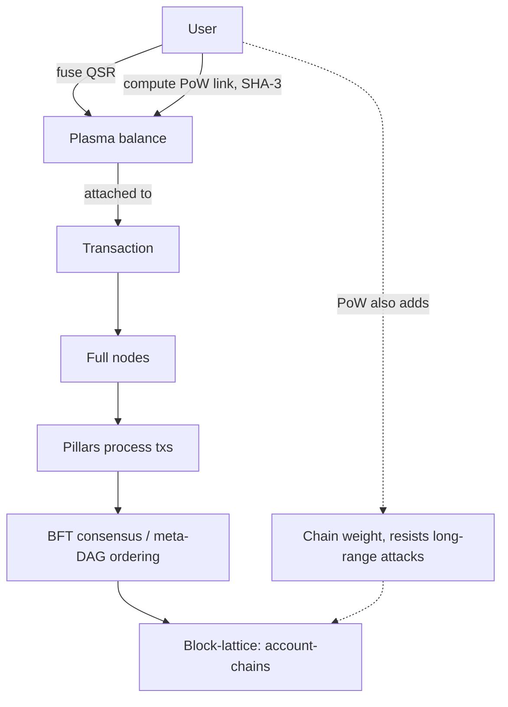
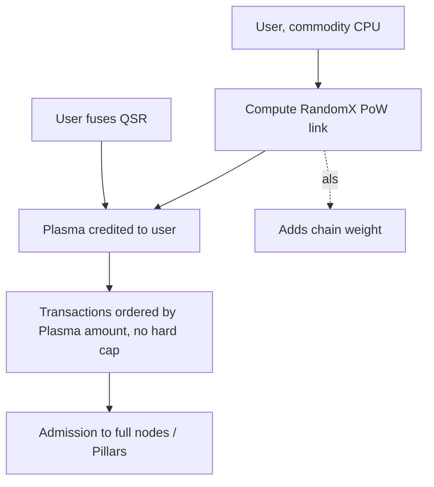
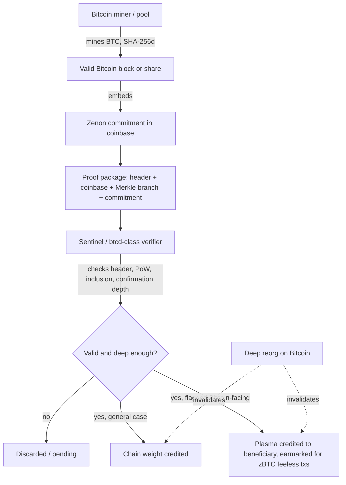
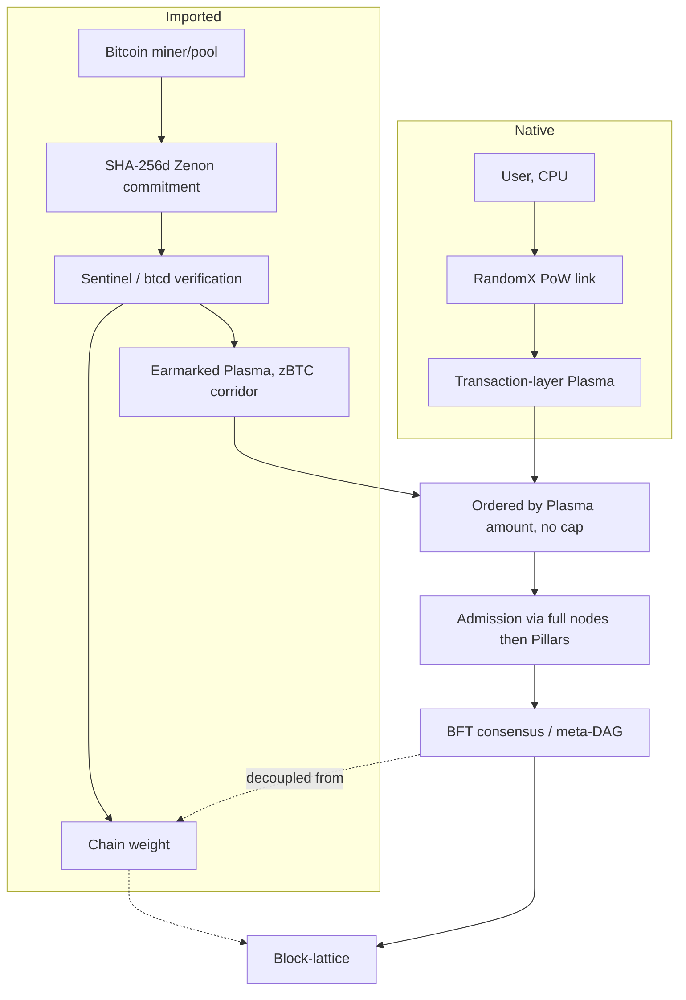
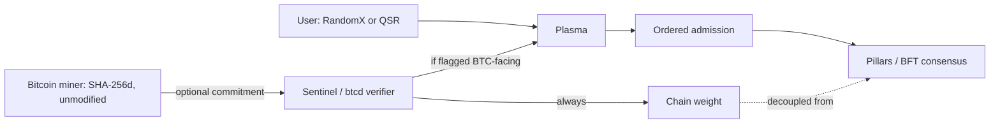

# Kaine's Macro Blueprint for Bitcoin Merge-Mining, PoW, and Plasma

*A mechanism-level reconstruction, companion to "Reconstructing Kaine's Merge-Mining Architecture." Same source: the `mrkainez` Telegram archive (Zenon Network, 876 messages from Telegram ID `1992970673`, 2021-10-01 to 2023-07-18).*

## Note on Method

The companion report ranked interpretations and eliminated readings. This one is asked to go further: draw the actual mechanism, fill unstated gaps with the smallest coherent engineering assumption, and label every gap as a gap. Four labels carry over unchanged, plus one new one for this document specifically:

- **[LOCKED]**: directly supported by Kaine's own words.
- **[STRONG INFERENCE]**: the best fit across multiple independent statements.
- **[WEAK INFERENCE]**: plausible, not well constrained.
- **[VERIFIED EXTERNALLY]**: checked against a source outside the archive, flagged as such.
- **[SPECULATIVE DESIGN CHOICE]**: not evidenced anywhere in the archive; the smallest addition needed to make a stated outcome mechanically possible, imported from how equivalent systems (chiefly Namecoin-style AuxPoW, the closest working precedent Kaine himself gestures at through the verified Satoshi/BitDNS material) actually work.

A second search pass for this document, targeted at mechanism-level vocabulary, found nothing for: reorg, checkpoint, epoch, coinbase, nonce, AuxPoW, subsidy, subsidize, header (beyond one shared link). That absence is itself load-bearing. It means every answer this document gives to the "who submits what, to whom, verified how" questions below is, at some point, a **[SPECULATIVE DESIGN CHOICE]**, not a recovered fact. I say so at each such point rather than smoothing over it. Three genuinely new pieces of evidence did turn up in the second pass and change the picture in useful ways:

1. **[LOCKED]**, Dec 9, 2022: *"And the PoW is performed by users that want to issue feeless transactions on the network: this increases the security margin when the network usage is higher."* Security weight scales with usage, directly, not just with total PoW in the abstract.
2. **[LOCKED]**, Dec 9, 2022, ten messages later: *"The next challenge is to implement Dynamic Plasma (similar to Bitcoin's difficulty adjustment mechanism)."* This is a genuine mechanism clue, not just a name. It sits in the same conversation as a second **[VERIFIED EXTERNALLY]** quote: Kaine reposts, verbatim, Satoshi Nakamoto's own February 2010 explanation of Bitcoin's difficulty retargeting ("if the number of nodes doubles, the difficulty will also double, returning the total generated to the target rate"). He curated the primary source for the exact mechanism he then analogizes Dynamic Plasma to, in the same sitting. That is stronger corroboration than the bare analogy alone.
3. **[LOCKED]**, same window: *"How many major Bitcoin mining pools do you know?"* A rhetorical question, parent message missing, but it shows pool concentration was a live concern in his own head at the time he was designing this, not a blind spot this document is inventing.

---

## Phase 1: The Existing Zenon Baseline

Established **[LOCKED]** from the archive, independent of the merge-mining question entirely:

**What a PoW link is.** A computational proof, already implemented in go-zenon (a `pow` folder existed by April 2022, "about 2-3 times slower than the C implementation, but it works"), that a user computes in order to generate Plasma. As of December 2022 the live algorithm was SHA-3.

**How PoW links generate Plasma, and how QSR fusion also generates it.** Two parallel, already-existing routes to the same resource: *"Plasma is used as network gas and can be generated either by locking (fusing) QSR or by generating PoW (there is a hard limit for Plasma via PoW)."* QSR-fusion is a lock/stake action; PoW is a compute action. Both terminate in the same resource, Plasma, spent the same way.

**What Plasma is used for, and where it sits in the transaction lifecycle.** Network gas: the resource a transaction must hold to be admitted. The stated pipeline: *"Tx -> full nodes -> Pillars processing txs -> consensus -> appended to the block-lattice."* Plasma sits before or at the full-node/Pillar admission step, gating entry, not inside consensus itself.

**What chain weight is, and how it differs from consensus.** *"The idea behind a dual ledger system is to decouple consensus from chain weight."* Bitcoin's model, per Kaine's own contrast: *"consensus coupled with chain weight: 'longest chain of most accumulated proof of work.'"* NoM's model: *"consensus decoupled from chain weight (added when users are performing tx with PoW)."* Consensus (who ordered what, is BFT-style, decided by Pillars voting over a DAG, later tied to the Narwhal-Tusk protocol by name) answers "what is the agreed sequence." Chain weight answers a different question entirely, closer to "how expensive would it be to fabricate or rewrite this history."

**Why the block-lattice needs PoW weight at all, if consensus is already BFT-like.** Answered directly and specifically: *"PoW secures the block-lattice ledger by adding weight. This prevents some PoS attack vectors such as long range attacks."* BFT-style consensus among a bounded validator set (Pillars) settles ordering, but does not by itself make history expensive to rewrite the way accumulated proof-of-work does; the newly-found quote sharpens this further: *"this increases the security margin when the network usage is higher."* The defense is not a fixed constant; it scales with how much real transaction activity, and therefore real PoW, has actually occurred.

**What the existing SHA-3 lane did, and the hard cap.** SHA-3 was the sole PoW-link algorithm as of the Dec 20, 2022 design session ("we currently have SHA-3 as pow-links"), undifferentiated between CPU and ASIC accessibility at that point, it simply was the thing that generated PoW-based Plasma. The PoW route carried "a hard limit," stated as fact in the April 2022 baseline message and independently confirmed as "just an artificial limit" and "the network can process several times more with the current implementation" in December 2022. This is the state Dynamic Plasma is a change *to*, not a change *from nothing*.

**One structural point the prior report under-weighted, worth stating precisely here because the whole ASIC-lane question in Phase 3 depends on it:** at no point does Kaine describe SHA-3 as split into a CPU flavor and an ASIC flavor. The CPU/ASIC split is introduced later, as a *replacement plan* for the single undifferentiated SHA-3 lane, not as a pre-existing bifurcation. This matters because it rules out one tempting misreading: that ASIC PoW was always a separate, already-running thing merge-mining would simply plug into. It wasn't. Both RandomX and the merge-mining-sourced ASIC contribution are, as of everything datable in this archive, proposed replacements for the one thing that already existed.

---

## Phase 2: Reconstructing Dynamic Plasma

**Why order transactions by Plasma amount?** The stated first step, twice, in near-identical wording ("1 order txs (sorted by plasma)"; "Order transactions by Plasma amount"). This is an ordering/priority rule, not an admission rule by itself; it answers "which pending transactions go first," using Plasma amount as the tie-breaker. **[LOCKED]**.

**What happens after the hard cap is removed?** The cap was the thing making PoW-generated Plasma scarce and bounded. Removing it, combined with ordering-by-amount, converts a hard ceiling into a soft, continuous priority auction: anyone can generate as much PoW-Plasma as they're willing to compute, and more of it buys a better position in the queue rather than hitting a wall. **[STRONG INFERENCE]**, built directly from the two stated facts (cap existed and was artificial; cap gets removed; ordering-by-amount is introduced at the same time).

**Is Plasma effectively a fee market without direct monetary fees?** Yes, functionally, though Kaine never uses the phrase "fee market" himself. The May 9, 2023 aside makes the comparison almost explicit: *"Bitcoin fees: satoshi/vbyte (storage). Ethereum fees: wei/computational step (processing). Plasma should consider both."* He is comparing Plasma directly to two fee mechanisms and asking it to absorb lessons from both. **[STRONG INFERENCE]** for the label "fee market"; **[LOCKED]** for the comparison itself.

**Does more Plasma buy priority, throughput, security weight, or all three?** All three, and this is one of the cleaner conclusions in this document because three independent statements each support a different leg of it: priority ("order txs sorted by plasma"), throughput (cap removal explicitly framed as the fix for an artificial throughput ceiling, "the next logical step" after noting the network "can process several times more"), and security weight ("PoW secures the block-lattice ledger by adding weight," with weight explicitly tied to the same PoW that generates Plasma). **[LOCKED]** for each leg individually; the "all three simultaneously, via one unified mechanism" framing is **[STRONG INFERENCE]**, since Kaine never states the three effects in a single sentence together.

**Why replace SHA-3 with RandomX, specifically?** Two convergent reasons, both **[LOCKED]**: RandomX is CPU-mineable, preserving the "as decentralized as possible" participation goal SHA-3 (an algorithm with no stated CPU/ASIC-accessibility rationale) never explicitly earned; and it lets the ASIC-friendly role be dropped natively and imported instead ("ASIC friendly PoW can be obtained from merge-mining"), which only makes sense as a design if the CPU-side algorithm is *not itself* the thing importing that role.

**Why is CPU accessibility important specifically at the transaction layer?** Because that is where PoW is scoped, full stop: *"It's limited to the transaction layer at the moment."* Combined with the reward-and-punishment logic elsewhere in the archive (pure PoS flagged as economically and socially flawed; PoW as "the most pure form of Sybil-resistance"), the picture is that transaction admission is the one place ordinary users interact with the network's Sybil-resistance mechanism directly, and Kaine wants that interaction point to stay reachable on commodity hardware rather than requiring specialized equipment. **[STRONG INFERENCE]**.

**How should RandomX work relate to QSR fusion? What does "balance PoW and QSR fusing" likely mean?** The archive gives two parallel, pre-existing Plasma routes (PoW, QSR-fusion) and one stated goal (balance them) with no stated mechanism for the balancing itself. The smallest coherent reading: as PoW-generated Plasma becomes cheaper and less capped (RandomX plus no hard limit), it risks crowding out QSR-fusion as a route, since fusion requires locking capital while PoW only requires compute time; "balancing" most plausibly means keeping some exchange-rate or relative-cost relationship between the two routes so neither one strictly dominates. **[WEAK INFERENCE]**; the archive never specifies a mechanism, only the goal.

**Is Plasma consumed, reserved, proven, regenerated, or merely attached as weight?** Consumed on the ordinary user side (network gas is spent to admit a transaction, the same framing as any gas/fee model); but the underlying PoW that generated it also appears to leave a residual trace as ledger weight that is not "spent" in the same sense (weight is cumulative, per the "adding weight" and "prevents long range attacks" language, which only works if weight persists rather than being consumed and forgotten). **[STRONG INFERENCE]**: Plasma-the-balance is consumed; PoW-the-underlying-work also, separately, leaves behind weight that is not.

**Does Kaine want every user to compute PoW themselves, or does he allow outsourced generation?** Outsourcing is explicitly sanctioned, though for a different node role: *"Sentinels can outsource the PoW generation to other sources."* Sentinels are stated to not compute PoW themselves at all ("Sentinels won't need to compute PoW. Just process and relay information"). There is no equivalent statement about ordinary transacting users outsourcing their own Plasma-generating PoW, but there is also nothing ruling it out, and a PoW-service-provider market is a small, natural extension once outsourcing is established as an acceptable pattern for one node type. **[LOCKED]** for Sentinels specifically; **[WEAK INFERENCE]** extended to ordinary users.

---

## Phase 3: Reconstructing the ASIC Lane (the central exercise)

**The nine possibilities, ranked, tested against the archive.**

| # | Possibility | Verdict |
|---|---|---|
| 1 | Generate Plasma directly | Survives, but only as a narrow, earmarked case, not the general rule (see below) |
| 2 | Generate a second class of Plasma | Weak. No vocabulary anywhere for a second Plasma class; built entirely from the ambiguity of the word "balance" |
| 3 | Create or validate PoW links | Partial survival: this is the mechanism, not a distinct effect. See Phase 4 |
| 4 | Add chain weight without creating user Plasma | Survives as the primary, general-case effect |
| 5 | Produce checkpoints | Survives only as a re-framing of the difficulty-adjustment analogy; not literal checkpointing anywhere in the text |
| 6 | Subsidize Bitcoin-facing transactions | Survives as the specific, earmarked exception |
| 7 | Strengthen the block-lattice against long-range attacks | Survives; this is the stated purpose of PoW-adding-weight generally, and the ASIC lane is the part of that weight NoM does not have to build itself |
| 8 | Serve as a scarce, industrial security input | Survives as framing/rationale, not as a separate mechanical effect from 4 and 7 |
| 9 | Combination | Correct, but only if the combination is structured (a general rule plus a narrow exception), not an undifferentiated blend |

**The two statements that must both be true at once:**

> "ASIC friendly PoW can be obtained from merge-mining"

> "the other way around is to merge mine ZNN and create Plasma for Bitcoin feeless txs"

These are presented by Kaine himself as two directions of one idea ("the other way around"), not two unrelated proposals. Reconciling them is the load-bearing move of this whole document.

**Direction A** (per the prompt's framing): Zenon users create PoW links that can also be used to mine a Bitcoin-adjacent target. **Direction B**: Bitcoin miners create valid parent work that Zenon accepts and converts into Plasma or weight.

Testing both against a real constraint the archive itself supplies: SHA-3 (and later RandomX) is not the same algorithm as Bitcoin's SHA-256d. You cannot submit identical work to satisfy both a SHA-3/RandomX target and a SHA-256d target; the hash functions are different. Literal, dimension-for-dimension shared work under Direction A, as stated, does not work unless the "PoW link" being merge-mined is itself computed in SHA-256d. That constraint is not invented for this document: Kaine names SHA-256d as one of "the best candidates," in the same design session, alongside RandomX, for the two-flavor PoW split. **[LOCKED]** premise, **[STRONG INFERENCE]** conclusion: the ASIC-flavored PoW link, specifically, is the SHA-256d one, and it is SHA-256d compatibility, not a general property of "PoW links" as a category, that makes merge-mining possible at all.

With that resolved, both directions turn out to be coherent, and describe two different populations of work-submitters rather than two competing theories:

- **Direction A**, general case: a participant computing a SHA-256d-flavored Zenon PoW link happens, by construction, to also be computing valid Bitcoin proof-of-work. This is symmetric with how Namecoin miners work today: they are Bitcoin miners first, and the auxiliary chain rides along. Effect: broadly-available ASIC-lane weight contribution, open to anyone running SHA-256d hardware, whether or not they care about Bitcoin specifically.
- **Direction B**, narrow case: participants who are *already* Bitcoin miners, mining for Bitcoin's own reward regardless of Zenon, opportunistically also embed a Zenon commitment, essentially for free marginal cost. Kaine ties this specific population's output to a specific outcome: Plasma "for Bitcoin feeless txs," matching the zBTC atomic-swap flow sketched the very next day.

**Which was likely primary?** The general case (Direction A, feeding chain weight, per the "add weight" language and the Dec 2022 design session, which never mentions Bitcoin-facing transactions at all) reads as the default, standing rule. The earmarked case (Direction B) reads as a specific, additional application layered on the same underlying primitive, motivated by and scoped to the zBTC flow specifically. **[STRONG INFERENCE]**: one mechanism, two populations of submitter, two effects, with the general-weight effect being the rule and the earmarked-Plasma effect being the named exception.

---

## Phase 4: The Most Likely Merge-Mining Mechanism

Every design choice below is labeled individually, as required. Nothing here should be read as recovered fact where it says [SPECULATIVE DESIGN CHOICE]; it is the smallest addition that makes the [LOCKED] statements mechanically possible, built on the closest working precedent Kaine himself surfaces (Namecoin-style AuxPoW, via the verified Satoshi/BitDNS material).

- **Parent work source**: Bitcoin's ordinary SHA-256d mining process. **[LOCKED]** that it's Bitcoin; **[SPECULATIVE DESIGN CHOICE]** whether full blocks or pool-level shares count (see below).
- **Auxiliary commitment**: a Zenon-specific commitment hash embedded in the miner's coinbase transaction, the standard AuxPoW pattern. **[SPECULATIVE DESIGN CHOICE]**, imported wholesale from the Namecoin precedent; zero Zenon-specific evidence.
- **Zenon-specific work target**: a separate, independently-set difficulty target for the auxiliary commitment, lower than Bitcoin's own, so that most valid Bitcoin work also clears the Zenon-side bar (again the standard AuxPoW pattern). **[SPECULATIVE DESIGN CHOICE]**.
- **Proof package**: parent block header, coinbase transaction, Merkle branch proving coinbase inclusion, the Zenon commitment itself, and (inferred) a beneficiary address. **[SPECULATIVE DESIGN CHOICE]** in its entirety; see the Smallest Viable Proof Object deliverable below for the standard-vs-inferred breakdown.
- **Verifying component**: something has to track Bitcoin chain state to check header validity, PoW validity, and inclusion. This is functionally identical to what btcd was independently described as doing ("access to the state of Bitcoin's blockchain"). **[STRONG INFERENCE]**: this is where btcd plausibly connects to merge-mining. It is worth being precise about the limits of this claim, matching the companion report's own finding: btcd and "merge mining" never co-occur in a single message. The connection here is architectural necessity (something has to do this job, and btcd is the only thing in the archive described as doing anything like it), not a stated fact.
- **Which node role receives and relays the proofs**: Sentinels are the best fit. They are independently described as not computing PoW themselves, as processing and relaying information, and as candidate "protocol level oracles," all of which is exactly the shape of job merge-mining verification/relay would need. **[STRONG INFERENCE]**, built by combining two separately-stated facts about Sentinels that Kaine never himself connects to merge-mining. One temporal wrinkle worth flagging: Sentinels are stated as "not implemented yet" as of April 2022, before most of the merge-mining discussion even happens, so an early version of this mechanism would have needed full nodes or Pillars to do this job directly.
- **Effect of Bitcoin reorgs**: never addressed. **[SPECULATIVE DESIGN CHOICE]**: a minimum confirmation-depth requirement before crediting anything, analogous to the 101-confirmation rule Kaine states for Zenon's own legacy chain and to ordinary Bitcoin settlement norms, with a revocation path if a sufficiently deep reorg later invalidates the credited parent block.
- **Full blocks or pool shares**: **[SPECULATIVE DESIGN CHOICE]**, and the more consequential one. Zenon's own PoW-link difficulty budget is necessarily far smaller than Bitcoin's full-block difficulty; requiring an actual valid Bitcoin block for every unit of credit would make the ASIC lane extremely rare and bursty rather than continuous. Accepting lower-difficulty pool shares (the real-world pattern for Namecoin and Syscoin merge-mining alike) is the smaller, more workable assumption, and fits with Kaine's own, otherwise unexplained interest in "how many major Bitcoin mining pools do you know."
- **Credit granularity**: **[SPECULATIVE DESIGN CHOICE]**, and probably two-layered rather than one: continuous per-share crediting of weight (and, for Direction B, Plasma), with a separate, periodic epoch-level retargeting of the PoW-to-Plasma exchange rate, matching the difficulty-adjustment analogy. These are different jobs; the archive's own analogy points at the second one, not the first.
- **What accepted work changes**: primarily chain weight (general case, Direction A); additionally Plasma credited to a specified beneficiary in the earmarked case (Direction B). **[STRONG INFERENCE]**, per the Phase 3 synthesis.
- **Does the miner choose a recipient address?** **[SPECULATIVE DESIGN CHOICE]**, but close to necessary: without a beneficiary field, "create Plasma for Bitcoin feeless txs" has no destination, and every real AuxPoW system solves this the same way, with a payout address chosen by whoever submits the work.
- **Can work be pooled?** Almost certainly yes in practice, unaddressed explicitly, but assuming otherwise contradicts how Bitcoin mining actually operates today, a reality Kaine's own rhetorical question shows he was tracking. **[STRONG INFERENCE]**.
- **Is btcd needed to follow headers and validate parent-chain inclusion?** Yes. **[STRONG INFERENCE]**, the strongest and most specific form of the btcd/merge-mining connection this document can support.
- **Can this function without Bitcoin consensus knowing Zenon exists?** Yes, definitively. **[VERIFIED EXTERNALLY]**: this is the literal content of the Satoshi passage Kaine reposted, "the networks wouldn't need any coordination." Bitcoin's protocol requires zero modification; a miner embeds extra commitment data in space (the coinbase) miners have always had latitude to fill.

---

## Required Process of Elimination: Seven Candidate Macro Blueprints

### Candidate 1: Bitcoin AuxPoW Directly Generates Plasma

**Architecture**: Bitcoin miners merge-mine Zenon commitments; valid imported work converts directly into Plasma credited to a Zenon address, as the general rule for all merge-mined work.

**Supporting statements**: "create Plasma for Bitcoin feeless txs" is a direct statement that merge-mined work creates Plasma.

**Contradicting statements**: "PoW secures the block-lattice ledger by adding weight" describes a systemic, aggregate effect, not an individually-credited balance; if this were the general rule, that language would be an odd way to describe it.

**Missing components**: no statement that this is the *general* rule rather than a narrow case.

**Security implications**: if unrestricted, ASIC-sourced Plasma could buy transaction priority, letting Bitcoin's already-concentrated mining pools dominate NoM's own transaction queue, directly undermining the stated purpose of keeping RandomX/CPU access "as decentralized as possible."

**Incentive implications**: incomplete. Why would a Bitcoin miner bother, unless someone on the Zenon side is arranging and probably paying for it?

**Operational complexity**: moderate; standard AuxPoW, well-trodden via Namecoin.

**Probability: 45%.**

**Elimination verdict**: survives only in narrowed form, folded into Candidate 4 below. Eliminated as a *general* rule for all merge-mined work.

### Candidate 2: Bitcoin AuxPoW Adds Chain Weight, RandomX Alone Generates User Plasma

**Architecture**: imported ASIC work strengthens the block-lattice generally; RandomX remains the only route users actually use for transaction-layer Plasma.

**Supporting statements**: "PoW secures the block-lattice ledger by adding weight"; "CPU PoW is important for txs. ASIC PoW can be merge-mined" (read plainly: CPU maps to the transaction/Plasma layer, ASIC maps to something else); "It's limited to the transaction layer at the moment" (implying ASIC PoW is not scoped to that layer).

**Contradicting statements**: does not, by itself, explain "create Plasma for Bitcoin feeless txs," which is explicit that merge-mined work creates Plasma in at least one case.

**Missing components**: no explicit statement that RandomX is *exclusively* the Plasma route.

**Security implications**: cleanest of the seven. ASIC/pool concentration cannot buy transaction priority under this design, only contributes to a systemic, non-discriminatory weight pool.

**Incentive implications**: the weakest of the seven for miner-side completeness. Nothing rewards a Bitcoin miner for anonymously strengthening someone else's ledger; needs an unstated reward channel.

**Operational complexity**: low to moderate.

**Probability: 65%.**

**Elimination verdict**: survives as the general, default rule, refined rather than replaced by Candidate 4's earmarked exception.

### Candidate 3: Two Plasma Classes

**Architecture**: RandomX creates ordinary transaction Plasma; imported ASIC work creates a harder, security-weighted form of Plasma, or a multiplier on it.

**Supporting statements**: "balance both types of PoW" is compatible with two deliberately parallel resource classes, at a stretch.

**Contradicting statements**: "CPU PoW is important for txs" reads more naturally as "the CPU lane is the one that matters here" than as "there are two tiers of the same resource." No vocabulary anywhere in the archive for a second class, a multiplier, or a conversion rate between them.

**Missing components**: total. This candidate is built from the ambiguity of one word.

**Security implications**: if the ASIC-sourced tier carries more weight or priority, it recreates the exact monopolization risk Candidate 2 avoids, just formalized into two tiers.

**Incentive implications**: would need an unstated exchange rate between the two classes.

**Operational complexity**: highest of the seven; two parallel resource-accounting systems.

**Probability: 20%.**

**Elimination verdict**: eliminated. The word "balance" is better explained by Candidate 2 (each lane does a different job) than by a genuine two-tier resource system, and the participation-decentralization goal stated elsewhere cuts directly against it.

### Candidate 4: Bitcoin-Facing Plasma Subsidy

**Architecture**: merge-mined work creates Plasma specifically earmarked for zBTC or Bitcoin-facing feeless transactions, as a narrow exception riding on top of Candidate 2's general weight-only rule.

**Supporting statements**: a near-direct reading of "the other way around is to merge mine ZNN and create Plasma for Bitcoin feeless txs," reinforced by the zBTC atomic-swap diagram the very next day and "the PoW is performed by users that want to issue feeless transactions."

**Contradicting statements**: does not address the generic "ASIC friendly PoW can be obtained from merge-mining," which reads as a sourcing rule for the whole ASIC lane, not one earmarked corridor.

**Missing components**: no stated enforcement mechanism for the earmarking itself (a tagged Plasma type? a routing rule? a separate balance?).

**Security implications**: if the subsidized pool is unbounded, BTC-facing transactions could become systematically cheaper to spam than ordinary NoM transactions, a new asymmetry Candidate 2 alone does not have.

**Incentive implications**: the cleanest of the seven. Gives Bitcoin miners (or whoever arranges the commitment) a legible, specific reason to participate, subsidizing a valuable corridor rather than an abstract systemic good.

**Operational complexity**: moderate; needs a routing/earmarking rule layered on top of ordinary weight accounting.

**Probability: 40%.**

**Elimination verdict**: survives, as the specific exception to Candidate 2's general rule, not as a competing general theory.

### Candidate 5: Merge-Mined Checkpoint or Epoch Weighting

**Architecture**: Bitcoin work does not fund individual transactions; it periodically anchors or weights the block-lattice at an epoch boundary.

**Supporting statements**: the difficulty-adjustment analogy (Dynamic Plasma "similar to Bitcoin's difficulty adjustment mechanism," itself a periodic, windowed mechanism in the real Bitcoin system Kaine quotes at length).

**Contradicting statements**: "adding weight" language reads continuous and transaction-by-transaction; the archive never uses "checkpoint" or "epoch" in connection with merge-mining specifically.

**Missing components**: heavy; built from a structural analogy, not a direct statement about batching the security contribution.

**Security implications**: periodic anchoring is a well-understood, purpose-built answer to long-range-attack resistance specifically, arguably a cleaner match for that stated goal than continuous weight.

**Incentive implications**: unclear who is rewarded for contributing to a periodic checkpoint versus continuous crediting.

**Operational complexity**: moderate; adds an aggregation step on top of continuous crediting.

**Probability: 30%.**

**Elimination verdict**: survives only in modified form. Folded into Phase 4's mechanism as the periodic retargeting/re-pricing layer (how the PoW-to-Plasma exchange rate resets), not as a standalone alternative to continuous per-share weight crediting.

### Candidate 6: Separate Merge-Mined Extension or Auxiliary Chain

**Architecture**: a Bitcoin-merge-mined companion chain feeds Plasma, proofs, or security into NoM as an intermediary, echoing the BitDNS model and the later extension-chain comments.

**Supporting statements**: the BitDNS quote itself is precisely about a separate chain sharing CPU power; the 2023 extension-chain proposal reuses a "separate but linked, dual-pegged" pattern for a different purpose.

**Contradicting statements**: extension chains appear over a year later with an unrelated stated purpose (deploying smart contracts without touching L1) and zero textual link back to merge-mining or Plasma.

**Missing components**: total; no message describes a distinct merge-mining chain as an intermediate hop.

**Security implications**: adds an entire extra consensus/validation layer purely as plumbing, cutting against the repeatedly-stated minimal-L1 preference.

**Incentive implications**: would need its own token/reward design on top of everything else, the largest unaddressed gap of the seven.

**Operational complexity**: highest, alongside Candidate 3.

**Probability: 10%.**

**Elimination verdict**: eliminated as a general theory. The BitDNS quote is best read as an analogy for direct work-sharing (Phase 4's mechanism), not a proposal for an actual third chain as intermediary. Naming and eliminating this candidate matters because it is the most tempting misreading available once someone notices the BitDNS quote and the extension-chain comments separately.

### Candidate 7: Direct Merge-Mined NoM Block Production

**Architecture**: Bitcoin miners produce Zenon momentums directly, or replace Pillars.

**Supporting statements**: none. Included, per instruction, specifically to be eliminated.

**Contradicting statements**: the single most repeatedly and directly falsified reading available. At least five independent, [LOCKED] statements from the companion report state the opposite: consensus decoupled from chain weight; the meta-DAG separated from the block-lattice; the dual-ledger's stated purpose is to separate consensus from other business logic; PoW's scope stated as "limited to the transaction layer."

**Missing components**: not applicable; this is a strawman by design.

**Security implications**: would reintroduce exactly the Bitcoin-coupled model Kaine explicitly contrasts NoM against, and hand Bitcoin's concentrated mining pools effective control over Zenon's own transaction ordering.

**Incentive implications**: the worst centralization outcome of the seven.

**Operational complexity**: trivial to build, catastrophic in consequence.

**Probability: under 5%.**

**Elimination verdict**: eliminated, decisively, on multiple independent grounds.

---

## The Blueprint's Concrete Questions

### Who is doing the work?

| Role | Does | Does not |
|---|---|---|
| Ordinary Zenon users | Compute RandomX PoW links, or fuse QSR, to generate their own transaction-layer Plasma | Compute Bitcoin-facing SHA-256d work (no evidence any ordinary user is expected to run ASIC hardware) |
| PoW service providers (inferred market) | Compute PoW on behalf of a user who outsources it, per the Sentinel-outsourcing precedent extended [WEAK INFERENCE] | Anything evidenced directly; this role is not named in the archive, only implied by analogy |
| Sentinels | Process and relay information; best-fit candidate to verify and relay merge-mining proofs [STRONG INFERENCE]; serve as protocol-level oracles | Compute PoW themselves [LOCKED, stated directly] |
| Pillars | Process transactions; run BFT consensus; vote on ordering; optionally validate extension chains later on | Compute PoW [no evidence]; determine chain weight [explicitly decoupled from consensus, which is Pillars' job] |
| Bitcoin miners | Mine Bitcoin for Bitcoin's own reward; optionally embed a Zenon commitment in the coinbase at near-zero marginal cost [SPECULATIVE DESIGN CHOICE, mechanism] | Know Zenon exists, need to coordinate with it, or change any Bitcoin-side behavior [VERIFIED EXTERNALLY, per the reposted Satoshi quote] |
| Bitcoin mining pools | Aggregate miner hashrate; plausible point where share-level (not full-block) commitments get bundled [SPECULATIVE DESIGN CHOICE] | Anything Kaine states directly; their relevance here is inferred entirely from his own "how many major Bitcoin mining pools do you know" aside |
| Full nodes | Receive transactions from users, forward toward Pillars [LOCKED, stated in the baseline pipeline] | Compute or verify merge-mining proofs specifically [no evidence either way] |
| A btcd sidecar | Track Bitcoin chain state; supply the state-access and Schnorr-signature capability described independently; the natural home for header/inclusion verification [STRONG INFERENCE] | Appear anywhere in the same message as "merge mining" [confirmed absence, companion report] |

### What exactly is being recycled?

Not "PoW" generically. Specifically: **valid Bitcoin proof-of-work solutions (most plausibly at share granularity, not full-block granularity) that already exist because Bitcoin miners are mining Bitcoin for Bitcoin's own reward, redirected via an auxiliary commitment into a second, independently-verifiable claim.** In the language of the prompt's own list: closest to "Merkle-committed auxiliary work" and "valid Bitcoin block work" (or share-level equivalents of it), which then converts into "chain weight" as the general effect and "Plasma-generation rights" as the earmarked one. Not hash attempts in the abstract (unsuccessful attempts prove nothing and commit to nothing); not difficulty itself (difficulty is a parameter of the target, not a recycled object); not a "security budget" as a standalone concept (that is the outcome, not the object being recycled).

### What does Zenon verify?

**[SPECULATIVE DESIGN CHOICE]** throughout, since no message specifies this, built from the standard AuxPoW pattern:

- Standard AuxPoW fields, imported wholesale: parent (Bitcoin) block header; the coinbase transaction; a Merkle branch proving the coinbase's inclusion in that block; parent difficulty (to confirm the work meets or exceeds Bitcoin's own target, or the pool's share target); a chain identifier (anti-replay, so the same commitment cannot be claimed against a different auxiliary chain).
- Zenon-specific fields, inferred, not standard: the Zenon commitment hash itself; a recipient/beneficiary Zenon address; a purpose flag distinguishing general-weight submissions from earmarked Bitcoin-facing-Plasma submissions, if the Candidate 2/4 synthesis is right; confirmation depth (a validation rule the verifier applies, not a field in the proof object itself).

### What does accepted work change?

Most likely answer: **it adds chain weight, unconditionally and as the general rule** (Candidate 2), consistent with "PoW secures the block-lattice ledger by adding weight" and with keeping RandomX exclusively responsible for ordinary transaction Plasma. Strongest fallback: **it additionally credits Plasma to a specified beneficiary, but only for commitments flagged as Bitcoin-facing** (Candidate 4), consistent with the one explicit statement that merge-mined work "creates Plasma." It does not, on any tested candidate, mint ZNN/QSR directly, choose Pillars, vote in consensus, or determine momentum ordering; nothing in the archive supports any of those, and several statements directly rule them out.

### How does this avoid replacing consensus?

Drawn explicitly, using only what is [LOCKED] in the companion report:

- Bitcoin work does not choose Pillars: no statement anywhere connects merge-mining to Pillar selection; Pillars are consistently described as staked/governed separately.
- Bitcoin work does not vote in BFT consensus: the meta-DAG is explicitly "separated from the block-lattice," and PoW is explicitly "limited to the transaction layer."
- Bitcoin work does not determine momentum ordering: ordering is Plasma-amount-based at the transaction-queue level (Dynamic Plasma's own stated first step), a different question from Pillar-driven consensus ordering of the DAG itself.
- Bitcoin work does not automatically finalize anything: finality remains a function of the BFT/meta-DAG layer; weight makes history *expensive to rewrite*, which is a different property from *deciding what the history is*.
- Consensus still decides canonical ordering; PoW-derived weight makes fabricating an alternative history costly after the fact, the same logical role Bitcoin's own accumulated work plays, just decoupled from who gets to decide ordering in the first place.

This is exactly what the dual-ledger separation is for, per Kaine's own words: decouple consensus from chain weight so that a resource-and-security mechanism (Plasma, PoW, imported ASIC work) can evolve independently of, and without touching, who is allowed to vote on transaction ordering.

### How do RandomX and Bitcoin SHA-256d coexist?

| Property | RandomX lane | Bitcoin merge-mined lane |
|---|---|---|
| Participants | Ordinary Zenon users; possibly outsourced PoW-service providers | External Bitcoin miners and pools, not necessarily aware Zenon exists |
| Hardware | Commodity CPUs | Bitcoin ASICs |
| Native or imported | Native to NoM | Imported, recycled from Bitcoin's existing infrastructure |
| Main purpose | Broad, low-barrier participation tied directly to the act of transacting | Import industrial-scale security without NoM building or subsidizing its own ASIC ecosystem |
| Produces | Transaction-layer Plasma, directly and primarily | Chain weight, generally; earmarked Plasma, in the Bitcoin-facing case only |
| Affects consensus? | No | No |
| Affects Plasma? | Yes, directly | Only in the earmarked case, not as the general rule |
| Affects chain weight? | Indirectly, via Plasma-bearing transactions | Yes, primarily |
| Centralization risk | Low, by explicit design intent | High, inherited directly from Bitcoin's own mining-pool concentration |
| Security benefit | Broad-based, incremental, scales 1:1 with actual usage | Large in absolute magnitude, but concentrated rather than broad-based |

**Why both, instead of one?** Because they are not competing for the same job. RandomX answers "how do ordinary users keep participating without specialized hardware." The Bitcoin lane answers "how does NoM get industrial-scale security weight without becoming an ASIC-dependent network itself." Kaine states the underlying tension directly: Satoshi's "1 CPU = 1 vote" ideal against Hal Finney's foreseen industrial-scale ASIC reality. One algorithm cannot satisfy both without compromising one of the two goals, which is exactly the failure mode Bitcoin itself demonstrates (ASIC-dominated, CPU mining long since priced out). Splitting the lane, and importing rather than building the ASIC side, is the smallest design that keeps both goals intact simultaneously.

---

## Required Architecture Diagrams

### Diagram 1: Existing NoM Transaction and Plasma Flow



Plain-text fallback:
```
User --(fuse QSR)--> Plasma balance --(attached to)--> Transaction
User --(compute SHA-3 PoW link)--> Plasma balance
Transaction --> Full nodes --> Pillars (process txs) --> Consensus (BFT / meta-DAG ordering) --> Block-lattice (account-chains)
PoW, separately, also adds Chain weight --> Block-lattice (resists long-range attacks)
```

Correction to the naive version of this diagram: consensus and chain weight are NOT the same arrow. Chain weight is added by the same PoW act that generates Plasma, but its effect lands on the block-lattice's resistance to history-rewriting, not on the consensus/ordering step. Drawing them as one line is the single most common misreading this document is trying to prevent.

### Diagram 2: RandomX Dynamic Plasma Lane



Plain-text fallback:
```
User (commodity CPU) --> compute RandomX PoW link --> Plasma credited to user
User --> fuse QSR --> Plasma credited to user
Plasma balance --> transactions ordered by Plasma amount (cap removed) --> admission to full nodes/Pillars
RandomX work, separately --> adds chain weight
```

### Diagram 3: Bitcoin Merge-Mining Lane



Plain-text fallback:
```
Bitcoin miner/pool mines BTC (SHA-256d) --> produces valid block or share
  --> embeds Zenon commitment in coinbase
  --> proof package (header + coinbase + Merkle branch + commitment)
  --> Sentinel / btcd-class verifier checks header, PoW validity, inclusion, confirmation depth
    --> if invalid or too shallow: discarded / pending
    --> if valid, general case: chain weight credited
    --> if valid, flagged Bitcoin-facing: Plasma credited to beneficiary (earmarked, zBTC feeless txs)
  A sufficiently deep Bitcoin reorg can invalidate an already-credited proof (unaddressed by Kaine; smallest coherent assumption)
```

### Diagram 4: Combined Dual-PoW Architecture



Plain-text fallback:
```
NATIVE LANE: User (CPU) --> RandomX PoW link --> transaction-layer Plasma
IMPORTED LANE: Bitcoin miner/pool --> SHA-256d Zenon commitment --> Sentinel/btcd verification -->
    (general) chain weight
    (earmarked) Plasma for the zBTC/Bitcoin-facing corridor

Both Plasma streams --> ordered by Plasma amount, no hard cap --> admission via full nodes -> Pillars
    --> BFT consensus / meta-DAG --> block-lattice

Chain weight feeds the block-lattice's resistance to rewriting, on a track explicitly decoupled
from the consensus/ordering track above it.
```

---

## Economics and Incentives

The archive never specifies an incentive model. It does, however, contain one strong steer: the verified Satoshi passage Kaine chose to repost states the incentive for merged mining plainly, "the incentive is to get the rewards from the extra side chains also for the same work." Kaine curated that argument; it is reasonable to weight it as his implicit starting point, while being clear this is inference, not a stated design.

Separately, and independently of merge-mining, ordinary PoW-based Plasma generation is already described in reward terms from early in the archive: "fix the Plasma collect issue (enable the possibility to collect rewards via PoW)" (Feb 2022); "collecting rewards should be available with Plasma via PoW" (Mar 2022). PoW-generates-collectible-value is an existing pattern, not one invented for merge-mining.

Evaluating the eight options against this:

| Option | Fit |
|---|---|
| ZNN rewards to merge-miners | Matches the Satoshi argument directly; carries real inflation risk, since emission would track Bitcoin's own hashrate, an input Zenon governance cannot throttle |
| QSR rewards | Same profile as ZNN; QSR is already the token tied to PoW/fusion mechanics elsewhere in the archive, making this a smaller conceptual step |
| Plasma credits only | Safest, no new token emission, fits the minimal-L1 philosophy; weakest fit to the Satoshi argument, since Plasma alone has no obvious value to an external Bitcoin miner with no Zenon use case |
| Tradable Plasma rights | A credible middle path: achieves transferable value without new token emission, and matches the outsourcing pattern already sanctioned for Sentinels |
| Fee rebates | Poor fit; NoM does not have a conventional fee to rebate, Plasma already replaces that role |
| zBTC-specific subsidies | Strong fit, but only for the earmarked Candidate 4 case, not merge-mining generally |
| No direct reward, only utility | Weakest fit; directly cuts against the Satoshi argument Kaine specifically chose to highlight |
| Pool-side bundled rewards | Orthogonal to the others; a plausible distribution mechanism (pools already do this for BTC) that could combine with any of the above |

**What Kaine said**: nothing about which asset rewards merge-miners; only the general principle, borrowed from Satoshi, that a reward is the incentive, and a separate, pre-existing pattern of PoW-generates-collectible-rewards for ordinary users.

**What must exist for the system to work**: something of transferable value for external participants with no natural interest in an otherwise illiquid, protocol-internal resource. This is closer to a logical necessity than a design preference.

**What incentive is most technically natural**: extending the existing "PoW earns collectible rewards" pattern to merge-mined work, rather than inventing a separate reward system, favoring QSR or tradable Plasma rights over a wholly new mechanism.

**What incentive would create dangerous inflation or centralization**: uncapped ZNN or QSR emission tied one-to-one to Bitcoin's own hashrate, an input Zenon cannot predict or throttle, risking both unbounded new supply and a transfer of Bitcoin's own mining-pool concentration directly into Zenon's tokenomics.

---

## Security Analysis

| Vector | Assessment |
|---|---|
| Bitcoin reorgs | Addressed in Phase 4 via confirmation depth plus a revocation path; residual risk below the confirmation threshold, unquantified |
| AuxPoW replay across addresses or epochs | Standard AuxPoW defends this by hashing the recipient and context into the commitment itself; [SPECULATIVE DESIGN CHOICE], not evidenced, but structurally necessary |
| Fake low-difficulty shares | Not a novel risk; standard PoW verification (hard to produce, easy to check) handles this, and Kaine's own July 2023 reputation analogy shows he holds exactly this property in mind |
| Pool centralization | Live concern in his own words ("how many major Bitcoin mining pools do you know"); unresolved in the archive |
| Mining-pool censorship | Real and unaddressed; pool operators control coinbase construction, so they could selectively exclude specific beneficiaries' commitments |
| Work withholding | Inherited wholesale from Bitcoin's existing pool infrastructure if share-level crediting is used; not a new risk this design introduces, but one it would import |
| Difficulty manipulation | A known category of problem for naive retargeting algorithms on smaller chains; unaddressed, relevant given the difficulty-adjustment analogy Kaine himself draws |
| Plasma monopolization | The central risk Candidate 2's weight-only default is built to avoid; residual exposure lives only inside the narrower Candidate 4 exception |
| QSR-fusion displacement | Addressed as an open question in Phase 2 ("balance PoW and QSR fusing"); no stated mechanism for how the balance is actually maintained |
| ASIC lane overpowering CPU participation | Mitigated, not eliminated, by the weight-versus-Plasma split; large imported weight does not, under Candidate 2, buy transaction priority away from CPU users |
| RandomX botnets | Not addressed anywhere in the archive; a known, real-world risk for CPU-mineable algorithms generally, inherited by algorithm choice rather than by anything Zenon-specific |
| Outsourced PoW markets | Sanctioned for Sentinels directly; extending it to ordinary users (Phase 2) reintroduces a re-centralization vector in tension with RandomX's own stated purpose |
| Long-range attacks | The stated purpose of PoW-weight in the first place; not a new risk, but its mitigation depends entirely on the weight-accumulation mechanism functioning as intended |
| Consensus/weight divergence | Unaddressed and, arguably, the single most important open question: no stated rule for what happens if the heaviest-weight history and the BFT-consensus-agreed history point different directions |
| False belief that Bitcoin hashpower automatically secures NoM consensus | The most dangerous misunderstanding available; see below |

**The most dangerous misunderstanding of the design**: believing that merge-mining imports Bitcoin's *consensus* security, in the sense that Bitcoin's hashrate now defends Zenon's transaction ordering the way it defends Bitcoin's own. It does not, on every tested candidate and every [LOCKED] statement in the companion report. What gets imported is *weight*, the cost of rewriting settled history, not *ordering authority*, which stays with Pillars and the BFT/meta-DAG layer regardless of how much Bitcoin hashrate is contributing at any given moment. Someone who conflates the two would wrongly conclude a Bitcoin-side attacker could override Pillar consensus or rewrite transaction ordering directly; the entire dual-ledger separation exists specifically so that this is false. This is Candidate 7, restated as a cognitive risk rather than a design candidate.

---

## Counterfactual Tests

**Test 1, remove Bitcoin merge-mining entirely.** RandomX and QSR-fusion still generate Plasma, still ordered by amount with no cap, ordinary NoM-native feeless transactions still work exactly as designed. What's lost is the imported ASIC-scale weight contribution and the earmarked zBTC subsidy. The system still functions; merge-mining is additive to Dynamic Plasma's core operation, not load-bearing for it.

**Test 2, remove RandomX entirely.** Ordinary-user participation does not survive on commodity hardware. Left only with QSR-fusion (capital-gated) and imported ASIC work (hardware-gated), the explicitly-stated "as decentralized as possible" participation goal fails directly. Unlike merge-mining, RandomX is load-bearing for one of the two core stated goals.

**Test 3, let Bitcoin miners generate unlimited Plasma.** This is Candidate 1 as the general rule, already eliminated, and the test shows why: transaction-priority monopolization by whoever has the deepest ASIC access, directly inverting the participation goal RandomX exists to protect.

**Test 4, let imported ASIC work only add epoch weight, never user Plasma.** A better fit than Test 3, but incomplete on its own; it is Candidate 2 in isolation, and it leaves the one direct "create Plasma for Bitcoin feeless txs" quote unexplained, which is exactly why Candidate 4 survives as a necessary addition rather than an optional flourish.

**Test 5, let full pool shares count instead of confirmed blocks.** New trust assumptions appear immediately: a share, unlike a confirmed Bitcoin block, has no independent on-chain confirmation, so Zenon's verifier would have to either trust the pool operator's own accounting (a new external dependency, in some tension with the "don't trust, verify" mantra found elsewhere in the archive) or fall back to confirmed-blocks-only, which reintroduces the rare/bursty crediting problem shares were meant to solve. Genuinely unresolved.

**Test 6, let Sentinels broker outsourced PoW.** Both things are true at once, honestly. It matches the explicit outsourcing pattern Kaine sanctions for Sentinels. It also introduces a re-centralization vector, if brokering becomes the norm, a handful of large brokers dominate CPU-lane participation too, which is closer to an unnecessary intermediary eroding the RandomX goal than to harmless market efficiency. This document does not resolve the tension in Kaine's favor either way; both readings are live.

**Test 7, try to replace Pillar consensus with Bitcoin work.** Restates Candidate 7. Contradicted directly and repeatedly: consensus decoupled from chain weight; the meta-DAG separated from the block-lattice; the dual-ledger's stated purpose is separating consensus from other business logic; PoW's scope stated as limited to the transaction layer. No refinement needed; this test exists to confirm the elimination holds from a different angle, and it does.

---

## Final Deliverables

### 1. The Macro Blueprint

*Ordinary users compute RandomX PoW links, or fuse QSR, to generate transaction-layer Plasma, then submit transactions gated and ordered by that Plasma to full nodes, with no hard cap.*

*Bitcoin miners and pools keep mining Bitcoin for Bitcoin's own reward, unmodified and uncoordinated; some embed a Zenon commitment in their coinbase at near-zero marginal cost, naming a beneficiary address and, optionally, flagging the commitment as earmarked for Bitcoin-facing (zBTC) activity.*

*Zenon verifies each commitment through a Sentinel- or btcd-class component: parent header validity, coinbase Merkle inclusion, the work against a separately-set Zenon-side target, and a minimum confirmation depth, before accepting anything.*

*Plasma changes in this way: RandomX and QSR-fusion remain the only sources of ordinary transaction-layer Plasma; an accepted Bitcoin commitment additionally credits Plasma only when flagged Bitcoin-facing, to the address it names.*

*Chain weight changes in this way: every accepted Bitcoin commitment, flagged or not, adds to the block-lattice's accumulated weight, raising the cost of rewriting settled history, independent of whether it also credited Plasma.*

*Consensus remains separate in this way: Pillars and the BFT/meta-DAG layer alone decide transaction ordering and finality. Nothing above changes who votes, what gets voted on, or how momentums are produced, and no accumulation of chain weight, however large, grants ordering authority.*

This paragraph blends [LOCKED] facts (the existence and separation of Plasma, chain weight, and consensus; RandomX and QSR-fusion as Plasma sources; the earmarked Bitcoin-facing Plasma statement) with the [SPECULATIVE DESIGN CHOICE] mechanics itemized in Phase 4 (the verifier, the commitment structure, the confirmation-depth rule). It is the cleanest single statement this document can defend, not a claim that Kaine wrote this paragraph himself.

### 2. The Minimal Protocol State Machine

Entirely **[SPECULATIVE DESIGN CHOICE]**; no state names appear in the archive. Built to be the smallest set that supports everything established above.

```
WORK_COMMITTED
   -> PARENT_PROOF_SUBMITTED
      -> PARENT_PROOF_PENDING  (structurally valid, confirmation depth not yet met)
         -> REORG_REVOKED      (if a reorg invalidates the parent block before finality)
         -> PARENT_PROOF_FINAL (confirmation depth met)
            -> WEIGHT_CREDITED               (general case, every valid final proof)
            -> WEIGHT_CREDITED + PLASMA_CREDITED  (Bitcoin-facing flag present)
               -> WORK_CONSUMED               (Plasma spent on an admitted transaction)
            -> REORG_REVOKED    (residual risk: a reorg deeper than the assumed confirmation depth)
```

Two states are deliberately asymmetric: `WEIGHT_CREDITED` has no consumption transition, weight is cumulative and persists, matching the "adding weight... prevents long range attacks" framing, which only works if weight is not spent away. `PLASMA_CREDITED` does have one (`WORK_CONSUMED`), matching Plasma's stated role as a spendable, gas-like resource.

### 3. The Smallest Viable Proof Object

| Field | Standard AuxPoW or Zenon-specific | Evidence |
|---|---|---|
| Parent (Bitcoin) block header | Standard | None in archive; imported from the AuxPoW pattern |
| Coinbase transaction | Standard | None in archive; imported |
| Coinbase Merkle branch | Standard | None in archive; imported |
| Parent chain identifier (anti-replay) | Standard | None in archive; imported |
| Zenon commitment hash | Zenon-specific | Inferred; needed for any of "create Plasma for X" to have a destination |
| Beneficiary / recipient address | Zenon-specific | Inferred; same reasoning |
| Purpose flag (general weight vs. earmarked) | Zenon-specific | Inferred directly from the Candidate 2/4 synthesis |
| Zenon-side work target | Zenon-specific | Inferred; needed for share-level crediting to have a threshold |
| Epoch / retarget-window identifier | Zenon-specific | Inferred from the difficulty-adjustment analogy only |

Applied as validation rules rather than carried as fields: minimum confirmation depth; independent recomputation of the PoW check against the claimed target; independent recomputation of the Merkle-branch check. None of the Zenon-specific rows have direct textual support; they are the minimum additions needed to make the [LOCKED] outcomes mechanically reachable.

### 4. The Final Candidate Ranking

| Candidate | Probability | What would most change it |
|---|---|---|
| 1. Direct Plasma, general rule | 45%, survives only inside Candidate 4 | A message stating merge-mined work credits Plasma outside the Bitcoin-facing case would restore this as the general rule |
| 2. Weight-only, general rule | 65% | Any message showing imported ASIC work buying transaction priority would falsify it; a message ruling out any Plasma effect whatsoever would push it toward certainty |
| 3. Two Plasma classes | 20% | A single message naming a second Plasma type, tier, or conversion rate between them; none exists anywhere in 882 messages |
| 4. Bitcoin-facing subsidy | 40%, survives as the exception to Candidate 2 | A message describing a general (non-earmarked) Plasma effect would fold this back into Candidate 1; a message describing the earmarking mechanism itself would firm this up considerably |
| 5. Checkpoint/epoch weighting | 30%, survives only as the retargeting layer | The word "checkpoint" or "epoch" appearing anywhere near merge-mining or PoW would change this from structural analogy to direct evidence |
| 6. Separate auxiliary chain | 10%, eliminated as a general theory | A message linking extension-chain language to merge-mining or Plasma directly; none exists across a sixteen-month gap between the two topics |
| 7. Direct block production | under 5%, eliminated | Would require overturning at least five independent [LOCKED] statements from the companion report simultaneously; no single new message could do this alone |

### 5. The Strongest Surviving Blueprint

**One paragraph.** Zenon keeps a native, CPU-accessible PoW lane (RandomX) as the sole route to ordinary transaction-layer Plasma, preserving broad participation; separately, and without requiring Bitcoin's protocol to change or even know Zenon exists, it accepts auxiliary SHA-256d commitments from Bitcoin's own miners, crediting every valid one with block-lattice weight (raising the cost of rewriting settled history) and, only when a commitment is explicitly flagged as Bitcoin-facing, crediting Plasma to a named beneficiary earmarked for zBTC-style feeless activity; none of this touches Pillar-run BFT consensus, which alone decides transaction ordering and finality, on a track Kaine's own dual-ledger design keeps permanently separate from chain weight.

**One numbered workflow.**
1. A user computes a RandomX PoW link, or fuses QSR, and receives Plasma.
2. Separately, a Bitcoin miner mines a block or share for Bitcoin's own reward, and optionally embeds a Zenon commitment in the coinbase.
3. A Sentinel- or btcd-class verifier checks the commitment's parent header, PoW validity, Merkle inclusion, and confirmation depth.
4. If valid, the block-lattice's accumulated weight increases.
5. If the commitment was flagged Bitcoin-facing, Plasma is additionally credited to the named beneficiary.
6. The user's transaction, carrying whatever Plasma it holds, is ordered by Plasma amount and admitted by full nodes.
7. Pillars process the admitted transaction and vote on its ordering through the BFT/meta-DAG layer, entirely independent of steps 2 through 5.

**One architecture diagram.**



**One simple explanation for a 15-year-old.** Zenon wants two things that are hard to get at the same time: let regular people join in using normal computers, and be as hard to cheat as Bitcoin, which has huge, expensive machines working on it all day. Kaine's answer keeps a normal-computer puzzle, RandomX, for everyday people; solving it is what lets someone pay for a transaction. Separately, Bitcoin's own giant machines, already solving Bitcoin's puzzle for Bitcoin's own reward, get to sneak an extra note into their answer that also counts for Zenon, for free, without Bitcoin needing to know or care. That borrowed extra work doesn't let Bitcoin's miners boss around Zenon's transactions. It just makes Zenon's history much more expensive to fake later, closer to a shop quietly asking a security firm that already patrols the whole street to glance in its window too, instead of hiring and training its own guards from nothing.

**One paragraph on why Kaine believed it could "reshape an entire industry."** Every PoW network before this either bootstraps its own security from scratch, expensive, slow, and initially fragile, or merge-mines a second chain's own block production the way Namecoin does, which secures a second *chain*, not an internal resource sitting beside an already-independently-secured ledger. What Kaine is describing does neither: it treats Bitcoin's enormous, already-sunk mining investment as a shared utility a much smaller, separately-consensused network can draw weight from on demand, while keeping its own participation layer, its own consensus, and its own resource economics entirely intact and untouched by whatever is happening on Bitcoin. If that pattern generalizes, any small PoW-hybrid network gets a template for inheriting Bitcoin-grade security margins without the sunk cost every ASIC-chain bootstrap currently requires, which is a genuinely industry-level unlock rather than a one-project optimization. This is my synthesis of the likely reasoning behind his own assessment, not something he spells out himself; he states the belief, never the argument for it.

### 6. What Kaine Never Solved Publicly

- Exact proof format: every field in the Smallest Viable Proof Object beyond the standard AuxPoW baseline is inferred, not evidenced.
- Difficulty normalization: how a Zenon-side target relates to Bitcoin's own difficulty is never stated.
- Plasma conversion ratio: how much Plasma, if any, a unit of imported work should buy is never given a number or a formula.
- Miner rewards: which asset, if any, rewards a Bitcoin-side participant is never named.
- Reorg policy: confirmation depth and revocation mechanics are absent; the archive's only confirmation-depth number (101 confirmations) is stated for Zenon's own legacy chain, not adapted for this purpose.
- Pool integration: whether shares or only confirmed blocks count, and how pool-operator trust is handled, is never addressed, despite Kaine's own awareness of pool concentration.
- The QSR-balance mechanism: "balance PoW and QSR fusing" is stated as a goal three times; no mechanism for achieving it is ever given.
- Credit granularity: per-share, per-block, or per-epoch crediting is never specified.
- Whether imported work generates Plasma directly or only weight, as the *general* rule: only the earmarked, Bitcoin-facing exception is stated in his own words; the general rule is this document's strongest inference, not a recovered fact.
- Governance and upgrade path: who would decide or change any of these parameters once live is never discussed.
- Consensus/weight divergence: no rule exists for what happens if the BFT-agreed ordering and the PoW-weight-heaviest history ever point in different directions, arguably the largest single open question in the whole design.
- No code, specification draft, or whitepaper passage about merge-mining specifically appears anywhere in this archive. PoW-links themselves had a code reference by April 2022; the Bitcoin-merge-mining extension of them never did, in the visible record.

This document should not be read as more finished than it is. Kaine's own words, in real time, are the right closing note: *"... Dynamic Plasma. What's missing?"*
