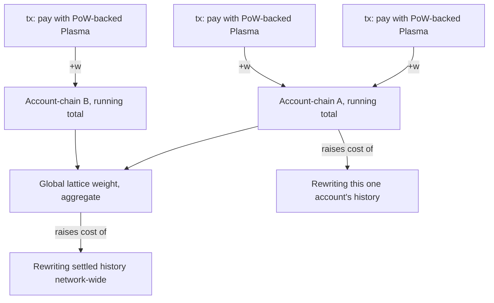
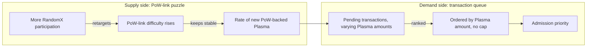
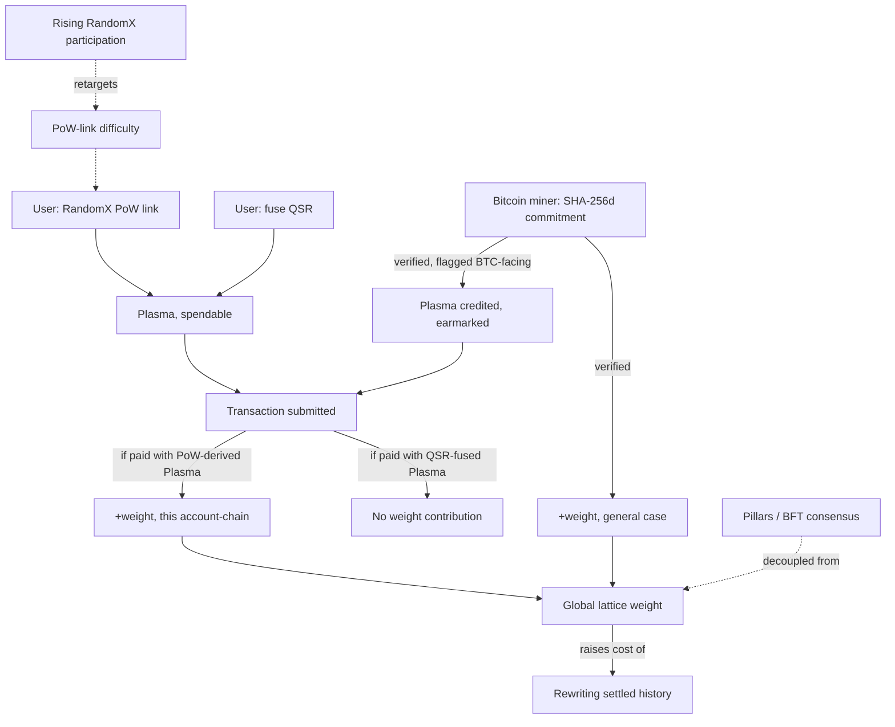

# Chain Weight as a First-Class Security Primitive in Zenon

### Reconstructing the Missing Half of the Dual-Ledger Model

*Third document in the Kaine reconstruction series. Same source throughout: 876 messages, Telegram ID `1992970673`, `mrkainez`, Zenon Network, 2021-10-01 to 2023-07-18.*

---

## Response to Review

Taking the three points in order, on their merits, not by default.

**On merge-mining's primary purpose.** This holds up, and holds up harder than the prior document gave it credit for. I went back and counted rather than trusting impression: some version of "PoW/weight secures the ledger" is stated independently at least seven times across four separate sessions (Dec 9 2022, Dec 20 2022, Mar 29 2023, Apr 5 2023). "Merge mine ZNN and create Plasma for Bitcoin feeless txs" is stated exactly once, in a single March 2022 brainstorm, and it is never repeated, not even during the extended, detailed Dynamic Plasma design conversations of March through May 2023, which discuss RandomX, QSR-fusion, ordering, and cap-removal at length and never once mention Bitcoin, zBTC, or a feeless-BTC use case. A claim restated across sixteen months of subsequent, closely-related design discussion carries more weight (no pun intended) than a claim made once and never returned to. The prior document's own probability table understated this: giving the general "direct Plasma" reading 45% while noting in the same breath that it "survives only inside" the narrower earmarked reading was an inconsistency, not a considered position. Revised below, with the reasoning shown rather than just the new number.

**On weight accumulation.** Also right, and the sharpest catch of the three. Every prior document in this series named chain weight, quoted the statements about it, and then treated it as a black box, a scalar that goes up. It never asked what it's a scalar *of* or where it lives structurally. Given that the block-lattice is explicitly built from independent account-chains, not one shared chain, weight almost certainly cannot be a single global number the way Bitcoin's cumulative work is; it has to have at least two levels. That's the spine of this document.

**On Dynamic Plasma as difficulty adjustment.** Right in spirit, and I want to push it one step further than "an entire chapter" implies, because I think the chapter, done properly, splits into two mechanisms that got run together, one a real difficulty-style retarget and one a market-style auction, doing different jobs. Both survive the pressure test; they're just not the same thing. Section 6 works through why.

**On the common security economy.** This one needs the most care, because taken at face value it sits in tension with point one: if merge-mining's primary output is weight and RandomX's primary output is Plasma, in what sense are they "the same commodity"? I think the resolution is real, not just diplomatic, and Section 7 works it out properly rather than asserting it.

---

## 1. Why Weight Has Been Under-Modeled

Across the two prior documents, "chain weight" does real argumentative work, PoW's separation from consensus depends on it, the elimination of Candidate 7 (Bitcoin miners producing NoM blocks) depends on it, the entire dual-ledger reading depends on it, and it is never once asked what shape it has. That's a gap worth naming plainly before trying to close it. A primitive that four separate elimination arguments lean on deserves to be modeled, not just cited.

Everything Kaine says about weight, complete, is seven statements:

1. "PoW secures the block-lattice ledger by adding weight. This prevents some PoS attack vectors such as long range attacks." (Dec 9, 2022)
2. "The idea behind a dual ledger system is to decouple consensus from chain weight. This is very important because consensus and chain weight are fundamental for a L1." (Dec 20, 2022)
3. "Bitcoin has consensus coupled with chain weight: 'longest chain of most accumulated proof of work.'" (Dec 20, 2022)
4. "NoM has consensus decoupled from chain weight (added when users are performing tx with PoW)." (Dec 20, 2022)
5. "In other networks, users pay a fee to make transactions and usually miners are rewarded. In NoM, users pay with Plasma (that usually involves PoW) to make transactions and by doing so, they add weight to the ledger, thus effectively securing it." (Dec 20, 2022)
6. "And the PoW is performed by users that want to issue feeless transactions on the network: this increases the security margin when the network usage is higher." (Dec 9, 2022)
7. "The block-lattice is just for mapping accounts. The ultimate decision is still 'made' by the consensus protocol." (Nov 3, 2022)

Seven statements, no formula, no unit, no stated aggregation rule. Everything from here is model-building on top of those seven, labeled as such throughout.

---

## 2. The Two Levels of Accumulation

Statement 5 is the load-bearing one for structure: weight is added *per transaction*, by the act of paying with PoW-backed Plasma, not by some separate global process running alongside transactions. That's a per-event increment, not a periodically-recomputed aggregate.

Statement 7 supplies the container: the block-lattice "maps accounts," via independent account-chains (confirmed elsewhere: "a dual-ledger, block-lattice structure with independent account-chains to store transactions data"). A per-transaction increment has to land somewhere, and the natural place, given the structure, is the account-chain the transaction belongs to before it aggregates any further.

That gives two levels, not one, and they answer two different questions:

**Level 1, account-chain weight.** The running total of PoW-backed weight ever added to one specific account's own chain. Answers: how expensive would it be to fabricate an alternative history for *this* account specifically.

**Level 2, global lattice weight.** The sum, or some aggregate, of every account-chain's weight, network-wide. Answers: how expensive would it be to fabricate an alternative history for the network as a whole.



Plain-text fallback:
```
tx (PoW-backed Plasma) --(+w)--> Account-chain A running total  --\
tx (PoW-backed Plasma) --(+w)--> Account-chain A running total  ---> aggregates into Global lattice weight
tx (PoW-backed Plasma) --(+w)--> Account-chain B running total  --/

Account-chain A's own total --> raises cost of rewriting THAT account's history specifically
Global lattice weight        --> raises cost of rewriting the network's history as a whole
```

One asymmetry the model has to carry, and it's the sharpest thing this section finds: statement 4 ties weight addition specifically to PoW ("added when users are performing tx with PoW"), not to Plasma spending in general. Plasma itself is fungible, it arrives identically whether generated by computing PoW or by fusing QSR, and downstream, as a spendable resource for transaction admission, the two are indistinguishable (per the April 2022 baseline: "Plasma is used as network gas and can be generated either by locking (fusing) QSR or by generating PoW"). But weight, on the wording of statement 4 specifically, is not stated to arrive from QSR-fusion at all. **[STRONG INFERENCE]**: the two Plasma-generation routes are equivalent for *admission* but not for *security*. A transaction paid for with QSR-fused Plasma gets admitted exactly like one paid for with PoW-derived Plasma; only the latter is stated to add weight.

If that reading holds, "balance PoW and QSR fusing" stops being a vague aspiration and becomes a specific, load-bearing tradeoff: QSR-fusion is cheap Plasma with no weight contribution, PoW is costlier Plasma that also buys security. A network where fusion dominates as the easier route gets admission working fine while quietly under-securing itself, since fewer transactions are actually adding weight even as throughput looks healthy. That is a genuinely new implication, not stated anywhere by Kaine directly, derived from taking statement 4's specific wording seriously rather than reading past it. Flagged as **[STRONG INFERENCE]**, not [LOCKED], because it rests on one sentence's precise phrasing rather than a repeated pattern.

---

## 3. Bitcoin's Model, and Where NoM's Diverges

Statement 3 gives Kaine's own framing of Bitcoin directly: "consensus coupled with chain weight," the longest, heaviest chain simply *is* the agreed history. In Bitcoin there is no separate step where something else decides ordering and weight merely comments on it afterward; weight-accumulation and consensus-selection are the same mechanism, wearing one name.

Statement 4 breaks that identity apart on purpose: "NoM has consensus decoupled from chain weight." Something else, the BFT/meta-DAG layer, run by Pillars, already decides ordering, before weight enters the picture at all ("meta-DAG for consensus, separated from the block-lattice," established in the prior document). Weight, once decoupled from the job of *deciding*, is left with a narrower, more specific job: not determining what the agreed history is, but determining what it would cost to successfully contest it after the fact.

This is a real, and easy to miss, architectural distinction, worth stating plainly because it resolves a question that could otherwise look like a contradiction: if Pillars already decide ordering through BFT voting, what is weight even defending against? The answer, per statement 1, is a specific attack class: "PoS attack vectors such as long range attacks," where an adversary doesn't need to beat the current validator set in real time, they reconstruct an alternative history from far in the past, exploiting the fact that stake-based signing authority, unlike computational work, costs nothing to fake retroactively once old keys are in hand. Consensus protects the live, current agreement. Weight protects the *past* from being retroactively rewritten out from under that agreement. Two different attack surfaces, two different defenses, cleanly divided along exactly the line statement 2 draws.

---

## 4. The Local-Weight Problem

Taking the two-level model from Section 2 seriously produces an implication Kaine never states and this document has to flag as its own, not his: if weight accumulates first at the account-chain level, an account with a short or sparse transaction history has very little of its own weight to defend it, regardless of how heavy the *global* lattice total is elsewhere.

Concretely: a long-range attacker targeting one specific, low-activity account would need to out-produce only *that account's own* accumulated PoW, not the network's aggregate. If account-chain weight is genuinely local and independent, "the network is very heavy overall" is not the same claim as "this particular account's history is expensive to rewrite," and a reader could walk away from statement 1 believing the former protects every account equally when the structure implies it doesn't.

This reopens a candidate the companion blueprint document closed too quickly. Candidate 5 there, "merge-mined checkpoint or epoch weighting," was folded entirely into a difficulty-retargeting role and dismissed as a standalone security mechanism for lack of the words "checkpoint" or "epoch" anywhere near merge-mining. Under the local-weight problem, a periodic, network-wide anchoring step would do a second, genuinely different job than retargeting: it would let every account-chain inherit some protection from the *global* aggregate, not just its own local history, closing exactly the gap this section just opened. **[SPECULATIVE DESIGN CHOICE]**, not evidenced anywhere, but worth restoring as a live possibility rather than treating the earlier dismissal as final. This is the one place in this document where deepening the model changes a previous conclusion rather than just adding detail to it.

---

## 5. Revisiting Merge-Mining's Primary Output

The frequency argument from the Response to Review, made precise, with the pattern laid out so the conclusion is checkable rather than asserted:

| Statement | Date | Says |
|---|---|---|
| "PoW secures the block-lattice ledger by adding weight" | Dec 9, 2022 | Weight, general |
| "PoW is performed by users...this increases the security margin" | Dec 9, 2022 | Weight, general |
| "decouple consensus from chain weight" | Dec 20, 2022 | Weight, general |
| "NoM has consensus decoupled from chain weight (added when...PoW)" | Dec 20, 2022 | Weight, general |
| "they add weight to the ledger, thus effectively securing it" | Dec 20, 2022 | Weight, general |
| "Also using PoW is critical for any public ledger" | Mar 29, 2023 | Weight/security, general |
| "the key element to secure a public ledger in the face of powerful adversaries" | Mar 29, 2023 | Weight/security, general |
| "the PoW component - crucial for decentralization and security" | Apr 5, 2023 | Weight/security, general |
| "merge mine ZNN and create Plasma for Bitcoin feeless txs" | Mar 21, 2022 | Plasma, specific corridor |

Eight statements about weight or security as a general property of PoW, spanning three sessions eleven months apart. One statement about merge-mined Plasma, never repeated, made a full ten months before the most detailed of the weight statements above. The imbalance is not subtle once it's laid out this way.

**Revised probabilities**, replacing the prior document's table:

| Candidate | Prior probability | Revised probability | Why |
|---|---|---|---|
| Weight-only, general rule (Candidate 2) | 65% | **80%** | The frequency and recency pattern above is stronger evidence for a standing rule than a single count of supporting quotes suggested |
| Direct Plasma, general rule (Candidate 1) | 45% | **15%** | The prior number credited this reading as a live general theory while simultaneously admitting it "survives only inside" the narrower one; that was inconsistency, corrected here |
| Bitcoin-facing subsidy, narrow exception (Candidate 4) | 40% | **35%** | Essentially unchanged; still the best fit for the one specific quote, still never reinforced afterward, which caps how confident this can be even as the narrow exception |

The correction is not "merge-mining never touches Plasma." It's "merge-mining touching Plasma was very likely a one-time application sketched in a sixteen-minute exchange, not a standing rule," which is a materially different, and more defensible, claim than either the original blueprint's hedge or a flat denial would be.

---

## 6. Dynamic Plasma as Transaction-Layer Difficulty Adjustment

The three statements that motivate this, read together rather than separately: "order transactions by Plasma amount," "remove the cap," and "Dynamic Plasma (similar to Bitcoin's difficulty adjustment mechanism)." The temptation is to treat all three as one mechanism under one name. They're not; they're two mechanisms, and separating them is what makes the analogy actually hold up rather than just sound good.

**What Bitcoin's difficulty adjustment literally does.** It retargets a puzzle's difficulty, periodically, based on aggregate hashrate, to hold solve-*rate* constant. More miners does not mean more blocks per hour; it means each block gets harder to find. This is a supply-side mechanism: it regulates how hard it is to produce the next unit, not who gets it or in what order.

**What "order transactions by Plasma amount" literally does.** It's a demand-side, allocation mechanism: given however many Plasma-bearing transactions show up in a given window, rank them and serve the highest first. This has no retargeting logic in it at all; it's an auction, not a difficulty curve.

Read separately, only one of the two statements is actually "similar to" difficulty adjustment in any mechanical sense, and it isn't the ordering rule. **[STRONG INFERENCE]**: the difficulty-adjustment analogy most plausibly applies to the underlying PoW-link puzzle itself, not to the transaction-ordering step. Every real PoW system needs some difficulty parameter to stay meaningful as participation changes; a puzzle that never retargets either gets trivially easy as more RandomX joins (flooding the network with cheap Plasma, undermining exactly the "hard limit... removed" design if removed carelessly) or stays needlessly hard if participation drops. A puzzle that *does* retarget, the way Bitcoin's does, keeps the rate of PoW-link solutions, and therefore the rate of newly-minted PoW-backed Plasma, roughly stable regardless of how many CPUs join in. That is the literal, mechanical parallel Kaine's own choice of words points to.

Removing the hard cap and adding this kind of retarget are not in tension, they're complementary, and distinguishing them resolves what would otherwise look like a contradiction. The old system had one crude regulator: a static ceiling, blind to actual demand. The new system trades that one blunt instrument for two better-fitted ones operating at different layers: a difficulty-style retarget on the PoW-link puzzle (supply side, keeps issuance-rate roughly stable as CPU participation grows or shrinks) plus a Plasma-amount auction on the transaction queue (demand side, allocates admission priority among whatever shows up, without needing to know or care how much total Plasma exists). Neither one alone is "Bitcoin's difficulty adjustment transplanted." Together, doing two different jobs, they are.



This is the chapter the review asked for, and it lands somewhere more specific than "Plasma is gas": Dynamic Plasma is not one difficulty-adjustment analogy, it's a difficulty-style supply regulator and a market-style demand regulator, running side by side, replacing one static cap that did neither job well.

---

## 7. The Common Security Economy

The tension flagged in the Response to Review: Section 5 just concluded merge-mining's primary output is weight, not Plasma. The review's own diagram puts RandomX and merge-mining side by side feeding the same box, labeled Plasma, at the top. Both can't be straightforwardly true at once, so this section works out which parts survive contact with each other.

They reconcile once "the same commodity" is read as *security contribution*, not as *identical spendable balance*, and once the paths are drawn out rather than compressed into one arrow each:

- RandomX's path to security is indirect and three steps long: user computes RandomX, receives Plasma, spends that Plasma on a transaction, and it is specifically the act of transacting with PoW-backed Plasma that adds weight (statement 5, Section 1). RandomX does not add weight by existing; it adds weight by being spent.
- Merge-mining's path is direct and one step long, on the general reading from Section 5: a Bitcoin miner's commitment is verified and weight is credited, full stop, with no Zenon-side transaction required as an intermediate step at all.

Both terminate in the same place, an addition to chain weight, arrived at by different routes, one running through Plasma-and-spending, one bypassing it. That is a genuine, defensible sense in which they're "two ends of the same security market," without requiring merge-mining to produce spendable, transaction-admitting Plasma as its general behavior. The review's diagram is right about the shape, RandomX and merge-mining as two supply curves into one economy, and needed one correction: the shared destination is weight, and Plasma is a way-station on only one of the two paths into it, not a shared endpoint both routes deposit into equally.

This also gives "balance both types of PoW" a cleaner reading than either document has offered so far. If merge-mining's imported ASIC weight can, in raw magnitude, vastly outweigh what CPU participation alone could ever contribute (Bitcoin's total hashrate dwarfing any plausible RandomX userbase), and if only RandomX's path runs through Plasma and therefore through the participation goal at all, then an unbalanced system doesn't fail by having too little total security, it fails by having the *imported* path so dominate the *native* path that the CPU-accessible, Plasma-linked side becomes a rounding error in the network's overall security posture, even while remaining the only side ordinary users can actually reach. "Balance," on this reading, is not about keeping two numbers equal. It's about keeping the participation-linked path from becoming economically irrelevant next to the imported one, which is a real, concrete failure mode the word choice makes much more sense as a defense against than a vaguer "attend to both" reading does.

---

## 8. A Consolidated Weight Model

Putting Sections 2 through 7 together into one picture:



Read top to bottom: two Plasma sources, only one of which contributes weight; weight accumulates locally per account-chain before aggregating globally; merge-mining adds weight directly and, only when flagged, Plasma as well; consensus stays decoupled throughout; and the whole PoW-link layer self-regulates via difficulty retargeting as participation changes, independent of the Plasma-ordering auction that governs admission.

---

## 9. What This Model Predicts That Wasn't Explicit Before

Four implications fall out of taking the model seriously that no single quote states directly, each labeled by how far it's reaching:

**QSR-fusion is security-neutral.** Not stated anywhere; derived from statement 4's specific wording (Section 2). If correct, a network where fusion is the cheaper or more convenient route for most users could see healthy throughput and admission while actual accumulated weight grows more slowly than transaction volume would suggest. **[STRONG INFERENCE]**.

**Low-activity accounts carry less local protection than the network's aggregate weight implies.** Not stated anywhere; derived from the two-level structure (Section 4). A network described as heavily secured overall is not the same claim as every individual account being equally hard to rewrite. **[SPECULATIVE DESIGN CHOICE]**, flagged as the kind of gap a periodic global anchoring step would need to exist to close.

**Dynamic Plasma is two mechanisms, not one, and they can be tuned or fail independently.** Derived from separating the difficulty-adjustment analogy from the ordering-auction statement (Section 6). A retargeting bug and an ordering-auction bug would be different failures with different symptoms, worth treating as two systems for design and review purposes even though Kaine names them together.

**"Balance" has a specific, checkable failure mode, not just a general spirit.** Derived from Section 7. The system is unbalanced specifically when imported weight so dominates native weight that the CPU-accessible path stops mattering to the network's overall security posture, which is a condition that could, in principle, be measured (relative magnitude of imported versus native weight contribution over some window), even though nothing in the archive suggests Kaine ever proposed measuring it.

None of these four are recoverable as direct quotes. All four are reachable only by building the model the prior documents named but didn't construct, which is the entire point of doing so.

---

## 10. What Still Isn't There, Even With This Model

Being honest about the limits of a better model rather than letting a cleaner picture read as a more complete one:

- No stated decay or pruning for account-chain weight. Does old weight persist forever, or does it need to, given storage costs on independent account-chains that could otherwise grow unboundedly? Unaddressed.
- No stated relationship between local (account-chain) and global (lattice) weight beyond simple aggregation. Whether the two levels interact at all, versus one being computed straightforwardly from the other, is this document's own inference, not evidenced.
- No stated threshold. Bitcoin's model has an implicit "more than half of ongoing hashrate" framing behind its security guarantees; nothing in the archive gives an equivalent fraction, ratio, or threshold for when NoM's weight is "enough."
- No stated mechanism for the local-weight problem in Section 4, only a restored candidate (periodic anchoring) that was never evidenced in the first place and is being re-opened here on structural grounds, not textual ones.
- No stated formula connecting RandomX difficulty retargeting to any specific target rate, window length, or retarget frequency, only the bare claim of similarity to Bitcoin's mechanism.
- No discussion anywhere of what happens to already-accumulated weight if the underlying PoW-link algorithm itself changes, which it does, explicitly, in this same period (SHA-3 to RandomX). Does weight accumulated under the old algorithm carry forward at face value, get re-normalized, or reset. Unaddressed.

A properly modeled primitive is not the same thing as a fully specified one. This document closes the gap the review correctly identified, chain weight now has a shape, a location, and a mechanism for how it grows, without closing every gap the shape then reveals.

---

## 11. Revised Master Statement

Updating the macro blueprint's own summary paragraph in light of everything above, this is the closest thing to a final position this series has produced:

*Zenon's dual ledger separates two questions that Bitcoin answers with one mechanism: what is the agreed order of events, decided entirely by Pillars through BFT voting over a meta-DAG, and what would it cost to successfully rewrite that agreement after the fact, decided by chain weight, a per-transaction increment added specifically by PoW-derived (not QSR-fused) Plasma spending, accumulating first at the account-chain level and then aggregating into a global lattice total. RandomX keeps the weight-generating side of that mechanism reachable on commodity hardware, at the cost of running it through Plasma and a transaction first; Bitcoin merge-mining imports industrial-scale weight directly, without that intermediate step, and only incidentally, in one narrow and never-repeated application, credits spendable Plasma alongside it. Dynamic Plasma governs the resulting resource on two independent tracks: a difficulty-style retarget on the underlying PoW-link puzzle, holding issuance roughly stable as CPU participation changes, and a Plasma-amount auction on the transaction queue, allocating admission priority among whatever shows up. Consensus touches none of it. What Kaine called balancing both types of PoW is, on this reading, not a claim that the two lanes are interchangeable, but an instruction not to let the imported lane's much larger raw magnitude make the native, participation-linked lane's contribution to overall security irrelevant, which is the one way this design could quietly stop being decentralized while still looking, from the outside, perfectly secure.*
