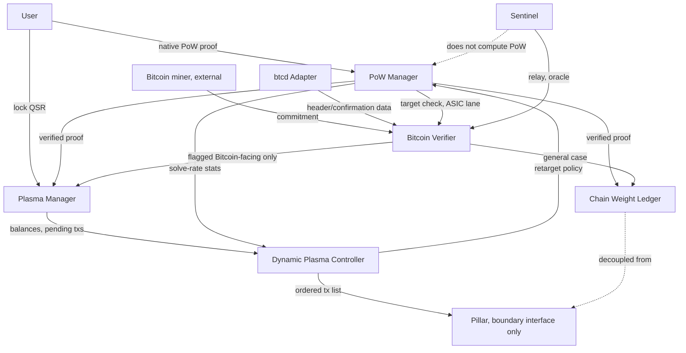
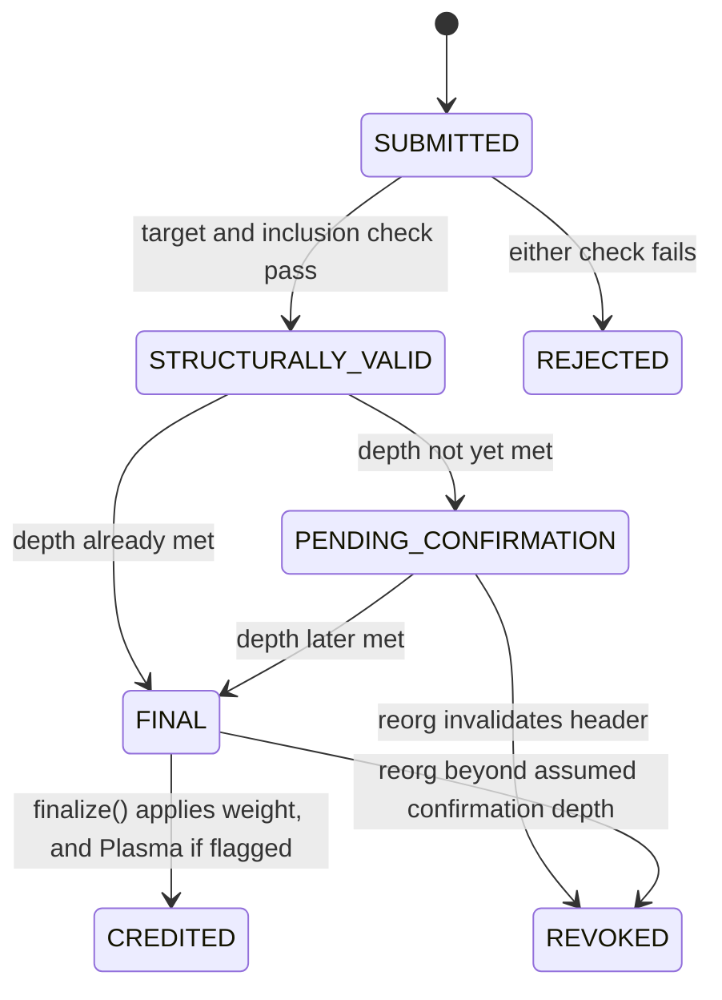

# Minimal Protocol Specification: PoW-Backed Plasma, Chain Weight, and Bitcoin-Imported Security

*Fourth document in the Kaine reconstruction series. Method changes here: the archive is treated as a constraint set, not a historical record. Chronology is discarded. What follows is the smallest complete system that satisfies every LOCKED constraint simultaneously, with every remaining gap filled by the smallest addition needed and marked as such.*

## 0. Conformance and Labeling

The key words MUST, MUST NOT, REQUIRED, SHOULD, SHOULD NOT, and MAY in this document are to be interpreted as in RFC 2119.

Four labels replace the historical-epistemic ones used in the prior three documents, because this document asks a different question, not "what did Kaine mean" but "what does the constraint set force":

- **[FORCED]**: at least one constraint directly requires this; no alternative design satisfies the constraint set without it.
- **[DERIVED]**: not stated by any single constraint, but the necessary logical consequence of combining two or more constraints.
- **[ASSUMPTION]**: the constraint set is silent or underdetermined here. This is the smallest addition needed for a buildable spec. Where a real alternative exists, it is named.
- **[OUT OF SCOPE]**: deliberately excluded, with the constraint(s) that justify drawing the boundary there.

Every requirement below cites the constraint ID(s) that force it. A requirement with no citation does not belong in this document and should be struck.

---

## 1. The Constraint Set

Thirty-one constraints, drawn only from statements independently classified LOCKED across the first three documents in this series. Each is restated here as a source fact, not yet as a requirement; Sections 3 onward do the translation into normative component behavior. Full quote-to-source traceability is in the Appendix.

**Resource layer**
- C1. A PoW-link is a computation a user performs that generates Plasma required by transactions on NoM.
- C2. Plasma can alternatively be generated by locking (fusing) QSR.
- C3. Plasma functions as network gas: a transaction requires it for admission.
- C22. The system MAY operate with or without a hard cap on PoW-derived Plasma; a hard cap, where present, is described as an artificial limit rather than a load-bearing one.

**Pipeline and consensus boundary**
- C4. The transaction pipeline is: transaction submitted, then full nodes, then Pillars processing transactions, then consensus, then appended to the block-lattice.
- C5. Consensus is decoupled from chain weight; both are described as fundamental to a Layer 1 in their own right.
- C10. The block-lattice maps accounts; ordering decisions are made by the consensus protocol, not by the block-lattice itself.
- C11. The block-lattice is structured as independent account-chains, one per account, storing transaction data.
- C12. The meta-DAG, which performs consensus, is architecturally separated from the block-lattice.
- C13. PoW's scope is the transaction layer.

**Weight semantics**
- C6. Chain weight is added specifically when a user performs a transaction using PoW.
- C7. PoW secures the block-lattice ledger by adding weight; this defends against PoS-style attack vectors, specifically long-range attacks.
- C8. A user paying with PoW-involving Plasma adds weight to the ledger by doing so, and this is described as effectively securing it.
- C9. The security margin this produces increases as network usage increases, because the PoW is performed by users who want to transact.

**PoW algorithm layer**
- C14. CPU PoW is important for transactions; ASIC PoW can be merge-mined.
- C15. The PoW-link algorithm in the pre-Dynamic-Plasma system is SHA-3.
- C16. SHA-256d and RandomX are named as the best candidates for the ASIC-friendly and CPU-friendly (ASIC-resistant) roles respectively.
- C31. Both types of PoW are to be balanced against each other; this is stated as a whitepaper-level requirement.

**Merge-mining layer**
- C17. ASIC-friendly PoW can be obtained from merge-mining.
- C18. Merge-mining ZNN, in one specific stated direction, creates Plasma for Bitcoin-facing feeless transactions.
- C19. PoW-links may be usable to merge-mine Bitcoin.
- C30. Independent networks can share computational work with zero required coordination, and with nothing else shared between them.

**Dynamic Plasma layer**
- C20. Dynamic Plasma implementation requires: (a) ordering transactions by attached Plasma amount, with the cap removed; (b) the CPU-facing PoW algorithm is RandomX.
- C21. Dynamic Plasma is described as similar to Bitcoin's difficulty adjustment mechanism.

**Node roles**
- C23. Sentinels do not compute PoW; they process and relay information.
- C24. Sentinels can outsource PoW generation to other sources.
- C25. Sentinels can serve as protocol-level oracles.
- C28. Self-custody of funds is stated as the most important property any interoperability mechanism must preserve.
- C29. Pillars can alternatively act as TSS signers holding native BTC vaults; this is explicitly conceded as less decentralized, described as an acceptable tradeoff rather than a preferred design.

**External-chain layer**
- C26. btcd provides interoperability by giving access to the state of Bitcoin's blockchain.
- C27. btcd supplies Schnorr-signature capability.

Thirty-one constraints. No formula, no explicit data structure, no explicit API anywhere among them. Everything below is construction on top of this set, and every addition is labeled by how it got there.

---

## 2. System Overview

Eight components are named in the brief. Each is tested for necessity in Section 3 before being specified in Section 4. The surviving graph:



Plain-text fallback:
```
User --(native PoW proof)--> PoW Manager --(verified)--> Plasma Manager
User --(lock QSR)--> Plasma Manager
PoW Manager --(verified)--> Chain Weight Ledger

Bitcoin miner (external) --(commitment)--> Bitcoin Verifier
btcd Adapter --(header/confirmation data)--> Bitcoin Verifier
PoW Manager --(target check, ASIC lane, reused)--> Bitcoin Verifier
Bitcoin Verifier --(general case)--> Chain Weight Ledger
Bitcoin Verifier --(flagged Bitcoin-facing only)--> Plasma Manager

Plasma Manager --(balances, pending txs)--> Dynamic Plasma Controller
PoW Manager --(solve-rate stats)--> Dynamic Plasma Controller
Dynamic Plasma Controller --(retarget policy)--> PoW Manager
Dynamic Plasma Controller --(ordered tx list)--> Pillar (boundary interface only)

Sentinel --(relay, oracle)--> Bitcoin Verifier
Sentinel -.does not compute PoW.-> PoW Manager
Chain Weight Ledger -.decoupled from.-> Pillar
```

---

## 3. Necessity Analysis

Each of the eight named interfaces is tested here: could it be merged into another component without losing satisfaction of any constraint? Merges are accepted where the answer is yes. All eight survive, but not all at the scope the brief's naming might suggest, and the reasoning, not the survival, is the actual content of this section.

**Plasma Manager vs. Chain Weight Ledger.** The obvious first merge candidate: C6 and C8 tie weight-addition to Plasma spending, so why not one ledger tracking both? Rejected. C5 states the two are decoupled as "fundamental to a L1" in their own right, which only makes sense if they are independently trackable; and their lifecycles differ in kind, not degree. Plasma is consumed (C3, it is spent on admission); nothing in the constraint set describes weight as ever decreasing. A single data structure holding both a consumable and a monotonic quantity under one name invites exactly the kind of conflation C5 exists to prevent. **[FORCED]** separate, by C5.

**Plasma Manager's internal fungibility.** A narrower question inside the same boundary: must Plasma Manager tag each unit with its generation source (PoW vs. QSR-fusion) so that Chain Weight Ledger can later ask "was this spend PoW-backed"? This would require non-fungible or provenance-tagged balances, which C3's plain "network gas" framing does not suggest and nothing else requires. **[DERIVED]**: weight-crediting is triggered once, at the moment a PoW proof is verified and the resulting Plasma is minted (Section 4.3), not re-derived later at spend time by inspecting which units left the balance. This lets Plasma Manager remain a plain fungible balance, the smaller of two designs that both satisfy C6, chosen because nothing in the constraint set forces the more complex one.

**PoW Manager vs. Bitcoin Verifier.** Both, at bottom, check a hash against a target. Rejected as a merge. C26 requires tracking an external chain's state (headers, confirmation depth) to know whether a Bitcoin-sourced commitment is even real, a fundamentally stateful, externally-synchronized responsibility a self-contained target check does not have. C30 sharpens this: because the two networks require zero coordination, Zenon alone bears the full burden of knowing what counts as valid imported work, which is more than a target comparison. PoW Manager's target-check logic is reused as a subroutine by Bitcoin Verifier (Section 2 diagram) rather than duplicated, which captures the real overlap without merging the components. **[FORCED]** separate, by C26 and C30.

**Bitcoin Verifier vs. btcd Adapter.** A closer call, argued honestly rather than assumed. C27 is the deciding constraint: btcd's Schnorr-signature capability is a general cryptographic service, not scoped to merge-mining anywhere in the constraint set, and a spec that folded btcd into Bitcoin Verifier would incorrectly narrow a general-purpose adapter to one consumer. Kept separate. **[FORCED]** by C27's generality; Bitcoin Verifier is the sole merge-mining-specific consumer of btcd Adapter's state-access function (C26), but not the sole consumer of the adapter overall.

**Dynamic Plasma Controller vs. Plasma Manager.** C20a (order transactions by Plasma amount) operates on *pending*, not-yet-consumed transactions and produces a ranking, not a balance mutation; this is scheduling, not bookkeeping. **[FORCED]** separate, by the operation itself: nothing about ranking pending items requires or benefits from being inside the ledger that tracks settled balances.

**Dynamic Plasma Controller vs. PoW Manager.** C21's difficulty-adjustment analogy is about a supply-side retarget on the PoW puzzle itself (established in the prior document's Section 6); mechanically, the target lives in PoW Manager. Rejected merging the *policy* in with it: Dynamic Plasma Controller sets the retarget policy and consumes solve-rate statistics, PoW Manager executes the mechanical retarget and verification. This is a policy/mechanism split, not a duplicated responsibility. **[DERIVED]** separate.

**Sentinel vs. anything else.** C23 is a direct, unconditional constraint: a role exists that does not compute PoW. This cannot be collapsed into PoW Manager (opposite property, by definition) or into Bitcoin Verifier (C23/C25 describe a general relay/oracle role, not one scoped to merge-mining specifically). **[FORCED]** by C23.

**Pillar.** The only component in the list whose full internal mechanics are explicitly walled off by the constraint set itself. C5 and C12 exist specifically to keep consensus decoupled from everything else being specified here. Rather than eliminating Pillar or inventing consensus mechanics the constraint set has no authority over, this document scopes Pillar down to its inbound boundary only: what it consumes from Dynamic Plasma Controller. Its BFT/voting/momentum-production internals are **[OUT OF SCOPE]**, by C5 and C12 directly, not by omission.

**Result: all eight survive, at the following scopes.** Plasma Manager and Chain Weight Ledger as independent ledgers with different lifecycles. PoW Manager and Bitcoin Verifier as independent verifiers, one self-contained, one externally-synchronized, sharing a subroutine. btcd Adapter as a general external-state service with plural consumers, only one of which is modeled here. Dynamic Plasma Controller as a policy layer over both ledgers and PoW Manager. Sentinel as the system's only non-PoW-computing relay role. Pillar as a boundary interface, its interior explicitly out of scope.

One component the brief did not name also had to be addressed: the QSR-locking mechanism behind C2. **[OUT OF SCOPE]**, by construction: this specification treats QSR-locking as an external precondition, exposing only the single entry point Plasma Manager needs (Section 4.1), because staking/locking mechanics are not constrained by anything in Section 1 beyond "locking QSR produces Plasma," and inventing a full staking subsystem here would violate the smallest-complete-system brief.

---

## 4. Component Specifications

### 4.1 Plasma Manager

Necessity: Section 3. Owns settled, spendable Plasma balances only; owns no policy.

**Data structures**
```
PlasmaBalance {
  account_id
  amount            // fungible, unsigned, [FORCED by C3]
}

ConsumptionReceipt {
  account_id
  amount_consumed
  timestamp_or_seq
}
```

**API**
```
credit_from_pow(account_id, amount, pow_receipt_ref) -> PlasmaBalance
    // [FORCED by C1]. Caller: PoW Manager only.

credit_from_fusion(account_id, qsr_locked_amount) -> PlasmaBalance
    // [FORCED by C2]. qsr_locked_amount arrives pre-validated; QSR-locking
    // mechanics themselves are OUT OF SCOPE (Section 3).

balance_of(account_id) -> amount
    // [FORCED by C3, admission needs a readable balance]

consume(account_id, amount) -> ConsumptionReceipt
    // [FORCED by C3]. MUST fail if amount > balance_of(account_id).
    // MUST NOT report or require provenance (Section 3, fungibility resolution).
```

**State machine**: none beyond the balance value itself. **[DERIVED]**: a plain counter has no transitions to name; inventing states here (e.g., LOCKED/UNLOCKED) would violate the smallest-system brief with no constraint requiring it.

---

### 4.2 Chain Weight Ledger

Necessity: Section 3. Sole owner of the monotonic security quantity, decoupled from consensus per C5.

**Data structures**
```
AccountChainWeight {
  account_chain_id      // [FORCED by C11, one per independent account-chain]
  total_weight          // monotonic, non-decreasing under normal operation
  credit_log: [WeightCreditEvent]
}

WeightCreditEvent {
  amount
  source: NATIVE_POW | IMPORTED_BTC   // [DERIVED, Section 4.5 revocation asymmetry]
  revocable: bool                      // true only if source == IMPORTED_BTC
  ref                                   // pointer back to originating proof
}
```

**API**
```
credit(account_chain_id, amount, source, ref) -> void
    // [FORCED by C6, C8]. Callers: PoW Manager (source=NATIVE_POW),
    // Bitcoin Verifier (source=IMPORTED_BTC).

weight_of(account_chain_id) -> total_weight
    // [FORCED by C7, the ledger must be queryable to be "secured" meaningfully]

global_weight() -> total_weight
    // [DERIVED from C7's whole-ledger framing]. MAY be a maintained running
    // sum or computed on demand over all account_chain_id; the constraint
    // set does not force either implementation. [ASSUMPTION: maintained sum,
    // for read-cost reasons; computed-on-demand is an equally valid choice.]

revoke(account_chain_id, credit_event_ref) -> void
    // [DERIVED, Section 4.5]. MUST fail if credit_event.revocable == false.
```

**State machine**, per credit event:
```
PENDING --(applied)--> APPLIED
APPLIED --(only if revocable, and btcd Adapter reports invalidating reorg)--> REVOKED
```
**[DERIVED]**: native credits (RandomX/SHA-3) have no external chain to reorg against and so never reach REVOKED; only IMPORTED_BTC credits carry that risk. This asymmetry is a direct, forced consequence of C26 combined with ordinary Bitcoin-reorg behavior, not an arbitrary addition.

---

### 4.3 PoW Manager

Necessity: Section 3. Owns proof verification and algorithm parameters; does not own balances.

**Data structures**
```
Algorithm { CPU_RANDOMX | ASIC_SHA256D }   // [FORCED by C16]
             // legacy SHA-3 [C15] is not modeled as a live option: this
             // specification describes the target system, per the brief's
             // instruction to discard chronology, not the sequence of
             // algorithms that preceded it.

Target { algorithm, difficulty_value, last_retarget_ref }

PoWProof { algorithm, nonce, submitter_account, tx_intent_ref }
```

**API**
```
current_target(algorithm) -> Target

verify(proof: PoWProof, target: Target) -> bool
    // [FORCED by C1, C14, C16]. Pure function, no external state required
    // for CPU_RANDOMX; for ASIC_SHA256D used as a subroutine by Bitcoin
    // Verifier (Section 3), still pure at this layer.

submit(proof: PoWProof) -> PoWReceipt
    // [FORCED by C1]. On success: MUST call Plasma Manager.credit_from_pow
    // AND Chain Weight Ledger.credit atomically (Section 3 fungibility
    // resolution). On failure: MUST NOT call either.

retarget(algorithm, recent_solve_stats) -> Target
    // [ASSUMPTION, motivated by C21]. No formula is given anywhere in the
    // constraint set. This entry point exists because C21 requires *some*
    // retargeting behavior to exist; its formula, window length, and
    // frequency are not forced and are left as configuration, set by
    // Dynamic Plasma Controller (Section 4.6).
```

**State machine**, per submitted proof:
```
SUBMITTED --(verify() true)--> VERIFIED --(ledger calls complete)--> CREDITED
SUBMITTED --(verify() false)--> REJECTED
```

---

### 4.4 btcd Adapter

Necessity: Section 3. General-purpose external-chain service; plural consumers, only one modeled here.

**Data structures**
```
BitcoinHeader { hash, prev_hash, merkle_root, height, timestamp }
ChainTip { header, confirmation_count }
```

**API**
```
get_header(block_hash) -> BitcoinHeader | NULL       // [FORCED by C26]
confirmation_depth(block_hash) -> integer              // [FORCED by C26]
verify_merkle_inclusion(tx, branch, header) -> bool     // [DERIVED from C26,
    // "state access" implies the ability to check inclusion, not just
    // fetch a header in isolation]
verify_schnorr(signature, message, pubkey) -> bool      // [FORCED by C27]
on_reorg(callback) -> subscription_handle               // [DERIVED, required
    // for Chain Weight Ledger.revoke and Bitcoin Verifier's REVOKED
    // transition (4.5) to ever fire]
```

**State machine**
```
SYNCING --(caught up to Bitcoin tip)--> SYNCED
SYNCED --(reorg detected)--> REORG_DETECTED --(callbacks fired, resynced)--> SYNCED
```

---

### 4.5 Bitcoin Verifier

Necessity: Section 3. Integration layer: local target-checking plus btcd Adapter's external state, for the imported-work path only.

**Data structures**
```
BitcoinCommitment {
  header_ref
  coinbase_tx
  merkle_branch
  zenon_commitment_hash        // [ASSUMPTION: needed so "create Plasma for
                                 //  Bitcoin feeless txs", C18, has a
                                 //  destination; standard AuxPoW pattern]
  beneficiary_account           // [ASSUMPTION, same reasoning]
  purpose_flag: GENERAL | BTC_FACING
                                 // [DERIVED from C17 vs C18: the constraint
                                 //  set states two distinct outcomes for
                                 //  imported work; a flag is the smallest
                                 //  way to let one proof format carry either]
}
```

**API**
```
submit(commitment: BitcoinCommitment) -> CommitmentReceipt
    // [FORCED by C17, C19]

check_target(commitment) -> bool
    // delegates to PoW Manager.verify() with algorithm=ASIC_SHA256D
    // [reuses Section 3's shared subroutine]

check_inclusion(commitment) -> bool
    // delegates to btcd Adapter.verify_merkle_inclusion()

check_confirmation_depth(commitment) -> bool
    // delegates to btcd Adapter.confirmation_depth();
    // threshold value is [ASSUMPTION: no number is given anywhere in the
    // constraint set; a positive integer greater than zero is forced by
    // C30's zero-coordination requirement, since accepting depth-zero
    // work would mean trusting an unconfirmed, possibly-orphaned claim
    // about a chain Zenon has no coordination with]

finalize(commitment) -> void
    // MUST call Chain Weight Ledger.credit(source=IMPORTED_BTC) always,
    // per C17. MUST additionally call Plasma Manager.credit_from_fusion-
    // equivalent path (a credit_from_import entry point, same shape as
    // credit_from_pow) if purpose_flag == BTC_FACING, per C18 only.
    // [FORCED for the weight call; DERIVED for the conditional Plasma call]
```

**State machine**
```
SUBMITTED --(check_target && check_inclusion)--> STRUCTURALLY_VALID
STRUCTURALLY_VALID --(check_confirmation_depth false)--> PENDING_CONFIRMATION
PENDING_CONFIRMATION --(depth later met)--> FINAL
STRUCTURALLY_VALID --(depth already met)--> FINAL
FINAL --(finalize() called)--> CREDITED
PENDING_CONFIRMATION --(btcd Adapter reorg callback invalidates header_ref)--> REVOKED
FINAL --(btcd Adapter reorg callback invalidates header_ref, residual risk)--> REVOKED
```



---

### 4.6 Dynamic Plasma Controller

Necessity: Section 3. Policy and scheduling layer; owns no balances or weight directly.

**Data structures**
```
RetargetPolicy { algorithm, target_solve_rate, window }
    // [ASSUMPTION: window and target_solve_rate values are not given
    //  anywhere; the existence of *a* policy object is forced by C21]

CapStatus { NONE }
    // [FORCED by C20a: the cap MUST be absent in the target system this
    //  spec describes. Modeled explicitly, as a documented "there is no
    //  cap" contract, rather than omitted, since silence would leave the
    //  legacy hard-cap behavior undefined instead of deliberately removed.]
```

**API**
```
order_pending(pending_txs: [Transaction]) -> [Transaction]
    // [FORCED by C20a]. Sorts by attached Plasma amount, descending.
    // Reads Plasma Manager.balance_of() per transaction's payer; does not
    // mutate Plasma Manager state.

cap_status() -> CapStatus
    // [FORCED by C20a, C22]. Always returns NONE in this specification.

set_retarget_policy(algorithm, policy: RetargetPolicy) -> void
current_retarget_policy(algorithm) -> RetargetPolicy
    // [ASSUMPTION, motivated by C21]. Feeds PoW Manager.retarget();
    // Dynamic Plasma Controller owns the policy value, PoW Manager owns
    // the mechanical execution (Section 3).
```

**State machine**: none beyond `CapStatus`, which is a constant in this specification. **[DERIVED]**: nothing in the constraint set describes Dynamic Plasma Controller cycling through modes; it is a stateless policy/scheduling layer over stateful components elsewhere.

---

### 4.7 Sentinel

Necessity: Section 3, forced directly by C23.

**Data structures**
```
RelayMessage { payload, origin }
OracleQuery { kind, params }
```

**API**
```
relay(message: RelayMessage) -> void            // [FORCED by C23]
serve_oracle(query: OracleQuery) -> response      // [FORCED by C25]
// no compute_pow() entry point exists on this interface, by construction
// [FORCED by C23's negative requirement]

relay_bitcoin_commitment(commitment) -> forwards to Bitcoin Verifier.submit()
    // [ASSUMPTION, not forced]. C23-25 establish a non-PoW-computing relay
    // role exists; they do not name Sentinel specifically as the carrier
    // for Bitcoin commitments. Any non-PoW-computing relay role could
    // satisfy Bitcoin Verifier's inbound requirement. Sentinel is the best
    // *named* fit and is adopted here for concreteness, flagged as a
    // choice, not a derivation.
```

**State machine**: single state, ACTIVE. **[DERIVED]**: nothing in C23-25 describes Sentinel-specific lifecycle transitions; manufacturing one would violate the smallest-system brief.

---

### 4.8 Pillar (boundary interface only)

Necessity: Section 3. Modeled at its inbound boundary only; internals are [OUT OF SCOPE] by C5 and C12.

**Data structures**
```
OrderedTransaction { tx, plasma_amount, source_account }
```

**API**
```
receive_ordered(list: [OrderedTransaction]) -> void
    // [FORCED by C4]. Sole modeled entry point.

// NOT modeled: vote(), propose_momentum(), participate_in_meta_dag() -
// [OUT OF SCOPE by C5, C12]
```

**State machine**: [OUT OF SCOPE]. **[FORCED]** exclusion, by the same constraints; a specification that modeled Pillar's consensus internals here would contradict C5's explicit decoupling requirement rather than merely go beyond it.

One property is worth stating rather than leaving implicit: C29's TSS-signer/BTC-vault role for Pillars is a **[DERIVED, OUT OF SCOPE]** extension. It is not integrated with any component above; the constraint set itself concedes it trades away decentralization ("not quite decentralized, but still good enough"), and nothing in Sections 1's thirty-one constraints requires it to exist for the rest of the system to function. It is noted here only so its absence from the component graph is a decision, not an oversight.

---

## 5. Cross-Cutting Concern: The Atomic Credit

One interaction spans three components and is worth specifying once, centrally, rather than leaving it implicit in each component's API notes.

On a successful native PoW submission (`PoW Manager.submit()` returning VERIFIED), two effects MUST occur together, or neither MUST occur:

```
PoW Manager.submit(proof) -> VERIFIED
  -> Plasma Manager.credit_from_pow(account, amount, ref)
  -> Chain Weight Ledger.credit(account_chain_id, amount, NATIVE_POW, ref)
```

**[DERIVED]**, from C6 and C8 together: both describe the same triggering event (a user performing a transaction with PoW) producing both a spendable credit and a security credit. Treating this as one atomic operation, rather than two independently-triggerable ones, is the smallest design consistent with both constraints; a design where Plasma could be credited without weight, or weight without Plasma, is not supported by any constraint and is excluded here.

The imported path (Bitcoin Verifier.finalize()) breaks this symmetry deliberately: weight crediting is unconditional (C17), Plasma crediting is conditional on the purpose flag (C18). This asymmetry is itself a constraint-forced fact, not a design preference, since C17 and C18 are separately stated and describe different scopes (general versus one named corridor).

---

## 6. Assumptions Register

Every [ASSUMPTION] made above, consolidated in one place, each with the smallest available alternative noted where one exists:

| # | Assumption | Where | Smallest alternative considered |
|---|---|---|---|
| A1 | Plasma balances are fungible, untagged by generation source | 4.1 | Provenance-tagged units; rejected as unnecessary complexity, nothing forces it |
| A2 | `global_weight()` is a maintained running sum | 4.2 | Computed on demand over all account-chains; equally valid, not forced either way |
| A3 | A minimum Bitcoin confirmation depth greater than zero is required before crediting | 4.5 | No specific number is derivable from the constraint set at all |
| A4 | Retarget formula, window, and frequency for PoW Manager's difficulty adjustment | 4.3, 4.6 | Any self-adjusting formula satisfies C21's bare similarity claim; none is specified |
| A5 | Sentinel is the carrier for Bitcoin commitments into Bitcoin Verifier | 4.7 | Any non-PoW-computing relay role would satisfy C23-25 equally |
| A6 | `BitcoinCommitment` field set (commitment hash, beneficiary, purpose flag) | 4.5 | Standard AuxPoW fields are forced by C17/C19/C30's zero-coordination requirement; the Zenon-specific fields are the minimum needed to give C18 a destination, not independently forced |
| A7 | QSR-locking mechanics are external and out of scope | 3, 4.1 | A fully modeled staking subsystem; excluded as unnecessary for this spec's constraint set |

Every other design decision in Sections 4 and 5 is tagged [FORCED] or [DERIVED] at the point it appears, meaning it traces to one or more constraints without requiring an added assumption.

---

## 7. What Was Deliberately Not Built

Stated positively as a checklist, since "eliminate the unnecessary" is easiest to verify as a list of things absent rather than a paragraph asserting minimality:

- No non-fungible or provenance-tagged Plasma tracking (Section 4.1, A1).
- No merged Plasma-Weight ledger (Section 3, forced apart by C5).
- No consensus, voting, or momentum-production logic anywhere in this document (Section 4.8, out of scope by C5/C12).
- No modeled legacy SHA-3 code path; the specification describes the target algorithm set only (C16), consistent with the instruction to discard chronology.
- No full TSS custody/vault subsystem (Section 4.8 closing note; C29 is acknowledged, not integrated).
- No QSR staking/locking subsystem (Section 3, A7).
- No retarget formula, no specific confirmation-depth number, no specific proof-object byte layout: all three are named as required *slots* (A3, A4, A6) without invented values, since inventing values the constraint set does not supply would violate the instruction against speculating beyond what is forced.
- No separate "checkpoint" or "epoch anchoring" component. The prior document in this series raised this as a possible answer to a *local-weight* concern; it is not reintroduced here because nothing in the thirty-one LOCKED constraints requires it, and this document's brief is to build only what is forced, not what the companion analysis found merely plausible.

---

## 8. Minimality Argument

Eight named components were tested; none could be removed without directly contradicting a constraint, and one (Pillar) had its scope reduced rather than its existence eliminated, because the constraint set draws its own boundary there. One unnamed component (QSR-locking) was identified as implied by C2 and deliberately left external rather than built out, since the constraint set gives it exactly one required behavior (produce Plasma when invoked) and nothing else.

The system has exactly two places where fungible or monotonic state is held (Plasma Manager, Chain Weight Ledger), exactly two places where a proof is checked against a target (PoW Manager, and Bitcoin Verifier's reuse of it), exactly one place where an external chain's state is tracked (btcd Adapter), exactly one place where pending work is turned into policy (Dynamic Plasma Controller), and exactly two named roles carrying the constraint set's explicit does-not-compute-PoW property and does-run-consensus property apart (Sentinel, Pillar). Every one of those counts is a "no less than" bound proven in Section 3, not a stylistic choice, and Section 6 lists every point past that bound where this document had to add something the thirty-one constraints don't themselves supply.

---

## Appendix: Constraint-to-Source Traceability

| ID | Source (date, paraphrase basis) |
|---|---|
| C1 | Mar 21, 2022, "compute a PoW link in order to generate Plasma required by transactions on NoM" |
| C2, C3 | Apr 15, 2022, baseline Plasma statement |
| C4 | Apr 15, 2022, transaction pipeline statement |
| C5 | Dec 20, 2022, dual-ledger decoupling statement |
| C6 | Dec 20, 2022, "NoM has consensus decoupled from chain weight (added when...PoW)" |
| C7 | Dec 9, 2022, "PoW secures the block-lattice ledger by adding weight" |
| C8 | Dec 20, 2022, "they add weight to the ledger, thus effectively securing it" |
| C9 | Dec 9, 2022, "this increases the security margin when the network usage is higher" |
| C10 | Nov 3, 2022, "the block-lattice is just for mapping accounts" |
| C11 | Mar 29, 2023, "independent account-chains to store transactions data" |
| C12 | Apr 5, 2023, "meta-DAG for consensus (separated from the block-lattice)" |
| C13 | Mar 29, 2023, "It's limited to the transaction layer at the moment" |
| C14 | Mar 29, 2023, "CPU PoW is important for txs. ASIC PoW can be merge-mined" |
| C15, C16 | Dec 20, 2022, "SHA-256d and RandomX are the best candidates...we currently have SHA-3" |
| C17 | Apr 5, 2023, "ASIC friendly PoW can be obtained from merge-mining" |
| C18 | Mar 21, 2022, "merge mine ZNN and create Plasma for Bitcoin feeless txs" |
| C19 | Mar 21, 2022, "use the PoW links to merge mine Bitcoin" |
| C20 | May 6, 2023, Dynamic Plasma two-step definition |
| C21 | Dec 9, 2022, "Dynamic Plasma (similar to Bitcoin's difficulty adjustment mechanism)" |
| C22 | Dec 20, 2022, "this is just an artificial limit" |
| C23, C24 | Dec 9-10, 2022, Sentinel PoW statements |
| C25 | Dec 9, 2022, "Sentinels can also serve as protocol level oracles" |
| C26, C27 | Feb 22, 2022 and Mar 21, 2023, btcd statements |
| C28 | Mar 21, 2023, "self-custody of funds is the most important aspect" |
| C29 | Mar 22, 2022, "Pillars can act as TSS signers and hold native btc vaults" / "not quite decentralized" |
| C30 | Mar 21, 2022, verified Satoshi/BitDNS passage, "wouldn't need any coordination" |
| C31 | Mar 29, 2023, "The key is to balance both types of PoW" |

Full message IDs and Telegram links for each are in the first document's Primary Source Index; not repeated here to keep this appendix to its one job, mapping constraint numbers back to dates.
